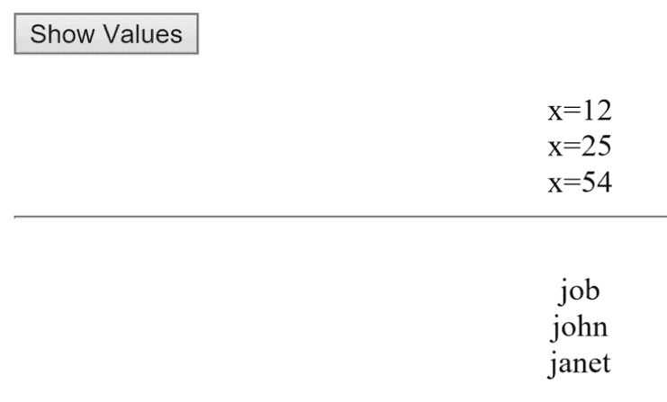

# 七、C# LINQ 和内置类型

在本章中，我们将讨论 LINQ 的基础知识。 您将学习如何使用 LINQ 或语言集成查询。 这是一种在 C# 代码中直接操作数据的强大方法。

# 向 HTML 添加一个 Show Values 按钮

打开一个项目，在<html>中以`<form id=...`开头的行下面，我们将放置一个按钮。 将按钮上的文本更改为不同的内容，例如，Show Values。

现在切换到 Design 视图，双击 Show Values 按钮。 这把我们带入了`Default.aspx.cs`。 删除`Page_Load`块。 我们不需要它。 这个项目的启动代码的相关部分应该看起来像图 9.4.1:


Figure 9.4.1: The starting code section for this project

在这一章中，我们将使用一些代码，但它是从上到下的顺序。

# 添加名称空间

首先要做的是添加两个新的名称空间; 因此，在`using System`后输入以下内容:

```cs
using System.Linq;
using System.Collections.Generic;
```

LINQ 代表语言集成查询，而`using System.Collections .Generic`用于处理列表。 这是我们正在使用的两个新的名称空间。

# 使用 IEnumerable 泛型接口

接下来，在以`protected void Button1_Click...`开头的行下面的一组花括号之间，我们要做的第一件事是创建一个名称数组。 为此，输入以下内容:

```cs
IEnumerable<string> names = new string[] { "john", "job", "janet", "mary", "steve" };
```

我们将其命名为`names`，然后创建一个`new string`数组。 然后，为了指定初始化器列表，我们在引号中输入一系列名称，并用分号结束。

现在注意，左边是`IEnumerable` 这是一个泛型接口。 如您所见，这一行中的`new string`数组可以通过这种方式创建，因为可以取一个数组，然后步进遍历它，这样数组中的每个条目都是一个字符串。 因此，它是`IEnumerable`:我们可以在其中列出值，每个要列出的值都是一个字符串。 枚举的意思是列出。

# 将数组转换为整数列表

接下来，在这一行下面输入以下内容:

```cs
List<int> lst = new int[] { 1, 2, 12, 4, 5, -10, 5, 25, 54 }.ToList();
```

要制作一个整数列表，我们说`lst = new int[]`。 然后我们指定初始化列表和这里显示的值。 不管你使用什么价值。 我将向你们展示一些方法。 当然，你可以想象，有很多。

现在，请注意，您不能停止在数组之后写入这一行。 如果你这样做了，弹出提示会说不能隐式转换类型'int[]' System.Collections.Generic.List<int>'; 所以你必须加上`.ToList()`。 可以将数组转换为整数列表。</int>

# 确定集合中的值

现在我们有了要遍历的项集合，我们可以这样做了。 为此，输入以下内容:

```cs
IEnumerable<int> valuesMoreThanTen = lst.Where(x => x >10);
```

这里，我们首先对数值列表进行操作，因此我们写入`valuesMoreThanTen`。 为此，您需要输入列表的名称`lst`。 请注意在弹出提示中所有可用的函数。 其中一个是`Where<>`。 在选择`Where<>`之后，您可以指定应用的条件，在本例中，`x`使得`x`大于`10`或`(x => x > 10)`，并使用分号关闭该条件。

如果将鼠标悬停在`Where`上，然后查看显示`IEnumerable<int>`的地方，它会返回一个`IEnumerable`结构，例如，我们可以通过`foreach`循环遍历该结构。 此外，它说`(Func<int,bool>...`，然后有一个`predicate`代表。 我们会取每个值并对其应用一些动作。 我们会检查一些条件是否成立:条件是否成立。

如你所见，我们基本上有 LINQ，然后我们在里面有，一个 Lambda 表达式。 因此，要使用它，你需要输入以下内容:

```cs
valuesMoreThanTen.ToList().ForEach(x => sampLabel.Text += $"<br>x={x}");
```

# 将值转换回列表

在`valuesMoreThanTen`之后，您希望能够使用`foreach`循环。 要做到这一点，您必须将其转换回列表，因为请记住，`IEnumerable`并不是列表。 这就是为什么如果您在`valuesMoreThanTen`后的`.`(点)之后输入`foreach`循环不会显示的原因。 您将其转换为列表，然后`foreach`显示。 现在您可以再次显示这些值; 所以在`foreach x`中，您将获取`x`值并将其显示在标签中，如前一行代码所示。 这一行现在将显示`valuesMoreThanTen`列表中的每个`x`值。

现在，您可以通过检查它来判断`12`、`25`和`54`应该打印。 这是第一件事。 现在，让我们在这条线下面显示一条水平线。 因此，输入以下内容:

```cs
sampLabel.Text += "<br><hr/>";
```

# 从列表中提取值并对其排序

现在，假设您有这个名称数组，您想提取出那些具有`j`字母的名称，然后对它们进行排序，从最短到最长。 当你操作数据时，你可以做这些事情。 因此，输入以下内容:

```cs
IEnumerable<string> namesWithJSorted = names.Where(name => name.Contains("j")).OrderBy(name => name.Length);
```

同样，在这一行中，`IEnumerable`属于`string`类型。 这就是为什么我们说`IEnumerable`是泛型的，因为它操作整数、字符串等等。 接下来，输入`namesWithJSorted`，我用这种特殊的方式命名这个变量，因为函数将从左到右链接。 因此，您键入名称数组的名称，然后键入`Where(name => name.Contains("j")`，以便检查每个名称是否包含字母`j`。 此外，一旦您拥有了包含字母`j`的所有这些名称，您将根据每个名称的长度用`OrderBy(name => name.Length)`对结果进行排序。

同样，从左到右，可以将这些函数链接起来。 这是 LINQ。 正如您可以看到的，在每个表达式内部，基本上都有一个 Lambda 表达式:`Where`，然后是`OrderBy`。 强大的,对吧?

接下来，要显示它，请记住，因为`namesWithJSorted`是`IEnumerable`，所以可以将其转换回列表，然后使用`foreach`; 或者，如果你愿意，你可以直接输入以下内容:

```cs
foreach(var str in namesWithJSorted)
{
    sampLabel.Text += $"<br>{str}";
}
```

请记住，在直接的前一行中，`+=`用于追加，`$`用于字符串插值，而`<br>`用于向下推一行。 要打印的实际值出现在花括号中。

这些是这些概念的基础。

# 运行程序

现在，我们必须确认这能像预期的那样工作。 因此，在浏览器中打开它，并单击 Show Values 按钮。 正如您在图 9.4.2 中看到的，它显示 x=12、x=25 和 x=54，然后在下面显示名字 job、john 和 janet。 每个名称包含一个`j`字母，按照预期按最短到最长顺序排列:



Figure 9.4.2: The results of running the program for this chapter

记住，这基本上是一个组合。 您有一个 Lambda 表达式`(x => x > 10)`，然后将其插入到诸如`where`或`OrderBy`之类的方法中。 当您将两者结合在一起时，代码变得非常强大，正如您所看到的，并且非常具有表现力，可以让您完成很多工作。 另外，请记住，在左侧，LINQ 中的许多结果返回`IEnumerable`类型的项。

# 章回顾

为了便于审阅，本章的`Default.aspx.cs`文件的完整版本，包括注释，如下代码块所示:

```cs
//using is a directive
//System is a name space
//name space is a collection of features that our needs to run
using System;
using System.Linq;
using System.Collections.Generic;
//public means accessible anywhere
//partial means this class is split over multiple files
//class is a keyword and think of it as the outermost level of grouping
//:System.Web.UI.Page means our page inherits the features of a Page
public partial class _Default : System.Web.UI.Page
{
    protected void Button1_Click(object sender, EventArgs e)
    {
        //line 16 creates array of names
        IEnumerable<string> names = new string[] { "john", "job", "janet",
        "mary", "steve" };
        //line 18 creates array of integers, and converts to 
        //list of integers
        List<int> lst = new int[] { 1, 2, 12, 4, 5, -10, 5, 25, 54 }.ToList();
        //line below puts a lambda expression inside Where to 
        //create a query
        IEnumerable<int> valuesMoreThanTen = lst.Where(x => x > 10);
        //line 22 prints the results from lines 20 above
        valuesMoreThanTen.ToList().ForEach(x => sampLabel.Text += $"<br>x={x}");
        sampLabel.Text += "<br><hr/>";
        //line 25 below chains functions, going from left to right, to 
        //produce a list of names with j, sorted by length
        IEnumerable<string> namesWithJSorted = 
        names.Where(name => name.Contains( "j")).OrderBy
        (name => name.Length);
        //lines below display the names that are generated line 25 above
        foreach (var str in namesWithJSorted)
        {
            sampLabel.Text += $"<br>{str}";
        }
    }
}
```

# 总结

在本章中，我们讨论了 LINQ 的基础知识。 您学习了如何使用 LINQ 或语言集成查询。 这是一种在 C# 代码中直接操作数据的强大方法。 您添加了名称空间，使用了`IEnumerable`泛型接口，将数组转换为整数列表，确定集合中的值，将这些值转换回列表，并从列表中提取这些值并对它们排序。

在下一章中，我们将讨论在自定义类型中使用 LINQ。