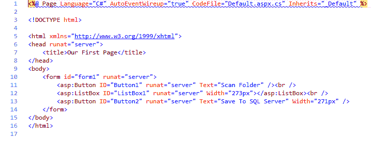
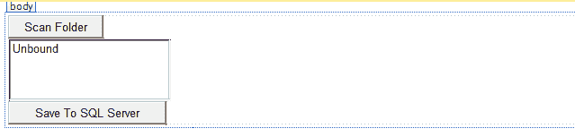
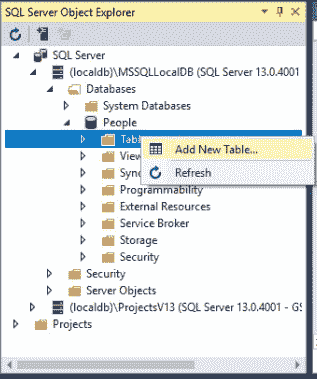
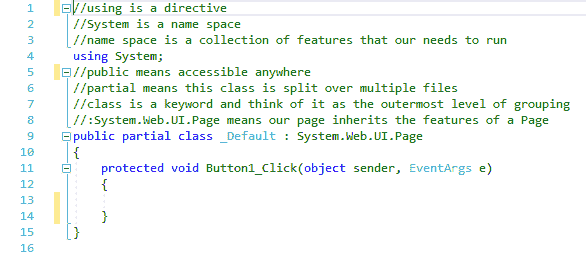
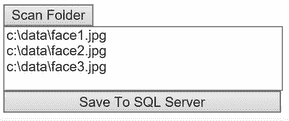

# 二十六、保存图像到 SQL Server

在本章中，您将学习如何读取文件，然后将它们作为图像保存在 SQL Server 中。

# 向 HTML 添加按钮和列表框

打开一个包含基本 HTML 的项目。 这里需要做的第一件事是插入一个按钮。 为此，转到“工具箱”并在以`<form id=...`开头的行下面拖放一个`Button`控件。 请记住，我们将在这个项目中构建的简单界面将涉及单击一个按钮并从硬盘读取文件到一个列表框。 将`Button`控件上的文本改为`Scan Folder`。 您将扫描此项目中的图像文件夹。

在此之后，您将插入一个`ListBox`控件。 因此，再次转到工具箱，在搜索字段中键入`list`，并将`ListBox`控件拖放到前一行下面。 单击按钮后，您将填充`ListBox`控件。

在最后一个阶段，将所有文件保存到 SQL Server。 这是我们的目标。 为此，在前面一行的下面再拖动一个按钮。 将`Button`控件上的文本改为`Save To SQL Server`。

删除以`<div...`开头的两行，这次也再次删除`Label`行。 你不需要这些。

您的`Default.aspx`文件应该类似于图 26.5.1*中所示:*



Figure 26.5.1: The complete HTML for this chapter

转到 Design 视图，如图*图 26.5.2*所示，这个项目有一个非常简单的界面:一个 Scan Folder 按钮，它获取文件名，然后一个按钮保存文件到 SQL Server:



Figure 26.5.2: The simple interface for our project

# 创建一个数据库表来存储文件

您需要有一个数据库表来保存文件。 首先打开 SQL Server 对象资源管理器。 您还记得有一个名为`People`的数据库。 转到 Tables 文件夹，右键单击，选择`Add New Table...`，如图*所示:*



Figure 26.5.3: Adding a new table in SQL Server Object Explorer

你可以把默认的东西保持在顶部，但要做以下改变:

1.  更改 T-SQL 选项卡底部的第一行，如下所示:

```cs
    [Id] INT NOT NULL PRIMARY KEY identity(1.1),
```

2.  接下来添加这一行:

```cs
    IMAGE image not null
```

3.  将表名称修改为`Images`，修改如下:

```cs
    CREATE TABLE[dbo].Images
```

这是我们的表格，如图*图 26.5.4*所示:


Figure 26.5.4: The dbo.Images table in SQL Server

让我们更新它，然后，在出现的对话框中单击 update Database 按钮。 等待修改生效。 因此，如果展开 Tables 节点，应该会看到一个 dbo。 图 26.5.5 图 26.5.5


Figure 26.5.5: The Tables node contains the dbo.Images table with an IMAGE column

# 在你的硬盘上存储图像文件

在这个过程的下一个阶段，您必须确保有图像可以读取。 因此，在您的`C:\`驱动器上放置一些图像。 例如，*图 26.5.6*显示了在这台特定计算机上的`C:\data`目录上运行`dir *.jpeg`命令所获得的清单:


Figure 26.5.6: Listing of three images files stored in the C:\data directory

该列表显示了这些图像:`face1.jpeg`、`face2.jpeg`和`face3.jpeg`。 因此，在这种特殊情况下，有三个文件需要从硬盘驱动器中读取。

现在双击 Design 视图中的 Scan Folder 按钮。 这将把你带入`Default.aspx.cs`。 删除`Page_Load`存根。 我们将处理随之而来的事件。 这涉及到相当多的代码，所以它更像是一个项目。 这个项目开始代码的相关部分应该类似于图 26.5.7:



Figure 26.5.7: The starting code for this project

# 添加名称空间

首先，您需要添加相关的名称空间。 因此，在文件顶部附近的`using System`下，输入以下内容:

```cs
using System.Data.SqlClient;
```

记住，我们在连接和命令中使用它。
接下来，在这一行下面输入以下内容:

```cs
using System.IO;
```

同样，这一行是用来读取硬盘驱动器的。 这是两个新的名称空间。 现在可以折叠以`public partial class...`开头的行之上的所有内容。

# 编写应用

现在让我们逐行浏览代码的创建过程。 因此，从以`protected void Button1_Click...`开头的行开始，在一组花括号之间输入以下内容:

```cs
var imgFiles = Directory.GetFiles(@"c:\data\", "*.jpg");
```

这里有一个`Directory`类和一个名为`GetFiles`的文件读取方法，该方法返回一个字符串数组，这些字符串是文件的路径。 然后指定它们搜索的目录路径，即`(@"c:\data\"...)`，然后希望只搜索图像文件，因此可以指定一个过滤器，在本例中为`*.jpg`。 如果将鼠标悬停在`var`上，可以看到它是一个字符串数组。

现在可以加载到`ListBox`控件中了。 接下来输入以下内容:

```cs
foreach(var imgFile in imgFiles)
```

接下来，对于文件数组中的每个文件，在一组花括号之间输入以下内容:

```cs
ListBox1.Items.Add(imgFile);
```

因此，您可以获得所有文件路径，然后使用`foreach`循环将它们添加到`ListBox`控件中，以便可以在页面中显示它们。 这是我们的目标。

# 测试扫描文件夹功能

转到 Design 视图，此时扫描文件夹应该可以工作了。 为此，单击“扫描文件夹”按钮。

如图*图 26.5.8*所示，文件被加载:



Figure 26.5.8: The files are properly loaded in ListBox

完成后，您可以再次使用`foreach`循环获取每个文件，并将其保存到 SQL Server。 我们接下来做这个。

# 构建连接字符串

现在双击 Design 视图中的 Save to SQL Server 按钮。 这将把您带回到`Default.aspx.cs`。 正如您可能想象的那样，下一个阶段将是获取连接字符串。 你以前做过。 因此，在以`protected void Button2_Click...`开头的行下面的一组花括号中，首先输入`string connString =`，然后输入`@`符号，使其成为一个逐字字符串，然后放入`""`符号。 现在要获取连接字符串，执行以下操作:

1.  单击菜单栏中的“查看”，然后选择“SQL Server 对象资源管理器”。
2.  右键单击 People 数据库，并选择 Properties。
3.  在“属性”窗格中，双击“连接字符串”以选择具有长描述的连接字符串。
4.  然后，右键单击长描述并复制它。
5.  将描述粘贴到`""`符号集之间。

连接字符串行应该如下所示:

```cs
string connString = @"Data Source=(localdb)\MSSQLLocalDB;Initial Catalog=People;Integrated Security=True;Connect Timeout=30;Encrypt=False;TrustServerCertificate=True;ApplicationIntent=ReadWrite;MultiSubnetFailover=False";
```

如果你喜欢的话，你可以把它分成多行，这样会更整洁一些。 现在可以关闭 SQL Server 对象资源管理器和属性窗格。

# 连接字符串的使用

当然，现在我们将使用连接字符串。 因此，对于下一阶段，输入以下内容:

```cs
using (SqlConnection conn = new SqlConnection(connString))
```

我们将调用连接字符串`conn`，而`SqlConnection`是用连接字符串初始化的。

接下来，我们需要打开一个连接。 在前一行下面的一组花括号之间输入以下内容:

```cs
conn.Open();
```

然后，输入以下`foreach`循环:

```cs
foreach(var item in ListBox1.Items)
```

这里，`Items`是`ListBox`控件的属性。 它是一个包含项目的列表，您可以逐个检查它们，以便对它们采取离散的操作。 接下来在另一组花括号中输入以下内容:

```cs
using (SqlCommand cmd = new SqlCommand("insert into dbo.Images (image) values(@image)", conn))
```

注意，我们把`SqlCommand`放到了`using`语句中。 如果右键单击`SqlCommand`并选择 Go To Definition，您将看到它显示，DbCommand 继承自它，如果向下滚动到底部，您将看到它有一个`Dispose`行。 要完成这里的代码，您将`(image)`作为字段，其参数为`@image`。

在下一阶段，在另一组花括号中输入以下内容:

```cs
byte[] picAsBytes = File.ReadAllBytes(item.ToString());
```

如果您将前一行仅保留为`(item)`，它将给出一个红色下划线的错误。 我们把它转化为`ToString` 这里，我们取每个项，将其读取为一个字节序列，并将其存储在一个数组中，因为这样就可以在 SQL Server 中将其转换为图像。

接下来输入以下内容:

```cs
cmd.Parameters.AddWithValue("@image", picAsBytes);
```

同样，这里的`@image`是参数。 因此，我们将图片以字节序列的形式保存到`image`参数中。 现在输入以下内容:

```cs
cmd.ExecuteNonQuery();
```

这一行执行实际的保存。 信不信由你，这就是整个应用。

# 运行程序

现在让我们看看浏览器中的结果。 首先，点击扫描文件夹。 您可以看到图像列表。 然后，单击 Save To SQL Server 按钮。 页面上没有显示任何内容，因为我们没有编写任何代码来显示保存后的内容。 所以现在我们必须检查 SQL Server。

让我们进入视图| SQL Server 对象资源管理器。 右键单击 dbo。 图像表格图标，并选择查看数据。 正如您在图 26.5.9 中看到的，这些是存储在低级表单中的图像。 这证明他们已经被拯救了:


Figure 26.5.9: Images in the dbo.Images table stored in a low-level form

也许，作为您自己的任务，您可以从 SQL Server 提取这些文件并将它们显示为图像。 这将是一个有趣的练习。

# 章回顾

`Default.aspx`是“扫描文件夹”按钮的源代码，`ListBox`和“保存到 SQL Server”按钮。 `Button1_Click...`块中的代码实际上扫描了文件夹，然后显示可用的图像文件; 也就是说，那些至少以`.jpg`结尾的。 然后，当您想将文件从`ListBox`控件保存到 SQL Server 时，以连接字符串开头的代码将运行。

本章的完整版本`Default.aspx.cs`文件，包括注释，如下代码块所示:

```cs
//using is a directive
//System is a name space
//name space is a collection of features that our needs to run
using System;
using System.Data.SqlClient;
using System.IO;
//public means accessible anywhere
//partial means this class is split over multiple files
//class is a keyword and think of it as the outermost level of grouping
//:System.Web.UI.Page means our page inherits the features of a Page
public partial class _Default : System.Web.UI.Page
{
    protected void Button1_Click(object sender, EventArgs e)
    {
        //scan folder for all files ending in jpg
        var imgFiles = Directory.GetFiles(@"c:\data\", "*.jpg");
        foreach(var imgFile in imgFiles)
        {
            //add files to list box in page
            ListBox1.Items.Add(imgFile);
        }
    }
    protected void Button2_Click(object sender, EventArgs e)
    {
        //make a connection string
        string connString = @"Data Source=DESKTOP-4L6NSGO\SQLEXPRESS; Initial Catalog=People;Integrated Security=True;Connect Timeout=15;Encrypt=False;TrustServerCertificate=False; ApplicationIntent=ReadWrite;MultiSubnetFailover=False";
        //make connection
        using (SqlConnection conn = new SqlConnection(connString))
        {
            //open connection
            conn.Open();
            foreach(var item in ListBox1.Items)
            {
                using (SqlCommand cmd = 
                new SqlCommand
                ("insert into dbo.Images (image) values (@image)", conn))
                {
                    //read picture as bytes
                    byte[] picAsBytes = File.ReadAllBytes(item.ToString());
                    //add pictures to SQL server as bytes
                    cmd.Parameters.AddWithValue("@image", picAsBytes);
                    //perform the actual saving
                    cmd.ExecuteNonQuery();
                }
            }
        }
    }
}
```

# 总结

在本章中，您学习了如何读取文件，然后将它们作为图像保存在 SQL Server 中。 您创建了一个数据库表来存储文件，将图像文件存储在硬盘上，添加了名称空间，测试了扫描文件夹功能，并构建和使用了连接字符串。

在下一章中，我们将看一下 XML 的基础知识，它代表可扩展标记语言。