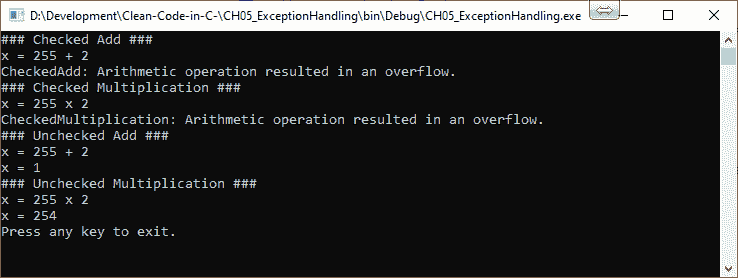
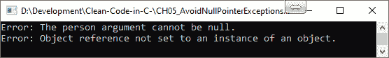

# 五、异常处理

在上一章中，我们介绍了函数。尽管程序员尽了最大的努力来编写健壮的代码，函数在某些时候还是会产生异常。这可能有很多原因，例如缺少文件或文件夹、空值或空值、无法写入位置或拒绝用户访问。因此，记住这一点，在本章中，您将学习使用异常处理生成干净 C# 代码的适当方法。首先，我们将从检查与算术`OverflowExceptions`相关的已检查和未检查异常开始。我们将了解它们是什么，使用它们的原因，以及在代码中使用它们的一些示例。

然后，我们来看看如何避免`NullPointerReference`异常。之后，我们将研究如何为特定类型的异常实现特定的业务规则。随着我们对异常和异常业务规则的全新理解，我们将着手构建自己的自定义异常，然后通过研究为什么不应该使用异常来控制计算机程序的流程来结束。

在本章中，我们将介绍以下主题：

*   已检查和未检查的异常
*   避免`NullPointerExceptions`
*   业务规则例外
*   例外情况应提供有意义的信息
*   构建自己的自定义异常

本章结束时，您将具备以下技能：

*   您将能够理解什么是已检查和未检查的异常，以及为什么它们在 C# 中。
*   您将能够理解什么是`OverflowException`，以及如何在编译时捕获它们。
*   你会知道什么是`NullPointerExceptions`以及如何避免它们。

*   您将能够编写自己的自定义异常，为客户提供有意义的信息，并帮助您和其他程序员轻松识别和解决提出的任何问题。
*   您将能够理解为什么不应该使用异常来控制程序流。
*   您将知道如何用 C# 语句和布尔检查替换业务规则异常以控制程序流。

# 已检查和未检查的异常

在未检查模式下，算术溢出被*忽略*。在这种情况下，无法分配给目标类型的高阶位将从结果中丢弃。

默认情况下，C# 在运行时执行非常量表达式时在未检查的上下文中运行。但是编译时常量表达式在默认情况下总是被*选中。当在检查模式下遇到算术溢出时，会引发一个`OverflowException`。使用未检查异常的一个原因是为了提高性能。选中的异常会少量降低方法的性能。*

经验法则是确保在选中的上下文中执行算术运算。任何算术溢出异常都将作为编译时错误被拾取，然后您可以在发布代码之前修复它们。这比发布代码然后修复客户运行时错误要好得多。

在未检查模式下运行代码是危险的，因为您正在对代码进行假设。假设不是事实，它们可能导致在运行时引发异常。运行时异常会导致客户满意度低下，并可能产生严重的后续异常，从而在某种程度上对客户产生负面影响。

从业务角度来看，允许出现溢出异常的应用继续运行是非常危险的。这是因为数据可能最终处于不可逆的无效状态。如果数据是关键的客户数据，那么这可能会给业务带来相当大的成本，而且您不想让这些成本压在自己的肩上。

考虑下面的代码。此代码演示了未经检查的溢出在客户银行业务中的严重程度：

```cs
private static void UncheckedBankAccountException()
{
    var currentBalance = int.MaxValue;
    Console.WriteLine($"Current Balance: {currentBalance}");
    currentBalance = unchecked(currentBalance + 1);
    Console.WriteLine($"Current Balance + 1 = {currentBalance}");
    Console.ReadKey();
}
```

想象一下，当这位客户看到他们的银行余额 2147483647 英镑增加 1 英镑，导致他们负债 2147483648 英镑时，他们脸上会有多么恐怖！


现在，是时候用一些代码示例演示已检查和未检查的异常了。首先，启动一个新的**控制台应用**并声明一些变量：

```cs
static byte y, z;
```

前面的代码声明了我们将在算术代码示例中使用的两个字节。现在，添加`CheckedAdd()`方法。如果在添加两个数字时遇到算术溢出，导致数字太大而无法存储为字节，则此方法将引发选中的`OverflowException`：

```cs
private static void CheckedAdd()
{
    try
    {
        Console.WriteLine("### Checked Add ###");
        Console.WriteLine($"x = {y} + {z}");
        Console.WriteLine($"x = {checked((byte)(y + z))}");
    }
    catch (OverflowException oex)
    {
        Console.WriteLine($"CheckedAdd: {oex.Message}");
    }
}
```

然后，编写`CheckedMultiplication()`方法。同样，如果在乘法过程中检测到算术溢出，则会引发一个选中的`OverflowException`，这导致一个大于一个字节的数字：

```cs
private static void CheckedMultiplication()
{
    try
    {
        Console.WriteLine("### Checked Multiplication ###");
        Console.WriteLine($"x = {y} x {z}");
        Console.WriteLine($"x = {checked((byte)(y * z))}");
    }
    catch (OverflowException oex)
    {
        Console.WriteLine($"CheckedMultiplication: {oex.Message}");
    }
}
```

接下来，我们添加`UncheckedAdd()`方法。此方法将忽略由于添加而发生的任何溢出，因此不会引发`OverflowException`。此溢出的结果将存储为字节，但值不正确：

```cs
private static void UncheckedAdd()
{
    try
    {
         Console.WriteLine("### Unchecked Add ###");
         Console.WriteLine($"x = {y} + {z}");
         Console.WriteLine($"x = {unchecked((byte)(y + z))}");
    }
    catch (OverflowException oex)
    {
         Console.WriteLine($"CheckedAdd: {oex.Message}");
    }
}
```

现在，我们添加`UncheckedMultiplication()`方法。当此乘法的结果出现溢出时，此方法不会抛出`OverflowException`。例外情况将被忽略。这将导致将不正确的数字存储为字节：

```cs
private static void UncheckedMultiplication()
{
    try
    {
         Console.WriteLine("### Unchecked Multiplication ###");
         Console.WriteLine($"x = {y} x {z}");
         Console.WriteLine($"x = {unchecked((byte)(y * z))}");
    }
    catch (OverflowException oex)
    {
        Console.WriteLine($"CheckedMultiplication: {oex.Message}");
    }
}
```

最后，是时候修改我们的`Main(string[] args)`方法了，这样我们可以初始化变量并执行这些方法。在这里，我们将一个字节的最大值添加到`y`变量中，`2`添加到`z`变量中。然后，我们运行`CheckedAdd()`和`CheckedMultiplication()`方法，这两个方法都将生成`OverflowException()`。抛出此错误是因为`y`变量包含一个字节的最大值。

因此，通过将`2`相加或相乘，您超过了存储变量所需的地址空间。接下来，我们将运行`UncheckedAdd()`和`UncheckedMultiplication()`方法。这两种方法都忽略溢出异常，将结果分配给`x`变量，并忽略溢出的任何位。最后，我们在屏幕上打印一条消息，然后在用户按下任意键时退出：

```cs
static void Main(string[] args)
{
    y = byte.MaxValue;
    z = 2;
    CheckedAdd();
    CheckedMultiplication();
    UncheckedAdd();
    UncheckedMultiplication();
    Console.WriteLine("Press any key to exit.");
    Console.ReadLine();
}
```

当我们运行前面的代码时，我们得到以下输出：



正如您所看到的，当我们使用 checked 异常时，当遇到`OverflowException`时会引发异常。但当我们使用未检查的异常时，不会引发异常。

从前面的屏幕截图可以明显看出，问题可能来自意外值，某些行为可能来自使用未检查的异常。因此，执行算术运算时的经验法则必须始终使用检查异常。

现在，让我们继续看一个程序员经常遇到的非常常见的异常，称为`NullPointerException`。

# 避免 NullPointerException

`NullReferenceException`是大多数程序员都经历过的常见异常。当试图访问`null`对象上的属性或方法时，会抛出该属性或方法。

为了防止计算机程序崩溃，其他程序员的常见做法是使用`try{...}catch (NullReferenceExceptionre){...}`块。这是防御性编程的一部分。但问题是，很多时候，错误只是简单地*记录*和*重试*。除此之外，还进行了大量本可以避免的浪费计算。

更好的处理`ArgumentNullExceptions`的方法是实现`ArgumentNullValidator`。方法的参数通常是`null`对象的来源。在使用前测试方法的参数是有意义的，如果发现它们因任何原因无效，则抛出适当的`Exception`。在`ArgumentNullValidator`的情况下，您将把这个验证器放在方法的顶部，然后测试每个参数。如果发现任何参数为`null`，则会抛出`NullReferenceException`。这将节省计算量，并且无需将方法代码包装在`try...catch`块中。

为了清楚起见，我们将编写`ArgumentNullValidator`并在方法中使用它来测试该方法的参数：

```cs
public class Person
{
    public string Name { get; }
    public Person(string name)
    {
         Name = name;
    }
}
```

在前面的代码中，我们使用一个名为`Name`的只读属性创建了`Person`类。这将是我们将用来传递到示例方法中以引起`NullReferenceException`的对象。接下来，我们将为名为`ValidatedNotNullAttribibute`的验证器创建我们的`Attribute`：

```cs
[AttributeUsage(AttributeTargets.All, Inherited = false, AllowMultiple = true)]
internal sealed class ValidatedNotNullAttribute : Attribute { }
```

现在我们有了`Attribute`，是时候编写验证器了：

```cs
internal static class ArgumentNullValidator
{
    public static void NotNull(string name, 
     [ValidatedNotNull] object value)
    {
        if (value == null)
        {
            throw new ArgumentNullException(name);
        }
    }
}
```

`ArgumentNullValidator`接受两个参数：

*   对象的名称
*   对象本身

检查对象是否为`null`。如果是`null`，则抛出`ArgumentNullException`，传递对象的名称。

下面的方法是我们的`try/catch`示例方法。请注意，我们记录了一条消息并引发异常。但是，我们不使用声明的异常参数，因此根据权限，这应该被删除。您将在代码中经常看到这一点。这是不必要的，应删除以整理代码：

```cs
private void TryCatchExample(Person person)
{
    try
    {
        Console.WriteLine($"Person's Name: {person.Name}");
    }
    catch (NullReferenceException nre)
    {
        Console.WriteLine("Error: The person argument cannot be null.");
        throw;
    }
}
```

接下来，我们将编写使用`ArgumentNullValidator`的示例方法。我们称之为`ArgumentNullValidatorExample`：

```cs
private void ArgumentNullValidatorExample(Person person)
{
    ArgumentNullValidator.NotNull("Person", person);
    Console.WriteLine($"Person's Name: {person.Name}");
    Console.ReadKey();
}
```

请注意，我们已经从九行（包括大括号）改为只有两行。在验证之前，我们也不会尝试使用该值。我们现在需要做的就是修改我们的`Main`方法来运行这些方法。通过注释其中一个方法并运行程序来测试每个方法。当您执行此操作时，最好一步一步地检查代码以了解发生了什么。

以下是运行`TryCatchExample`方法的输出：



以下是运行`ArgumentNullValidatorExample`的输出：


如果您仔细研究前面的截图，您会发现我们在使用`ArgumentNullValidatorExample`时只记录了一次错误。使用`TryCatchExample`引发异常时，会记录两次异常。

第一次，我们有一个有意义的信息，但第二次，信息是*神秘的*。但是，调用方法`Main`记录的异常一点也不神秘。事实上，这是非常有用的，因为它告诉我们，`Person`参数的值不能是`null`。

希望本节向您展示了在使用构造函数和方法之前检查参数的价值。通过这样做，您可以看到参数验证器如何减少代码，从而使代码更具可读性。

现在，我们将研究如何实现特定异常的业务规则。

# 业务规则例外

技术异常是计算机程序由于程序员错误和/或环境问题（如磁盘空间不足）引发的异常。

但业务规则例外情况不同。业务规则异常意味着这种行为是预期的，并用于控制程序流，而实际上，异常应该是程序正常流的异常，而不是方法的预期输出。

例如，想象一个人在 ATM 机上从账户中提取 100 英镑，账户中有 0 英镑，但没有能力透支。ATM 接受用户提取 100 英镑的请求，因此发出`Withdraw(100);`命令。`Withdraw`方法检查余额，发现账户资金不足，抛出`InsufficientFundsException()`。

您可能认为有这样的例外是一个好主意，因为它们是明确的，有助于识别问题，以便您在收到此类例外时可以执行非常具体的操作——但不是！这不是一个好主意。

在这种情况下，当用户提交请求时，应该检查请求的金额，看看是否可以提取。如果可以，则应按照用户的请求继续进行事务处理。但是，如果验证检查发现事务无法进行，则程序应遵循正常的程序流取消事务，并通知发出请求的用户，而不会引发异常。

我们刚才看到的退出场景表明程序员已经正确地考虑了程序的正常流程和不同的结果。已使用布尔检查对程序流进行了适当编码，以允许成功的取款交易，并防止不允许的取款交易。

让我们看看如何使用**业务规则例外**（**BREs**实现从不允许透支场景的银行账户提款。然后，我们将了解如何实现相同的场景，但使用正常的程序流而不是使用 BRE。

启动一个新的控制台应用并添加两个名为`BankAccountUsingExceptions`和`BankAccountUsingProgramFlow`的文件夹。使用以下代码更新您的`void Main(string[] args)`方法：

```cs
private static void Main(string[] args)
{
    var usingBrExceptions = new UsingBusinessRuleExceptions();
    usingBrExceptions.Run();
    var usingPflow = new UsingProgramFlow();
    usingPflow.Run();
}
```

前面的代码运行每个场景。`UsingBusinessRuleExceptions()`演示了使用异常作为用于控制程序流的预期输出，而`UsingProgramFlow()`演示了在不使用异常条件的情况下控制程序流的干净方法。

我们现在需要一个类来保存我们的活期账户信息。因此，将名为`CurrentAccount`的类添加到 Visual Studio 控制台项目中，如下所示：

```cs
internal class CurrentAccount
{
    public long CustomerId { get; }
    public decimal AgreedOverdraft { get; }
    public bool IsAllowedToGoOverdrawn { get; }
    public decimal CurrentBalance { get; }
    public decimal AvailableBalance { get; private set; }
    public int AtmDailyLimit { get; }
    public int AtmWithdrawalAmountToday { get; private set; }
}
```

此类的属性只能通过构造函数在内部或外部设置。现在，添加将客户标识符作为唯一参数的构造函数：

```cs
public CurrentAccount(long customerId)
{
    CustomerId = customerId;
    AgreedOverdraft = GetAgreedOverdraftLimit();
    IsAllowedToGoOverdrawn = GetIsAllowedToGoOverdrawn();
    CurrentBalance = GetCurrentBalance();
    AvailableBalance = GetAvailableBalance();
    AtmDailyLimit = GetAtmDailyLimit();
    AtmWithdrawalAmountToday = 0;
}
```

当前帐户构造函数初始化所有属性。如前面的代码所示，一些属性是使用方法初始化的。让我们依次实现每个方法：

```cs
private static decimal GetAgreedOverdraftLimit()
{
    return 0;
}
```

`GetAgreedOverdraftLimit()`返回账户上约定透支限额的值。在本例中，它被硬编码为零。但在实际场景中，它将从配置文件或其他数据存储中提取实际数字。这将允许非技术用户更新约定的透支限额，而无需开发人员更改代码。

`GetIsAllowedToGoOverdrawn()`确定账户是否可以透支，即使未达成协议，如某些银行所允许。在这种情况下，我们只需返回`false`即可确定该账户无法透支：

```cs
private static bool GetIsAllowedToGoOverdrawn()
{
    return false;
}
```

在本例中，我们将通过`GetCurrentBalance()`方法将用户账户余额设置为 250 英镑：

```cs
private static decimal GetCurrentBalance()
{
    return 250.00M;
}
```

作为我们示例的一部分，我们需要确保，即使此人的账户中有 250 英镑，但其可用余额小于 250 英镑，他们也无法提取超过可用余额的款项，因为这将导致他们透支。为此，我们将采用`GetAvailableBalance()`方法将可用余额设置为 173.64 英镑：

```cs
private static decimal GetAvailableBalance()
{
    return 173.64M;
}
```

在英国，ATM 机允许您最多提取 200 英镑或 250 英镑。因此，在`GetAtmDailyLimit()`方法中，我们将 ATM 每日限额设置为 250 英镑：

```cs
private static int GetAtmDailyLimit()
{
    return 250;
}
```

让我们通过使用业务规则异常和正常程序流来处理程序中的不同条件，为我们的两个场景编写代码。

## 示例 1–处理业务规则异常的条件

向项目中添加一个名为`UsingBusinessRuleExceptions`的新类，然后添加以下`Run()`方法：

```cs
public class UsingBusinessRuleExceptions
{
    public void Run()
    {
        ExceedAtmDailyLimit();
        ExceedAvailableBalance();
    }
}
```

`Run()`方法调用两个方法：

*   第一种方法称为`ExceedAtmDailyLimit()`。这种方法故意超过允许从 ATM 机提取的每日金额。`ExceedAtmDailyLimit()`导致`ExceededAtmDailyLimitException`。
*   其次，调用了`ExceedAvailableBalance()`方法，故意导致`InsufficientFundsException`。增加`ExceedAtmDailyLimit()`方法：

```cs
private void ExceedAtmDailyLimit()
{
     try
     {
            var customerAccount = new CurrentAccount(1);
            customerAccount.Withdraw(300);
            Console.WriteLine("Request accepted. Take cash and card.");
      }
      catch (ExceededAtmDailyLimitException eadlex)
      {
            Console.WriteLine(eadlex.Message);
      }
}
```

`ExceedAtmDailyLimit()`方法创建一个新的`CustomerAccount`方法并传入客户标识符，如编号`1`所示。然后，试图提取 300 英镑。如果请求成功，则消息`Request accepted. Take cash and card.`将打印到控制台窗口。如果请求失败，则该方法将捕获`ExceededAtmLimitException`并将异常消息打印到控制台窗口：

```cs
private void ExceedAvailableBalance()
{
    try
    {
        var customerAccount = new CurrentAccount(1);
        customerAccount.Withdraw(180);
        Console.WriteLine("Request accepted. Take cash and card.");
    }
    catch (InsufficientFundsException ifex)
    {
        Console.WriteLine(ifex.Message);
    }
}
```

`ExceedAvailableBalance()`方法创建一个新的`CurrentAccount`并传入客户标识符，如编号`1`所示。然后试图提取 180 英镑。由于`GetAvailableMethod()`返回 173.64 英镑，该方法导致`InsufficientFundsException`。

至此，我们了解了如何使用业务规则异常管理不同的条件。现在，让我们看一下使用正常程序流管理相同条件的正确方法，而不使用异常。

## 示例 2–正常程序流的处理条件

添加一个名为`UsingProgramFlow`的类，然后向其添加以下代码：

```cs
public class UsingProgramFlow
{
    private int _requestedAmount;
    private readonly CurrentAccount _currentAccount;

    public UsingProgramFlow()
    {
        _currentAccount = new CurrentAccount(1);
    }
}
```

在`UsingProgramFlow`类的构造函数中，我们将创建一个新的`CurrentAccount`类并传入客户标识符。接下来，我们将添加`Run()`方法：

```cs
public void Run()
{
    _requestedAmount = 300;
    Console.WriteLine($"Request: Withdraw {_requestedAmount}");
    WithdrawMoney();
    _requestedAmount = 180;
    Console.WriteLine($"Request: Withdraw {_requestedAmount}");
    WithdrawMoney();
    _requestedAmount = 20;
    Console.WriteLine($"Request: Withdraw {_requestedAmount}");
    WithdrawMoney();
}
```

`Run()`方法设置`_requestedAmount`变量三次。每次执行此操作时，在调用`WithdrawMoney()`方法之前，会在控制台窗口上打印一条消息，说明提取的金额。现在，添加`ExceedsDailyLimit()`方法：

```cs
private bool ExceedsDailyLimit()
{
    return (_requestedAmount > _currentAccount.AtmDailyLimit)
        || (_requestedAmount + _currentAccount.AtmWithdrawalAmountToday > _currentAccount.AtmDailyLimit);
}
```

如果`_requestedAmount`超过每日 ATM 取款限额，则`ExceedDailyLimit()`方法返回`true`。否则，它将返回 false。现在，添加`ExceedsAvailableBalance()`方法：

```cs
private bool ExceedsAvailableBalance()
{
    return _requestedAmount > _currentAccount.AvailableBalance;
}
```

如果请求的金额超过可提取的金额，`ExceedsAvailableBalance()`方法返回`true`。最后，我们来看最后一种方法，称为`WithdrawMoney()`：

```cs
private void WithdrawMoney()
{
    if (ExceedsDailyLimit())
        Console.WriteLine("Cannot exceed ATM Daily Limit. Request denied.");
    else if (ExceedsAvailableBalance())
        Console.WriteLine("Cannot exceed available balance. You have no agreed 
         overdraft facility. Request denied.");
    else
        Console.WriteLine("Request granted. Take card and cash.");
}
```

`WithdrawMoney()`方法不使用 BRE 来控制程序流。相反，此方法调用确定程序流的布尔验证方法。如果`_requestedAmount`超过`ExceedsDailyLimit()`呼叫确定的 ATM 每日限额，则请求被拒绝。否则进行下一步检查`_requestedAmount`是否大于`AvailableBalance`。如果是，则拒绝该请求。如果不是，则执行批准请求的代码。

我希望您能看到，使用可用逻辑控制程序流比期望抛出异常更有意义。代码更清晰、更正确。对于不属于业务需求一部分的特殊情况，应保留例外情况。

当以正确的方式提出适当的例外情况时，重要的是它们要有意义。神秘的错误消息对任何人都没有好处，实际上会给最终用户或开发人员增加不必要的压力。现在，我们将研究在计算机程序引发的任何异常中提供有意义的信息。

# 例外情况应提供有意义的信息

声明“没有错误”然后杀死一个程序的关键错误是毫无用处的。我亲身经历过实际的“没有错误”严重异常。这是一个严重的异常，会使应用停止工作。然而，信息告诉我们没有错误。那么，如果没有错误，那么为什么会在屏幕上出现严重异常警告呢？为什么我无法继续使用该应用？显然，要引发严重异常，必须在发生的某个地方存在严重异常。但是在哪里，为什么？

使这些异常更令人恼火的是，它们深深扎根于您正在使用的框架或库中（您无法控制），并且您无法访问源代码。这种异常导致程序员出于沮丧而说一些负面的话。我对此感到内疚，我的同事们也有同样的经历。令人沮丧的一个主要原因是，代码出现了错误，并且用户或程序员已经得到了通知，但没有有用的信息来说明问题是什么，在哪里查找，甚至没有什么补救措施。

例外情况必须提供人性化的信息，特别是对技术上有挑战的人。在我开发阅读障碍测试和评估软件的过程中，我与许多教师和 IT 技术人员一起工作。

可以说，在响应软件异常消息时，许多具有各种能力的 It 技术人员和教师往往一无所知。

一个困扰我支持的软件的许多最终用户的错误是**错误 76：未找到路径**。这是微软的一个旧例外，早在 Windows95 就存在了，现在仍然存在。对于引发此异常的软件的最终用户，错误消息是完全无用的。最终用户应该知道找不到什么文件和位置，并知道采取什么步骤来纠正这种情况。

一个可能的解决方案是实施以下步骤：

1.  检查位置是否存在。
2.  如果位置不存在或访问被拒绝，则根据需要显示文件保存或打开对话框。
3.  将用户选择的位置保存到配置文件以备将来使用。
4.  在相同代码的后续运行中，使用用户设置的位置。

但是，如果要保留错误消息，则至少应提供丢失的位置和/或文件的名称。

话虽如此，现在是时候看看我们如何构建自己的异常，以提供对最终用户和程序员有用的恰到好处的信息量了。但要注意：你必须小心不要泄露敏感信息或数据。

# 构建自己的自定义异常

Microsoft.NET Framework 已经存在大量可以引发的异常，您可以捕获这些异常。但在某些情况下，您可能需要一个自定义异常，该异常提供更详细的信息，或者在术语上对最终用户更友好。

所以，我们现在要看看构建我们自己的定制异常的需求是什么。构建您自己的自定义异常非常简单。您所要做的就是为类指定一个以`Exception`结尾的名称，并从`System.Exception`继承。然后，需要添加三个构造函数，如下面的代码示例所示：

```cs
    public class TickerListNotFoundException : Exception
    {
        public TickerListNotFoundException() : base()
        {
        }

        public TickerListNotFoundException(string message)
            : base(message)
        {
        }

        public TickerListNotFoundException(
            string message, 
            Exception innerException
        )
            : base(message, innerException)
        {
        }
    }
```

`TickerListNotFoundException`继承自`System.Exception`类。它包含三个强制构造函数：

*   默认构造函数
*   接受异常消息的文本字符串的构造函数
*   接受异常消息的文本字符串和内部异常的`Exception`对象的构造函数

我们现在将编写并执行三个方法，它们将使用每个自定义异常的构造函数。您将能够清楚地看到使用自定义异常创建更有意义的异常的好处：

```cs
static void Main(string[] args)
{
    ThrowCustomExceptionA();
    ThrowCustomExceptionB();
    ThrowCustomExceptionC();
}
```

前面的代码显示了我们更新的`Main(string[] args)`方法，该方法已更新为执行我们的三个方法。这些将依次测试每个自定义异常的构造函数：

```cs
private static void ThrowCustomExceptionA()
{
    try
    {
        Console.WriteLine("throw new TickerListNotFoundException();");
        throw new TickerListNotFoundException();
    }
    catch (Exception tlnfex)
    {
        Console.WriteLine(tlnfex.Message);
    }
}
```

`ThrowCustomExceptionA()`方法使用默认构造函数抛出一个新的`TickerListNotFoundException`。运行代码时，打印到控制台窗口的消息会通知用户已抛出一个`CH05_CustomExceptions.TickerListNotFoundException`：

```cs
private static void ThrowCustomExceptionB()
{
    try
    {
        Console.WriteLine("throw new 
         TickerListNotFoundException(Message);");
        throw new TickerListNotFoundException("Ticker list not found.");
    }
    catch (Exception tlnfex)
    {
        Console.WriteLine(tlnfex.Message);
    }
}
```

`ThrowCustomExceptionB()`使用接受文本消息的构造函数抛出新的`TickerListNotFoundException`。在这种情况下，最终用户被告知尚未找到股票代码列表：

```cs
private static void ThrowCustomExceptionC()
{
    try
    {
        Console.WriteLine("throw new TickerListNotFoundException(Message, 
         InnerException);");
        throw new TickerListNotFoundException(
            "Ticker list not found for this exchange.",
            new FileNotFoundException(
                "Ticker list file not found.",
                @"F:\TickerFiles\LSE\AimTickerList.json"
            )
        );
    }
    catch (Exception tlnfex)
    {
        Console.WriteLine($"{tlnfex.Message}\n{tlnfex.InnerException}");
    }
}
```

最后，`ThrowCustomExceptionC()`方法使用接受文本消息和内部异常的构造函数抛出`TickerListNotFoundException`。在我们的示例中，我们提供了一条有意义的消息，说明尚未找到该交易所的股票代码列表。内部的`FileNotFoundException`对此进行了扩展，提供了未找到的特定文件的名称，该文件恰好是**伦敦证券交易所**（**伦敦证交所**上 Aim 公司的股票列表。

在这里，我们可以看到创建您自己的自定义异常具有真正的优势。但在大多数情况下，在.NET Framework 中使用内部异常就足够了。自定义异常的主要好处是它们是更有意义的异常，有助于调试和解决。

以下是 C# 异常处理最佳实践的简要列表：

*   使用 try/catch/finally 块从错误中恢复或释放资源。
*   在不引发异常的情况下处理常见条件。
*   设计类以避免异常。
*   抛出异常，而不是返回错误代码。
*   使用预定义的.NET 异常类型。
*   用单词**exception**结束异常类名。

*   在自定义异常类中包含三个构造函数。
*   确保远程执行代码时异常数据可用。
*   使用语法正确的错误消息。
*   在每个异常中包含本地化字符串消息。
*   在自定义异常中，根据需要提供其他属性。
*   放置 throw 语句，以便堆栈跟踪会有所帮助。
*   使用异常生成器方法。
*   由于异常而无法完成方法时的还原状态。

现在，是总结我们在异常处理方面所学到的知识的时候了。

# 总结

在本章中，您了解了已检查异常和未检查异常。选中的异常防止算术溢出条件进入任何生产代码，因为它们在编译时被捕获。未经检查的异常在编译时未经检查，并且通常可以将其转换为生产代码。这可能导致通过意外的数据值在代码中发现一些*难以追踪的*错误，甚至导致抛出异常，导致程序崩溃。

然后，您了解了常见的`NullPointerException`以及如何验证使用自定义`Attribute`和`Validator`类传入的参数，这些类位于方法的顶部。这些允许您在验证失败时提供有意义的反馈。从长远来看，这将导致更健壮的程序。

然后，我们讨论了使用**BREs**来控制程序流。向您展示了如何通过期望异常输出来控制程序流。然后，您了解了如何通过使用条件检查在不使用异常的情况下更好地控制计算机代码流。

然后讨论了提供有意义的异常消息的重要性以及如何实现这一点；也就是说，通过编写您自己的自定义异常来继承`Exception`类并实现所需的三个参数。通过提供的示例，您了解了如何使用自定义异常以及它们如何帮助更好地调试和解决问题。

所以，现在是时候通过回答一些问题来检验你所学到的东西了。如果你想进一步扩展你在本章学到的知识，你还需要进一步阅读。

在下一章中，我们将研究单元测试以及如何首先编写测试以使它们失败。然后，我们将为测试编写足够的代码，以便在继续进行下一个单元测试之前通过并重构工作代码。

# 问题

1.  什么是选中的异常？
2.  什么是未检查的异常？
3.  什么是算术溢出异常？
4.  什么是`NullPointerException`？
5.  如何验证空参数以改进总体代码？
6.  BRE 代表什么？
7.  BRE 是好的还是坏的做法，你为什么这么认为？
8.  BRE 的替代方案是什么，是好是坏，你为什么这么认为？
9.  如何提供有意义的异常消息？
10.  编写自定义异常的要求是什么？

# 进一步阅读

*   [https://docs.microsoft.com/en-us/dotnet/standard/exceptions/](https://docs.microsoft.com/en-us/dotnet/standard/exceptions/) ：这是在.NET 中处理和抛出异常的官方文档。
*   [https://reflectoring.io/business-exceptions/](https://reflectoring.io/business-exceptions/) ：本文作者在最初认为 BRE 是一个好主意后，给出了五个理由来解释为什么 BRE 是一个坏主意。本文中还有本章未涉及的额外信息。
*   [https://docs.microsoft.com/en-us/dotnet/standard/exceptions/best-practices-for-exceptions](https://docs.microsoft.com/en-us/dotnet/standard/exceptions/best-practices-for-exceptions) ：微软在 C# 异常处理方面的最佳实践，以及代码示例和解释。