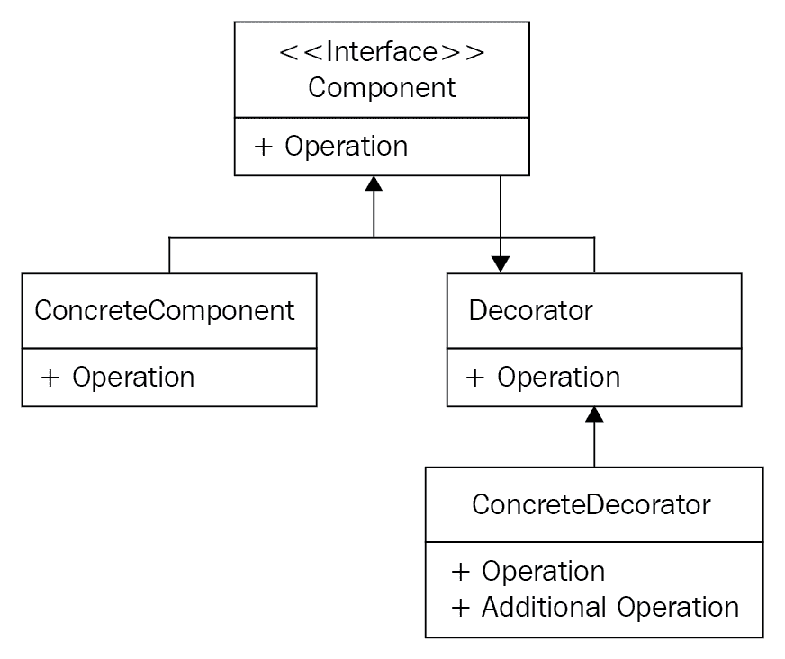
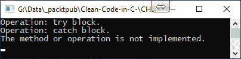
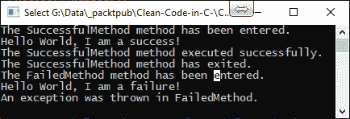
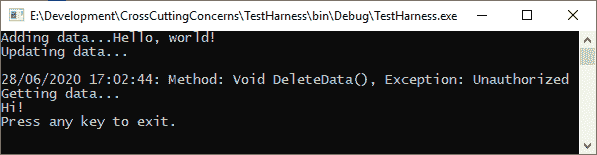

# 十一、解决横切关注点

在编写干净的代码核心关注点和横切关注点时，需要考虑两种类型的关注点。**核心问题**是该软件的原因和开发原因。**横切关注点**是不属于业务需求的关注点，构成核心关注点，但必须在代码的所有领域解决，如下图所示：


在本章中，我们将通过构建一个可重用类库（您可以根据自己的喜好对其进行修改或扩展）来讨论交叉关注点。交叉关注点包括配置管理、日志记录、审核、安全性、验证、异常处理、检测、事务、资源池、缓存以及线程和并发。我们将使用 decorator 模式和 PostSharp 方面框架来帮助我们构建可重用库，该库在编译时注入。

在阅读本章时，您将看到**属性编程**如何减少样板代码的使用，以及更小、更可读、更易于维护和扩展的代码。这将只在方法中保留所需的业务代码和样板代码

We have discussed many of these ideas already. However, they are mentioned here again as they are cross-cutting concerns.

在本章中，我们将介绍以下主题：

*   装饰图案
*   代理模式
*   带 PostSharp 的**面向方面编程**（**AOP**）
*   项目-交叉关注可重用库

本章结束时，您将具备以下技能：

*   实现 decorator 模式。
*   实现代理模式。
*   使用 PostSharp 应用 AOP。
*   构建您自己的可重用 AOP 库，解决您的跨领域问题。

# 技术要求

要充分利用本章，您需要安装 Visual Studio 2019 和 PostSharp。本章代码文件参见[https://github.com/PacktPublishing/Clean-Code-in-C-/tree/master/CH11](https://github.com/PacktPublishing/Clean-Code-in-C-/tree/master/CH11) 。让我们先看看装饰图案。

# 装饰图案

装饰设计模式是一种结构模式，用于向现有对象添加新功能而不更改其结构。原始类用 decorator 类包装，新的行为和操作在运行时添加到对象：



`Component`接口及其包含的成员由`ConcreteComponent`类和`Decorator`类实现。`ConcreteComponent`实现`Component`接口。`Decorator`类是实现`Component`接口的抽象类，包含对`Component`实例的引用。`Decorator`类是组件的基类。`ConcreteDecorator`类继承自`Decorator`类，并为组件提供装饰器。

我们将编写一个示例，将一个操作包装在一个`try`/`catch`块中。`try`和`catch`都会向控制台输出一个字符串。创建名为`CH10_AddressingCrossCuttingConcerns`的新.NET 4.8 控制台应用。然后，添加一个名为`DecoratorPattern`的文件夹。添加一个名为`IComponent`的新接口：

```cs
public interface IComponent {
   void Operation();
}
```

为了简单起见，我们的界面只有一个`void`类型的操作。现在我们已经有了接口，我们需要添加一个实现接口的抽象类。添加一个名为`Decorator`的新抽象类，该类实现`IComponent`接口。添加成员变量以存储我们的`IComponent`对象：

```cs
private IComponent _component;
```

`_component`成员变量存储`IComponent`对象，通过构造函数设置，如下所示：

```cs
public Decorator(IComponent component) {
    _component = component;
}
```

在前面的代码中，构造函数设置我们要装饰的组件。接下来，我们添加接口方法：

```cs
public virtual void Operation() {
    _component.Operation();
}
```

我们已经将`Operation()`方法声明为`virtual`，以便可以在派生类中重写它。现在我们将创建我们的`ConcreteComponent`类，它实现了`IComponent`：

```cs
public class ConcreteComponent : IComponent {
    public void Operation() {
        throw new NotImplementedException();
    }
}
```

如您所见，我们的类由一个操作组成，它抛出`NotImplementedException`。现在，我们可以写关于`ConcreteDecorator`类的内容：

```cs
public class ConcreteDecorator : Decorator {
    public ConcreteDecorator(IComponent component) : base(component) { }
}
```

`ConcreteDecorator`类继承`Decorator`类。构造函数获取一个`IComponent`参数并将其传递给基构造函数，然后在基构造函数中设置成员变量。接下来，我们将覆盖`Operation()`方法：

```cs
public override void Operation() {
    try {
        Console.WriteLine("Operation: try block.");
        base.Operation();
    } catch(Exception ex)  {
        Console.WriteLine("Operation: catch block.");
        Console.WriteLine(ex.Message);
    }
}
```

在我们重写的方法中，我们有一个`try`/`catch`块。在`try`块中，我们向控制台写入消息并执行基类“`Operation()`方法。在`catch`块中，当遇到异常时，会写入一条消息，然后是错误消息。在使用代码之前，我们需要更新`Program`类。将`DecoratorPatternExample()`方法添加到`Program`类中：

```cs
private static void DecoratorPatternExample() {
    var concreteComponent = new ConcreteComponent();
    var concreteDecorator = new ConcreteDecorator(concreteComponent);
    concreteDecorator.Operation();
}
```

在我们的`DecoratorPatternExample()`方法中，我们创建了一个新的混凝土构件。然后我们把它交给一个新的混凝土装饰师的建造师。然后，我们在混凝土装饰器上调用`Operation()`方法。将以下两行添加到`Main()`方法中：

```cs
DecoratorPatternExample();
Console.ReadKey();
```

这两行执行我们的示例，然后等待用户按键后退出。运行代码，您将看到与以下屏幕截图中相同的输出：



这就结束了我们对装饰图案的研究。现在，我们来看看代理模式。

# 代理模式

代理模式是一种结构设计模式，提供的对象可以替代客户端使用的实际服务对象。代理接收客户端请求，执行所需的工作，然后将请求传递给服务对象。代理对象可以与服务互换，因为它们共享相同的接口：


例如，当您有一个不想更改的类，但确实需要添加其他行为时，您会希望使用代理模式。代理将工作委托给其他对象。除非代理是服务的派生，否则代理方法最终应该引用`Service`对象。

我们将研究代理模式的一个非常简单的实现。在名为`ProxyPattern`的`Chapter 11`项目根目录中添加一个文件夹。添加一个名为`IService`的接口，使用单个方法处理请求：

```cs
public interface IService {
    void Request();
}
```

`Request()`方法执行执行请求的工作。代理和服务都将实现此接口以使用`Request()`方法。现在，添加`Service`类并实现`IService`接口：

```cs
public class Service : IService {
    public void Request() {
        Console.WriteLine("Service: Request();");
    }
}
```

我们的`Service`类实现`IService`接口并处理实际的服务`Request()`方法。此`Request()`方法将由`Proxy`类调用。实现代理模式的最后一步是编写`Proxy`类：

```cs
public class Proxy : IService {
    private IService _service;

    public Proxy(IService service) {
        _service = service;
    }

    public void Request() {
        Console.WriteLine("Proxy: Request();");
        _service.Request();
    }
}
```

我们的`Proxy`类实现`IService`并具有一个接受单个`IService`参数的构造函数。`Proxy`类的`Request()`方法由客户端调用。`Proxy.Request()`方法将执行它需要执行的操作，并负责调用`_service.Request()`。为了让我们能够看到这一点，让我们更新我们的`Program`类。将`ProxyPatternExample()`调用添加到`Main()`方法。然后，添加`ProxyPatternExample()`方法：

```cs
private static void ProxyPatternExample() {
    Console.WriteLine("### Calling the Service directly. ###");
    var service = new Service();
    service.Request();
    Console.WriteLine("## Calling the Service via a Proxy. ###");
    new Proxy(service).Request();
}
```

我们的测试方法运行`Service`类方向的`Request()`方法。然后，它通过`Proxy`类的`Request()`方法运行相同的方法。运行该项目，您将看到以下内容：


既然您已经对装饰器和代理模式有了一个工作的理解，让我们用 PASTHARP 看看 AOP。

# 带 PostSharp 的 AOP

AOP 可以与 OOP 一起使用。**方面**是应用于类、方法、参数和属性的属性，这些属性在编译时将代码编织到应用它的类、方法、参数或属性中。这种方法允许将程序的横切关注点从业务源代码转移到类库。关注点作为属性添加到需要的地方。编译器然后在运行时将所需的代码编入。这使您的业务代码保持小型化和可读性。在本章中，我们将使用 PostSharp。您可以从[下载 https://www.postsharp.net/download](https://www.postsharp.net/download) 。

那么，AOP 如何与 PostSharp 协同工作？

将 PostSharp 包添加到项目中。然后，使用属性对代码进行注释。C# 编译器将您的代码构建成二进制，然后 PostSharp 分析二进制文件并注入方面的实现。尽管二进制文件在编译时被注入代码修改，但项目的源代码保持不变。这意味着您可以保持代码整洁、简洁，从而使维护、重用和扩展现有代码库变得更容易。

PostSharp 有一些非常好的现成图案供您使用。这些内容包括**模型视图视图模型**（**MVVM**）、缓存、多线程、渴望和架构验证等。但好消息是，如果没有任何东西能够满足您的需求，那么您可以通过扩展方面框架和/或体系结构框架来自动化您自己的模式。

使用方面框架，您可以开发简单或复合方面，将其应用于代码，并验证其使用情况。对于体系结构框架，您可以开发自定义的体系结构约束。在深入研究横切关注点之前，让我们先简单地看一下扩展方面和体系结构框架。

You need to add the `PostSharp.Redist` NuGet package when writing aspects and attributes. Once done, if you find that your attributes and aspects are not working, then right-click on the project and select Add PostSharp to Project. After you've done this, your aspects should work.

## 扩展方面框架

在本节中，我们将开发一个简单的方面，并将其应用于一些代码。然后，我们将验证 aspect 的用法。

### 发展我们的方面

我们的相位将是由单个转换组成的简单相位。我们将从一个基本方面类派生方面。然后，我们将覆盖一些称为**通知**的方法。如果您想知道如何创建复合方面，可以在[阅读如何创建复合方面 https://doc.postsharp.net/complex-aspects](https://doc.postsharp.net/complex-aspects) 。

#### 方法执行前后的注入行为

`OnMethodBoundaryAspect`方面实现了 decorator 模式。您已经在本章前面看到了如何实现 decorator 模式。在这方面，您可以在执行目标方法之前和之后执行逻辑。下表列出了`OnMethodBoundaryAspect`类中可用的建议方法：

| **建议** | **说明** |
| `OnEntry(MethodExecutionArgs)` | 在方法执行开始时，在任何用户代码之前使用。 |
| `OnSuccess(MethodExecutionArgs)` | 在任何用户代码之后，当方法执行成功（即无异常返回）时使用。 |
| `OnException(MethodExecutionArgs)` | 在任何用户代码之后，当方法执行失败并出现异常时使用。相当于一个`catch`块。 |
| `OnExit(MethodExecutionArgs)` | 在方法执行退出时使用，无论是成功退出还是异常退出。此建议在任何用户代码之后以及在当前方面的`OnSuccess(MethodExecutionArgs)`或`OnException(MethodExecutionArgs)`方法之后运行。它相当于一个`finally`块。 |

对于我们的简单方面，我们将查看所有正在使用的方法。在开始之前，请将 PostSharp 添加到您的项目中。如果您已经下载了 PostSharp，则可以右键单击项目，然后选择“将 PostSharp 添加到项目”。之后，向项目中添加一个名为`Aspects`的新文件夹，然后添加一个名为`LoggingAspect`的新类：

```cs
[PSerializable]
public class LoggingAspect : OnMethodBoundaryAspect { }
```

`[PSerializeable]`属性是一个自定义属性，当应用于类型时，会导致 PostSharp 生成一个序列化程序供`PortableFormatter`使用。现在，覆盖`OnEntry()`方法：

```cs
public override void OnEntry(MethodExecutionArgs args) {
    Console.WriteLine("The {0} method has been entered.", args.Method.Name);
}
```

`OnEntry()`方法在任何用户代码之前执行。现在，覆盖`OnSuccess()`方法：

```cs
public override void OnSuccess(MethodExecutionArgs args) {
    Console.WriteLine("The {0} method executed successfully.", args.Method.Name);
}
```

`OnSuccess()`方法在用户代码完成后运行，无异常。覆盖`OnExit()`方法：

```cs
public override void OnExit(MethodExecutionArgs args) {
    Console.WriteLine("The {0} method has exited.", args.Method.Name);
} 
```

`OnExit()`方法在用户方法成功或失败完成并退出时执行。相当于一个`finally`块。最后，覆盖`OnException()`方法：

```cs
public override void OnException(MethodExecutionArgs args) { 
    Console.WriteLine("An exception was thrown in {0}.", args.Method.Name); 
}
```

在任何用户代码之后，当方法执行失败且出现异常时，`OnException()`方法执行。相当于一个`catch`块。

下一步是编写两个我们可以应用`LoggingAspect`的方法。我们将添加`SuccessfulMethod()`：

```cs
[LoggingAspect]
private static void SuccessfulMethod() {
    Console.WriteLine("Hello World, I am a success!");
}
```

`SuccessfulMethod()`使用`LoggingAspect`并向控制台打印消息。现在，让我们添加`FailedMethod()`：

```cs
[LoggingAspect]
private static void FailedMethod() {
    Console.WriteLine("Hello World, I am a failure!");
    var x = 1;
    var y = 0;
    var z = x / y;
}
```

`FailedMethod()`使用`LoggingAspect`并向控制台打印消息。然后，它执行零除运算，结果是`DivideByZeroException`。从`Main()`方法调用这两种方法，然后运行项目。您应该看到以下输出：



此时，调试器将导致程序退出。就这样。正如您所见，创建自己的 PostSharp 方面以满足您的需求是一个简单的过程。现在，我们将考虑添加我们自己的体系结构约束。

## 扩展体系结构框架

架构约束是采用定制设计模式，所有模块都必须遵守这些模式。我们将实现一个标量约束来验证代码元素。

我们称为`BusinessRulePatternValidation`的标量约束将验证从`BusinessRule`类派生的任何类必须具有名为`Factory`的嵌套类。首先添加`BusinessRulePatternValidation`类：

```cs
[MulticastAttributeUsage(MulticastTargets.Class, Inheritance = MulticastInheritance.Strict)] 
public class BusinessRulePatternValidation : ScalarConstraint { }
```

`MulticastAttributeUsage`指定此验证方面仅在允许类和继承的情况下工作。让我们覆盖`ValidateCode()`方法：

```cs
public override void CodeValidation(object target)  { 
    var targetType = (Type)target; 
    if (targetType.GetNestedType("Factory") == null) { 
        Message.Write( 
            targetType, SeverityType.Warning, 
            "10", 
            "You must include a 'Factory' as a nested type for {0}.", 
            targetType.DeclaringType, 
            targetType.Name); 
    } 
} 
```

我们的`ValidateCode()`方法检查目标对象是否具有嵌套的`Factory`类型。如果`Factory`类型不存在，则向输出窗口写入异常消息。添加`BusinessRule`类：

```cs
 [BusinessRulePatternValidation]
 public class BusinessRule  { }
```

`BusinessRule`类是空的，没有`Factory`。它被分配了我们的`BusinessRulePatternValidation`属性，这是一个架构约束。构建您的项目，您将在输出窗口中看到消息。我们现在将开始构建一个可重用类库，您可以在自己的项目中扩展和使用它，以使用 AOP 和装饰器模式解决横切关注点。

# 项目-交叉关注可重用库

在本节中，我们将编写一个可重用库来解决各种交叉关注点。它的功能有限，但它将为您提供进一步扩展项目以满足自己需求所需的知识。您将创建的类库将是一个.NET 标准库，因此它可以用于同时面向.NET Framework 和.NET Core 的应用。您还将创建一个.NET Framework 控制台应用，以查看正在运行的库。

首先创建一个名为`CrossCuttingConcerns`的新.NET 标准类库。然后，将一个.NET Framework 控制台应用添加到名为`TestHarness`的解决方案中。我们将添加可重用的功能来解决各种问题，从缓存开始。

## 添加缓存问题

**缓存**是一种在访问各种资源时提高性能的存储技术。使用的缓存可以是内存、文件系统或数据库。您使用的缓存类型将取决于项目的需要。在我们的演示中，我们将使用内存缓存来保持简单。

将名为`Caching`的文件夹添加到`CrossCuttingConcerns`项目中。然后，添加一个名为`MemoryCache`的类。将以下 NuGet 包添加到项目中：

*   `PostSharp`
*   `PostSharp.Patterns.Common`
*   `PostSharp.Patterns.Diagnostics`
*   `System.Runtime.Caching`

使用以下代码更新`MemoryCache`类：

```cs
public static class MemoryCache {
    public static T GetItem<T>(string itemName, TimeSpan timeInCache, Func<T> itemCacheFunction) {
        var cache = System.Runtime.Caching.MemoryCache.Default;
        var cachedItem = (T) cache[itemName];
        if (cachedItem != null) return cachedItem;
        var policy = new CacheItemPolicy {AbsoluteExpiration = DateTimeOffset.Now.Add(timeInCache)};
        cachedItem = itemCacheFunction();
        cache.Set(itemName, cachedItem, policy);
        return cachedItem;
    }
}
```

`GetItem()`方法采用缓存项的名称`itemName`、该项在缓存中的保留时间长度`timeInCache`，以及调用函数将该项放入缓存（如果该项不在缓存中的话）`itemCacheFunction`。在`TestHarness`项目中添加一个新类，并将其命名为`TestClass`。然后，添加`GetCachedItem()`和`GetMessage()`方法，如图所示：

```cs
public string GetCachedItem() {
    return MemoryCache.GetItem<string>("Message", TimeSpan.FromSeconds(30), GetMessage);
}

private string GetMessage() {
    return "Hello, world of cache!";
}
```

`GetCachedItem()`方法从缓存中获取一个名为`"Message"`的字符串。如果不在缓存中，则通过`GetMessage()`方法将其存储在缓存中 30 秒。

更新`Program`类中的`Main()`方法调用`GetCachedItem()`方法，如下图：

```cs
var harness = new TestClass();
Console.WriteLine(harness.GetCachedItem());
Console.WriteLine(harness.GetCachedItem());
Thread.Sleep(TimeSpan.FromSeconds(1));
Console.WriteLine(harness.GetCachedItem());
```

对`GetCachedItem()`的第一次调用将该项存储在缓存中，然后返回该项。第二个调用从缓存中获取项并返回它。休眠线程使缓存失效，因此最后一次调用在返回项目之前将其存储在缓存中。

## 添加文件日志功能

在我们的项目中，日志记录、审核和检测过程将把它们的输出发送到文本文件。因此，我们需要一个类来管理添加不存在的文件，然后将输出添加到这些文件并保存它们。将名为`FileSystem`的文件夹添加到类库中。然后，添加一个名为`LogFile`的类。将类设置为`public static`并添加以下成员变量：

```cs
private static string _location = string.Empty;
private static string _filename = string.Empty;
private static string _file = string.Empty;
```

`_location`变量被分配给条目程序集的文件夹。`_filename`变量被分配文件扩展名为的文件名。我们需要在运行时添加`Logs`文件夹（如果它不存在）。因此，我们将`AddDirectory()`方法添加到`FileSystem`类中：

```cs
private static void AddDirectory() {
    if (!Directory.Exists(_location))
        Directory.CreateDirectory("Logs");
}
```

`AddDirectory()`方法检查位置是否存在。如果不存在，则创建目录。接下来，如果文件不存在，我们需要添加它。因此，增加`AddFile()`方法：

```cs
private static void AddFile() {
    _file = Path.Combine(_location, _filename);
    if (File.Exists(_file)) return;
    using (File.Create($"Logs\\{_filename}")) {

    }
}
```

在`AddFile()`方法中，我们结合了位置和文件名。如果文件名已经存在，则退出该方法；否则，我们将创建该文件。如果我们不使用`using`语句，我们在创建第一条记录时会遇到`IOException`，但随后的保存就可以了。因此，通过使用`using`语句，我们避免了异常并记录了数据。我们现在可以编写一个方法，实际将数据保存到文件中。增加`AppendTextToFile()`方法：

```cs
public static void AppendTextToFile(string filename, string text) {
    _location = $"{Path.GetDirectoryName(Assembly.GetEntryAssembly()?.Location)}\\Logs";
    _filename = filename;
    AddDirectory();
    AddFile();
    File.AppendAllText(_file, text);
}
```

`AppendTextToFile()`方法获取文件名和文本，并将位置设置为条目程序集的位置。然后确保文件和目录存在。然后，它将文本保存到指定的文件中。我们的文件日志记录功能现在得到了处理，所以现在，我们可以继续关注日志记录问题。

## 添加日志问题

大多数应用都需要某种形式的日志记录。通常的日志记录方法包括控制台、文件系统、事件日志和数据库。在我们的项目中，我们将只关注控制台和文本文件日志记录。将名为`Logging`的文件夹添加到类库中。然后，添加一个名为`ConsoleLoggingAspect`的文件，并按如下方式进行更新：

```cs
[PSerializable]
public class ConsoleLoggingAspect : OnMethodBoundaryAspect { }
```

`[PSerializable]`属性通知 PostSharp 生成一个序列化程序供`PortableFormatter`使用。`ConsoleLoggingAspect`继承自`OnMethodBoundaryAspect`。`OnMethodBoundaryAspect`类有一些方法，我们可以重写这些方法，以便在方法体执行之前、方法体执行之后、方法体成功执行时以及遇到异常时添加代码。我们将重写这些方法以向控制台输出消息。在调试代码时，这是一个非常有用的工具，可以查看代码是否实际被调用，以及代码是否成功完成或遇到异常。我们将从覆盖`OnEntry()`方法开始：

```cs
public override void OnEntry(MethodExecutionArgs args) {
    Console.WriteLine($"Method: {args.Method.Name}, OnEntry().");
}
```

`OnEntry()`方法在我们的方法主体执行之前执行，我们的覆盖打印出已经执行的方法的名称及其自身的名称。接下来，我们将覆盖`OnExit()`方法：

```cs
public override void OnExit(MethodExecutionArgs args) {
    Console.WriteLine($"Method: {args.Method.Name}, OnExit().");
}
```

`OnExit()`方法在我们的方法主体完成执行后执行，我们的覆盖打印出已经执行的方法的名称及其自身的名称。现在，我们将添加`OnSuccess()`方法：

```cs
public override void OnSuccess(MethodExecutionArgs args) {
    Console.WriteLine($"Method: {args.Method.Name}, OnSuccess().");
}
```

`OnSuccess()`方法在其应用的方法体完成并返回后执行。当重写执行时，它会打印出已执行方法的名称及其自己的名称。我们将覆盖的最后一个方法是`OnException()`方法：

```cs
public override void OnException(MethodExecutionArgs args) {
    Console.WriteLine($"An exception was thrown in {args.Method.Name}. {args}");
}
```

`OnException()`方法在遇到异常时执行，在重写中，我们打印出方法的名称和参数的对象。要应用该属性，请使用`[ConsoleLoggingAspect]`。要添加文本文件日志方面，请添加一个名为`TextFileLoggingAspect`的类。`TextFileLoggingAspect`与`ConsoleLoggingAspect`相同，只是覆盖方法的内容不同。`OnEntry()`、`OnExit()`和`OnSuccess()`方法调用`LogFile.AppendTextToFile()`方法并将内容附加到`Log.txt`文件中。`OnException()`方法也会这样做，只是它会将内容附加到`Exception.log`文件中。以下是`OnEntry()`示例：

```cs
public override void OnEntry(MethodExecutionArgs args) {
    LogFile.AppendTextToFile("Log.txt", $"\nMethod: {args.Method.Name}, OnEntry().");
}
```

这就是我们的日志记录。现在，我们将继续添加我们的异常问题。

## 添加异常处理关注点

软件用户不可避免地会遇到异常。所以，需要有某种方法来记录它们。记录异常的正常方式是将错误存储在用户系统上的文件中，例如使用`Exception.log`。这就是我们在本节要做的。我们将继承`OnExceptionAspect`类并将异常数据写入`Exception.log`文件，该文件将位于我们应用的`Logs`文件夹中。`OnExceptionAspect`将标记的方法包装在`try`/`catch`块中。在类库中添加一个名为`Exceptions`的新文件夹，然后添加一个名为`ExceptionAspect`的文件，代码如下：

```cs
[PSerializable]
public class ExceptionAspect : OnExceptionAspect {
    public string Message { get; set; }
    public Type ExceptionType { get; set; }
    public FlowBehavior Behavior { get; set; }

    public override void OnException(MethodExecutionArgs args) {
        var message = args.Exception != null ? args.Exception.Message : "Unknown error occured.";
        LogFile.AppendTextToFile(
            "Exceptions.log", $"\n{DateTime.Now}: Method: {args.Method}, Exception: {message}"
        );
        args.FlowBehavior = FlowBehavior.Continue;
    }

    public override Type GetExceptionType(System.Reflection.MethodBase targetMethod) {
        return ExceptionType;
    }
}
```

`ExceptionAspect`类被分配`[PSerializable]`方面并从`OnExceptionAspect`继承。我们有三处房产：`message`、`ExceptionType`和`FlowBehavior`。`message`包含异常消息，`ExceptionType`包含遇到的异常类型，`FlowBehavior`确定异常处理后是继续执行还是进程终止。`GetExceptionType()`方法返回抛出的异常类型。`OnException()`方法从构造错误消息开始。然后通过调用`LogFile.AppendTextToFile()`将异常记录到文件中。最后，异常行为的流被设置为继续。

使用`[ExceptionAspect]`方面所要做的就是将其作为属性添加到方法中。我们现在已经介绍了异常处理。因此，我们将继续添加我们的安全问题。

## 添加安全问题

安全需求将特定于正在进行的项目。最常见的问题是，用户经过身份验证和授权，可以访问和使用系统的各个部分。在本节中，我们将使用 decorator 模式使用基于角色的方法实现安全组件。

Security is a very large subject in itself and beyond the scope of this book. There are many good APIs out there, such as the various Microsoft APIs. Refer to [https://docs.microsoft.com/en-us/dotnet/standard/security/](https://docs.microsoft.com/en-us/dotnet/standard/security/) for more information, and for OAuth 2.0, refer to [https://oauth.net/code/dotnet/](https://oauth.net/code/dotnet/). We will leave you to select and implement your own method of security. In this chapter, we simply add our own custom-defined security using the decorator pattern. You can use this as a base for implementing any of the aforementioned security methods.

添加名为`Security`的新文件夹，并向其添加名为`ISecureComponent`的接口：

```cs
public interface ISecureComponent {
    void AddData(dynamic data);
    int EditData(dynamic data);
    int DeleteData(dynamic data);
    dynamic GetData(dynamic data);
}
```

我们的安全组件接口包含前面四种方法，它们是不言自明的。`dynamic`关键字意味着任何类型的数据都可以作为参数传入，`GetData()`方法可以返回任何类型的数据。接下来，我们需要一个实现接口的抽象类。添加一个名为`DecoratorBase`的类，如图所示：

```cs
public abstract class DecoratorBase : ISecureComponent {
    private readonly ISecureComponent _secureComponent;

    public DecoratorBase(ISecureComponent secureComponent) {
        _secureComponent = secureComponent;
    }
}
```

`DecoratorBase`类实现了`ISecureComponent`。我们声明了一个`ISecureComponent`类型的成员变量，并在默认构造函数中设置它。我们需要添加缺少的`ISecureComponent`方法。增加`AddData()`方法：

```cs
public virtual void AddData(dynamic data) {
    _secureComponent.AddData(data);
}
```

此方法将获取任何类型的数据，然后将其传递到对`_secureComponent`的`AddData()`方法的调用中。为`EditData()`、`DeleteData()`和`GetData()`添加缺少的方法。现在，添加一个名为`ConcreteSecureComponent`的类，它实现了`ISecureComponent`。对于每个方法，向控制台写入一条消息。对于`DeleteData()`和`EditData()`方法，也返回一个值`1`。返回`GetData()`的`"Hi!"`。`ConcreteSecureComponent`类是执行我们感兴趣的安全工作的类。

我们需要一种方法来验证用户并获得他们的角色。在执行任何方法之前，将检查角色。因此，添加以下结构：

```cs
public readonly struct Credentials {
    public static string Role { get; private set; }

    public Credentials(string username, string password) {
        switch (username)
        {
            case "System" when password == "Administrator":
                Role = "Administrator";
                break;
            case "End" when password == "User":
                Role = "Restricted";
                break;
            default:
                Role = "Imposter";
                break;
        }
    }
}
```

为了简单起见，结构采用用户名和密码并设置适当的角色。受限用户的权限少于管理员。最后一节课是`ConcreteDecorator`课。添加类，如下所示：

```cs
public class ConcreteDecorator : DecoratorBase {
    public ConcreteDecorator(ISecureComponent secureComponent) : base(secureComponent) { }
}
```

`ConcreteDecorator`类继承`DecoratorBase`类。我们的构造函数接受一个类型`ISecureComponent`并将其传递给基类。增加`AddData()`方式：

```cs
public override void AddData(dynamic data) {
    if (Credentials.Role.Contains("Administrator") || Credentials.Role.Contains("Restricted")) {
        base.AddData((object)data);
    } else {
        throw new UnauthorizedAccessException("Unauthorized");
    }
}
```

`AddMethod()`根据允许的`Administrator`和`Restricted`角色检查用户的角色。如果用户处于这些角色之一，则在基类中执行`AddData()`方法；否则，将抛出`UnauthorizedAccessException`。其余方法遵循相同的模式。覆盖其余的方法，但确保`DeleteData()`方法只能由管理员执行。

我们现在将把我们的安全关切付诸行动。在`Program`类的顶部添加以下行：

```cs
private static readonly ConcreteDecorator ConcreteDecorator = new ConcreteDecorator(
    new ConcreteSecureComponent()
);
```

我们正在声明和实例化一个具体的 decorator 对象，并传入具体的安全对象。此对象将在我们的数据方法中引用。更新`Main()`方法，如下所示：

```cs
private static void Main(string[] _) {
    // ReSharper disable once ObjectCreationAsStatement
    new Credentials("End", "User");
    DoSecureWork();
    Console.WriteLine("Press any key to exit.");
    Console.ReadKey();
}
```

我们将用户名和密码分配给`Credentials`结构。这导致`Role`被设置。然后我们称之为`DoWork()`方法。`DoWork()`方法将负责调用数据方法。然后我们暂停，让用户按任意键并退出。增加`DoWork()`方法：

```cs
private static void DoSecureWork() {
    AddData();
    EditData();
    DeleteData();
    GetData();
}
```

`DoSecureWork()`方法调用在具体装饰器上调用数据方法的每个数据方法。增加`AddData()`方法：

```cs
[ExceptionAspect(consoleOutput: true)]
private static void AddData() {
    ConcreteDecorator.AddData("Hello, world!");
}
```

`[ExceptionAspect]`适用于`AddData()`方法。这将确保将任何错误记录到`Exceptions.log`文件中。参数设置为`true`，因此控制台窗口中也会打印错误消息。方法本身调用`ConcreteDecorator`类上的`AddData()`方法。按照相同的过程添加其余的方法。然后，运行代码。您应该看到以下输出：



我们现在有了一个工作的基于角色的对象，完成了异常处理。我们的下一步是实现我们的验证关注点。

## 添加验证关注点

应验证所有用户输入的数据，因为这些数据可能是恶意的、不完整的或格式错误的。您需要确保您的数据是干净的，不会造成伤害。对于我们的演示，我们将实现空验证。首先，将名为`Validation`的文件夹添加到类库中。然后，添加一个名为`AllowNullAttribute`的新类：

```cs
[AttributeUsage(AttributeTargets.Parameter | AttributeTargets.ReturnValue | AttributeTargets.Property)]
public class AllowNullAttribute : Attribute { }
```

此属性允许参数、返回值和属性为空。现在，将`ValidationFlags`枚举添加到同名的新文件中：

```cs
[Flags]
public enum ValidationFlags {
    Properties = 1,
    Methods = 2,
    Arguments = 4,
    OutValues = 8,
    ReturnValues = 16,
    NonPublic = 32,
    AllPublicArguments = Properties | Methods | Arguments,
    AllPublic = AllPublicArguments | OutValues | ReturnValues,
    All = AllPublic | NonPublic
}
```

这些标志用于确定方面可以应用于哪些项目。接下来，我们将添加一个名为`ReflectionExtensions`的类：

```cs
public static class ReflectionExtensions {
    private static bool IsCustomAttributeDefined<T>(this ICustomAttributeProvider value) where T 
        : Attribute  {
        return value.IsDefined(typeof(T), false);
    }

    public static bool AllowsNull(this ICustomAttributeProvider value) {
        return value.IsCustomAttributeDefined<AllowNullAttribute>();
    }

    public static bool MayNotBeNull(this ParameterInfo arg) {
        return !arg.AllowsNull() && !arg.IsOptional && !arg.ParameterType.IsValueType;
    }
}
```

如果在此成员上定义了属性类型，`IsCustomAttributeDefined()`方法返回`true`，否则返回`false`。如果`[AllowNull]`属性已经应用，`AllowsNull()`方法返回`true`，如果没有，则返回`false`。`MayNotBeNull()`方法检查是否允许空值，参数是否可选，以及参数的值类型。然后通过对这些值执行逻辑`AND`操作返回布尔值。现在是添加`DisallowNonNullAspect`的时候了：

```cs
[PSerializable]
public class DisallowNonNullAspect : OnMethodBoundaryAspect {
    private int[] _inputArgumentsToValidate;
    private int[] _outputArgumentsToValidate;
    private string[] _parameterNames;
    private bool _validateReturnValue;
    private string _memberName;
    private bool _isProperty;

    public DisallowNonNullAspect() : this(ValidationFlags.AllPublic) { }

    public DisallowNonNullAspect(ValidationFlags validationFlags) {
        ValidationFlags = validationFlags;
    }

    public ValidationFlags ValidationFlags { get; set; }
}
```

此类具有应用于通知 PostSharp 为`PortableFormatter`生成序列化程序的`[PSerializable]`属性。它还继承了`OnMethodBoundaryAspect`类。然后，我们声明变量，将输入和输出参数作为已验证的参数名、返回值验证和成员名保存，并检查正在验证的项是否为属性。默认构造函数配置为允许将验证器应用于所有公共成员。我们还有一个构造函数，它接受一个`ValidationFlags`值和一个`ValidationFlags`属性。现在，我们将覆盖`CompileTimeValidate()`方法：

```cs
public override bool CompileTimeValidate(MethodBase method) {
    var methodInformation = MethodInformation.GetMethodInformation(method);
    var parameters = method.GetParameters();

    if (!ValidationFlags.HasFlag(ValidationFlags.NonPublic) && !methodInformation.IsPublic) return false;
    if (!ValidationFlags.HasFlag(ValidationFlags.Properties) && methodInformation.IsProperty) 
        return false;
    if (!ValidationFlags.HasFlag(ValidationFlags.Methods) && !methodInformation.IsProperty) return false;

    _parameterNames = parameters.Select(p => p.Name).ToArray();
    _memberName = methodInformation.Name;
    _isProperty = methodInformation.IsProperty;

    var argumentsToValidate = parameters.Where(p => p.MayNotBeNull()).ToArray();

    _inputArgumentsToValidate = ValidationFlags.HasFlag(ValidationFlags.Arguments) ? argumentsToValidate.Where(p => !p.IsOut).Select(p => p.Position).ToArray() : new int[0];

    _outputArgumentsToValidate = ValidationFlags.HasFlag(ValidationFlags.OutValues) ? argumentsToValidate.Where(p => p.ParameterType.IsByRef).Select(p => p.Position).ToArray() : new int[0];

    if (!methodInformation.IsConstructor) {
        _validateReturnValue = ValidationFlags.HasFlag(ValidationFlags.ReturnValues) &&
                                            methodInformation.ReturnParameter.MayNotBeNull();
    }

    var validationRequired = _validateReturnValue || _inputArgumentsToValidate.Length > 0 || _outputArgumentsToValidate.Length > 0;

    return validationRequired;
}
```

此方法确保在编译时正确应用方面。如果方面应用于错误类型的成员，则返回`false`。否则返回`true`。我们现在覆盖`OnEntry()`方法：

```cs
public override void OnEntry(MethodExecutionArgs args) {
    foreach (var argumentPosition in _inputArgumentsToValidate) {
        if (args.Arguments[argumentPosition] != null) continue;
        var parameterName = _parameterNames[argumentPosition];

        if (_isProperty) {
            throw new ArgumentNullException(parameterName, 
                $"Cannot set the value of property '{_memberName}' to null.");
        } else {
            throw new ArgumentNullException(parameterName);
        }
    }
}
```

此方法检查*输入参数*以进行验证。如果有参数为`null`，则抛出`ArgumentNullException`；否则，该方法将在不引发异常的情况下退出。现在让我们覆盖`OnSuccess()`方法：

```cs
public override void OnSuccess(MethodExecutionArgs args) {
    foreach (var argumentPosition in _outputArgumentsToValidate) {
        if (args.Arguments[argumentPosition] != null) continue;
        var parameterName = _parameterNames[argumentPosition];
        throw new InvalidOperationException($"Out parameter '{parameterName}' is null.");
    }

    if (!_validateReturnValue || args.ReturnValue != null) return;

    if (_isProperty) {
        throw new InvalidOperationException($"Return value of property '{_memberName}' is null.");
    }
    throw new InvalidOperationException($"Return value of method '{_memberName}' is null.");
}
```

`OnSuccess()`方法验证*输出参数*进行验证。如果任何参数为空，则会抛出`InvalidOperationException`。接下来我们需要做的是添加`private class`来提取方法信息。将以下类添加到关闭括号之前的`DisallowNonNullAspect`类的底部：

```cs
private class MethodInformation { }
```

将以下三个构造函数添加到`MethodInformation`类中：

```cs
 private MethodInformation(ConstructorInfo constructor) : this((MethodBase)constructor) {
     IsConstructor = true;
     Name = constructor.Name;
 }

 private MethodInformation(MethodInfo method) : this((MethodBase)method) {
     IsConstructor = false;
     Name = method.Name;
     if (method.IsSpecialName &&
     (Name.StartsWith("set_", StringComparison.Ordinal) ||
     Name.StartsWith("get_", StringComparison.Ordinal))) {
         Name = Name.Substring(4);
         IsProperty = true;
     }
     ReturnParameter = method.ReturnParameter;
 }

 private MethodInformation(MethodBase method)
 {
     IsPublic = method.IsPublic;
 }
```

这些构造函数区分构造函数和方法，并对方法执行必要的初始化。添加以下方法：

```cs
private static MethodInformation CreateInstance(MethodInfo method) {
    return new MethodInformation(method);
}
```

`CreateInstance()`方法根据传入方法的`MethodInfo`数据创建`MethodInformation`类的新实例，并返回该实例。增加`GetMethodInformation()`方式：

```cs
public static MethodInformation GetMethodInformation(MethodBase methodBase) {
    var ctor = methodBase as ConstructorInfo;
    if (ctor != null) return new MethodInformation(ctor);
    var method = methodBase as MethodInfo;
    return method == null ? null : CreateInstance(method);
}
```

此方法将`methodBase`强制转换为`ConstructorInfo`并检查`null`。如果`ctor`不是`null`，则根据构造函数生成新的`MethodInformation`类。但是，如果`ctor`是`null`，则`methodBase`被转换为`MethodInfo`。如果方法不是`null`，则调用`CreateInstance()`方法，并传入该方法。否则返回`null`。最后，向类添加以下属性：

```cs
public string Name { get; private set; }
public bool IsProperty { get; private set; }
public bool IsPublic { get; private set; }
public bool IsConstructor { get; private set; }
public ParameterInfo ReturnParameter { get; private set; }
```

这些属性是应用了方面的方法的属性。我们现在已经完成了验证方面的编写。您现在可以使用验证器通过附加`[AllowNull]`属性来允许空值。您可以通过附加`[DisallowNonNullAspect]`来禁止空值。现在，我们将添加我们的事务关注点。

## 添加事务关注点

事务是必须运行到完成或回滚的进程。在类库`Transactions`*中添加一个新文件夹，然后添加`RequiresTransactionAspect`类：*

```cs
[PSerializable]
[AttributeUsage(AttributeTargets.Method)]
public sealed class RequiresTransactionAspect : OnMethodBoundaryAspect {
    public override void OnEntry(MethodExecutionArgs args) {
        var transactionScope = new TransactionScope(TransactionScopeOption.Required);
        args.MethodExecutionTag = transactionScope;
    }

    public override void OnSuccess(MethodExecutionArgs args) {
        var transactionScope = (TransactionScope)args.MethodExecutionTag;
        transactionScope.Complete();
    }

    public override void OnExit(MethodExecutionArgs args) {
        var transactionScope = (TransactionScope)args.MethodExecutionTag;
        transactionScope.Dispose();
    }
}
```

`OnEntry()`方法启动事务，`OnSuccess()`方法完成异常，`OnExit()`方法处理事务。要使用方面，请在方法中添加`[RequiresTransactionAspect]`。要记录阻止交易完成的任何异常，您还可以分配`[ExceptionAspect(consoleOutput: false)]`方面。接下来，我们将添加资源池关注点。

## 添加资源池关注点

当一个对象的多个实例的创建和销毁成本很高时，资源池是提高性能的好方法。我们将为我们的需求创建一个非常简单的资源池。添加名为`ResourcePooling`的文件夹，然后添加`ResourcePool`类：

```cs
public class ResourcePool<T> {
    private readonly ConcurrentBag<T> _resources;
    private readonly Func<T> _resourceGenerator;

    public ResourcePool(Func<T> resourceGenerator) {
        _resourceGenerator = resourceGenerator ??
                                 throw new ArgumentNullException(nameof(resourceGenerator));
        _resources = new ConcurrentBag<T>();
    }

    public T Get() => _resources.TryTake(out T item) ? item : _resourceGenerator();
    public void Return(T item) => _resources.Add(item);
}
```

此类创建一个新的资源生成器并将资源存储在`ConcurrentBag`中。当请求一个项目时，它会从池中发出一个资源。如果一个不存在，则创建它，将其添加到池中，并发送给调用方：

```cs
var pool = new ResourcePool<Course>(() => new Course()); // Create a new pool of Course objects.
var course = pool.Get(); // Get course from pool.
pool.Return(course); // Return the course to the pool.
```

您刚才看到的代码向您展示了如何使用`ResourcePool`类创建一个池，获取一个资源，并将其返回到池中。

## 添加配置设置问题

配置设置应始终集中。由于桌面应用将其设置存储在`app.config`文件中，而 web 应用将其设置存储在`Web.config`中，因此我们可以使用`ConfigurationManager`访问应用设置。将`System.Configuration.Configuration`NuGet 库添加到类库中并测试线束。然后，添加名为`Configuration`的文件夹和以下`Settings`类：

```cs
public static class Settings {
    public static string GetAppSetting(string key) {
        return System.Configuration.ConfigurationManager.AppSettings[key];
    }

    public static void SetAppSettings(this string key, string value) {
        System.Configuration.ConfigurationManager.AppSettings[key] = value;
    }
}
```

此类将获取并设置`Web.config`文件和`App.config`文件中的应用设置。要在文件中包含该类，请添加以下`using`语句：

```cs
using static CrossCuttingConcerns.Configuration.Settings;
```

以下代码显示了如何使用这些方法：

```cs
Console.WriteLine(GetAppSetting("Greeting"));
"Greeting".SetAppSettings("Goodbye, my friends!");
Console.WriteLine(GetAppSetting("Greeting"));
```

使用静态导入，您不必包含`class`前缀。您可以扩展`Settings`类以获取连接字符串，或者在应用中执行任何需要的配置。

## 添加仪器问题

我们的最后一个交叉关注点是仪器仪表。我们使用工具来评测应用，并查看方法执行所需的时间。在类库中添加一个名为`Instrumentation`的文件夹，然后添加`InstrumentationAspect`类，如图所示：

```cs

[PSerializable]
[AttributeUsage(AttributeTargets.Method)]
public class InstrumentationAspect : OnMethodBoundaryAspect {
    public override void OnEntry(MethodExecutionArgs args) {
        LogFile.AppendTextToFile("Profile.log", 
            $"\nMethod: {args.Method.Name}, Start Time: {DateTime.Now}");
        args.MethodExecutionTag = Stopwatch.StartNew();
    }

    public override void OnException(MethodExecutionArgs args) {
        LogFile.AppendTextToFile("Exception.log", 
            $"\n{DateTime.Now}: {args.Exception.Source} - {args.Exception.Message}");
    }

    public override void OnExit(MethodExecutionArgs args) {
        var stopwatch = (Stopwatch)args.MethodExecutionTag;
        stopwatch.Stop();
        LogFile.AppendTextToFile("Profile.log", 
            $"\nMethod: {args.Method.Name}, Stop Time: {DateTime.Now}, Duration: {stopwatch.Elapsed}");
    }
}
```

如您所见，插装方面仅适用于方法，乘以方法的开始和停止时间，并将概要信息记录到`Profile.log`文件中。如果遇到异常，则将异常记录到`Exception.log`文件中。

我们现在有了一个功能强大、可重用的横切关注点库。让我们总结一下我们在本章学到的知识。

# 总结

我们学到了一些有价值的信息。我们首先查看装饰器模式，然后是代理模式。代理模式提供的对象可以替代客户端使用的实际服务对象。代理接收客户端请求，执行必要的工作，然后将请求传递给服务对象。由于代理与它们所替代的服务共享相同的接口，因此它们是可互换的。

在覆盖代理模式之后，我们使用 PostSharp 进入 AOP。我们看到了如何使用方面和属性来修饰代码，以便在编译时，它注入代码来执行所需的操作，例如异常处理、日志记录、审计和安全性。我们通过开发自己的 aspect 扩展了 aspect 框架，并研究了如何使用 PostSharp 和 decorator 模式来解决配置管理、日志记录、审核、安全性、验证、异常处理、检测、事务、资源池、缓存、线程和并发等交叉问题。

在下一章中，我们将介绍如何使用工具来帮助您提高代码质量。但在此之前，先测试你的知识，然后进一步阅读。

# 问题

1.  什么是交叉关注点？AOP 代表什么？
2.  什么是方面？如何应用方面？
3.  什么是属性？如何应用属性？
4.  方面和属性如何协同工作？
5.  构建过程如何处理方面？

# 进一步阅读

*   PostSharp 主页：[https://www.postsharp.net/](https://www.postsharp.net/download)*