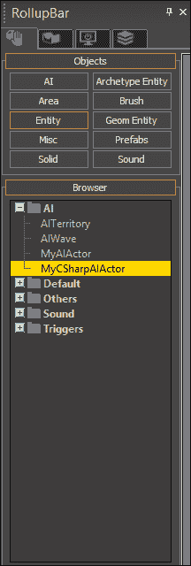

# 六、人工智能

CryENGINE AI 系统允许创建非玩家控制的角色，在游戏世界中漫游。

在本章中，我们将:

*   了解 AI 系统如何与 Lua 脚本集成
*   了解什么是目标管道，以及如何创建它们
*   使用人工智能信号
*   注册一个自定义 AI`Actor`类
*   学习如何使用行为选择树
*   创造我们自己的人工智能行为

# 人工智能(AI)系统

CryENGINE AI 系统被设计成能够轻松创建足够灵活的自定义 AI 参与者来处理更大的复杂和不同的世界。

在我们开始研究 AI 系统的本地执行之前，我们必须提到一个非常重要的事实:AI 与参与者不同，不应该被混淆。

在 CryENGINE 中，AI 仍然依赖于底层的 actor 实现，通常与玩家使用的完全相同。 然而，AI 本身的实现是通过 AI 系统单独完成的，而 AI 系统又会向参与者发送移动输入等信息。

## 脚本

CryENGINE 的 AI 系统的主要理念是基于大量脚本。 与其强迫程序员修改复杂的 CryAISystem 模块，我们还可以使用包含在`Scripts/AI`和`Scripts/Entities/AI`目录中的 Lua 脚本来创建新的 AI 行为。

### 注意事项

AI 系统目前主要是硬编码的`.lua`脚本，因此我们将不能使用 C# 和 c++在任何更大程度上进行 AI 开发。

## AI 演员

正如我们之前提到的，actor 是独立于 AI 本身的。 从本质上来说，这意味着我们需要创建一个`IActor`实现，然后指定参与者应该使用哪些 AI 行为。

如果你的 AI 角色应该与玩家的行为大致相同，你就应该重用角色实现。

如前一章所述，可以使用`REGISTER_FACTORY`宏注册一个 actor。 AI 参与者的唯一区别是，最后一个参数应该设置为 true 而不是 false:

```cs
  REGISTER_FACTORY(pFramework, "MyAIActor", CMyAIActor, true);
```

一旦注册，AI 系统将在`Scripts/Entities/AI`中搜索以你的实体命名的 Lua 脚本。 对于前面的代码片段，系统将尝试加载`Scripts/Entities/AI/MyAIActor.lua`。

这个脚本应该包含一个同名的表，其功能应该与其他 Lua 实体相同。 例如，要添加 Editor 属性，只需在 properties 子表中添加变量。

## 球管

目标管道定义了一组目标操作，允许在运行时触发一组目标。 例如，目标管可以包含 AI，在开始搜索玩家控制单位的同时提高其移动速度。

目标操作，如查看、定位和隐藏在`CryAISystem.dll`中创建，并且不能在访问其源的情况下进行修改。

### 创建自定义管道

管道最初在`Scripts/AI/GoalPipes/PipeManager.lua`中的`PipeManager:CreateGoalPipes`函数中注册，使用`AI.LoadGoalPipes`函数:

```cs
  AI.LoadGoalPipes("Scripts/AI/GoalPipes/MyGoalPipes.xml");
```

该代码段将加载`Scripts/AI/GoalPipes/MyGoalPipes.xml`，其中可能包含以下目标管道定义:

```cs
<GoalPipes>
  <GoalPipe name="myGoalPipes_findPlayer">
    <Locate name="player" />
    <Speed id="Run"/>
    <Script code="entity.Behavior:AnalyzeSituation(entity);"
  </GoalPipe>
</GoalPipes>
```

当此管道被选择时，分配的 AI 将开始定位玩家，切换到`Run`移动速度状态，并调用当前选择的行为脚本中包含的`AnalyzeSituation`函数。

目标管道能够非常有效地推动一系列目标，以之前的脚本为例，我们可以简单地选择`myGoalPipes_findPlayer`管道，以便让 AI 运行去寻找玩家。

### 管道选择

目标管道通常是使用 Lua 中的实体函数`SelectPipe`来触发的:

```cs
  myEntity:SelectPipe(0, "myGoalPipe");
```

或者可以通过 c++使用`IPipeUser::SelectPipe`函数触发。

## 信号

为了给 AI 实体提供一种直观的相互通信方式，我们可以使用信号系统。 信号是可以从另一个 AI 实体或 c++或 Lua 代码中的其他地方发送到特定 AI 单位的事件。

信号可以在 Lua 中使用`AI.Signal`函数发送，在 c++中使用`IAISystem::SendSignal`函数发送。

## AI 行为

行为需要分配给每个参与者，它们定义了单位的决策能力。 通过使用**行为选择树**在运行时选择行为，参与者可以给人一种动态适应环境的印象。

行为选择树使用放置在`Scripts/AI/SelectionTrees`中的 XML 文件创建。 每个树管理一组**行为叶**，每个叶代表一种可以根据条件启用的 AI 行为类型。


### 样本

例如，参见一个非常基本的选择树 XML 定义，如下所示:

```cs
<SelectionTrees>
  <SelectionTree name="SelectionTreeSample" type="BehaviorSelectionTree">
    <Variables>
      <Variable name="IsEnemyClose"/>
    </Variables>
    <SignalVariables>
      <Signal name="OnEnemySeen" variable="IsEnemyClose" value="true"/>
      <Signal name="OnNoTarget" variable="IsEnemyClose" value="false"/>
      <Signal name="OnLostSightOfTarget" variable="IsEnemyClose" value="false"/>
    </SignalVariables>
    <LeafTranslations />
    <Priority name="Root">
      <Leaf name="BehaviorSampleCombat" condition="IsEnemyClose"/>
      <Leaf name="BehaviorSampleIdle"/>
    </Priority>
  </SelectionTree>
</SelectionTrees>
```

为了更好地理解这个示例，我们将把它分解一下:

```cs
  <SelectionTree name="SelectionTreeSample" type="BehaviorSelectionTree">
```

第一个片段简单地定义了选择树的名称，并将在 AI 初始化期间由 AI 系统解析。 如果你想重命名你的树，只需更改`name`属性:

```cs
<Variables>
  <Variable name="IsEnemyClose"/>
</Variables>
```

每个选择树都可以定义一组变量，这些变量可以根据信号(参见下一个片段)进行设置，也可以在每个行为脚本中进行设置。

变量只是简单的布尔条件，可以通过查询来决定下一步选择哪个叶子或行为:

```cs
<SignalVariables>
  <Signal name="OnEnemySeen" variable="IsEnemyClose" value="true"/>
  <Signal name="OnNoTarget" variable="IsEnemyClose" value="false"/>
  <Signal name="OnLostSightOfTarget" variable="IsEnemyClose" value="false"/>
</SignalVariables>
```

每个行为树还可以侦听`OnEnemySeen`等信号，以便方便地设置变量的值。 例如，在我们刚刚看到的代码片段中，当发现敌人时，`IsEnemyClose`变量总是被设置为 true，而当失去目标时，变量则被设置为 false。

然后我们可以在查询新叶子时使用该变量(见下面的代码片段)，允许 AI 根据简单的信号事件切换到不同的行为脚本:

```cs
<Priority name="Root">
  <Leaf name="BehaviorSampleCombat" condition="IsEnemyClose"/>
  <Leaf name="BehaviorSampleIdle"/>
</Priority>
```

通过在`Priority`元素中指定叶子，我们可以基于简单的条件在运行时启用行为(叶子)。

例如，前面的代码片段将在敌人接近时启用`BehaviorSampleCombat`行为脚本，否则它将退回到`BehaviorSampleIdle`行为。

### 注意事项

行为选择树系统将按顺序查询叶子，并返回到最后一个剩余的叶子。 在本例中，它将首先查询`BehaviorSampleCombat`，然后如果`IsEnemyClose`变量设置为 false，则返回到`BehaviorSampleIdle`。

## IAIObject

已在 AI 系统中注册的实体可以调用`IEntity::GetAI`来获取其`IAIObject`指针。

通过访问实体的 AI 对象的指针，我们可以在运行时操纵 AI，例如，设置我们稍后在 AI 行为脚本中截获的自定义信号:

```cs
if(IAIObject *pAI = pEntity->GetAI())
{
  gEnv->pAISystem->SendSignal(SIGNALFILTER_SENDER, 0, "OnMySignal", pAI);
}
```

# 创建自定义 AI

创建定制 AI 的过程相对简单，特别是如果你对前一章介绍的角色系统很熟悉的话。

每个演员都有两个角色; 其`IActor`实现和 AI 实体定义。

## 注册 AI 参与者实现

AI 参与者通常与玩家使用相同的`IActor`实现，或至少共享派生。

### C#

在 C# 中注册 AIactor 与我们在[第 5 章](05.html "Chapter 5. Creating Custom Actors")、*创建自定义 actor*中的操作非常相似。 本质上，我们所要做的就是从`CryEngine.AIActor`而不是`CryEngine.Actor`推导。

`AIActor`类直接从`Actor`派生，因此不牺牲任何回调函数和成员。 然而，为了让 CryENGINE 将这个 actor 视为由 AI 控制的，它必须明确地实现。

```cs
public class MyCSharpAIActor
: CryEngine.AIActor
{
}
```

你现在可以将你的实体从**AI**类别放置在**实体**浏览器中，在沙盒中:



### c++

就像我们刚才看到的 C# actor 一样，用 AI 系统注册一个 actor 并不需要太多工作。 简单地从我们在前一章中创建的 actor 实现派生:

```cs
class CMyAIActor
  : public CMyCppActor
{
};
```

然后打开你的 GameDLL 的`GameFactory.cpp`文件，使用相同的设置注册角色，除了最后一个参数应该是 true，告诉 CryENGINE 这个角色类型将由 AI 控制:

```cs
  REGISTER_FACTORY(pFramework, "MyAIActor", CMyAIActor, true);
```

在重新编译之后，您的 actor 现在应该出现在**实体**浏览器中的**AI**实体类别中。

## 创建 AI 实体定义

当我们的 AI actor 产生时，AI 系统将搜索 AI 实体定义。 存在这些定义是为了设置参与者的默认属性，例如其 Editor 属性。

我们需要做的第一件事是打开`Scripts/Entities/AI`并创建一个与`Actor`类同名的新`.lua`文件。 在我们的例子中，这将是我们刚刚创建的 c++实现的`MyAIActor.lua`，以及 C# actor 的`MyCSharpAIActor.lua`。

脚本只保留了最少的代码，因为我们只需要加载基本 AI。 基本 AI 是使用`Script.ReloadScript`函数加载的。

默认情况下，CryENGINE 使用`Scripts/Entities/AI/Shared/BasicAI.lua`作为 AI 的基本定义。 为了减少与本章无关的不必要代码，我们将使用自定义实现`Scripts/Entities/AI/AISample_x.lua`:

```cs
  Script.ReloadScript( "SCRIPTS/Entities/AI/AISample_x.lua");
--------------------------------------------------------------

  MyCSharpAIActor = CreateAI(AISample_x);
```

就是这样! 你的 AI 现在已经正确注册了，应该可以通过编辑器加载了。

### 注意事项

有关基本 AI 定义的更多信息，请参见本章后面的*AI 基本定义细分*部分。

## 人工智能行为与特征

当我们生成自定义的 AI actor 时，默认会出现四个实体属性。 这些决定了 AI 应该使用哪些系统进行决策:


### 理解和使用行为选择树

行为选择树是 AI 参与者最重要的实体属性，因为它决定了哪些行为选择树可以用于参与者。 如果我们的项目包含多个行为选择树，我们可以很容易地生成多个 AI 参与者，因为这些选择树是独立的，所以它们的行为非常不同。 选择树系统的存在是为了提供一种在运行时查询和选择行为脚本的方法。

要查看当前可用的树，或创建自己的树，请导航到`Scripts/AI/SelectionTrees`。 对于我们的示例，我们将使用`Scripts/AI/SelectionTrees/FogOfWar.xml`中的`FogOfWar`选择树:

```cs
<SelectionTree name="FogOfWar" type="BehaviorSelectionTree">
  <Variables>
    <Variable name="IsFar"/>
    <Variable name="IsClose"/>
    <Variable name="AwareOfPlayer"/>
  </Variables>
  <SignalVariables>
    <Signal name="OnEnemySeen" variable="AwareOfPlayer" value="true"/>
    <Signal name="OnNoTarget" variable="AwareOfPlayer" value="false"/>
    <Signal name="OnLostSightOfTarget" variable="AwareOfPlayer" value="false"/>
  </SignalVariables>
  <LeafTranslations />
  <Priority name="Root">
    <Leaf name="FogOfWarSeekST" condition="IsFar"/>
    <Leaf name="FogOfWarEscapeST" condition="IsClose"/>
    <Leaf name="FogOfWarAttackST" condition="AwareOfPlayer"/>
    <Leaf name="FogOfWarIdleST"/>
  </Priority>
</SelectionTree>
```

#### 变量

每个选择树都公开了一组可以在运行时设置的变量。 变量将由叶子查询，以确定激活哪个行为。

#### 信号变量

信号变量提供了一种在接收信号时设置变量的简单方法。

例如，在前面的树中，我们可以看到`AwareOfPlayer`是在接收到`OnEnemySeen`信号时动态设置的。 当 AI 失去对玩家的追踪时，变量就会被设置为 false。

#### 叶子/行为查询

叶子根据不同的条件决定游戏的行为。

在前面的树中，我们可以看到当所有其他条件都设置为 false 时，`FogOfWarIdleST`行为默认被激活。 但是，假设`IsFar`变量设置为 true，系统将自动切换到`FogOfWarSeekST`行为。

### 注意事项

行为是从`Scripts/AI/Behaviors/Personalities/`目录加载的，在我们的例子中，它会在`Scripts/AI/Behaviors/Personalities/FogOfWarST/`中找到引用行为。

### 性格

属性`Character`用于为我们的演员设置 AI 角色。

### 注意事项

在我们的示例中，`Character`属性将默认为空字符串，因为自从引入行为选择树以来，系统被认为已弃用(查看*理解和使用行为选择树*一节)。

AI 字符包含在`Scripts/AI/Characters/Personalities`中作为`.lua`脚本。 例如，我们可以打开并修改`Scripts/AI/Characters/Personalities/FogOfWar.lua`来修改我们的默认人格。

您还可以使用`FogOfWar`作为基线，在`Personalities`目录中添加一个新文件，从而创建新的个性。

`Character`属性定义了所有适用的行为，在本例中是`FogOfWarAttack`、`FogOfWarSeek`、`FogOfWarEscape`和`FogOfWarIdle`。 参与者将能够在运行时根据内部和外部条件在这些行为之间切换。

### 导航类型

属性`NavigationType`决定使用哪种类型的 AI 导航。 这允许系统动态地决定哪些路径对于 AI 类型是可行的。

在我们的示例中，它默认为 MediumSizedCharacter，并且可以设置为`Scripts/AI/Navigation.xml`中包含的任何导航定义。

## 创建自定义行为

我们几乎完成了! 剩下的唯一步骤是理解如何创建和修改 AI 行为，使用我们之前描述的行为选择树来激活。

首先，用您选择的文本编辑器打开`Scripts/AI/Behaviors/Personalities/FogOfWarST/FogOfWarIdleST.lua`。 由于前面描述的行为树设置，这是当所有其他变量被设置为 false 时将被激活的行为。

行为是通过调用`CreateAIBehavior`函数创建的，第一个参数设置为新行为的名称，第二个参数在一个表中包含行为本身。

因此，行为的最小值是:

```cs
local Behavior = CreateAIBehavior("MyBehavior",
{
  Alertness = 0,

  Constructor = function (self, entity)
  end,

  Destructor = function(self, entity)
  end,
})
```

这段代码片段将始终将 AI 的`Alertness`设置为 0，并且在行为开始(`Constructor`)和结束(`Destructor`)时完全不执行任何操作。

通过查看`FogOfWarIdleST`行为定义，我们可以看到它的作用:

```cs
  Constructor = function (self, entity)
    Log("Idling...");
    AI.SetBehaviorVariable(entity.id, "AwareOfPlayer", false);
    entity:SelectPipe(0,"fow_idle_st");
  end,
```

当行为被激活时，我们应该在控制台中看到`Idling…`，假设日志详细度设置得足够高(使用`log_verbosity CVar`设置)。

在记录日志之后，行为将通过`AI.SetBehaviorVariable`函数将变量`AwareOfPlayer`重置为 false。 我们可以在任何时候使用该函数来更改变量的值，有效地告诉行为选择树应该查询另一个行为。

将变量设置为 false 后，构造函数选择`fow_idle_st`目标管道。

### 收听信号

要倾听行为中的信号，只需创建一个新功能:

```cs
OnMySignal = function(self, entity, sender)
{
}
```

然后，当发送`OnMySignal`信号时，将调用该函数，同时调用相关的实体和行为表。

# AI 基础定义细分

在本章的前面，我们基于`Scripts/Entities/AI/AISample_x.lua`基础定义创建了自己的 AI 定义。 本节将描述基本定义的功能，以便更好地理解定义设置。

首先，使用您选择的文本编辑器(例如 notepad++)打开定义。

## AISample_x 表

打开`AISample_x.lua`时，我们将看到的第一行代码是它的表定义，它定义了每个字符的默认属性。

### 注意事项

每个 AI 定义都可以覆盖基本定义中的属性设置。

### 属性表

Properties 表的工作方式与处理标准 Lua 实体时的工作方式相同，即定义当在 Editor 中选择实体时出现的属性。

### 注意事项

我们的基本 AI 定义中的默认属性从`CryAISystem.dll`读取。 不支持移除这些属性，这将导致 AI 初始化失败。

### AIMovementAbility 表

`AIMovementAbility`子表定义了我们的 actor 的运动能力，例如走和跑的速度。

## CreateAI 函数

`CreateAI`函数将基本 AI 表与指定子 AI 表合并。 这意味着 AI 基础定义中的任何表都将出现在源自它的任何 AI 定义中。

`CreateAI`函数还可以生成实体，并通过调用 AI 的`Expose()`函数将其暴露给网络。

## RegisterAI 函数

当参与者应该注册到 AI 系统时，`RegisterAI`函数被称为。 这在实体生成和编辑器属性更改时自动调用。

# 总结

在本章中，我们学习了 AI 系统的核心思想和实现，并创建了一个定制的 AI actor 实现。

在创建了我们自己的 AI 实体定义和行为选择树之后，你应该知道如何在 CryENGINE 中创建 AI 角色。

你现在应该很清楚如何利用 AI 系统，让你能够创造 AI 控制的单位来巡逻你的游戏世界。

如果你对人工智能还没有完全了解，为什么不尝试使用你新获得的知识来创造一些更复杂的东西呢?

在下一章中，我们将介绍创建允许创建主菜单和**抬头显示**(**HUD**)的自定义用户界面的过程。