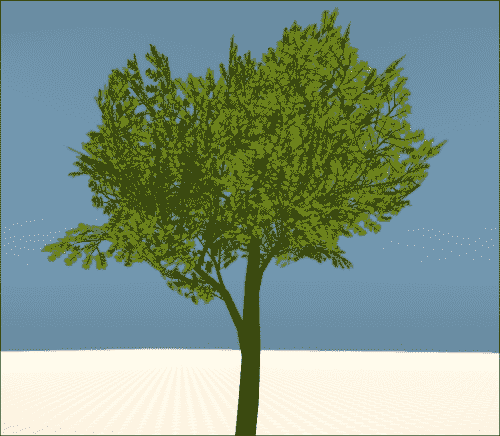
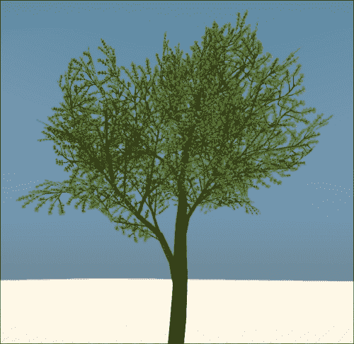

# 十、渲染器编程

CryENGINE 渲染器很可能是引擎中最知名的部分，它提供了高度复杂的图形功能，在 PC、Xbox 360 和 PlayStation 3 等平台上具有出色的性能。

在本章中，我们将涵盖以下主题:

*   学习渲染器的基本工作原理
*   看看每一帧是如何呈现给世界的
*   学习着色器创作的基础知识
*   学习如何在运行时修改静态对象
*   在运行时修改材质

# 渲染器细节

CryENGINE 渲染器是一个模块化系统，它允许绘制复杂的场景、处理着色器等等。

为了方便不同的平台架构，CryENGINE 有多个渲染器，都实现了**IRenderer**接口。 我们列出了如下的选择:

*   DirectX:在 Windows 和 Xbox 上使用
*   PSGL:在 PlayStation 3 上使用

还有一种可能是正在开发中的**OpenGL**渲染器，用于 Linux 和 Mac OS X 等平台。

## 着色器

CryENGINE 中的着色器是使用一种基于 HLSL 的专门语言——CryFX 编写的。 系统与 HLSL 非常相似，但专门用于核心引擎功能，如材质和着色器参数、`# include`宏、等。

### 注意事项

注意，在写这本书的时候，shader 编辑在免费 SDK 中还没有启用; 然而，这在未来可能会改变。

### 着色排列

每当材质改变一个着色器生成参数时，一个基础着色器的置换将被创建。 该引擎还公开了将引擎变量暴露给着色器的功能，以在运行时禁用或调整效果。

这是可能的，因为 CryFX 语言允许`# ifdef`，`# endif`和`# include`块，允许引擎在运行时剥离着色器代码的某些部分。


### 着色器缓存

由于在运行时编译着色器并不是在所有平台上都可行的，CryENGINE 提供了着色器缓存系统。 这允许存储预先编译的着色器集合，为最终用户的设备节省了相当多的工作。

### 注意事项

正如前面提到的，着色器本身可以包含大量的变化。 因此，有必要确保在设置缓存时已经编译了所有需要的排列。

#### PAK 文件

渲染器可以从`Engine`文件夹加载四个`.pak`文件，其中包含着色器定义、源文件等等。

<colgroup><col style="text-align: left"> <col style="text-align: left"></colgroup> 
| 

档案名称

 | 

描述

 |
| --- | --- |
| 【t】【t】 | 包含着色器源文件和`.ext`(定义)文件。 当使用预编译的着色器缓存时，着色器源通常被排除在这个归档文件之外。 |
| 【t】【t】 | 包含着色器源代码的二进制解析信息。 |
| 【t】【t】 | 包含所有编译过的着色器; 只在当前级别的着色器缓存中找不到着色器时使用。 |
| 【t】【t】 | 在启动时加载，以加快启动时间; 应该只包含主菜单需要的着色器。 |

# 渲染节点

提供了**IRenderNode**接口，为 Cry3DEngine 系统提供了一种管理对象的方式。

这允许生成对象可见层次结构(允许一种简单的方法来剔除当前不可见的对象)和对象的渲染。

# 渲染分解

游戏的渲染分为两个步骤:

1.  前更新
2.  文章更新

## 预更新

渲染每一帧到场景的初始步骤在`IGameFramework::PreUpdat`e 函数中发生。 Pre update 负责更新大多数游戏系统(如流图、视图系统等)，并对`ISystem::RenderBegin`进行初始调用。

### 注意事项

`PreUpdate`最常被称为`CGame::Update`，在股票`CryGame.dll`中。 始终记住，这个过程只适用于 Launcher 应用; 编辑器处理游戏更新和渲染的独特。

RenderBegin 表示新帧的开始，并告诉渲染器设置新帧 ID、清除缓冲区等等。

## 更新

在更新游戏系统后，是时候渲染场景了。 这个初始步骤是通过`IGameFramework::PostUpdate`函数完成的。

在渲染之前，对于从游戏更新中检索到的新信息至关重要的系统必须在`PreUpdate`内和之后进行更新。 这包括 flash UI、动画同步等等。

完成此操作后，`PostUpdate`将调用`ISystem::Render`，然后使用`I3DEngine::RenderWorld`函数渲染世界。

渲染完世界后，系统将对所有游戏对象调用诸如`IFlashUI::Update`、`PostUpdate`等函数，并最终调用`ISystem::RenderEnd`。


# 使用渲染上下文渲染新视图

呈现上下文本质上是本地窗口句柄的包装器。 在 Windows 上，这允许你指定一个**HWND**，然后让渲染器直接绘制到它。

渲染上下文的本质是特定于平台的，因此不能保证从一个渲染模块(如 D3D)到另一个渲染模块(如 OpenGL)的工作是相同的。

### 注意事项

注意:渲染上下文目前只支持在 Windows 的编辑器模式下运行，这用于在工具窗口中渲染视图。

为了用你的窗口句柄创建一个新的上下文，调用`IRenderer::CreateContext`。

### 注意事项

注意，上下文是在创建时自动启用的; 调用`IRenderer::MakeMainContextActive`重新启用主视图。

## 渲染

当呈现上下文时，首先需要做的是激活它。 这可以通过使用`IRenderer::SetCurrentContext`来完成。 一旦启用，渲染器会意识到它应该传递给 DirectX 的窗口。

接下来需要做的是使用`IRenderer::ChangeViewport`更新上下文的分辨率。 这指示渲染器它应该渲染的区域的位置和大小。

在此之后，只需调用典型的渲染函数，如`IRenderer::BeginFrame`(参见*渲染分解*部分)，然后通过`IRenderer::MakeMainContextActive`在最后使主上下文处于活动状态。

### 使用 I3DEngine::RenderWorld 函数

在某些情况下，手动调用`I3DEngine::RenderWorld`而不是依赖于游戏框架的更新过程是有意义的。

要做到这一点，我们需要稍微改变一下流程。 首先调用`IRenderer::SetCurrentContext`，然后调用`IRenderer::MakeMainContextActive`，如下所示:

```cs
gEnv->pRenderer->SetCurrentContext(hWnd);
// Restore context
gEnv->pRenderer->MakeMainContextActive();
```

很好，现在我们的上下文将被激活。 但为了真正渲染，我们需要填充中间的空白。 首先，我们必须在`SetCurrentContext`之后直接调用`IRenderer::ChangeViewport`，如下所示:

```cs
gEnv->pRenderer->ChangeViewport(0, 0, width, height, true);
```

这将视口设置为`0`、`0`以及我们指定的`width`和`height`变量的坐标。

设置好视口大小后，你需要将相机设置为新的分辨率，然后调用`IRenderer::SetCamera`，如下所示:

```cs
CCamera camera;
// Set frustrum based on width, height and field of view (60)
camera.SetFrustum(width, height, DEG2RAD(60));
// Set camera scale, orientation and position.
Vec3 scale(1, 1, 1);
Quat rotation = Quat::CreateRotationXYZ(Ang3(DEG2RAD(-45), 0, 0));
Vec3 position(0, 0, 0);
camera.SetMatrix(Matrix34::Create(scale, rotation, position));
gEnv->pRenderer->SetCamera(m_camera);
```

太棒了! 渲染器现在知道它应该使用哪个相机来渲染。 稍后我们还需要将此提供给`I3DEngine::RenderWorld`。 但首先我们必须清除缓冲区，以便用下面的代码删除前一帧:

```cs
// Set clear color to pure black
ColorF clearColor(0.f)

gEnv->pRenderer->SetClearColor(Vec3(clearColor.r, clearColor.g, clearColor.b));
gEnv->pRenderer->ClearBuffer(FRT_CLEAR, &clearColor);
```

然后调用`IRenderer::RenderBegin`来表示是时候开始渲染了:

```cs
gEnv->pSystem->RenderBegin();
gEnv->pSystem->SetViewCamera(m_camera);

// Insert rendering here

gEnv->pSystem->RenderEnd();
```

现在我们要做的就是渲染`SetViewCamera`和`RenderEnd`调用之间的场景:

```cs
gEnv->pRenderer->SetViewport(0, 0, width, height);
gEnv->p3DEngine->Update();

int renderFlags = SHDF_ALLOW_AO | SHDF_ALLOWPOSTPROCESS | SHDF_ALLOW_WATER | SHDF_ALLOWHDR | SHDF_ZPASS;

gEnv->p3DEngine->RenderWorld(renderFlags, &camera, 1, __FUNCTION__);
```

完成了! 世界现在是基于我们的相机设置渲染的，你应该可以通过`IRenderer::SetCurrentContext`在窗口设置中看到它。

#### I3DEngine::RenderWorld flags

渲染旗决定世界应该如何绘制。 例如，我们可以排除`SHDF_ALLOW_WATER`至完全避免掺水。 下表列出了可用的标志及其功能:

<colgroup><col style="text-align: left"> <col style="text-align: left"></colgroup> 
| 

国旗的名字

 | 

描述

 |
| --- | --- |
| 【t】【t】 | 如果没有设置，将不会使用 HDR。 |
| 【t】【t】 | 允许 Z-Pass。 |
| 【t】【t】 | 允许 z 通道，没有其他通道。 |
| 【t】【t】 | 如果设置了，z 缓冲区将永远不会被清除。 |
| 【t】【t】 | 如果未设置，所有后处理效果将被忽略。 |
| 【t】【t】 | 如果设置，**Ambient Occlusion**将被使用。 |
| 【t】【t】 | 如果没有设置，所有的水将被忽略和不渲染。 |
| 【t】【t】 | 没有异步画。 |
| 【t】【t】 | 排除近平面中的所有呈现。 |
| 【t】【t】 | 启用同步纹理流。 |
| 【t】【t】 | 如果设置，不会产生水焦散。 |

# 着色器

在 CryENGINE 中创建一个自定义着色器是相对容易的，可以简单地通过复制一个现有的着色器(`.cfx`)及其扩展文件(`.ext`)来完成。 为了这个示例，从`Engine/Shaders`中复制`Illum.ext`并将其命名为`MyShader.ext`。 然后复制`Engine/Shaders/HWScripts/CryFX/Illum.cfx`并将其重命名为`MyShader.cfx`。

注意，创建自定义着色器应该慎重考虑; 如果可以简单地使用现有的着色器，那将是最好的选择。 这是因为 CryENGINE 已经达到了着色器排列数量的可行极限。

### 注意事项

正如本章前面提到的，在写这本书的时候，CryENGINE Free SDK 中还没有启用自定义着色器创作。

## 着色器描述

每个着色器需要来定义一个描述，用来设置它的选项。 选项在全局变量`Script`中设置，如下代码所示:

```cs
float Script : STANDARDSGLOBAL
<
  string Script =        
           "Public;"
           "SupportsDeferredShading;"
           "SupportsAttrInstancing;"
           "ShaderDrawType = Light;"
           "ShaderType = General;"
>;
```

## 纹理槽

每个材质可以在一组纹理槽中指定一个纹理的文件路径，如下所示:


我们可以通过使用一组助手(如下所示)通过着色器访问这些纹理槽，然后这些助手可以被添加到自定义采样器中，然后通过`GetTexture2D`函数加载。

<colgroup><col style="text-align: left"> <col style="text-align: left"></colgroup> 
| 

槽的名字

 | 

助手的名字

 |
| --- | --- |
| 扩散 | 美元的扩散 |
| 光泽(镜面) | 美元的光泽 |
| 撞 |   |
| 撞 heightmap | BumpHeight 美元 |
| 环境 | Env 美元 |
| 环境 Cubemap | EnvironmentCubeMap 美元 |
| 细节 | 美元的细节 |
| 不透明度 | 美元不透明度 |
| 贴花纸 | $DecalOverlay |
| 地下 | 美元的地下 |
| 自定义 | CustomMap 美元 |
| 自定义二次 | CustomSecondaryMap 美元 |

## 着色标志

通过使用`# ifdef`和`# endif`预处理器命令，可以定义代码中可以在编译之前或运行时删除的区域。 这就允许使用一个übershader 和多个可切换的子效果，比如 Illum。

例如，我们可以检查用户是否正在运行 DX11，如下所示:

```cs
# if D3D11
// Include DX11 specific shader code here
# endif
```

### 材质旗帜

材质标志通过**材质编辑器**设置，允许每个材质使用不同的效果，如视差遮挡贴图和镶嵌。 材质标志在编译时评估。

要创建一个新的材质标志，打开你的着色器的`.ext`文件，用下面的代码创建一个新的属性:

```cs
Property
{
  Name = %MYPROPERTY
  Mask = 0x160000000
  Property    (My Property)
  Description (My property is a very good property)
}
```

现在当你重新启动编辑器时，你的属性应该出现在材质编辑器中。

以下是可能的属性数据列表:

<colgroup><col style="text-align: left"> <col style="text-align: left"></colgroup> 
| 

属性数据

 | 

描述

 |
| --- | --- |
| 的名字 | 定义属性的内部名称，并且是您应该使用`# ifdef`块进行检查的内容。 |
| 面具 | 独特的面具用于识别您的财产。 不应该与你的着色器定义中的其他属性冲突(`.ext`)。 |
| 财产 | 属性的公共名称，显示在材质编辑器中。 |
| 描述 | 属性的公共描述，当鼠标悬停在材质编辑器中的属性上时显示。 |
| DependencySet | 当用户修改此属性设置的纹理槽的值时，材质标志将被激活。这是最常用的组合与隐藏标志。 |
| DependencyReset | 当用户修改此属性设置为的纹理槽的值时，材质标志将被清除。用于避免与其他材质的旗帜发生冲突。 |
| 隐藏的 | 如果设置，则该属性在编辑器中不可见。 |

### 发动机标志

引擎标志由引擎直接设置，包含当前支持的着色器模型或引擎当前运行的平台等信息。

### 运行时标志

运行时标志由`%_RT_`前缀定义，可以由引擎在运行时设置或取消设置。 所有可用的标志都可以在`RunTime.ext`文件中查看。

## 采样器

采样器是一个特定纹理类型的单一纹理的表示。 通过创建自定义采样器，我们可以从着色器中引用特定的纹理，例如，加载包含预生成噪声的纹理。

预加载的采样器的示例如下代码所示:

```cs
sampler2D mySampler = sampler_state
{
  Texture = Engineimg/Textures/myTexture.dds;
  MinFilter = LINEAR;
  MagFilter = LINEAR;
  MipFilter = LINEAR;
  AddressU = Wrap;
  AddressV = Wrap;
  AddressW = Wrap;
}
```

现在我们可以在代码中引用`mySampler`。

### 使用纹理槽采样

在某些情况下，最好让你的采样器指向材质中定义的纹理槽之一。

为此，只需将纹理的路径替换为首选纹理槽的名称:

```cs
sampler2D mySamplerWithTextureSlot = sampler_state
{
  Texture = $Diffuse;
  MinFilter = LINEAR;
  MagFilter = LINEAR;
  MipFilter = LINEAR; 
  AddressU = Wrap;
  AddressV = Wrap;
  AddressW = Wrap;
}
```

当加载时，纹理将是在扩散槽中指定的材质。

## 获得纹理

现在我们有了一个纹理，我们可以学习如何在着色器中获取纹理数据。 这是通过使用`GetTexture2D`函数完成的，如下所示:

```cs
half4 myMap = GetTexture2D(mySampler, baseTC.xy);
```

第一个参数指定使用哪个采样器(在我们的例子中，是我们之前创建的采样器)，而第二个参数指定纹理坐标。

# 运行时操作静态对象

在本节中，我们将学习如何在运行时修改静态网格，允许在游戏过程中操作渲染和物理网格。

为此，首先我们需要获取对象的`IStatObj`实例。 例如，如果你正在修改一个实体，你可以使用`IEntity::GetStatObj`，如下所示:

```cs
IStatObj *pStatObj = pMyEntity->GetStatObj(0);
```

### 注意事项

注意，我们将`0`作为第一个参数传递给`IEntity::GetStatObj`。 这样做是为了获得具有最高的**细节级别**(**LOD**)的对象。 这意味着对这个静态对象所做的更改不会反映在它的其他 lod 中。

现在，您有了一个指向接口的指针，该接口保存模型的静态对象数据。

我们现在可以调用`IStatObj::GetIndexedMesh`或`IStatObj::GetRenderMesh`。 后者可能是最好的起点，因为它是由优化的索引网格数据构建的，如下代码所示:

```cs
IIndexedMesh *pIndexedMesh = pStatObj->GetIndexedMesh();
if(pIndexedMesh)
{
  IIndexedMesh::SMeshDescription meshdesc;
  pIndexedMesh->GetMesh(meshdesc);
}
```

我们现在可以访问包含网格信息的`meshdesc`变量。

请注意，我们需要调用`IStatObj::UpdateVertices`来延续我们对网格所做的更改。

### 注意事项

请记住，更改静态对象会将更改传递给使用它的所有对象。 在编辑之前使用`IStatObj::Clone`方法创建它的副本，允许您在场景中只操作一个对象。

# 在运行时修改材料

在本节中，我们将在运行时修改一个材质。

### 注意事项

与`IStatObj`类似，我们也可以克隆材质，以避免对当前使用的所有对象进行更改。 为此，调用`IMaterialManager::CloneMaterial`，可以通过`gEnv->p3DEngine->GetMaterialManager()`访问。

我们需要做的第一件事是获得我们想要编辑的素材的实例。 如果附近有实体，可以使用`IEntity::GetMaterial`，如下所示:

```cs
IMaterial *pMaterial = pEntity->GetMaterial();
```

### 注意事项

注意，如果没有设置自定义材质，`IEntity::GetMaterial`返回 null。 如果是这种情况，您可能希望依赖于诸如`IStatObj::GetMaterial`这样的函数。

## 克隆材料

注意，`IMaterial`实例可以用于多个对象。 这意味着修改对象的参数可能会导致除检索对象之外的其他对象发生变化。

为了解决这个问题，我们可以简单的克隆材料，然后通过`IMaterialManager::Clone`方法进行修改，如下图所示:

```cs
IMaterial *pNewMaterial = gEnv->p3DEngine->GetMaterialManager()->CloneMaterial(pMaterial);
```

然后我们只需要将克隆应用到我们从其中检索到原始实例的实体:

```cs
pEntity->SetMaterial(pNewMaterial);
```

现在我们可以继续修改材质的参数，或者是与分配给它的着色器相关的参数。

## 材料参数

修改材料的参数有时是有用的。 这允许我们调整每个材料的属性，如**不透明度**，**最高透明度**，和**漫反射颜色**，如下截图所示:


使用`IMaterial::SetGetMaterialParamFloat`或`IMaterial::SetGetMaterialVec3`可设置或获取材料参数。

例如，要查看我们材质的 alpha，使用以下代码:

```cs
float newAlpha = 0.5f;
pMaterial->SetGetMaterialParamFloat("alpha",  0.5f, false);
```

材料现在应该在一半的强度。

以下是可用参数的列表:

<colgroup><col style="text-align: left"> <col style="text-align: left"></colgroup> 
| 

参数名称

 | 

类型

 |
| --- | --- |
| `"alpha"` | `float` |
| `"opacity"` | `float` |
| `"glow"` | `float` |
| `"shininess"` | `float` |
| `"diffuse"` | `Vec3` |
| `"emissive"` | `Vec3` |
| `"specular"` | `Vec3` |

## 着色器参数

正如我们之前学到的，每个着色器可以暴露一组参数，允许材质在不影响全局着色器的情况下调整着色器的行为。


为了修改材质的着色参数，我们首先需要获取与这个材质相关的着色项:

```cs
const SShaderItem& shaderItem(pMaterial->GetShaderItem());
```

现在我们有了着色器项目，我们可以用下面的代码访问`IRenderShaderResources::GetParameters`:

```cs
DynArray<SShaderParam> params = shaderItem.m_pShaderResources->GetParameters();
```

我们现在可以修改其中包含的参数并调用`IRenderShaderResources::SetShaderParams`，如下所示:

```cs
// Iterate through the parameters to find the one we want to modify
for(auto it = params.begin(), end = params.end(); it != end; ++it)
{
  SShaderParam param = *it;

  if(!strcmp(paramName, param.m_Name))
  {
    UParamVal paramVal;
    paramVal.m_Float = 0.7f;

    // Set the value of the parameter (to 0.7f in this case)
    param.SetParam(paramName, &params, paramVal);

    SInputShaderResources res;
    shaderItem.m_pShaderResources->ConvertToInputResource(&res);

    res.m_ShaderParams = params;

    // Update the parameters in the resources.
    shaderItem.m_pShaderResources->SetShaderParams(&res,shaderItem.m_pShader);
    break;
  }
}
```

## 示例-植被的动态 alpha 测试

现在让我们来测试一下你的知识吧!

我们将包含一个树，用于在样本中使用 alpha 测试属性(如下面的截图所示)。 当α试验增加时，模拟叶片脱落。



为了说明这一点，我们将编写一小段代码来在运行时修改它。

首先通过创建一个名为`CTreeOfTime`的新类。 要么创建一个新的游戏对象扩展，要么从我们在[第 3 章](03.html "Chapter 3. Creating and Utilizing Custom Entities")、*创建和利用自定义实体*中创建的示例中派生一个。

创建完成后，我们需要将树对象加载到实体生成中，如下所示:

```cs
void CTreeOfTime::ProcessEvent(SEntityEvent& event)
{
  switch(event.event) 
  { 
    case ENTITY_EVENT_INIT:
    case ENTITY_EVENT_RESET:
    case ENTITY_EVENT_START_LEVEL:
    {
      IEntity *pEntity = GetEntity();

      pEntity->LoadGeometry(0, "Objects/nature/trees/ash/tree_ash_01.cgf");
    }
    break;
  }
}
```

我们的实体现在应该在生成`Objects/nature/trees/ash/tree_ash_01.cgf`对象时将其加载到其第一个槽(索引 0)中。

接下来，我们需要重写实体`Update`方法，以便根据当前时间更新 alpha-test 属性。 完成后，添加以下代码:

```cs
if(IStatObj *pStatObj = GetEntity()->GetStatObj(0))
{
  IMaterial *pMaterial = pStatObj->GetMaterial();
  if(pMaterial == nullptr)
    return;

  IMaterial *pBranchMaterial = pMaterial->GetSubMtl(0);
  if(pBranchMaterial == nullptr)
    return;

  // Make alpha peak at 12
  float alphaTest = abs(gEnv->p3DEngine->GetTimeOfDay()->GetTime() - 12) / 12;
  pBranchMaterial->SetGetMaterialParamFloat("alpha", alphaTest, false);
}
```

你现在应该有一个时间周期，在此期间你的树失去和恢复它的叶子。 这是许多在运行时修改材料的技术之一。



# 总结

在本章中，我们学习了引擎如何使用着色器，并分解了渲染过程。 现在您应该知道如何使用呈现上下文、在运行时操作静态对象以及通过编程修改材料。

如果你还没有准备好进入下一个关于音效的章节，为什么不接受一个挑战呢? 例如，您可以创建在受到攻击时变形的自定义对象。