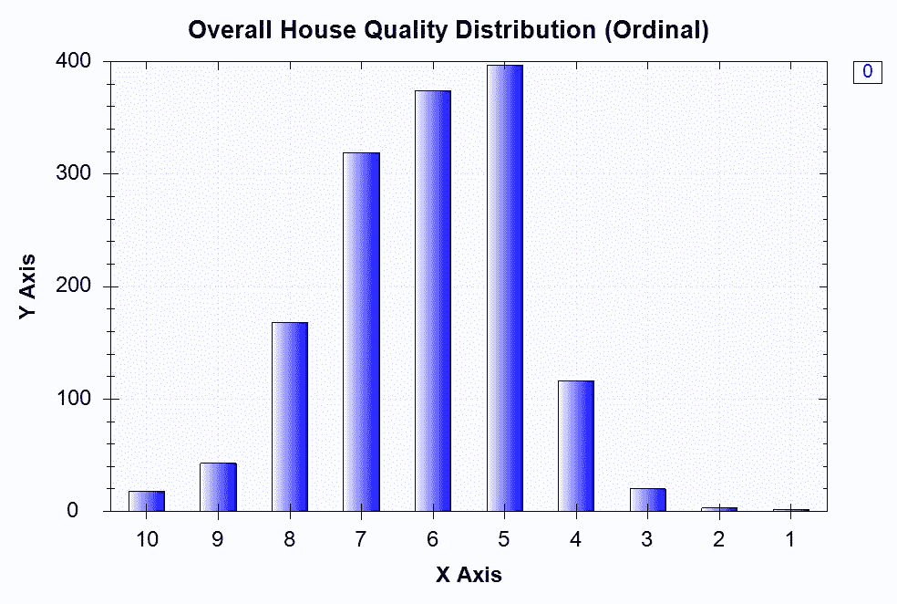
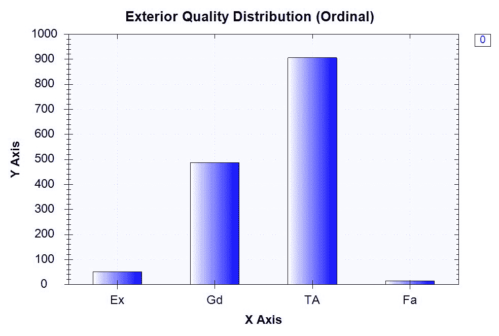
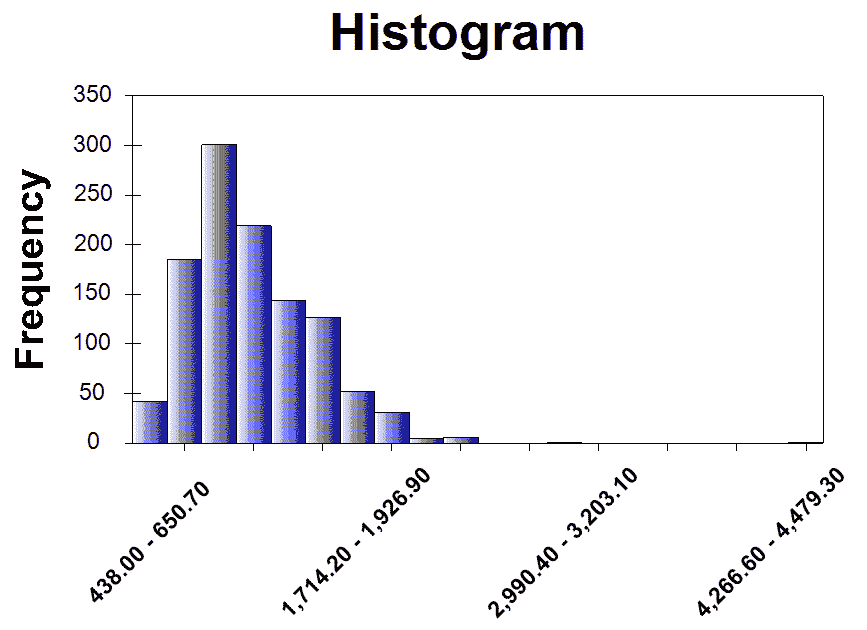
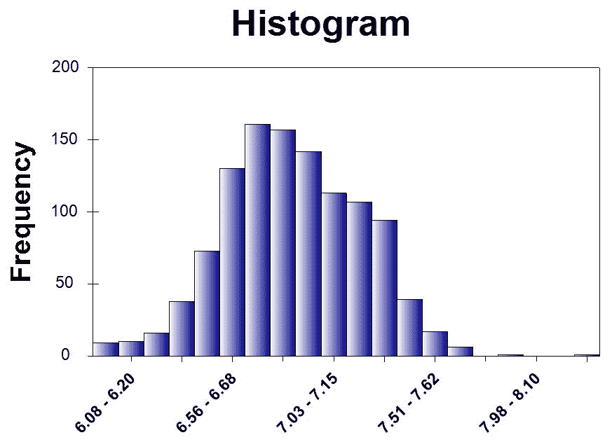
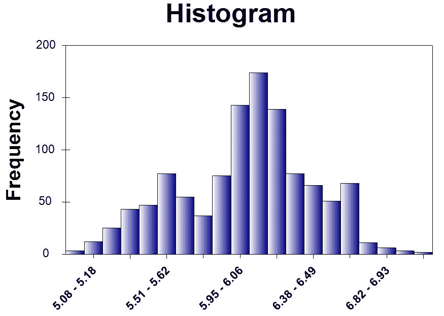
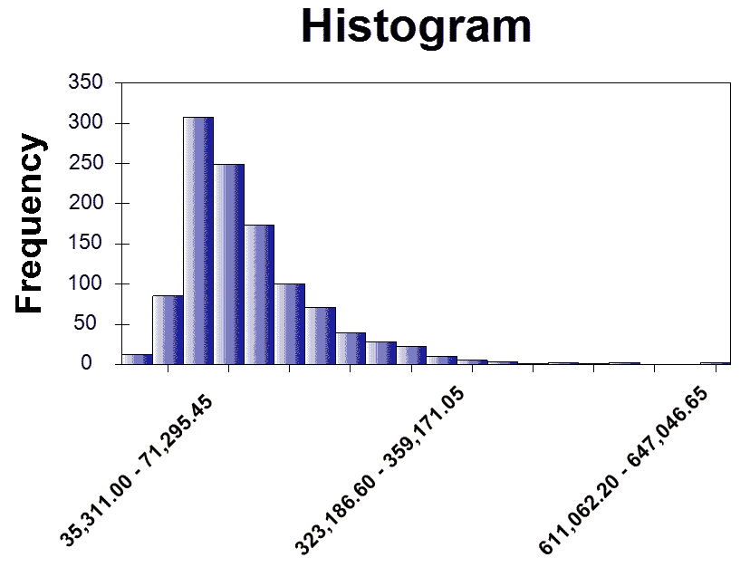
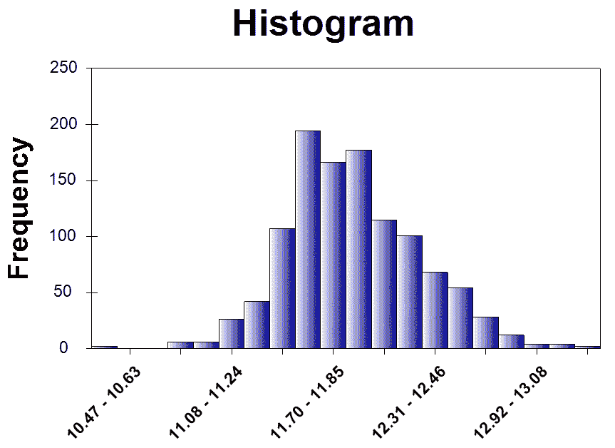
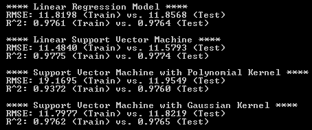
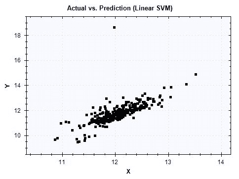
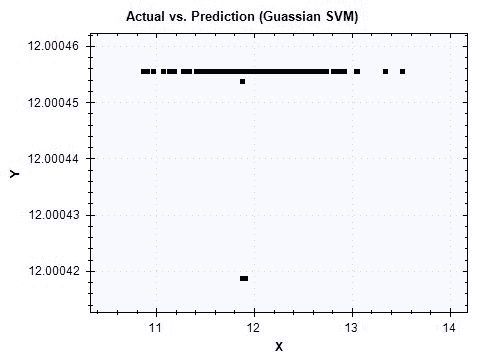

# 五、房屋和财产的公允价值

在本章中，我们将扩展我们在 C# 中构建回归**机器学习**（**ML**模型）方面的知识和技能。在最后一章中，我们在一个汇率数据集上建立了一个线性回归和线性支持向量机模型，其中所有的特征都是连续变量。然而，我们将要处理一个更复杂的数据集，其中一些特征是分类变量，而另一些是连续变量。

在本章中，我们将使用一个房价数据集，该数据集包含多种混合变量类型的房屋属性。利用这些数据，我们将开始研究两种常见类型的分类变量（有序变量和非有序变量）以及住房数据集中一些分类变量的分布。我们还将研究数据集中一些连续变量的分布，以及对显示歪斜分布的变量使用对数变换的好处。然后，我们将学习如何编码和设计这些分类特征，以便我们能够适应机器学习模型。与上一章不同，在上一章中我们探讨了**支持向量机**（**SVM**的基础知识，我们将对我们的 SVM 模型应用不同的核方法，并了解它如何影响模型性能。

与上一章类似，我们将使用**均方根误差**（**RMSE**）、R<sup class="calibre64">2</sup>以及实际值与预测值的曲线图来评估我们的 ML 模型的性能。在本章结束时，您将更好地了解如何处理分类变量，如何为回归模型编码和设计此类特征，如何应用各种核心方法构建支持向量机模型，以及如何构建预测房屋公允价值的模型。

在本章中，我们将介绍以下主题：

*   房地产项目公允价值的问题界定
*   分类变量与连续变量的数据分析
*   特征工程与编码
*   线性回归与核支持向量机
*   使用 RMSE、R<sup class="calibre64">2</sup>和实际与预测图进行模型验证

# 问题定义

让我们从理解我们将要构建的 ML 模型开始本章。当你在寻找房子或购买房产时，你会考虑你所看到的房子或房产的许多属性。你可能会看到卧室和浴室的数量，你可以在车库里停放多少辆车，邻居，房子的材料或饰面，等等。房子或房产的所有这些属性都涉及到你如何决定要为给定房产支付的价格，或者你如何与卖家协商价格。然而，很难理解和估计房地产的公允价值。通过建立一个模型来预测每套房产的公允价值或最终价格，你可以在与卖家谈判时做出更明智的决定。

为了建立房屋公允价值预测的此类模型，我们将使用一个包含 79 个解释变量的数据集，该数据集涵盖美国爱荷华州艾姆斯市住宅的几乎所有属性及其 2006 年至 2010 年的最终销售价格。该数据集由 Dean De Cock 编制（[https://ww2.amstat.org/publications/jse/v19n3/decock.pdf 杜鲁门州立大学的](https://ww2.amstat.org/publications/jse/v19n3/decock.pdf)，可从以下链接下载：[https://www.kaggle.com/c/house-prices-advanced-regression-techniques/data](https://www.kaggle.com/c/house-prices-advanced-regression-techniques/data) 。利用这些数据，我们将构建包含以下信息的特征：房屋不同部分的平方英尺或大小、房屋使用的样式和材料、房屋不同部分的条件和饰面，以及进一步描述每个房屋信息的各种其他属性。利用这些特性，我们将探索不同的回归机器学习模型，例如线性回归、线性支持向量机和具有多项式和高斯核的**支持向量机**（**支持向量机**）。然后，我们将通过查看 RMSE、R<sup class="calibre64">2</sup>以及实际值与预测值的曲线图来评估这些模型。

总结我们对房地产项目公允价值的问题定义：

*   有什么问题？我们需要一个回归模型来预测美国爱荷华州艾姆斯市住宅的公允价值，以便我们在购买房屋时能够理解并做出更明智的决策。
*   为什么这是个问题？由于在确定房屋或财产的公允价值时，其性质复杂且活动部件众多，因此有一个机器学习模型可以预测并告知购房者他们正在查看的房屋的预期价值是什么是有利的。
*   解决这个问题的方法有哪些？我们将使用一个预编译的数据集，该数据集包含 79 个解释变量，这些变量包含美国爱荷华州艾姆斯市的住宅信息，并构建和编码混合类型（分类和连续）的特征。然后，我们将探索不同核函数的线性回归和支持向量机来预测房屋的公允价值。我们将通过查看 RMSE、R<sup class="calibre64">2</sup>和实际值与预测值图来评估候选模型。
*   成功的标准是什么？由于我们希望我们对房价的预测尽可能接近实际房价，我们希望获得尽可能低的 RMSE，而不损害我们的拟合优度度量 R<sup class="calibre64">2</sup>以及实际值与预测值的对比图。

# 分类变量与连续变量

现在让我们开始查看实际的数据集。您可以点击此链接：[https://www.kaggle.com/c/house-prices-advanced-regression-techniques/data](https://www.kaggle.com/c/house-prices-advanced-regression-techniques/data) 下载`train.csv`和`data_description.txt`文件。我们将使用`train.csv`文件构建模型，`data_description.txt`文件将帮助我们更好地理解数据集的结构，特别是关于我们拥有的分类变量。

如果您查看列车数据文件和描述文件，您很容易发现有一些变量具有特定的名称或代码，它们表示每个房屋属性的特定类型。例如，AutoT0-变量可以取其中的一个值，其中包括：T1，Pt，T2，To，T4，，T5，和 T6。另一方面，如果您查看数据中的`TotalBsmtSF`变量，您可以看到它可以接受任何数值，并且这些值是连续的。如前所述，此数据集包含混合类型的变量，在处理包含分类变量和连续变量的数据集时，我们需要谨慎处理。

# 非序分类变量

让我们先看看一些分类变量及其分布。我们将要查看的第一个房屋属性是建筑类型。构建显示建筑类型分布的条形图的代码如下所示：

```cs
// Categorical Variable # 1: Building Type
Console.WriteLine("\nCategorical Variable # 1: Building Type");
var buildingTypeDistribution = houseDF.GetColumn&lt;string&gt;(
    "BldgType"
).GroupBy&lt;string&gt;(x =&gt; x.Value).Select(x =&gt; (double)x.Value.KeyCount);
buildingTypeDistribution.Print();

var buildingTypeBarChart = DataBarBox.Show(
    buildingTypeDistribution.Keys.ToArray(),
    buildingTypeDistribution.Values.ToArray()
);
buildingTypeBarChart.SetTitle("Building Type Distribution (Categorical)");
```

运行此代码时，它将显示如下条形图：


从这个条形图可以看出，我们数据集中的大多数建筑类型是 1Fam，它代表了*单族独立*建筑类型。第二种最常见的建筑类型是 TwnhsE，它代表了*联排别墅末端单元*建筑类型。

让我们来看一个更明确的变量，即批量配置（数据集中的字段）。构建批次配置分布条形图的代码如下所示：

```cs
// Categorical Variable # 2: Lot Configuration
Console.WriteLine("\nCategorical Variable # 1: Building Type");
var lotConfigDistribution = houseDF.GetColumn&lt;string&gt;(
    "LotConfig"
).GroupBy&lt;string&gt;(x =&gt; x.Value).Select(x =&gt; (double)x.Value.KeyCount);
lotConfigDistribution.Print();

var lotConfigBarChart = DataBarBox.Show(
    lotConfigDistribution.Keys.ToArray(),
    lotConfigDistribution.Values.ToArray()
);
lotConfigBarChart.SetTitle("Lot Configuration Distribution (Categorical)");
```

运行此代码时，它将显示以下条形图：


从这个条形图可以看出，内部批次是数据集中最常见的批次配置，而角落批次是第二常见的日志配置。

# 序数分类变量

我们刚才看到的两个分类变量没有自然顺序。一种类型不在另一种类型之前，或者一种类型没有比另一种类型更重的重量。然而，有些分类变量具有自然顺序，我们称这些分类变量为有序分类变量。例如，如果将材质的质量从 1 到 10 进行排序，其中 10 表示最佳，1 表示最差，则存在自然排序。让我们看看这个数据集中的一些有序分类变量。

我们要看的第一个有序分类变量是`OverallQual`属性，它表示房子的整体材料和饰面。查看此变量分布的代码如下所示：

```cs
// Ordinal Categorical Variable # 1: Overall material and finish of the house
Console.WriteLine("\nOrdinal Categorical # 1: Overall material and finish of the house");
var overallQualDistribution = houseDF.GetColumn&lt;string&gt;(
    "OverallQual"
).GroupBy&lt;int&gt;(
    x =&gt; Convert.ToInt32(x.Value)
).Select(
    x =&gt; (double)x.Value.KeyCount
).SortByKey().Reversed;
overallQualDistribution.Print();

var overallQualBarChart = DataBarBox.Show(
    overallQualDistribution.Keys.Select(x =&gt; x.ToString()),
    overallQualDistribution.Values.ToArray()
);
overallQualBarChart.SetTitle("Overall House Quality Distribution (Ordinal)");
```

运行此代码时，它将按 10 到 1 的顺序显示以下条形图：



正如所料，*非常优秀的*编码为 10，或*优秀的*、*编码为 9，类别中的房屋数量比*高于平均水平的*、编码为 6 或*平均水平的*类别中编码为 5 的房屋数量要少。*

 *我们将要研究的另一个有序分类变量是`ExterQual`变量，它表示外观质量。查看此变量分布的代码如下所示：

```cs
// Ordinal Categorical Variable # 2: Exterior Quality
Console.WriteLine("\nOrdinal Categorical # 2: Exterior Quality");
var exteriorQualDistribution = houseDF.GetColumn&lt;string&gt;(
    "ExterQual"
).GroupBy&lt;string&gt;(x =&gt; x.Value).Select(
    x =&gt; (double)x.Value.KeyCount
)[new string[] { "Ex", "Gd", "TA", "Fa" }];
exteriorQualDistribution.Print();

var exteriorQualBarChart = DataBarBox.Show(
    exteriorQualDistribution.Keys.Select(x =&gt; x.ToString()),
    exteriorQualDistribution.Values.ToArray()
);
exteriorQualBarChart.SetTitle("Exterior Quality Distribution (Ordinal)");
```

运行此代码时，它将显示以下条形图：



与`OverallQual`变量不同，`ExterQual`变量没有用于排序的数值。在我们的数据集中，它有以下值之一：`Ex`、`Gd`、`TA`和`FA`，分别代表优秀、良好、平均/典型和一般。虽然该变量没有数值，但它显然具有自然顺序，其中优秀类别（Ex）表示外部材料的最佳质量，而优秀类别（Gd）表示外部材料的第二最佳质量。在特征工程步骤中，我们将讨论如何为未来的模型构建步骤编码这种类型的变量。

# 连续变量

到目前为止，我们已经研究了数据集中的两种类型的分类变量。然而，数据集中还有另一种类型的变量；连续变量。与分类变量不同，连续变量的取值数量不受限制。例如，房屋地下室面积的平方英尺可以是任何正数。一栋房子可以有 0 平方英尺的地下室面积（或没有地下室），或者一栋房子可以有 1000 平方英尺的地下室面积。我们要看的第一个连续变量是`1stFlrSF`，它表示一楼的平方英尺。下面的代码显示了如何为`1stFlrSF`构建直方图：

```cs
// Continuous Variable # 1-1: First Floor Square Feet
var firstFloorHistogram = HistogramBox
.Show(
    houseDF.DropSparseRows()["1stFlrSF"].ValuesAll.ToArray(),
    title: "First Floor Square Feet (Continuous)"
)
.SetNumberOfBins(20);
```

运行此代码时，将显示以下直方图：



从这张图表中可以明显看出，它有一条正方向的长尾，换句话说，分布是右偏的。当我们建立 ML 模型时，数据中的偏斜会对我们产生不利影响。处理数据集中这种偏斜的一种方法是应用一些转换。一个经常使用的转换是 log 转换，其中获取给定变量的日志值。在本例中，下面的代码显示了如何将日志转换应用于`1stFlrSF`变量，并显示转换后变量的直方图：

```cs
// Continuous Variable # 1-2: Log of First Floor Square Feet
var logFirstFloorHistogram = HistogramBox
.Show(
    houseDF.DropSparseRows()["1stFlrSF"].Log().ValuesAll.ToArray(),
    title: "First Floor Square Feet - Log Transformed (Continuous)"
)
.SetNumberOfBins(20);
```

运行此代码时，您将看到以下直方图：



从这张图表中可以看出，与我们之前针对同一变量查看的直方图相比，分布看起来更对称，更接近我们熟悉的钟形。日志转换通常用于处理数据集中的偏斜，使分布更接近正态分布。让我们看看数据集中的另一个连续变量。以下代码用于显示`GarageArea`变量的分布，该变量表示车库的面积（以平方英尺为单位）：

```cs
// Continuous Variable # 2-1: Size of garage in square feet
var garageHistogram = HistogramBox
.Show(
    houseDF.DropSparseRows()["GarageArea"].ValuesAll.ToArray(),
    title: "Size of garage in square feet (Continuous)"
)
.SetNumberOfBins(20);
```

运行此代码时，您将看到以下直方图：


与前面的`1stFlrSF`案例类似，它也是右偏的，尽管它的偏斜度似乎小于`1stFlrSF`。我们使用以下代码对`GarageArea`变量应用日志转换：

```cs
// Continuous Variable # 2-2: Log of Value of miscellaneous feature
var logGarageHistogram = HistogramBox
.Show(
    houseDF.DropSparseRows()["GarageArea"].Log().ValuesAll.ToArray(),
    title: "Size of garage in square feet - Log Transformed (Continuous)"
)
.SetNumberOfBins(20);
```

运行此代码时，将显示以下直方图：



正如预期的那样，当对数转换应用于变量时，分布看起来更接近正态分布。

# 目标变量–销售价格

在进入特征工程步骤之前，我们需要查看最后一个变量；目标变量。在该房屋项目的公允价值中，我们的预测目标变量为`SalePrice`，表示 2006 年至 2010 年美国爱荷华州艾姆斯市每栋住宅的最终售价（以美元计）。由于销售价格可以取任何正数值，因此它是一个连续变量。让我们首先看看我们是如何为销售价格变量构建柱状图的：

```cs
// Target Variable: Sale Price
var salePriceHistogram = HistogramBox
.Show(
    houseDF.DropSparseRows()["SalePrice"].ValuesAll.ToArray(),
    title: "Sale Price (Continuous)"
)
.SetNumberOfBins(20);
```

运行此代码时，将显示以下直方图：



与之前连续变量的情况类似，*SalePrice*的分布有一条长长的右尾，并且严重向右倾斜。这种偏斜通常会对回归模型产生不利影响，因为其中一些模型（如线性回归模型）假设变量是正态分布的。如前所述，我们可以通过应用日志转换来解决此问题。以下代码显示了我们如何对 sale price 变量进行日志转换并构建直方图：

```cs
// Target Variable: Sale Price - Log Transformed
var logSalePriceHistogram = HistogramBox
.Show(
    houseDF.DropSparseRows()["SalePrice"].Log().ValuesAll.ToArray(),
    title: "Sale Price - Log Transformed (Continuous)"
)
.SetNumberOfBins(20);
```

运行此代码时，您将看到对数转换后的 sale price 变量的以下直方图：



正如所料，`SalePrice`变量的分布看起来更接近正态分布。我们将使用这个经过日志转换的`SalePrice`变量作为我们未来建模步骤的目标变量。

此数据分析步骤的完整代码可在此链接中找到：[https://github.com/yoonhwang/c-sharp-machine-learning/blob/master/ch.5/DataAnalyzer.cs](https://github.com/yoonhwang/c-sharp-machine-learning/blob/master/ch.5/DataAnalyzer.cs) 。

# 特征工程与编码

现在我们已经查看了数据集以及分类变量、连续变量和目标变量的分布，让我们开始为我们的 ML 模型构建特性。如前所述，数据集中的分类变量具有特定的字符串值来表示每种类型的变量。然而，您可能已经很清楚，我们不能使用字符串类型来训练我们的 ML 模型。变量的所有值都需要是数值，以便能够用于拟合模型。处理具有多种类型或类别的分类变量的一种方法是创建虚拟变量。

# 虚拟变量

虚拟变量是一个值为 0 或 1 的变量，用于指示给定的类别或类型是否存在。例如，在`BldgType`变量的情况下，它有五个不同的类别`1Fam`、`2FmCon`、`Duplx`、`TwnhsE`和`Twnhs`，我们将创建五个虚拟变量，其中每个虚拟变量表示给定记录中这五个类别的存在或不存在。下面显示了虚拟变量编码工作原理的示例：


从本例中可以看出，每种建筑类型的缺失和存在都被编码到一个单独的虚拟变量中，如`0`或`1`。例如，对于 ID 为`1`的记录，建筑类型为`1Fam`，并且对于新变量`BldgType_1Fam`使用值 1 进行编码，对于其他四个新变量`BldgType_2fmCon`、`BldgType_Duplex`、`BldgType_TwnhsE`和`BldgType_Twnhs`使用值 0 进行编码。另一方面，对于 ID 为`10`的记录，建筑类型为`2fmCon`，并使用变量`BldgType_2fmCon`的值 1 和其他四个新变量`BldgType_1Fam`、`BldgType_Duplex`、`BldgType_TwnhsE`和`BldgType_Twnhs`的值 0 进行编码。

在本章中，我们为以下分类变量列表创建了虚拟变量：

```cs
string[] categoricalVars = new string[]
{
    "Alley", "BldgType", "BsmtCond", "BsmtExposure", "BsmtFinType1", "BsmtFinType2",
    "BsmtQual", "CentralAir", "Condition1", "Condition2", "Electrical", "ExterCond",
    "Exterior1st", "Exterior2nd", "ExterQual", "Fence", "FireplaceQu", "Foundation",
    "Functional", "GarageCond", "GarageFinish", "GarageQual", "GarageType",
    "Heating", "HeatingQC", "HouseStyle", "KitchenQual", "LandContour", "LandSlope", 
    "LotConfig", "LotShape", "MasVnrType", "MiscFeature", "MSSubClass", "MSZoning", 
    "Neighborhood", "PavedDrive", "PoolQC", "RoofMatl", "RoofStyle", 
    "SaleCondition", "SaleType", "Street", "Utilities"
};
```

以下代码显示了我们编写的用于创建和编码虚拟变量的方法：

```cs
private static Frame&lt;int, string&gt; CreateCategories(Series&lt;int, string&gt; rows, string originalColName)
{

    var categoriesByRows = rows.GetAllValues().Select((x, i) =&gt;
    {
        // Encode the categories appeared in each row with 1
        var sb = new SeriesBuilder&lt;string, int&gt;();
        sb.Add(String.Format("{0}_{1}", originalColName, x.Value), 1);

        return KeyValue.Create(i, sb.Series);
    });

    // Create a data frame from the rows we just created
    // And encode missing values with 0
    var categoriesDF = Frame.FromRows(categoriesByRows).FillMissing(0);

    return categoriesDF;
}
```

从这个方法的第 8 行可以看到，我们用原始分类变量的名称作为新创建的伪变量的前缀，并将它们附加到每个类别中。例如，`1Fam`类别中的`BldgType`变量将被编码为`BldgType_1Fam`。然后，在`CreateCategories`方法的第 15 行中，我们用 0 编码所有其他值，以表示给定的分类变量中没有此类类别。

# 特征编码

现在我们已经知道了要编码哪些分类变量，并且已经为这些分类变量创建了一种虚拟变量编码方法，现在是时候用特性及其值构建一个数据框架了。让我们首先看一下我们是如何在以下代码段中创建 features 数据框的：

```cs
var featuresDF = Frame.CreateEmpty&lt;int, string&gt;();

foreach(string col in houseDF.ColumnKeys)
{
    if (categoricalVars.Contains(col))
    {
        var categoryDF = CreateCategories(houseDF.GetColumn&lt;string&gt;(col), col);

        foreach (string newCol in categoryDF.ColumnKeys)
        {
            featuresDF.AddColumn(newCol, categoryDF.GetColumn&lt;int&gt;(newCol));
        }
    }
    else if (col.Equals("SalePrice"))
    {
        featuresDF.AddColumn(col, houseDF[col]);
        featuresDF.AddColumn("Log"+col, houseDF[col].Log());
    }
    else
    {
        featuresDF.AddColumn(col, houseDF[col].Select((x, i) =&gt; x.Value.Equals("NA")? 0.0: (double) x.Value));
    }
}
```

正如您从这个代码片段中看到的，我们从一个空的 Deedle 数据帧开始，`featuresDF`*（在第 1 行中），并开始逐个添加特性。对于那些我们将要为其创建虚拟变量的分类变量，我们调用前面编写的编码方法`CreateCategories`，然后将新创建的虚拟变量列添加到`featuresDF`数据帧（第 5-12 行）。对于本项目的目标变量`SalePrice`变量，我们正在应用日志转换，并将其添加到`featuresDF`数据帧中（第 13-17 行）。最后，在将`NA`值替换为 0s 后，我们将所有其他连续变量附加到`featuresDF`数据帧（第 18-20 行）。*

 *一旦我们为我们的模型训练创建并编码了所有特征，然后我们将这个`featuresDF`数据帧导出到`.csv`文件中。下面的代码显示了如何将数据帧导出到`.csv`文件中：

```cs
string outputPath = Path.Combine(dataDirPath, "features.csv");
Console.WriteLine("Writing features DF to {0}", outputPath);
featuresDF.SaveCsv(outputPath);
```

我们现在拥有了所有必要的功能，可以用来开始构建机器学习模型来预测房屋的公允价值。特征编码和工程的完整代码可在此链接中找到：[https://github.com/yoonhwang/c-sharp-machine-learning/blob/master/ch.5/FeatureEngineering.cs](https://github.com/yoonhwang/c-sharp-machine-learning/blob/master/ch.5/FeatureEngineering.cs) 。

# 线性回归与带核支持向量机

在开始训练机器学习模型之前，我们需要做的第一件事是将数据集分割为训练集和测试集。在本节中，我们将通过随机选择并按预定义比例划分索引，将样本集划分为训练集和测试集。我们用于将数据集拆分为训练集和测试集的代码如下：

```cs
// Split the sample set into train and test sets
double trainProportion = 0.8;

int[] shuffledIndexes = featuresDF.RowKeys.ToArray();
shuffledIndexes.Shuffle();

int trainSetIndexMax = (int)(featuresDF.RowCount * trainProportion);
int[] trainIndexes = shuffledIndexes.Where(i =&gt; i &lt; trainSetIndexMax).ToArray();
int[] testIndexes = shuffledIndexes.Where(i =&gt; i &gt;= trainSetIndexMax).ToArray();

var trainSet = featuresDF.Where(x =&gt; trainIndexes.Contains(x.Key));
var testSet = featuresDF.Where(x =&gt; testIndexes.Contains(x.Key));

Console.WriteLine("\nTrain Set Shape: ({0}, {1})", trainSet.RowCount, trainSet.ColumnCount);
Console.WriteLine("Test Set Shape: ({0}, {1})", testSet.RowCount, testSet.ColumnCount);
```

您可以选择不同的比例进行培训和测试；然而，在本例中，我们保留了 80%的数据集用于培训，剩下的 20%用于测试。在代码片段的第 4-5 行中，我们首先随机洗牌数据集的索引。然后，在第 7-8 行中，我们为列车集和测试集选择子索引，在第 10-11 行中，我们将在前面的特征工程和编码步骤中创建的`featuresDF`数据帧拆分为列车集和测试集。

一旦我们准备好这些训练和测试数据帧，我们需要从数据帧中过滤掉不必要的列，因为训练和测试数据帧当前有列的值，例如`SalePrice`和`Id`。然后，我们必须将两个数据帧转换为双数组的数组，这些数组将被输入到我们的学习算法中。从列车和测试数据帧中过滤掉不需要的列，并将两个数据帧转换成数组的代码如下：

```cs
string targetVar = "LogSalePrice";
string[] features = featuresDF.ColumnKeys.Where(
    x =&gt; !x.Equals("Id") && !x.Equals(targetVar) && !x.Equals("SalePrice")
).ToArray();

double[][] trainX = BuildJaggedArray(
    trainSet.Columns[features].ToArray2D&lt;double&gt;(),
    trainSet.RowCount,
    features.Length
);
double[][] testX = BuildJaggedArray(
    testSet.Columns[features].ToArray2D&lt;double&gt;(),
    testSet.RowCount,
    features.Length
);

double[] trainY = trainSet[targetVar].ValuesAll.ToArray();
double[] testY = testSet[targetVar].ValuesAll.ToArray();
```

# 线性回归

我们将为本章的房价预测项目探索的第一个 ML 模型是线性回归模型。您应该已经熟悉使用 Accord.NET 框架在 C# 中构建线性回归模型。我们使用以下代码构建线性回归模型：

```cs
Console.WriteLine("\n**** Linear Regression Model ****");
// OLS learning algorithm
var ols = new OrdinaryLeastSquares()
{
    UseIntercept = true,
    IsRobust = true
};

// Fit a linear regression model
MultipleLinearRegression regFit = ols.Learn(
    trainX,
    trainY
);

// in-sample predictions
double[] regInSamplePreds = regFit.Transform(trainX);
// out-of-sample predictions
double[] regOutSamplePreds = regFit.Transform(testX);
```

本章线性回归模型代码与前一章代码的唯一区别在于`OrdinaryLeastSquares`学习算法的`IsRobust`参数。顾名思义，它使学习算法适合更稳健的线性回归模型，这意味着它对异常值不那么敏感。当我们有非正态分布的变量时，就像这个项目的情况一样，在拟合线性回归模型时经常会出现问题，因为传统的线性回归模型对非正态分布的异常值很敏感。将此参数设置为`true`有助于解决此问题。

# 线性支持向量机

在本章中，我们将要试验的第二种学习算法是线性支持向量机。下面的代码显示了我们如何构建线性 SVM 模型：

```cs
Console.WriteLine("\n**** Linear Support Vector Machine ****");
// Linear SVM Learning Algorithm
var teacher = new LinearRegressionNewtonMethod()
{
    Epsilon = 0.5,
    Tolerance = 1e-5,
    UseComplexityHeuristic = true
};

// Train SVM
var svm = teacher.Learn(trainX, trainY);

// in-sample predictions
double[] linSVMInSamplePreds = svm.Score(trainX);
// out-of-sample predictions
double[] linSVMOutSamplePreds = svm.Score(testX);
```

正如您可能已经注意到的，与前一章类似，我们使用`LinearRegressionNewtonMethod`作为学习算法来拟合线性 SVM。

# 多项式核支持向量机

我们将要试验的下一个模型是带有多项式核的支持向量机。我们不会详细讨论核方法，简单地说，核是输入特征变量的函数，可以将原始变量转换并投影到一个更线性可分离的新特征空间中。多项式核在原始输入特征的基础上查看输入特征的组合。在回归分析中，这些输入特征变量的组合通常被称为**交互变量**。使用不同的核方法将使 SVM 模型在同一数据集上学习和表现不同。

以下代码显示了如何使用多项式核构建 SVM 模型：

```cs
Console.WriteLine("\n**** Support Vector Machine with a Polynomial Kernel ****");
// SVM with Polynomial Kernel
var polySVMLearner = new FanChenLinSupportVectorRegression&lt;Polynomial&gt;()
{
    Epsilon = 0.1,
    Tolerance = 1e-5,
    UseKernelEstimation = true,
    UseComplexityHeuristic = true,
    Kernel = new Polynomial(3)
};

// Train SVM with Polynomial Kernel
var polySvm = polySVMLearner.Learn(trainX, trainY);

// in-sample predictions
double[] polySVMInSamplePreds = polySvm.Score(trainX);
// out-of-sample predictions
double[] polySVMOutSamplePreds = polySvm.Score(testX);
```

我们正在使用多项式核支持向量机的`FanChenLinSupportVectorRegression`学习算法。在本例中，我们使用了一个 3 次多项式，但您可以使用不同的次数进行实验。然而，学位越高，越有可能过度拟合训练数据。因此，在使用高次多项式核时，必须采取谨慎的步骤。

# 高斯核支持向量机

另一种常用的核方法是高斯核。简单地说，高斯核关注输入特征变量之间的距离，结果是接近或相似特征的值较高，距离较远的特征的值较低。高斯核可以帮助将线性不可分的数据集转换和投影到更线性可分的特征空间，并可以改善模型性能。

以下代码显示了如何使用高斯核构建 SVM 模型：

```cs
Console.WriteLine("\n**** Support Vector Machine with a Gaussian Kernel ****");
// SVM with Gaussian Kernel
var gaussianSVMLearner = new FanChenLinSupportVectorRegression&lt;Gaussian&gt;()
{
    Epsilon = 0.1,
    Tolerance = 1e-5,
    Complexity = 1e-4,
    UseKernelEstimation = true,
    Kernel = new Gaussian()
};

// Train SVM with Gaussian Kernel
var gaussianSvm = gaussianSVMLearner.Learn(trainX, trainY);

// in-sample predictions
double[] guassianSVMInSamplePreds = gaussianSvm.Score(trainX);
// out-of-sample predictions
double[] guassianSVMOutSamplePreds = gaussianSvm.Score(testX);
```

与多项式核的情况类似，我们使用了`FanChenLinSupportVectorRegression`学习算法，但将核替换为`Gaussian`方法。

到目前为止，我们已经讨论了如何为支持向量机使用不同的内核方法。现在，我们将在房价数据集上比较这些模型的性能。您可以在以下链接找到我们用于构建和评估模型的完整代码：[https://github.com/yoonhwang/c-sharp-machine-learning/blob/master/ch.5/Modeling.cs](https://github.com/yoonhwang/c-sharp-machine-learning/blob/master/ch.5/Modeling.cs) 。

# 模型验证

在我们开始研究我们在上一节中构建的线性回归和 SVM 模型的性能之前，让我们回顾一下我们在上一章中讨论的度量和诊断图。我们将研究 RMSE、R<sup class="calibre64">2</sup>以及实际值与预测值的曲线图，以评估我们模型的性能。我们将在本节中使用的模型评估代码如下：

```cs
private static void ValidateModelResults(string modelName, double[] regInSamplePreds, double[] regOutSamplePreds, double[][] trainX, double[] trainY, double[][] testX, double[] testY)
{
    // RMSE for in-sample 
    double regInSampleRMSE = Math.Sqrt(new SquareLoss(trainX).Loss(regInSamplePreds));
    // RMSE for out-sample 
    double regOutSampleRMSE = Math.Sqrt(new SquareLoss(testX).Loss(regOutSamplePreds));

    Console.WriteLine("RMSE: {0:0.0000} (Train) vs. {1:0.0000} (Test)", regInSampleRMSE, regOutSampleRMSE);

    // R^2 for in-sample 
    double regInSampleR2 = new RSquaredLoss(trainX[0].Length, trainX).Loss(regInSamplePreds);
    // R^2 for out-sample 
    double regOutSampleR2 = new RSquaredLoss(testX[0].Length, testX).Loss(regOutSamplePreds);

    Console.WriteLine("R^2: {0:0.0000} (Train) vs. {1:0.0000} (Test)", regInSampleR2, regOutSampleR2);

    // Scatter Plot of expected and actual
    var scatterplot = ScatterplotBox.Show(
        String.Format("Actual vs. Prediction ({0})", modelName), testY, regOutSamplePreds
    );

}
```

我们在模型中使用此方法的方式如下：

```cs
ValidateModelResults("Linear Regression", regInSamplePreds, regOutSamplePreds, trainX, trainY, testX, testY);
ValidateModelResults("Linear SVM", linSVMInSamplePreds, linSVMOutSamplePreds, trainX, trainY, testX, testY);
ValidateModelResults("Polynomial SVM", polySVMInSamplePreds, polySVMOutSamplePreds, trainX, trainY, testX, testY);
ValidateModelResults("Guassian SVM", guassianSVMInSamplePreds, guassianSVMOutSamplePreds, trainX, trainY, testX, testY);
```

正如您从这个代码片段中所看到的，我们通过模型将样本内和样本外预测以及训练集和测试集传递到`ValidateModelResults`方法。运行此代码时，您将在控制台上看到以下输出：



当查看拟合优度 R<sup class="calibre64">2</sup>和 RMSE 值时，线性 SVM 模型似乎对数据集具有最佳拟合，而具有高斯核的 SVM 模型似乎对数据集具有次优拟合。从这个结果来看，多项式核的支持向量机模型似乎无法很好地预测房价的公允价值。现在，让我们看看诊断图，以评估我们的模型预测房价的效果。

下图显示了线性回归模型的诊断图：


线性回归模型的诊断图看起来不错。大多数点似乎在对角线上对齐，这表明线性回归模型的预测与实际值非常吻合。

下图显示了线性 SVM 模型的诊断图：



正如之前的 R<sup class="calibre64">2</sup>度量值所预期的那样，线性 SVM 模型的拟合优度看起来不错，尽管似乎有一个预测与实际值相差甚远。大多数点似乎在一条对角线上对齐，这表明线性 SVM 模型的预测与实际值非常吻合。

下图显示了具有多项式核的 SVM 模型的诊断图：


多项式核支持向量机模型的诊断图表明，该模型的拟合优度不太好。大多数预测都在 12 点左右的直线上。这与其他指标非常一致，我们已经看到 RMSE 和 R<sup class="calibre64">2</sup>指标是我们尝试的四种模型中最差的。

下图显示了具有高斯核的 SVM 模型的诊断图：



对于具有高斯核的 SVM 模型，这种诊断图结果相当令人惊讶。从 RMSE 和 R<sup class="calibre64">2</sup>度量中，我们期望使用高斯核支持向量机的模型拟合会很好。然而，该模型的大多数预测都是直线，没有显示任何对角线模式。从这个诊断图来看，我们不能得出结论，即具有高斯核的支持向量机模型的模型拟合良好，即使 R<sup class="calibre64">2</sup>度量显示出模型拟合良好的强烈正信号。

通过观察指标数字和诊断图，我们可以得出结论，线性回归模型和线性支持向量机模型似乎最适合预测房价的公允价值。这个项目向我们展示了一个很好的例子，说明了查看诊断图的重要性。查看和优化单个指标可能很有诱惑力，但使用多个验证指标评估模型总是更好，查看诊断图（如实际值与预测值的对比图）对回归模型尤其有用。

# 总结

在本章中，我们扩展了有关构建回归模型的知识和技能。我们使用美国爱荷华州艾姆斯的住宅销售价格数据建立预测模型。与其他章节不同，我们有一个更复杂的数据集，其中变量有混合类型、分类和连续。我们研究了分类变量，其中没有自然顺序（非顺序），类别中也有自然顺序（顺序）。然后我们研究了连续变量，它们的分布有长长的右尾。我们还讨论了如何对数据中具有高偏度的变量使用对数变换来调解偏度，并使这些变量的分布更接近正态分布。

我们讨论了如何处理数据集中的分类变量。我们学习了如何为每种类型的分类变量创建和编码虚拟变量。利用这些特征，我们实验了四种不同的机器学习模型：线性回归、线性支持向量机、多项式核支持向量机和高斯核支持向量机。我们简要讨论了内核方法的用途和用法，以及如何将它们用于线性不可分数据集。使用 RMSE、R<sup class="calibre64">2</sup>和实际值与预测值的对比图，我们在模型验证步骤中评估了我们为预测美国爱荷华州艾姆斯市房价公允价值而构建的四个模型的性能，我们看到了一个验证指标结果与诊断图结果相矛盾的案例，并且我们了解了查看多个指标和诊断图以确保模型性能的重要性。

在下一章中，我们将再次切换档位。到目前为止，我们一直在学习如何使用和构建监督学习算法。然而，在下一章中，我们将学习无监督学习和更具体的聚类算法。我们将讨论如何使用聚类算法，通过在线零售数据集了解客户细分。**