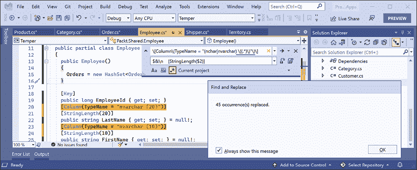

# 十三、C# 和.NET 的实际应用简介

本书的第三部分也是最后一部分是关于 C# 和.NET 的实际应用。您将学习如何构建跨平台项目，如网站、服务、移动和桌面应用。

微软将构建应用的平台称为**应用模型**或**工作负载**。

在*第 1 章*至*18*和*20*中，您可以使用特定于操作系统的 Visual Studio 或跨平台 Visual Studio 代码和 JetBrains Rider 构建所有应用。在*第 19 章**中，使用.NET MAUI*构建移动和桌面应用，虽然可以使用 Visual Studio 代码构建移动和桌面应用，但并不容易。Visual Studio 2022 for Windows 比 Visual Studio 代码（目前）更好地支持.NET MAUI。

我建议您按顺序完成本章和后续章节，因为后续章节将参考前面章节中的项目，并且您将积累足够的知识和技能来解决后续章节中更棘手的问题。

在本章中，我们将介绍以下主题：

*   了解 C# 和.NET 的应用模型
*   ASP.NETCore 中的新功能
*   构建项目
*   使用其他项目模板
*   为 Northwind 构建实体数据模型

# 了解 C# 和.NET 的应用模型

由于本书是关于 C# 10 和.NET 6 的，因此我们将了解使用它们构建实际应用的应用模型，我们将在本书的其余章节中遇到这些应用。

**了解更多信息**：微软在其.NET 应用架构指导文档中提供了关于应用模型实施的广泛指导，您可以在以下链接中阅读：[https://www.microsoft.com/net/learn/architecture](https://www.microsoft.com/net/learn/architecture)

## 使用 ASP.NETCore 构建网站

网站由从文件系统静态加载的多个网页组成，或由服务器端技术（如 ASP.NET Core）动态生成。web 浏览器使用**唯一的资源定位器**（**URL**）发出`GET`请求，该资源定位器标识每个页面，并可以使用`POST`、`PUT`和`DELETE`请求操作服务器上存储的数据。

对于许多网站，web 浏览器被视为表示层，几乎所有处理都在服务器端执行。客户端可能会使用一些 JavaScript 来实现一些表示功能，例如旋转木马。

ASP.NET Core 为网站建设提供多种技术：

*   **ASP.NETCore Razor 页面**和**Razor 类库**是为简单网站动态生成 HTML 的方法。您将在*第 14 章*中*使用 ASP.NETCore 剃须刀页面*构建网站中详细了解它们。
*   **ASP.NETCore MVC**是开发复杂网站流行的**模型视图控制器**（**MVC**设计模式）的实现。您将在*第 15 章**使用模型-视图-控制器模式*构建网站中详细了解。
*   **Blazor**允许您使用 C# 和.NET 构建用户界面组件，而不是 Angular、React 和 Vue 等基于 JavaScript 的 UI 框架。**Blazor WebAssembly**在浏览器中运行代码，就像基于 JavaScript 的框架一样。**Blazor 服务器**在服务器上运行您的代码，并动态更新网页。您将在*第 17 章*中详细了解 Blazor，*使用 Blazor*构建用户界面。Blazor 不仅仅用于构建网站；它还可以用于创建混合移动和桌面应用。

### 使用内容管理系统构建网站

大多数网站都有很多内容，如果每次需要更改某些内容时都需要开发人员参与，那就无法很好地扩展。**内容管理系统**（**CMS**允许开发者定义内容结构和模板，以提供一致性和良好设计，同时使非技术性内容所有者易于管理实际内容。他们可以创建新的页面或内容块，并更新现有内容，因为他们知道，对访问者来说，只需付出最小的努力，这些内容就会非常棒。

有许多 CMS 可用于所有 web 平台，如用于 PHP 的 WordPress 或用于 Python 的 Django CMS。支持现代.NET 的 CMS 包括优化内容云、食人鱼 CMS 和果园核心。

使用 CMS 的主要好处是它提供了友好的内容管理用户界面。内容所有者登录网站并自行管理内容。然后，使用 ASP.NETCore MVC 控制器和视图，或通过称为**无头 CMS**的 web 服务端点，将内容呈现并返回给访问者，以将内容提供给实现为移动或桌面应用、店内接触点或使用 JavaScript 框架或 Blazor 构建的客户端的“头”。

本书不涉及.NET CMS，因此我提供了一些链接，您可以在 GitHub 存储库中了解更多关于它们的信息：

[https://github.com/markjprice/cs10dotnet6/blob/main/book-links.md# net-内容管理系统](https://github.com/markjprice/cs10dotnet6/blob/main/book-links.md# net-content-management-systems)

### 使用 SPA 框架构建 web 应用

Web 应用，也称为**单页应用**（**SPA**），由一个使用前端技术构建的单个网页组成，如 Blazor WebAssembly、Angular、React、Vue 或专有 JavaScript 库，可以向后端 Web 服务发出请求用于在需要时获取更多数据，并使用常见的序列化格式（如 XML 和 JSON）发布更新的数据。典型的例子是谷歌的网络应用，如 Gmail、地图和文档。

对于 web 应用，客户端使用 JavaScript 框架或 Blazor WebAssembly 实现复杂的用户交互，但大多数重要的处理和数据访问仍然发生在服务器端，因为 web 浏览器对本地系统资源的访问有限。

JavaScript 是松散类型的，并且不是为复杂的项目设计的，因此现在大多数 JavaScript 库都使用 Microsoft TypeScript，它为 JavaScript 添加了强类型，并设计了许多现代语言功能来处理复杂的实现。

.NET SDK 有基于 JavaScript 和 TypeScript 的 SPA 的项目模板，但我们不会在本书中花费任何时间学习如何构建基于 JavaScript 和 TypeScript 的 SPA，即使这些 SPA 通常与 ASP.NET Core 一起作为后端使用，因为本书是关于 C# 的，而不是关于其他语言的。

综上所述，服务器端和客户端都可以使用 C# 和.NET 构建网站，如*图 13.1*所示：

<figure class="mediaobject"></figure>

图 13.1：使用 C# 和.NET 在服务器端和客户端构建网站

## 构建 web 和其他服务

虽然我们不会学习基于 JavaScript 和 TypeScript 的 SPA，但我们将学习如何使用**ASP.NETCore web API**构建一个 web 服务，然后从调用该 web 服务，该 web 服务来自我们 ASP.NETCore 网站中的服务器端代码，然后，我们将从 Blazor WebAssembly 调用该 web 服务组件和跨平台移动和桌面应用。

没有正式的定义，但服务有时会根据其复杂性进行描述：

*   **服务**：一个单一服务中客户端 app 所需的所有功能。
*   **微服务**：多个服务，每个专注于一组较小的功能。
*   **纳米服务**：作为服务提供的单一功能。与 365 年 7 月 24 日托管的服务和微服务不同，在需要减少资源和成本之前，纳米服务通常处于非活动状态。

除了使用 HTTP 作为底层通信技术的 web 服务和 API 的设计原则外，我们还将学习如何使用其他技术和设计理念构建服务，包括：

*   **gRPC**用于构建高效和高性能服务，支持几乎任何平台。
*   用于在组件之间建立实时通信的**信号机**。
*   **OData**用于用 web API 包装实体框架核心等数据模型。
*   **图形 QL**用于让客户端控制跨多个数据源检索哪些数据。
*   **Azure 功能**用于在云中托管无服务器纳米服务。

## 构建移动和桌面应用

有两个主要的移动平台：苹果的 iOS 和谷歌的 Android，每个平台都有自己的编程语言和平台 API。还有两种主要的桌面平台：苹果的 macOS 和微软的 Windows，它们都有自己的编程语言和平台 API，如下表所示：

*   **iOS**：目标 C 或 Swift 和 UIkit。
*   **安卓**：Java 或 Kotlin 和安卓 API。
*   **macOS**：目标 C 或 Swift 和 AppKit 或 Catalyst。
*   Windows Ty1：C、C++、或许多其他语言和 Win32 API 或 Windows APP SDK。

由于这本书是关于现代的，使用 C 和.NET 的跨平台开发，不包括使用 ToeT4 的 Windows 应用 To.T5，To.T6\. Windows 演示文稿基础 To7 T7（AutoT8，WPF Po.T99），或 OpenT10.通用 Windows 平台 To11 T11。**UWP**应用，因为它们只是窗口。

**.NET 多平台应用用户界面**（**毛伊岛**平台）可一次搭建跨平台移动和桌面应用，然后可在多个移动和桌面平台上运行。

NET MAUI 通过共享用户界面组件和业务逻辑，使开发这些应用变得容易。它们可以针对控制台应用、网站和 web 服务使用的相同.NET API。该应用将由移动设备上的 Mono 运行时和桌面设备上的 CoreCLR 运行时执行。与正常的.NET CoreCLR 运行时相比，Mono 运行时对移动设备进行了更好的优化。Blazor WebAssembly 也使用 Mono 运行时，因为它与移动应用一样，资源受限。

这些应用可以独立存在，但它们通常会调用服务来提供跨所有计算设备的体验，从服务器、笔记本电脑到手机和游戏系统。

未来对.NET MAUI 的更新将支持现有的 MVVM 和 XAML 模式，以及类似于带有 C# 的**模型视图更新**（**MVU**），类似于苹果的 Swift UI。

第六版的倒数第二章是*第 19 章**使用.NET MAUI*构建移动和桌面应用，涵盖了使用.NET MAUI 构建跨平台移动和桌面应用。

## .NET 毛伊岛的替代方案

在微软创建.NET MAUI 之前，第三方创建了开源项目，使.NET 开发人员能够使用名为**Uno**和**Avalonia**的 XAML 构建跨平台应用。

### 理解 Uno 平台

正如 Uno 在其网站上所说，它是“第一个也是唯一一个针对 Windows、WebAssembly、iOS、macOS、Android 和 Linux 的单一代码库应用的用户界面平台。”

开发人员可以跨本机移动设备、web 和桌面重用 99%的业务逻辑和 UI 层。

Uno 平台使用 Xamarin 本机平台，但不使用 Xamarin.Forms。对于 WebAssembly，Uno 使用 Mono WASM 运行时，就像 Blazor WebAssembly 一样。对于 Linux，Uno 使用 Skia 在画布上绘制用户界面。

### 理解阿瓦隆尼亚

如.NET 基金会网站所述，Avalonia“是一个基于 XAML 的跨平台 UI 框架，提供灵活的样式化系统，并通过 Xorg、macOS 支持多种操作系统，如 Windows、Linux。Avalonia 已准备好进行通用桌面应用开发。”

你可以把阿瓦罗尼亚看作是 WPF 的精神继承者。熟悉 WPF 的 WPF、Silverlight 和 UWP 开发人员可以继续受益于他们多年来已有的知识和技能。

JetBrains 使用它来更新基于 WPF 的工具，并将其跨平台使用。

VisualStudio 的 Avalonia 扩展以及与 JetBrains Rider 的深度集成使开发更容易、更高效。

# ASP.NETCore 中的新功能

在过去几年中，微软迅速扩展了 ASP.NETCore 的功能。您应该注意支持哪些.NET 平台，如下表所示：

*   ASP.NET Core 1.0 到 2.2 在.NET Core 或.NET Framework 上运行。
*   ASP.NET Core 3.0 或更高版本仅在.NET Core 3.0 或更高版本上运行。

## ASP.NETCore 1.0

ASP.NET Core 1.0 于 2016 年 6 月发布，重点是实现适用于为 Windows、macOS 和 Linux 构建现代跨平台 web 应用和服务的最低 API。

## ASP.NETCore 1.1

ASP.NET Core 1.1 于 2016 年 11 月发布，重点是缺陷修复以及功能和性能的总体改进。

## ASP.NETCore 2.0

ASP.NET Core 2.0 于 2017 年 8 月发布，专注于添加新功能，如 Razor 页面、将程序集捆绑到`Microsoft.AspNetCore.All`元包中、针对.NET 标准 2.0、提供新的身份验证模型和性能改进。

ASP.NET Core 2.0 引入的最大新功能是 ASP.NET Core Razor 页面，见*第 14 章*、*使用 ASP.NET Core Razor 页面构建网站*，以及 ASP.NET Core OData 支持，见*第 18 章*、*构建和消费专业服务*。

## ASP.NETCore 2.1

ASP.NET Core 2.1 于 2018 年 5 月发布，是一个**长期支持**（**LTS**版本），这意味着它在 2021 年 8 月 21 日之前的三年内一直受到的支持（直到 2018 年 8 月，LTS 的名称才正式分配给它，版本为 2.1.3）。

重点增加了新特性，如**信号器**用于实时通信、**剃须刀类库**用于重用 web 组件、**ASP.NETCore 标识**用于身份验证、更好地支持 HTTPS 和欧盟**等通用数据保护法规**（**GDPR**），包括下表所列主题：

<colgroup><col> <col> <col></colgroup> 
| 特色 | 章 | 话题 |
| Razor 类库 | 14 | 使用 Razor 类库 |
| GDPR 支持 | 15 | 创建和探索 ASP.NETCore MVC 网站 |
| 标识 UI 库和脚手架 | 15 | 探索 ASP.NETCore MVC 网站 |
| 集成测试 | 15 | 测试 ASP.NETCore MVC 网站 |
| `[ApiController]`、`ActionResult<T>` | 16 | 创建 ASP.NETCore Web API 项目 |
| 问题详情 | 16 | 实现 webapi 控制器 |
| `IHttpClientFactory` | 16 | 使用 HttpClientFactory 配置 HTTP 客户端 |
| NETCore 信号器 | 18 | 用信号机实现实时通信 |

## ASP.NETCore 2.2

ASP.NET Core 2.2 于 2018 年 12 月发布，专注于改进 RESTful HTTP API 的构建，将项目模板更新为 Bootstrap 4 和 Angular 6，这是 Azure 中托管的优化配置，以及性能改进，包括下表中列出的主题：

<colgroup><col> <col> <col></colgroup> 
| 特色 | 章 | 话题 |
| 红隼中的 HTTP/2 | 14 | 经典 ASP.NET 与现代 ASP.NETCore |
| 进程内托管模型 | 14 | 创建 ASP.NETCore 项目 |
| 端点路由 | 14 | 理解端点路由 |
| 健康检查 API | 16 | 实现健康检查 API |
| 开放 API 分析器 | 16 | 实现开放 API 分析器和约定 |

## ASP.NETCore 3.0

ASP.NET Core 3.0 于 2019 年 9 月发布，专注于充分利用.NET Core 3.0 和.NET Standard 2.1，这意味着它可能不支持.NET Framework，并添加了有用的改进，包括下表中列出的主题：

<colgroup><col> <col> <col></colgroup> 
| 特色 | 章 | 话题 |
| Razor 类库中的静态资产 | 14 | 使用 Razor 类库 |
| MVC 服务注册的新选项 | 15 | 了解 ASP.NETCore MVC 启动 |
| ASP.NETCore gRPC | 18 | 使用 ASP.NETCore gRPC 的建筑服务 |
| Blazor 服务器 | 17 | 使用 Blazor 服务器构建组件 |

## ASP.NETCore 3.1

ASP.NET Core 3.1 于 2019 年 12 月发布，是 LTS 版本，这意味着它将在 2022 年 12 月 3 日之前得到支持。它关注于的改进，比如 Razor 组件的部分类支持和新的`<component>`标记助手。

## Blazor WebAssembly 3.2

Blazor WebAssembly 3.2 于 2020 年 5 月发布。这是一个最新版本，意味着项目必须在.NET 5 发布后的三个月内（即 2021 年 2 月 10 日）升级到.NET 5 版本。微软终于兑现了使用.NET 进行全栈 web 开发的承诺，Blazor 服务器和 Blazor WebAssembly 都在*第 17 章*中介绍，*使用 Blazor*构建用户界面。

## ASP.NETCore 5.0

ASP.NET Core 5.0 于 2020 年 11 月发布，重点关注漏洞修复、使用缓存进行证书身份验证的性能改进、Kestrel 中 HTTP/2 响应头的 HPACK 动态压缩、ASP.NET Core 程序集的可空注释以及容器图像大小的减小，包括下表中列出的主题：

<colgroup><col> <col> <col></colgroup> 
| 特色 | 章 | 话题 |
| 允许匿名访问终结点的扩展方法 | 16 | 保护 web 服务 |
| `HttpRequest`和`HttpResponse`的 JSON 扩展方法 | 16 | 在控制器中将客户作为 JSON 获取 |

## ASP.NETCore 6.0

ASP.NET Core 6.0 于 2021 年 11 月发布，重点关注生产力改进，如最小化代码以实现基本网站和服务、.NET 热加载，以及 Blazor 的新托管选项，如使用.NET MAUI 的混合应用，包括下表中列出的主题：

<colgroup><col> <col> <col></colgroup> 
| 特色 | 章 | 话题 |
| 新的空 web 项目模板 | 14 | 理解空的 web 模板 |
| HTTP 日志记录中间件 | 16 | 启用 HTTP 日志记录 |
| 最小 API | 16 | 实现最小的 Web API |
| Blazor 误差边界 | 17 | 定义 Blazor 错误边界 |
| Blazor WebAssembly AOT | 17 | 提前编译启用 Blazor WebAssembly |
| .NET 热重新加载 | 17 | 使用.NET 热重新加载修复代码 |
| .NET 毛伊岛 Blazor 应用 | 19 | 在.NET MAUI 应用中托管 Blazor 组件 |

# 仅构建 Windows 桌面应用

用于构建仅 Windows 桌面应用的技术包括：

*   **Windows 窗体**2002。
*   Po.t0\. Windows 演示基金会 T1（2006）。
*   **Windows 应用商店**应用，2012 年。
*   **通用 Windows 平台**（**UWP**应用，2015 年。
*   **Windows App SDK**（原**WinUI 3**和**Project Reonney**应用，2021 年。

## 了解遗留 Windows 应用平台

随着 1985 年 Microsoft Windows 1.0 的发布，创建 Windows 应用的唯一方法是在三个核心 DLL 中使用 C 语言和调用函数，这三个 DLL 分别名为 kernel、user 和 GDI。一旦 Windows 在 Windows 95 中变成 32 位，DLL 就以 32 作为后缀，并被称为**Win32 API**。

1991 年，微软推出了 VisualBasic，它为开发人员提供了一种从工具箱到控件的可视化拖放方式，用于为 Windows 应用构建用户界面。它非常流行，而 VisualBasic 运行时至今仍作为 Windows10 的一部分发布。

随着 2002 年发布的 C# 和.NET Framework 的第一个版本，微软提供了构建名为**Windows 窗体**的 Windows 桌面应用的技术。在时代，网络开发的等价物被命名为**网络表单**，因此被称为补充名称。代码可以用 Visual Basic 或 C 语言编写。Windows 窗体有一个类似的拖放式可视化设计器，尽管它生成了 C# 或 visual Basic 代码来定义用户界面，这可能很难让人直接理解和编辑。

在 2006，微软发布了一个用于构建 Windows 桌面应用的更强大的技术，命名为 OutT1。Windows 演示基金会 To.T2A.（AutoT3A.WPF DouthT4），作为.NETFramework AutoT6 的 3 个组成部分。**Windows 工作流**（**WF**）。

虽然 WPF 应用只能通过编写 C# 语句来创建，但它也可以使用**可扩展应用标记语言**（**XAML**）来指定其用户界面，这对人和代码都很容易理解。Visual Studio for Windows 部分使用 WPF 构建。

2012 年，微软发布了 Windows 8，其 Windows 应用商店应用在受保护的沙箱中运行。

2015 年，微软发布了 Windows 10，更新了 Windows 应用商店应用概念，命名为**通用 Windows 平台**（**UWP**。UWP 应用可以使用 C++和 DirectX UI、JavaScript 和 HTML 或者 C 语言来构建，使用自定义的 No.T.java 的 Field.net 叉，这不是跨平台的，而是提供对底层 WRRT-API 的完全访问。

UWP 应用只能在 Windows 10 平台上运行，不能在 Windows 的早期版本上运行，但 UWP 应用可以在 Xbox 和带有运动控制器的 Windows 混合现实耳机上运行。

许多 Windows 开发者拒绝了 Windows 应用商店和 UWP 应用，因为它们对底层系统的访问有限。微软最近创建了**项目重聚**和**WinUI 3**，这两个项目协同工作，让 Windows 开发者将现代 Windows 开发的一些好处带到他们现有的 WPF 应用中，并让他们拥有与 UWP 应用相同的好处和系统集成。这项倡议现在被称为**Windows 应用 SDK**。

## 了解传统 Windows 平台对现代.NET 的支持

用于 Linux 和 macOS 的.NET SDK 的磁盘大小约为 330 MB。用于 Windows 的.NET SDK 的磁盘大小约为 440MB。这是因为它包括 Windows 桌面运行时，它允许旧 Windows 应用平台 Windows 窗体和 WPF 在现代.NET 上运行。

有许多使用 Windows 窗体和 WPF 构建的企业应用需要使用新功能进行维护或增强，但直到最近它们还停留在.NET Framework 上，而该平台现在是一个遗留平台。借助现代.NET 及其 Windows 桌面包，这些应用现在可以使用.NET 的全部现代功能。

# 构建项目

你应该如何组织你的项目？到目前为止，我们已经构建了一些小型的独立控制台应用来演示语言或库功能。在本书的其余部分中，我们将使用不同的技术构建多个项目，这些技术共同提供一个解决方案。

对于大型、复杂的解决方案，很难在所有代码之间导航。因此，构建项目结构的主要原因是为了更容易找到组件。最好为您的解决方案或工作区提供一个反映应用或解决方案的全称。

我们将为一家名为**北风**的虚构公司建立多个项目。我们将把解决方案或工作区命名为`PracticalApps`，并使用名称`Northwind`作为所有项目名称的前缀。

有许多方法可以对项目和解决方案进行结构和命名，例如，使用文件夹层次结构和命名约定。如果你在一个团队中工作，确保你知道你的团队是如何工作的。

## 在解决方案或工作区中结构化项目

在解决方案或工作区中为您的项目建立一个命名约定是很好的，这样任何开发人员都可以立即知道每个项目都在做什么。常见的选择是使用项目类型，例如类库、控制台应用、网站等，如下表所示：

<colgroup><col> <col></colgroup> 
| 名称 | 描述 |
| `Northwind.Common` | 用于跨多个项目使用的接口、枚举、类、记录和结构等常见类型的类库项目。 |
| `Northwind.Common.EntityModels` | 通用 EF 核心实体模型的类库项目。实体模型通常在服务器端和客户端都使用，因此最好分离对特定数据库提供程序的依赖关系。 |
| `Northwind.Common.DataContext` | EF 核心数据库上下文的类库项目，依赖于特定的数据库提供程序。 |
| `Northwind.Web` | 一个简单网站的 ASP.NETCore 项目，该网站混合使用静态 HTML 文件和动态页面。 |
| `Northwind.Razor.Component` | 用于多个项目中使用的 Razor 页面的类库项目。 |
| `Northwind.Mvc` | 一个 ASP.NETCore 项目，用于使用 MVC 模式的复杂网站，可以更容易地进行单元测试。 |
| `Northwind.WebApi` | HTTP API 服务的 ASP.NETCore 项目。这是与网站集成的好选择，因为它们可以使用任何 JavaScript 库或 Blazor 与服务交互。 |
| `Northwind.OData` | HTTP API 服务的 ASP.NETCore 项目，该服务实现 OData 标准以使客户端能够控制查询。 |
| `Northwind.GraphQL` | HTTP API 服务的 ASP.NETCore 项目，该服务实现 GraphQL 标准以使客户端能够控制查询。 |
| `Northwind.gRPC` | gRPC 服务的 ASP.NETCore 项目。与任何语言和平台构建的应用集成是一个很好的选择，因为 gRPC 具有广泛的支持、高效和高性能。 |
| `Northwind.SignalR` | 用于实时通信的 ASP.NETCore 项目。 |
| `Northwind.AzureFuncs` | 一个 ASP.NETCore 项目，用于在 Azure 功能中实现托管的无服务器 nanoservice。 |
| `Northwind.BlazorServer` | ASP.NETCore Blazor 服务器项目。 |
| `Northwind.BlazorWasm.Client` | ASP.NETCore Blazor WebAssembly 客户端项目。 |
| `Northwind.BlazorWasm.Server` | ASP.NETCore Blazor WebAssembly 服务器端项目。 |
| `Northwind.Maui` | 跨平台桌面/移动应用的.NET MAUI 项目。 |
| `Northwind.MauiBlazor` | 一个.NETMAUI 项目，用于托管 Blazor 组件，并与操作系统进行本机集成。 |

# 使用其他项目模板

安装.NET SDK 时，会包含很多项目模板：

1.  在命令提示或终端，输入以下命令：

    ```cs
    dotnet new --list 
    ```

2.  You will see a list of currently installed templates, including templates for Windows desktop development if you are running on Windows, as shown in *Figure 13.2*:

    <figure class="mediaobject"></figure>

    图 13.2:dotnet 项目模板列表

3.  注意与 web 相关的项目模板，包括使用 Blazor、Angular 和 React 创建 SPA 的模板。但缺少另一个常见的 JavaScript SPA 库：Vue。

## 安装其他模板包

开发者可以安装很多额外的模板包：

1.  启动浏览器并导航至[http://dotnetnew.azurewebsites.net/](http://dotnetnew.azurewebsites.net/) 。
2.  Enter `vue` in the textbox and note the list of available templates for Vue.js, including one published by Microsoft, as shown in *Figure 13.3*:

    <figure class="mediaobject"></figure>

    图 13.3:Microsoft 提供的 Vue.js 项目模板

3.  点击微软提供的**ASP.NET Core with Vue.js**并注意安装和使用此模板的说明，如以下命令所示：

    ```cs
    dotnet new --install "Microsoft.AspNetCore.SpaTemplates"
    dotnet new vue 
    ```

4.  点击**查看此包**中的其他模板，注意除了 Vue.js 的项目模板外，它还有 Aurelia 和 Knockout.js 的项目模板。

# 为 Northwind 数据库构建实体数据模型

实际应用通常需要处理关系数据库或其他数据存储中的数据。在本章中，我们将为存储在 SQL Server 或 SQLite 中的 Northwind 数据库定义实体数据模型。它将用于我们在后续章节中创建的大多数应用中。

`Northwind4SQLServer.sql`和`Northwind4SQLite.sql`脚本文件不同。SQL Server 脚本创建 13 个表以及相关视图和存储过程。SQLite 的脚本是一个简化版本，只创建 10 个表，因为 SQLite 不支持那么多功能。本书中的主要项目只需要这 10 个表，因此您可以使用任意一个数据库完成本书中的每项任务。

有关安装 SQL Server 和 SQLite 的说明，请参见*第 10 章*、*使用实体框架核心*处理数据。在这一章中，您还将找到安装`dotnet-ef`工具的说明，您将使用该工具从现有数据库构建实体模型。

**良好实践**：您应该为实体数据模型创建一个单独的类库项目。这使得后端 web 服务器与前端桌面、移动和 Blazor WebAssembly 客户端之间的共享更加容易。

## 使用 SQLite 为实体模型创建类库

现在，您将在类库中定义实体数据模型，以便它们可以在其他类型的项目中重用，包括客户端应用模型。如果您不使用 SQL Server，则需要为 SQLite 创建此类库。如果您使用的是 SQL Server，那么您可以为 SQLite 和 SQL Server 创建一个类库，然后根据您的选择在它们之间切换。

我们将使用 EF Core 命令行工具自动生成一些实体模型：

1.  使用您首选的代码编辑器创建名为`PracticalApps`的新解决方案/工作区。
2.  添加类库项目，如以下列表中所定义：
    1.  项目模板：**类库**/`classlib`
    2.  工作区/解决方案文件和文件夹：`PracticalApps`
    3.  项目文件和文件夹：`Northwind.Common.EntityModels.Sqlite`
3.  在`Northwind.Common.EntityModels.Sqlite`项目中，添加 SQLite 数据库提供程序和 EF 核心设计时支持的包引用，如以下标记所示：

    ```cs
    <ItemGroup>
      <PackageReference
        Include="Microsoft.EntityFrameworkCore.Sqlite" 
        Version="6.0.0" />
      <PackageReference 
        Include="Microsoft.EntityFrameworkCore.Design" 
        Version="6.0.0">
        <PrivateAssets>all</PrivateAssets>
        <IncludeAssets>runtime; build; native; contentfiles; analyzers; buildtransitive</IncludeAssets>
      </PackageReference>  
    </ItemGroup> 
    ```

4.  删除`Class1.cs`文件。
5.  构建项目。
6.  通过将`Northwind4SQLite.sql`文件复制到`PracticalApps`文件夹中，为 SQLite 创建`Northwind.db`文件，然后在命令提示符或终端输入以下命令：

    ```cs
    sqlite3 Northwind.db -init Northwind4SQLite.sql 
    ```

7.  耐心等待，因为此命令可能需要一段时间来创建数据库结构，如以下输出所示：

    ```cs
    -- Loading resources from Northwind4SQLite.sql 
    SQLite version 3.35.5 2021-04-19 14:49:49
    Enter ".help" for usage hints.
    sqlite> 
    ```

8.  在 Windows 上按 Ctrl+C 或在 macOS 上按 Cmd+D 退出 SQLite 命令模式。
9.  打开`Northwind.Common.EntityModels.Sqlite`文件夹的命令提示符或终端。
10.  At the command line, generate entity class models for all tables, as shown in the following commands:

    ```cs
    dotnet ef dbcontext scaffold "Filename=../Northwind.db" Microsoft.EntityFrameworkCore.Sqlite --namespace Packt.Shared --data-annotations 
    ```

    注意以下几点：

    *   要执行的命令：`dbcontext scaffold`
    *   连接字符串。`"Filename=../Northwind.db"`
    *   数据库提供程序：`Microsoft.EntityFrameworkCore.Sqlite`
    *   名称空间：`--namespace Packt.Shared`
    *   要使用数据注释以及 Fluent API:`--data-annotations`
11.  注意构建消息和警告，如以下输出所示：

    ```cs
    Build started...
    Build succeeded.
    To protect potentially sensitive information in your connection string, you should move it out of source code. You can avoid scaffolding the connection string by using the Name= syntax to read it from configuration - see https://go.microsoft.com/fwlink/?linkid=2131148\. For more guidance on storing connection strings, see http://go.microsoft.com/fwlink/?LinkId=723263. 
    ```

### 改进类到表的映射

`dotnet-ef`命令行工具为 SQL Server 和 SQLite 生成不同的代码，因为它们支持不同级别的功能。

例如，SQL Server 文本列可以限制字符数。SQLite 不支持这一点。因此，`dotnet-ef`将生成验证属性，以确保`string`属性对于 SQL Server 而不是 SQLite 被限制为指定的字符数，如下代码所示：

```cs
// SQLite database provider-generated code
[Column(TypeName = "nvarchar (15)")] 
public string CategoryName { get; set; } = null!;
// SQL Server database provider-generated code 
[StringLength(15)]
public string CategoryName { get; set; } = null!; 
```

两个数据库提供程序都不会根据需要标记不可为空的`string`属性：

```cs
// no runtime validation of non-nullable property
public string CategoryName { get; set; } = null!;
// nullable property
public string? Description { get; set; }
// decorate with attribute to perform runtime validation
[Required]
public string CategoryName { get; set; } = null!; 
```

我们将做一些小改动来改进 SQLite 的实体模型映射和验证规则：

1.  打开`Customer.cs`文件，添加正则表达式验证其主键值，只允许大写西文字符，如下代码中突出显示：

    ```cs
    [Key]
    [Column(TypeName = "nchar (5)")]
    **[****RegularExpression(****"[A-Z]{5}"****)****]**
    public string CustomerId { get; set; } 
    ```

2.  激活代码编辑器的查找和替换功能（在 Visual Studio 2022 中，导航到**编辑****查找和替换****快速替换**，打开**使用正则表达式**，然后在搜索框中键入正则表达式，如以下表达式所示：

    ```cs
    \[Column\(TypeName = "(nchar|nvarchar) \((.*)\)"\)\] 
    ```

3.  In the replace box, type a replacement regular expression, as shown in the following expression:

    ```cs
    $&\n    [StringLength($2)] 
    ```

    在换行符`\n`之后，我在我的系统中加入了四个空格字符以正确缩进，每个缩进级别使用两个空格字符。您可以插入任意数量的内容。

4.  设置“查找和替换”以搜索当前项目中的文件。
5.  Execute the search and replace to replace all, as shown in *Figure 13.4*:

    <figure class="mediaobject"></figure>

    图 13.4：在 Visual Studio 2022 中使用正则表达式搜索和替换所有匹配项

6.  Change any date/time properties, for example, in `Employee.cs`, to use a nullable `DateTime` instead of an array of bytes, as shown in the following code:

    ```cs
    // before
    [Column(TypeName = "datetime")] 
    public byte[] BirthDate { get; set; }
    // after
    [Column(TypeName = "datetime")]
    public DateTime? BirthDate { get; set; } 
    ```

    使用代码编辑器的“查找”功能搜索`"datetime"`，以查找所有需要更改的属性。

7.  Change any `money` properties, for example, in `Order.cs`, to use a nullable `decimal` instead of an array of bytes, as shown in the following code:

    ```cs
    // before
    [Column(TypeName =  "money")] 
    public byte[] Freight { get; set; }
    // after
    [Column(TypeName = "money")]
    public decimal? Freight { get; set; } 
    ```

    使用代码编辑器的“查找”功能搜索`"money"`，以查找所有需要更改的属性。

8.  Change any `bit` properties, for example, in `Product.cs`, to use a `bool` instead of an array of bytes, as shown in the following code:

    ```cs
    // before
    [Column(TypeName = "bit")]
    public byte[] Discontinued { get; set; } = null!;
    // after
    [Column(TypeName = "bit")]
    public bool Discontinued { get; set; } 
    ```

    使用代码编辑器的“查找”功能搜索`"bit"`，以查找所有需要更改的属性。

9.  在`Category.cs`中，将`CategoryId`属性设置为`int`，如下代码所示：

    ```cs
    [Key]
    public **int** CategoryId { get; set; } 
    ```

10.  在`Category.cs`中，将设置为所需的`CategoryName`属性，如下代码中突出显示：

    ```cs
    **[****Required****]**
    [Column(TypeName = "nvarchar (15)")]
    [StringLength(15)]
    public string CategoryName { get; set; } 
    ```

11.  在`Customer.cs`中，将`CompanyName`属性设置为必填项，如下代码中突出显示：

    ```cs
    **[****Required****]**
    [Column(TypeName = "nvarchar (40)")]
    [StringLength(40)]
    public string CompanyName { get; set; } 
    ```

12.  在`Employee.cs`中，将`EmployeeId`属性设置为`int`而不是`long`。
13.  在`Employee.cs`中，设置所需的`FirstName`和`LastName`属性。
14.  在`Employee.cs`中，将`ReportsTo`属性设置为`int?`而不是`long?`。
15.  在`EmployeeTerritory.cs`中，将`EmployeeId`属性设置为`int`而不是`long`。
16.  在`EmployeeTerritory.cs`中，将`TerritoryId`属性设置为必填项。
17.  在`Order.cs`中，将`OrderId`属性设置为`int`而不是`long`。
18.  在`Order.cs`中，用正则表达式修饰`CustomerId`属性，以强制使用五个大写字符。
19.  在`Order.cs`中，将`EmployeeId`属性设置为`int?`而不是`long?`。
20.  在`Order.cs`中，将`ShipVia`属性设置为`int?`而不是`long?`。
21.  在`OrderDetail.cs`中，将`OrderId`属性设置为`int`而不是`long`。
22.  在`OrderDetail.cs`中，将`ProductId`属性设置为`int`而不是`long`。
23.  在`OrderDetail.cs`中，将`Quantity`属性设置为`short`而不是`long`。
24.  在`Product.cs`中，将`ProductId`属性设置为`int`而不是`long`。
25.  在`Product.cs`中，将`ProductName`属性设置为必填项。
26.  在`Product.cs`中，将`SupplierId`和`CategoryId`属性设置为`int?`而不是`long?`。
27.  在`Product.cs`中，将`UnitsInStock`、`UnitsOnOrder`和`ReorderLevel`属性设置为`short?`而不是`long?`。
28.  在`Shipper.cs`中，将`ShipperId`属性设置为`int`而不是`long`。
29.  在`Shipper.cs`中，将`CompanyName`属性设置为必填项。
30.  在`Supplier.cs`中，将`SupplierId`属性设置为`int`而不是`long`。
31.  在`Supplier.cs`中，将`CompanyName`属性设置为必填项。
32.  在`Territory.cs`中，将`RegionId`属性设置为`int`而不是`long`。
33.  在`Territory.cs`中，设置所需的`TerritoryId`和`TerritoryDescription`属性。

现在我们有了一个实体类的类库，我们可以为数据库上下文创建一个类库。

### 为 Northwind 数据库上下文创建类库

现在您将定义一个数据库上下文类库：

1.  将类库项目添加到解决方案/工作区，如下表所示：
    1.  项目模板：**类库**/`classlib`
    2.  工作区/解决方案文件和文件夹：`PracticalApps`
    3.  项目文件和文件夹：`Northwind.Common.DataContext.Sqlite`
2.  在 Visual Studio 中，将解决方案的启动项目设置为当前选择。
3.  在 Visual Studio 代码中，选择`Northwind.Common.DataContext.Sqlite`作为活动的 OmniSharp 项目。
4.  In the `Northwind.Common.DataContext.Sqlite` project, add a project reference to the `Northwind.Common.EntityModels.Sqlite` project and add a package reference to the EF Core data provider for SQLite, as shown in the following markup:

    ```cs
    <ItemGroup>
      <PackageReference 
        Include="Microsoft.EntityFrameworkCore.SQLite" 
        Version="6.0.0" />
    </ItemGroup>
    <ItemGroup>
      <ProjectReference Include=
        "..\Northwind.Common.EntityModels.Sqlite\Northwind.Common
    .EntityModels.Sqlite.csproj" />
    </ItemGroup> 
    ```

    项目引用的路径在项目文件中不应有换行符。

5.  在`Northwind.Common.DataContext.Sqlite`项目中，删除`Class1.cs`类文件。
6.  建设`Northwind.Common.DataContext.Sqlite`项目。
7.  Move the `NorthwindContext.cs` file from the `Northwind.Common.EntityModels.Sqlite` project/folder to the `Northwind.Common.DataContext.Sqlite` project/folder.

    在 Visual Studio**解决方案资源管理器**中，如果在项目之间拖放文件，则会复制该文件。如果在拖放时按住 Shift 键，它将被移动。在 Visual Studio 代码**资源管理器**中，如果在项目之间拖放文件，它将被移动。如果在拖放时按住 Ctrl 键，则会复制它。

8.  In `NorthwindContext.cs`, in the `OnConfiguring` method, remove the compiler `# warning` about the connection string.

    **良好实践**：我们将覆盖任何需要使用 Northwind 数据库的网站等项目中的默认数据库连接字符串，因此从`DbContext`派生的类必须有一个带`DbContextOptions`参数的构造函数才能工作，如下代码所示：

    ```cs
    public NorthwindContext(DbContextOptions<NorthwindContext> options)
      : base(options)
    {
    } 
    ```

9.  In the `OnModelCreating` method, remove all Fluent API statements that call the `ValueGeneratedNever` method to configure primary key properties like `SupplierId` to never generate a value automatically or call the `HasDefaultValueSql` method, as shown in the following code:

    ```cs
    modelBuilder.Entity<Supplier>(entity =>
    {
      entity.Property(e => e.SupplierId).ValueGeneratedNever();
    }); 
    ```

    如果我们不删除上述配置，那么当我们添加新供应商时，`SupplierId`值将始终为 0，我们将只能添加一个具有该值的供应商，然后所有其他尝试都将抛出异常。

10.  对于`Product`实体，告诉 SQLite`UnitPrice`可以从`decimal`转换为`double`。`OnModelCreating`方法现在应该大大简化，如下代码

    ```cs
    protected override void OnModelCreating(ModelBuilder modelBuilder)
    {
      modelBuilder.Entity<OrderDetail>(entity =>
      {
        entity.HasKey(e => new { e.OrderId, e.ProductId });
        entity.HasOne(d => d.Order)
          .WithMany(p => p.OrderDetails)
          .HasForeignKey(d => d.OrderId)
          .OnDelete(DeleteBehavior.ClientSetNull);
        entity.HasOne(d => d.Product)
          .WithMany(p => p.OrderDetails)
          .HasForeignKey(d => d.ProductId)
          .OnDelete(DeleteBehavior.ClientSetNull);
      });
      modelBuilder.Entity<Product>()
        .Property(product => product.UnitPrice)
        .HasConversion<double>();
      OnModelCreatingPartial(modelBuilder);
    } 
    ```

    中的所示：
11.  添加一个名为`NorthwindContextExtensions.cs`的类并修改其内容，定义一个扩展方法，将 Northwind 数据库上下文添加到依赖服务集合中，如下代码所示：

    ```cs
    using Microsoft.EntityFrameworkCore; // UseSqlite
    using Microsoft.Extensions.DependencyInjection; // IServiceCollection
    namespace Packt.Shared;
    public static class NorthwindContextExtensions
    {
      /// <summary>
      /// Adds NorthwindContext to the specified IServiceCollection. Uses the Sqlite database provider.
      /// </summary>
      /// <param name="services"></param>
      /// <param name="relativePath">Set to override the default of ".."</param>
      /// <returns>An IServiceCollection that can be used to add more services.</returns>
      public static IServiceCollection AddNorthwindContext(
        this IServiceCollection services, string relativePath = "..")
      {
        string databasePath = Path.Combine(relativePath, "Northwind.db");
        services.AddDbContext<NorthwindContext>(options =>
          options.UseSqlite($"Data Source={databasePath}")
        );
        return services;
      }
    } 
    ```

12.  构建两个类库并修复任何编译器错误。

## 使用 SQL Server 为实体模型创建类库

要使用 SQL Server，如果您已经在*第 10 章*中设置了 Northwind 数据库，*使用实体框架核心*处理数据，您将不需要做任何事情。但您现在将使用`dotnet-ef`工具创建实体模型：

1.  使用您首选的代码编辑器创建名为`PracticalApps`的新解决方案/工作区。
2.  添加类库项目，如以下列表中所定义：
    1.  项目模板：**类库**/`classlib`
    2.  工作区/解决方案文件和文件夹：`PracticalApps`
    3.  项目文件和文件夹：`Northwind.Common.EntityModels.SqlServer`
3.  在`Northwind.Common.EntityModels.SqlServer`项目中，为 SQL Server 数据库提供程序和 EF 核心设计时支持添加包引用，如以下标记所示：

    ```cs
    <ItemGroup>
      <PackageReference
        Include="Microsoft.EntityFrameworkCore.SqlServer" 
        Version="6.0.0" />
      <PackageReference 
        Include="Microsoft.EntityFrameworkCore.Design" 
        Version="6.0.0">
        <PrivateAssets>all</PrivateAssets>
        <IncludeAssets>runtime; build; native; contentfiles; analyzers; buildtransitive</IncludeAssets>
      </PackageReference>  
    </ItemGroup> 
    ```

4.  删除`Class1.cs`文件。
5.  构建项目。
6.  打开`Northwind.Common.EntityModels.SqlServer`文件夹的命令提示符或终端。
7.  At the command line, generate entity class models for all tables, as shown in the following commands:

    ```cs
    dotnet ef dbcontext scaffold "Data Source=.;Initial Catalog=Northwind;Integrated Security=true;" Microsoft.EntityFrameworkCore.SqlServer --namespace Packt.Shared --data-annotations 
    ```

    注意以下几点：

    *   要执行的命令：`dbcontext scaffold`
    *   连接字符串。`"Data Source=.;Initial Catalog=Northwind;Integrated Security=true;"`
    *   数据库提供程序：`Microsoft.EntityFrameworkCore.SqlServer`
    *   名称空间：`--namespace Packt.Shared`
    *   要使用数据注释以及 Fluent API:`--data-annotations`
8.  在`Customer.cs`中，添加一个正则表达式来验证其主键值，只允许使用大写西文字符，如下代码中突出显示：

    ```cs
    [Key]
    [StringLength(5)]
    **[****RegularExpression(****"[A-Z]{5}"****)****]** 
    public string CustomerId { get; set; } = null!; 
    ```

9.  在`Customer.cs`中，设置所需的`CustomerId`和`CompanyName`属性。
10.  将类库项目添加到解决方案/工作区，如以下列表中所定义：
    1.  项目模板：**类库**/`classlib`
    2.  工作区/解决方案文件和文件夹：`PracticalApps`
    3.  项目文件和文件夹：`Northwind.Common.DataContext.SqlServer`
11.  在 Visual Studio 代码中，选择`Northwind.Common.DataContext.SqlServer`作为活动的 OmniSharp 项目。
12.  在`Northwind.Common.DataContext.SqlServer`项目中，为`Northwind.Common.EntityModels.SqlServer`项目添加项目引用，为 SQL Server 的 EF 核心数据提供程序添加包引用，如下标记所示：

    ```cs
    <ItemGroup>
      <PackageReference 
        Include="Microsoft.EntityFrameworkCore.SqlServer" 
        Version="6.0.0" />
    </ItemGroup>
    <ItemGroup>
      <ProjectReference Include=
        "..\Northwind.Common.EntityModels.SqlServer\Northwind.Common
    .EntityModels.SqlServer.csproj" />
    </ItemGroup> 
    ```

13.  在`Northwind.Common.DataContext.SqlServer`项目中，删除`Class1.cs`类文件。
14.  建设`Northwind.Common.DataContext.SqlServer`项目。
15.  将`NorthwindContext.cs`文件从`Northwind.Common.EntityModels.SqlServer`项目/文件夹移动到`Northwind.Common.DataContext.SqlServer`项目/文件夹。
16.  在`NorthwindContext.cs`中，删除关于连接字符串的编译器警告。
17.  添加一个名为`NorthwindContextExtensions.cs`的类，修改其内容，定义一个扩展方法，将 Northwind 数据库上下文添加到依赖服务集合中，如下代码所示：

    ```cs
    using Microsoft.EntityFrameworkCore; // UseSqlServer
    using Microsoft.Extensions.DependencyInjection; // IServiceCollection
    namespace Packt.Shared;
    public static class NorthwindContextExtensions
    {
      /// <summary>
      /// Adds NorthwindContext to the specified IServiceCollection. Uses the SqlServer database provider.
      /// </summary>
      /// <param name="services"></param>
      /// <param name="connectionString">Set to override the default.</param>
      /// <returns>An IServiceCollection that can be used to add more services.</returns>
      public static IServiceCollection AddNorthwindContext(
        this IServiceCollection services, string connectionString = 
          "Data Source=.;Initial Catalog=Northwind;"
          + "Integrated Security=true;MultipleActiveResultsets=true;")
      {
        services.AddDbContext<NorthwindContext>(options =>
          options.UseSqlServer(connectionString));
        return services;
      }
    } 
    ```

18.  构建两个类库并修复任何编译器错误。

**良好实践**：我们为`AddNorthwindContext`方法提供了可选参数，以便我们可以覆盖硬编码的 SQLite 数据库文件名路径或 SQL Server 数据库连接字符串。这将允许我们更灵活地从配置文件加载这些值。

# 实践与探索

通过更深入的研究探索本章的主题。

## 练习 13.1–测试你的知识

1.  .NET6 是跨平台的。Windows 窗体和 WPF 应用可以在.NET 6 上运行。因此，这些应用能否在 macOS 和 Linux 上运行？
2.  Windows 窗体应用如何定义其用户界面，为什么这是一个潜在问题？
3.  WPF 或 UWP 应用如何定义其用户界面，为什么这对开发人员有好处？

## 练习 13.2–探索主题

使用下页上的链接了解有关本章所涵盖主题的更多详细信息：

[https://github.com/markjprice/cs10dotnet6/blob/main/book-links.md# chapter-13---介绍 c-and-net 的实际应用](https://github.com/markjprice/cs10dotnet6/blob/main/book-links.md# chapter-13---introducing-practical-applications-of-c-and-net)

# 总结

在本章中，我们向您介绍了一些应用模型和工作负载，您可以使用这些模型和工作负载使用 C# 和.NET 构建实际应用。

您已经创建了两到四个类库来定义实体数据模型，以便使用 SQLite 或 SQL Server 或两者来使用 Northwind 数据库。

在以下六章中，您将了解有关如何构建以下内容的详细信息：

*   使用静态 HTML 页面和动态 Razor 页面的简单网站。
*   使用模型-视图-控制器（MVC）设计模式的复杂网站。
*   可以由任何可以发出 HTTP 请求的平台和调用这些 Web 服务的客户端网站调用的 Web 服务。
*   Blazor 用户界面组件可以托管在 web 服务器、浏览器或混合 web 本机移动和桌面应用上。
*   使用 gRPC 实现远程过程调用的服务。
*   使用信号器实现实时通信的服务。
*   提供方便灵活访问 EF 核心模型的服务。
*   Azure 功能中托管的无服务器 nano 服务。
*   使用.NET MAUI 的跨平台本机移动和桌面应用。