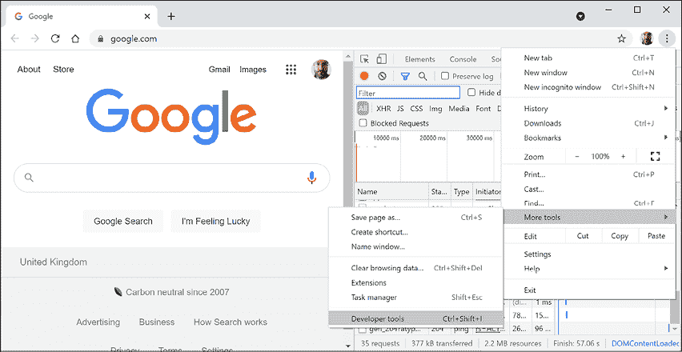
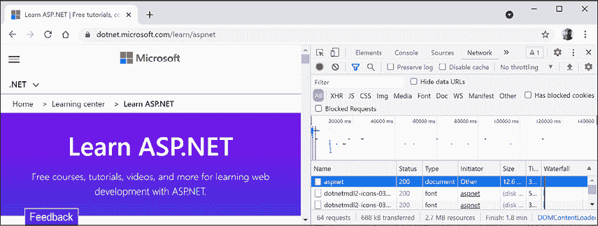
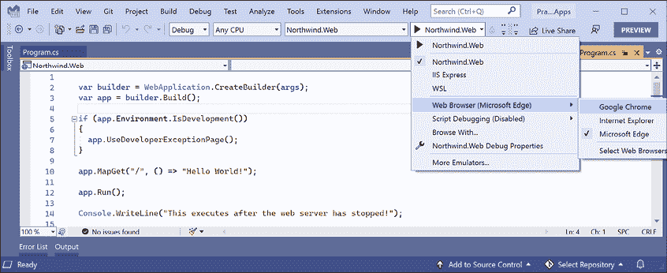
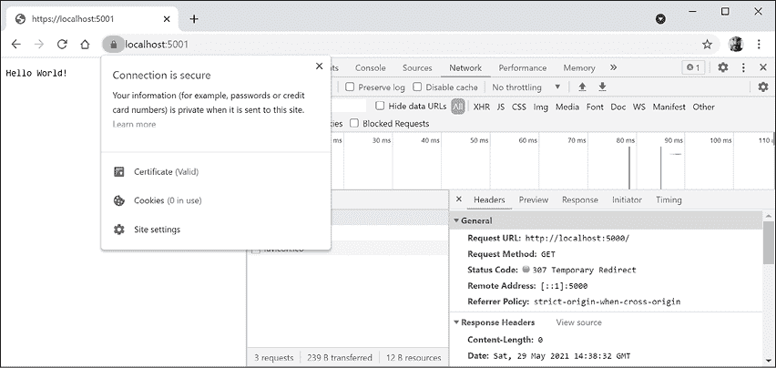
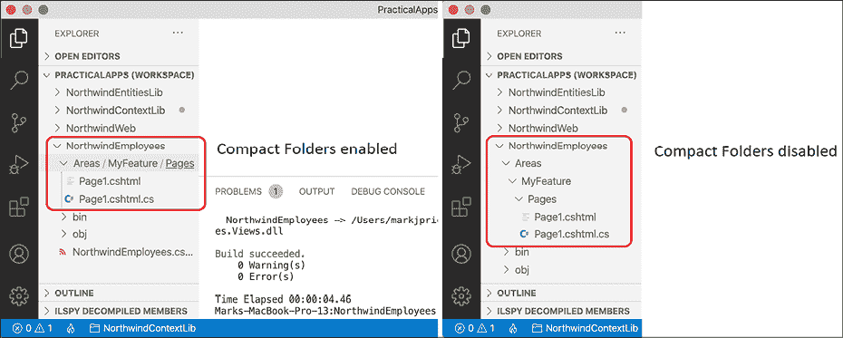
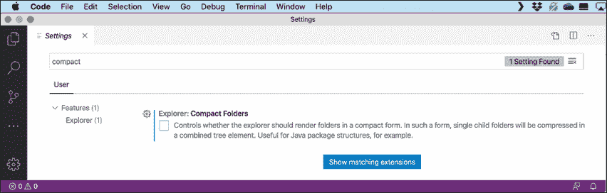
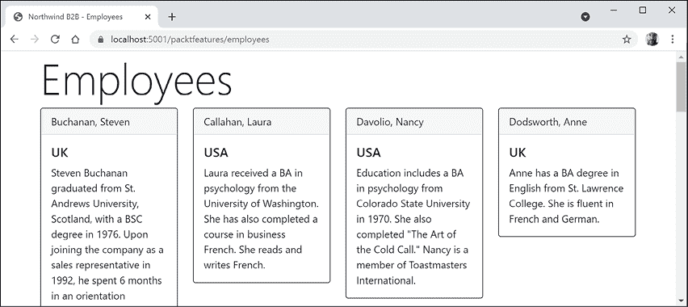

# 十四、使用 ASP.NETCore 页面构建网站

本章介绍如何使用 Microsoft ASP.NET Core 在服务器端构建具有现代 HTTP 体系结构的网站。您将了解如何使用 ASP.NET Core 2.0 引入的 ASP.NET Core Razor 页面功能和 ASP.NET Core 2.1 引入的 Razor 类库功能构建简单网站。

本章将涵盖以下主题：

*   理解 web 开发
*   理解 ASP.NETCore
*   探索 ASP.NETCore 剃须刀页面
*   将实体框架核心与 ASP.NETCore 结合使用
*   使用 Razor 类库
*   配置服务和 HTTP 请求管道

# 理解 web 开发

为 web 开发意味着使用**超文本传输协议**（**HTTP**进行开发），因此我们将首先回顾这项重要的基础技术。

## 理解 HTTP

为了与 web 服务器进行通信，客户机，也称为**用户代理**，使用 HTTP 通过网络进行呼叫。因此，HTTP 是 web 的技术基础。因此，当我们谈论网站和 web 服务时，我们的意思是它们使用 HTTP 在客户端（通常是 web 浏览器）和服务器之间进行通信。

客户端对由**统一资源定位器**（**URL**唯一标识的资源（如页面）发出 HTTP 请求，服务器发回 HTTP 响应，如*图 14.1*所示：

<figure class="mediaobject"></figure>

图 14.1:HTTP 请求和响应

您可以使用谷歌 Chrome 和其他浏览器记录请求和响应。

**良好实践**：谷歌 Chrome 比其他浏览器在更多的操作系统上可用，并且它具有强大的内置开发工具，因此它是测试网站的首选浏览器。始终使用 Chrome 和至少两种其他浏览器测试您的 web 应用，例如 Firefox 和 Safari for macOS 和 iPhone。2019 年，微软 Edge 从使用微软自己的渲染引擎转向使用 Chromium，因此使用 Chromium 进行测试就不那么重要了。如果微软的 InternetExplorer 被使用的话，那么它主要是在内部网的组织内部。

### 了解 URL 的组件

URL 由几个组件组成：

*   **方案**：`http`（明文）或`https`（加密）。
*   **域名**：制作网站或服务的**顶级域名**（**TLD**可能是`example.com`。您可能有子域，如`www`、`jobs`或`extranet`。在开发过程中，您通常对所有网站和服务使用`localhost`。
*   **端口号**：对于生产网站或服务，`80`表示`http`，`443`表示`https`。这些端口号通常根据方案推断。在开发过程中，通常使用其他端口号，如`5000`、`5001`等，以区分所有使用共享域`localhost`的网站和服务。
*   **路径**：资源的相对路径，如`/customers/germany`。
*   **查询字符串**：传递参数值的方式，例如`?country=Germany&searchtext=shoes`。
*   **片段**：使用其`id`引用网页上的元素，例如`# toc`。

### 为本手册中的项目分配端口号

在本书中，我们将对所有网站和服务使用域`localhost`，因此当需要同时执行多个项目时，我们将使用端口号区分项目，如下表所示：

<colgroup><col> <col> <col></colgroup> 
| 项目 | 描述 | 端口号 |
| `Northwind.Web` | ASP.NETCore 剃须刀页面网站 | `5000 HTTP`、`5001 HTTPS` |
| `Northwind.Mvc` | ASP.NETCore MVC 网站 | `5000 HTTP`、`5001 HTTPS` |
| `Northwind.WebApi` | ASP.NETCore Web API 服务 | `5002 HTTPS`、`5008 HTTP` |
| `Minimal.WebApi` | ASP.NETCore Web API（最小） | `5003 HTTPS` |
| `Northwind.OData` | ASP.NETCore OData 服务 | `5004 HTTPS` |
| `Northwind.GraphQL` | ASP.NETCore GraphQL 服务 | `5005 HTTPS` |
| `Northwind.gRPC` | ASP.NETCore gRPC 服务 | `5006 HTTPS` |
| `Northwind.AzureFuncs` | Azure 功能纳米服务 | `7071 HTTP` |

## 使用 Google Chrome 进行 HTTP 请求

让我们来探索如何使用 Google Chrome 进行 HTTP 请求：

1.  启动谷歌浏览器。
2.  导航到**更多工具****开发者工具**。
3.  Click the **Network** tab, and Chrome should immediately start recording the network traffic between your browser and any web servers (note the red circle), as shown in *Figure 14.2*:

    <figure class="mediaobject"></figure>

    图 14.2：记录网络流量的 Chrome 开发者工具

4.  In Chrome's address box, enter the address of Microsoft's website for learning ASP.NET, as shown in the following URL:

    [https://dotnet.microsoft.com/learn/aspnet](https://dotnet.microsoft.com/learn/aspnet)

5.  In Developer Tools, in the list of recorded requests, scroll to the top and click on the first entry, the row where the **Type** is **document**, as shown in *Figure 14.3*:

    <figure class="mediaobject"></figure>

    图 14.3：开发人员工具中记录的请求

6.  On the right-hand side, click on the **Headers** tab, and you will see details about **Request Headers** and **Response Headers**, as shown in *Figure 14.4*:

    <figure class="mediaobject"></figure>

    图 14.4：请求和响应头

    注意以下方面：

    *   **请求方式**为`GET`。您可以在这里看到的其他 HTTP 方法包括`POST`、`PUT`、`DELETE`、`HEAD`和`PATCH`。
    *   **状态码**为`200 OK`。这意味着服务器找到了浏览器请求的资源，并在响应正文中返回了该资源。您可能在响应`GET`请求时看到的其他状态代码包括`301 Moved Permanently`、`400 Bad Request`、`401 Unauthorized`和`404 Not Found`。
    *   浏览器发送到 web 服务器的**请求头**包括：
        *   **接受**，列出浏览器接受的格式。在这种情况下，浏览器表示它理解 HTML、XHTML、XML 和一些图像格式，但它将接受所有其他文件（`*/*`。默认权重，也称为质量值，为`1.0`。XML 指定的质量值为`0.9`，因此它比 HTML 或 XHTML 更受欢迎。所有其他文件类型的质量值均为`0.8`，因此最不受欢迎。
        *   **接受编码**，其中列出了浏览器了解的压缩算法，在本例中为 GZIP、DEFLATE 和 Brotli。
        *   **接受语言**，其中列出了希望内容使用的人类语言。在这种情况下，默认质量值为`1.0`的美国英语，然后是明确指定质量值为`0.9`的任何英语方言，然后是明确指定质量值为`0.8`的任何瑞典方言。
    *   **响应头**、`content-encoding`告诉我服务器已经发回了使用 GZIP 算法压缩的 HTML 网页响应，因为它知道客户端可以解压缩该格式。（这在*图 14.4*中不可见，因为没有足够的空间扩展**响应头**部分。）
7.  近铬。

## 了解客户端 web 开发技术

在构建网站时，开发人员需要了解的不仅仅是 C# 和.NET。在客户端（即在 web 浏览器中），您将使用以下技术的组合：

*   **HTML5**：用于网页的内容和结构。
*   **CSS3**：用于应用于网页元素的样式。
*   **JavaScript**：用于对网页上所需的任何业务逻辑进行编码，例如，验证表单输入或调用 web 服务以获取网页所需的更多数据。

尽管 HTML5、CSS3 和 JavaScript 是前端 web 开发的基本组件，但还有许多其他技术可以使前端 web 开发更高效，包括 Bootstrap（世界上最流行的前端开源工具包）和 CSS 预处理器（如用于样式化的 SASS 等），用于编写更健壮代码的 Microsoft TypeScript 语言，以及 jQuery、Angular、React 和 Vue 等 JavaScript 库。所有这些高级技术最终都会转换或编译为底层的三项核心技术，因此它们可以在所有现代浏览器中工作。

作为构建和部署过程的一部分，您可能会使用 Node.js 等技术；节点包管理器（npm）和纱线，它们都是客户端包管理器；webpack 是一个流行的模块绑定器，它是一个用于编译、转换和绑定网站源文件的工具。

# 理解 ASP.NETCore

Microsoft ASP.NET Core 是用于构建网站和服务的 Microsoft 技术历史的一部分，这些技术多年来不断发展：

*   **Active Server Pages**（**ASP**）于 1996 年发布，是微软首次尝试在动态服务器端执行网站代码的平台。ASP 文件包含 HTML 和用 VBScript 语言编写的在服务器上执行的代码的混合体。
*   **ASP.NET Web 表单**于 2002 年与.NET Framework 一起发布，旨在通过拖放可视化组件和使用 Visual Basic 或 C# 编写事件驱动代码，使非 Web 开发人员（如熟悉 Visual Basic 的开发人员）能够快速创建网站。对于新的.NET Framework Web 项目，应避免使用 Web 表单，而应使用 ASP.NET MVC。
*   在 2006 中发布了 Windows 通信基金会（To.T22.WCF AutoT3），并允许开发人员构建 AutoT4SOAP 和 REST 服务。SOAP 功能强大但复杂，因此除非您需要高级功能，如分布式事务和复杂的消息传递拓扑，否则应该避免使用它。
*   **ASP.NET MVC**于 2009 年发布，在**模型**之间清晰地分离 web 开发人员的关注点，这些模型临时存储数据；**视图**，在 UI 中以各种格式呈现数据；以及**控制器**，它们获取模型并将其传递给视图。这种分离能够改进重用和单元测试。
*   **ASP.NET Web API**于 2012 年发布，使开发人员能够创建比 SOAP 服务更简单、更可扩展的 HTTP 服务（又称 REST 服务）。
*   **ASP.NET Signaler**于 2013 年发布，通过抽象底层技术和技术，如 WebSocket 和长轮询，实现网站实时通信。这样，即使不支持 WebSockets 等底层技术，也可以在各种 web 浏览器上实现实时聊天或更新股价等时间敏感数据等网站功能。
*   **ASP.NETCore**于 2016 年发布，它将.NET Framework 技术的现代实现（如 MVC、Web API 和 SignalR）与更新的技术（如 Razor Pages、gRPC 和 Blazor）相结合，所有这些技术都运行在现代.NET 上。因此，它可以跨平台执行。ASP.NET Core 有许多项目模板，可以帮助您开始使用其支持的技术。

**良好实践**：选择 ASP.NET Core 开发网站和服务，因为它包含了与 web 相关的现代跨平台技术。

ASP.NET Core 2.0 到 2.2 可以在.NET Framework 4.6.1 或更高版本（仅限 Windows）以及.NET Core 2.0 或更高版本（跨平台）上运行。ASP.NET Core 3.0 仅支持.NET Core 3.0。ASP.NET Core 6.0 仅支持.NET 6.0。

## 经典 ASP.NET 与现代 ASP.NETCore

到目前为止，ASP.NET 已经建立在名为`System.Web.dll`的.NET 框架中的一个大型组件之上，它与微软的纯 Windows web 服务器**互联网信息服务**（**IIS**紧密耦合。多年来，该组件积累了许多功能，其中许多不适合现代跨平台开发。

ASP.NETCore 是对 ASP.NET 的重大重新设计。它消除了对`System.Web.dll`程序集和 IIS 的依赖，并由模块化轻量级软件包组成，就像现代.NET 的其余部分一样。ASP.NET Core 仍然支持使用 IIS 作为 web 服务器，但有更好的选择。

您可以在 Windows、macOS 和 Linux 上跨平台开发和运行 ASP.NETCore 应用。微软甚至创建了一个名为**Kestrel**的跨平台、高性能 web 服务器，整个堆栈都是开源的。

ASP.NET Core 2.2 或更高版本的项目默认为新的进程内托管模型。这使得在 Microsoft IIS 中托管时的性能提高了 400%，但 Microsoft 仍然建议使用 Kestrel 以获得更好的性能。

## 创建空的 ASP.NETCore 项目

我们将创建一个 ASP.NETCore 项目，该项目将显示 Northwind 数据库中的供应商列表。

`dotnet`工具有多个项目模板，为您做了大量工作，但很难知道哪一个最适合特定情况，因此我们将从空的网站项目模板开始，然后逐步添加功能，以便您了解所有内容：

1.  使用首选的代码编辑器添加新项目，如下表所示：
    1.  项目模板：**ASP.NETCore 空**/`web`
    2.  语言：C#
    3.  工作区/解决方案文件和文件夹：`PracticalApps`
    4.  项目文件和文件夹：`Northwind.Web`
    5.  对于 Visual Studio 2022，将所有其他选项保留为其默认值，例如，选择了**配置 HTTPS**，并清除了**启用 Docker**
2.  在 Visual Studio 代码中，选择`Northwind.Web`作为活动的 OmniSharp 项目。
3.  建设`Northwind.Web`项目。
4.  打开`Northwind.Web.csproj`文件，注意项目就像一个类库，只是 SDK 是`Microsoft.NET.Sdk.Web`，如下标记中突出显示：

    ```cs
    <Project Sdk="**Microsoft.NET.Sdk.Web**">
      <PropertyGroup>
        <TargetFramework>net6.0</TargetFramework>
        <Nullable>enable</Nullable>
        <ImplicitUsings>enable</ImplicitUsings>
      </PropertyGroup>
    </Project> 
    ```

5.  如果您正在使用 Visual Studio 2022，请在**解决方案资源管理器**中切换**显示所有文件**。
6.  展开`obj`文件夹，展开`Debug`文件夹，展开`net6.0`文件夹，选择`Northwind.Web.GlobalUsings.g.cs`文件，注意隐式导入的名称空间包括控制台应用或类库的所有名称空间，以及一些 ASP.NETCore 名称空间，如`Microsoft.AspNetCore.Builder`，如下代码所示：

    ```cs
    // <autogenerated />
    global using global::Microsoft.AspNetCore.Builder;
    global using global::Microsoft.AspNetCore.Hosting;
    global using global::Microsoft.AspNetCore.Http;
    global using global::Microsoft.AspNetCore.Routing;
    global using global::Microsoft.Extensions.Configuration;
    global using global::Microsoft.Extensions.DependencyInjection;
    global using global::Microsoft.Extensions.Hosting;
    global using global::Microsoft.Extensions.Logging;
    global using global::System;
    global using global::System.Collections.Generic;
    global using global::System.IO;
    global using global::System.Linq;
    global using global::System.Net.Http;
    global using global::System.Net.Http.Json;
    global using global::System.Threading;
    global using global::System.Threading.Tasks; 
    ```

7.  折叠`obj`文件夹。
8.  打开`Program.cs`，注意以下事项：

    ```cs
    var builder = WebApplication.CreateBuilder(args);
    var app = builder.Build();
    app.MapGet("/", () => "Hello World!");
    app.Run(); 
    ```

    *   ASP.NETCore 项目就像一个顶级控制台应用，其入口点是一个隐藏的`Main`方法，该方法使用名称`args`传递一个参数。
    *   它调用`WebApplication.CreateBuilder`，它使用随后构建的 web 主机的默认值为网站创建主机。
    *   网站将以纯文本响应所有 HTTP`GET`请求：`Hello World!`。
    *   对`Run`方法的调用是一个阻塞调用，因此隐藏的`Main`方法在 web 服务器停止运行之前不会返回，如下代码所示：
9.  在文件的底部添加一条语句，在调用`Run`方法后，因此在 web 服务器停止后，向控制台写入消息，如下面代码中突出显示的：

    ```cs
    app.Run();
    **Console.WriteLine(****"This executes after the web server has stopped!"****);** 
    ```

## 测试和保护网站

我们现在将测试 ASP.NETCore 空网站项目的功能。我们还将通过从 HTTP 切换到 HTTPS，对浏览器和 web 服务器之间的所有流量进行加密，以保护隐私。HTTPS 是 HTTP 的安全加密版本。

1.  对于 Visual Studio：
    1.  In the toolbar, make sure that **Northwind.Web** is selected rather than **IIS Express** or **WSL**, and switch the **Web Browser (Microsoft Edge)** to **Google Chrome**, as shown in *Figure 14.5*:

        <figure class="mediaobject"></figure>

        图 14.5：在 Visual Studio 中选择 Northwind.Web 概要文件及其 Kestrel Web 服务器

    2.  导航至**调试**|**无调试启动…**。
    3.  首次启动安全网站时，系统会提示您将项目配置为使用 SSL，为了避免浏览器中出现警告，您可以选择信任 ASP.NET Core 生成的自签名证书。点击**是**。
    4.  当您看到**安全警告**对话框时，再次点击**是**。
2.  对于 Visual Studio 代码，在**终端**中输入`dotnet run`命令。
3.  In either Visual Studio's command prompt window or Visual Studio Code's terminal, note the Kestrel web server has started listening on random ports for HTTP and HTTPS, that you can press Ctrl + C to shut down the Kestrel web server, and the hosting environment is `Development`, as shown in the following output:

    ```cs
    info: Microsoft.Hosting.Lifetime[14]
      Now listening on: https://localhost:5001 
    info: Microsoft.Hosting.Lifetime[14]
      Now listening on: http://localhost:5000 
    info: Microsoft.Hosting.Lifetime[0]
      Application started. Press Ctrl+C to shut down. 
    info: Microsoft.Hosting.Lifetime[0]
      Hosting environment: Development 
    info: Microsoft.Hosting.Lifetime[0]
      Content root path: C:\Code\PracticalApps\Northwind.Web 
    ```

    Visual Studio 还将自动启动所选浏览器。如果您使用的是 Visual Studio 代码，则必须手动启动 Chrome。

4.  让 web 服务器保持运行。
5.  在 Chrome 中，显示**开发者工具**，点击**网络**选项卡。
6.  Enter the address `http://localhost:5000/`, or whatever port number was assigned to HTTP, and note the response is `Hello World!` in plain text, from the cross-platform Kestrel web server, as shown in *Figure 14.6*:

    <figure class="mediaobject"></figure>

    图 14.6：来自的纯文本响应 http://localhost:5000/

    Chrome 还自动请求在浏览器选项卡中显示一个`favicon.ico`文件，但该文件丢失，因此显示为`404 Not Found`错误。

7.  Enter the address `https://localhost:5001/`, or whatever port number was assigned to HTTPS, and note if you are not using Visual Studio or if you clicked **No** when prompted to trust the SSL certificate, then the response is a privacy error, as shown in *Figure 14.7*:

    <figure class="mediaobject"></figure>

    图 14.7：隐私错误显示未使用证书启用 SSL 加密

    当您没有配置浏览器可以信任的证书来加密和解密 HTTPS 通信时，您将看到此错误（因此，如果您没有看到此错误，这是因为您已经配置了证书）。

    在生产环境中，您可能希望向 Verisign 这样的公司支付 SSL 证书的费用，因为他们提供责任保护和技术支持。

    **对于 Linux 开发者**：如果您使用的 Linux 变体无法创建自签名证书，或者您不介意每隔 90 天重新申请一个新证书，那么您可以从以下链接获得免费证书：[https://letsencrypt.org](https://letsencrypt.org)

    在开发过程中，您可以告诉操作系统信任 ASP.NET Core 提供的临时开发证书。

8.  在命令行或**终端**中，按 Ctrl+C 关闭 web 服务器，并记录写入的消息，如以下输出中突出显示的：

    ```cs
    info: Microsoft.Hosting.Lifetime[0]
          Application is shutting down...
    **This executes after the web server has stopped!**
    C:\Code\PracticalApps\Northwind.Web\bin\Debug\net6.0\Northwind.Web.exe (process 19888) exited with code 0. 
    ```

9.  如果您需要信任本地自签名 SSL 证书，则在命令行或**终端**中，输入`dotnet dev-certs https --trust`命令，并注意消息，**信任 HTTPS 开发证书被请求**。可能会提示您输入密码，并且可能已经存在有效的 HTTPS 证书。

### 实现更高的安全性并重定向到安全连接

良好的做法是启用更严格的安全性，并自动将 HTTP 请求重定向到 HTTPS。

**良好实践**：**HTTP 严格传输安全**（**HSTS**）是您应该始终启用的选择性加入安全增强。如果网站指定了它并且浏览器支持它，那么它将强制通过 HTTPS 进行所有通信，并防止访问者使用不受信任或无效的证书。

让我们现在就这样做：

1.  在`Program.cs`中增加`if`语句，在非开发时启用 HSTS，如下代码所示：

    ```cs
    if (!app.Environment.IsDevelopment())
    {
      app.UseHsts();
    } 
    ```

2.  在调用`app.MapGet`之前添加一条语句，将 HTTP 请求重定向到 HTTPS，如下代码所示：

    ```cs
    app.UseHttpsRedirection(); 
    ```

3.  启动**北风网**网站项目。
4.  如果 Chrome 仍在运行，请关闭并重新启动它。
5.  在 Chrome 中，显示**开发者工具**，点击**网络**选项卡。
6.  Enter the address `http://localhost:5000/`, or whatever port number was assigned to HTTP, and note how the server responds with a `307 Temporary Redirect` to port `5001` and that the certificate is now valid and trusted, as shown in *Figure 14.8*:

    <figure class="mediaobject"></figure>

    图 14.8：现在使用有效证书和 307 重定向保护连接

7.  近铬。
8.  关闭 web 服务器。

**良好实践**：记得在完成网站测试后关闭 Kestrel web 服务器。

## 控制托管环境

在 ASP.NET Core 的早期版本中，项目模板设置了一个规则，即在开发模式下，任何未处理的异常都将显示在浏览器窗口中，供开发人员查看异常的详细信息，如下代码所示：

```cs
if (app.Environment.IsDevelopment())
{
  app.UseDeveloperExceptionPage();
} 
```

对于 ASP.NET Core 6 及更高版本，默认情况下会自动执行此代码，因此它不会包含在项目模板中。

ASP.NETCore 如何知道我们在开发模式下运行时，`IsDevelopment`方法返回`true`？让我们看看。

ASP.NET Core 可以读取环境变量以确定要使用的托管环境，例如，`DOTNET_ENVIRONMENT`或`ASPNETCORE_ENVIRONMENT`。

您可以在本地开发期间覆盖这些设置：

1.  在`Northwind.Web`文件夹中，展开名为`Properties`的文件夹，打开名为`launchSettings.json`的文件，并注意名为`Northwind.Web`的配置文件，该配置文件将托管环境设置为`Development`，如下配置中突出显示：

    ```cs
    {
      "iisSettings": {
        "windowsAuthentication": false,
        "anonymousAuthentication": true,
        "iisExpress": {
          "applicationUrl": "http://localhost:56111",
          "sslPort": 44329
        }
      },
      "profiles": {
    **"Northwind.Web"****: {**
    **"commandName"****:** **"Project"****,**
    **"dotnetRunMessages"****:** **"true"****,**
    **"launchBrowser"****:** **true****,**
    **"applicationUrl"****:** **"https://localhost:5001;http://localhost:5000"****,** 
    **"environmentVariables"****: {**
    **"ASPNETCORE_ENVIRONMENT"****:** **"Development"**
     **}**
     **},**
        "IIS Express": {
          "commandName": "IISExpress",
          "launchBrowser": true, 
          "environmentVariables": {
            "ASPNETCORE_ENVIRONMENT": "Development"
          }
        }
      }
    } 
    ```

2.  将随机分配的 HTTP 端口号更改为`5000`，将 HTTPS 端口号更改为`5001`。
3.  将环境更改为`Production`。或者，将`launchBrowser`更改为`false`，以防止 Visual Studio 自动启动浏览器。
4.  启动网站，注意托管环境为`Production`，如以下输出所示：

    ```cs
    info: Microsoft.Hosting.Lifetime[0] 
      Hosting environment: Production 
    ```

5.  关闭 web 服务器。
6.  在`launchSettings.json`中，将环境更改回`Development`。

`launchSettings.json`文件还具有使用 IIS 作为 web 服务器并使用随机端口号的配置。在本书中，我们将只使用 Kestrel 作为 web 服务器，因为它是跨平台的。

## 分离服务和管道的配置

将所有用于初始化简单 web 项目的代码放在`Program.cs`中可能是个好主意，尤其是对于 web 服务，因此我们将在*第 16 章*、*构建和使用 web 服务*中再次看到这种风格。

但是，对于最基本的 web 项目以外的任何项目，您可能更愿意使用两种方法将配置分离到单独的`Startup`类中：

*   `ConfigureServices(IServiceCollection services)`：将依赖项服务添加到依赖项注入容器中，例如 Razor Pages 支持、**跨源资源共享**（**CORS**支持或用于使用 Northwind 数据库的数据库上下文。
*   `Configure(IApplicationBuilder app, IWebHostEnvironment env)`：设置请求和响应通过的 HTTP 管道。在`app`参数上调用各种`Use`方法，按照特征处理的顺序构建管道。

    <figure class="mediaobject"></figure>

图 14.9：启动类 ConfigureServices 和配置方法图

两个方法都将由运行时自动调用。

现在我们创建一个`Startup`类：

1.  在名为`Startup.cs`的`Northwind.Web`项目中添加一个新类文件。
2.  Modify `Startup.cs`, as shown in the following code:

    ```cs
    namespace Northwind.Web;
    public class Startup
    {
      public void ConfigureServices(IServiceCollection services)
      {
      }
      public void Configure(
        IApplicationBuilder app, IWebHostEnvironment env)
      {
        if (!env.IsDevelopment())
        {
          app.UseHsts();
        }
        app.UseRouting(); // start endpoint routing
        app.UseHttpsRedirection();
        app.UseEndpoints(endpoints =>
        {
          endpoints.MapGet("/", () => "Hello World!");
        });
      }
    } 
    ```

    请注意以下代码：

    *   `ConfigureServices`方法当前为空，因为我们还不需要添加任何依赖项服务。
    *   `Configure`方法设置 HTTP 请求管道并启用端点路由。它为根路径`/`的每个 HTTP`GET`请求配置一个路由端点来等待请求，根路径`/`通过返回纯文本`"Hello World!"`来响应这些请求。我们将在本章末尾了解路由端点及其优点。

    现在我们必须指定要在应用入口点中使用`Startup`类。

3.  修改`Program.cs`，如下代码所示：

    ```cs
    using Northwind.Web; // Startup
    Host.CreateDefaultBuilder(args)
      .ConfigureWebHostDefaults(webBuilder =>
      {
        webBuilder.UseStartup<Startup>();
      }).Build().Run();
    Console.WriteLine("This executes after the web server has stopped!"); 
    ```

4.  启动网站，注意其行为与之前相同。
5.  关闭 web 服务器。

在本书中创建的所有其他网站和服务项目中，我们将使用由.NET6 项目模板创建的单个`Program.cs`文件。如果你喜欢`Startup.cs`的做事方式，那么你将在本章中看到如何使用它。

## 使网站能够提供静态内容

一个网站只会返回一条纯文本信息，这不是很有用！

至少，它应该返回静态 HTML 页面、网页将用于样式设置的 CSS 以及任何其他静态资源，如图像和视频。

按照惯例，这些文件应存储在名为`wwwroot`的目录中，以使它们与网站项目的动态执行部分分开。

### 为静态文件和网页创建文件夹

您将现在为您的静态网站资源创建一个文件夹，并创建一个基本索引页面，该页面使用引导设置样式：

1.  在`Northwind.Web`项目/文件夹中，创建一个名为`wwwroot`的文件夹。
2.  将新的 HTML 页面文件添加到名为`index.html`的`wwwroot`文件夹中。
3.  修改其内容以链接到 CDN 承载的引导以进行样式设置，并使用现代良好做法，如设置视口，如以下标记所示：

    ```cs
    <!doctype html>
    <html lang="en">
    <head>
      <!-- Required meta tags -->
      <meta charset="utf-8" />
      <meta name="viewport" content=
        "width=device-width, initial-scale=1 " />
      <!-- Bootstrap CSS -->
      <link href=
    "https://cdn.jsdelivr.net/npm/bootstrap@5.1.0/dist/css/bootstrap.min.css" rel="stylesheet" integrity="sha384-KyZXEAg3QhqLMpG8r+8fhAXLRk2vvoC2f3B09zVXn8CA5QIVfZOJ3BCsw2P0p/We" crossorigin="anonymous">
      <title>Welcome ASP.NET Core!</title>
    </head>
    <body>
      <div class="container">
        <div class="jumbotron">
          <h1 class="display-3">Welcome to Northwind B2B</h1>
          <p class="lead">We supply products to our customers.</p>
          <hr />
          <h2>This is a static HTML page.</h2>
          <p>Our customers include restaurants, hotels, and cruise lines.</p>
          <p>
            <a class="btn btn-primary" 
              href="https://www.asp.net/">Learn more</a>
          </p>
        </div>
      </div>
    </body>
    </html> 
    ```

**良好实践**：要获取引导的最新`<link>`元素，请从以下链接的文档中复制并粘贴它：[https://getbootstrap.com/docs/5.0/getting-started/introduction/# starter-模板](https://getbootstrap.com/docs/5.0/getting-started/introduction/# starter-template)。

### 启用静态和默认文件

如果您现在启动网站并在地址框中输入`http://localhost:5000/index.html`，则网站将返回一个`404 Not Found`错误，表示未找到任何网页。为了使网站能够返回静态文件，如`index.html`，我们必须明确配置该功能。

即使我们启用静态文件，如果您启动网站并在地址框中输入`http://localhost:5000/`，网站也会返回`404 Not Found`错误，因为如果没有请求命名文件，web 服务器默认不知道返回什么。

现在，您将启用静态文件，显式配置默认文件，并更改返回纯文本`Hello World!`响应的注册 URL 路径：

1.  In `Startup.cs`, in the `Configure` method, add statements after enabling HTTPS redirection to enable static files and default files, and modify the statement that maps a `GET` request to return the `Hello World!` plain text response to only respond to the URL path `/hello`, as shown highlighted in the following code:

    ```cs
    app.UseHttpsRedirection();
    **app.UseDefaultFiles();** **// index.html, default.html, and so on**
    **app.UseStaticFiles();**
    app.UseEndpoints(endpoints =>
    {
      endpoints.MapGet(**"/hello"**, () => "Hello World!");
    }); 
    ```

    对`UseDefaultFiles`的调用必须在对`UseStaticFiles`的调用之前，否则将无法工作！在本章末尾，您将了解更多关于中间件和端点路由排序的信息。

2.  启动网站。
3.  启动**Chrome**并显示**开发者工具**。
4.  在 Chrome 中，输入`http://localhost:5000/`并注意您被重定向到端口`5001`上的 HTTPS 地址，`index.html`文件现在通过该安全连接返回，因为它是该网站可能的默认文件之一。
5.  在**开发者工具**中，注意对引导样式表的请求。
6.  在 Chrome 中，输入`http://localhost:5000/hello`并注意它会像前面一样返回纯文本`Hello World!`。
7.  关闭 Chrome 并关闭 web 服务器。

如果所有的 web 页面都是静态的，也就是说，它们只能由 web 编辑器手动更改，那么我们的网站编程工作就完成了。但几乎所有网站都需要动态内容，这意味着在运行时通过执行代码生成的网页。

最简单的方法是使用 ASP.NETCore 名为**Razor Pages**的功能。

# 探索 ASP.NETCore 剃须刀页面

ASP.NETCore Razor 页面允许开发人员轻松地将 C# 代码语句与 HTML 标记混合在一起，以使生成的网页具有动态性。这就是他们使用`.cshtml`文件扩展名的原因。

按照惯例，ASP.NET Core 会在名为`Pages`的文件夹中查找 Razor 页面。

## 启用剃须刀页面

您现在将将静态 HTML 页面复制并更改为动态 Razor 页面，然后添加并启用 Razor 页面服务：

1.  在`Northwind.Web`项目文件夹中，创建一个名为`Pages`的文件夹。
2.  将`index.html`文件复制到`Pages`文件夹中。
3.  对于`Pages`文件夹中的文件，将文件扩展名从`.html`重命名为`.cshtml`。
4.  删除表示这是一个静态 HTML 页面的`<h2>`元素。
5.  在`Startup.cs`中，在`ConfigureServices`方法中，添加一条语句，向构建器添加 ASP.NET Core Razor 页面及其相关服务，如模型绑定、授权、防伪、视图、标签助手等，如下代码所示：

    ```cs
    services.AddRazorPages(); 
    ```

6.  在`Startup.cs`中，在`Configure`方法中，在使用端点的配置中，添加一条语句到调用`MapRazorPages`方法中，如下代码所示：

    ```cs
    app.UseEndpoints(endpoints =>
    {
     **endpoints.MapRazorPages();**
      endpoints.MapGet("/hello",  () => "Hello World!");
    }); 
    ```

## 向 Razor 页面添加代码

在网页的 HTML 标记中，Razor 语法由`@`符号表示。剃须刀页面可描述如下：

*   它们要求在文件顶部有`@page`指令。
*   它们可以选择性地具有一个`@functions`部分，该部分定义了以下任何一项：
    *   用于存储数据值的属性，如在类定义中。该类的一个实例被自动实例化，名为`Model`，可以在特殊方法中设置其属性，并且可以在 HTML 中获取属性值。
    *   在发出 HTTP 请求时执行的名为`OnGet`、`OnPost`、`OnDelete`等的方法，如`GET`、`POST`和`DELETE`。

现在，让我们将静态 HTML 页面转换为 Razor 页面：

1.  在`Pages`文件夹中，打开`index.cshtml`。
2.  将`@page`语句添加到文件顶部。
3.  在`@page`语句之后，添加一个`@functions`语句块。
4.  定义一个属性，将当前日期的名称存储为`string`值。
5.  定义一个设置`DayName`的方法，该方法在页面发出 HTTP`GET`请求时执行，如下代码所示：

    ```cs
    @page
    @functions
    {
      public string? DayName { get; set; }
      public void OnGet()
      {
        Model.DayName = DateTime.Now.ToString("dddd");
      }
    } 
    ```

6.  在第二个 HTML 段落中输出日期名称，如以下标记中突出显示的：

    ```cs
    <p>**It's @Model.DayName!** Our customers include restaurants, hotels, and cruise lines.</p> 
    ```

7.  启动网站。
8.  In Chrome, enter `https://localhost:5001/` and note the current day name is output on the page, as shown in *Figure 14.10*:

    <figure class="mediaobject"></figure>

    图 14.10：欢迎来到显示当天的 Northwind 页面

9.  在 Chrome 中，输入与静态文件名完全匹配的`https://localhost:5001/index.html`，并注意它会像以前一样返回静态 HTML 页面。
10.  在 Chrome 中，输入`https://localhost:5001/hello`，它与返回纯文本的端点路由完全匹配，并注意它返回`Hello World!`与前面一样。
11.  关闭 Chrome 并关闭 web 服务器。

## 使用 Razor 页面的共享布局

大多数网站都有不止一个页面。如果每个页面都必须包含当前在`index.cshtml`中的所有样板标记，那么这将成为管理的一个难题。因此，ASP.NETCore 有一个名为**布局**的功能。

要使用布局，我们必须创建一个 Razor 文件来定义所有 Razor 页面（和所有 MVC 视图）的默认布局，并将其存储在`Shared`文件夹中，以便按照约定轻松找到。此文件的名称可以是任何名称，因为我们将指定它，但`_Layout.cshtml`是一种良好的做法。

我们还必须创建一个特别命名的文件，为所有 Razor 页面（和所有 MVC 视图）设置默认布局文件。此文件必须命名为`_ViewStart.cshtml`。

让我们看看实际的布局：

1.  在`Pages`文件夹中，添加一个名为`_ViewStart.cshtml`的文件。（Visual Studio 项目模板名为**Razor 视图开始**
2.  修改其内容，如以下标记所示：

    ```cs
    @{
      Layout = "_Layout";
    } 
    ```

3.  在`Pages`文件夹中，创建一个名为`Shared`的文件夹。
4.  在`Shared`文件夹中，创建一个名为`_Layout.cshtml`的文件。（Visual Studio 项目模板名为**Razor 布局**。）
5.  Modify the content of `_Layout.cshtml` (it is similar to `index.cshtml` so you can copy and paste the HTML markup from there), as shown in the following markup:

    ```cs
    <!doctype html>
    <html lang="en">
    <head>
      <!-- Required meta tags -->
      <meta charset="utf-8" />
      <meta name="viewport" content=
        "width=device-width, initial-scale=1, shrink-to-fit=no" />
      <!-- Bootstrap CSS -->
      <link href=
    "https://cdn.jsdelivr.net/npm/bootstrap@5.1.0/dist/css/bootstrap.min.css" rel="stylesheet" integrity="sha384-KyZXEAg3QhqLMpG8r+8fhAXLRk2vvoC2f3B09zVXn8CA5QIVfZOJ3BCsw2P0p/We" crossorigin="anonymous">
      <title>@ViewData["Title"]</title>
    </head>
    <body>
      <div class="container">
        @RenderBody()
        <hr />
        <footer>
          <p>Copyright &copy; 2021 - @ViewData["Title"]</p>
        </footer>
      </div>
      <!-- JavaScript to enable features like carousel -->
      <script src="https://cdn.jsdelivr.net/npm/bootstrap@5.1.0/dist/js/bootstrap.bundle.min.js" integrity="sha384-U1DAWAznBHeqEIlVSCgzq+c9gqGAJn5c/t99JyeKa9xxaYpSvHU5awsuZVVFIhvj" crossorigin="anonymous"></script>
      @RenderSection("Scripts", required: false)
    </body>
    </html> 
    ```

    查看上述标记时，请注意以下事项：

    *   使用名为`ViewData`的字典中的服务器端代码动态设置`<title>`。这是一种在 ASP.NETCore 网站的不同部分之间传递数据的简单方法。在这种情况下，数据将在 Razor 页面类文件中设置，然后在共享布局中输出。
    *   `@RenderBody()`标记所请求视图的插入点。
    *   每一页的底部都会出现一条横线和页脚。
    *   在布局的底部是一个脚本，用于实现引导的一些很酷的功能，我们可以稍后使用，例如图像旋转。
    *   在 Bootstrap 的`<script>`元素之后，我们定义了一个名为`Scripts`的部分，以便 Razor 页面可以选择性地注入它所需要的其他脚本。
6.  修改`index.cshtml`以删除除`<div class="jumbotron">`及其内容之外的所有 HTML 标记，并将 C# 代码保留在您先前添加的`@functions`块中。
7.  在`OnGet`方法中添加语句，将页面标题存储在`ViewData`字典中，并修改按钮导航到供应商页面（我们将在下一节中创建），如以下标记中突出显示的：

    ```cs
    @page 
    @functions
    {
      public string? DayName { get; set; }
      public void OnGet()
      {
     **ViewData[****"Title"****] =** **"Northwind B2B"****;**
        Model.DayName = DateTime.Now.ToString("dddd");
      }
    }
    <div class="jumbotron">
      <h1 class="display-3">Welcome to Northwind B2B</h1>
      <p class="lead">We supply products to our customers.</p>
      <hr />
      <p>It's @Model.DayName! Our customers include restaurants, hotels, and cruise lines.</p>
      <p>
    **<****a****class****=****"btn btn-primary"****href****=****"suppliers"****>**
     **Learn more about our suppliers****</****a****>**
      </p>
    </div> 
    ```

8.  启动网站，使用 Chrome 进行访问，注意其行为与之前类似，尽管点击供应商按钮会出现`404 Not Found`错误，因为我们尚未创建该页面。

## 将代码隐藏文件与 Razor 页面一起使用

有时，最好将 HTML 标记与数据和可执行代码分开，因此 Razor Pages 允许您通过将 C# 代码放在类文件后面的**代码中来实现这一点。它们与`.cshtml`文件同名，但以`.cshtml.cs`结尾。**

现在，您将创建一个显示供应商列表的页面。在本例中，我们将重点学习文件背后的代码。在下一个主题中，我们将从数据库中加载供应商列表，但现在，我们将使用`string`值的硬编码数组来模拟：

1.  在`Pages`文件夹中，添加两个名为`Suppliers.cshtml`和`Suppliers.cshtml.cs`的新文件。（VisualStudio 项目模板名为**Razor Page-Empty**并创建这两个文件。）
2.  Add statements to the code-behind file named `Suppliers.cshtml.cs`, as shown in the following code:

    ```cs
    using Microsoft.AspNetCore.Mvc.RazorPages; // PageModel
    namespace Northwind.Web.Pages;
    public class SuppliersModel : PageModel
    {
      public IEnumerable<string>? Suppliers { get; set; }
      public void OnGet()
      {
        ViewData["Title"] = "Northwind B2B - Suppliers";
        Suppliers = new[]
        {
          "Alpha Co", "Beta Limited", "Gamma Corp"
        };
      }
    } 
    ```

    查看上述标记时，请注意以下事项：

    *   `SuppliersModel`继承自`PageModel`，因此有`ViewData`字典等成员共享数据。您可以右键点击`PageModel`并选择**进入定义**查看它有更多有用的功能，比如当前请求的整个`HttpContext`。
    *   `SuppliersModel`定义用于存储名为`Suppliers`的`string`值集合的属性。
    *   当对该 Razor 页面发出 HTTP`GET`请求时，`Suppliers`属性将填充`string`值数组中的一些示例供应商名称。稍后，我们将从 Northwind 数据库中填充它。
3.  Modify the contents of `Suppliers.cshtml`, as shown in the following markup:

    ```cs
    @page
    @model Northwind.Web.Pages.SuppliersModel
    <div class="row">
      <h1 class="display-2">Suppliers</h1>
      <table class="table">
        <thead class="thead-inverse">
          <tr><th>Company Name</th></tr>
        </thead>
        <tbody>
        @if (Model.Suppliers is not null)
        {
          @foreach(string name in Model.Suppliers)
          {
            <tr><td>@name</td></tr>
          }
        }
        </tbody>
      </table>
    </div> 
    ```

    查看上述标记时，请注意以下事项：

    *   此剃须刀页面的型号类型设置为`SuppliersModel`。
    *   该页面输出带有引导样式的 HTML 表。
    *   如果表中的数据行不是`null`，则通过`Model`的`Suppliers`属性循环生成。
4.  启动网站并使用 Chrome 访问它。
5.  Click on the button to learn more about suppliers, and note the table of suppliers, as shown in *Figure 14.11*:

    <figure class="mediaobject"></figure>

    图 14.11：从字符串数组加载的供应商表

# 将实体框架核心与 ASP.NETCore 结合使用

实体框架核心是将真实数据导入网站的自然方式。在*第 13 章*中*介绍了 C# 和.NET*的实际应用，您创建了两对类库：一个用于实体模型，一个用于 Northwind 数据库上下文，用于 SQL Server 或 SQLite 或两者。现在，您将在网站项目中使用它们。

## 将实体框架核心配置为服务

ASP.NET Core 所需的实体框架核心数据库上下文等功能必须在网站启动期间注册为服务。GitHub 存储库解决方案及以下版本中的代码使用 SQLite，但如果愿意，您可以轻松使用 SQL Server。

让我们看看如何：

1.  In the `Northwind.Web` project, add a project reference to the `Northwind.Common.DataContext` project for either SQLite or SQL Server, as shown in the following markup:

    ```cs
    <!-- change Sqlite to SqlServer if you prefer -->
    <ItemGroup>
      <ProjectReference Include="..\Northwind.Common.DataContext.Sqlite\
    Northwind.Common.DataContext.Sqlite.csproj" />
    </ItemGroup> 
    ```

    项目引用必须全部放在一行上，且无换行。

2.  建设`Northwind.Web`项目。
3.  在`Startup.cs`中，导入名称空间以处理实体模型类型，如以下代码所示：

    ```cs
    using Packt.Shared; // AddNorthwindContext extension method 
    ```

4.  在`ConfigureServices`方法中添加语句，注册`Northwind`数据库上下文类，如下代码所示：

    ```cs
    services.AddNorthwindContext(); 
    ```

5.  在`Northwind.Web`项目中，在`Pages`文件夹中打开`Suppliers.cshtml.cs`，导入我们数据库上下文的名称空间，如下代码所示：

    ```cs
    using Packt.Shared; // NorthwindContext 
    ```

6.  在`SuppliersModel`类中，添加一个私有字段来存储`Northwind`数据库上下文，并添加一个构造函数进行设置，如下代码所示：

    ```cs
    private NorthwindContext db;
    public SuppliersModel(NorthwindContext injectedContext)
    {
      db = injectedContext;
    } 
    ```

7.  将`Suppliers`属性更改为包含`Supplier`对象，而不是`string`值。
8.  在`OnGet`方法中，修改语句，从数据库上下文的`Suppliers`属性中设置`Suppliers`属性，按国家、公司名称排序，如下代码所示：

    ```cs
    public void OnGet()
    {
      ViewData["Title"] = "Northwind B2B - Suppliers";
      Suppliers = **db.Suppliers**
     **.OrderBy(c => c.Country).ThenBy(c => c.CompanyName)**;
    } 
    ```

9.  修改中`Suppliers.cshtml`的内容，导入`Packt.Shared`名称空间，为每个供应商呈现多列，如下标记中突出显示：

    ```cs
    @page
    **@using Packt.Shared**
    @model Northwind.Web.Pages.SuppliersModel
    <div class="row">
      <h1 class="display-2">Suppliers</h1>
      <table class="table">
        <thead class="thead-inverse">
          <tr>
            <th>Company Name</th>
    **<****th****>****Country****</****th****>**
    **<****th****>****Phone****</****th****>**
          </tr>
        </thead>
        <tbody>
        @if (Model.Suppliers is not null)
        {
     **@foreach(Supplier s in Model.Suppliers)**
          {
            <tr>
    **<****td****>****@s.CompanyName****</****td****>**
    **<****td****>****@s.Country****</****td****>**
    **<****td****>****@s.Phone****</****td****>**
            </tr>
          }
        }
        </tbody>
      </table>
    </div> 
    ```

10.  启动网站。
11.  在 Chrome 中，输入`https://localhost:5001/`。
12.  点击**了解更多关于我们供应商的信息**并注意供应商表现在从数据库加载，如*图 14.12*：

    <figure class="mediaobject"></figure>

    所示

图 14.12：从 Northwind 数据库加载的供应商表

## 使用 Razor 页面操作数据

您将现在添加插入新供应商的功能。

### 使模型能够插入实体

首先，您将修改供应商模型，以便在访问者提交表单以插入新供应商时，它响应 HTTP`POST`请求：

1.  在`Northwind.Web`项目中，在`Pages`文件夹中打开`Suppliers.cshtml.cs`并导入以下名称空间：

    ```cs
    using Microsoft.AspNetCore.Mvc; // [BindProperty], IActionResult 
    ```

2.  在`SuppliersModel`类中，添加一个存储单个供应商的属性和一个名为`OnPost`的方法，如果供应商的模型有效，则将供应商添加到北风数据库的`Suppliers`表中，如下代码所示：

    ```cs
    [BindProperty]
    public Supplier? Supplier { get; set; }
    public IActionResult OnPost()
    {
      if ((Supplier is not null) && ModelState.IsValid)
      {
        db.Suppliers.Add(Supplier);
        db.SaveChanges();
        return RedirectToPage("/suppliers");
      }
      else
      {
        return Page(); // return to original page
      }
    } 
    ```

查看上述代码时，注意以下事项：

*   我们添加了一个名为`Supplier`的属性，该属性用`[BindProperty]`属性修饰，以便我们可以轻松地将网页上的 HTML 元素连接到`Supplier`类中的属性。
*   我们添加了一个响应 HTTP`POST`请求的方法。检查所有属性值是否符合`Supplier`类实体模型（如`[Required]`和`[StringLength]`上的验证规则，然后将供应商添加到现有表中，并保存对数据库上下文的更改。这将生成一条 SQL 语句，以执行对数据库的插入。然后它重定向到`Suppliers`页面，以便访问者看到新添加的供应商。

### 定义表格以插入新供应商

接下来，您将修改 Razor 页面，以定义一个表单，访问者可以填写并提交该表单以插入新的供应商：

1.  在`Suppliers.cshtml`中，在`@model`声明后添加标记帮助器，以便我们可以在此页面上使用`asp-for`等标记帮助器，如以下标记所示：

    ```cs
    @addTagHelper *, Microsoft.AspNetCore.Mvc.TagHelpers 
    ```

2.  At the bottom of the file, add a form to insert a new supplier, and use the `asp-for` tag helper to bind the `CompanyName`, `Country`, and `Phone` properties of the `Supplier` class to the input box, as shown in the following markup:

    ```cs
    <div class="row">
      <p>Enter details for a new supplier:</p>
      <form method="POST">
        <div><input asp-for="Supplier.CompanyName" 
                    placeholder="Company Name" /></div>
        <div><input asp-for="Supplier.Country" 
                    placeholder="Country" /></div>
        <div><input asp-for="Supplier.Phone" 
                    placeholder="Phone" /></div>
        <input type="submit" />
      </form>
    </div> 
    ```

    查看上述标记时，请注意以下事项：

    *   带有`POST`方法的`<form>`元素是普通 HTML，因此其中的`<input type="submit" />`元素将向当前页面发出 HTTP`POST`请求，请求中包含该表单中任何其他元素的值。
    *   带有名为`asp-for`的标记助手的`<input>`元素可以将数据绑定到 Razor 页面后面的模型。
3.  启动网站。
4.  点击**了解更多关于我们供应商的信息**，向下滚动至页面底部，输入`Bob's Burgers`、`USA`和`(603) 555-4567`，点击**提交**。
5.  请注意，您将看到一个已刷新的供应商表，其中添加了新供应商。
6.  关闭 Chrome 并关闭 web 服务器。

## 将依赖项服务注入 Razor 页面

如果您有一个没有损坏代码的文件 Razor Page，那么可以使用 Oracle T1 指令来替代依赖席 T2 服务，而不是构造函数参数注入，然后在标记中间使用 RaSor 语法直接引用注入的数据库上下文。

让我们创建一个简单的示例：

1.  在`Pages`文件夹中，添加一个名为`Orders.cshtml`的新文件。（Visual Studio 项目模板名为**Razor 页面-空**并创建了两个文件。删除`.cs`文件。）
2.  在`Orders.cshtml`中，编写代码输出 Northwind 数据库中的订单数量，如下标记所示：

    ```cs
    @page
    @using Packt.Shared
    @inject NorthwindContext db
    @{
      string title = "Orders";
      ViewData["Title"] = $"Northwind B2B - {title}";
    }
    <div class="row">
      <h1 class="display-2">@title</h1>
      <p>
        There are @db.Orders.Count() orders in the Northwind database.
      </p>
    </div> 
    ```

3.  启动网站。
4.  导航到`/orders`并注意，您看到 Northwind 数据库中有 830 个订单。
5.  关闭 Chrome 并关闭 web 服务器。

# 使用 Razor 类库

与 Razor 页面相关的所有内容都可以编译到类库中，以便于在多个项目中重用。使用 ASP.NET Core 3.0 及更高版本，可以包括静态文件（如 HTML、CSS、JavaScript 库）和媒体资产（如图像文件）。网站可以使用类库中定义的 Razor 页面视图，也可以覆盖它。

## 创建 Razor 类库

让我们创建一个新的 Razor 类库：

使用首选的代码编辑器添加新项目，如下表所示：

1.  项目模板：**剃须刀类库**/`razorclasslib`
2.  复选框/开关：**支持页面和视图**/`-s`
3.  工作区/解决方案文件和文件夹：`PracticalApps`
4.  项目文件和文件夹：`Northwind.Razor.Employees`

`-s`是`--support-pages-and-views`开关的缩写，该开关使类库能够使用 Razor 页面和`.cshtml`文件视图。

## 禁用 Visual Studio 代码的压缩文件夹

在我们实现 Razor 类库之前，我想解释一个 Visual Studio 代码特性，该特性让以前版本的一些读者感到困惑，因为该特性是在发布之后添加的。

压缩文件夹功能意味着，如果层次结构中的中间文件夹不包含文件，则以压缩形式显示嵌套文件夹，例如`/Areas/MyFeature/Pages/`，如*图 14.13*所示：

<figure class="mediaobject"></figure>

图 14.13：启用或禁用压缩文件夹

如果要禁用 Visual Studio 代码压缩文件夹功能，请完成以下步骤：

1.  在 Windows 上，导航到**文件****首选项****设置**。在 macOS 上，导航至**代码****首选项****设置**。
2.  在**搜索**设置框中，输入`compact`。
3.  Clear the **Explorer: Compact Folders** checkbox, as shown in *Figure 14.14*:

    <figure class="mediaobject"></figure>

    图 14.14：禁用 Visual Studio 代码的压缩文件夹

4.  关闭**设置**选项卡。

## 使用 efcore 实现雇员特性

现在我们可以添加对实体模型的引用，让员工在 Razor 类库中显示：

1.  In the `Northwind.Razor.Employees` project, add a project reference to the `Northwind.Common.DataContext` project for either SQLite or SQL Server and note the SDK is `Microsoft.NET.Sdk.Razor`, as shown highlighted in the following markup:

    ```cs
    <Project Sdk="**Microsoft.NET.Sdk.Razor**">
      <PropertyGroup>
        <TargetFramework>net6.0</TargetFramework>
        <Nullable>enable</Nullable>
        <ImplicitUsings>enable</ImplicitUsings>
        <AddRazorSupportForMvc>true</AddRazorSupportForMvc>
      </PropertyGroup>
      <ItemGroup>
        <FrameworkReference Include="Microsoft.AspNetCore.App" />
      </ItemGroup>
     **<!-- change Sqlite to SqlServer** **if** **you prefer -->**
     **<ItemGroup>**
     **<ProjectReference Include=****"..\Northwind.Common.DataContext.Sqlite**
    **\Northwind.Common.DataContext.Sqlite.csproj"** **/>**
     **</ItemGroup>**
    </Project> 
    ```

    项目引用必须全部放在一行上，且无换行。另外，不要混合使用 SQLite 和 SQLServer 项目，否则您将看到编译器错误。如果在`Northwind.Web`项目中使用 SQL Server，那么在`Northwind.Razor.Employees`项目中也必须使用 SQL Server。

2.  建设`Northwind.Razor.Employees`项目。
3.  在`Areas`文件夹中，右键点击`MyFeature`文件夹，选择**重命名**，输入新名称`PacktFeatures`，然后按 enter 键。
4.  在`PacktFeatures`文件夹中的`Pages`子文件夹中，添加一个名为`_ViewStart.cshtml`的新文件。（VisualStudio 项目模板名为**Razor View Start**，或者从`Northwind.Web`项目中复制。）
5.  Modify its content to inform this class library that any Razor Pages should look for a layout with the same name as used in the `Northwind.Web` project, as shown in the following markup:

    ```cs
    @{
      Layout = "_Layout";
    } 
    ```

    我们不需要在这个项目中创建`_Layout.cshtml`文件。它将使用其主项目中的一个，例如，`Northwind.Web`项目中的一个。

6.  在`Pages`子文件夹中，将`Page1.cshtml`重命名为`Employees.cshtml`，将`Page1.cshtml.cs`重命名为`Employees.cshtml.cs`。
7.  修改`Employees.cshtml.cs`定义一个页面模型，该页面模型包含从 Northwind 数据库加载的`Employee`实体实例数组，如下代码所示：

    ```cs
    using Microsoft.AspNetCore.Mvc.RazorPages; // PageModel
    using Packt.Shared; // Employee, NorthwindContext
    namespace PacktFeatures.Pages;
    public class EmployeesPageModel : PageModel
    {
      private NorthwindContext db;
      public EmployeesPageModel(NorthwindContext injectedContext)
      {
        db = injectedContext;
      }
      public Employee[] Employees { get; set; } = null!;
      public void OnGet()
      {
        ViewData["Title"] = "Northwind B2B - Employees";
        Employees = db.Employees.OrderBy(e => e.LastName)
          .ThenBy(e => e.FirstName).ToArray();
      }
    } 
    ```

8.  修改`Employees.cshtml`，如下标记所示：

    ```cs
    @page
    @using Packt.Shared
    @addTagHelper *, Microsoft.AspNetCore.Mvc.TagHelpers 
    @model PacktFeatures.Pages.EmployeesPageModel
    <div class="row">
      <h1 class="display-2">Employees</h1>
    </div>
    <div class="row">
    @foreach(Employee employee in Model.Employees)
    {
      <div class="col-sm-3">
        <partial name="_Employee" model="employee" />
      </div>
    }
    </div> 
    ```

查看上述标记时，请注意以下事项：

*   我们导入`Packt.Shared`名称空间，以便在其中使用`Employee`等类。
*   我们添加了对标记帮助程序的支持，以便可以使用`<partial>`元素。
*   我们为这个 Razor 页面声明`@model`类型，以使用您刚才定义的页面模型类。
*   我们通过模型中的`Employees`进行枚举，使用局部视图输出每一个。

## 实现局部视图以显示单个员工

`<partial>`标记助手是在 ASP.NET Core 2.1 中引入的。局部视图就像一块剃刀页面。您将在接下来的几个步骤中创建一个，以呈现单个员工：

1.  在`Northwind.Razor.Employees`项目的`Pages`文件夹中，创建一个`Shared`文件夹。
2.  在`Shared`文件夹中，创建一个名为`_Employee.cshtml`的文件。（Visual Studio 项目模板名为**Razor 视图-空**。）
3.  修改`_Employee.cshtml`，如下图所示：

    ```cs
    @model Packt.Shared.Employee
    <div class="card border-dark mb-3" style="max-width: 18rem;">
      <div class="card-header">@Model?.LastName, @Model?.FirstName</div>
      <div class="card-body text-dark">
        <h5 class="card-title">@Model?.Country</h5>
        <p class="card-text">@Model?.Notes</p>
      </div>
    </div> 
    ```

查看上述标记时，请注意以下事项：

*   按照惯例，局部视图的名称以下划线开头。
*   如果您在`Shared`文件夹中放入局部视图，则可以自动找到它。
*   此局部视图的模型类型是单个`Employee`实体。
*   我们使用引导卡样式输出每个员工的信息。

## 使用和测试 Razor 类库

您现在将引用并在网站项目中使用 Razor 类库：

1.  在`Northwind.Web`项目中，为`Northwind.Razor.Employees`项目添加一个项目引用，如下标记所示：

    ```cs
    <ProjectReference Include=
      "..\Northwind.Razor.Employees\Northwind.Razor.Employees.csproj" /> 
    ```

2.  修改`Pages\index.cshtml`在链接到供应商页面后添加一个链接到 Packt feature employees 页面的段落，如下标记所示：

    ```cs
    <p>
      <a class="btn btn-primary" href="packtfeatures/employees">
        Contact our employees
      </a>
    </p> 
    ```

3.  Start the website, visit the website using Chrome, and click the **Contact our employees** button to see the cards of employees, as shown in *Figure 14.15*:

    <figure class="mediaobject"></figure>

    图 14.15:Razor 类库功能中的员工列表

# 配置服务和 HTTP 请求管道

现在我们已经建立了一个网站，我们可以返回`Startup`配置并更详细地查看服务和 HTTP 请求管道的工作方式。

## 理解端点路由

在 ASP.NET Core 的早期版本中，路由系统和可扩展中间件系统并不总是容易协同工作；例如，如果您想在中间件和 MVC 中实现 CORS 之类的策略。微软投资于改进路由，在 ASP.NET Core 2.2 中引入了一个名为**端点路由**的系统。

**良好实践**：端点路由取代了 ASP.NET Core 2.1 及更早版本中使用的基于`IRouter`的路由。如果可能，Microsoft 建议所有较旧的 ASP.NETCore 项目迁移到端点路由。

端点路由旨在实现需要路由的框架（如 Razor Pages、MVC 或 Web API）和需要了解路由如何影响它们的中间件（如本地化、授权、CORS 等）之间更好的互操作性。

端点路由之所以得名，是因为它将路由表表示为端点的编译树，路由系统可以有效地遍历这些端点。最大的改进之一是路由和操作方法选择的性能。

如果兼容性设置为 2.2 或更高版本，则默认情况下，ASP.NET Core 2.2 或更高版本会启用此选项。使用`MapRoute`方法注册或具有属性的传统路由映射到新系统。

新的路由系统包括注册为依赖服务的链路生成服务，该服务不需要`HttpContext`。

### 配置端点路由

端点路由需要对`UseRouting`和`UseEndpoints`方法进行一对调用：

*   `UseRouting`标记做出路由决定的管道位置。
*   `UseEndpoints`标记执行所选端点的管道位置。

在这些方法之间运行的中间件如本地化，可以看到所选端点，必要时可以切换到不同的端点。

端点路由使用自 2010 年以来 ASP.NET MVC 中使用的相同路由模板语法，以及 2013 年 ASP.NET MVC 5 引入的`[Route]`属性。迁移通常只需要更改`Startup`配置。

MVC 控制器、Razor 页面和 Signal 等框架过去通过调用`UseMvc`或类似方法来启用，但现在它们被添加到`UseEndpoints`方法调用中，因为它们都与中间件集成到同一路由系统中。

## 查看项目中的端点路由配置

查看类文件，如下代码所示：

```cs
using Packt.Shared; // AddNorthwindContext extension method
namespace Northwind.Web;
public class Startup
{
  public void ConfigureServices(IServiceCollection services)
  {
    services.AddRazorPages();
    services.AddNorthwindContext();
  }
  public void Configure(
    IApplicationBuilder app, IWebHostEnvironment env)
  {
    if (!env.IsDevelopment())
    {
      app.UseHsts();
    }
    app.UseRouting();
    app.UseHttpsRedirection();
    app.UseDefaultFiles(); // index.html, default.html, and so on
    app.UseStaticFiles();
    app.UseEndpoints(endpoints =>
    {
      endpoints.MapRazorPages();
      endpoints.MapGet("/hello", () => "Hello World!");
    });
  }
} 
```

`Startup`类有两种方法，主机会自动调用这两种方法来配置网站。

`ConfigureServices`方法注册服务，当需要使用依赖项注入来检索它们提供的功能时，就可以检索这些服务。我们的代码注册了两个服务：Razor 页面和 EF 核心数据库上下文。

### 在 ConfigureServices 方法中注册服务

注册依赖性服务的常用方法，包括组合其他注册服务的方法调用的服务，如下表所示：

<colgroup><col> <col></colgroup> 
| 方法 | 它注册的服务 |
| `AddMvcCore` | 路由请求和调用控制器所需的最小服务集。大多数网站需要更多的配置。 |
| `AddAuthorization` | 身份验证和授权服务。 |
| `AddDataAnnotations` | MVC 数据注释服务。 |
| `AddCacheTagHelper` | MVC 缓存标记帮助器服务。 |
| `AddRazorPages` | Razor 页面服务，包括 Razor 视图引擎。常用于简单的网站项目。它调用以下附加方法：`AddMvcCore``AddAuthorization``AddDataAnnotations``AddCacheTagHelper` |
| `AddApiExplorer` | WebAPI 浏览器服务。 |
| `AddCors` | CORS 支持增强的安全性。 |
| `AddFormatterMappings` | URL 格式与其对应媒体类型之间的映射。 |
| `AddControllers` | 控制器服务，但不是视图或页面的服务。常用于 ASP.NETCore Web API 项目中。它调用以下附加方法：`AddMvcCore``AddAuthorization``AddDataAnnotations``AddCacheTagHelper``AddApiExplorer``AddCors``AddFormatterMappings` |
| `AddViews` | 支持`.cshtml`视图，包括默认约定。 |
| `AddRazorViewEngine` | 支持 Razor 视图引擎，包括处理`@`符号。 |
| `AddControllersWithViews` | 控制器、视图和页面服务。常用于 ASP.NETCore MVC 网站项目。它调用以下附加方法：`AddMvcCore``AddAuthorization``AddDataAnnotations``AddCacheTagHelper``AddApiExplorer``AddCors``AddFormatterMappings``AddViews``AddRazorViewEngine` |
| `AddMvc` | 与`AddControllersWithViews`类似，但您应该仅在向后兼容时使用它。 |
| `AddDbContext<T>` | 您的`DbContext`类型及其可选`DbContextOptions<TContext>`。 |
| `AddNorthwindContext` | 我们创建了一个自定义扩展方法，以便于根据引用的项目为 SQLite 或 SQL Server 注册`NorthwindContext`类。 |

在接下来的几章中，当您使用 MVC 和 Web API 服务时，您将看到更多使用这些扩展方法注册服务的示例。

### 在 Configure 方法中设置 HTTP 请求管道

`Configure`方法配置 HTTP 请求管道，该管道由连接的委托序列组成，委托序列可以执行处理，然后决定自己返回响应或将处理传递给管道中的下一个委托。返回的响应也可以被操纵。

请记住，委托定义了委托实现可以插入的方法签名。HTTP 请求管道的委托很简单，如下代码所示：

```cs
public delegate Task RequestDelegate(HttpContext context); 
```

您可以看到输入参数是一个`HttpContext`。这提供了对处理传入 HTTP 请求可能需要的所有内容的访问，包括 URL 路径、查询字符串参数、cookie 和用户代理。

这些代理通常被称为中间件，因为它们位于浏览器客户端和网站或服务之间。

中间件委托使用以下方法之一或调用其自身的自定义方法进行配置：

*   `Run`：添加一个中间件委托，该委托通过立即返回响应而不是调用下一个中间件委托来终止管道。
*   `Map`：添加一个中间件委托，当存在匹配请求时，该委托会在管道中创建一个分支，通常基于类似`/hello`的 URL 路径。
*   `Use`：添加一个中间件委托，该委托构成管道的一部分，因此它可以决定是否要将请求传递给管道中的下一个委托，并且可以在下一个委托之前和之后修改请求和响应。

为了方便起见，有许多扩展方法可以使构建管道变得更容易，例如，`UseMiddleware<T>`，其中`T`是一个具有以下特性的类：

1.  具有`RequestDelegate`参数的构造函数，该参数将传递给下一个管道组件
2.  带有`HttpContext`参数的`Invoke`方法，并返回`Task`

## 关键中间件扩展方法综述

我们代码中使用的关键中间件扩展方法包括：

*   `UseDeveloperExceptionPage`：从管道中捕获同步和异步`System.Exception`实例，并生成 HTML 错误响应。
*   `UseHsts`：增加了使用 HSTS 的中间件，增加了`Strict-Transport-Security`头。
*   `UseRouting`：添加中间件，该中间件定义管道中的一个点，在该点上进行路由决策，并且必须与对`UseEndpoints`的调用相结合，然后在该调用中执行处理。这意味着对于我们的代码，任何匹配`/`或`/index`或`/suppliers`的 URL 路径都将映射到 Razor 页面，`/hello`上的匹配将映射到匿名代理。任何其他 URL 路径都将传递给下一个委托进行匹配，例如，静态文件。这就是为什么，尽管看起来 Razor 页面和`/hello`的映射发生在管道中的静态文件之后，但它们实际上具有优先权，因为对`UseRouting`的调用发生在`UseStaticFiles`之前。
*   `UseHttpsRedirection`：添加了将 HTTP 请求重定向到 HTTPS 的中间件，因此在我们的代码中，`http://localhost:5000`的请求将被修改为`https://localhost:5001`。
*   `UseDefaultFiles`：添加了在当前路径上启用默认文件映射的中间件，因此在我们的代码中它将识别像`index.html`这样的文件。
*   `UseStaticFiles`：添加在`wwwroot`中查找静态文件以在 HTTP 响应中返回的中间件。
*   `UseEndpoints`：添加要执行的中间件，以根据管道中先前做出的决策生成响应。添加了两个端点，如以下子列表所示：
    *   `MapRazorPages`：添加中间件，将`/suppliers`等 URL 路径映射到名为`suppliers.cshtml`的`/Pages`文件夹中的 Razor 页面文件，并将结果作为 HTTP 响应返回。
    *   `MapGet`：添加中间件，将 URL 路径（如`/hello`映射到直接将纯文本写入 HTTP 响应的内联委托。

## 可视化 HTTP 管道

HTTP 请求和响应管道可以可视化为一系列请求委托，一个接一个地调用，如下图所示，其中排除了一些中间件委托，如`UseHsts`：

<figure class="mediaobject"></figure>

图 14.16:HTTP 请求和响应管道

如前所述，`UseRouting`和`UseEndpoints`方法必须一起使用。虽然定义映射路由（如`/hello`的代码写在`UseEndpoints`中，但关于传入 HTTP 请求 URL 路径是否匹配以及因此执行哪个端点的决定是在管道中的`UseRouting`点做出的。

## 作为中间件实现匿名内联委托

委托可以指定为内联匿名方法。我们将在端点路由决定完成后，注册一个插入管道的。

它将输出选择的端点，以及处理一个特定的路由：`/bonjour`。如果该路由匹配，它将以纯文本响应，而不会调用任何进一步的管道：

1.  在`Startup.cs`中，静态导入`Console`，如下代码所示：

    ```cs
    using static System.Console; 
    ```

2.  在调用`UseRouting`之后、调用`UseHttpsRedirection`之前添加语句，使用匿名方法作为中间件委托，如下代码所示：

    ```cs
    app.Use(async (HttpContext context, Func<Task> next) =>
    {
      RouteEndpoint? rep = context.GetEndpoint() as RouteEndpoint;
      if (rep is not null)
      {
        WriteLine($"Endpoint name: {rep.DisplayName}");
        WriteLine($"Endpoint route pattern: {rep.RoutePattern.RawText}");
      }
      if (context.Request.Path == "/bonjour")
      {
        // in the case of a match on URL path, this becomes a terminating
        // delegate that returns so does not call the next delegate
        await context.Response.WriteAsync("Bonjour Monde!");
        return;
      }
      // we could modify the request before calling the next delegate
      await next();
      // we could modify the response after calling the next delegate
    }); 
    ```

3.  启动网站。
4.  在 Chrome 中，导航至`https://localhost:5001/`，查看控制台输出，注意端点路由`/`上存在匹配，处理为`/index`，执行`Index.cshtml`剃须刀页面返回响应，如以下输出所示：

    ```cs
    Endpoint name: /index 
    Endpoint route pattern: 
    ```

5.  导航到`https://localhost:5001/suppliers`并注意，您可以看到端点路由`/Suppliers`上存在匹配，并且执行了`Suppliers.cshtml`Razor 页面以返回响应，如以下输出所示：

    ```cs
    Endpoint name: /Suppliers 
    Endpoint route pattern: Suppliers 
    ```

6.  导航到`https://localhost:5001/index`并注意端点路由`/index`上存在匹配，执行`Index.cshtml`Razor 页面以返回响应，如以下输出所示：

    ```cs
    Endpoint name: /index 
    Endpoint route pattern: index 
    ```

7.  导航到`https://localhost:5001/index.html`并注意，没有写入控制台的输出，因为端点路由上没有匹配项，但静态文件有匹配项，因此它作为响应返回。
8.  导航到`https://localhost:5001/bonjour`并注意没有写入控制台的输出，因为端点路由上没有匹配项。相反，我们的委托在`/bonjour`上匹配，直接写入响应流，并返回，无需进一步处理。
9.  关闭 Chrome 并关闭 web 服务器。

# 实践与探索

通过回答一些问题来测试你的知识和理解，进行一些实际操作，并通过更深入的研究来探索本章的主题。

## 练习 14.1–测试您的知识

回答以下问题：

1.  列出 HTTP 请求中可以指定的六个方法名称。
2.  列出可以在 HTTP 响应中返回的六个状态代码及其说明。
3.  在 ASP.NETCore 中，`Startup`类用于什么？
4.  首字母缩略词 HSTS 代表什么？它的作用是什么？
5.  如何为网站启用静态 HTML 页面？
6.  如何将 C 代码混合到 HTML 中间来创建动态页面？
7.  如何为 Razor 页面定义共享布局？
8.  如何在 Razor 页面中将标记与代码分离？
9.  如何配置实体框架核心数据上下文以用于 ASP.NETCore 网站？
10.  如何在 ASP.NET Core 2.2 或更高版本中重用 Razor 页面？

## 练习 14.2–练习构建数据驱动的网页

在`Northwind.Web`网站上添加一个 Razor 页面，使用户可以查看按国家分组的客户列表。当用户单击客户记录时，他们会看到一个页面，显示该客户的完整联系详细信息以及他们的订单列表。

## 练习 14.3–练习为控制台应用构建网页

将前面章节中的一些控制台应用重新实现为 Razor 页面，例如，从*第 4 章*、*编写、调试和测试功能*中，提供一个 web 用户界面来输出时间表、计算税收、生成因子和斐波那契序列。

## 练习 14.4–探索主题

使用下页上的链接了解有关本章所涵盖主题的更多信息：

[https://github.com/markjprice/cs10dotnet6/blob/main/book-links.md# chapter-14---使用 aspNETCore 剃须刀页面建立网站](https://github.com/markjprice/cs10dotnet6/blob/main/book-links.md# chapter-14---building-websites-using-aspnet-core-razor-pages)

# 总结

在本章中，您了解了使用 HTTP 进行 web 开发的基础，如何构建一个返回静态文件的简单网站，并使用 ASP.NET Core Razor Pages 和 Entity Framework Core 创建了根据数据库中的信息动态生成的网页。

我们回顾了 HTTP 请求和响应管道、helper 扩展方法的功能，以及如何添加自己的影响处理的中间件。

在下一章中，您将学习如何使用 ASP.NETCore MVC 构建更复杂的网站，它将构建网站的技术问题分为模型、视图和控制器，以使它们更易于管理。