# 五、ASP.NET SignalR 聊天应用

想象一下，您能够让服务器端代码将数据实时推送到您的网页，而无需用户刷新页面。正如他们所说的，有很多方法可以让猫变得皮开肉绽，但 ASP.NET 信号库为开发人员提供了一种简化的方法，为应用添加实时网络功能。

为了展示 SignalR 的能力，我们将构建一个简单的 ASP.NETCoreSignalR 聊天应用。这将包括使用 NuGet 和**节点包管理器** ( **npm** )向项目添加所需的包文件。

在本章中，我们将研究以下内容:

*   项目总体布局
*   设置项目
*   添加信号库
*   构建服务器
*   创建客户端
*   解决方案概述
*   运行应用

让我们开始吧。

# 项目布局

对于这个项目，我们需要以下元素:

*   **聊天服务器**:这将是我们的服务器端 C# 代码，将处理和指导从客户端发送的消息
*   **聊天客户端**:客户端将由向服务器发送消息和从服务器接收消息的 JavaScript 函数以及用于显示的 HTML 元素组成

我们将从服务器代码开始，然后转移到客户端，构建一个简单的引导布局，并从那里调用一些 JavaScript 函数。

作为奖励，我们将包括一种将我们的对话历史归档到文本文件的方法。

# 设置项目

让我们建立这个项目:

1.  使用 Visual Studio 2017，我们将创建一个 ASP.NETCore 网络应用。你可以随意调用应用，但我调用了我的`Chapter5`:


2.  我们将使用一个空的项目模板。请确保从下拉列表中选择 ASP.NETCore 2.0:

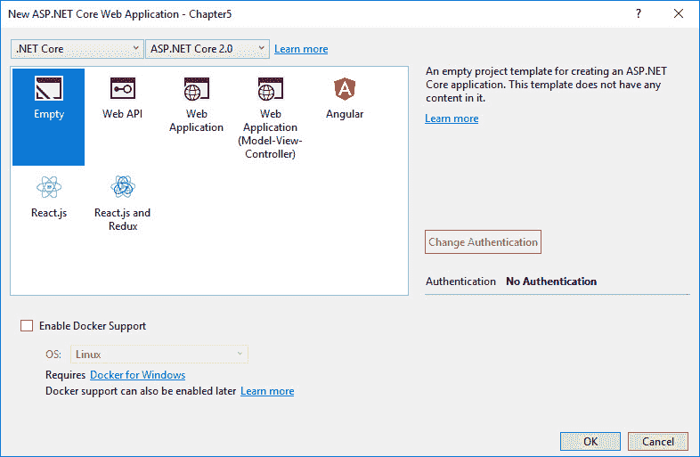

该项目将被创建，如下所示:


# 添加信号库

接下来，我们需要将 SignalR 包文件添加到项目中。

在撰写本文时，在 NuGet 包管理器中浏览时找不到 ASP.NETCore 信号器的包，因此我们将使用包管理器控制台添加所需的包。

1.  转到工具|否获取包管理器|包管理器控制台:


2.  在控制台窗口中，键入以下命令，然后按 enter 键:

```cs
Install-Package Microsoft.AspnetCore.SignalR -Version 1.0.0-alpha2-final
```

您应该会看到一些响应行，显示已成功安装的项目。

我们的项目还需要 SignalR 客户端 JavaScript 库。为此，我们将使用`npm`命令。

npm is a package manager, like NuGet, but for JavaScript. Feel free to check it out at [https://www.npmjs.com](https://www.npmjs.com).

3.  在控制台窗口中输入以下命令，点击*进入*:

```cs
npm install @aspnet/signalr-client
```

这会将大量 js 文件下载到项目根目录下的`node_modules`文件夹中。输出可能会显示一些警告，但不必担心。如果`node_modules`目录存在，可以确认下载成功。

有了我们的包，我们可以(最终)开始编写一些代码。

# 构建服务器

我们需要为我们的聊天程序建立一个服务器，它将包含我们想要从连接的客户端调用的方法。我们将使用信号中枢应用编程接口，它为连接的客户端提供与我们的聊天服务器通信所需的方法。

# 信号集线器子类

我们现在需要创建信号中枢。为此，请执行以下步骤:

1.  向项目中添加一个类来处理服务器端的聊天。我们称之为`Chat`:


这需要是信号`Hub`类的子类。确保添加`Micosoft.AspNetCore.SignalR`的使用说明。Visual Studio 的*快速动作*在这方面效果很好:

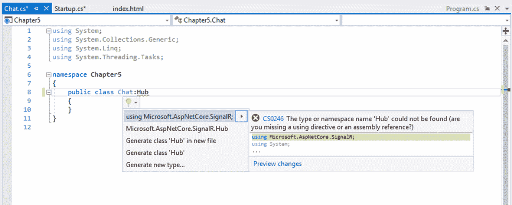

2.  现在给类添加一个`Task`方法来处理消息的发送:

```cs
        public Task Send(string sender, string message) 
        { 
            return Clients.All.InvokeAsync("UpdateChat", sender, 
            message); 
        } 
```

该方法将通过任何连接的客户端调用，并将调用所有连接的客户端的`Send`函数，通过发送方和消息参数传递。

3.  现在添加一个`Task`方法来处理归档功能:

```cs
        public Task ArchiveChat(string archivedBy, string path, 
         string messages) 
        { 
            string fileName = "ChatArchive" + 
             DateTime.Now.ToString("yyyy_MM_dd_HH_mm") + ".txt"; 
            System.IO.File.WriteAllText(path + "\" + fileName, 
             messages); 
            return Clients.All.InvokeAsync("Archived", "Chat 
             archived by "+ archivedBy); 
        } 
```

如您所见，该方法只需获取 messages string 参数的值，将其写入名为`ChatArchive_[date].txt`的新文本文件，该文件保存到给定的路径，并调用客户端`Archived`函数。

为了让这两个任务真正发挥作用，我们需要做更多的脚手架。

# 配置更改

在`Startup.cs`文件中，我们需要向容器中添加 SignalR 服务以及配置 HTTP 请求管道。

1.  在`ConfigureServices`方法中，添加以下代码:

```cs
services.AddSignalR();
```

2.  在`Configure`方法中，添加以下代码:

```cs
app.UseSignalR(routes => 
      { 
          routes.MapHub<Chat>("chat"); 
      });
```

您的代码窗口现在将如下所示:


我们的服务器完成了。

You will note that I have added the following line of code, `app.UseStaticFiles()` to the `Configure` method. Static files are assets that an ASP.NET Core app serves directly to clients. Examples of static files are HTML, CSS, JavaScript, and images.

我们可以(也将)稍后扩展我们服务器的功能，但是，现在，让我们转向我们的客户端。

# 创建客户端

正如在我们的项目布局中提到的，客户端将由用于向服务器发送消息和从服务器接收消息的 JavaScript 函数以及用于显示的 HTML 元素组成。

1.  在您的项目中，在`wwwroot`下添加一个名为`scripts`的新文件夹:

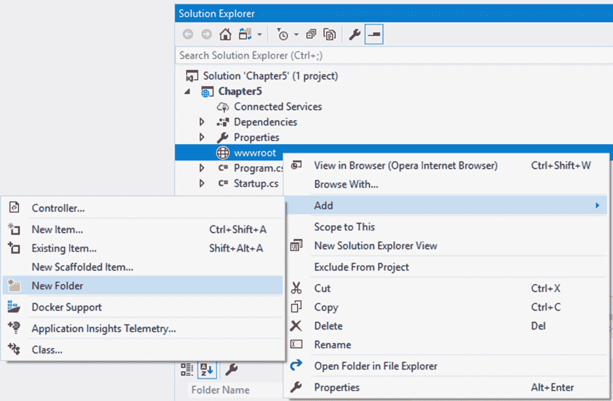

还记得之前我们的`npm`命令为我们创建的`node_modules`目录吗？

2.  导航至`node_modules`目录中的以下路径:

`\@aspnet\signalr-client\dist\browser`

请看下面的截图:


3.  将`signalr-client-1.0.0-alpha2-final.min.js`文件复制到我们刚刚在项目中创建的脚本文件夹中。我们将在我们现在创建的 HTML 文件中引用这个库。
4.  在`wwwroot`文件夹中添加一个 HTML 页面。我已经命名我的`index.html`。我建议你也这样命名。我稍后会解释:


我们将保持客户端页面非常简单。我使用`div`标签作为面板来显示和隐藏页面上的不同部分。我也在使用 bootstrap 使它看起来很漂亮，但是你可以用你喜欢的任何方式设计它。我也不会用一些基本的东西来烦你，比如在哪里指定你的页面标题。我们将坚持相关的要素。

让我向您展示整个 HTML 布局代码以及 JavaScript，我们将从这里开始进行分解:

```cs
<!DOCTYPE html> 
<html> 
<head> 
    <title>Chapter 5- Signal R</title> 
    <link rel="stylesheet" href="https://maxcdn.bootstrapcdn.com/bootstrap/3.3.7/css/bootstrap.min.css"> 
    <script src="https://ajax.googleapis.com/ajax/libs/jquery/3.2.1/jquery.min.js"></script> 
    <script src="https://maxcdn.bootstrapcdn.com/bootstrap/3.3.7/js/bootstrap.min.js"></script> 
    <script src="/Scripts/signalr-client-1.0.0-alpha2-final.min.js"></script> 

    <script type="text/javascript"> 
        let connection = new signalR.HubConnection('/chat'); 
        connection.start(); 

        connection.on('UpdateChat', (user, message) => { 
            updateChat(user, message); 
        }); 
        connection.on('Archived', (message) => { 
            updateChat('system', message); 
        }); 

        function enterChat() { 
            $('# user').text($('# username').val()); 
            sendWelcomeMessage($('# username').val()); 
            $('# namePanel').hide(); 
            $('# chatPanel').show(); 
        }; 

        function sendMessage() { 
            let message = $('# message').val(); 
            let user = $('# user').text(); 
            $('# message').val(''); 
            connection.invoke('Send', user, message); 
        }; 

        function sendWelcomeMessage(user) { 
            connection.invoke('Send','system',user+' joined the 
            chat'); 
        }; 

        function updateChat(user, message) { 
            let chat = '<b>' + user + ':</b> ' + message + 
            '<br/>' 
            $('# chat').append(chat); 
            if ($('# chat')["0"].innerText.length > 0) { 
                $('# historyPanel').show(); 
                $('# archivePanel').show(); 
            } 
        }; 

        function archiveChat() { 
            let message = $('# chat')["0"].innerText; 
            let archivePath = $('# archivePath').val(); 
            let archivedBy = $('# username').val(); 
            connection.invoke('ArchiveChat', archivedBy, 
             archivePath, message); 
        }; 
    </script> 

</head> 
<body> 
    <div class="container col-md-10"> 
        <h1>Welcome to Signal R <label id="user"></label></h1> 
    </div> 
    <hr /> 
    <div id="namePanel" class="container"> 
        <div class="row"> 
            <div class="col-md-2"> 
                <label for="username" class="form-
                  label">Username:</label> 
            </div> 
            <div class="col-md-4"> 
                <input id="username" type="text" class="form-
                 control" /> 
            </div> 
            <div class="col-md-6"> 
                <button class="btn btn-default" 
                  onclick="enterChat()">Enter</button> 
            </div> 
        </div> 
    </div> 
    <div id="chatPanel" class="container" style="display: none"> 
        <div class="row"> 
            <div class="col-md-2"> 
                <label for="message" class="form-label">Message: 
                </label> 
            </div> 
            <div class="col-md-4"> 
                <input id="message" type="text" class="form-
                 control" /> 
            </div> 
            <div class="col-md-6"> 
                <button class="btn btn-info" 
                 onclick="sendMessage()">Send</button> 
            </div> 
        </div> 
        <div id="historyPanel" style="display:none;"> 
            <h3>Chat History</h3> 
            <div class="row"> 
                <div class="col-md-12"> 
                    <div id="chat" class="well well-lg"></div> 
                </div> 
            </div> 
        </div> 
    </div> 
    <div id="archivePanel" class="container" style="display:none;"> 
        <div class="row"> 
            <div class="col-md-2"> 
                <label for="archivePath" class="form-
                 label">Archive Path:</label> 
            </div> 
            <div class="col-md-4"> 
                <input id="archivePath" type="text" class="form-
                 control" /> 
            </div> 
            <div class="col-md-6"> 
                <button class="btn btn-success" 
                 onclick="archiveChat()">Archive Chat</button> 
            </div> 
        </div> 
    </div> 
</body></html> 
```

# 包含的库

添加`link`和`script`标签以包含所需的库:

```cs
<link rel="stylesheet" href="https://maxcdn.bootstrapcdn.com/bootstrap/3.3.7/css/
bootstrap.min.css">
<script src="https://ajax.googleapis.com/ajax/libs/jquery/3.2.1/jquery.min.js">
</script>
<script src="https://maxcdn.bootstrapcdn.com/bootstrap/3.3.7/js/bootstrap.min.js">
</script>
<script src="/Scripts/signalr-client-1.0.0-alpha2-final.min.js"> </script>
```

如果您不想使用 bootstrap 的外观和感觉，您不需要 bootstrap JavaScript 库或 CSS，但是请注意，我们将在脚本中使用 jQuery，所以把它留在。

# 命名部分

我们需要知道谁是聊天室的参与者。添加一个输入元素来获取用户名，并添加一个按钮来调用`enterChat`函数:

*   `<input id="username" type="text" class="form-control" />`
*   `<button class="btn btn-default" onclick="enterChat()">Enter</button>`

# 聊天输入

添加所需元素，使我们的用户能够键入消息(输入)并将其发布到服务器(事件按钮为`sendMessage`):

*   `<input id="message" type="text" class="form-control" />`
*   `<button class="btn btn-info" onclick="sendMessage()">Send</button>`

# 对话面板

添加一个带有标识`"chat"`的`div`标签。我们将把它作为我们对话的容器(聊天记录):

*   `<div id="chat" class="well well-lg"></div>`

# 存档功能

添加所需的元素，使我们的用户能够指定存档文件需要保存(输入)的路径，并将消息发布到服务器(事件按钮为`archiveChat`):

*   `<input id="archivePath" type="text" class="form-control" />`
*   `<button class="btn btn-info" onclick="archiveChat()">Archive Chat</button>`

# JavaScript 函数

我们的客户端将需要一些代码来发送和消费来自服务器的消息。我试图让 JavaScript 尽可能简单，为了可读性，我选择了 jQuery 代码:

1.  为我们的信号中枢服务器创建一个变量(我把我的命名为`connection`)，并调用它的启动函数:

```cs
let connection = new signalR.HubConnection('/chat');
connection.start();
```

`signalR.HubConnection`的`'/chat'`参数是指我们的`Chat.cs`类，它继承了 SignalR 的 Hub 接口。

2.  添加`UpdateChat`和`Archived`方法，由服务器调用:

```cs
connection.on('UpdateChat', (user, message) => {
updateChat(user, message);
});
connection.on('Archived', (message) => {
updateChat('system', message);
});
```

我们只需将从服务器获得的参数传递给我们的`updateChat`方法。我们将稍微定义一下这个方法。

3.  定义`enterChat`功能:

```cs
function enterChat() {
$('# user').text($('# username').val());
sendWelcomeMessage($('# username').val());
$('# namePanel').hide();
$('# chatPanel').show();
};
```

我们从用户名输入元素的值中设置我们的`user`标签的文本，将其传递给我们的`sendWelcomeMessage`方法(我们稍后将定义)，并切换相关面板的显示。

4.  定义`sendMessage`方法:

```cs
function sendMessage() {
let message = $('# message').val();
$('# message').val('');
let user = $('# user').text();
connection.invoke('Send', user, message);
};
```

我们从消息输入元素中设置`message`变量，然后为下一条消息清除它，并从用户标签中设置`user`变量。然后我们使用`connection.invoke`方法在我们的服务器上调用`Send`方法，并将我们的变量作为参数传递。

5.  定义`sendWelcomeMessage`功能:

```cs
function sendWelcomeMessage(user) {
connection.invoke('Send','system',user+' joined the chat');
};
```

就像步骤 4 中描述的`sendMessage`函数一样，我们将使用`connection.invoke`函数在我们的服务器上调用`Send`方法。虽然这一次我们传递了字符串`'system'`作为用户参数和一个关于刚刚加入的用户的信息。

6.  定义`updateChat`方法:

```cs
function updateChat(user, message) {
let chat = '<b>' + user + ':</b> ' + message + '<br/>'
$('# chat').append(chat);
if ($('# chat')["0"].innerText.length > 0) {
$('# historyPanel').show();
$('# archivePanel').show();
}
};
```

`updateChat`只是我们用来更新聊天历史面板的自定义功能。我们本可以在两个`connection.on`函数中内联完成，但这意味着我们会重复自己。作为任何编码的一般规则，你应该尽量不要重复编码。

在这个函数中，我们将`chat`变量设置为，但是我们希望每个聊天记录行在样式方面看起来都是一样的。在这种情况下，我们简单地用粗体显示我们的用户(用一个冒号)，并在后面加上一个换行符。几行聊天看起来像这样:

*   **约翰**:大家好
*   莎拉:嗨，约翰
*   **服务器**:彼得加入聊天
*   约翰:嗨，莎拉，你好，彼得
*   **彼得**:大家好

我还检查了聊天 div `innerText`属性，以确定聊天历史和存档面板是否应该可见。

定义`archiveChat`功能:

```cs
function archiveChat() {
let message = $('# chat')["0"].innerText;
let archivePath = $('# archivePath').val();
connection.invoke('ArchiveChat', archivePath, message);
};
```

像其他所有事情一样，我尽量保持简单。我们采用聊天面板(div)的`innerText`和`archivePath`输入中指定的路径，并将其传递给服务器的`ArchiveChat`方法。

当然，我们这里有一个小的错误窗口:如果用户没有输入要保存的文件的有效路径，代码将抛出一个异常。我会让你自己的创造力来解决这个问题。我来这里只是为了 SignalR 的功能。

# 解决方案概述

现在你应该有一个完整的，可构建的解决方案。让我们快速查看一下解决方案资源管理器中的解决方案:

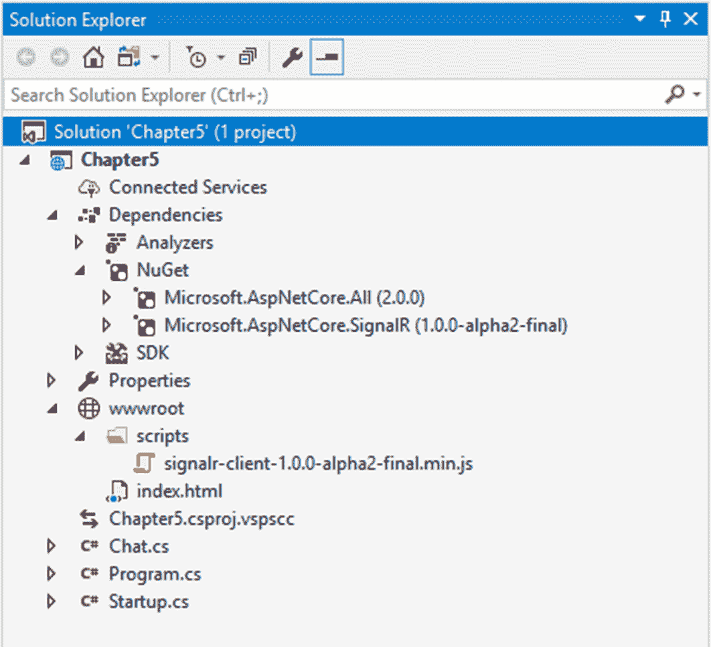

从顶部开始，让我列出我们对`Chapter5`项目所做的更改:

1.  以下是我们通过 NuGet 添加的 signor Asp.NETCore 库:

`Dependencies/NuGet/Microsoft.AspNetCore.SignalR (1.0.0-alpha2-final)`

2.  使用`npm`下载后，我们从`node_modules`文件夹手动复制了这个 JavaScript 库:

`wwwroot/scripts/signalr-client-1.0.0-alpha2-final.min.js`

3.  我们的客户端页面，包含 HTML 标记、样式和 JavaScript，集于一身:`one.wwwroot/index.html`

If you are going to use this application as a base and extend it, I recommend moving the JavaScript code to a separate `.js` file. It is easier to manage and is another good coding standard to follow.

1.  `Chat.cs`:这是我们的聊天服务器代码——或者说是我们声明的任何自定义任务方法
2.  `Startup.cs`:这个文件在 Asp.NET 代码网络应用中是标准的，但是我们更改了配置，以确保 SignalR 作为服务添加

1.  让我们建立我们的项目。在 Visual Studio 的顶部菜单上，单击“生成”菜单按钮:

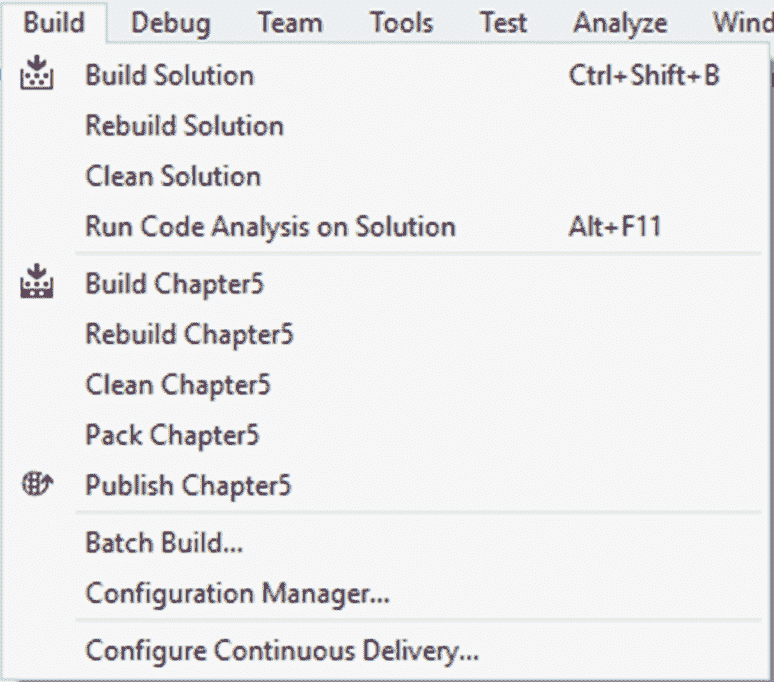

您可以选择构建整个解决方案，也可以选择在单个项目中构建。鉴于我们的解决方案中只有一个项目，我们可以选择任何一个。也可以使用快捷键*Ctrl*+*Shift*+*B*。

您应该会在“输出”窗口中看到一些(希望成功的)构建消息:

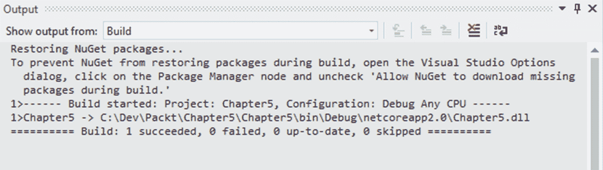

如果你有任何错误，再看一遍这一章，看看你是否遗漏了什么。一根小刺会引起很多不适。

# 展示和讲述

是时候了。您已经创建了项目，添加了库，并编写了代码。现在让我们看看这个东西是如何运作的。

# 运行应用

运行该应用，点击 *F5* (或 *Ctrl* + *F5* 开始，无需调试)。该应用将在您的默认浏览器中打开，您应该会看到:


等等。什么事？我们一定遗漏了什么。

现在，我们可以通过将我们的网址更改为`localhost:12709/index.html`(只需检查您的端口号)来导航到 index.html 页面，我们都会很好。

相反，让我们指定我们的`index.html`页面作为我们的默认启动页面。

在`Startup.cs`类中，在`Configure`方法中，在顶部添加这一行:

`app.UseDefaultFiles();`

有了这个小宝石，对`wwwroot`文件夹的任何请求(它随时导航到您的网站)都将搜索以下内容之一:

*   `default.htm`
*   `default.html`
*   `index.htm`
*   `index.html`

找到的第一个文件将是作为默认页面的文件。太好了。

现在让我们再次运行我们的应用:


即使我们的网址仍然没有显示`/index.html`部分，我们的网络应用现在知道该服务于哪个页面。现在我们可以开始聊天了。输入用户名并点击*进入:*

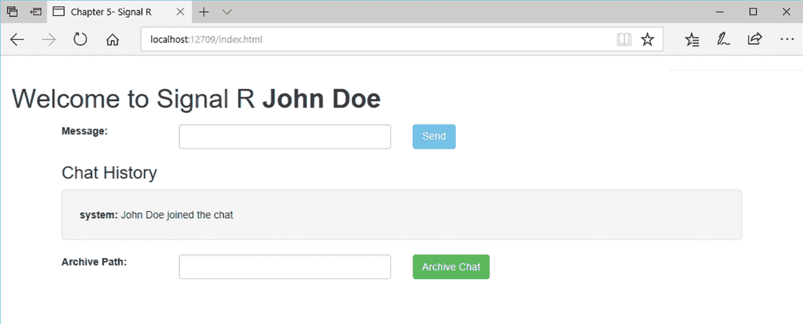

如您所见，我们的姓名面板现已隐藏，我们的聊天和存档面板正在显示。

由于我们的`sendWelcomeMessage(user)`功能，我们的服务器也很友好地通知我们加入了聊天。

每次我们发送消息时，我们的聊天记录都会更新:


# 让派对开始

对话只有在涉及多方的情况下才是对话。所以我们开个派对吧。

如果你在网络上发布应用，你可以使用实际的网络客户端来聊天，但是我不在网络上(不是在那个意义上)，所以我们使用另一个技巧。我们可以使用各种浏览器来代表我们不同的聚会客人(网络客户)。

复制您的应用网址(再次检查端口号)，并将其粘贴到其他几个浏览器中。

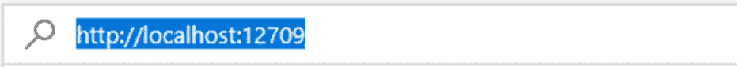

对于每个新访客(浏览器)，您需要指定一个用户名。为了更容易理解，我将把我的额外客人称为不同的浏览器名称。

当他们每个人都进入聊天室并开始发送消息时，您将看到我们的聊天记录不断增长:


您可以平铺浏览器(或者如果您有额外的浏览器，可以将它们移动到其他显示器上)，以查看一个浏览器发送的消息中有多少会立即传递给所有的浏览器，这就是 SignalR 的全部意义。

我们从微软 Edge 的约翰·多伊开始，所以我们将在那里继续他的工作:


歌剧是第一个入党的:

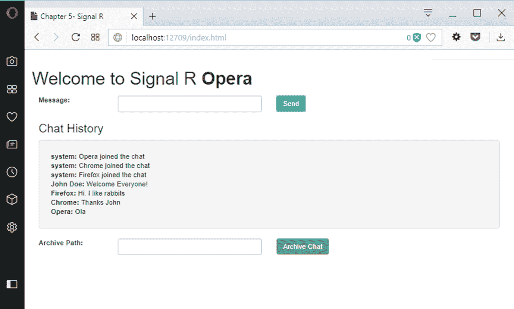

然后 Chrome 来了:

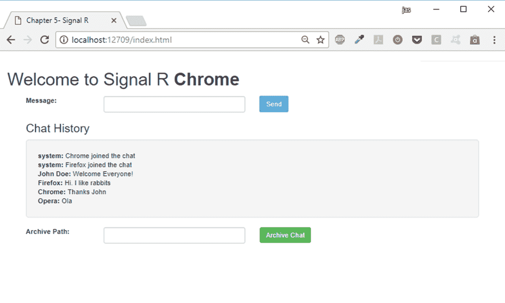

最后，火狐也加入了进来:

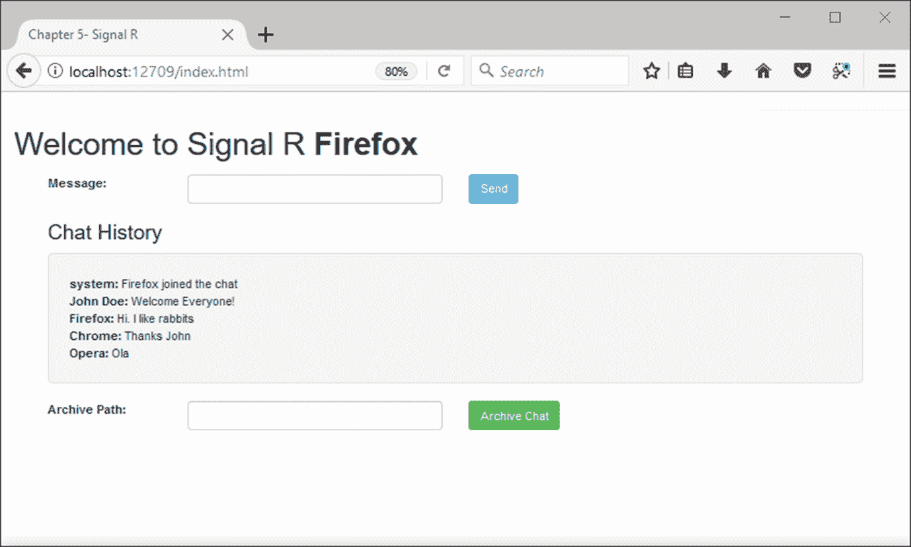

您还会注意到，每位客人的聊天记录只有在他们加入聊天时才会开始。这是设计好的。当客户加入时，我们不会向他们发送历史聊天记录。

# 存档聊天

要将聊天记录保存到文本文件中，请在`archivePath`输入元素中输入有效的本地文件夹路径，然后点击存档聊天按钮:

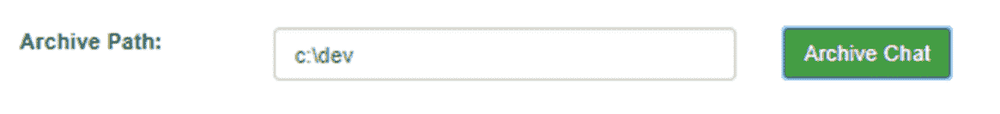

如前所述，我们还没有为我们的路径建立适当的验证，所以请确保您使用有效的路径来测试它。如果成功，您应该会在聊天窗口中看到如下消息:

```cs
system: Chat archived by John Doe
```

您还会在指定路径中找到新创建的具有`ChatArchive_[date].txt`命名约定的文本文件。

# 摘要

如本章所示，SignalR 真的很容易实现。我们创建了一个聊天应用，但是有许多应用可以从实时体验中受益。这些包括股票交易、社交媒体、多人游戏、拍卖、电子商务、财务报告和天气预报

名单可以继续。即使对实时数据的需求不是必需的，SignalR 仍然可以有益于任何应用，使节点之间的通信无缝。

浏览 Asp.NET 通信兵([https://github.com/aspnet/SignalR](https://github.com/aspnet/SignalR))的 GitHub 页面，很明显这个库在不断的被加工和改进，这是一个好消息。

随着对快速、相关和准确信息的需求变得越来越重要，SignalR 是您团队中的优秀成员。