# 六、使用实体框架核心的 Web 研究工具

"The biggest lie I tell myself is that I don't need to write it down, I'll remember it."
                                                                                                                – Unknown

所以，你有几分钟时间补上你的资料。当你滚动浏览时，你会看到一篇文章的链接，文章中有人分享了记忆吉他和弦的新方法。你很想看，但是你现在时间不够。“*我以后再看”*你告诉自己，以后就成了永远。主要是因为你没有写下来。

现在有各种各样的应用可以满足你保存链接以备后用的需求。但我们是开发者。让我们自己写点有趣的东西。

在本章中，我们将了解以下内容:

*   **实体框架** ( **EF** )核心历史
*   代码优先对模型优先对数据库优先的方法
*   开发数据库设计
*   设置项目
*   安装英孚核心
*   创建模型
*   配置服务
*   创建数据库
*   用测试数据播种数据库
*   创建控制器
*   运行应用
*   部署应用

说得很有道理，但别担心，我们会一步一步来。我们去散步吧。

# 实体框架核心历史

开发一个需要从某种数据库读取数据和向某种数据库写入数据的应用，最令人沮丧的部分之一是试图建立代码和数据库之间的通信层。

至少以前是这样。

# 进入实体框架

实体框架是一个**对象关系映射器** ( **ORM** )。它映射了你的.NET 代码对象转换为关系数据库实体。就这么简单。现在，您不必仅仅为了处理简单的 CRUD 操作而关注构建所需的数据访问代码。

当实体框架的第一个版本发布时.NET 3.5 SP1 在 2008 年 8 月，最初的反响并不是很好，以至于一群开发人员签署了一份关于框架的*不信任投票*。令人欣慰的是，提出的大部分问题都得到了解决，实体框架 4.0 的发布以及.NET 4.0，平息了很多围绕框架稳定性的批评。

微软随后决定接手。. NET 跨平台使用.NETCore，这意味着实体框架核心是一个完整的重写。这显然有其利弊，因为 EF Core 和 EF6 之间的比较表明，尽管 EF Core 引入了新的功能和改进，但它仍然是一个新的代码库，因此还不具备 EF6 中可用的所有功能。

# 代码优先对模型优先对数据库优先的方法

使用实体框架，您可以在三种实现方法中进行选择，有选择总是很好的。让我们快速了解一下它们之间的区别。

# 代码优先方法

作为核心程序员的首选武器，这种方法可以让你从代码中完全控制数据库。数据库被视为一个简单的存储位置，很可能不包含任何逻辑或业务规则。一切都是由代码驱动的，因此任何所需的更改也需要在代码中完成:


# 模型优先方法

如果你更喜欢绘画而不是诗歌，那么你可能更喜欢模型优先的方法。在这种方法中，您创建或绘制模型，工作流将生成数据库脚本。如果需要添加特定的逻辑或业务规则，您也可以用部分类扩展您的模型，但是这可能会变得麻烦，如果有太多的细节，最好考虑代码优先的方法:


# 数据库优先方法

数据库优先方法适用于大型项目，在这些项目中，您有一个专门的数据库管理员来设计和维护您的数据库。实体框架将从数据库设计中为您创建实体，您可以在数据库更改完成时运行模型更新:


# 开发数据库设计

只有知道自己在做什么，我们才能知道自己在做什么。在我们开始使用我们的数据库、模型和控制器创建解决方案之前，我们需要首先弄清楚我们想要如何设计数据库。

根据微软的 TechNet，规划数据库可以遵循五个基本步骤:

1.  收集信息
2.  识别对象
3.  建模对象
4.  确定每个对象的信息类型
5.  识别对象之间的关系

我们的要求很简单。我们只需要保存一个 web 链接，以便以后导航，这样我们就不会有多个对象之间存在关系。

然而，我们确实需要澄清我们希望为我们的对象(网络链接)保存的信息类型。显然，我们需要网址，但我们还需要什么？确保您了解您的解决方案需要哪些信息以及如何使用这些信息。

用日常用语来思考这个问题——如果你写了一个朋友家的地址，你可能想要的不仅仅是一条街道，还可能是你朋友的名字或某种便条。

在我们的解决方案中，我们想知道网址是什么，但我们也想知道我们何时保存了它，并有一个位置来捕获注释，以便我们可以向条目添加更多的个人详细信息。因此，我们的模型将包含以下内容:

*   `URL`
*   `DateSaved`
*   `Notes`

当我们开始创建我们的模型时，我们会更详细地讨论，但是我们不要操之过急。我们仍然需要创建我们的项目。

# 设置项目

使用 Visual Studio 2017，创建一个 ASP.NETCore 网络应用。请注意，我们在这个项目中采用了代码优先的方法:

1.  我们把这个应用叫做`WebResearch`。这显示在下面的截图中:

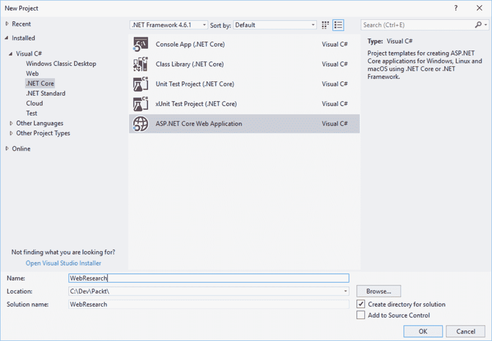

2.  在下一个屏幕上，选择网络应用(模型-视图-控制器)作为项目模板。为了简单起见，将身份验证保持为“无身份验证”。参考以下截图:

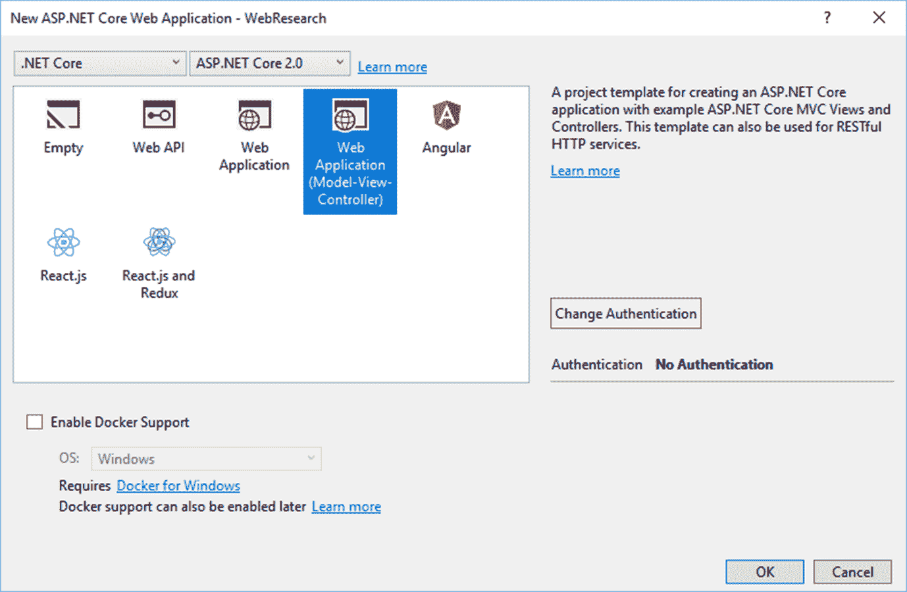

3.  创建的项目将如下所示:


# 安装所需的软件包

我们需要在我们的解决方案中安装三个 NuGet 包，这将有助于我们的探索。这是通过包管理器控制台完成的。

转到工具|否获取包管理器|包管理器控制台:

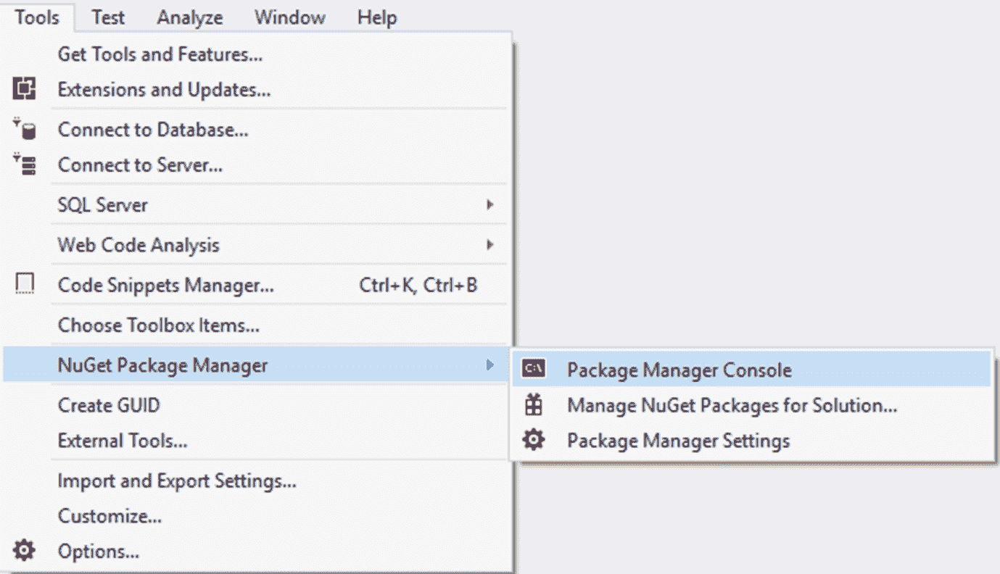

# 实体框架核心服务器

EF Core 提供各种数据库提供商，包括微软的 SQL Server、PostgreSQL、SQLite 和 MySQL。我们将使用 SQL Server 作为数据库提供程序。

For a full list of database providers, have a look at the official Microsoft documentation at: [https://docs.microsoft.com/en-us/ef/core/providers/index](https://docs.microsoft.com/en-us/ef/core/providers/index).

在控制台窗口中，键入以下命令并点击*进入*:

```cs
    Install-Package Microsoft.EntityFrameworkCore.SqlServer  
```

您应该会看到一些响应行，显示成功安装的项目。

# 实体框架核心工具

接下来，我们将安装一些实体框架核心工具，帮助我们从模型中创建数据库。

在控制台窗口中，键入以下命令并点击*进入*:

```cs
    Install-Package Microsoft.EntityFrameworkCore.Tools  
```

同样，您应该会看到一些响应行，显示成功安装的项目。

# 代码生成设计

我们可以使用一些 ASP.NETCore 代码生成工具来帮助我们搭建脚手架，而不是自己编写所有的代码。

接下来在控制台窗口中，键入以下命令并点击*进入*:

```cs
    Install-Package Microsoft.VisualStudio.Web.CodeGeneration.Design
```

像往常一样，检查你是否拿到了`Successfully Installed`物品。

If you have problems installing any NuGet packages, it might point to an access control issue. As a general rule, I set up my Visual Studio to run as administrator, which sorts out most of those problems.

安装后，我们的解决方案将在依赖项部分下反映添加的 NuGet 包，如下所示:

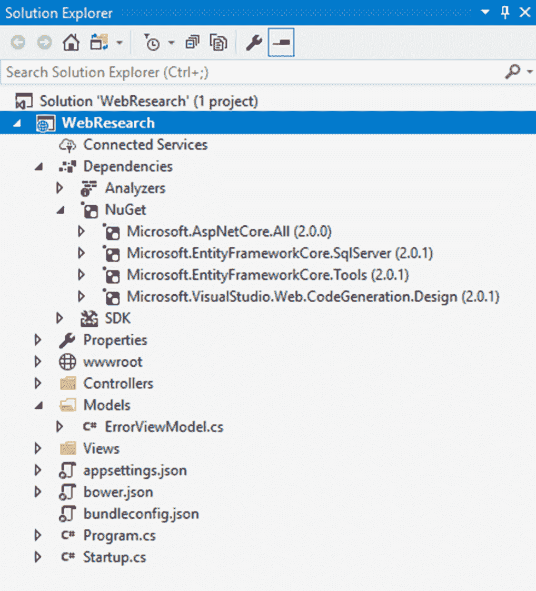

# 创建模型

右键单击项目中的模型文件夹，并添加一个名为`ResearchModel.cs`的类:

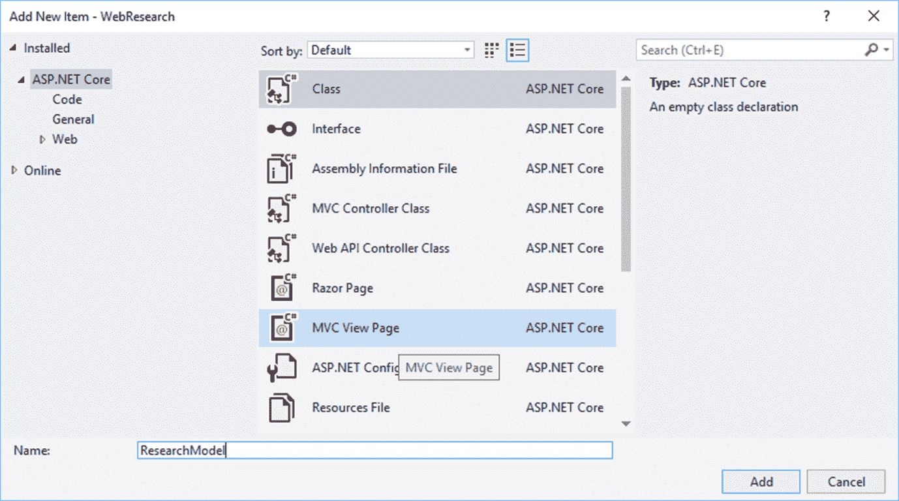

我们实际上需要两个类——一个是表示我们的`entity`对象的`Research`类，另一个是`DbContext`的子类`ResearchContext`。为了简单起见，我们可以将这两个类都放在我们的`ResearchModel`文件中。

下面是代码:

```cs
using Microsoft.EntityFrameworkCore; 
using System; 

namespace WebResearch.Models 
{ 
    public class Research 
    { 
        public int Id { get; set; } 
        public string Url { get; set; } 
        public DateTime DateSaved { get; set; } 
        public string Note { get; set; } 
    } 

    public class ResearchContext : DbContext 
    { 
        public ResearchContext(DbContextOptions<ResearchContext> 
        options) : base(options) 
        { 
        } 

        public DbSet<Research> ResearchLinks { get; set; } 
    } 
} 
```

让我们把它分解如下:

首先，我们有我们的`Research`类，这是我们的`entity`对象表示。正如我们的*开发数据库设计*部分所述，正如前面所讨论的，对于每个链接，我们将保存网址、日期和注释。标识字段是保存信息的数据库表的标准做法。

我们的第二类`ResearchContext`，是`DbContext`的子类。这个类将有一个以`DbContextOptions`为参数的空构造函数和一个用于数据收集的`DbSet<TEntity>`属性。

我可以在这里给你一个关于`DbSet<Entity>`的简单概述，但是我更愿意让 Visual Studio 帮助我们。如果您将鼠标悬停在`DbSet`上，您将获得一个信息弹出窗口，其中包含您需要了解的所有信息:


# 配置服务

在`Startup.cs`类中，在`ConfigureServices`方法中，添加带有以下代码的`DbContext`服务:

```cs
string connection = Configuration.GetConnectionString("LocalDBConnection"); 
services.AddDbContext<ResearchContext>(options => options.UseSqlServer(connection)); 
```

如您所见，我们从配置中设置了一个连接字符串变量，然后将其作为选项参数传递给我们的`DbContext`。

但是坚持住。`LocalDBConnection`从何而来？我们的配置中没有设置任何内容。反正还没有。我们现在就去做吧。

在项目根目录下打开`appsettings.json`文件:


默认情况下，您应该会看到一个日志条目。在`Logging`部分后添加您的`ConnectionStrings`部分，并添加一个`LocalDBConnection`属性。

完整的文件应该如下所示:

```cs
{ 
  "Logging": { 
    "IncludeScopes": false, 
    "LogLevel": { 
      "Default": "Warning" 
    } 
  }, 

  "ConnectionStrings": { 
    "LocalDBConnection": "Server=(localdb)\mssqllocaldb; 
     Database=WebResearch;  
     Trusted_Connection=True" 
  } 
} 
```

稍后，我们将了解如何连接到现有的数据库，但目前我们只是连接到一个本地`db`文件。

# 创建数据库

在任何应用的开发阶段，您的数据模型很有可能会改变。当这种情况发生时，您的 EF 核心模型与数据库模式不同，您必须删除过时的数据库，并基于更新的模型创建一个新的数据库。

在您完成第一次实时实现并且您的应用在生产环境中运行之前，这都是有趣的游戏。然后，您不能为了更改几列而删除数据库。当您进行任何更改时，您必须确保实时数据持续存在。

实体框架核心迁移是一个极好的特性，它使我们能够对数据库模式进行更改，而不是重新创建数据库并丢失生产数据。`Migrations`有很多可能的功能和灵活性，这是一个非常值得花时间讨论的话题，但我们现在只讨论一些基础知识。

我们可以使用`Package Manager Console`中的 EF 核心迁移命令来设置、创建和更新我们的数据库(如果需要)。

在`Package Manager Console`中，我们将执行以下两个命令:

1.  `Add-Migration InitialCreate`
2.  `Update-Database`

第一个命令将在项目的`Migrations`文件夹中生成代码，用于创建数据库。这些文件的命名约定是`<timestamp>_InitialCreate.cs`。

第二个命令将创建数据库并运行`Migrations`:


`InitialCreate`类中`Note`有两种方法，`Up`和`Down`。简单地说，`Up`方法代码在升级应用时执行，而`Down`方法代码在降级应用时运行。

假设我们想给我们的`Research`模型添加一个名为`Read`的布尔属性。为了保持该值，我们显然还需要将该列添加到我们的表中，但是我们不想为了添加一个字段而删除该表。借助`Migrations`我们可以更新表格，而不是重新创建表格。

我们将从改变我们的模型开始。在`Research`类中，添加`Read`属性。我们的课将如下所示:

```cs
public class Research 
{ 
    public int Id { get; set; } 
    public string Url { get; set; } 
    public DateTime DateSaved { get; set; } 
    public string Note { get; set; } 
    public bool Read { get; set; } 
} 
```

接下来，我们将添加一个`Migration`。我们将使用`Migration`名称来表示我们正在做的事情。在您的`Package Manager Console`中执行以下命令:

```cs
    Add-Migration AddReseachRead
```

你会注意到我们的`Migrations`文件夹中有一个新的类:


让我们看看引擎盖下。你会发现我们的`Up`和`Down`方法并不像`InitialCreate`类那样空洞:

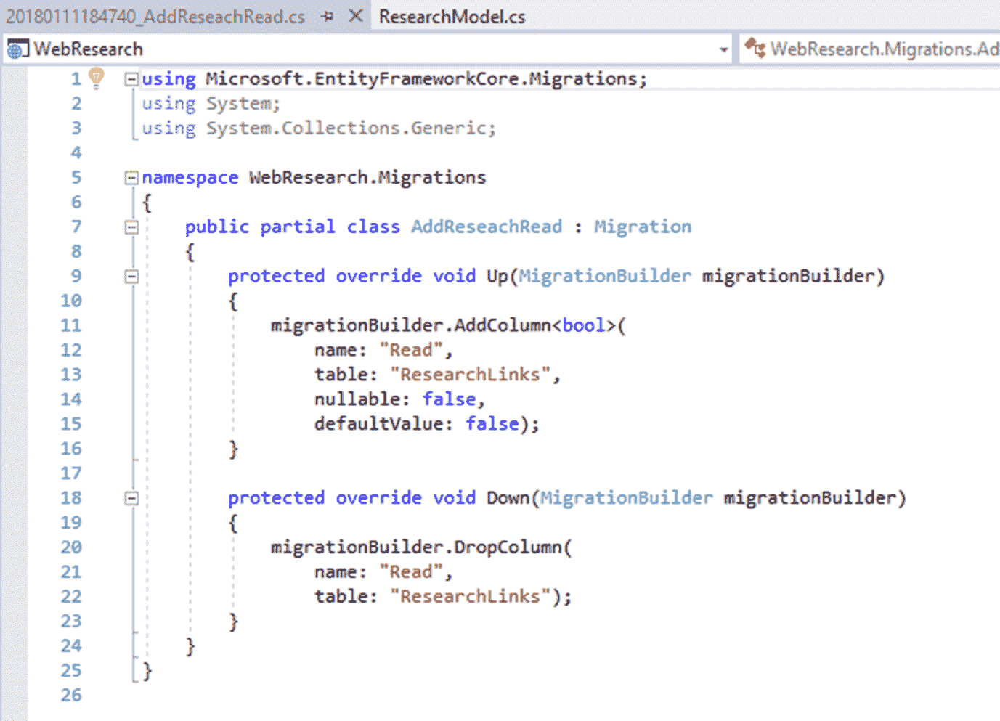

如前所述，`Up`方法在上坡时执行，而`Down`方法在下坡时执行。现在我们可以看到代码了，这个概念清楚多了。在`Up`方法中，我们添加了`Read`列，在`Down`方法中，我们删除了该列。

如果需要，我们可以对这段代码进行修改。例如，我们可以更改`Read`列的`nullable`属性，但是更新代码如下:

```cs
protected override void Up(MigrationBuilder migrationBuilder) 
{ 
    migrationBuilder.AddColumn<bool>( 
        name: "Read", 
        table: "ResearchLinks", 
        nullable: true, 
        defaultValue: false); 
} 
```

我们还可以添加一个自定义的 SQL 查询，将所有现有条目更新到`Read`:

```cs
migrationBuilder.Sql( 
    @" 
        UPDATE Research 
        SET Read = 'true'; 
    "); 
```

我知道这不是一个很好的例子，因为你不会希望每次更新数据库时所有的`Research`条目都被标记为`Read`，但希望你理解这个概念。

不过这段代码还没有被执行。因此，目前，我们的模型和数据库模式仍然不同步。

再次执行以下命令，我们都是最新的:

```cs
    Update-Database
```

# 用测试数据播种数据库

现在我们有了一个空的数据库，让我们用一些测试数据来填充它。为此，我们需要创建一个在数据库创建后调用的方法:

1.  在项目中创建一个名为`Data`的文件夹。在文件夹中，添加一个名为`DbInitializer.cs`的类:

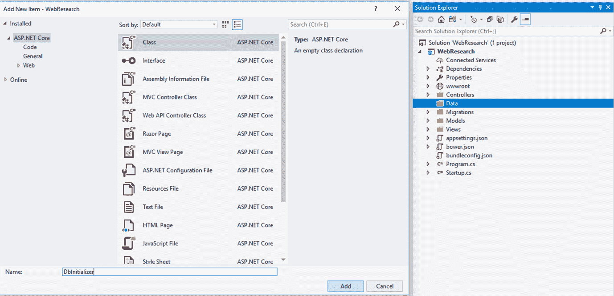

该类有一个以我们的`ResearchContext`为参数的`Initialize`方法:

```cs
public static void Initialize(ResearchContext context) 
```

2.  在`Initialize`方法中，我们首先调用`Database.EnsureCreated`方法来确保数据库存在，如果不存在则创建数据库:

```cs
context.Database.EnsureCreated(); 
```

3.  接下来，我们做一个快速的`Linq`查询来检查`ResearchLinks`表是否有记录。论点是，如果表是空的，我们想添加一些测试数据:

```cs
if (!context.ResearchLinks.Any()) 
```

4.  然后，我们创建一个`Research`模型的数组，并添加一些测试条目。网址可以是你喜欢的任何东西。我只是去了几个最常见的网站:

```cs
var researchLinks = new Research[] 
{ 
 new Research{Url="www.google.com", DateSaved=DateTime.Now, 
  Note="Generated Data", Read=false}, 
       new Research{Url="www.twitter.com", DateSaved=DateTime.Now,  
  Note="Generated Data", Read=false}, 
       new Research{Url="www.facebook.com", DateSaved=DateTime.Now, 
  Note="Generated Data", Read=false}, 
       new Research{Url="www.packtpub.com", DateSaved=DateTime.Now, 
  Note="Generated Data", Read=false}, 
       new Research{Url="www.linkedin.com", DateSaved=DateTime.Now,  
  Note="Generated Data", Read=false}, 
}; 
```

5.  填充数组后，我们循环遍历数组并将条目添加到上下文中，最后调用`SaveChanges`方法将数据保存到数据库中:

```cs
foreach (Research research in researchLinks) 
{ 
 context.ResearchLinks.Add(research); 
} 
 context.SaveChanges();
```

6.  将它们放在一起看起来如下:

```cs
using System; 
using System.Linq; 
using WebResearch.Models; 

namespace WebResearch.Data 
{ 
    public static class DbInitializer 
    { 
        public static void Initialize(ResearchContext context) 
        { 
            context.Database.EnsureCreated(); 

            if (!context.ResearchLinks.Any()) 
            { 
                var researchLinks = new Research[] 
                { 
                    new Research{Url="www.google.com", 
                     DateSaved=DateTime.Now, Note="Generated Data", 
                      Read=false}, 
                    new Research{Url="www.twitter.com", 
                      DateSaved=DateTime.Now, Note="Generated
                      Data", 
                       Read=false}, 
                    new Research{Url="www.facebook.com", 
                     DateSaved=DateTime.Now, Note="Generated Data", 
                      Read=false}, 
                    new Research{Url="www.packtpub.com", 
                     DateSaved=DateTime.Now, Note="Generated Data", 
                      Read=false}, 
                    new Research{Url="www.linkedin.com", 
                     DateSaved=DateTime.Now, Note="Generated Data", 
                      Read=false}, 
                }; 
                foreach (Research research in researchLinks) 
                { 
                    context.ResearchLinks.Add(research); 
                } 
                context.SaveChanges(); 
            } 
        } 
    } 
} 
```

# 创建控制器

控制器是构建 ASP.NETCore MVC 应用的基本构件。控制器内部的方法被称为动作。因此，我们可以说控制器定义了一组动作。操作处理请求，这些请求通过路由映射到特定的操作。

要阅读更多关于控制器和动作的主题，请参阅微软文档，网址为–[https://docs . Microsoft . com/en-us/aspnet/core/MVC/controller/actions](https://docs.microsoft.com/en-us/aspnet/core/mvc/controllers/actions)。要了解更多关于路由的信息，请参阅微软文档-[https://docs . Microsoft . com/en-us/aspnet/core/MVC/controller/routing](https://docs.microsoft.com/en-us/aspnet/core/mvc/controllers/routing)。请遵循以下步骤:

1.  右键单击控制器文件夹，然后选择添加|控制器。
2.  在支架屏幕上，使用实体框架选择带视图的 MVC 控制器，然后单击添加:

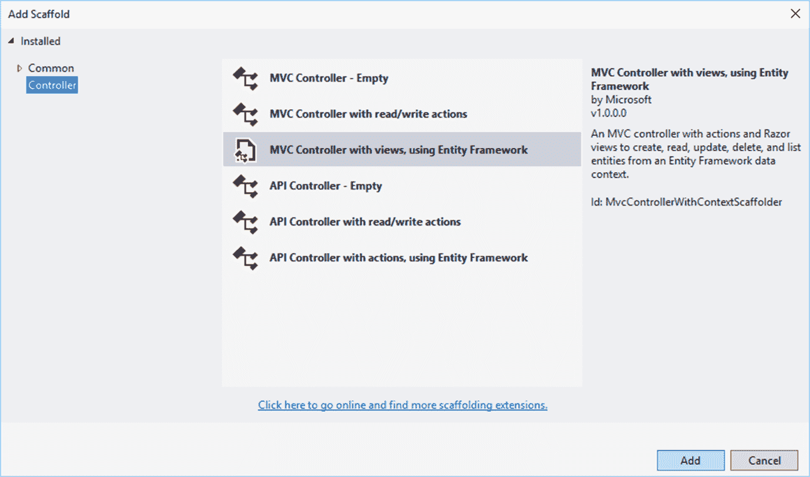

3.  在下一个屏幕上，为模型类选择我们的研究模型，为数据上下文类选择研究上下文。您可以保持其余部分不变，除非您想要更改控制器名称:

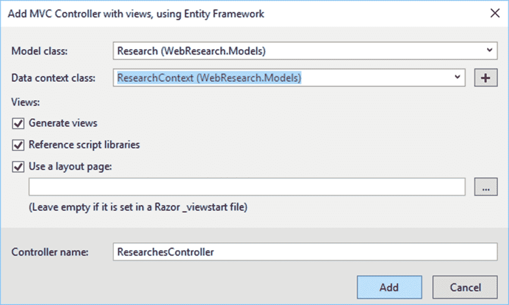

简单看一下创建的控制器，我们会发现我们现在已经有了基本的**创建、读取、更新和删除** ( **CRUD** )任务。现在，是主要活动的时间了。

# 运行应用

在我们进入并运行应用之前，让我们确保我们的新页面易于访问。最简单的方法是将其设置为默认主页:

1.  看看`Startup.cs`中的`Configure`法。您会注意到默认路线被指定为`Home`控制器。
2.  只需将控制器更改为您的`Research`控制器，如下所示:

```cs
app.UseMvc(routes => 
{ 
    routes.MapRoute( 
        name: "default", 
        template: "{controller=Researches}/{action=Index}/{id?}"); 
});
```

3.  最后，确保你的`Main`方法如下:

```cs
public static void Main(string[] args)
{
  var host = BuildWebHost(args);
  using (var scope = host.Services.CreateScope())
  {
    var services = scope.ServiceProvider;
    try
    {
      var context = services.GetRequiredService<ResearchContext>();
      DbInitializer.Initialize(context);
    }
    catch (Exception ex)
    {
      var logger = services.GetRequiredService<ILogger<Program>>
       ();logger.LogError(ex, "An error occurred while seeding the 
        database.");
    }
  }host.Run();
}
```

4.  现在，点击 *Ctrl* + *F5* 运行应用，看看你的劳动成果:


5.  如您所见，我们的测试条目可供我们使用。让我们快速了解一下可用的功能:
    *   单击新建查看我们链接的条目表单:

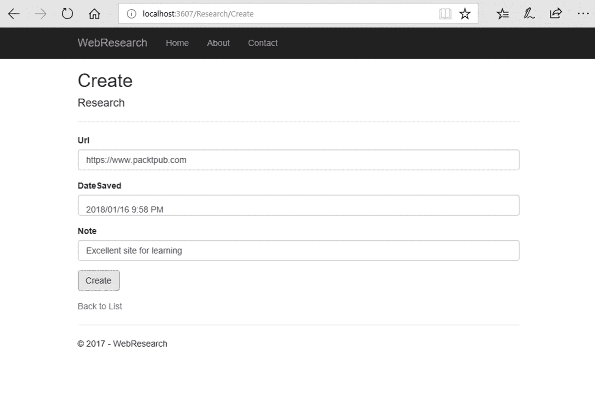

6.  输入一些有趣的数据，然后点击创建按钮。您将被重定向回列表视图，并看到我们的新条目被添加到列表底部:

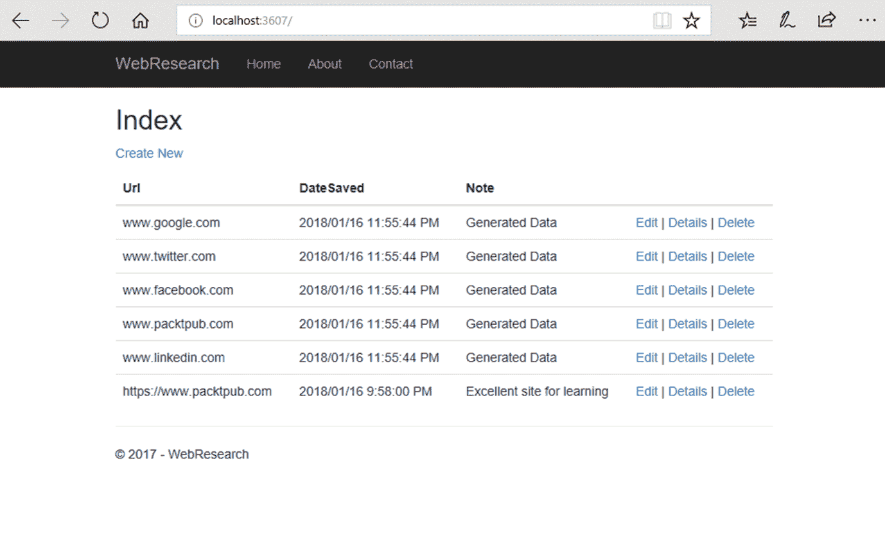

在每个项目旁边，您可以选择编辑、详细信息或删除。继续玩这个功能。人们可以做很多事情来改善用户体验，比如自动填写日期字段。我会留给你自己的创造力来改善你认为合适的用户体验。

# 部署应用

一旦您的应用准备好进行部署，您可以使用以下几个选项:

1.  微软 Azure 应用服务
2.  自定义目标(IIS、FTP)
3.  文件系统
4.  导入配置文件

在 Visual Studio 的“生成”菜单项下，单击“发布网络研究”(或您决定命名的任何项目):

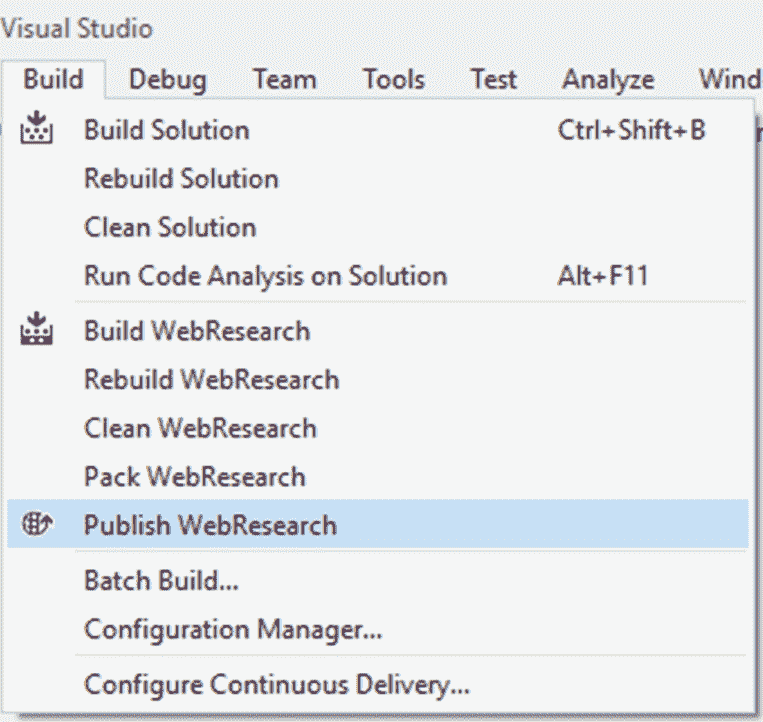

您应该会看到一个屏幕，显示可用的发布选项。让我们仔细看看。

# 微软 Azure 应用服务

Microsoft Azure 负责创建和维护 web 应用所需的所有基础设施需求。这意味着我们开发人员不需要担心服务器管理、负载平衡或安全性等问题。随着平台几乎每天都在改进和扩展，我们也可以相当有信心，我们将拥有最新和最棒的功能。

我们不打算过多讨论 Azure 应用服务，因为它可以自己变成一整本书，但我们肯定可以看看将我们的网络应用发布到这个云平台所需的步骤:

1.  选择 Microsoft Azure 应用服务作为您的发布目标。如果您有要发布到的现有网站，可以选择“选择现有”。现在，我假设您需要新建:


2.  点击“确定”按钮后，Visual Studio 将使用您登录的 Microsoft 帐户联系 Azure，后者将依次检查您是否有 Azure 帐户，并将返回可用的服务详细信息。

我为此蓝图创建了一个试用帐户，事先没有设置具体的细节，从下面的截图中可以看到，Azure 将为您推荐一个可用的应用名称和应用服务计划。

3.  资源组是可选的，如果您没有指定任何内容，它将获得唯一的组名:

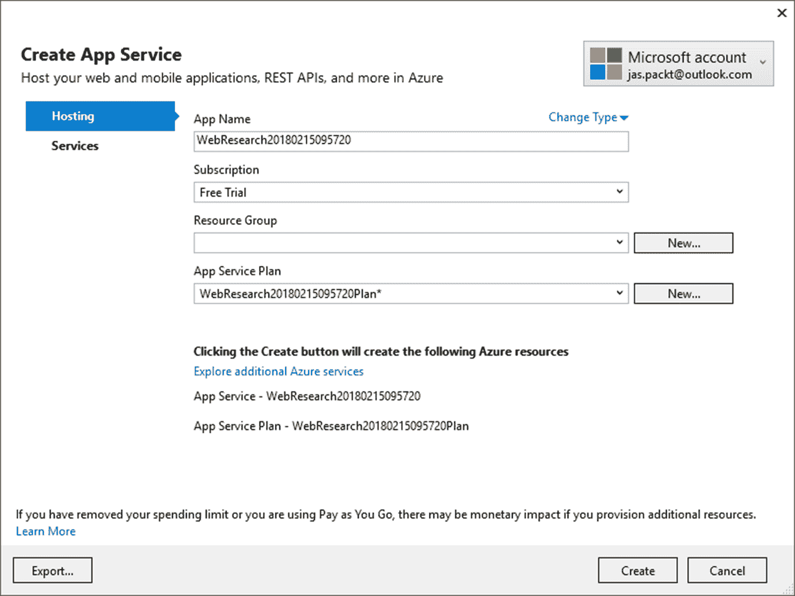

4.  您可以在“更改类型”选项下更改要发布的应用类型。在我们的例子中，我们显然会选择网络应用:


5.  单击左侧的服务，查看将随出版物设置的服务。

第一个框显示了您的应用可能受益的任何推荐资源类型。在我们的例子中，推荐使用一个 SQL 数据库，我们确实需要它，所以我们只需点击添加按钮(+)来添加它:


Azure 将负责 SQL 安装，但是我们需要给它所需的信息，例如如果您的配置文件中已经有一个服务器，应该使用哪个服务器，或者如果您还没有，应该创建一个新的服务器。

6.  在这种情况下，我们将配置一个新的 SQL Server。单击“SQL Server”下拉列表旁边的“新建”按钮，打开“配置 SQL Server”表单。Azure 将为服务器提供一个推荐的名称。虽然您可以自己提供，但服务器名称很可能不可用，因此我建议您只使用他们推荐的名称。
7.  为服务器提供管理员用户名和管理员密码，然后点击确定:

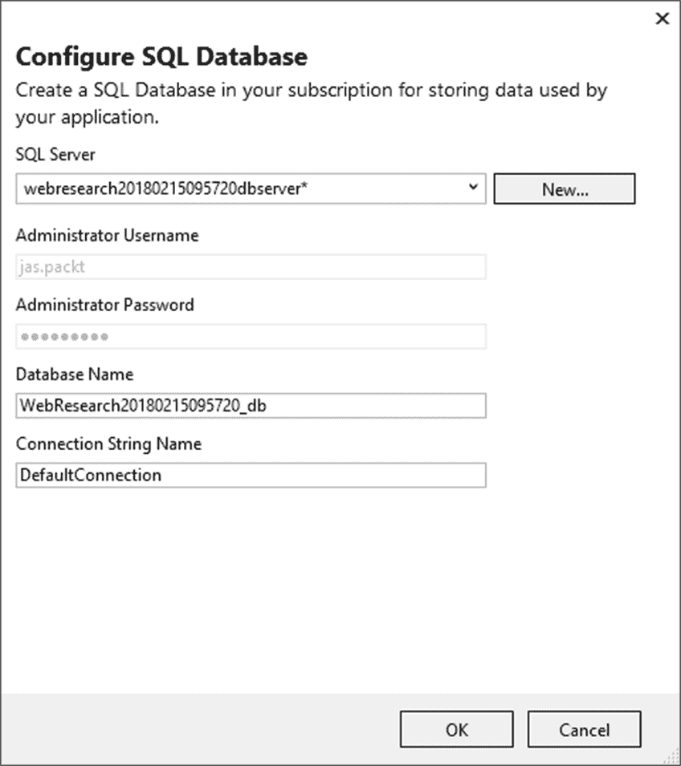

8.  这样做将使您返回到“配置 SQL 数据库”表单，在该表单中，您需要指定数据库名称以及连接字符串名称:

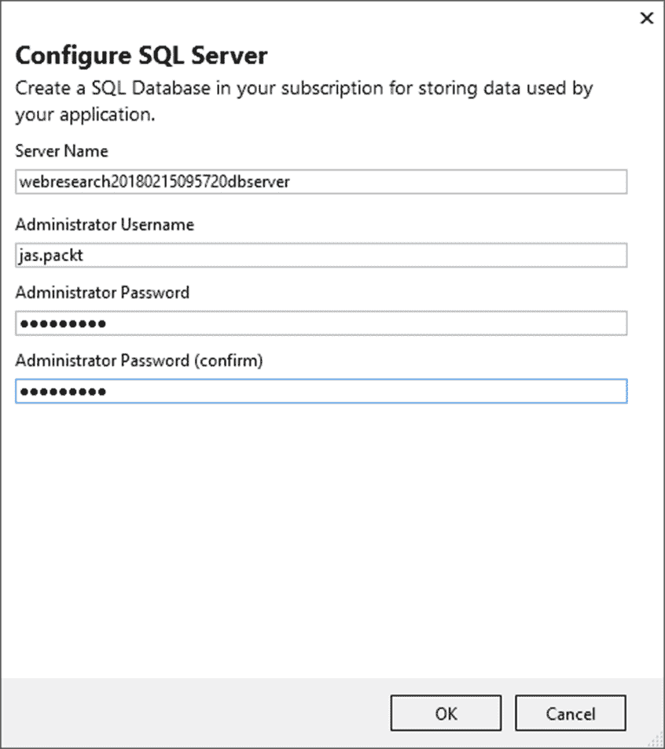

9.  再次查看“创建应用服务”表单。您会注意到 SQL 数据库已经添加到您选择和配置的资源部分:

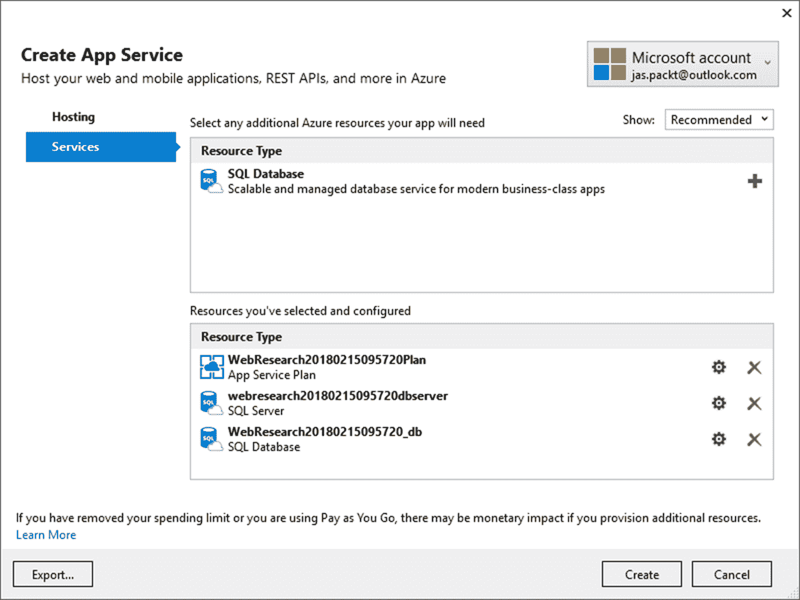

10.  我们现在可以返回到主机选项卡，它将向您显示当您点击创建按钮时会发生什么的概述。

11.  如下图所示，将创建以下三个 Azure 资源:
    1.  应用服务
    2.  应用服务计划
    3.  数据库

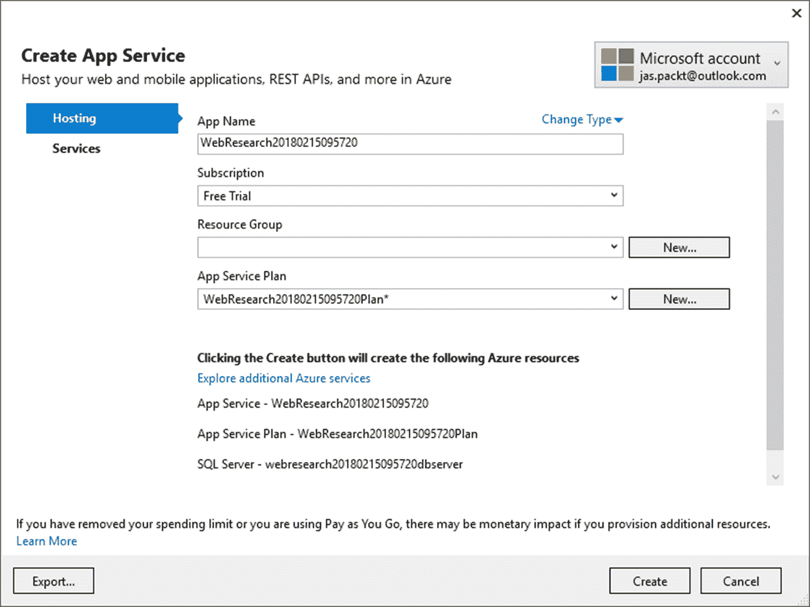

12.  创建后，我们可以通过点击发布按钮发布到我们的新 Azure 配置文件。
13.  您将在输出窗口中看到一些构建消息，最后应该会出现以下内容:

```cs
   Publish Succeeded.
   Web App was published successfully 
   http://webresearch20180215095720.azurewebsites.net/
   ========== Build: 1 succeeded, 0 failed, 0 up-to-date, 0 skipped 
   ==========
   ========== Publish: 1 succeeded, 0 failed, 0 skipped ==========

```

14.  您可以在 Azure Portal([portal.azure.com](http://portal.azure.com))上查看您的仪表板，它将向您显示由于我们的服务创建而在您的帐户上启用的资源:


15.  发布的应用将在您的浏览器中打开，您很可能会看到一条错误消息。默认情况下，您不会看到关于错误的太多细节，但至少 Azure 通过将`ASPNETCORE_ENVIRONMENT`环境变量设置为`Development`并重新启动应用，为您提供了一些获取错误细节的指针:


16.  当您登录到您的 Azure 门户时，您可以导航到您的应用服务，然后在应用设置中，添加值为`Development`的 ASPNETCORE_ENVIRONMENT 设置，并重新启动您的应用:


17.  现在，我们可以刷新站点了，我们应该会看到更多关于潜在错误的细节:

>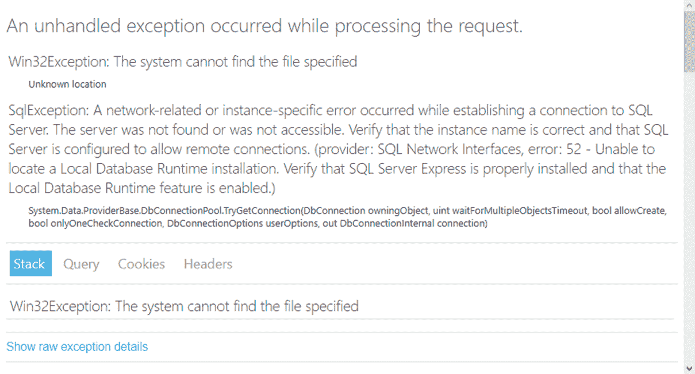

18.  啊，是的！我们仍然指向我们的本地数据库，我们无法从发布环境访问它。让我们更新我们的`appsettings.json`来指向我们的 Azure db。
19.  从 Azure 仪表板导航到 SQL Server，然后导航到属性。在右侧窗格中，您应该会看到一个显示数据库连接字符串的选项:

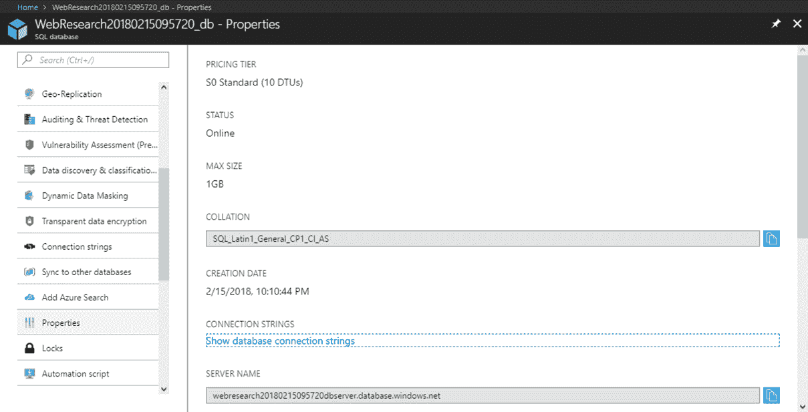

20.  复制 ADO.NET 连接字符串，返回到您的代码，并更新`appsettings.json`文件中的连接字符串条目。
21.  重新发布应用，你应该可以走了。

# 自定义目标

下一个发布选项通常称为自定义目标。

这个选项基本上包括任何不是 Azure 或本地文件系统的东西。点击确定按钮后，您可以选择发布方法:

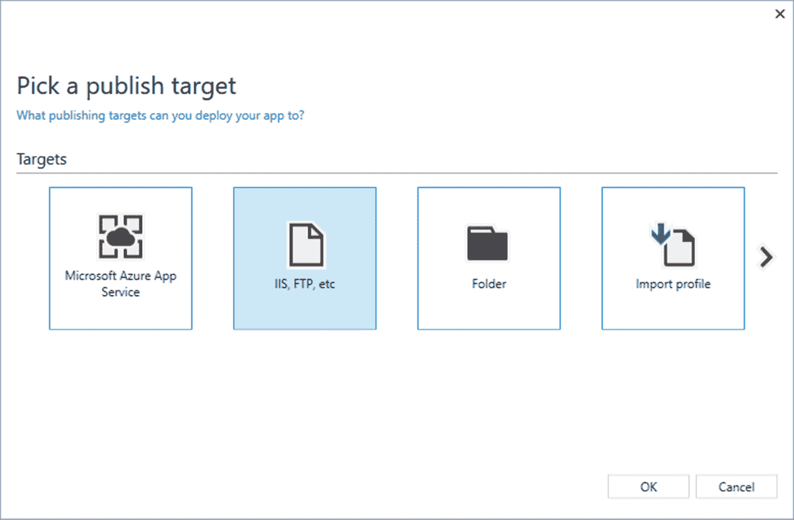

有四种发布方法或自定义目标，每种方法都有自己的要求:

1.  文件传送协议
2.  网络部署
3.  网络部署包
4.  文件系统

我们还有一个设置选项卡，适用于所有四种方法。让我们快速了解一下我们有哪些选择:


配置选项可以设置为调试或发布。

使用调试，您生成的文件是可调试的，这意味着有可能达到指定的断点。但这也意味着性能下降。

使用 Release，您将无法动态调试，但是随着应用的完全优化，性能会有所提高。

在我们的例子中，唯一可用的目标框架是 **netcoreapp2.0** ，但是在标准中.NET 应用，这是您可以设置目标的地方.NET 3.5 或更高版本.NET 4.5 或任何可用的版本。

然后还可以指定**目标运行时**，选择让 Visual Studio 清理目标文件夹，并指定专门用于运行时的连接字符串。

如前所述，这些设置适用于所有四种发布方法，我们现在来看一下。

# 文件传送协议

FTP 发布方法使您能够发布到托管的 FTP 位置。对于此选项，您需要提供以下信息:

*   URL 服务器
*   站点路径
*   用户名
*   密码
*   目标网址

它还允许您根据输入的详细信息验证连接:


# 网络部署

看一下网络部署和文件传输协议的形式，你会有理由相信它们是一回事。两者的结果基本相同，都是直接发布到托管站点，但是使用 Web Deploy，您可以获得很多额外的好处，包括:

*   Web Deploy 将源与目标进行比较，并且只同步所需的更改，与 FTP 相比，发布时间大大减少
*   尽管 FTP 也有它的安全表兄弟 SFTP 和 FTPS，Web Deploy 总是支持安全传输
*   适当的数据库支持，使您能够在同步过程中应用 SQL 脚本

发布屏幕如下所示:

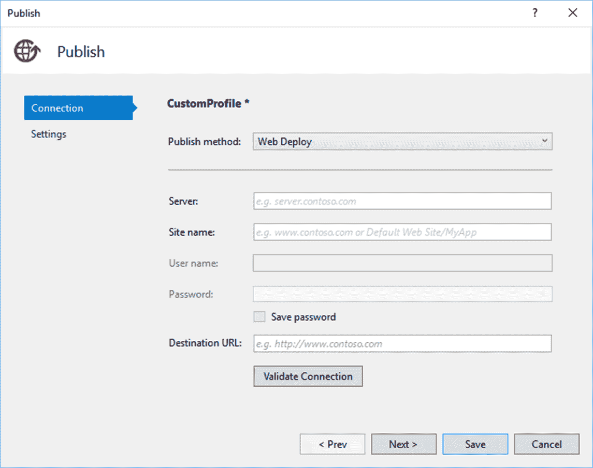

# 网络部署包

“网络部署包”选项用于创建一个部署包，您可以使用该部署包在以后选择的任何位置安装应用。参考以下截图:

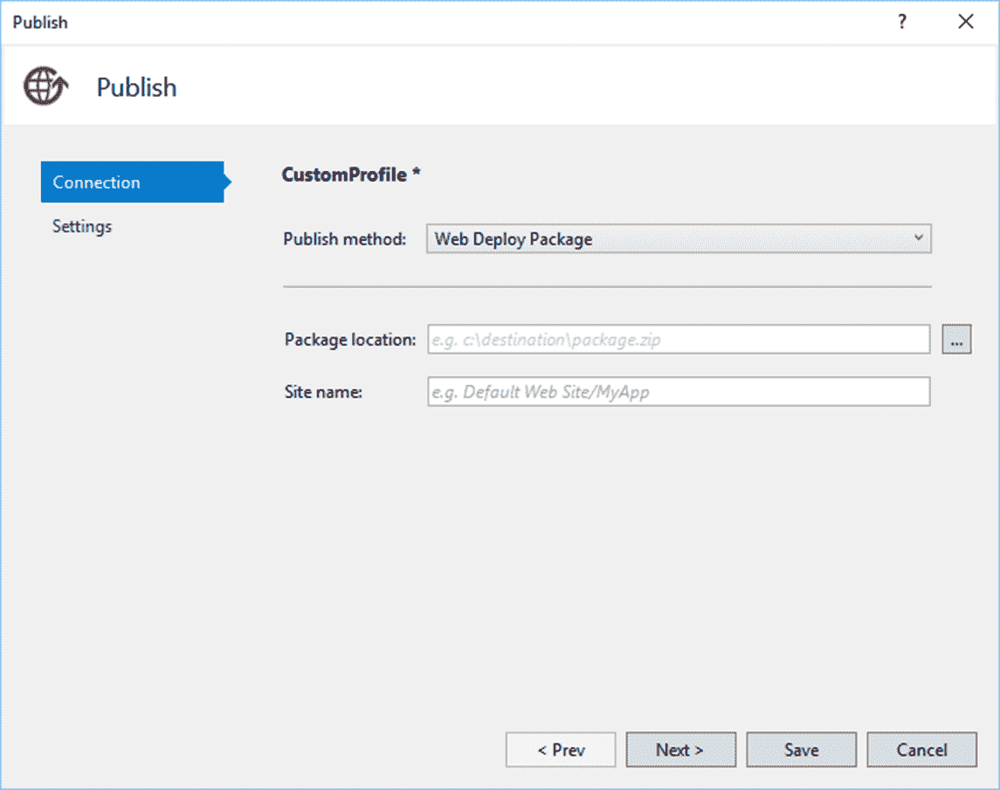

# 文件系统

世界各地的老派开发人员都在使用这个选项，主要是因为我们仍然不太信任一些可用的工具，这个选项允许您发布到您选择的文件夹位置，然后手动将其复制到发布环境:


# 文件夹

为了向您展示开发人员仍然能够控制发布的代码是多么受欢迎，我们有两条路径，最后发布到一个文件夹位置。

再次，只需指定文件夹位置，然后点击确定:


# 导入配置文件

Import Profile 方法不是一种实际的发布方法，而是一个简单的选项，用于从备份中导入以前保存的配置文件，或者可能用于在一组开发人员之间共享发布配置文件:


# 摘要

在这一章中，我们在实体框架核心社区进行了一次小小的导游。在参观学区讨论代码优先、模型优先和数据库优先实现方法之间的一些差异之前，我们从博物馆开始了解实体框架的历史。TechNet 甚至进行了快速访问，他提供了一些关于设计数据库的想法。

之后，我们花了一些时间构建自己的 EF Core 解决方案，并研究了部署应用的各种方法。我们还查看了用一些测试数据填充我们的新建筑，看看一旦向公众开放，它将如何保持。

此行最后访问了分发区，以获得可用部署选项的概述。

这次访问时间太短，无法涵盖实体框架核心世界中所有可用和可能的内容，因为它是一个框架，有一个庞大的社区在不断改进和扩展其已经广泛的功能。

很高兴知道开发社区不满足于任何平庸，并不断努力改进和扩展功能，比如实体框架，它可能看起来已经相当成熟和广泛了。