# 七、无服务器电子邮件验证 Azure 函数

这一章将带我们进入无服务器计算领域。我听到你问，什么是无服务器计算？嗯，一旦你理解了术语*无服务器计算*与缺少服务器无关，答案就真的很简单了。事实上，恰恰相反。

在本章中，我们将看一看:

*   创建 Azure 函数
*   在浏览器中测试您的 Azure 函数
*   从 ASP.NETCore MVC 应用调用 Azure 函数

我们将创建一个简单的 Azure 函数，使用正则表达式来验证电子邮件地址。您需要记住，Azure 函数是云中的一小部分代码。不要认为它们是复杂代码的大部分。越小越好。

# 从无服务器计算开始

传统上，公司花费时间和金钱来管理服务器的计算资源。这些是公司的固定和经常性成本。不管服务器是空闲的还是正在执行某种形式的计算任务。底线是仅仅在那里就要花钱。

使用无服务器计算，计算资源是可扩展的云服务。这意味着它是一个事件驱动的应用设计。基本上，使用无服务器计算，你只需为你使用的东西付费。Azure 函数也是如此。

**Azure 函数**是驻留在云中的小代码。您的应用只需根据需要使用这些功能，并且您只需为使用的计算能力付费。如果有 100 万或 100 万人访问您的应用，这并不重要。Azure 函数将自动扩展以处理额外的负载。当应用的使用率下降时，Azure 函数会缩小。

# 无服务器计算的重要性

假设您在应用使用中看到频繁(但不是持续)的峰值。因为处理来自您的应用的请求的服务器不是无服务器的，所以它需要升级(作为您或您的公司的成本)以能够处理额外的负载。在使用率低的时候，服务器没有更少的资源。您对其进行了升级，以便能够处理特定的用户负载。它将始终以这种性能水平运行，正如您所知，性能是有代价的。

使用无服务器计算，资源会随着需求的增加和减少而自动增减。这是一种更有效的使用服务器的方式，因为您不用为未充分利用的计算能力付费。

# 天青函数的特性

Azure 函数为开发人员提供了丰富的功能集。请参考微软文档，了解更多关于 Azure 函数的信息—[https://docs.microsoft.com/en-us/azure/azure-functions/](https://docs.microsoft.com/en-us/azure/azure-functions/)。现在，我们将看一看其中的一些特性。

# 语言选择

Azure 函数的伟大之处在于，您可以用自己选择的语言创建它们。有关支持的语言列表，请浏览以下网址:
[https://docs . Microsoft . com/en-us/azure/azure-functions/supported-language](https://docs.microsoft.com/en-us/azure/azure-functions/supported-languages)。

在这一章中，我们将使用 C# 编写 Azure 函数。

# 按使用付费定价

如前所述，您将只为运行 Azure 函数所花费的实际时间付费。消费计划每秒计费一次。微软有一份关于 Azure 函数定价的优秀文档，网址如下:

[https://azure . Microsoft . com/en-us/pricing/details/functions/](https://azure.microsoft.com/en-us/pricing/details/functions/)。

# 灵活发展

您可以直接在 Azure 门户中创建您的 Azure 函数。您还可以设置与 Visual Studio 团队服务和 GitHub 的持续集成。

# 我可以创建哪些类型的 Azure 函数？

您可以使用 Azure Functions 作为解决方案，与您的应用集成，处理数据，使用物联网、应用编程接口和微服务。Azure 函数在触发器上也能很好地工作，因此您甚至可以安排任务。以下是您可以使用的一些 Azure 函数模板:

*   `HTTPTrigger`
*   `TimerTrigger`
*   `GitHub webhook`
*   `Generic webhook`
*   `BlobTrigger`
*   `CosmosDBTrigger`
*   `QueueTrigger`
*   `EventHubTrigger`
*   `ServiceBusQueueTrigger`
*   `ServiceBusTopicTrigger`

要了解更多关于这些模板和 Azure 函数的信息，请浏览微软文档*Azure 函数简介*，网址如下:

[https://docs . Microsoft . com/en-us/azure/azure-functions/functions-overview](https://docs.microsoft.com/en-us/azure/azure-functions/functions-overview)。

# 创建 Azure 函数

不再拖延，让我们创建我们自己的 Azure 函数。我们将要创建的函数将使用正则表达式来验证电子邮件地址。这是一个非常标准的开发任务。这也是一项将在许多应用中广泛使用的功能:

You will need to have an Azure account. If you do not have one, you can set up a free trial account at—[https://azure.microsoft.com/en-us/free/](https://azure.microsoft.com/en-us/free/).

1.  将您的浏览器指向—[https://portal.azure.com](https://portal.azure.com)，然后登录您的 Azure 门户网站。
2.  登录后，查找“创建资源”链接。单击链接，然后在 Azure 市场部分下查找计算链接。参考以下截图:


3.  在特色部分下面一点，你会看到功能应用作为一个选项。点击该链接:


4.  现在，您将看到功能应用设置屏幕。需要输入以下选项:
    *   应用名称:这是您的 Azure 函数的全局唯一名称。
    *   订阅:这是将在其中创建您的功能的订阅。
    *   资源组:为您的功能创建一个新的资源组。
    *   操作系统:你可以选择 Windows 或 Linux。我选择了 Windows。
    *   托管计划:这将定义资源如何分配给你的职能。
    *   地点:选择一个地理上离你最近的地点是个好主意。
    *   存储:保持默认设置。

5.  您还可以选择将“应用洞察”切换到“开”或“关”。您也可以选择“锁定到仪表板”选项。

We have called our Azure Function core-mail-validation.

6.  添加所有必需的设置后，单击创建按钮。


7.  After you click on the Create button, you will see a Validating... message. This could take several seconds:

    

8.  Keep your eye on the notifications section (the little bell icon) in the top right hand corner of the Azure portal. New notifications are displayed there and are indicated by a number representing the number of unread notifications:

    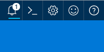

9.  If you click on the notifications, you will see that Azure is in the progress of deploying the Azure Function you created:

    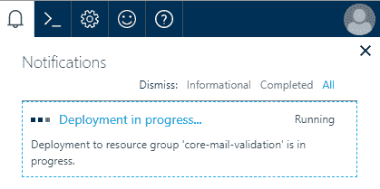

10.  部署您的 Azure 函数时，您将在“通知”部分看到“部署成功”消息。从那里，您可以单击“锁定到”仪表板上的“转到资源”按钮。

Pinning your function to the dashboard just makes it easier for you to access it again later on. It's a good idea to pin frequently used services to your dashboard.

11.  要访问您的 Azure 函数，请单击转到资源按钮:

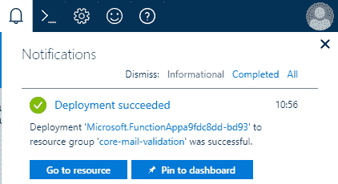

12.  然后，您将被带到 Azure 门户的功能应用部分。您将看到核心邮件验证功能列在“功能应用”部分下:


13.  在核心-电子邮件-验证下，单击功能选项。然后，单击右侧面板中的新建功能选项:


14.  现在，您将看到一系列可以帮助您入门的模板。向下滚动查看所有可用的模板(不仅仅是下面截图中显示的四个模板):

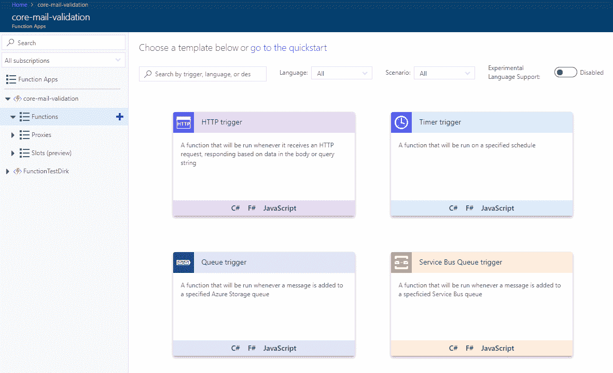

15.  我们不会检查所有可用的模板。我们将保持简单，只需选择转到快速启动选项，如下图所示:


16.  出于我们的目的，我们将简单地选择 Webhook + API，并选择 C# 作为我们的语言。还有其他语言可供选择，因此请选择您最熟悉的语言。

17.  要创建功能，请单击创建此功能按钮:


18.  Azure 函数被创建，一些样板代码被自动添加给你，这样你就可以感受到代码在函数中的样子。这些代码所做的只是在查询字符串中寻找一个名为`name`的变量，并在浏览器中显示，如果找到的话:

```cs
      using System.Net; 
      public static async Task<HttpResponseMessage> 
       Run(HttpRequestMessage req, TraceWriter log) 
      { 
        log.Info("C# HTTP trigger function processed a request."); 

        // parse query parameter 
        string name = req.GetQueryNameValuePairs() 
        .FirstOrDefault(q => string.Compare(q.Key, "name", true) == 0) 
        .Value; 

        if (name == null) 
        { 
          // Get request body 
          dynamic data = await req.Content.ReadAsAsync<object>(); 
          name = data?.name; 
        } 

        return name == null 
        ? req.CreateResponse(HttpStatusCode.BadRequest,
        "Please pass a name on the query string or in the request body") 
          : req.CreateResponse(HttpStatusCode.OK, "Hello " + name); 
      }  
```

19.  看看屏幕的右上角。你会看到一个>获取功能网址链接。点击以下链接:

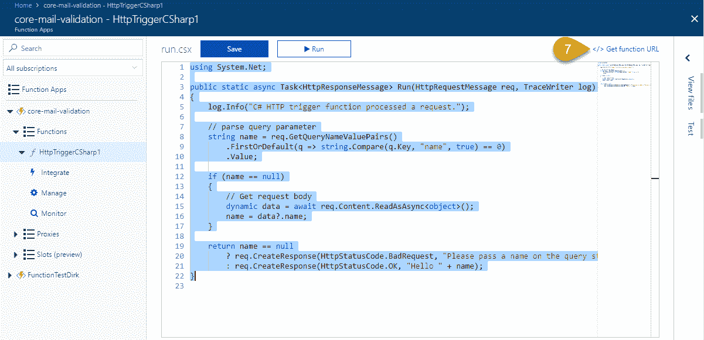

20.  这将显示一个弹出屏幕，其中包含访问您刚刚创建的 Azure 函数的网址。单击复制按钮将网址复制到剪贴板:

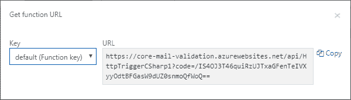

21.  您复制的网址如下所示:

```cs
https://core-mail-validation.azurewebsites.net/api/HttpTriggerCSharp1?code=/IS4OJ3T46quiRzUJTxaGFenTeIVXyyOdtBFGasW9dUZ0snmoQfWoQ== 
```

22.  为了运行我们的函数，我们需要在 URL 的查询字符串中添加一个`name`参数。继续添加`&name==[YOUR_NAME]`，其中`[YOUR_NAME]`是你自己的名字。就我而言，我在我的网址末尾添加了`&name=Dirk`:

```cs
https://core-mail-validation.azurewebsites.net/api/HttpTriggerCSharp1?code=/IS4OJ3T46quiRzUJTxaGFenTeIVXyyOdtBFGasW9dUZ0snmoQfWoQ==&name=Dirk
```

23.  将此网址粘贴到浏览器地址栏，然后点击返回按钮。浏览器中会显示一条消息(在我的情况下是“你好，德克”:

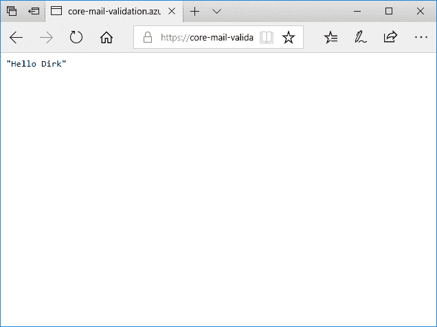

Note that in Chrome and Firefox, you might see the message This XML file does not appear to have any style information associated with it. To see the output, use Microsoft Edge.

24.  回到 Azure 门户，您将在 Azure 函数屏幕的底部看到日志窗口。如果没有显示，请单击λ箭头展开面板。在这里，您将看到 Azure 触发器已成功运行:


恭喜，您刚刚运行了新的 Azure 函数。

# 修改 Azure 函数代码

虽然这一切都很令人兴奋(应该是，这确实是很酷的技术)，但我们需要对 Azure Function 进行一些更改，以满足我们的要求:

1.  在您的 Azure 函数中识别`return`语句。它将如下所示:

```cs
      return name == null 
        ? req.CreateResponse(HttpStatusCode.BadRequest,
         "Please pass a name on the query string or in the request 
          body") 
        : req.CreateResponse(HttpStatusCode.OK, "Hello " + name); 
```

让我们稍微简化一下代码，如果电子邮件地址不是空的，就返回`true`。将`return`语句替换为以下代码:

```cs
      if (email == null) 
      { 
        return req.CreateResponse(HttpStatusCode.BadRequest,
         "Please pass an email address on the query string or
          in the request body"); 
      } 
      else 
      { 
        bool blnValidEmail = false; 
        if (email.Length > 0) 
        { 
            blnValidEmail = true; 
        } 

        return req.CreateResponse(HttpStatusCode.OK,
         "Email status: " + blnValidEmail); 
      } 
```

2.  您的 Azure 函数中的代码现在应该如下所示:

```cs
      using System.Net; 

      public static async Task<HttpResponseMessage>
       Run(HttpRequestMessage req, TraceWriter log) 
      { 
        log.Info("C# HTTP trigger function processed a new email 
         validation request."); 

        // parse query parameter 
        string email = req.GetQueryNameValuePairs() 
          .FirstOrDefault(q => string.Compare(q.Key, "email", true) == 
          0) 
          .Value; 

        if (email == null) 
        { 
          // Get request body 
          dynamic data = await req.Content.ReadAsAsync<object>(); 
          email = data?.email; 
        } 

        if (email == null) 
        { 
          return req.CreateResponse(HttpStatusCode.BadRequest,
           "Please pass an email address on the query string or
            in the request body"); 
        } 
        else 
        { 
          bool blnValidEmail = false; 
          if (email.Length > 0) 
          { 
            blnValidEmail = true; 
          } 

          return req.CreateResponse(HttpStatusCode.OK,
           "Email status: " + blnValidEmail); 
        }    

      }
```

3.  请务必单击“保存”按钮保存对 Azure 函数的更改。然后，您将看到函数被编译，并且在日志窗口中显示编译成功的消息:

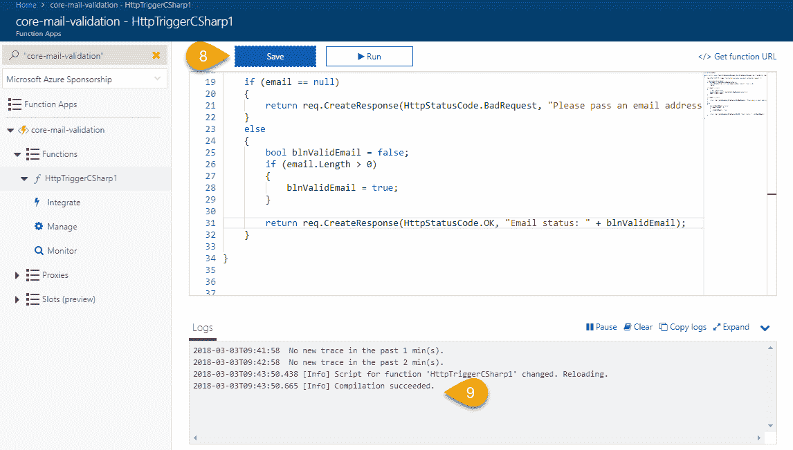

4.  如前所述，点击>获取功能网址链接复制网址:

```cs
https://core-mail-validation.azurewebsites.net/api/HttpTriggerCSharp1?code=/IS4OJ3T46quiRzUJTxaGFenTeIVXyyOdtBFGasW9dUZ0snmoQfWoQ==
```

不过这一次，我们想把它作为电子邮件地址传递。您可以看到参数名称已更改为`email`，该值可以是您选择输入的任何电子邮件地址。因此，我将`&email=dirk@email.com`附加到了网址的末尾:

```cs
https://core-mail-validation.azurewebsites.net/api/HttpTriggerCSharp1?code=/IS4OJ3T46quiRzUJTxaGFenTeIVXyyOdtBFGasW9dUZ0snmoQfWoQ==&email=dirk@email.com
```

5.  将网址粘贴到浏览器中，点击返回按钮，查看浏览器中显示的结果:

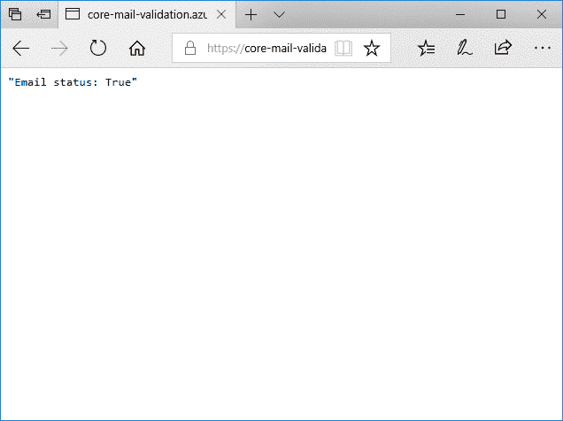

6.  我们现在确信 Azure 函数正在对我们的电子邮件地址进行初步验证(即使它只是检查它是否存在)。然而，我们需要这个函数做更多的事情。为了验证电子邮件地址，我们将使用正则表达式。为此，向 Azure 函数添加以下命名空间:

```cs
      using System.Text.RegularExpressions; 
```

在进行验证的代码部分，输入代码以将电子邮件与 regex 模式匹配。

There are a million different regular expression patterns on the internet. Regular expressions are a whole different topic altogether and beyond the scope of this book. If matching a pattern of text is required by your application, Google to see if there isn't a regex pattern available for it. If you are really brave, you can write your own.

7.  正则表达式已经被烘焙到.NET 框架，代码非常简单:

```cs
blnValidEmail = Regex.IsMatch(email, 
                @"^(?("")("".+?(?<!\)""@)|(([0-9a-z]((.(?!.))|[-!#$%&'*+/=?^`{}|~w])*)(?<=[0-9a-z])@))" + 
                @"(?([)([(d{1,3}.){3}d{1,3}])|(([0-9a-z][-0-9a-z]*[0-9a-z]*.)+[a-z0-9][-a-z0-9]{0,22}[a-z0-9]))$", 
                RegexOptions.IgnoreCase, TimeSpan.FromMilliseconds(250)); 
```

8.  添加完所有代码后，您的 Azure 函数将如下所示:

```cs
      using System.Net; 
      using System.Text.RegularExpressions; 

      public static async Task<HttpResponseMessage>
       Run(HttpRequestMessage req, TraceWriter log) 
      { 
        log.Info("C# HTTP trigger function processed a new email 
         validation request."); 

        // parse query parameter 
        string email = req.GetQueryNameValuePairs() 
          .FirstOrDefault(q => string.Compare(q.Key, "email", true) == 
           0) 
          .Value; 

        if (email == null) 
        { 
          // Get request body 
          dynamic data = await req.Content.ReadAsAsync<object>(); 
          email = data?.email; 
        } 

        if (email == null) 
        { 
          return req.CreateResponse(HttpStatusCode.BadRequest,
          "Please pass an email address on the query string or in
           the request body"); 
        } 
        else 
        { 
          bool blnValidEmail = false; 

          blnValidEmail = Regex.IsMatch(email, 
                @"^(?("")("".+?(?<!\)""@)|(([0-9a-z]((.(?!.))|
                [-!#$%&'*+/=?^`{}|~w])*)(?<=[0-9a-z])@))" + 
                @"(?([)([(d{1,3}.){3}d{1,3}])|(([0-9a-z][-0-9a-z]*
                [0-9a-z]*.)+[a-z0-9][-a-z0-9]{0,22}[a-z0-9]))$", 
                RegexOptions.IgnoreCase, 
                TimeSpan.FromMilliseconds(250)); 

          return req.CreateResponse(HttpStatusCode.OK,
          "Email status: " + blnValidEmail); 
        }    

      } 
```

9.  使用之前复制的网址，粘贴到浏览器窗口，点击*返回*或*输入*键:

```cs
https://core-mail-validation.azurewebsites.net/api/HttpTriggerCSharp1?code=/IS4OJ3T46quiRzUJTxaGFenTeIVXyyOdtBFGasW9dUZ0snmoQfWoQ==&email=dirk@email.com
```

10.  电子邮件地址`dirk@email.com`被验证，浏览器中显示消息“电子邮件状态:真”。这里发生的是，电子邮件地址被传递给了 Azure 函数。然后，该函数从查询字符串中读取`email`参数的值，并将其传递给正则表达式。

电子邮件地址与正则表达式模式相匹配，如果找到匹配，则该电子邮件地址被视为有效的电子邮件:


11.  让我们在浏览器中输入相同的网址，只是这次输入一个你知道会无效的电子邮件地址。例如，一个电子邮件地址只能包含一个`@`符号。然后我添加到网址的参数如下:

```cs
https://core-mail-validation.azurewebsites.net/api/HttpTriggerCSharp1?code=/IS4OJ3T46quiRzUJTxaGFenTeIVXyyOdtBFGasW9dUZ0snmoQfWoQ==&email=dirk@@email.com
```

然后可以看到，当我们点击*返回*或*输入*键时，无效的电子邮件地址`dirk@@email.com`被验证，发现与正则表达式不匹配。因此，文本“电子邮件状态:假”显示在浏览器中:

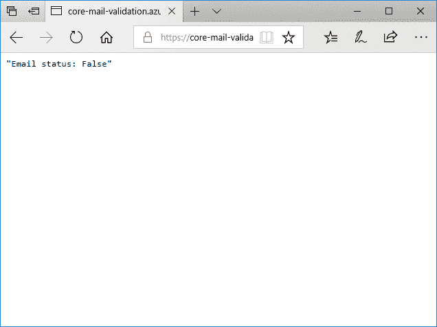

这太棒了！我们已经看到，我们创建的 Azure 函数使用我们添加的正则表达式来验证它收到的电子邮件地址。根据 regex 验证的结果，该函数返回 true 或 false。

最后，在我们继续之前，我们希望 Azure 函数向调用应用返回一个单独的`True`或`False`值。修改`return`对你的功能的陈述，做到这一点:

```cs
  return req.CreateResponse(HttpStatusCode.OK, blnValidEmail); 
```

我们已经看到了这个函数是如何工作的，通过一步一步地修改代码并直接从浏览器窗口运行它。然而，除非我们可以从应用中调用这个 Azure 函数，否则这对我们没有任何好处。

让我们看看如何创建一个 ASP.NETCore MVC 应用，它调用我们的 Azure 函数来验证登录屏幕上输入的电子邮件地址。

# 从 ASP.NETCore MVC 应用调用 Azure 函数

在前一节中，我们已经了解了我们的 Azure 函数是如何工作的。现在，我们想要创建一个 ASP.NETCore MVC 应用，它将调用我们的 Azure 函数来验证输入到应用登录屏幕中的电子邮件地址:

This application does no authentication at all. All it is doing is validating the email address entered. ASP.NET Core MVC authentication is a totally different topic and not the focus of this chapter.

1.  在 Visual Studio 2017 中，创建一个新项目，并从项目模板中选择 ASP.NETCore 网络应用。单击“确定”按钮创建项目。这显示在下面的截图中:


2.  在下一个屏幕上，确保.NET Core 和 ASP.NET Core 2.0 是从表单的下拉选项中选择的。选择网络应用(模型-视图-控制器)作为要创建的应用类型。

不要为任何类型的身份验证或启用 Docker 支持而烦恼。只需点击确定按钮来创建您的项目:

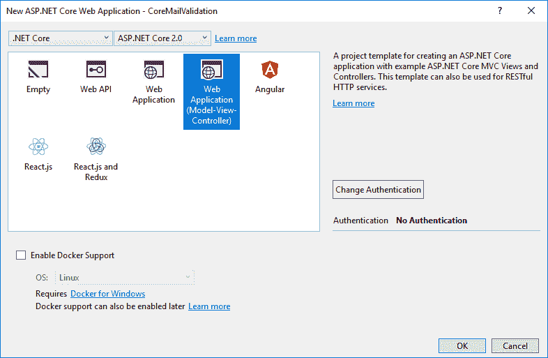

3.  创建项目后，您将在 Visual Studio 的解决方案资源管理器中看到熟悉的项目结构:


# 创建登录表单

对于下一部分，我们可以创建一个简单明了的登录表单。为了一点点乐趣，让我们把事情变得有趣一点。在网上找一些免费的登录表单模板:

1.  我决定使用一个名为 **colorlib** 的网站，该网站在他们最近的一篇博客文章中提供了 50 个免费的 HTML5 和 CSS3 登录表单。文章的网址是:[https://colorlib.com/wp/html5-and-css3-login-forms/](https://colorlib.com/wp/html5-and-css3-login-forms/)。

2.  我决定从他们的网站使用 Colorlib 的**登录表单 1。将模板下载到您的计算机上，并提取 ZIP 文件。在提取的 ZIP 文件中，您会看到我们有几个文件夹。复制这个提取的 ZIP 文件中的所有文件夹(保留`index.html`文件，因为我们将在一分钟后使用它):**


3.  接下来，转到您的 Visual Studio 应用的解决方案。在`wwwroot`文件夹中，移动或删除内容，并将提取的 ZIP 文件中的文件夹粘贴到您的 ASP.NETCore MVC 应用的`wwwroot`文件夹中。您的`wwwroot`文件夹现在应该如下所示:

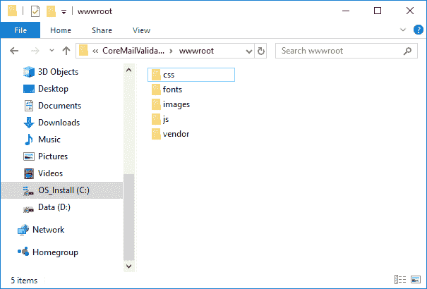

4.  回到 Visual Studio 中，当您在 CoreMailValidation 项目中展开 wwwroot 节点时，您将看到文件夹。
5.  我也想把大家的注意力集中到`Index.cshtml`和`_Layout.cshtml`档。接下来我们将修改这些文件:

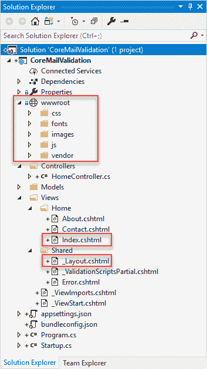

6.  打开`Index.cshtml`文件，从该文件中删除所有标记(除了花括号中的部分)。从我们之前提取的 ZIP 文件中粘贴`index.html`文件中的 HTML 标记。

Do not copy the all the markup from the `index.html` file. Only copy the markup inside the `<body></body>` tags.

7.  您的`Index.cshtml`文件现在应该如下所示:

```cs
@{ 
    ViewData["Title"] = "Login Page";     
} 

<div class="limiter"> 
    <div class="container-login100"> 
        <div class="wrap-login100"> 
            <div class="login100-pic js-tilt" data-tilt> 
                 
            </div> 

            <form class="login100-form validate-form"> 
                <span class="login100-form-title"> 
                    Member Login 
                </span> 

                <div class="wrap-input100 validate-input" 
                 data-validate="Valid email is required: 
                  ex@abc.xyz"> 
                    <input class="input100" type="text" 
                     name="email" placeholder="Email"> 
                    <span class="focus-input100"></span> 
                    <span class="symbol-input100"> 
                        <i class="fa fa-envelope"
                         aria-hidden="true"></i> 
                    </span> 
                </div> 

                <div class="wrap-input100 validate-input" 
                 data-validate="Password is required"> 
                    <input class="input100" type="password" 
                     name="pass" 
                     placeholder="Password"> 
                    <span class="focus-input100"></span> 
                    <span class="symbol-input100"> 
                        <i class="fa fa-lock"
                         aria-hidden="true"></i> 
                    </span> 
                </div> 

                <div class="container-login100-form-btn"> 
                    <button class="login100-form-btn"> 
                        Login 
                    </button> 
                </div> 

                <div class="text-center p-t-12"> 
                    <span class="txt1"> 
                        Forgot 
                    </span> 
                    <a class="txt2" href="#"> 
                        Username / Password? 
                    </a> 
                </div> 

                <div class="text-center p-t-136"> 
                    <a class="txt2" href="#"> 
                        Create your Account 
                        <i class="fa fa-long-arrow-right m-l-5" 
                         aria-hidden="true"></i> 
                    </a> 
                </div> 
            </form> 
        </div> 
    </div> 
</div> 
```

The code for this chapter is available on GitHub at the following link:
[https://github.com/PacktPublishing/CSharp7-and-.NET-Core-2.0-Blueprints/tree/master/Serverless](https://github.com/PacktPublishing/CSharp7-and-.NET-Core-2.0-Blueprints/tree/master/Serverless).

8.  接下来，打开`Layout.cshtml`文件，添加所有链接到我们之前复制到`wwwroot`文件夹的文件夹和文件。使用`index.html`文件作为参考。您会注意到`_Layout.cshtml`文件包含以下代码— `@RenderBody()`。这是一个占位符，指定了`Index.cshtml`文件内容应该注入的位置。如果你来自 ASP.NET 网页表单，把`_Layout.cshtml`页面想象成一个母版页。您的`Layout.cshtml`标记应该如下所示:

```cs
<!DOCTYPE html>
<html>

<head>
    <meta charset="utf-8" />
    <meta name="viewport" content="width=device-width, initial-scale=1.0" />
    <title>@ViewData["Title"] - CoreMailValidation</title>
    <link rel="icon" type="image/png" href=img/icons/favicon.ico" />
    <link rel="stylesheet" type="text/css" href="~/vendor/bootstrap/css/bootstrap.min.css">
    <link rel="stylesheet" type="text/css" href="~/fonts/font-awesome-4.7.0/css/font-awesome.min.css">
    <link rel="stylesheet" type="text/css" href="~/vendor/animate/animate.css">
    <link rel="stylesheet" type="text/css" href="~/vendor/css-hamburgers/hamburgers.min.css">
    <link rel="stylesheet" type="text/css" href="~/vendor/select2/select2.min.css">
    <link rel="stylesheet" type="text/css" href="~/css/util.css">
    <link rel="stylesheet" type="text/css" href="~/css/main.css">
</head>

<body>
    <div class="container body-content">
        @RenderBody()
        <hr />
        <footer>
            <p>&copy; 2018 - CoreMailValidation</p>
        </footer>
    </div>
    <script src="~/vendor/jquery/jquery-3.2.1.min.js"></script>
    <script src="~/vendor/bootstrap/js/popper.js"></script>
    <script src="~/vendor/bootstrap/js/bootstrap.min.js"></script>
    <script src="~/vendor/select2/select2.min.js"></script>
    <script src="~/vendor/tilt/tilt.jquery.min.js"></script>
    <script>
        $('.js-tilt').tilt({
            scale: 1.1
        })
    </script>
    <script src="~/js/main.js"></script>
    @RenderSection("Scripts", required: false)
</body>

</html>
```

9.  如果一切顺利，当您运行 ASP.NETCore MVC 应用时，您将看到下面的页面。登录表单显然完全不起作用:

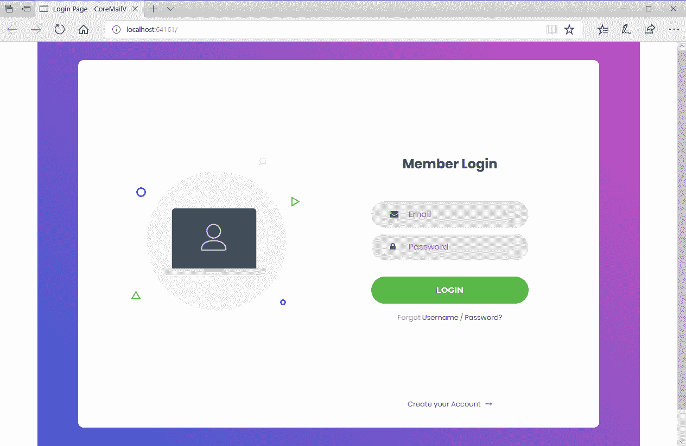

然而，登录表单是完全响应的。如果您不得不缩小浏览器窗口的大小，您会看到随着浏览器大小的减小，表单的比例也随之减小。这就是你想要的。如果您想探索 Bootstrap 提供的响应性设计，请前往[https://getbootstrap.com/](https://getbootstrap.com/)并浏览文档中的示例:


我们要做的下一件事是将这个登录表单与我们的控制器挂钩，并调用我们创建的 Azure 函数来验证我们输入的电子邮件地址。

接下来让我们看看怎么做。

# 把一切都联系起来

为了简化事情，我们将创建一个模型传递给我们的控制器:

1.  在应用的`Models`文件夹中创建一个名为`LoginModel`的新类，并点击添加按钮:

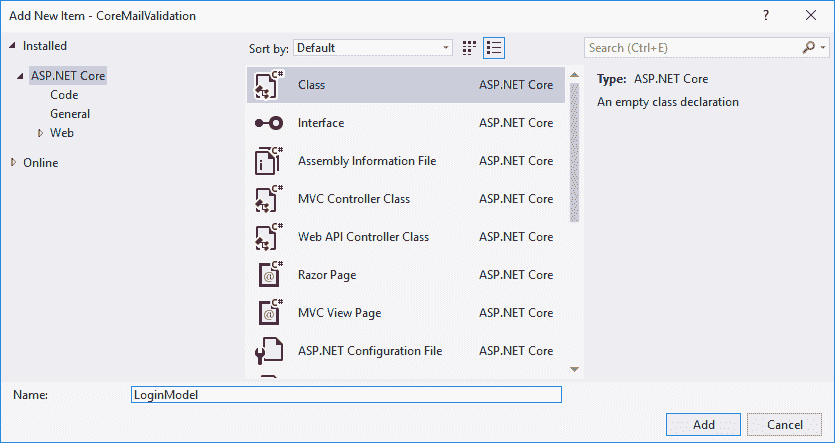

2.  您的项目现在应该如下所示。您将看到`Models`文件夹中添加了`model`:


3.  接下来我们要做的是给我们的`model`添加一些代码来表示我们登录表单上的字段。添加两个名为`Email`和`Password`的属性:

```cs
      namespace CoreMailValidation.Models 
      { 
        public class LoginModel 
        { 
          public string Email { get; set; } 
          public string Password { get; set; } 
        } 
      }
```

4.  回到`Index.cshtml`视图，将`model`声明添加到页面顶部。这使得`model`在我们看来可以使用。注意指定`model`所在的正确名称空间:

```cs
      @model CoreMailValidation.Models.LoginModel 
      @{ 
        ViewData["Title"] = "Login Page"; 
      } 
```

5.  下一部分代码需要写入`HomeController.cs`文件。目前，它应该只有一个名为`Index()`的动作:

```cs
      public IActionResult Index() 
      { 
        return View(); 
      } 
```

6.  添加一个名为`ValidateEmail`的新`async`函数，它将使用我们之前复制的 Azure 函数网址的基本网址和参数字符串，并使用 HTTP 请求调用它。我不会在这里详细讨论，因为我认为代码非常简单。我们所做的就是使用我们之前复制的 URL 调用 Azure 函数，并读取返回数据:

```cs
      private async Task<string> ValidateEmail(string emailToValidate) 
      { 
        string azureBaseUrl = "https://core-mail-
         validation.azurewebsites.net/api/HttpTriggerCSharp1"; 
        string urlQueryStringParams = $"?
         code=/IS4OJ3T46quiRzUJTxaGFenTeIVXyyOdtBFGasW9dUZ0snmoQfWoQ
          ==&email={emailToValidate}"; 

        using (HttpClient client = new HttpClient()) 
        { 
          using (HttpResponseMessage res = await client.GetAsync(
           $"{azureBaseUrl}{urlQueryStringParams}")) 
          { 
            using (HttpContent content = res.Content) 
            { 
              string data = await content.ReadAsStringAsync(); 
              if (data != null) 
              { 
                return data; 
              } 
              else 
                return ""; 
            } 
          } 
        } 
      }  
```

7.  创建另一个名为`ValidateLogin`的`public async`动作。在动作内部，检查`ModelState`是否有效，然后继续。

For a nice explanation of what `ModelState` is, have a look at the following article—[https://www.exceptionnotfound.net/asp-net-mvc-demystified-modelstate/](https://www.exceptionnotfound.net/asp-net-mvc-demystified-modelstate/).

8.  然后我们在`ValidateEmail`函数上做一个`await`，如果返回的数据包含`false`这个词，我们就知道邮件验证失败了。然后，故障信息被传递给控制器上的`TempData`属性。

The `TempData` property is a place to store data until it is read. It is exposed on the controller by ASP.NET Core MVC. The `TempData` property uses a cookie-based provider by default in ASP.NET Core 2.0 to store the data. To examine data inside the `TempData` property without deleting it, you can use the `Keep` and `Peek` methods. To read more on `TempData`, see the Microsoft documentation here: [https://docs.microsoft.com/en-us/aspnet/core/fundamentals/app-state?tabs=aspnetcore2x](https://docs.microsoft.com/en-us/aspnet/core/fundamentals/app-state?tabs=aspnetcore2x).

如果电子邮件验证通过，那么我们知道电子邮件地址是有效的，我们可以做些别的事情。这里，我们只是简单地说用户已经登录。实际上，我们将在这里执行某种身份验证，然后路由到正确的控制器。

另一个值得注意的有趣的事情是在控制器的`ValidateLogin`动作中包含了`ValidateAntiForgeryToken`属性。这确保了表单已经从我们的站点发布，并防止我们的站点被跨站点请求伪造攻击所欺骗。

如果我们必须在运行应用时检查页面的渲染标记，我们会看到 ASP.NETCore 已经自动为我们生成了防伪标记。

Inspect the markup via the browser's developer tools. Access it in Chrome by pressing *Ctrl *+ *Shift *+ *I* or *F12* if you are using Edge.

1.  您将看到 __RequestVerificationToken 和生成的值，如下所示:

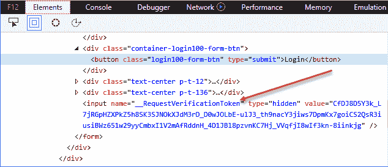

2.  `HomeController`上的完整`ValidateLogin`动作应如下所示:

```cs
      [HttpPost, ValidateAntiForgeryToken] 
      public async Task<IActionResult> ValidateLogin(LoginModel model) 
      { 
        if (ModelState.IsValid) 
        { 
          var email = model.Email; 
          string azFuncReturn = await ValidateEmail(model.Email); 

          if (azFuncReturn.Contains("false")) 
          { 
            TempData["message"] = "The email address entered is 
             incorrect. Please enter again."; 
            return RedirectToAction("Index", "Home"); 
          } 
          else 
          { 
            return Content("You are logged in now."); 
          }                 
        } 
        else 
        { 
          return View(); 
        } 

      } 
```

回到我们的`Index.cshtml`视图，仔细看看`form`标签。我们已经使用`asp-action`(指定要调用的操作)和`asp-controller`(指定在哪个控制器中查找指定的操作)明确定义了要调用哪个控制器和操作:

```cs
<form class="login100-form validate-form" asp-action="ValidateLogin" asp-controller="Home"> 
```

这映射了`Index.cshtml`表单将回发到的`HomeController`类上的动作`ValidateLogin`:


3.  然后，再往下一点，确保您的按钮已经将`type`指定为`submit`:

```cs
      <div class="container-login100-form-btn"> 
        <button class="login100-form-btn" type="submit"> 
          Login 
        </button> 
      </div> 
```

我们几乎完成了我们的`Index.cshtml`视图。当输入的电子邮件无效时，我们需要某种通知。这就是 Bootstrap 派上用场的地方。为将显示的`modal`对话框添加以下标记，通知用户输入的电子邮件地址无效。

您会注意到页面末尾包含了`@section Scripts`块。我们基本上是说，如果`TempData`属性不为空，那么我们希望通过 jQuery 脚本显示模态对话框:

```cs
<div id="myModal" class="modal" role="dialog"> 
    <div class="modal-dialog"> 

        <!-- Modal content--> 
        <div class="modal-content"> 
            <div class="modal-header alert alert-danger"> 
                <button type="button" class="close"
                 data-dismiss="modal">&times;</button> 
                <h4 class="modal-title">Invalid Email</h4> 
            </div> 
            <div class="modal-body"> 
                <p>@TempData["message"].</p> 
            </div> 
            <div class="modal-footer"> 
                <button type="button" class="btn btn-default"
                 data-dismiss="modal">Close</button> 
            </div> 
        </div> 

    </div> 
</div> 

@section Scripts 
    { 
    @if (TempData["message"] != null) 
    { 
        <script> 
            $('# myModal').modal(); 
        </script> 
    } 
} 
```

运行您的应用，并在登录页面上输入无效的电子邮件地址。在我的例子中，我只是添加了一个包含两个`@`符号的电子邮件地址:

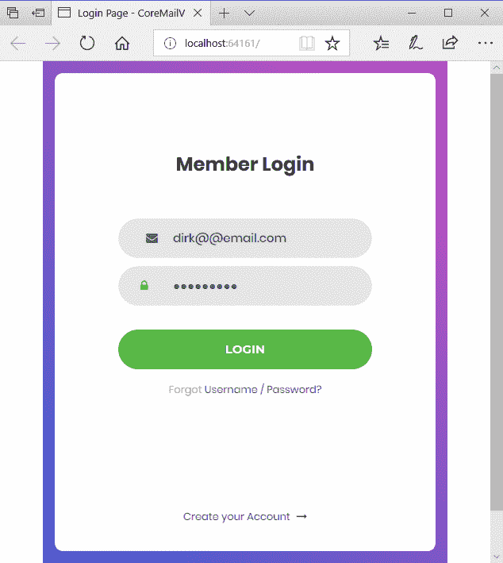

当按下 LOGIN 按钮时，表单返回到控制器，控制器又调用 Azure 函数，对输入的电子邮件地址执行验证。

结果是弹出了一个看起来平淡无奇的模态对话框通知，通知用户电子邮件地址不正确:


输入有效的电子邮件地址并单击登录按钮会成功验证输入的电子邮件:


如前所述，电子邮件验证不同于身份验证。如果电子邮件通过验证，则可以进行身份验证过程。如果此身份验证过程成功验证了登录的用户，只有这样，他们才会被重定向到登录页面:

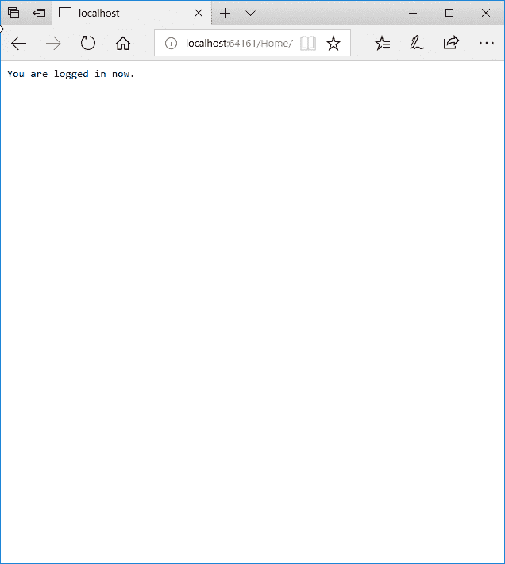

# 摘要

在本章中，我们看到了如何在 Azure 门户上创建 Azure 函数。我们了解到 Azure 函数是云中的一小部分代码，供应用在需要时使用。因为它们是按使用付费模式定价的，所以您只需为实际的计算能力用户付费。当您的 web 应用的用户负载很高时，该功能会根据需要自动扩展，以满足访问它的应用的需求。

我们看了通过手动将网址发布到浏览器中来了解我们的 Azure 函数中的代码的过程。然后，我们创建了一个由单个登录页面组成的 ASP.NETCore MVC 应用。然后，我们了解了如何使用 Azure 函数来验证登录屏幕上输入的电子邮件地址。Azure 函数是一项令人兴奋的开始使用的技术。还有很多东西要学，这一章没有足够的篇幅来讨论这种无服务器技术。如果您对这项技术感兴趣，可以探索一些其他可用的 Azure 服务模板。

在下一章中，我们将看到使用 ASP.NETCore MVC 应用和名为`Tweetinvi`的 C# 库创建一个推特克隆。留下来，还有很多精彩的内容等着你。