# 九、使用 Docker 和 ASP.NETCore

在本章中，我们将了解 Docker 是如何工作的。你可能以前听说过 Docker，但还没有机会玩它。我们将特别关注以下内容:

*   什么是码头工人
*   图像和容器
*   Docker 如何让网络开发人员受益
*   在视窗 10 专业版上安装 Docker
*   运行 Docker 并选择一些共享驱动器
*   当 Windows 防火墙似乎是问题时，排除共享驱动器的故障
*   Visual Studio 2017 如何与 Docker 集成
*   创建一个 ASP.NETCore MVC 应用并在一个容器中运行它
*   将 Docker Hub 与 GitHub 一起使用，并设置自动构建

Docker 会为你打开一个全新的世界。

# 什么是 Docker？

在我们开始使用 Docker 之前，让我们看看 Docker 到底是什么。如果你去 https://www.docker.com 看看“什么是码头工人”？佩奇，你会看到他们说 Docker 是一个集装箱化平台。从第一眼来看，这没有多大意义。不过，再深入一点，您会发现 Docker 简化了应用构建过程，并允许您在不同的环境中发布和运行这些应用。不同的环境可能是开发、测试、用户验收测试和生产环境。

Docker 利用了图像和容器，如果您查看 Docker 徽标，您会看到容器在其徽标中表示的想法:


货物计划者通常必须非常小心他们如何在货船上堆放集装箱。他们在计划集装箱在船上的位置时，需要记住集装箱的目的地。

例如，开往中东的集装箱不能装在开往日本东京的集装箱下。这将意味着他们不得不移除顶部容器来卸载底部容器，然后再次装载顶部容器。必须非常仔细地规划集装箱的位置，以优化货运物流的效率。

Docker 在使用容器的方法上是相似的。所以，让我们进一步澄清术语**容器**和**图像**。

# 图像和容器

Docker 映像只是用于创建 Docker 容器的文件。把它想象成 Docker 需要创建一个运行容器的蓝图。如果您愿意，映像是只读模板，创建为共享用于创建容器实例的公共文件的分层文件系统。

另一方面，容器是从这些图像创建的实例。容器是隔离和安全的，可以启动、停止、移动或删除。

# Docker 在哪里运行？

如前所述，使用货船的类比，货船代表您的开发环境、测试环境或生产环境。

Docker 可以在以下平台上本地运行:

*   Linux 操作系统
*   Windows Server 2016
*   Windows 10

Docker 还在云上运行以下内容:

*   亚马逊 EC2
*   谷歌计算引擎
*   蔚蓝的
*   存储空间

从以上几点，您可以看到 Docker 非常灵活，使用 Docker 可以为开发人员提供巨大的好处。让我们来看看 Docker 如何让网络开发人员受益。

# Docker 如何让网络开发人员受益

Docker 为 web 开发人员提供了几个好处。如果您在开发人员、测试人员、设计人员等混合的环境中工作，您可能希望他们与实际的应用一起工作，而不是与原型一起工作。您可以在服务器上设置应用，并将其连接到 SQL 数据库，然后管理每个用户从服务器访问站点所需的权限。另一方面，Docker 允许我们制作可以在独立开发人员或设计人员机器上轻松运行的容器。

我之前提到过 Docker 容器是隔离和安全的。因为这个原因，容器消除了应用冲突。我确信，如果您已经开发了一段时间，那么您一定会遇到应用部署在生产服务器上的情况。如果您想要(或需要)升级应用的框架(例如)，您可能会因为升级而遇到其他应用冲突。使用 Docker，可以在不影响环境中其他系统的情况下升级隔离的容器。

有多少次你听到一个开发人员说，*但是当一个部署的应用失败时，这个应用在我的系统*上运行良好？这是因为开发人员计算机、临时服务器或生产服务器的设置方式可能有所不同。使用 Docker，您只需将图像从一个环境移动到另一个环境，并启动和运行容器。这意味着，如果您的应用在开发机器上的容器内运行良好，那么它在登台或生产机器上也应该运行良好。

由于 Docker 容器的可预测性和稳定性，您能够比以前更快地发布代码。这导致生产率的提高。

# 在视窗 10 专业版上安装 Docker

对于 Windows 10 Pro 和 Windows 10 Enterprise，可以免费获得 Docker **社区版** ( **CE** )。

You can download Docker CE from [https://www.docker.com/docker-windows](https://www.docker.com/docker-windows).

Docker CE 需要 Hyper-V，因此，您需要运行 Windows 10 Pro 或更高版本。要查看您的 Windows 版本，请以管理员身份打开命令提示符，并在提示符下键入以下命令:

```cs
systeminfo
```

您将看到显示以下信息:


要检查 Hyper-V 是否已启用，请向下滚动一点:


早期版本的 Windows 没有 Hyper-V，所以 Docker CE 不会运行。从 Docker 文档([https://docs . Docker . com/v 17.09/Docker-for-Windows/FAQ/# 关于稳定和边缘渠道的问题](https://docs.docker.com/v17.09/docker-for-windows/faqs/# questions-about-stable-and-edge-channels))来看，Windows 10 Home 也是不支持的。

对于旧的 Mac 和 Windows 系统，可以安装 Docker 工具箱。这使用了免费的甲骨文虚拟机 VirtualBox。更多信息，请看[https://docs.docker.com/toolbox/toolbox_install_windows/](https://docs.docker.com/toolbox/toolbox_install_windows/)。

如前所述，可以为 Windows 10 Pro 和 Windows 10 Enterprise 机器下载 Docker CE。你可以在 Docker Store[https://Store . Docker . com/editions/community/Docker-ce-desktop-windows](https://store.docker.com/editions/community/docker-ce-desktop-windows)获取安装程序。

在撰写本文时，商店上的下载页面如下所示:


单击“获取 Docker”按钮，将 Docker 安装程序下载到您的计算机上。

The installer will require you to log out of Windows to complete the installation. It will not do this automatically but, before performing the installation, it's a good idea to close any other running applications.

该安装程序实际上是我近年来见过的最友好的安装程序之一。安装起来也很容易:


通常，我总是以管理员身份运行安装程序。Docker 的安装过程非常简单。安装后，它会提示您注销窗口:


重新登录到 Windows 后，您可能会看到一条消息，要求您打开 Hyper-V 以使用 Docker 容器。选择打开 Hyper-V 的选项。此时，您的计算机可能会重新启动。计算机重新启动后，您将看到 Docker 正在运行的通知:


您已经成功安装了 Docker。我告诉过你这很简单。

# 理解码头工人

要开始使用 Docker，请查找 Windows 桌面应用的 Docker:

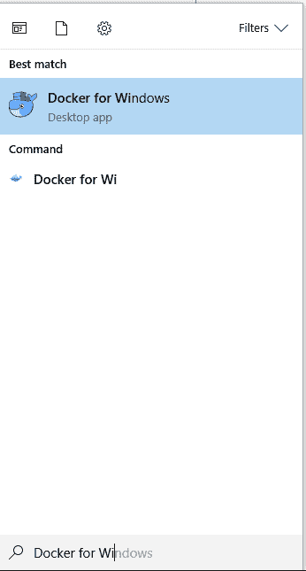

这将在您的机器上启动 Docker。当 Docker 运行时，您将在任务栏中看到它:

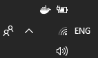

默认情况下，Docker 应该在安装后启动，所以只需首先检查它是否从任务栏运行。让我们看看 Docker 提供给我们的各种设置。右键单击任务栏中的 Docker 图标，并从上下文菜单中选择设置。当屏幕打开时，单击共享驱动器选项卡:

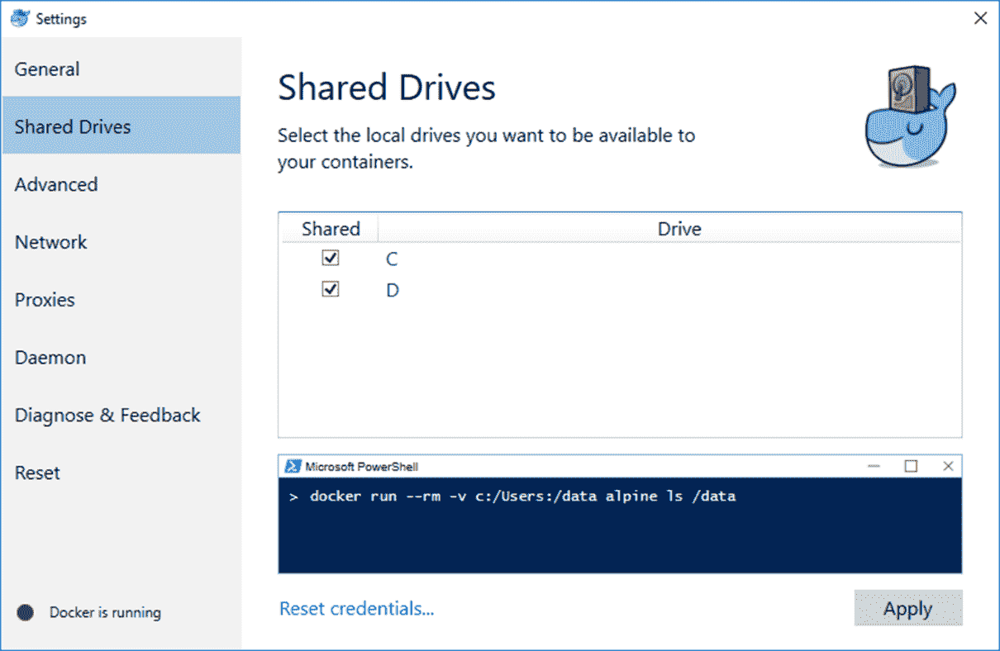

选择您希望容器可用的本地驱动器非常重要。检查共享驱动器允许支持卷。卷是由 Docker 容器生成的数据被持久化的机制。您可以在 https://docs.docker.com/engine/admin/volumes/volumes/的官方 Docker 文档中阅读更多关于卷的信息。

但是，我想指出文件中的以下要点:

*   卷可以轻松备份
*   卷在 Linux 和 Windows 容器上工作
*   您可以在多个容器之间共享卷
*   您可以使用卷驱动程序将卷存储在远程计算机或云中
*   您可以加密卷的内容

因为卷存在于容器之外，所以它是持久化数据的首选。Docker 还需要打开端口`445`，以便在主机和容器之间共享驱动器。如果 Docker 检测到端口`445`关闭，您将看到以下屏幕:

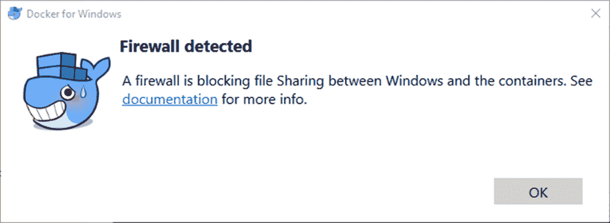

您可以单击链接阅读有关此错误的文档。

For more information on shared drives, see the Docker documentation at [https://docs.docker.com/docker-for-windows/# shared-drives](https://docs.docker.com/docker-for-windows/# shared-drives).

在线上有几个建议的方法可以解决这个问题。首先是卸载并重新安装微软网络的文件和打印机共享。

1.  为此，请从窗口设置中打开网络和共享中心。然后点击兽医网络连接:

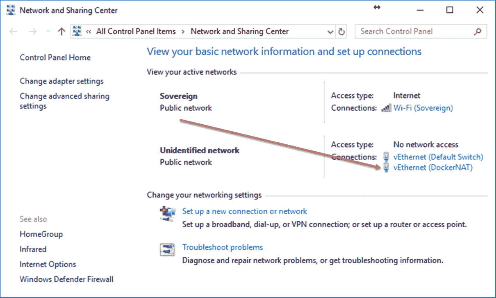

2.  在“状态”窗口中，单击“属性”按钮:


3.  在这里，您将看到微软网络的文件和打印机共享。您的第一步是点击卸载按钮。这将从列表中删除该条目。接下来，您需要点击安装按钮:

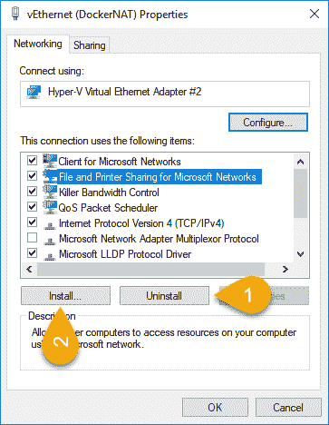

4.  在选择网络功能类型屏幕中，单击服务功能，然后单击添加按钮:


5.  在“选择网络服务”屏幕中，选择微软作为制造商，然后单击“微软网络文件和打印机共享”服务:

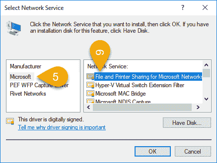

6.  单击确定并关闭所有屏幕后，通过右键单击任务栏中的图标并单击退出 Docker 来停止 Docker。然后，您可以通过再次单击窗口应用的 Docker 来重新启动 Docker。

此时，您应该能够从设置屏幕中选择与 Docker 一起使用的共享驱动器。如果您仍然看到防火墙检测到的消息，则可能是您的防病毒软件阻止了它。

在我的例子中，是 ESET 端点安全阻止了通信。您可能使用了不同的防病毒软件，因此请查看它最近阻止的特定应用列表。在我的案例中，我启动了 ESET 端点安全，并选择了设置，然后选择了网络:


7.  接下来，我选择了最近被阻止的应用或设备列表:

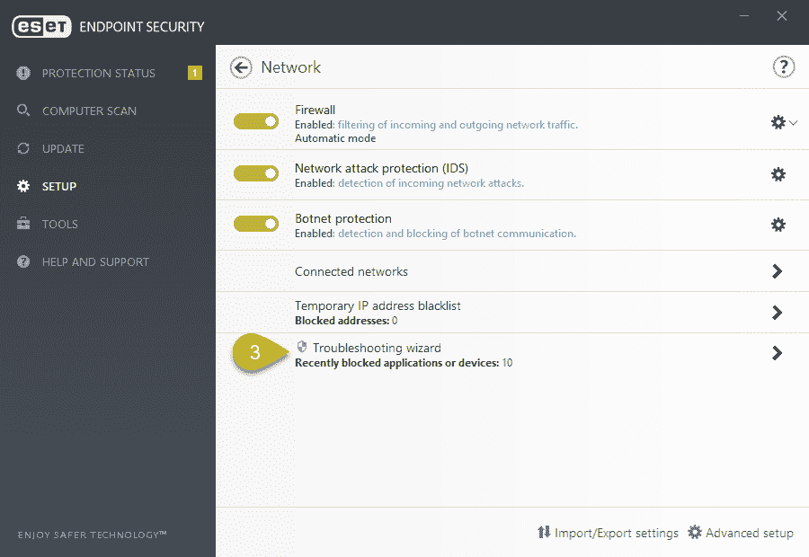

滚动列表，看到`10.0.75.2`被 ESET 屏蔽了。根据 Docker 文档，这是允许通过防火墙的 IP:

"To share the drive, allow connections between the Windows host machine and the virtual machine in Windows Firewall or your third-party firewall software. You do not need to open port 445 on any other network. By default, allow connections to 10.0.75.1 port 445 (the Windows host) from 10.0.75.2 (the virtual machine). If the firewall rules appear to be open, consider reinstalling the File and Print Sharing service on the virtual network adapter."

8.  单击取消阻止按钮将显示确认屏幕:

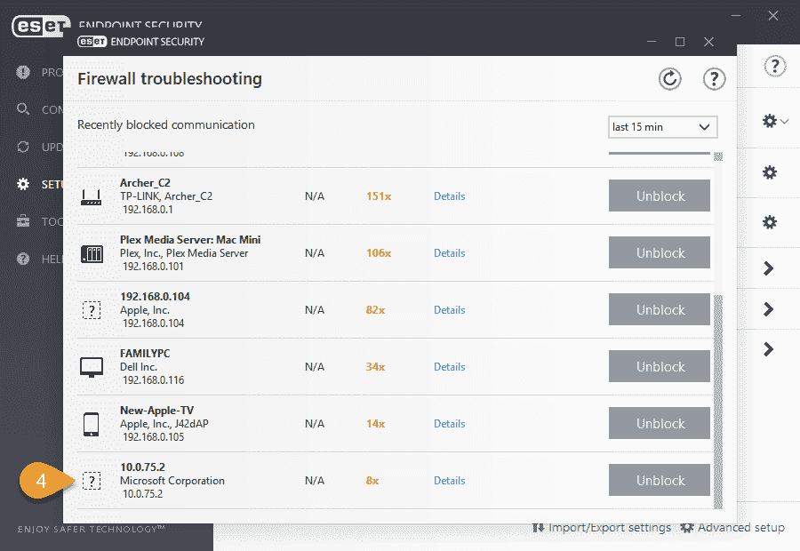

当你做到了这一点，你就解除了`10.0.75.2`的封锁:


9.  要完成，请单击“完成”，返回 Docker 设置，并选择要共享的驱动器。

现在，您应该能够选择 Docker 要使用的共享驱动器。如果您仍然无法共享驱动器，请查看以下 Stack Overflow 文章，了解更多故障排除提示:[https://Stack Overflow . com/questions/42203488/settings-to-windows-firewall-to-allow-docker-for-windows-to-shared-drive/43904051 # 43904051](https://stackoverflow.com/questions/42203488/settings-to-windows-firewall-to-allow-docker-for-windows-to-share-drive/43904051# 43904051)。

接下来，我们将了解 Docker 如何集成到 Visual Studio 2017 中，以及您可以做些什么来支持您的 ASP.NETCore 应用。我们还将了解如何添加 Docker 支持(或 Docker 化)现有的 ASP.NETCore 应用。

Docker 有一个健康的开发人员社区，它也有很多可用的帮助文档。花点时间浏览一下，研究一下你可能遇到的任何问题。

# 在 Docker 中运行 Visual Studio 2017 中的 ASP.NETCore 应用

那么，这一切会给我们留下什么呢？我们已经了解了如何在 Windows 10 上设置 Docker，以及如何解决围绕该设置的一些问题。现在让我们看看如何创建一个 ASP.NETCore 应用，并向新应用添加 Docker 支持。

1.  在 Visual Studio 2017 中创建新的 ASP.NETCore 网络应用，然后单击确定:


2.  在下一个屏幕上，选择网络应用(模型-视图-控制器)或您喜欢的任何类型，同时确保从下拉列表中选择了 ASP.NETCore 2.0。然后选中启用 Docker 支持复选框。这将启用操作系统下拉列表。在此选择窗口，然后单击确定按钮:


如果您看到以下消息，您需要切换到 Windows 容器。这是因为您可能将 Docker 的默认容器设置保留为 Linux:


如果你右击任务栏中的 Docker 图标，你会看到你也有一个在那里启用 Windows 容器的选项。您可以通过单击切换到窗口容器选项，从任务栏中的 Docker 图标切换到窗口容器:

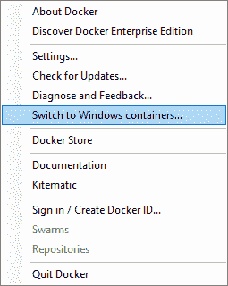

Switching to Windows containers may take several minutes to complete, depending on your line speed and the hardware configuration of your PC.

但是，如果您不单击此选项，Visual Studio 将要求您在选择操作系统平台作为窗口时更改为窗口容器。

There is a good reason that I am choosing Windows containers as the target OS. This reason will become clear later on in the chapter when working with Docker Hub and automated builds.

创建 ASP.NETCore 应用后，您将在解决方案资源管理器中看到以下项目设置:

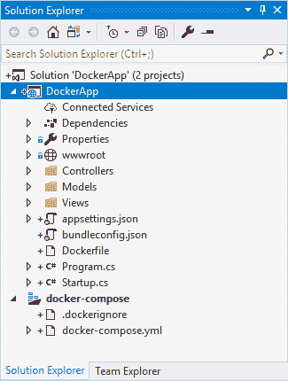

添加到 Visual Studio 中的 Docker 支持不仅以 Docker 文件的形式出现，而且以 Docker 配置信息的形式出现。该信息包含在解决方案级别的全局`docker-compose.yml`文件中:


3.  单击解决方案资源管理器中的 Dockerfile，您将看到它看起来一点也不复杂。请记住，Dockerfile 是创建图像的文件。该图像是一个只读模板，概述了如何创建 Docker 容器。因此，Dockerfile 包含生成和运行映像所需的步骤。Dockerfile 中的指令在图像中创建图层。这意味着，如果 Dockerfile 中有任何更改，在重建图像时，将只重建已更改的图层。文件如下所示:

```cs
FROM microsoft/aspnetcore:2.0-nanoserver-1709 AS base 
WORKDIR /app 
EXPOSE 80 

FROM microsoft/aspnetcore-build:2.0-nanoserver-1709 AS build 
WORKDIR /src 
COPY *.sln ./ 
COPY DockerApp/DockerApp.csproj DockerApp/ 
RUN dotnet restore 
COPY . . 
WORKDIR /src/DockerApp 
RUN dotnet build -c Release -o /app 

FROM build AS publish 
RUN dotnet publish -c Release -o /app 

FROM base AS final 
WORKDIR /app 
COPY --from=publish /app . 
ENTRYPOINT ["dotnet", "DockerApp.dll"] 
```

当您在 Visual Studio 2017 中查看菜单时，您会注意到“运行”按钮已更改为 Docker:

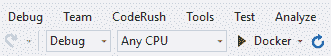

4.  点击 Docker 按钮来调试你的 ASP.NETCore 应用，你会注意到输出窗口中出现了一些东西。特别感兴趣的是结尾的 IP 地址。在我的例子中，它的内容是启动 http://172.24.12.112(您的会有所不同):


当浏览器启动时，您将看到 ASP.NETCore 应用正在先前在输出窗口中列出的 IP 地址上运行。您的 ASP.NETCore 应用现在正在 Windows Docker 容器中运行:

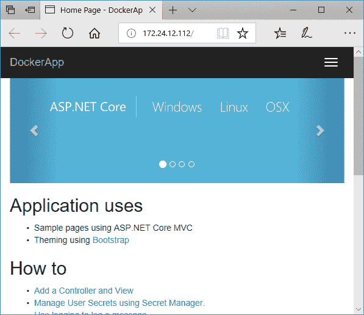

这很棒，也很容易上手。但是，您需要做什么来归档现有的 ASP.NETCore 应用呢？事实证明，这并没有你想象的那么难。

# 向现有的 ASP.NETCore 应用添加 Docker 支持

假设您有一个没有 Docker 支持的 ASP.NETCore 应用。要将 Docker 支持添加到这个现有的应用中，只需从上下文菜单中添加它:


要向现有的 ASP.NETCore 应用添加 Docker 支持，您需要执行以下操作:

1.  在解决方案资源管理器中右键单击您的项目
2.  单击添加菜单项
3.  单击弹出菜单中的 Docker 支持:


4.  Visual Studio 2017 现在询问您目标操作系统将是什么。在我们的案例中，我们将以 Windows 为目标:

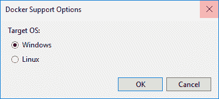

5.  单击“确定”按钮后，Visual Studio 2017 将开始向您的项目添加 Docker 支持:

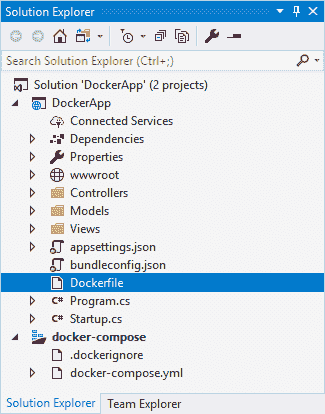

创建内置 Docker 支持的 ASP.NETCore 应用非常容易，向现有的 ASP.NETCore 应用添加 Docker 支持更容易。

最后，如果您遇到任何问题，例如文件访问问题，请确保您的防病毒软件已将您的 Dockerfile 排除在扫描范围之外。此外，请确保您以管理员身份运行 Visual Studio。

# 将 Docker 集线器与 GitHub 一起使用

下一节将说明如何设置 Docker Hub，以便在 GitHub 存储库中从您的项目进行自动化构建。

For this example, I will not be going through how to check your code into GitHub.

1.  使用前面几节中创建的 DockerApp 项目，将其签入一个新的 GitHub 存储库。一旦你签入了你的代码，转到 https://hub.docker.com/的 Docker Hub 登录，或者创建一个你还没有的账户:


2.  报名过程真的又快又容易。你所需要做的就是确认你的电子邮件地址，你就可以进去了。确认您的电子邮件地址后，系统会提示您再次登录。这将带你到你的码头枢纽仪表板。

在此页面上，您有几个选项可供选择。您可以创建存储库和组织，并探索存储库:


3.  要开始使用 GitHub，我们需要首先将 Docker Hub 与 GitHub 链接起来。单击页面右上角您选择的用户名。然后点击设置菜单选项:


4.  在“设置”下，查找“链接帐户和服务”选项卡，然后单击该选项卡。您现在需要单击链接 Github 选项继续:


5.  为了简单起见(也因为推荐)，我直接点击了公共和私有访问设置:

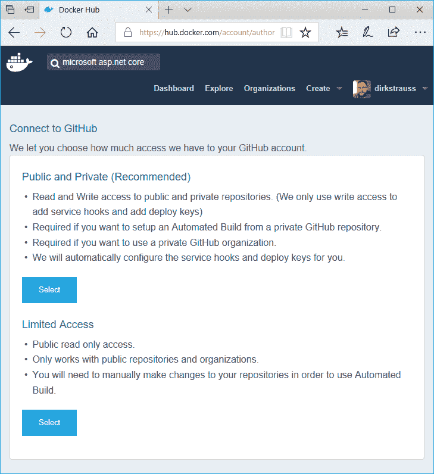

6.  Docker Hub 现在将您重定向到授权页面，以允许 Docker Hub 访问您的 GitHub 存储库。在这里，您需要使用您的 GitHub 凭据登录:


Note that if you have two-factor authentication enabled, you will need to type in the authentication code generated by your smartphone app. So keep your mobile close by.

7.  要授权码头工人中心，请单击授权码头工人按钮:


现在，您将返回到链接帐户和服务页面，您将在 Docker Hub 个人资料中看到链接帐户:

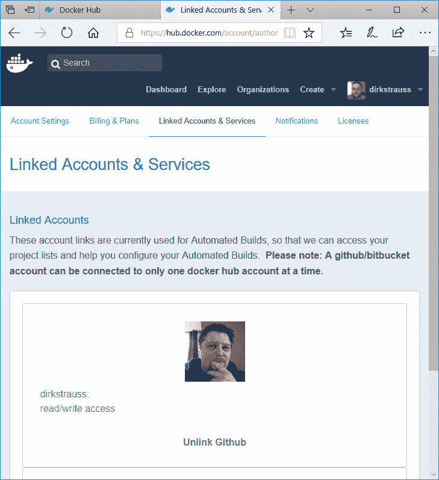

8.  接下来，我们需要创建一个自动化的构建。从菜单中，单击创建菜单项，并从以下选项中选择创建自动生成:


9.  然后，您希望单击创建自动构建 Github 选项:


这将显示您的 GitHub 帐户中所有可用存储库的列表。我之前在我的 GitHub 帐户中签入了 DockerApp 项目，所以这是我们将要选择的:

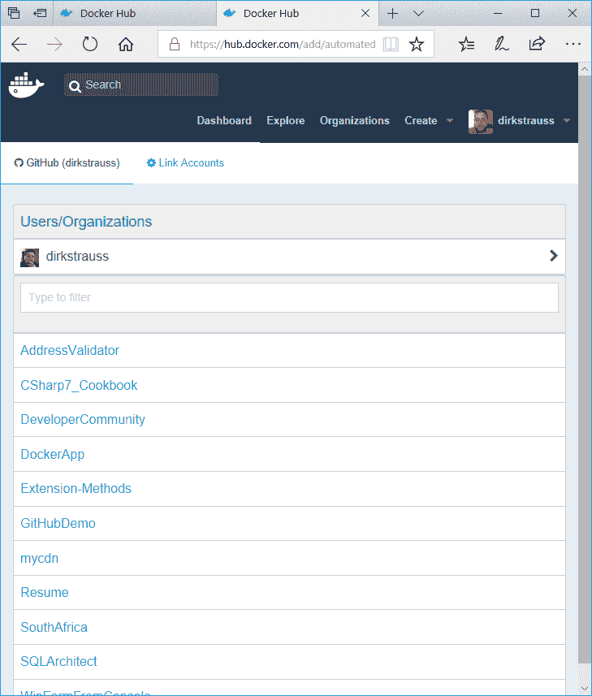

10.  现在，您可以根据需要在这里定义附加信息，也可以将其保留为默认信息。由你来决定。完成后，单击创建按钮:

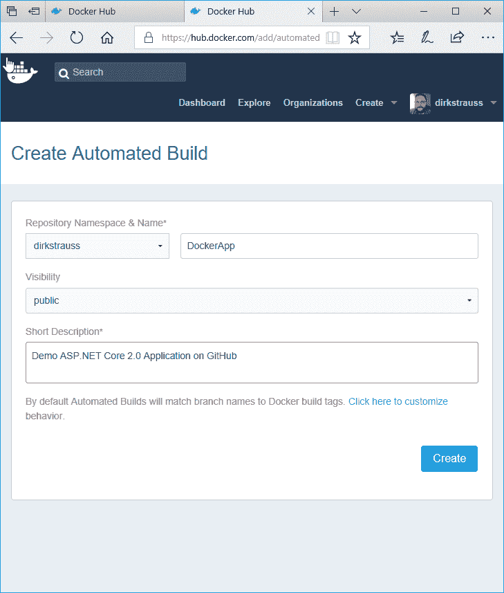

我们的自动化构建现已创建并准备就绪。那么，准确地说，这种自动化构建是如何工作的呢？每次您将代码提交到 GitHub 存储库时，Docker Hub 都会构建您的项目:


11.  为了测试这一点，请在 Visual Studio 2017 中打开您的 ASP.NETCore 应用并进行一些更改。然后将这些更改提交到您的 GitHub 存储库中。然后点击 Docker Hub 中的构建细节链接。您将看到构建已经排队，并将在几分钟后完成。要查看构建结果，请稍后刷新此页面:


12.  刷新页面后，您将看到出现了一个错误。Docker Hub 将为您显示构建结果，您可以单击构建结果来查看失败的详细信息。

I am going to illustrate a few errors that are commonly received during an automated build. I will also show the way I have found to resolve these. I'm not sure whether there will have been changes to the way these work in the meantime but, at the time of writing, these issues presented themselves.

当我们查看失败的原因时，我们看到 Docker Hub 在项目的根中找不到 Dockerfile。为什么这是一个问题，我不知道。我希望 Docker Hub 递归遍历项目的树结构来找到 Dockerfile 位置。然而，这很容易解决:


我只是复制了我的 Dockerfile，并将其复制到解决方案的根目录。然后，我再次将代码签入 GitHub:

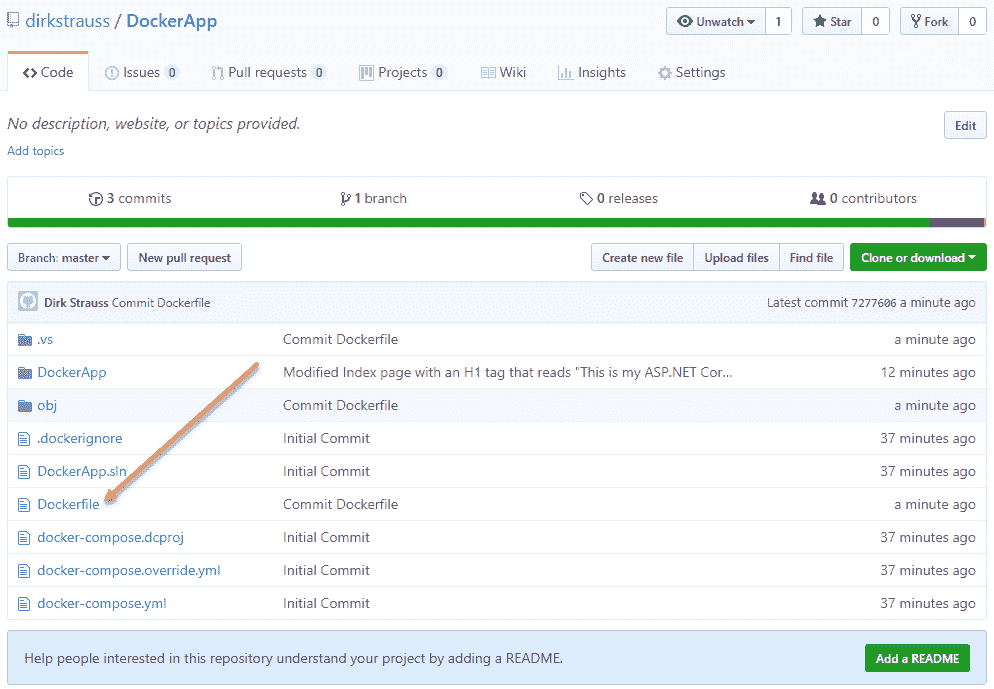

13.  如果您刷新您的自动生成页面，您将看到它再次生成项目:

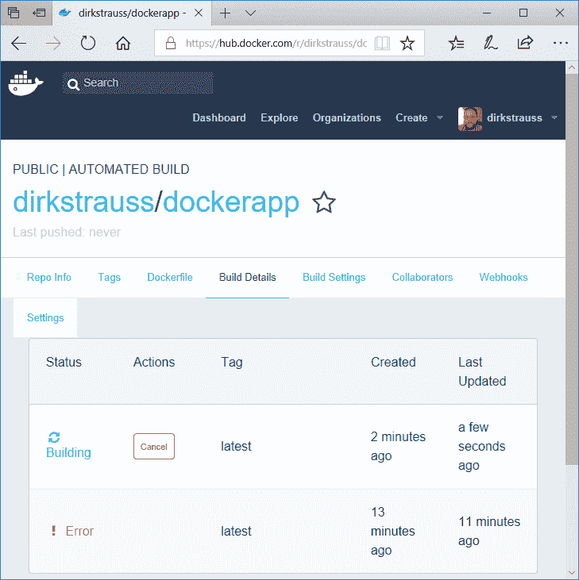

14.  这一次，又出现了一个错误。再次单击错误条目将带您进入错误详细信息:


这一次，它表明错误的原因是我们在项目中瞄准了 Windows OS 而不是 Linux:


错误如下:

```cs
Build failed: image operating system "windows" cannot be used on this platform 
```

15.  要解决这个问题，我们需要修改 Dockerfile。窗口的文件如下所示:

```cs
FROM microsoft/aspnetcore:2.0-nanoserver-1709 AS base 
WORKDIR /app 
EXPOSE 80 

FROM microsoft/aspnetcore-build:2.0-nanoserver-1709 AS build 
WORKDIR /src 
COPY *.sln ./ 
COPY DockerApp/DockerApp.csproj DockerApp/ 
RUN dotnet restore 
COPY . . 
WORKDIR /src/DockerApp 
RUN dotnet build -c Release -o /app 

FROM build AS publish 
RUN dotnet publish -c Release -o /app 

FROM base AS final 
WORKDIR /app 
COPY --from=publish /app . 
ENTRYPOINT ["dotnet", "DockerApp.dll"] 
```

16.  修改为使用`aspnetcore:2.0`代替`aspnetcore:2.0-nanoserver`:

```cs
FROM microsoft/aspnetcore:2.0 AS base 
WORKDIR /app 
EXPOSE 80 

FROM microsoft/aspnetcore-build:2.0 AS build 
WORKDIR /src 
COPY *.sln ./ 
COPY DockerApp/DockerApp.csproj DockerApp/ 
RUN dotnet restore 
COPY . . 
WORKDIR /src/DockerApp 
RUN dotnet build -c Release -o /app 

FROM build AS publish 
RUN dotnet publish -c Release -o /app 

FROM base AS final 
WORKDIR /app 
COPY --from=publish /app . 
ENTRYPOINT ["dotnet", "DockerApp.dll"]
```

17.  再次，将您的代码提交给 GitHub 来启动自动化构建:


这一次，您将看到构建成功。

For more information on which OS to target with .NET containers, see the following Microsoft document: [https://docs.microsoft.com/en-us/dotnet/standard/microservices-architecture/net-core-net-framework-containers/net-container-os-targets](https://docs.microsoft.com/en-us/dotnet/standard/microservices-architecture/net-core-net-framework-containers/net-container-os-targets).

18.  我们现在已经成功地实现了 GitHub 项目的自动化构建。回到回购信息选项卡，记下 Docker 拉取命令:

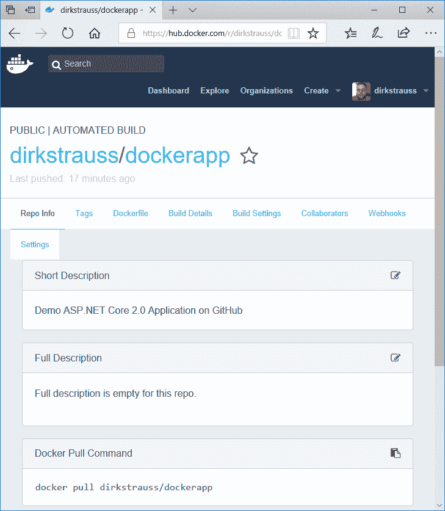

图像的 Docker 存储库位于`dirkstrauss/dockerapp`，Docker 拉取命令为`docker pull dirkstrauss/dockerapp`。

19.  以管理员身份运行 Windows 命令提示符，输入 Docker 拉命令，按*回车*键:


您会看到，您将开始将图像下拉到本地计算机。

If, when pulling the Docker image, you receive the error message Error response from daemon: Get https://registry-1.docker.io/v2/: net/http: request canceled while waiting for connection (Client.Timeout exceeded while awaiting headers), simply restart Docker by right-clicking the Docker icon in the taskbar, clicking on Settings, and then clicking on Reset, and then Restart Docker. If you receive an error along the lines of Image operating system "linux" cannot be used on this platform, you need to switch back to a Linux container. See the following URL for more information: [https://github.com/docker/kitematic/issues/2828](https://github.com/docker/kitematic/issues/2828).

20.  我们现在需要通过输入`docker run -d -p 5000:80` `[image-repository]`来运行集装箱，这将集装箱绑定到港口`5000`:

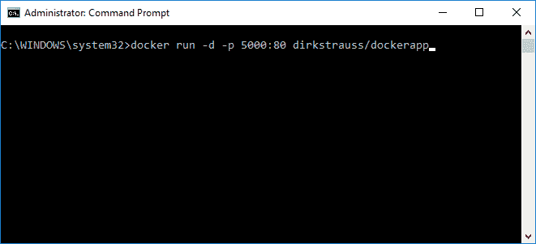

21.  如果要查看容器是否已启动，请运行以下命令:

```cs
Docker container ls 
```

现在，您可以看到容器标识，以及关于正在运行的容器的其他信息:

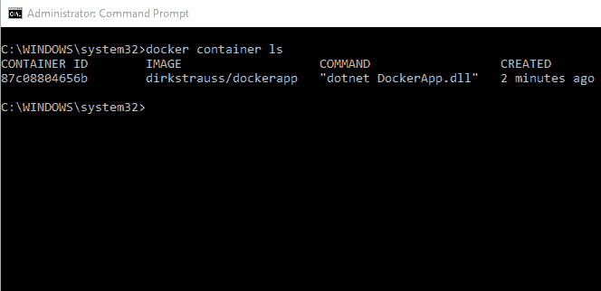

22.  我们现在要做的是在浏览器中运行我们签入到 GitHub 的 ASP.NET Core 应用。为此，我们需要找到 IP 地址。在 Windows 10 上，我们需要查找 DockerNAT 的 IP 地址，为此，我们需要运行以下命令:

```cs
ipconfig 
```

您将看到定义的 IP 地址是`10.0.75.1`，这是我们的容器将运行的 IP 地址:

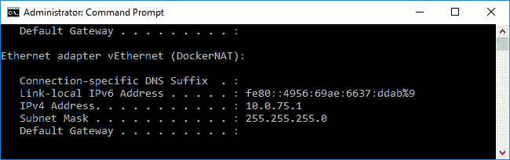

23.  打开浏览器，输入 IP 地址和端口号为`10.0.75.1:5000`，点击*进入*。您的 ASP.NETCore 应用将在您的浏览器窗口中弹出，光彩夺目:


用 Docker Hub 建立 GitHub 来执行自动化构建起初看起来有点麻烦，但是对开发团队来说好处是多方面的。它允许您始终使用项目的最新版本。

# 摘要

在本章中，我们看了一下在您的 Windows 10 Pro 机器上安装 Docker。我们还了解了什么是 Docker，以及它给开发人员带来的好处。然后，当防火墙似乎是阻塞问题时，我们查看了在您的本地计算机上设置 Docker 的故障排除。然后，我们采用 Docker 并创建了一个 ASP.NET Core MVC 应用，从一开始就添加了 Docker 支持。我们还研究了如何向现有应用添加 Docker 支持。最后，我们设置 Docker 与 GitHub 集成并执行自动化构建。我们还了解了如何从 Docker Hub 中提取容器，并在本地机器上的容器中运行它。

Docker 容器和 Docker Hub 是开发人员可以用来使他们的工作更加容易的工具。与 GitHub 和 Docker 等流行平台合作的力量带来了提高生产力和盈利能力的好处。Docker 消除了在多台机器上部署应用的兼容性问题。

关于 Docker 还有很多东西需要学习，远不止一章可以说明。勇往直前，探索 Docker 的力量。