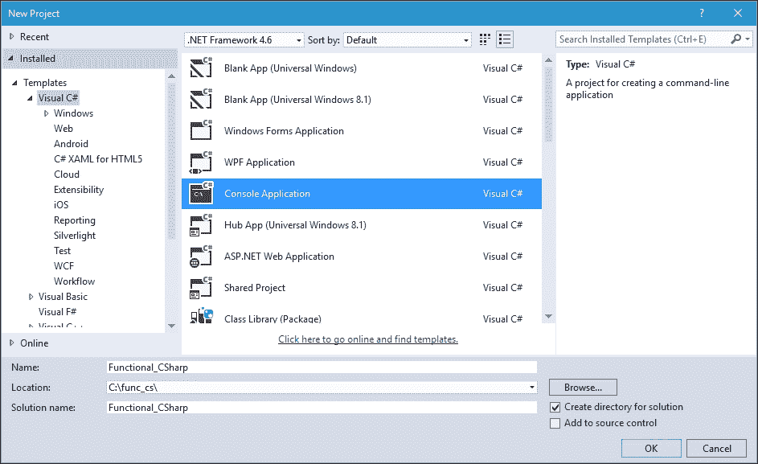
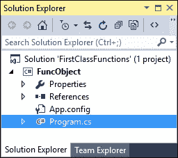
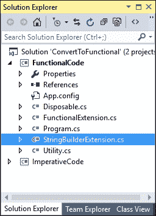
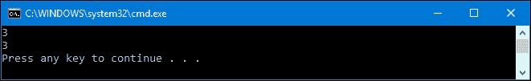
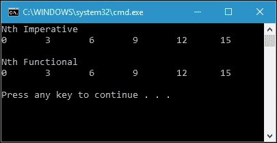
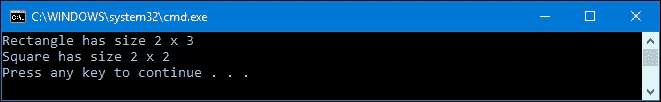

# 一、使用 C# 品味函数风格

函数式编程是一种构建计算机程序元素和结构的方式，它将计算视为数学函数中的求值。虽然有一些专门为创建函数式编程而设计的语言，如 Haskell 或 Scala，但我们也可以使用 C# 来完成函数式编程的设计。

在本书的第一章中，我们将通过测试来探索函数式编程。我们将利用 C# 的强大功能来构造一些函数代码。我们还将讨论 C# 中主要用于开发函数式程序的特性。到本章结束时，我们将会对 C# 中的函数方法有一个概念。以下是我们将在本章中讨论的主题:

*   函数式编程概念介绍
*   功能法和命令法的比较
*   函数式编程的概念
*   用数学方法理解函数式编程
*   将命令式代码重构为函数式代码
*   函数式编程的优缺点

# 引入函数式编程

在函数式编程中，我们编写函数时没有像在数学中那样的副作用。代码函数中的变量表示函数参数的值，它类似于数学函数。其思想是程序员定义包含表达式、定义和参数的函数，这些函数可以通过变量来表达，以便解决问题。

在程序员构建了函数并将函数发送给计算机后，轮到计算机完成它的工作了。一般来说，计算机的作用是评估函数中的表达式并返回结果。我们可以想象，计算机就像一个计算器，因为它会分析函数的表达式，并以打印格式将结果提供给用户。计算器将计算一个函数，该函数由作为参数传递的变量和构成函数主体的表达式组成。变量在表达式中用它们的值代替。我们可以用代数算子给出简单表达式和复合表达式。由于没有赋值的表达式从不改变值，子表达式只需要计算一次。

假设我们在一个函数中有表达式`3 + 5`。电脑完全评估后，肯定会立即返回`8`作为结果。然而，这只是计算机如何计算表达式的一个简单例子。事实上，程序员可以通过在函数内部创建复杂的定义和表达式来提高计算机的能力。计算机不仅可以评估简单的表达式，还可以评估复杂的计算和表达式。

## 理解定义、脚本和会话

正如我们之前讨论的一个计算器，它将从函数中分析表达式，让我们假设我们有一个计算器，它有一个像计算机一样的控制台面板。与常规计算器的区别在于，我们必须按下 ***进入*** 而不是 ***=*** (等于)才能运行表达式的评估过程。在这里，我们可以输入表达式，然后按 ***进入*** 。现在，假设我们键入以下表达式:

```cs
3 x 9 

```

紧接着按下 ***进入*** 后，电脑会在控制台打印`27`，这正是我们所期待的。计算机在评估我们给出的表达式方面做得很好。现在，让我们开始分析以下定义。假设我们在函数式计算器上输入它们:

```cs
square a = a * a 
max a b  = a, if a >= b 
         = b, if b > a 

```

我们已经定义了两个定义，`square`和`max`。我们可以称定义列表为脚本。通过调用后面跟有任何代表变量`a`的数字的`square`函数，我们将得到该数字的平方。同样，在`max`定义中，我们用两个数字来表示变量`a`和`b`，然后计算机将对这个表达式求值，找出变量之间最大的数字。

通过定义这两个定义，我们可以将它们用作函数，我们可以称之为 session，如下所示:

```cs
square (1 + 2) 

```

电脑评估完前面的功能后肯定会打印`9`。计算机还能够评估以下功能:

```cs
max 1 2 

```

它将根据我们之前定义的定义返回`2`作为结果。如果我们提供以下表达式，这也是可能的:

```cs
square (max 2 5) 

```

然后，`25`将显示在我们的计算器控制台面板中。

我们也可以使用前面的定义修改定义。假设我们想把一个整数翻两番，利用`square`函数的定义；以下是我们可以发送给计算器的信息:

```cs
quad q = square q * square q 
quad 10 

```

前面表达式的第一行是`quad`函数的定义。在第二行中，我们调用该函数，结果将为我们提供`10000`。

脚本可以定义变量值；例如，看看以下内容:

```cs
radius = 20 

```

因此，我们应该期望计算机能够评估以下定义:

```cs
area = (22 / 7) * square (radius) 

```

## 使用替换和简化来评估表达式

使用一种称为**约简**的数学方法，我们可以通过替换变量或表达式来评估表达式，以简化表达式，直到在约简上不可能有更多的替换。让我们利用前面的表达式`square (1 + 2)`，看看下面的约简过程:

```cs
square (1 + 2) -> square 3 (addition) 
               -> 3 x 3    (square) 
               -> 9        (multiply) 

```

首先，我们有符号`->`来表示减少。从序列中，我们可以发现还原过程——换句话说，就是评估过程。在第一行，计算机将运行`1 + 2`表达式并用`3`代替，以减少表达式。然后，通过将`square 3`简化为`3 x 3`表达式，减少第二行的表达式。最后将`3 x 3`简化，代之以`9`，就是那个表达式的结果。

实际上，一个表达式在约简中可以有不止一种可能性。前面的还原过程是还原过程的可能性之一。我们还可以创造其他可能性，如下所示:

```cs
square (1 + 2) -> (1 + 2) x (1 + 2) (square) 
               -> 3 x (1 + 2)       (addition)  
               -> 3 x 3             (addition) 
               -> 9                 (multiply) 

```

在前面的序列中，首先，我们可以看到应用了正方形的规则。然后，计算机替换第 2 行和第 3 行中的`1 + 2`。最后，它将表达式中的数字相乘。

从前面两个例子中，我们可以得出结论，表达式可以使用简单的替换和简化来评估，这是数学的基本规则。我们还可以看到，表达式是值的表示，而不是值本身。然而，如果不能再减少，表达式将处于正常形式。

## 了解用于功能编程的功能

函数式编程使用强调函数及其应用而不是命令及其执行的技术。函数编程中的大多数值都是函数值。让我们看看下面的数学符号:

```cs
f :: A -> B 

```

从前面的符号中，我们可以说函数`f`是这里陈述的每个元素的关系，即`A`和`B`。我们称`A`为源类型，`B`为目标类型。换句话说，`A -> B`的符号表示`A`是我们必须输入值的参数，`B`是返回值或函数求值的输出。

考虑`x`表示`A`的元素，`x + 2`表示`B`的元素，因此我们可以创建如下数学符号:

```cs
f(x) = x + 2 

```

在数学中，我们用`f(x)`来表示函数应用。在函数式编程中，函数将作为参数传递，并在表达式求值后返回结果。

我们可以为同一个函数构造许多定义。以下两个定义类似，将作为参数传递的输入增加两倍:

```cs
triple y = y + y + y 
triple' y = 3 * y 

```

我们可以看到，`triple`和`triple'`有不同的表达方式。但是，它们是相同的功能，所以我们可以说`triple` = `triple'`。虽然我们有许多定义来表示一个函数，但我们会发现只有一个定义在我们前面讨论的简化表达式的意义上证明是评估过程中最有效的。不幸的是，我们无法从前面的两个定义中确定哪一个是最有效的，因为这取决于评估机制的特性。

### 形成定义

现在，让我们回到本章开头对定义的讨论。为了从案例分析中获取价值，我们有以下定义:

```cs
max a b  = a, if a >= b 
         = b, if b > a 

```

在这个定义中有两个表达式，通过布尔值表达式来区分。这个识别符叫做守卫，我们用它来评估`True`或者`False`的值。第一行是该函数的可选结果值之一。声明如果表达式`a >= b`为`True`，返回值为`a`。相反，如果表达式`b >= a`为`True`，函数将返回值`b`。使用这两种情况，`a >= b`和`b >= a`，`max`的值取决于`a`和`b`的值。案件的顺序无关紧要。我们也可以用特殊的词`otherwise`来定义`max`功能。这个词确保了如果没有表达式得到真值，将执行否则的情况。在这里，我们将使用单词`otherwise`重构我们的 max 函数:

```cs
max a b  = a, if a >= b 
         = b, otherwise 

```

从前面的函数定义中，我们可以看到，如果第一个表达式是`False`，函数将立即返回`b`，而不执行任何求值。换句话说，如果所有先前的守卫都返回`False`，否则情况将总是返回`True`。

数学符号中另一个常用的特殊词是`where`。这个词用于设置函数表达式的局部定义。让我们看看下面的例子:

```cs
f x y = (z + 2) * (z + 3) 
        where z = x + y 

```

在前面的例子中，我们有一个带有变量`z`的函数`f`，其值由`x`和`y`决定。在那里，我们给函数引入了一个局部的`z`定义。这个局部定义也可以和我们之前讨论的案例分析一起使用。下面是一个结合本地定义和案例分析的例子:

```cs
f x y = x + z, if x > 100 
      = x - z, otherwise 
        where z = triple(y + 3) 

```

在前面的函数中，有一个局部`z`定义，它同时适用于`x + z`和`x - z`表达式。正如我们前面讨论的，虽然函数有两个等于(`=`)的符号，但是只有一个表达式会返回值。

### 当前

Currying 是一种通过序列改变结构参数的简单技术。它将把一个 n 元函数转换成 n 元函数。这是一种为了规避一元函数 Lambda 函数的限制而创建的技术。让我们再次回到我们的 max 函数，并获得以下定义:

```cs
max a b  = a, if a >= b 
         = b, if b > a 

```

我们可以看到`max a b`函数名中没有括号。此外，函数名中没有逗号分隔的`a`和`b`。我们可以在函数定义中添加一个括号和一个逗号，如下所示:

```cs
max' (a,b)  = a, if a >= b 
            = b, if b > a 

```

乍一看，我们发现这两个函数是相同的，因为它们有相同的表达式。然而，它们因类型不同而不同。`max'`函数只有一个参数，由一对数字组成。`max'`功能的类型可以写成如下:

```cs
max' :: (num, num) -> num 

```

另一方面，`max`函数有两个参数。这个函数的类型可以写成如下:

```cs
max :: num -> (num -> num) 

```

max 函数将取一个数字，然后将一个函数从一个数字返回到多个数字。从前面的 max 函数中，我们将变量`a`传递给`max`函数，该函数返回一个值。然后，将该值与变量`b`进行比较，以找到最大值。

# 函数式编程和命令式编程的比较

函数式编程和命令式编程的主要区别在于命令式编程会产生副作用，而函数式编程不会。在命令式编程中，表达式被求值，其结果值被赋给变量。所以，当我们将一系列表达式组合成一个函数时，结果值取决于变量在那个时间点的状态。这叫做副作用。由于状态的不断变化，评估的顺序至关重要。在函数式编程世界中，破坏性赋值是被禁止的，每次赋值发生时都会引入一个新的变量。

# 准备 C# 编译器

在本章剩下的讨论中，我们将使用 C# 创建一些代码。为了拥有相同的环境，让我们定义在配置设置中使用什么。我们将使用 Visual Studio 2015 社区版和.NET Framework 4.6.2 中的所有源代码。我们还将选择控制台应用项目，以便于我们的代码开发，因为它不需要对设置进行很多更改。

下面是创建我们将使用的 Visual Studio 项目时的设置截图:



当我们讨论一个文件名为`csproj`的源代码时，例如`FuncObject.csproj`，我们可以在示例代码中提供的一个解决方案文件中找到它。它会在`Program.cs`档案里。以下是 Visual Studio 中项目结构的屏幕截图:



然而，有时，我们在项目文件中有不止一个`.cs`文件。在这种情况下，我们可以在项目文件中的一个`.cs`文件中找到我们正在讨论的代码。例如，我们有一个名为`FunctionalCode.csproj`的项目文件。所以，当我们讨论与这个项目文件相关的任何源代码时，我们可以从项目文件内部的`.cs`文件中找到它。由多个`.cs`文件组成的项目文件的结构如下:



我们可以看到，在`FunctionalCode.csproj`文件里面，不仅有`Program.cs`文件，还有`Disposable.cs`、`FunctionalExtension.cs`、`StringBuilderExtension.cs`和`Utility.cs`。

我们还会在大部分代码中找到类名的`partial`关键字，即使我们在同一个文件中编写类。目的是使本书中的代码片段易于在示例代码中找到。通过知道类名，将更容易在文件中找到源代码。

### 注

我们还需要安装 Visual Studio Community 2017 RC，因为我们将在[第 9 章](09.html "Chapter 9. Working with Pattern")、*中使用 C# 7 的一个新功能，使用模式*。

# 函数式编程的概念

我们也可以通过概念来区分函数式编程和命令式编程。函数式编程的核心思想被封装在诸如一级函数、高阶函数、纯度、循环递归和部分函数等结构中。我们将讨论本主题中的概念。

## 一阶和高阶函数

在命令式编程中，给定的数据更重要，并通过一系列函数传递(有副作用)。函数是有自己语义的特殊构造。实际上，函数与变量和常量没有相同的位置。由于函数不能作为参数传递或作为结果返回，因此它们被视为编程世界的二等公民。在函数式编程世界中，我们可以传递函数作为参数，并返回函数作为结果。它们遵循与变量及其值相同的语义。因此，他们是一等公民。我们也可以通过组合来创建称为二阶函数的函数。对函数的可组合性没有限制，它们被称为高阶函数。

幸运的是，C# 语言支持这两个概念，因为它有一个名为 function object 的特性，它有类型和值。为了讨论关于函数对象的更多细节，让我们看看下面的代码:

```cs
class Program 
{ 
  static void Main(string[] args) 
  { 
    Func<int, int> f = (x) => x + 2; 
    int i = f(1); 
    Console.WriteLine(i); 

    f = (x) => 2 * x + 1; 
    i = f(1); 
    Console.WriteLine(i); 
  } 
} 

```

我们可以在`FuncObject.csproj`中找到代码，如果我们运行它，它将在控制台屏幕上显示以下输出:



我们为什么要展示它？让我们继续讨论函数类型和函数值。

### 类型

点击***Ctrl***+***F5***而不是 ***F5*** 以便在调试模式下运行代码，但无需调试器。在出口处停止控制台关闭是很有用的。

### 功能类型

与 C# 中的其他对象一样，函数对象也有一个类型。我们可以初始化函数声明中的类型。下面是声明函数对象的语法:

```cs
Func<T1, T2, T3, T4, ..., T16, TResult> 

```

注意我们有`T1`到`T16`，这是对应输入参数的类型，`TResult`是对应返回类型的类型。如果我们需要转换我们之前的数学函数`f(x) = x + 2`，我们可以这样写:

```cs
Func<int, int> f = (x) => x + 2;  

```

我们现在有一个函数`f`，它有一个参数类型的整数和整数返回类型。这里，我们使用一个 lambda 表达式来定义一个委托，该委托将被分配给名为`Func`类型的对象`f`。如果您还不熟悉委托和 lambda 表达式，不要担心。我们将在下一章中进一步讨论它们。

### 函数值

要给函数变量赋值，有以下几种可能:

*   函数变量可以使用引用通过其名称分配给类中的现有方法。我们可以用委托作为参考。让我们看看下面的代码片段:

    ```cs
          class Program 
          { 
            delegate int DoubleAction(int inp); 

            static void Main(string[] args) 
            { 
              DoubleAction da = Double; 
              int doubledValue = da(2); 
            } 

            static int Double(int input) 
            { 
              return input * 2; 
            } 
          } 

    ```

*   正如我们在前面的代码中看到的，我们使用`delegate`将`da`变量分配给现有的`Double()`方法。
*   可以使用 lambda 表达式将函数变量分配给匿名函数。让我们看看下面的代码片段:

    ```cs
          class Program 
          { 
            static void Main(string[] args) 
            { 
              Func<int, int> da =  
                   input => input * 2; 

              int doubledValue = da(2); 
            } 
          } 

    ```

*   我们可以看到，`da`变量是使用 lambda 表达式赋值的，我们可以像在前面的代码片段中一样使用`da`变量。

现在我们有了一个函数变量，可以给这个函数变量分配一个变量，比如整型变量，如下所示:

```cs
int i = f(1); 

```

执行完前面的代码后，变量`i`的值将是`3`，因为我们传递`1`作为参数，它将返回`1 + 2`。我们还可以将函数变量赋给另一个函数，如下所示:

```cs
f = (x) => 2 * x + 1; 
i = f(1); 

```

我们给变量`f`分配了一个新的函数`2 * x + 1`，所以如果我们运行前面的代码，我们将检索`3`。

## 纯函数

在函数式编程中，大多数函数都没有副作用。换句话说，函数不会改变函数本身之外的任何变量。此外，它是一致的，这意味着它总是为相同的输入数据返回相同的值。以下是在编程中会产生副作用的示例操作:

*   修改全局变量或静态变量，因为这会使函数与外部世界交互。
*   修改函数中的参数。如果我们传递一个参数作为引用，通常会发生这种情况。
*   引发异常。
*   把输入和输出带到外面——例如，从键盘上获得一个击键或者把数据写到屏幕上。

### 注

虽然它不满足纯函数的规则，但我们将在程序中使用许多`Console.WriteLine()`方法，以便于我们在代码示例中理解。

以下是我们在`NonPureFunction1.csproj`中可以找到的非纯函数示例:

```cs
class Program 
{ 
  private static string strValue = "First"; 

  public static void AddSpace(string str) 
  { 
    strValue += ' ' + str; 
  } 

  static void Main(string[] args) 
  { 
    AddSpace("Second"); 
    AddSpace("Third"); 
    Console.WriteLine(strValue); 
  } 
} 

```

如果我们按照预期运行前面的代码，控制台上将显示以下结果:


在这段代码中，我们修改了`AddSpace`函数中的`strValue`全局变量。因为它修改了外部变量，所以它不被认为是纯函数。

再来看看`NonPureFunction2.csproj`中的另一个非纯函数例子:

```cs
class Program 
{ 
  public static void AddSpace(StringBuilder sb, string str) 
  { 
    sb.Append(' ' + str); 
  } 

  static void Main(string[] args) 
  { 
    StringBuilder sb1 = new StringBuilder("First"); 
    AddSpace(sb1, "Second"); 
    AddSpace(sb1, "Third"); 
    Console.WriteLine(sb1); 
  } 
} 

```

我们再次看到`AddSpace`函数，但是这次增加了一个参数类型的`StringBuilder`参数。在函数中，我们用`hyphen`和`str`修改`sb`参数。由于我们通过引用传递`sb`变量，它也修改了`Main`函数中的`sb1`变量。请注意，它将显示与`NonPureFunction2.csproj`相同的输出。

为了将前面两个非纯函数代码的例子转换成纯函数代码，我们可以将代码重构如下。该代码可在`PureFunction.csproj`找到:

```cs
class Program 
{ 
  public static string AddSpace(string strSource, string str) 
  { 
    return (strSource + ' ' + str); 
  } 

  static void Main(string[] args) 
  { 
    string str1 = "First"; 
    string str2 = AddSpace(str1, "Second"); 
    string str3 = AddSpace(str2, "Third"); 
    Console.WriteLine(str3); 
  } 
} 

```

运行`PureFunction.csproj`，相比前面两个非纯函数代码，我们会得到同样的输出。然而，在这个纯函数代码中，我们在`Main`函数中有三个变量。这是因为在函数式编程中，我们不能修改之前初始化的变量。在`AddSpace`函数中，它现在返回一个字符串值来满足函数规则，而不是修改全局变量或参数。

如果我们在代码中实现纯函数，我们将拥有以下优势:

*   我们的代码将易于阅读和维护，因为该函数不依赖于外部状态和变量。它还被设计来执行增加可维护性的特定任务。
*   设计将更容易改变，因为它更容易重构。
*   测试和调试会更容易，因为隔离纯函数非常容易。

## 递归函数

在一个命令式编程世界中，我们有破坏性的任务来改变变量的状态。通过使用循环，可以改变多个变量来实现计算目标。在函数式编程世界中，由于变量不能被破坏性赋值，我们需要一个递归函数调用来实现循环的目标。

让我们创建一个阶乘函数。在数学术语中，非负整数`N`的阶乘是所有小于或等于`N`的正整数的乘积。这通常用`N!`来表示。我们可以将`7`的阶乘表示如下:

```cs
7! = 7 x 6 x 5 x 4 x 3 x 2 x 1 
   = 5040 

```

如果我们更深入地研究前面的公式，我们会发现公式的模式如下:

*N！= N *(N-1)*(N-2)*(N-3)*(N-4)*(N-5)...*

现在，让我们看看下面 C# 中的阶乘函数。这是一种势在必行的方法，可以在`RecursiveImperative.csproj`文件中找到:

```cs
public partial class Program 
{ 
  private static int GetFactorial(int intNumber) 
  { 
    if (intNumber == 0) 
    { 
      return 1; 
    } 

    return intNumber * GetFactorial(intNumber - 1); 
  } 
} 

```

如我们所见，我们从`GetFactorial()`函数本身调用`GetFactorial()`函数。这就是我们所说的递归函数。我们可以通过创建一个包含以下代码的`Main()`方法来使用这个函数:

```cs
public partial class Program 
{ 
  static void Main(string[] args) 
  { 
    Console.WriteLine( 
      "Enter an integer number (Imperative approach)"); 
    int inputNumber = Convert.ToInt32(Console.ReadLine()); 
    int factorialNumber = GetFactorial(inputNumber); 
    Console.WriteLine( 
      "{0}! is {1}", 
      inputNumber, 
      factorialNumber); 
  } 
} 

```

我们调用`GetFactorial()`方法，并将我们想要的数字传递给参数。然后，该方法将我们的数字乘以`GetFactorial()`方法返回的数字，其中参数被减 1。迭代将持续到`intNumber - 1`等于 0，返回 1。

现在，让我们比较前面命令式方法中的递归函数和函数式方法中的递归函数。我们将使用 LINQ 功能中`Aggregate`操作符的功能来实现这一目标。我们可以在`RecursiveFunctional.csproj`文件中找到代码。代码如下所示:

```cs
class Program 
{ 
  static void Main(string[] args) 
  { 
    Console.WriteLine( 
      "Enter an integer number (Functional approach)"); 
    int inputNumber = Convert.ToInt32(Console.ReadLine()); 
    IEnumerable<int> ints = Enumerable.Range(1, inputNumber); 
    int factorialNumber = ints.Aggregate((f, s) => f * s); 
    Console.WriteLine( 
      "{0}! is {1}", 
      inputNumber, 
      factorialNumber); 
  } 
} 

```

我们初始化`ints`变量，在前面的代码中它包含一个从 1 到我们想要的整数的值，然后我们使用`Aggregate`操作符迭代`ints`。`RecursiveFunctional.csproj`的输出将与`RecursiveImperative.csproj`的输出完全相同。然而，我们在`RecursiveFunctional.csproj`中的代码中使用了函数方法。

# 在 C# 中感觉功能正常

本节将讨论 C# 中的函数式编程。我们将讨论函数式编程的概念和用 C# 编写代码。我们将通过讨论电流、流水线和方法链来开始讨论。

## 用数学概念理解函数方法

在函数式编程中，函数的行为就像数学函数的行为一样，它为给定的参数返回相同的值，而不考虑调用它的上下文。这叫做**参照透明度**。为了更详细地理解这一点，考虑我们有下面的数学函数符号，我们想把它变成 C# 中的函数编程:

*f(x) = 4x <sup>2</sup> -14x-8*

C# 中的函数式编程如下:

```cs
public partial class Program 
{ 
  public static int f(int x) 
  { 
    return (4 * x * x - 14 * x - 8); 
  } 
} 

```

从前面的函数中，我们可以在`FunctionF.csproj`文件中找到，如果`x`是 5，我们将获得 5 的`f`，也就是 22。符号如下:

*f(5) = 22*

我们也可以在 C# 中调用`f`函数，如下所示:

```cs
public partial class Program 
{ 
  static void Main(string[] args) 
  { 
    int i = f(5); 
    Console.WriteLine(i); 
  } 
} 

```

每次我们运行以 5 为自变量的函数，这意味着`x`等于 5，我们总是收到 22 作为返回值。

现在，将这与命令式方法进行比较。让我们看看下面的代码，它将存储在`ImperativeApproach.csproj`文件中:

```cs
public partial class Program 
{ 
  static int i = 0; 

  static void increment() 
  { 
    i++; 
  } 

  static void set(int inpSet) 
  { 
    i = inpSet; 
  } 
} 

```

我们在`Main()`方法中描述以下代码:

```cs
public partial class Program 
{ 
  static void Main(string[] args) 
  { 
    increment(); 
    Console.WriteLine("First increment(), i = {0}", i); 

    set(6); 
    increment(); 
    Console.WriteLine("Second increment(), i = {0}", i); 

    set(2); 
    increment(); 
    Console.WriteLine("Last increment(), i = {0}", i); 

    return; 
  } 
} 

```

如果我们运行`ImperativeApproach.csproj`，控制台屏幕应该如下图所示:


在前面的命令式方法代码中，我们将在每次调用`increment`或`set`时获得不同的`i`输出，尽管我们传递了相同的参数。在这里，我们发现了命令式方法的所谓副作用问题。`increment`或`set`功能据说有副作用，因为它们改变了`i`的状态并与外界互动。

这是关于副作用的，现在，我们在 C# 中有以下代码:

```cs
public partial class Program 
{ 
  public static string GetSign(int val) 
  { 
    string posOrNeg; 

    if (val > 0) 
      posOrNeg = "positive"; 
    else 
      posOrNeg = "negative"; 

    return posOrNeg; 
  } 
} 

```

前面的代码是语句风格代码，我们可以在`StatementStyle.csproj`文件中找到。这是一种定义动作而不是产生结果的命令式编程技术。我们告诉计算机该做什么。我们要求计算机将`value`变量的值与零进行比较，然后将`posOrNeg`变量赋给相关值。我们可以通过向项目中添加以下代码来尝试前面的函数:

```cs
public partial class Program 
{ 
  static void Main(string[] args) 
  { 
    Console.WriteLine( 
      "Sign of -15 is {0}", 
      GetSign(-15)); 
  } 
} 

```

控制台中的输出如下:


它与我们之前的讨论一致。

我们可以通过将其修改为表达式样式的代码来将其转变为一种功能方法。在 C# 中，我们可以使用条件运算符来实现这个目标。以下是我们从`StatementStyle.csproj`代码中重构的代码，可以在`ExpressionStyle.csproj`文件中找到:

```cs
public partial class Program 
{ 
  public static string GetSign(int val) 
  { 
    return val > 0 ? "positive" : "negative"; 
  } 
} 

```

现在我们有了紧凑的代码，它具有与前面许多行代码相同的行为。然而，正如我们之前讨论的，前面的代码没有副作用，因为它只返回字符串值，不需要首先准备变量。而在语句风格的方法中，我们必须给`posOrNeg`变量赋值两次。换句话说，我们可以说功能方法将产生无副作用的功能。

与命令式编程相反，在函数式编程中，我们描述我们想要的结果，而不是指定如何接收结果。假设我们有一个数据列表，并且想要从源列表中创建一个包含第 n 个元素的新列表。实现这一目标的必要方法如下:

```cs
public partial class Program 
{ 
  static List<int> NthImperative(List<int> list, int n) 
  { 
    var newList = new List<int>(); 

    for (int i = 0; i < list.Count; i++) 
    { 
      if (i % n == 0) newList.Add(list[i]); 
    } 

    return newList; 
  } 
} 

```

前面的代码可以在`NthElementImperative.csproj`文件中找到。正如我们所看到的，要在 C# 中从列表中检索第 n 个元素，我们必须初始化第一个元素，这样我们就可以将`i`定义为`0`。然后，我们遍历列表元素，并确定当前元素是否是第 n 个元素。如果是，我们从源列表中添加`newList`新数据。在这里，我们发现前面的源代码不是一个函数方法，因为`newList`变量在添加新数据时被分配了不止一次。它还包含循环过程，这是函数式方法所没有的。但是，我们可以将代码转换为如下功能性方法:

```cs
public partial class Program 
{ 
  static List<int> NthFunctional(List<int> list, int n) 
  { 
    return list.Where((x, i) => i % n == 0).ToList(); 
  } 
} 

```

同样，我们在函数式方法中有紧凑的代码，因为我们使用了 LINQ 特性的能力。如果我们想尝试前面两个函数，我们可以在`Main()`函数中插入以下代码:

```cs
public partial class Program 
{ 
  static void Main(string[] args) 
  { 
    List<int> listing = 
      new List<int>() { 
      0, 1, 2, 3, 4, 5, 
      6, 7, 8, 9, 10, 11, 
      12, 13, 14, 15, 16 }; 

    var list3rd_imper = NthImperative(listing, 3); 
    PrintIntList("Nth Imperative", list3rd_imper); 

    var list3rd_funct = NthFunctional(listing, 3); 
    PrintIntList("Nth Functional", list3rd_funct); 
  } 
} 

```

对于`PrintIntList()`方法，实现如下:

```cs
public partial class Program 
{ 
  static void PrintIntList( 
    string titleHeader, 
    List<int> list) 
  { 
    Console.WriteLine( 
      String.Format("{0}", 
      titleHeader)); 

    foreach (int i in list) 
    { 
      Console.Write(String.Format("{0}\t", i)); 
    } 

    Console.WriteLine("\n"); 
  } 
} 

```

虽然我们用不同的方法运行这两个函数，但我们仍然得到相同的输出，如下所示:



## 为函数 C# 应用元组

英寸 NET Framework 4，元组是作为一组新的泛型类引入的，用于存储一组不同类型的元素。元组是不可变的，因此可以应用于函数式编程。当我们需要一个对象中的不同数据类型时，它被用来表示一个数据结构。以下是声明元组对象的可用语法:

```cs
public class Tuple <T1>
public class Tuple <T1, T2>
public class Tuple <T1, T2, T3>
public class Tuple <T1, T2, T3, T4>
public class Tuple <T1, T2, T3, T4, T5>
public class Tuple <T1, T2, T3, T4, T5, T6>
public class Tuple <T1, T2, T3, T4, T5, T6, T7>
public class Tuple <T1, T2, T3, T4, T5, T6, T7, T8>
```

正如我们在前面的语法中看到的，我们可以创建一个最多有八个条目类型的元组(`T1`、`T2`等等)。`Tuple`具有只读属性，这就是它不可变的原因。让我们来看看我们可以在`Tuple.csproj`项目中找到的以下代码片段:

```cs
public partial class Program
{
  Tuple<string, int, int> geometry1 =
     new Tuple<string, int, int>(
         "Rectangle",
          2,
          3);
  Tuple<string, int, int> geometry2 =
  Tuple.Create(
         "Square",
          2,
          2);
}
```

为了创建 Tuple，基于前面的代码，我们有两种不同的方法。前者，我们实例化一个新的元组到一个变量。后者，我们用`Tuple.Create()`。为了使用元组数据，我们可以像下面的代码片段一样使用它的 Item:

```cs
public partial class Program
{
  private static void ConsumeTuple()
  {
    Console.WriteLine(
      "{0} has size {1} x {2}",
       geometry1.Item1,
       geometry1.Item2,
       geometry1.Item3);
    Console.WriteLine(
      "{0} has size {1} x {2}",
       geometry2.Item1,
       geometry2.Item2,
       geometry2.Item3);
  }
}
```

如果我们运行上面的`ConsumeTuple()`方法，我们将在控制台上得到以下内容:



我们还可以返回一个元组数据类型，就像我们在下面的代码片段中所做的那样:

```cs
public partial class Program
{
  private static Tuple<int, int> (
     string shape)
  { GetSize
    if (shape == "Rectangle")
    {
      return Tuple.Create(2, 3);
    }
    else if (shape == "Square")
    {
      return Tuple.Create(2, 2);
    }
    else
    {
      return Tuple.Create(0, 0);
    }
  }
}
```

我们可以看到，`GetSize()`方法将返回 Tuple 数据类型。我们可以添加以下`ReturnTuple()`方法:

```cs
public partial class Program
{
  private static void ReturnTuple()
  {
    var rect = GetSize("Rectangle");
    Console.WriteLine(
        "Rectangle has size {0} x {1}",
          rect.Item1,
          rect.Item2);
    var square = GetSize("Square");
    Console.WriteLine(
       "Square has size {0} x {1}",
         square.Item1,
         square.Item2);
  }
}
```

如果我们运行上面的`ReturnTuple()`方法，我们将显示与`ConsumeTuple()`方法完全相同的输出。

幸运的是，在 C# 7 中，我们可以返回 Tuple 数据类型，而不必像下面的代码片段那样声明 Tuple:

```cs
public partial class Program
{
  (int, int) GetSizeInCS7(
          string shape)
    {
      if (shape == "Rectangle")
      {
        return (2, 3);
      }
      else if (shape == "Square")
      {
        return (2, 2);
      }
      else
      {
        return (0, 0);
      }
  }
}
```

如果我们想要命名 Tuple 中的所有项目，我们现在可以在 C# 7 中使用类似下面代码片段的技术来实现:

```cs
public partial class Program
{
  private static (int x, int y) GetSizeNamedItem(
          string shape)
  {
    if (shape == "Rectangle")
    {
      return (2, 3);
    }
    else if (shape == "Square")
    {
      return (2, 2);
    }
    else
    {
      return (0, 0);
    }
  }
}
```

现在，当我们像下面的代码一样访问 Tuple 项时，它将变得更加清晰:

```cs
public partial class Program
{
  private static void ConsumeTupleByItemName()
  {
    var rect = GetSizeNamedItem("Rectangle");
    Console.WriteLine(
       "Rectangle has size {0} x {1}",
        rect.x,
        rect.y);
    var square = GetSizeNamedItem("Square");
    Console.WriteLine(
       "Square has size {0} x {1}",
        square.x,
        square.y);
  }
}
```

我们不再叫`Item1`和`Item2`，而是叫 x 和 y 的名字。

为了在 C# 7 中获得 Tuple 的所有新特性，我们必须从[https://www.nuget.org/packages/System.ValueTuple](https://www.nuget.org/packages/System.ValueTuple)下载`System.ValueTuple` NuGet 包。

## c# 中的 Currying

在这一章的开头，我们已经从理论上讨论了讨好。当我们将一个包含多个参数的函数拆分成一系列占据部分参数的函数时，我们使用 currying。换句话说，当我们向一个函数传递更少的参数时，它将期望我们得到另一个函数来使用函数序列完成原始函数。我们来看看`NonCurriedMethod.csproj`文件中的以下代码:

```cs
public partial class Program 
{ 
  public static int NonCurriedAdd(int a, int b) => a + b; 
} 

```

前面的函数将添加`a`和`b`参数，然后返回结果。这个函数的用法是我们日常编程中常用的；例如，看看下面的代码片段:

```cs
public partial class Program 
{ 
  static void Main(string[] args) 
  { 
    int add = NonCurriedAdd(2, 3); 
    Console.WriteLine(add); 
  } 
} 

```

现在，让我们继续讨论咖喱方法。代码会在`CurriedMethod.csproj`文件中找到，函数声明如下:

```cs
public partial class Program 
{ 
  public static Func<int, int> CurriedAdd(int a) => b => a + b; 
} 

```

我们使用`Func<>`委托来创建`CurriedAdd()`方法。我们可以通过两种方式调用前面的方法，第一种如下:

```cs
public partial class Program 
{ 
  public static void CurriedStyle1() 
  { 
    int add = CurriedAdd(2)(3); 
    Console.WriteLine(add); 
  } 
} 

```

在前面调用`CurriedAdd()`方法时，我们用两个括号传递参数，这可能不太熟悉。事实上，我们也可以通过只传递一个参数来讨好我们的`CurriedAdd()`方法。代码如下:

```cs
public partial class Program 
{ 
  public static void CurriedStyle2() 
  { 
    var addition = CurriedAdd(2); 

    int x = addition(3); 
    Console.WriteLine(x); 
  } 
} 

```

从前面的代码中，我们为下面的`CurriedAdd()`方法提供了一个参数:

```cs
var addition = CurriedAdd(2); 

```

然后，它等待另一个`addition`表达式，我们在下面的代码中提供:

```cs
int x = addition(3); 

```

前面代码的结果将与`NonCurried()`方法完全相同。

## 流水线操作

流水线是一种用于将一个函数的输出作为输入传递给下一个函数的技术。操作中的数据将像管道中的水流一样流动。我们通常在命令行界面中找到这种技术。让我们看看下面的命令行:

```cs
C:\>dir | more

```

前面的命令行将把`dir`命令的输出传递给`more`命令的输入。现在，让我们来看看我们可以在`NestedMethodCalls.csproj`文件中找到的以下 C# 代码:

```cs
class Program 
{ 
  static void Main(string[] args) 
  { 
    Console.WriteLine( 
      Encoding.UTF8.GetString( 
        new byte[] { 0x70, 0x69, 0x70, 0x65, 0x6C, 
        0x69, 0x6E, 0x69, 0x6E, 0x67 } 
      ) 
    ); 
  } 
} 

```

在前面的代码中，我们使用了嵌套方法调用技术在控制台屏幕中编写`pipelining`。如果我们想将其重构为流水线方法，我们可以看看我们可以在`Pipelining.csproj`文件中找到的以下代码:

```cs
class Program 
{ 
  static void Main(string[] args) 
  { 
    var bytes = new byte[] { 
      0x70, 0x69, 0x70, 0x65, 0x6C, 
      0x69, 0x6E, 0x69, 0x6E, 0x67 }; 
    var stringFromBytes = Encoding.UTF8.GetString(bytes); 
    Console.WriteLine(stringFromBytes); 
  } 
} 

```

如果运行前面的代码，我们将获得完全相同的流水线输出，但这一次，它将是流水线风格的。

## 方法链接

方法链接是在一个代码行中链接多个方法的过程。一个方法的返回将是下一个方法的输入，依此类推。使用方法链接，我们不需要声明许多变量来存储每个方法返回。相反，方法的返回将传递给下一个方法参数。下面是传统方法，不应用方法链接，可以在`TraditionalMethod.csproj`找到代码:

```cs
class Program 
{ 
  static void Main(string[] args) 
  { 
    var sb = new StringBuilder("0123", 10); 
    sb.Append(new char[] { '4', '5', '6' }); 
    sb.AppendFormat("{0}{1}{2}", 7, 8, 9); 
    sb.Insert(0, "number: "); 
    sb.Replace('n', 'N'); 
    var str = sb.ToString(); 
    Console.WriteLine(str); 
  } 
} 

```

在`Main`函数内部调用`StringBuilder`有五种方法，两个变量:`sb`用于初始化`StringBuilder`，`str`用于以字符串格式存储`StringBuilder`。不幸的是，我们在那里调用的五个方法修改了`sb`变量。我们可以重构代码以应用方法链，从而使其发挥作用。下面是函数式代码，我们可以在`ChainingMethod.csproj`找到:

```cs
class Program 
{ 
  static void Main(string[] args) 
  { 
    var str = 
      new StringBuilder("0123", 10) 
          .Append(new char[] { '4', '5', '6' }) 
          .AppendFormat("{0}{1}{2}", 7, 8, 9) 
          .Insert(0, "number: ") 
          .Replace('n', 'N') 
          .ToString(); 
    Console.WriteLine(str); 
  } 
} 

```

如果我们运行两种类型的代码，将会显示相同的输出。然而，我们现在有了通过链接所有调用方法的函数式代码。

# 将命令代码转换为函数式代码

在本节中，我们将通过利用方法链接将命令代码转换为函数式代码。假设我们想创建一个 HTML 排序列表，其中包含我们太阳系中的行星列表；该 HTML 将如下所示:

```cs
<ol id="thePlanets"> 
  <li>The Sun/li> 
  <li value="0">Mercury</li> 
  <li value="1">Venus</li> 
  <li value="2">Earth</li> 
  <li value="3">Mars</li> 
  <li value="4">Jupiter</li> 
  <li value="5">Saturn</li> 
  <li value="6">Uranus</li> 
  <li value="7">Neptune</li> 
</ol> 

```

## 命令式代码方法

我们将列出行星的名称，包括太阳。我们还会在每个`li`元素中用值属性标记行星的顺序。前面的 HTML 代码将显示在控制台中。我们将在`ImperativeCode.csproj`中创建列表；给你。

```cs
class Program 
{ 
  static void Main(string[] args) 
  { 
    byte[] buffer; 
    using (var stream = Utility.GeneratePlanetsStream()) 
    { 
      buffer = new byte[stream.Length]; 
      stream.Read(buffer, 0, (int)stream.Length); 
    } 
    var options = Encoding.UTF8 
      .GetString(buffer) 
      .Split(new[] { Environment.NewLine, }, 
             StringSplitOptions.RemoveEmptyEntries) 
      .Select((s, ix) => Tuple.Create(ix, s)) 
      .ToDictionary(k => k.Item1, v => v.Item2); 
    var orderedList = Utility.GenerateOrderedList( 
        options, "thePlanets", true); 

    Console.WriteLine(orderedList); 
  } 
} 

```

在`Main()`方法中，我们创建一个字节数组，缓冲区，包含我们在其他类中生成的行星流。代码片段如下:

```cs
byte[] buffer; 
using (var stream = Utility.GeneratePlanetsStream()) 
{ 
  buffer = new byte[stream.Length]; 
  stream.Read(buffer, 0, (int)stream.Length); 
} 

```

我们可以看到有一个名为`Utility`的类，包含了`GeneratePlanetStream()`方法。这种方法用于以流的形式生成太阳系中的行星列表。让我们看一下下面的代码，以便找到方法内部的内容:

```cs
public static partial class Utility 
{ 
  public static Stream GeneratePlanetsStream() 
  { 
    var planets = 
    String.Join( 
      Environment.NewLine, 
      new[] { 
        "Mercury", "Venus", "Earth", 
        "Mars", "Jupiter", "Saturn", 
        "Uranus", "Neptune" 
    }); 

    var buffer = Encoding.UTF8.GetBytes(planets); 
    var stream = new MemoryStream(); 
    stream.Write(buffer, 0, buffer.Length); 
    stream.Position = 0L; 

    return stream; 
  } 
} 

```

首先，它创建了一个名为`planets`的变量，在一条新的线上包含了八个单独命名的行星。我们使用`GetBytes`方法获取 ASCII 的字节，然后将其转换为流。该流将返回给调用者函数。

在`main`功能中，我们还有变量选项，如下所示:

```cs
var options = Encoding.UTF8 
  .GetString(buffer) 
  .Split(new[] { Environment.NewLine, }, 
    StringSplitOptions.RemoveEmptyEntries) 
  .Select((s, ix) => Tuple.Create(ix, s)) 
  .ToDictionary(k => k.Item1, v => v.Item2); 

```

这将创建一个字典类型的变量，其中包含行星的名称及其在太阳系中的顺序。我们在这里使用 LINQ，但我们将在下一章更深入地讨论它。

然后，我们调用`Utility`类中的`GenerateOrderedList()`方法。这种方法用于生成一个包含太阳系行星顺序的 HTML 排序列表。代码片段如下:

```cs
var orderedList = Utility.GenerateOrderedList( 
    options, "thePlanets", true);  

```

如果我们看一下`GenerateOrderedList()`方法，我们会发现下面的代码:

```cs
public static partial class Utility 
{ 
  public static string GenerateOrderedList( 
    IDictionary<int, string> options, 
    string id, 
    bool includeSun) 
  { 
    var html = new StringBuilder(); 
    html.AppendFormat("<ol id="{0}">", id); 
    html.AppendLine(); 

    if (includeSun) 
    { 
      html.AppendLine("\t<li>The Sun/li>"); 
    } 

    foreach (var opt in options) 
    { 
      html.AppendFormat("\t<li value="{0}">{1}</li>",
      opt.Key,
      opt.Value); 
      html.AppendLine(); 
    } 

    html.AppendLine("</ol>"); 

    return html.ToString(); 
  } 
} 

```

首先，在这个方法中，我们创建一个名为`html`的`StringBuilder`函数，并添加一个开始`ol`标签，这意味着一个*有序列表*。代码片段如下:

```cs
var html = new StringBuilder(); 
    html.AppendFormat("<ol id="{0}">", id); 
    html.AppendLine(); 

```

我们还有布尔变量`includeSun`，来定义是否需要将孙包含在列表中。我们从方法的参数中得到这个变量的值。之后，我们迭代从参数中得到的字典内容。本词典由 LINQ 通过`Main()`方法生成。我们通过添加`li`标签来列出内容。`foreach`关键字用于实现这一目标。下面是代码片段:

```cs
foreach (var opt in options) 
{ 
  html.AppendFormat("\t<li value="{0}">{1}</li>", 
    opt.Key, 
    opt.Value); 
  html.AppendLine(); 
} 

```

我们可以看到`StringBuilder`类中的`AppendFormat`类似于`String.Format`，我们可以从字典中通过`Key`和`Value`。不要忘记使用`AppendLine`方法为每个`li`标签插入新的一行。

最后，我们用`</ol>`标记关闭`ol`标记，我们在下面的代码片段中定义了这个标记:

```cs
html.AppendLine("</ol>"); 

```

然后，我们调用`ToString()`方法从`StringBuilder`中获取一串字符串。现在，如果我们运行代码，我们将在控制台屏幕上获得输出，就像我们前面讨论的那样。

## 函数式代码方法

我们已经开发了命令式代码，以便构建一个 HTML 排序的行星名称列表，如前所述。现在，从这个命令式代码开始，我们将使用方法链将其重构为函数式代码。我们构建的函数式代码将位于`FunctionalCode.csproj`。

### GenerateOrderedList()方法

我们从`GenerateOrderedList()`方法开始，因为我们将修改它的前三行。在`ImperativeCode.csproj`中看起来如下:

```cs
var html = new StringBuilder(); 
  html.AppendFormat("<ol id="{0}">", id); 
  html.AppendLine(); 

```

我们可以将前面的代码重构为:

```cs
var html = 
  new StringBuilder() 
    .AppendFormat("<ol id="{0}">", id) 
    .AppendLine(); 

```

代码现在变得更加自然，因为它应用了方法链接。但是，为了简单起见，我们仍然可以将`AppendFormat()`方法与`AppendLine()`方法结合起来。为了实现这个目标，我们需要方法扩展的帮助。我们可以为`StringBuilder`创建方法扩展，如下所示:

```cs
public static partial class StringBuilderExtension 
{ 
  public static StringBuilder AppendFormattedLine( 
    this StringBuilder @this,
    string format, 
    params object[] args) => 
       @this.AppendFormat(format, args).AppendLine(); 
} 

```

现在，因为我们在`StringBuilder`类中有`AppendFormattedLine()`方法，我们可以将前面的代码片段重构如下:

```cs
var html = 
  new StringBuilder() 
      .AppendFormattedLine("<ol id="{0}">", id); 

```

代码片段变得比以前简单多了。在`foreach`循环中`AppendLine()`之后还有`AppendFormat()`的调用，如下所示:

```cs
foreach (var opt in options) 
{ 
  html.AppendFormat("\t<li value="{0}">{1}</li>", 
    opt.Key, 
    opt.Value); 
  html.AppendLine(); 
} 

```

因此，我们也可以使用我们在`StringBuilder`类中添加的`AppendFormattedLine()`函数重构前面的代码片段，如下所示:

```cs
foreach (var opt in options) 
{ 
  html.AppendFormattedLine( 
    "\t<li value="{0}">{1}</li>", 
    opt.Key, 
    opt.Value); 
} 

```

接下来，我们在条件关键字`if`里面有`AppendLine()`。我们还需要重构它，以便使用扩展方法应用方法链。我们可以为名为`AppendLineWhen()`的`StringBuilder`创建扩展方法。这个方法的用途是比较我们提供的条件，然后它应该决定是否需要写。扩展方法如下:

```cs
public static partial class StringBuilderExtension 
{ 
  public static StringBuilder AppendLineWhen( 
    this StringBuilder @this, 
    Func<bool> predicate, 
    string value) => 
        predicate() 
         ? @this.AppendLine(value) 
          : @this;  
} 

```

既然我们现在有了`AppendLineWhen()`方法，我们可以将其链接到前面的代码片段，如下所示:

```cs
var html = 
  new StringBuilder() 
    .AppendFormattedLine("<ol id="{0}">", id) 
    .AppendLineWhen(() => includeSun, "\t<li>The Sun/li>"); 

```

因此，我们现在有信心从`GenerateOrderedList()`方法中删除以下代码:

```cs
if (includeSun) 
{ 
  html.AppendLine("\t<li>The Sun/li>"); 
} 

```

我们还能够使`AppendLineWhen()`方法更加通用，这样它不仅接受一个字符串，而且还以一个函数作为参数。让我们将`AppendLineWhen()`方法修改为`AppendWhen()`方法，如下所示:

```cs
public static partial class StringBuilderExtension 
{ 
  public static StringBuilder AppendWhen( 
    this StringBuilder @this, 
    Func<bool> predicate, 
    Func<StringBuilder, StringBuilder> fn) => 
    predicate() 
    ? fn(@this) 
    : @this; 
} 

```

我们可以看到，函数现在将`Func<StringBuilder, StringBuilder> fn`作为参数来替换字符串值。所以，它现在用函数来决定`fn(@this)`的条件。我们可以用新方法再次重构`var html`，如下所示:

```cs
var html = 
  new StringBuilder() 
  .AppendFormattedLine("<ol id="{0}">", id) 
  .AppendWhen( 
    () => includeSun, 
    sb => sb.AppendLine("\t<li>The Sun/li>")); 

```

到目前为止，我们已经链接了两种方法；它们是`AppendFormattedLine()`和`AppendWhen()`方法。我们剩下的功能是`foreach`循环，我们需要将其链接到名为`html`的`StringBuilder`对象。为此，我们再次为名为`AppendSequence()`的`StringBuilder`创建一个扩展方法，如下所示:

```cs
public static partial class StringBuilderExtension 
{ 
  public static StringBuilder AppendSequence<T>( 
    this StringBuilder @this, 
    IEnumerable<T> sequence, 
    Func<StringBuilder, T, StringBuilder> fn) => 
      sequence.Aggregate(@this, fn); 
} 

```

我们使用`IEnumerable`接口使这个函数迭代序列。它还调用`IEnumerable`中的`Aggregate`方法，作为对递增序列进行计数的累加器。

现在，使用`AppendSequence()`，我们可以重构`foreach`循环并将方法链接到`var html`，如下所示:

```cs
var html = 
  new StringBuilder() 
  .AppendFormattedLine("<ol id="{0}">", id) 
  .AppendWhen( 
    () => includeSun, 
    sb => sb.AppendLine("\t<li>The Sun/li>")) 
  .AppendSequence( 
    options, 
    (sb, opt) => 
      sb.AppendFormattedLine( 
      "\t<li value="{0}">{1}</li>", 
      opt.Key, 
      opt.Value)); 

```

我们添加的`AppendSequence()`方法将选项变量作为`sb`和`opt`的字典输入和函数。该方法将迭代字典内容，然后将格式化的字符串追加到`StringBuilder sb`中。现在，可以从代码中删除以下`foreach`循环:

```cs
foreach (var opt in options) 
{ 
  html.AppendFormattedLine( 
    "\t<li value="{0}">{1}</li>", 
    opt.Key, 
    opt.Value); 
} 

```

接下来是我们想要链接到`var html`变量的`html.AppendLine("</ol>")`函数调用。这很简单，因为我们只需要将它链接起来，而不需要做很多更改。现在我们来看看`var html`作业的变化:

```cs
var html = 
  new StringBuilder() 
  .AppendFormattedLine("<ol id="{0}">", id) 
  .AppendWhen( 
    () => includeSun, 
    sb => sb.AppendLine("\t<li>The Sun/li>")) 
  .AppendSequence( 
    options, 
    (sb, opt) => 
      sb.AppendFormattedLine( 
        "\t<li value="{0}">{1}</li>", 
        opt.Key, 
        opt.Value)) 
  .AppendLine("</ol>"); 

```

正如我们在前面的代码中看到的，我们重构了`AppendLine()`方法，所以它现在被链接到`StringBuilder`声明。

在`GenerateOrderedList()`方法中，我们有下面一行代码:

```cs
return html.ToString(); 

```

我们还可以重构该行，使其链接到`var html`中的`StringBuilder`声明。如果我们将它链起来，我们将进行如下`var html`初始化:

```cs
var html = 
  new StringBuilder() 
  .AppendFormattedLine("<ol id="{0}">", id) 
  .AppendWhen( 
    () => includeSun, 
    sb => sb.AppendLine("\t<li>The Sun/li>")) 
  .AppendSequence( 
    options, 
    (sb, opt) => 
      sb.AppendFormattedLine( 
      "\t<li value="{0}">{1}</li>", 
      opt.Key, 
      opt.Value)) 
  .AppendLine("</ol>") 
  .ToString(); 

```

不幸的是，如果我们现在编译代码，将会产生 *CS0161* 错误，解释如下:

```cs
'Utility.GenerateOrderedList(IDictionary<int, string>, string, bool)': not all code paths return a value 

```

发生错误是因为该方法在预期返回字符串值时不返回任何值。然而，由于它是函数式编程，我们可以在表达式成员中重构这个方法。完整的`GenerateOrderedList()`方法如下:

```cs
public static partial class Utility 
{ 
  public static string GenerateOrderedList( 
    IDictionary<int, string> options, 
    string id, 
    bool includeSun) => 
      new StringBuilder() 
      .AppendFormattedLine("<ol id="{0}">", id) 
      .AppendWhen( 
        () => includeSun, 
        sb => sb.AppendLine("\t<li>The Sun/li>")) 
      .AppendSequence( 
        options, 
        (sb, opt) => 
          sb.AppendFormattedLine( 
          "\t<li value="{0}">{1}</li>", 
          opt.Key, 
          opt.Value)) 
       .AppendLine("</ol>") 
       .ToString(); 
} 

```

我们已经从前面的代码中删除了`return`关键字。我们还删除了`html`变量。我们现在有一个函数，它的主体是类似 lambda 的表达式，而不是语句块。这项功能于年发布.NET 框架 4.6。

### 主()方法

`FunctionalCode.csproj`中的`Main()`方法是我们在用 C# 编程时通常面对的一种典型方法。方法流程如下:它将数据流中的数据读入字节数组，然后将这些字节转换为字符串。之后，在将其传递给`GenerateOrderedList()`方法之前，它会执行一个转换来修改该字符串。

如果我们查看开始的代码行，我们会得到以下代码片段:

```cs
byte[] buffer; 
using (var stream = Utility.GeneratePlanetsStream()) 
{ 
    buffer = new byte[stream.Length]; 
    stream.Read(buffer, 0, (int)stream.Length); 
} 

```

我们需要重构前面的代码，以便能够被链接。为此，我们创建了一个名为`Disposable`的新类，包含`Using()`方法。`Disposable`类中的`Using()`方法如下:

```cs
public static class Disposable 
{ 
  public static TResult Using<TDisposable, TResult> 
  ( 
    Func<TDisposable> factory, 
    Func<TDisposable, TResult> fn) 
    where TDisposable : IDisposable 
    { 
      using (var disposable = factory()) 
      { 
        return fn(disposable); 
      } 
    } 
}

```

在前面的`Using()`方法中，我们取两个参数:`factory`和`fn`。`IDisposable`界面应用的功能是`factory`，`fn`是声明`factory`功能后将要执行的功能。现在我们可以重构`Main()`方法中的起始行，如下所示:

```cs
var buffer = 
  Disposable 
  .Using( 
    Utility.GeneratePlanetsStream, 
    stream => 
    { 
      var buff = new byte[stream.Length]; 
      stream.Read(buff, 0, (int)stream.Length); 
      return buff; 
    }); 

```

与命令式代码相比，我们现在已经在`Dispose.Using()`方法的帮助下重构了读取流并将其存储在字节数组中的代码。我们要求 lambda 流函数返回缓冲区内容。现在，我们有一个缓冲变量要传递到下一个阶段，这就是`UTF8.GetString(buffer)`方法。我们在`GetString(buffer)`方法中实际做的是转换，然后将缓冲区映射到一个字符串。为了链接这个方法，我们需要创建`Map`方法扩展。该方法如下所示:

```cs
public static partial class FunctionalExtensions 
{ 
  public static TResult Map<TSource, TResult>( 
    this TSource @this, 
    Func<TSource, TResult> fn) => 
    fn(@this); 
} 

```

因为我们需要使它成为一个通用方法，所以我们在方法的参数中使用泛型类型。我们还在返回值中使用泛型类型，这样它就不会只返回字符串值。使用泛型类型，这个`Map`扩展方法将能够把任何静态类型值转换成另一个静态类型值。我们需要为这个方法使用一个表达式主体成员，所以我们在这里使用 lambda 表达式。现在我们可以将这个`Map`方法用于`UTF8.GetString()`方法。`var buffer`初始化如下:

```cs
var buffer = 
  Disposable 
  .Using( 
    Utility.GeneratePlanetsStream, 
    stream => 
    { 
      var buff = new byte[stream.Length]; 
      stream.Read(buff, 0, (int)stream.Length); 
      return buff; 
    }) 
    .Map(Encoding.UTF8.GetString) 
    .Split(new[] { Environment.NewLine, }, 
    StringSplitOptions.RemoveEmptyEntries) 
  .Select((s, ix) => Tuple.Create(ix, s)) 
  .ToDictionary(k => k.Item1, v => v.Item2); 

```

通过像前面的代码片段一样应用`Map`方法，我们不再需要下面的代码:

```cs
var options = 
  Encoding 
  .UTF8 
  .GetString(buffer) 
  .Split(new[] { Environment.NewLine, },  
    StringSplitOptions.RemoveEmptyEntries) 
  .Select((s, ix) => Tuple.Create(ix, s)) 
  .ToDictionary(k => k.Item1, v => v.Item2); 

```

然而，问题出现了，因为下一个代码需要变量选项作为`GenerateOrderedList()`方法的参数，我们可以在下面的代码片段中看到:

```cs
var orderedList = Utility.GenerateOrderedList( 
  options, "thePlanets", true); 

```

为了解决这个问题，我们也可以使用`Map`方法将`GenerateOrderedList()`方法链接到缓冲变量初始化，这样我们就可以删除`orderedList`变量。现在，代码将如下所示:

```cs
var buffer = 
  Disposable 
  .Using( 
    Utility.GeneratePlanetsStream, 
    stream => 
    { 
      var buff = new byte[stream.Length]; 
      stream.Read(buff, 0, (int)stream.Length); 
      return buff; 
    }) 
  .Map(Encoding.UTF8.GetString) 
  .Split(new[] { Environment.NewLine, }, 
    StringSplitOptions.RemoveEmptyEntries) 
  .Select((s, ix) => Tuple.Create(ix, s)) 
  .ToDictionary(k => k.Item1, v => v.Item2) 
  .Map(options => Utility.GenerateOrderedList( 
    options, "thePlanets", true)); 

```

由于最后一行代码是`Console.WriteLine()`方法，它以`orderedList`变量为参数，我们可以将缓冲变量修改为`orderedList`。更改如下:

```cs
var orderedList = 
  Disposable 
  .Using( 
    Utility.GeneratePlanetsStream, 
    stream => 
    { 
      var buff = new byte[stream.Length]; 
      stream.Read(buff, 0, (int)stream.Length); 
      return buff; 
    }) 
  .Map(Encoding.UTF8.GetString) 
  .Split(new[] { Environment.NewLine, }, 
    StringSplitOptions.RemoveEmptyEntries) 
  .Select((s, ix) => Tuple.Create(ix, s)) 
  .ToDictionary(k => k.Item1, v => v.Item2) 
  .Map(options => Utility.GenerateOrderedList( 
    options, "thePlanets", true));  

```

`GenerateOrderedList()`法的最后一行是`Console.WriteLine()`法。我们也将这个方法链接到`orderedList`变量。为此，我们需要扩展一个名为`Tee`的方法，包含我们之前讨论过的流水线技术。下面我们来看看`Tee`的方法延伸:

```cs
public static partial class FunctionalExtensions 
{ 
  public static T Tee<T>( 
    this T @this,  
    Action<T> action) 
  { 
    action(@this); 
    return @this; 
  } 
} 

```

从前面的代码中，我们可以看到`Tee`的输出会传递到`Action`函数的输入。然后，我们可以使用`Tee`链接最后一行，如下所示:

```cs
Disposable 
  .Using( 
    Utility.GeneratePlanetsStream, 
    stream => 
    { 
      var buff = new byte[stream.Length]; 
      stream.Read(buff, 0, (int)stream.Length); 
      return buff; 
    }) 
  .Map(Encoding.UTF8.GetString) 
  .Split(new[] { Environment.NewLine, }, 
    StringSplitOptions.RemoveEmptyEntries) 
  .Select((s, ix) => Tuple.Create(ix, s)) 
  .ToDictionary(k => k.Item1, v => v.Item2) 
  .Map(options => Utility.GenerateOrderedList( 
    options, "thePlanets", true)) 
  .Tee(Console.WriteLine); 

```

`Tee`可以返回`GenerateOrderedList()`方法生成的 HTML，这样我们就可以从代码中删除`orderedList`变量。

我们也可以对前面代码中的 lambda 表达式实现`Tee`方法。我们将使用`Tee`重构以下代码片段:

```cs
stream => 
{ 
  var buff = new byte[stream.Length]; 
  stream.Read(buff, 0, (int)stream.Length); 
  return buff; 
} 

```

让我们了解前面的代码片段实际上在做什么。首先，我们初始化字节数组变量`buff`来存储与流长度一样多的字节。然后在返回字节数组之前，它使用`stream.Read`方法填充这个字节数组。我们也可以请`Tee`法来做这项工作。代码如下:

```cs
Disposable 
  .Using( 
    Utility.GeneratePlanetsStream, 
    stream => new byte[stream.Length] 
  .Tee(b => stream.Read( 
    b, 0, (int)stream.Length))) 
  .Map(Encoding.UTF8.GetString) 
  .Split(new[] { Environment.NewLine, }, 
    StringSplitOptions.RemoveEmptyEntries) 
  .Select((s, ix) => Tuple.Create(ix, s)) 
  .ToDictionary(k => k.Item1, v => v.Item2) 
  .Map(options => Utility.GenerateOrderedList( 
    options, "thePlanets", true)) 
  .Tee(Console.WriteLine);  

```

现在，我们有了一个新的`Main()`方法，应用方法链来接近函数式编程。

# 函数式编程的优缺点

到目前为止，我们不得不通过使用函数方法创建代码来处理函数式编程。现在，我们可以看看功能方法的优势，例如:

*   执行的顺序无关紧要，因为它是由系统处理的，用来计算我们给出的值，而不是程序员定义的值。换句话说，表达的陈述性将变得独特。因为函数式程序有一种处理数学概念的方法，所以系统的设计将尽可能接近概念的数学方式。
*   变量可以用它们的值来代替，因为表达式的求值可以随时进行。这样，函数代码在数学上就更有可追溯性，因为允许通过用等号替换等号来操作或转换程序。这种特性称为参照透明度。
*   不变性使得函数式代码没有副作用。共享变量是副作用的一个例子，它是创建并行代码的严重障碍，并导致不确定的执行。通过消除副作用，我们可以有一个好的编码方法。
*   惰性评估的力量将使程序运行得更快，因为它只提供我们查询结果真正需要的东西。假设我们有大量的数据，并希望通过特定的条件对其进行过滤，例如只显示包含单词 Name 的数据。在命令式编程中，我们必须评估所有数据的每个操作。问题是，当操作需要很长时间时，程序也需要更多的时间来运行。幸运的是，应用 LINQ 的函数式编程只会在需要时执行过滤操作。这就是为什么函数式编程会节省我们大量使用惰性评估的时间。
*   我们有一个使用可组合性解决复杂问题的方法。这是一个通过划分来管理问题的规则原则，它将问题的一部分交给几个函数。这个概念类似于我们组织一个活动，让不同的人承担特定的责任。通过这样做，我们可以确保每件事都由每个人妥善完成。

除了函数式编程的优点之外，还有几个缺点。以下是其中的一些:

*   因为没有状态，也不允许更新变量，所以性能会下降。当我们处理一个大的数据结构时，问题就出现了，它需要执行任何数据的复制，即使它只改变了一小部分数据。
*   与命令式编程相比，函数式编程由于不变性的概念会产生很多垃圾，不变性需要更多的变量来处理特定的赋值。因为我们无法控制垃圾收集，所以性能也会降低。

# 总结

到目前为止，通过讨论函数式编程的引入，我们已经熟悉了函数式方法。当我们创建函数程序时，我们也比较了函数方法和数学概念。现在很明显，函数方法使用数学方法来编写函数程序。

构造函数有三个要点；它们是定义、脚本和会话。定义是描述数学函数的特定表达式之间的等式。脚本是程序员提供的定义的集合。会话是这样一种情况，程序将包含脚本中定义的函数引用的表达式提交给计算机进行计算。

函数式编程和命令式编程之间的比较也使我们注意到区分两者的要点。现在很明显，在函数式编程中，程序员专注于所需信息的种类和所需转换的种类，而在命令式方法中，程序员专注于执行任务和跟踪状态变化的方式。

我们还探讨了函数式编程的几个概念，如一级和高阶函数、纯函数和递归函数。一级和更高级的函数概念将函数视为值，这样我们就可以将其分配给变量，并将其传递给函数的参数。纯函数概念使函数没有副作用。递归函数帮助我们在 LINQ 用聚合的力量迭代函数本身。此外，函数式编程中的函数有几个我们需要知道的特征，例如:

每次给它相同的一组输入时，它总是返回相同的值。

它从不引用在函数外部定义的变量。

它不能改变变量的值，因为它应用了不可变的概念。

它不包含任何输入/输出，例如花哨的输出或键盘敲击，因为不允许出现副作用。

当我们在 C# 中测试函数程序时，我们采用数学的方法来找出如何从一个数学函数在 C# 中组成一个函数。我们学习如何在单独赋值第一个参数后，通过 curried 函数传递第二个参数。此外，我们现在知道如何使用流水线和方法链接技术使程序运行。

在学习完创建函数式编程的技术之后，我们将命令式方法代码翻译成函数式方法代码。在这里，我们从头开始编写命令性代码，然后将其重构为功能性代码。

最后，在我们更加熟悉函数式编程之后，我们就可以掌握函数式编程本身的优点和缺点。这将是我们需要学习函数式编程的原因。

在下一章中，我们将讨论委托数据类型来封装具有特定参数和返回类型的方法。当我们需要创建一个更干净、更简单的函数指针时，它非常有用。