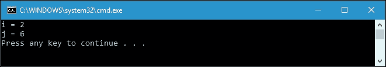
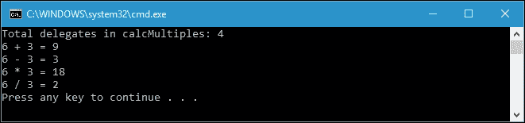
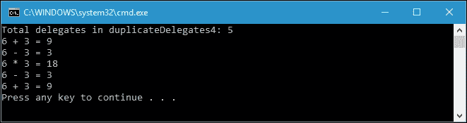
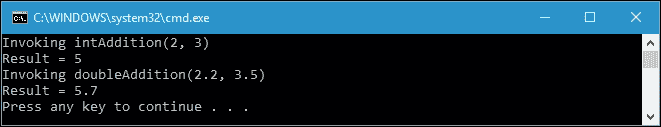
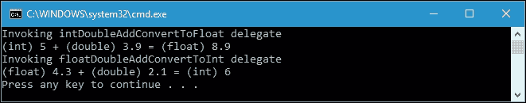
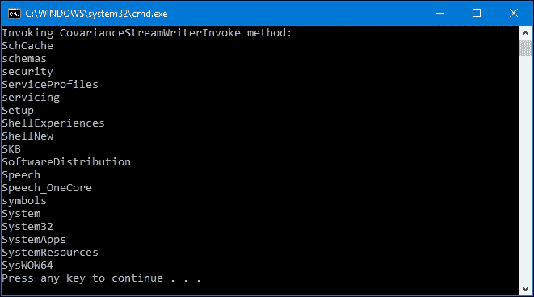
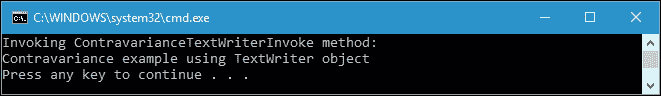

# 二、漫游委托

在前一章中，我们在创建的代码中应用了委托。当我们讨论函数式编程的概念时，我们应用了 C# 拥有的一个内置委托。在本章中，我们将通过讨论以下主题来深入研究将在函数式 C# 编程中大量使用的委托:

*   委托的定义、语法和使用
*   将委托组合成多播委托
*   使用内置委托
*   了解代表的差异

# 介绍代表

委托是 C# 中封装具有特定参数和返回类型(签名)的方法的数据类型。换句话说，委托将定义方法的参数和返回类型。委托类似于 C/C++中的函数指针，因为两者都存储对具有特定签名的方法的引用。像 C/C++中的函数指针一样，委托保存它引用的方法的内存地址。如果编译器引用了具有不同签名的函数，它将会抱怨。然而，由于 C++语言的非托管特性，人们可以将函数指向任意位置(通过强制转换)。

让我们看看下面的委托语法:

```cs
[AccessModifier] delegate ReturnType DelegateName([parameters]); 

```

以下是对前面委托语法的每个元素的解释:

*   **访问修饰符**:这是用于设置委托的可访问性的修饰符。它可以是公共的、私有的、内部的或受保护的。但是，我们可以省略它，如果我们这样做，默认修饰符将是内部的。
*   **委托**:这是我们初始化委托需要的关键字。
*   **ReturnType** :这是我们分配给这个委托的方法的返回数据类型。
*   **委托人名称**:这是委托人的身份。
*   **参数**:这是我们分配给这个委托的方法采用的参数列表。

通过参考前面的语法，我们可以初始化委托，例如，`SingleStringDelegate`:

```cs
public delegate void SingleStringDelegate(string dataString); 

```

由于我们有前面的委托，我们可以给委托分配一个拥有相同签名的方法。该方法可以如下:

```cs
private static void AssignData(string dataString) 
{ 
  globalString = dataString; 
} 

```

或者，方法可以如下:

```cs
private static void WriteToConsole(string dataText) 
{ 
  Console.WriteLine(dataText); 
} 

```

由于两种方法具有相同的签名，我们可以使用以下语法将它们分配给`SingleStringDelegate`:

```cs
SingleStringDelegate delegate1 = AssignData; 

```

前面的语法用于将`AssignData()`方法分配给类型化的变量`SingleStringDelegate`，对于`WriteToConsole()`方法，我们可以使用以下语法:

```cs
SingleStringDelegate delegate2 = WriteToConsole; 

```

### 注

为了能够区分委托名称和方法名称，通常以单词`Delegate`结尾命名委托类型，例如`SingleStringDelegate`。但是，它不是强制性的，我们可以省略它。

## 简单委托

关于委托的进一步讨论，我们来看看下面的方法，可以在`SimpleDelegates.csproj`找到:

```cs
public partial class Program 
{ 
  static int Rectangle(int a, int b) 
  { 
    return a * b; 
  } 
} 

```

前面代码中的`Rectangle()`方法可以分配给下面代码中给出的委托变量:

```cs
public partial class Program 
{ 
  private delegate int AreaCalculatorDelegate(int x, int y); 
} 

```

以下方法也可以分配给`AreaCalculatorDelegate`委托，因为方法的签名是委托类型所期望的:

```cs
public partial class Program 
{ 
  static int Square(int x, int y) 
  { 
    return x * y; 
  } 
} 

```

要将方法分配给委托，我们只需要创建一个委托数据类型的变量，该变量与要分配的方法具有签名兼容性。下面是`Main()`方法，将创建委托变量并调用该方法:

```cs
public partial class Program 
{ 
  static void Main(string[] args) 
  { 
    AreaCalculatorDelegate rect = Rectangle; 
    AreaCalculatorDelegate sqr = Square; 
    int i = rect(1, 2); 
    int j = sqr(2, 3); 
    Console.WriteLine("i = " + i); 
    Console.WriteLine("j = " + j); 
  } 
} 

```

从前面的代码中，我们创建了两个名为`rect`和`sqr`的变量，它们的类型是`AreaCalculatorDelegate`。下面是代码片段:

```cs
AreaCalculatorDelegate rect = Rectangle; 
AreaCalculatorDelegate sqr = Square; 

```

由于我们已经将`rect`和`sqr`变量分配给了`Rectangle()`和`Square()`方法，我们可以使用委托变量调用这些方法。让我们看看下面的代码片段:

```cs
int i = rect(1, 2); 
int j = sqr(2, 3); 

```

我们用`rect()`和`sqr()`的结果分配变量`i`和`j`。虽然两者都是变量名，但它们指的是方法地址位置。人们调用这些变量引用的方法来执行包含的逻辑。我们正在有效地执行两种`Console.WriteLine()`方法来产生以下输出:



读者现在很清楚为什么我们会显示前面截图中显示的输出。`rect`和`sqr`变量现在分别存储对`Rectangle()`和`Square()`方法的引用。我们实际上是在调用`rect`委托的同时调用`Rectangle()`方法，在调用`sqr`委托的同时调用`Square()`方法。

## 多播委托

我们刚刚讨论了一个简单的委托，其中我们为委托变量分配了一个特定的方法。我们可以称之为单播委托。然而，委托实际上可以使用一个变量调用多个方法。为此，我们可以将其称为多播委托。在多播委托的情况下，它就像存储在内部列表中的委托列表。当我们调用多播委托时，列表中的委托会以正确的顺序被同步调用。有几种方法可以创建多播委托。我们将详细讨论的两个是`Delegate.Combine()`和`Delegate.Remove()`方法以及`+=`和`-=`(增量和减量)运算符。

### 使用委托。组合()和委托。移除()方法

让我们首先检查下面的代码，使用`Delegate.Combine()`方法创建一个多播委托。假设我们有一个名为`CalculatorDelegate`的代表，如下所示，我们可以在`CombineDelegates.csproj`找到:

```cs
public partial class Program 
{ 
  private delegate void CalculatorDelegate(int a, int b); 
} 

```

然后，我们有以下四种与`CalculatorDelegate`签名相同的签名方法:

```cs
public partial class Program 
{ 
  private static void Add(int x, int y) 
  { 
    Console.WriteLine( 
      "{0} + {1} = {2}", 
      x, 
      y, 
      x + y); 
  } 
  private static void Subtract(int x, int y) 
  { 
    Console.WriteLine( 
      "{0} - {1} = {2}", 
      x, 
      y, 
      x - y); 
  } 
  private static void Multiply(int x, int y) 
  { 
    Console.WriteLine( 
      "{0} * {1} = {2}", 
      x, 
      y, 
      x * y); 
  } 
  private static void Division(int x, int y) 
  { 
    Console.WriteLine( 
      "{0} / {1} = {2}", 
      x, 
      y, 
      x / y); 
  } 
} 

```

方法有四种，分别是`Add()`、`Subtract()`、`Multiply()`、`Division()`。我们将在单个变量类型委托中强制转换这些方法。现在，看看下面`CombineDelegate()`实现这个目标的方法:

```cs
public partial class Program 
{ 
  private static void CombineDelegate() 
  { 
    CalculatorDelegate calcMultiples = 
      (CalculatorDelegate)Delegate.Combine( 
      new CalculatorDelegate[] { 
      Add, 
      Subtract, 
      Multiply, 
      Division }); 
    Delegate[] calcList = calcMultiples.GetInvocationList(); 
    Console.WriteLine( 
      "Total delegates in calcMultiples: {0}", 
      calcList.Length); 
    calcMultiples(6, 3); 
  } 
} 

```

如果我们运行此方法，将显示以下输出:



我们通过调用单个委托成功调用了四个方法。我们在前面的代码中调用的委托在下面的代码片段中:

```cs
calcMultiples(6, 3); 

```

实际上`calcMultiples` delegate 内部存储了四个 delegates 变量，对应于我们组合的每一个方法。借助`Delegate.Combine()`方法，我们可以使用以下语法组合委托:

```cs
CalculatorDelegate calcMultiples = 
  (CalculatorDelegate)Delegate.Combine( 
    new CalculatorDelegate[] { 
      Add, 
      Subtract, 
      Multiply, 
      Division }); 

```

我们也可以通过从委托变量中调用`GetInvocationList()`来创建委托数组。通过检索委托数组，我们可以像对普通数组一样迭代数组。我们可以检索`Length`属性来计算调用列表中有多少委托。

在多播委托中，我们可以组合委托，也可以从调用列表中移除委托。我们来看看下面的`RemoveDelegate()`方法:

```cs
public partial class Program 
{ 
  private static void RemoveDelegate() 
  { 
    CalculatorDelegate addDel = Add; 
    CalculatorDelegate subDel = Subtract; 
    CalculatorDelegate mulDel = Multiply; 
    CalculatorDelegate divDel = Division; 
    CalculatorDelegate calcDelegates1 = 
      (CalculatorDelegate)Delegate.Combine( 
      addDel, 
      subDel); 
    CalculatorDelegate calcDelegates2 = 
      (CalculatorDelegate)Delegate.Combine( 
      calcDelegates1, 
      mulDel); 
    CalculatorDelegate calcDelegates3 = 
      (CalculatorDelegate)Delegate.Combine( 
      calcDelegates2, 
      divDel); 
    Console.WriteLine( 
      "Total delegates in calcDelegates3: {0}", 
      calcDelegates3.GetInvocationList().Length); 
    calcDelegates3(6, 3); 
    CalculatorDelegate calcDelegates4 = 
      (CalculatorDelegate)Delegate.Remove( 
      calcDelegates3, 
      mulDel); 
    Console.WriteLine( 
      "Total delegates in calcDelegates4: {0}", 
      calcDelegates4.GetInvocationList().Length); 
    calcDelegates4(6, 3); 
  } 
} 

```

如果我们运行前面的方法，控制台中将显示以下输出:


类似于`CombineDelegate()`方法，我们在`RemoveDelegate()`方法中将这四个方法组合成一个单一变量类型的委托。`calcDelegates3`代表是保留四种方法的代表。事实上，当我们调用`calcDelegates3`时，它会以适当的顺序调用这四个方法。接下来，在`RemoveDelegate()`方法中，我们调用`Delegate.Remove()`方法，以便在调用列表中移除选定的委托。基于前面的代码，语法如下:

```cs
CalculatorDelegate calcDelegates4 = 
  (CalculatorDelegate)Delegate.Remove( 
  calcDelegates3, 
  mulDel); 

```

前面的代码片段用于从调用列表中移除`mulDel`委托变量。正如我们在显示`RemoveDelegate()`调用输出的上图中所看到的那样，`Multiply()`方法在从调用列表中删除后就不再被调用了。

与委托相关联的调用列表可以包含重复的条目。这意味着我们可以多次将同一个方法添加到调用列表中。现在，让我们通过向项目添加`DuplicateEntries()`方法来尝试将重复条目插入调用列表，如下所示:

```cs
public partial class Program 
{ 
  private static void DuplicateEntries() 
  { 
    CalculatorDelegate addDel = Add; 
    CalculatorDelegate subDel = Subtract; 
    CalculatorDelegate mulDel = Multiply; 
    CalculatorDelegate duplicateDelegates1 = 
      (CalculatorDelegate)Delegate.Combine( 
      addDel, 
      subDel); 
    CalculatorDelegate duplicateDelegates2 = 
      (CalculatorDelegate)Delegate.Combine( 
      duplicateDelegates1, 
      mulDel); 
    CalculatorDelegate duplicateDelegates3 = 
      (CalculatorDelegate)Delegate.Combine( 
      duplicateDelegates2, 
      subDel); 
    CalculatorDelegate duplicateDelegates4 = 
      (CalculatorDelegate)Delegate.Combine( 
      duplicateDelegates3, 
      addDel); 
    Console.WriteLine( 
      "Total delegates in duplicateDelegates4: {0}", 
      duplicateDelegates4.GetInvocationList().Length); 
      duplicateDelegates4(6, 3); 
  } 
} 

```

现在运行`DuplicateEntries()`方法，控制台会显示如下输出:



通过检查前面的代码，我们可以看到`duplicateDelegates2`变量包含三个调用方法，分别是`addDel`、`subDel`和`mulDel`。有关更多详细信息，请查看下面的代码片段:

```cs
CalculatorDelegate duplicateDelegates1 = 
  (CalculatorDelegate)Delegate.Combine( 
  addDel, 
  subDel); 
CalculatorDelegate duplicateDelegates2 = 
  (CalculatorDelegate)Delegate.Combine( 
  duplicateDelegates1, 
  mulDel); 

```

同样，我们将`subDel`和`addDel`添加到调用列表中，如下面的代码片段所示:

```cs
CalculatorDelegate duplicateDelegates3 = 
  (CalculatorDelegate)Delegate.Combine( 
  duplicateDelegates2, 
  subDel); 
CalculatorDelegate duplicateDelegates4 = 
  (CalculatorDelegate)Delegate.Combine( 
  duplicateDelegates3, 
  addDel); 

```

现在`duplicateDelegates4`的调用列表包含两个重复的方法。然而，当我们调用`DuplicateEntries()`方法时，`addDel`和`subDel`被调用两次，调用顺序就像我们将委托添加到调用列表的顺序一样。

### 注

`Delegate.Combine()`和`Delegate.Remove()`静态方法将返回`Delegate`数据类型，而不是`Delegate`本身的实例。因此，在使用这两种方法时，需要将它们的返回转换为预期的实例委托。

### 使用+=和-=运算符

使用`+=`和`-=`运算符创建多播委托非常容易，因为这就像在 C# 中处理任何数据类型一样。我们还可以使用`+`和`-`操作符在调用列表中添加和移除委托。以下是我们可以在`AddSubtractDelegates.csproj`找到的示例代码，用于组合委托，并使用运算符从调用列表中移除选定的委托:

```cs
public partial class Program 
{ 
  private static void AddSubtractDelegate() 
  { 
    CalculatorDelegate addDel = Add; 
    CalculatorDelegate subDel = Subtract; 
    CalculatorDelegate mulDel = Multiply; 
    CalculatorDelegate divDel = Division; 
    CalculatorDelegate multiDel = addDel + subDel; 
    multiDel += mulDel; 
    multiDel += divDel; 
    Console.WriteLine( 
      "Invoking multiDel delegate (four methods):"); 
    multiDel(8, 2); 
    multiDel = multiDel - subDel; 
    multiDel -= mulDel; 
    Console.WriteLine( 
      "Invoking multiDel delegate (after subtraction):"); 
    multiDel(8, 2); 
  } 
} 

```

我们还有前面项目中用到的四种方法:`CombineDelegates.csproj` : `Add()`、`Subtract()`、`Multiply()`和`Division()`。如果我们运行`AddSubtractDelegate()`方法，我们将获得以下输出:


在`AddSubtractDelegate()`方法的起始行中，我们为我们拥有的四个方法中的每一个创建四个类型化的变量`CalculatorDelegate`，就像我们在之前的项目中所做的那样。然后，我们再创建一个名为`multiDel`的变量来生成多播委托。在这里，我们可以看到，我们仅使用运算符将委托添加到多播委托变量中，其中我们使用了`+`和`+=`运算符。让我们看看下面的代码片段:

```cs
CalculatorDelegate multiDel = addDel + subDel; 
multiDel += mulDel; 
multiDel += divDel; 
Console.WriteLine( 
  "Invoking multiDel delegate (four methods):"); 
multiDel(8, 2); 

```

从前面的代码片段中，在将所有四个委托组合成`multiDel`委托后，我们调用`multiDel`委托，基于输出控制台显示，我们得到的是以适当顺序调用这四个方法的程序。四法为`Add()`、`Subtract()`、`Multiply()`、`Division()`。

为了从调用列表中移除委托，我们在前面的代码中使用了`-`和`-=`运算符。让我们看一下下面的代码片段，检查我们必须做什么来移除委托:

```cs
multiDel = multiDel - subDel; 
multiDel -= mulDel; 
Console.WriteLine( 
  "Invoking multiDel delegate (after subtraction):"); 
multiDel(8, 2); 

```

由于我们已经从调用列表中移除了`subDel`和`mulDel`委托，当我们调用`mulDel`委托时，程序只调用两个方法，即`Add()`和`Division()`方法。这证明我们已经使用`-`和`-=`操作符成功地从调用列表中移除了委托。

### 类型

使用`+=`和`-=`来分配多播委托不符合函数式编程方法，因为它打破了不变性概念。但是，我们仍然可以使用`+`和`-`操作符向调用列表添加委托，并以函数方式从调用列表中连续移除委托。

# 内置代表

在 C# 中，我们不仅能够声明委托，还能够使用 C# 标准库中的内置委托。这个内置委托也适用于泛型数据类型，所以在讨论内置委托之前，让我们先讨论泛型委托。

## 普通代表

委托类型可以使用泛型类型作为其参数。使用泛型类型，我们可以推迟在参数或返回值中指定一个或多个类型，直到委托被初始化为变量。换句话说，当我们定义委托类型时，我们不指定委托参数和返回值的数据类型。为了更详细地讨论这一点，让我们看看下面的代码，我们可以在`GenericDelegates.csproj`找到它:

```cs
public partial class Program 
{ 
  private delegate T FormulaDelegate<T>(T a, T b); 
} 

```

我们有一个使用泛型数据类型的委托名`FormulaDelegate`。如我们所见，有一个`T`符号，它代表我们在声明变量类型`FormulaDelegate`时将定义的数据类型。我们继续添加以下两种签名完全不同的方法:

```cs
public partial class Program 
{ 
  private static int AddInt(int x, int y) 
  { 
    return x + y; 
  } 
  private static double AddDouble(double x, double y) 
  { 
    return x + y; 
  } 
} 

```

现在让我们看一下下面的代码，以解释我们如何声明变量类型的委托并从委托调用方法:

```cs
public partial class Program 
{ 
  private static void GenericDelegateInvoke() 
  { 
    FormulaDelegate<int> intAddition = AddInt; 
    FormulaDelegate<double> doubleAddition = AddDouble; 
    Console.WriteLine("Invoking intAddition(2, 3)"); 
    Console.WriteLine( 
      "Result = {0}", 
      intAddition(2, 3)); 
    Console.WriteLine("Invoking doubleAddition(2.2, 3.5)"); 
    Console.WriteLine( 
      "Result = {0}", 
      doubleAddition(2.2, 3.5)); 
  } 
} 

```

当我们运行`GenericDelegateInvoke()`方法时，控制台中将显示以下结果:



从前面的代码中，我们可以只使用一种委托类型来声明两个具有不同签名的方法。`intAddition`委托是指`AddInt()`方法，该方法在其参数和返回值中应用`int`数据类型，而`doubleAddition`委托是指`AddDouble()`方法，该方法在其参数和返回值中应用`double`数据类型。但是，为了让委托知道它所引用的方法的数据类型，我们必须在初始化委托时定义尖括号(`<>`)中的数据类型。下面的代码片段是使用泛型数据类型(用尖括号表示)的委托初始化:

```cs
FormulaDelegate<int> intAddition = AddInt; 
FormulaDelegate<double> doubleAddition = AddDouble; 

```

因为我们已经定义了数据类型，委托可以匹配它引用的方法的数据类型。这就是为什么，从输出控制台，我们可以调用具有不同签名的两个方法。

我们已经成功地为委托使用了泛型类型，应用了一个泛型模板。下面的代码，我们可以在`MultiTemplateDelegates.csproj`找到，向我们展示了委托也可以在一个委托声明中应用多通用模板:

```cs
public partial class Program 
{ 
  private delegate void AdditionDelegate<T1, T2>( 
    T1 value1, T2 value2); 
} 

```

前面的代码将创建一个名为`AdditionDelegate`的新委托，它有两个参数和两种不同的数据类型。`T1`和`T2`代表将在变量类型委托声明中定义的数据类型。现在，让我们创建两个具有不同签名的方法，如下所示:

```cs
public partial class Program 
{ 
  private static void AddIntDouble(int x, double y) 
  { 
    Console.WriteLine( 
      "int {0} + double {1} = {2}", 
      x, 
      y, 
      x + y); 
  } 
  private static void AddFloatDouble(float x, double y) 
  { 
    Console.WriteLine( 
      "float {0} + double {1} = {2}", 
      x, 
      y, 
      x + y); 
  } 
} 

```

要将`AdditionDelegate`委托引用到`AddIntDouble()`和`AddFloatDouble()`方法并调用委托，我们可以创建`VoidDelegateInvoke()`方法，如下所示:

```cs
public partial class Program 
{ 
  private static void VoidDelegateInvoke() 
  { 
    AdditionDelegate<int, double> intDoubleAdd = 
      AddIntDouble; 
    AdditionDelegate<float, double> floatDoubleAdd = 
      AddFloatDouble; 
    Console.WriteLine("Invoking intDoubleAdd delegate"); 
    intDoubleAdd(1, 2.5); 
    Console.WriteLine("Invoking floatDoubleAdd delegate"); 
    floatDoubleAdd((float)1.2, 4.3); 
  } 
} 

```

如果我们运行`VoidDelegateInvoke()`方法，我们将在控制台上看到以下输出:


从前面的控制台输出可以看出，我们已经成功调用了`intDoubleAdd`和`floatDoubleAdd`委托，尽管它们有不同的方法签名。这是可能的，因为我们在`AdditionDelegate`代表中应用了`T1`和`T2`模板。

让我们再次尝试创建多模板委托，但这一次，我们使用了具有返回值的方法。该代表的声明如下:

```cs
public partial class Program 
{ 
  private delegate TResult AddAndConvert<T1, T2, TResult>( 
    T1 digit1, T2 digit2); 
} 

```

然后，我们将两种方法`AddIntDoubleConvert()`和`AddFloatDoubleConvert()`添加到我们的项目中:

```cs
public partial class Program 
{ 
  private static float AddIntDoubleConvert(int x, double y) 
  { 
    float result = (float)(x + y); 
    Console.WriteLine( 
      "(int) {0} + (double) {1} = (float) {2}", 
      x, 
      y, 
      result); 
    return result; 
  } 
  private static int AddFloatDoubleConvert(float x, double y) 
  { 
    int result = (int)(x + y); 
    Console.WriteLine( 
      "(float) {0} + (double) {1} = (int) {2}", 
      x, 
      y, 
      result); 
    return result; 
  } 
} 

```

为了使用`AddAndConvert`委托，我们可以创建`ReturnValueDelegateInvoke()`方法，如下所示:

```cs
public partial class Program 
{ 
  private static void ReturnValueDelegateInvoke() 
  { 
    AddAndConvert<int, double, float>
        intDoubleAddConvertToFloat = AddIntDoubleConvert; 
    AddAndConvert<float, double, int>
        floatDoubleAddConvertToInt = AddFloatDoubleConvert; 
    Console.WriteLine("Invoking intDoubleAddConvertToFloat delegate"); 
    float f = intDoubleAddConvertToFloat(5, 3.9); 
    Console.WriteLine("Invoking floatDoubleAddConvertToInt delegate"); 
    int i = floatDoubleAddConvertToInt((float)4.3, 2.1); 
  } 
} 

```

当我们调用`ReturnValueDelegateInvoke()`方法时，我们得到如下输出:



同样，我们使用多模板泛型类型成功调用了两种不同的签名方法。

## 动作和功能委托

让我们回到本章前面讨论的以下委托声明:

```cs
public partial class Program 
{ 
  private delegate void AdditionDelegate<T1, T2>( 
    T1 value1, T2 value2); 
} 

```

C# 有一个内置委托，最多可以接受 16 个参数并返回 void。它被称为`Action`代表。换句话说，`Action`委托将指向一个不返回任何内容并接受零个、一个或多个输入参数的方法。由于`Action`委托的存在，我们不再需要声明委托，我们可以立即为委托分配任何方法。我们可以修改前面的`MultiTemplateDelegates.csproj`项目并删除`AdditionDelegate`代表，因为我们现在将使用`Action`代表。然后将`MultiTemplateDelegates.csproj`中的`ActionDelegateInvoke()`方法修改为`ActionDelegateInvoke()`，实现如下:

```cs
public partial class Program 
{ 
  private static void ActionDelegateInvoke() 
  { 
    Action<int, double> intDoubleAddAction = 
      AddIntDouble; 
    Action<float, double> floatDoubleAddAction = 
      AddFloatDouble; 
    Console.WriteLine( 
      "Invoking intDoubleAddAction delegate"); 
    intDoubleAddAction(1, 2.5); 
    Console.WriteLine( 
      "Invoking floatDoubleAddAction delegate"); 
    floatDoubleAddAction((float)1.2, 4.3); 
  } 
} 

```

我们可以在`ActionFuncDelegates.csproj`项目中找到前面的代码。如我们所见，现在我们应用`Action`代表替换`MultiTemplateDelegates.csproj`项目中的`AdditionDelegate`代表，如下所示:

```cs
Action<int, double> intDoubleAddAction = 
  AddIntDouble; 
Action<float, double> floatDoubleAddAction = 
  AddFloatDouble; 

```

C# 有另一个内置委托，该委托通过接受最多 16 个参数而具有返回值。他们是代表。让我们回到`MultiTemplateDelegates.csproj`项目，找到以下代表:

```cs
public partial class Program 
{ 
  private delegate TResult AddAndConvert<T1, T2, TResult>( 
    T1 digit1, T2 digit2); 
} 

```

我们可以删除前面的委托，因为它与`Func`委托的声明相匹配。因此，我们可以修改`MultiTemplateDelegates.csproj`项目中的`ReturnValueDelegateInvoke()`方法，使其成为`FuncDelegateInvoke()`方法，实现如下:

```cs
public partial class Program 
{ 
  private static void FuncDelegateInvoke() 
  { 
    Func<int, double, float> 
       intDoubleAddConvertToFloatFunc = 
          AddIntDoubleConvert; 
    Func<float, double, int> 
       floatDoubleAddConvertToIntFunc = 
          AddFloatDoubleConvert; 
    Console.WriteLine( 
      "Invoking intDoubleAddConvertToFloatFunc delegate"); 
    float f = intDoubleAddConvertToFloatFunc(5, 3.9); 
    Console.WriteLine( 
      "Invoking floatDoubleAddConvertToIntFunc delegate"); 
    int i = floatDoubleAddConvertToIntFunc((float)4.3, 2.1); 
  } 
} 

```

现在，我们不再需要`AddAndConvert`代表，因为我们已经应用了`Func`代表，如下所示:

```cs
Func<int, double, float> 
  intDoubleAddConvertToFloatFunc = AddIntDoubleConvert; 
Func<float, double, int> 
  floatDoubleAddConvertToIntFunc = AddFloatDoubleConvert; 

```

使用`Action`和`Func`内置委托，代码变得更短，委托的定义变得更容易和更快。

# 区分委托中的差异

泛型委托能够由对委托具有不匹配签名的方法分配。我们可以称之为委托中的差异。委托中有两个方差，它们是协方差和逆变。协方差允许方法具有比委托中定义的返回类型更派生(子类型)的返回类型。另一方面，contravariance 允许方法具有比委托中定义的参数类型更少派生(超类型)的参数类型。

## 协方差

下面是委托中协方差的一个例子，我们可以在`Covariance.csproj`项目中找到。首先，我们初始化以下委托:

```cs
public partial class Program 
{ 
  private delegate TextWriter CovarianceDelegate(); 
} 

```

我们现在有一个委托返回`TextWriter`数据类型。然后，我们还创建了返回`StreamWriter`对象的`StreamWriterMethod()`方法，其实现如下:

```cs
public partial class Program
{
  private static StreamWriter StreamWriterMethod()
  {
    DirectoryInfo[] arrDirs =
       new DirectoryInfo(@"C:\Windows")
    .GetDirectories(
       "s*", 
        SearchOption.TopDirectoryOnly);

    StreamWriter sw = new StreamWriter(
    Console.OpenStandardOutput());

    foreach (DirectoryInfo dir in arrDirs)
    {
      sw.WriteLine(dir.Name);
    }

    return sw;
   }
}

```

我们也创建了`StringWriterMethod()`方法，返回`StringWriter`对象，实现如下:

```cs
public partial class Program 
{ 
  private static StringWriter StringWriterMethod() 
  { 
    StringWriter strWriter = new StringWriter(); 
    string[] arrString = new string[]{ 
      "Covariance", 
      "example", 
      "using", 
      "StringWriter", 
      "object" 
    }; 
    foreach (string str in arrString) 
    { 
      strWriter.Write(str); 
      strWriter.Write(' '); 
    } 
    return strWriter; 
  } 
} 

```

现在，我们有两种方法返回不同的对象，`StreamWriter`和`StringWriter`。这些方法的返回值数据类型也不同，`CovarianceDelegate`委托返回`TextWriter`对象。但是，由于`StreamWriter`和`StringWriter`是从`TextWriter`对象派生的，我们可以应用协方差将这两种方法分配给`CovarianceDelegate`委托。

Here is the `CovarianceStreamWriterInvoke()` method implementation, which assigns the `StreamWriterMethod()` method to the `CovarianceDelegate` delegate:

```cs
public partial class Program 
{ 
  private static void CovarianceStreamWriterInvoke() 
  { 
    CovarianceDelegate covDelegate; 
    Console.WriteLine( 
      "Invoking CovarianceStreamWriterInvoke method:"); 
      covDelegate = StreamWriterMethod; 
    StreamWriter sw = (StreamWriter)covDelegate(); 
    sw.AutoFlush = true; 
    Console.SetOut(sw); 
  } 
} 

```

在`StreamWriterMethod()`方法中，我们创建`StreamWriter`，使用以下代码将内容写入控制台:

```cs
StreamWriter sw = new StreamWriter( 
  Console.OpenStandardOutput()); 

```

然后，在`CovarianceStreamWriterInvoke()`方法中，我们调用此代码以便将内容写入控制台:

```cs
sw.AutoFlush = true; 
Console.SetOut(sw); 

```

如果我们运行`CovarianceStreamWriterInvoke()`方法，控制台中将显示以下输出:



从前面的输出控制台，我们提供了 Visual Studio 2015 安装路径中的目录列表。事实上，如果您安装了不同版本的 Visual Studio，您可能会有不同的列表。

现在，我们将利用`StringWriterMethod()`方法创建一个`CovarianceDelegate`委托。我们创建了`CovarianceStringWriterInvoke()`方法，其实现如下:

```cs
public partial class Program 
{ 
  private static void CovarianceStringWriterInvoke() 
  { 
    CovarianceDelegate covDelegate; 
    Console.WriteLine( 
      "Invoking CovarianceStringWriterInvoke method:"); 
    covDelegate = StringWriterMethod; 
    StringWriter strW = (StringWriter)covDelegate(); 
    Console.WriteLine(strW.ToString()); 
  } 
} 

```

我们使用以下代码在`StringWriterMethod()`方法中生成了`StringWriter`:

```cs
StringWriter strWriter = new StringWriter(); 
string[] arrString = new string[]{ 
  // Array of string 
}; 
foreach (string str in arrString) 
{ 
  strWriter.Write(str); 
  strWriter.Write(' '); 
} 

```

然后，我们调用以下代码将字符串写入控制台:

```cs
Console.WriteLine(strW.ToString()); 

```

如果运行`CovarianceStringWriterInvoke()`方法，将显示我们在`StringWriterMethod()`方法的`arrString`字符串数组中定义的字符串，如下所示:


现在，从我们对协方差的讨论中，我们已经证明了委托中的协方差。返回`TextWriter`的`CovarianceDelegate`委托可以分配给返回`StreamWriter`和`StringWriter`的方法。下面的代码片段取自前面的几个代码，以总结委托中的协方差:

```cs
private delegate TextWriter CovarianceDelegate(); 
CovarianceDelegate covDelegate; 
covDelegate = StreamWriterMethod; 
covDelegate = StringWriterMethod; 

```

## 反差

现在，让我们通过讨论对比方差来继续讨论代表中的方差。以下是`ContravarianceDelegate`委托声明，可以在`Contravariance.csproj`项目中找到:

```cs
public partial class Program 
{ 
  private delegate void ContravarianceDelegate(StreamWriter sw); 
} 

```

前面的委托将被分配给下面的方法，该方法具有`TextWriter`数据类型参数，如下所示:

```cs
public partial class Program 
{ 
  private static void TextWriterMethod(TextWriter tw) 
  { 
    string[] arrString = new string[]{ 
      "Contravariance", 
      "example", 
      "using", 
      "TextWriter", 
      "object" 
    }; 
    tw = new StreamWriter(Console.OpenStandardOutput()); 
    foreach (string str in arrString) 
    { 
      tw.Write(str); 
      tw.Write(' '); 
    } 
    tw.WriteLine(); 
    Console.SetOut(tw); 
    tw.Flush(); 
  } 
} 

```

任务如下:

```cs
public partial class Program 
{ 
  private static void ContravarianceTextWriterInvoke() 
  { 
    ContravarianceDelegate contravDelegate = TextWriterMethod; 
    TextWriter tw = null; 
    Console.WriteLine( 
      "Invoking ContravarianceTextWriterInvoke method:"); 
    contravDelegate((StreamWriter)tw); 
  } 
} 

```

如果我们运行`ContravarianceTextWriterInvoke()`方法，控制台将显示以下输出:



从前面的输出中，我们已经成功地分配了一个方法，将`TextWriter`参数分配给了采用`StreamWriter`参数的委托。发生这种情况是因为`StreamWriter`来源于`TextWriter`。让我们看看下面的代码片段:

```cs
private delegate void ContravarianceDelegate(StreamWriter sw); 
private static void TextWriterMethod(TextWriter tw) 
{ 
  // Implementation 
} 
ContravarianceDelegate contravDelegate = TextWriterMethod; 
TextWriter tw = null; 
contravDelegate((StreamWriter)tw); 

```

前面的代码片段取自我们在 contravariance 中讨论的代码。在这里，我们可以看到`contravDelegate`，一个类型化的变量`ContravarianceDelegate`，可以被分配给`TextWriterMethod()`方法，即使它们都有不同的签名。这是因为`StreamWriter`来源于`TextWriter`对象。既然`TextWriterMethod()`方法可以处理`TextWriter`数据类型，那么它也一定可以处理`StreamWriter`数据类型。

# 总结

委托对于封装方法很有用。它就像 C# 中的任何数据类型一样，其中一个变量可以被初始化为委托数据类型。因为它类似于数据类型，所以增量和减量操作可以应用于委托，使得从几个委托创建多播委托成为可能。但是，有一点要记住，由于`Delegate.Combine()`和`Delegate.Remove()`方法返回`Delegate`数据类型，所以我们在使用它们时必须将这两种方法的返回转换为预期的实例委托。然而，与使用的`+=`和`-=`运算符相比，由于它们是在编译器的语言级别上实现的，并且委托类型是已知的，因此没有必要强制转换递增和递减委托操作的结果。

C# 还内置了委托，`Action`和`Func`，使得代码变得更短，委托的定义变得更简单快捷。结果，代码变得更容易分析。此外，委托的使用存在两种差异；协方差和逆变，这将允许我们为委托分配一个方法。协方差允许方法具有比委托中定义的返回类型更派生的返回类型，而逆变允许方法具有比委托中定义的参数类型派生更少的参数类型。

我们现在对代表有了更好的理解。让我们进入下一章，我们将利用委托的力量，使用 lambda 表达式来表示匿名方法。