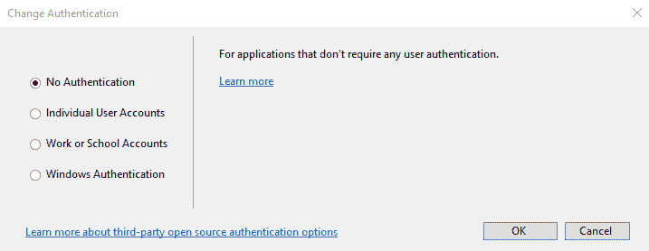
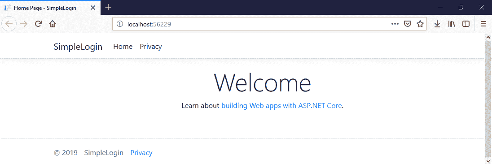
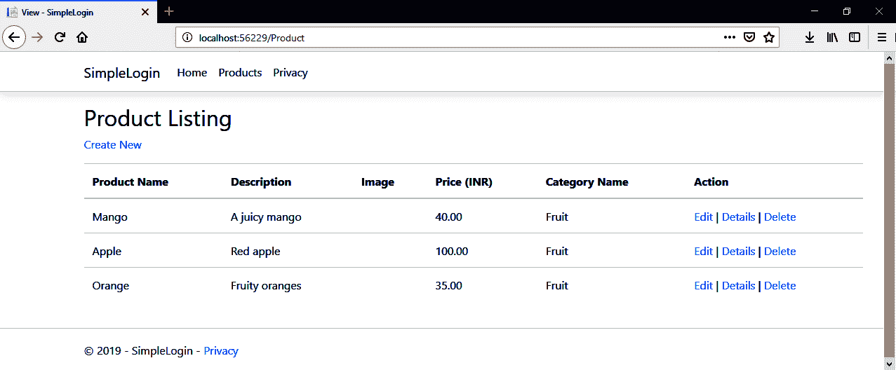
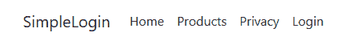
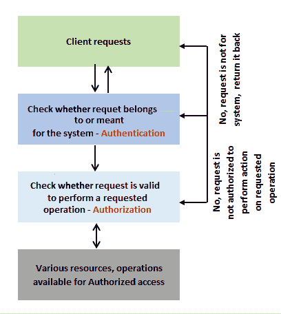
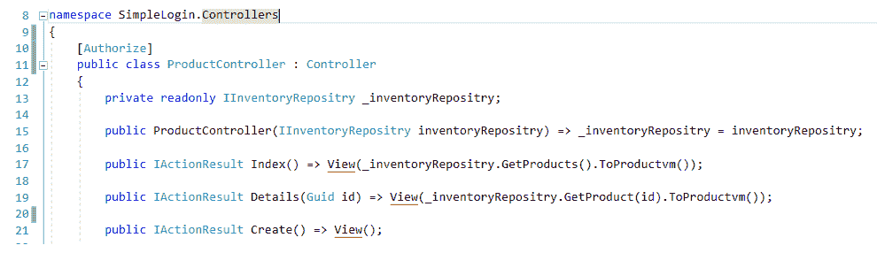
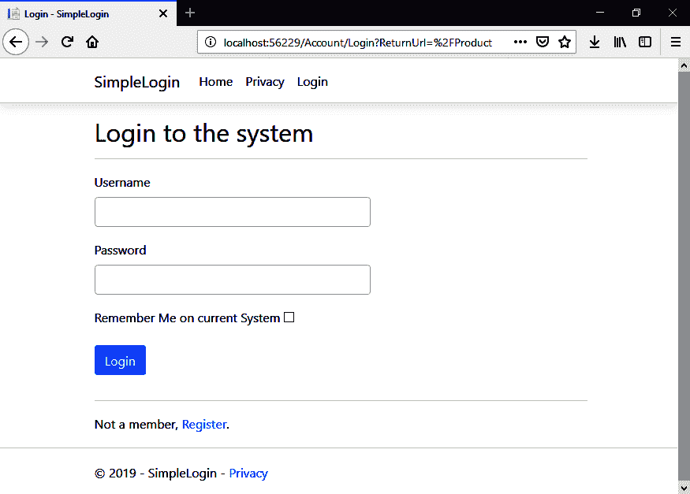
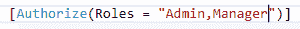
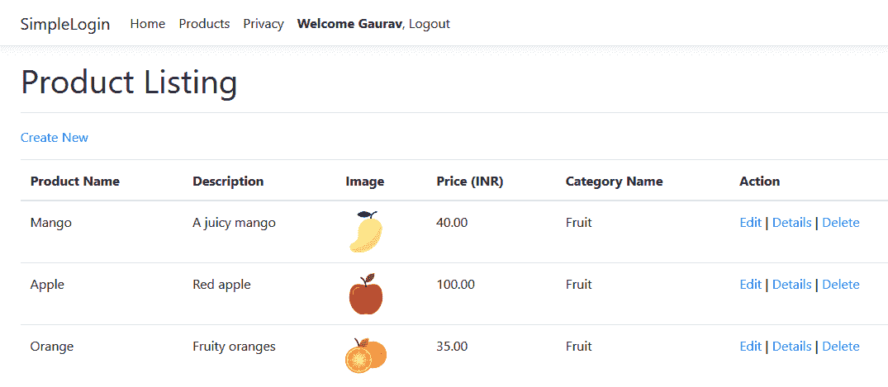
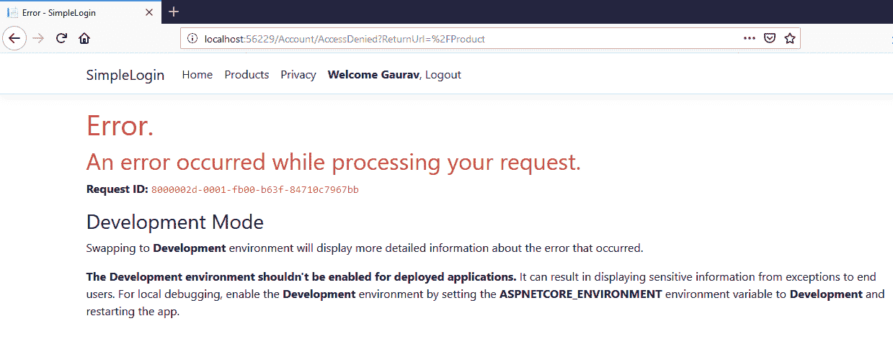

# 七、Web 应用设计模式的实现——第 2 部分

在上一章中，我们将 FlixOne 库存管理控制台应用扩展到 web 应用，同时演示了不同的模式。我们还介绍了**用户界面**（**UI**）架构模式，如**模型视图控制器**（**MVC**）、**模型视图演示器**（**MVP**等。上一章旨在讨论 MVC 等模式。我们现在需要扩展现有的应用，以包含更多的模式。

在本章中，我们将继续使用现有的 FlixOne web 应用，并通过编写代码来扩展应用，以查看身份验证和授权的实现。除此之外，我们将讨论**测试驱动开发**（**TDD**。

在本章中，我们将介绍以下主题：

*   认证和授权
*   创建.NETCore web 测试项目

# 技术要求

本章包含各种代码示例来解释这些概念。代码保持简单，仅用于演示目的。大多数示例都涉及用 C# 编写的.NETCore 控制台应用。

要运行和执行代码，Visual Studio 2019 是一个先决条件（您也可以使用 Visual Studio 2017 运行应用）。

# 安装 Visual Studio

要运行这些代码示例，您需要安装 Visual Studio（首选的**集成开发环境**（**IDE**）。要执行此操作，请遵循以下说明：

1.  从以下下载链接下载 Visual Studio，其中包含安装说明：[https://docs.microsoft.com/en-us/visualstudio/install/install-visual-studio](https://docs.microsoft.com/en-us/visualstudio/install/install-visual-studio) 。
2.  按照您在此处找到的安装说明进行操作。Visual Studio 安装有多个版本。这里，我们使用的是 Visual Studio for Windows。

# 设置.NETCore

如果未安装.NET Core，则需要遵循以下说明：

1.  使用[下载.NET Core for Windowshttps://www.microsoft.com/net/download/windows](https://www.microsoft.com/net/download/windows) 。
2.  有关多个版本和相关库，请访问[https://dotnet.microsoft.com/download/dotnet-core/2.2](https://dotnet.microsoft.com/download/dotnet-core/2.2) 。

# 安装 SQL Server

如果未安装 SQL Server，则需要按照以下说明操作：

1.  从以下链接下载 SQL Server:[https://www.microsoft.com/en-in/download/details.aspx?id=1695](https://www.microsoft.com/en-in/download/details.aspx?id=1695) 。
2.  您可以在此处找到安装说明：[https://docs.microsoft.com/en-us/sql/ssms/download-sql-server-management-studio-ssms?view=sql-服务器-2017](https://docs.microsoft.com/en-us/sql/ssms/download-sql-server-management-studio-ssms?view=sql-server-2017)。

For troubleshooting and for more information, refer to the following link: [https://www.blackbaud.com/files/support/infinityinstaller/content/installermaster/tkinstallsqlserver2008r2.htm](https://www.blackbaud.com/files/support/infinityinstaller/content/installermaster/tkinstallsqlserver2008r2.htm).

The complete source code is available from the following link: [https://github.com/PacktPublishing/Hands-On-Design-Patterns-with-C-and-.NET-Core/tree/master/Chapter7](https://github.com/PacktPublishing/Hands-On-Design-Patterns-with-C-and-.NET-Core/tree/master/Chapter7).

# 扩展.NETCore web 应用

在本章中，我们将继续使用 FlixOne 库存应用。在本章中，我们将讨论 web 应用模式，并扩展我们在前一章中开发的 web 应用。

This chapter continues with the web application developed in the previous chapter. If you skipped the previous chapter, please revisit it to Synchronization with the current chapter.

在本节中，我们将经历需求收集的过程，然后讨论我们以前开发的 web 应用面临的各种挑战。

# 项目启动

在[第 6 章](06.html)中*实现 Web 应用的设计模式–第 1 部分*中，我们扩展了 FlixOne 库存控制台应用，并开发了一个 Web 应用。考虑到以下几点后，我们扩展了应用：

*   我们的业务需要丰富的用户界面。
*   新的机遇需要响应迅速的 web 应用。

# 要求

在与管理层、**业务分析师**（**BAs**）和售前人员进行多次会议和讨论后，管理层决定制定以下高层要求：**业务要求**和**技术要求**。

# 业务要求

业务团队最终提出了以下业务需求：

*   **产品分类**：有几种产品，但如果用户想要搜索特定的产品，可以通过按类别过滤所有产品来实现。例如，芒果、香蕉等产品应归入一个名为`Fruits`的类别。
*   **产品添加**：应该有一个界面，为我们提供添加新产品的功能。此功能应仅对具有`Add Products`权限的用户可用。

*   **产品更新**：应该有一个新的界面，可以进行产品更新。
*   **产品删除**：管理员需要删除产品。

# 技术要求

满足业务需求的实际需求现在已准备好进行开发。在与业务人员进行多次讨论后，我们得出以下结论：

*   **您应该有一个登录页或主页**：
    *   应该是包含各种小部件的仪表板
    *   应该显示商店的概览图
*   **您应该有一个产品页面**：
    *   应具有添加、更新和删除产品的功能
    *   应具有添加、更新和删除产品类别的功能

The FlixOne Inventory Management web application is an imaginary product. We are creating this application to discuss the various design patterns required/used in web projects.

# 挑战

尽管我们已经将现有的控制台应用扩展到一个新的 web 应用，但它对开发人员和企业都有各种各样的挑战。在本节中，我们将讨论这些挑战，然后找出克服这些挑战的解决方案。

# 开发人员面临的挑战

以下是由于应用中的重大更改而产生的挑战。这也是将控制台应用升级为 web 应用的主要扩展的结果：

*   **不支持 TDD**：目前解决方案中没有包含测试项目。因此，开发人员不能遵循 TDD 方法，这可能会导致应用中出现更多错误。

*   **安全**：在当前应用中，没有任何机制限制或允许用户提供对应用特定屏幕或模块的访问。也没有与身份验证和授权相关的内容。
*   **UI 和用户体验（UX）**：我们的应用是从基于控制台的应用升级而来的，所以 UI 不是很丰富。

# 企业面临的挑战

实现最终输出需要时间，这会延迟产品，导致业务损失。当我们采用新技术堆栈时，会出现以下挑战，并且代码中有大量更改：

*   **客户流失**：在这里，我们仍处于发展阶段，但对我们业务的需求非常高；然而，开发团队交付产品的时间比预期的要长。
*   **发布生产更新需要更多时间**：目前开发工作非常耗时，这会延迟后续活动，导致生产延迟。

# 找到问题/挑战的解决方案

在几次会议和头脑风暴会议之后，开发团队得出结论，我们必须稳定基于 web 的解决方案。为了克服这些挑战并提供解决方案，技术团队和业务团队共同确定各种解决方案和要点。

该解决方案支持以下几点：

*   实现身份验证和授权
*   跟踪 TDD
*   重新设计 UI 以满足用户体验

# 认证和授权

在上一章中，我们开始将控制台应用升级为 web 应用，我们添加了**创建、读取、更新和删除**（**CRUD**操作），任何能够执行这些操作的用户都可以公开使用这些操作。没有任何代码限制特定用户执行这些操作。这样做的风险在于，不应该执行这些操作的用户可以轻松地执行这些操作。其后果如下：

*   无人值守访问
*   为黑客/攻击者打开的大门
*   数据泄漏问题

现在，如果我们热衷于保护我们的应用并将操作限制为仅允许的用户，那么我们必须实现只允许这些用户执行操作的设计。在某些情况下，我们可能允许对一些操作进行开放访问。在我们的例子中，大多数操作仅用于受限访问。简单地说，我们可以尝试告诉我们的应用，传入的用户是属于我们的应用并可以执行指定任务的用户。

**Authentication** is simply a process in which a system verifies or identifies the incoming requests through credentials (generally a user ID and password). If the system finds that the provided credentials are wrong, then it notifies the user (generally via a message on the GUI screen) and terminates the authorization process.
**Authorization** always comes after authentication. This is a process that allows the authenticated user who raised the request to access resources or data after verifying that they have access to the specific resources or data.

在前一段中，我们讨论了一些机制，这些机制阻止对应用操作的无人参与访问。让我们参考下图并讨论其显示的内容：


上图描述了系统不允许无人值守访问的场景。这简单地定义如下：接收传入请求，内部系统（身份验证机制）检查请求是否经过身份验证。如果请求经过身份验证，则允许用户执行其授权的操作。这不仅仅是一次检查，对于一个典型的系统来说，授权是在身份验证之后进行的。我们将在接下来的章节中讨论这一点。

为了更好地理解这一点，让我们编写一个简单的登录应用。让我们按照这里给出的步骤进行操作：

1.  开放 Visual Studio 2018。
2.  打开文件|新建|新建项目。
3.  在“项目”窗口中，为项目命名。

4.  为 Web 应用（模型视图控制器）模板选择 ASP.NET Core 2.2：


5.  可以选择作为所选模板一部分的各种身份验证。
6.  默认情况下，模板提供了一个名为 No Authentication 的选项，如下所示：



7.  按*F5*并运行应用。从这里，您将看到默认主页：



您现在会注意到，您可以在没有任何限制的情况下浏览每个页面。这是显而易见的，而且是有意义的，因为这些页面是开放访问的。主页和隐私页面是开放访问的，不需要任何身份验证，这意味着任何人都可以访问/查看这些页面。另一方面，我们可能会有一些页面用于无人参与的访问，例如用户配置文件和管理页面。

Refer to the GitHub repository for the chapter at [https://github.com/PacktPublishing/Hands-On-Design-Patterns-with-C-and-.NET-Core/tree/master/Chapter6](https://github.com/PacktPublishing/Hands-On-Design-Patterns-with-C-and-.NET-Core/tree/master/Chapter6), and go through the entire application that we have built using ASP.NET Core MVC.

为了继续我们的 SimpleLogin 应用，让我们添加一个用于受限访问的屏幕：产品屏幕。在本章中，我们将不讨论如何向现有项目添加新的控制器或视图。如果您想知道我们如何将这些添加到我们的项目中，请重温[第 6 章](06.html)，*实现 Web 应用设计模式–第 1 部分*。

我们在项目中添加了新功能，以展示具有 CRUD 操作的产品。现在，点击*F5*并检查输出：


您将获得上一个屏幕截图中显示的输出。您可能会注意到，我们现在有一个名为“产品”的新菜单。

让我们浏览一下新的菜单选项。单击产品菜单：



上一个屏幕截图显示了我们的产品页面。此页面可供所有人使用，任何人都可以不受任何限制地查看。您可能会看到，此页面具有创建新产品、编辑和删除现有产品的功能。现在，想象一个场景，一个未知的用户来删除一个非常重要并且吸引了大量销量的特定产品。你可以想象这种情况，以及这对一项业务的阻碍程度。甚至有可能失去客户。

在我们的场景中，我们可以通过两种方式保护产品页面：

*   **事先认证**：在本页面上，产品链接不是每个人都可以使用的；它仅适用于经过身份验证的请求/用户。
*   **认证后**：在该页面上，每个人都可以看到产品的链接。但是，一旦有人请求访问该页面，系统将执行身份验证检查。

# 正在进行的身份验证

在本节中，我们将了解如何实现身份验证，并使我们的网页限制未经身份验证的请求。

为了实现身份验证，我们应该采用某种机制，为我们提供一种对用户进行身份验证的方法。在一般情况下，如果用户已登录，则表示他们已通过身份验证。

在我们的 web 应用中，我们也将遵循相同的方法，确保用户在访问受限制的页面、视图和操作之前已登录：

```cs
public class User
{
    public Guid Id { get; set; }
    public string UserName { get; set; }
    public string EmailId { get; set; }
    public string FirstName { get; set; }
    public string LastName { get; set; }
    public byte[] PasswordHash { get; set; }
    public byte[] PasswordSalt { get; set; }
    public string SecretKey { get; set; }
    public string Mobile { get; set; }
    public string EmailToken { get; set; }
    public DateTime EmailTokenDateTime { get; set; }
    public string OTP { get; set; }
    public DateTime OtpDateTime { get; set; }
    public bool IsMobileVerified { get; set; }
    public bool IsEmailVerified { get; set; }
    public bool IsActive { get; set; }
    public string Image { get; set; }
}
```

前面的类是一个典型的`User`模型/实体，它表示我们的数据库`User`表。此表将保留有关`User`的所有信息。以下是每个字段的外观：

*   `Id`是表中的**全局唯一标识符**（**GUID**）和主键。
*   `UserName`通常在登录和其他相关操作期间使用。它是以编程方式生成的字段。
*   `FirstName`和`LastName`组合了用户的全名。
*   `Emailid`是用户的有效电子邮件 ID。这应该是一封有效的电子邮件，因为我们将在注册后/注册过程中对此进行验证。
*   `PasswordHash`和`PasswordSalt`是基于**基于哈希的消息认证码、安全哈希算法**（**HMAC****SHA**512 的字节数组。`PasswordHash`属性的值为 64 字节，`PasswordSalt`为 128 字节。
*   `SecretKey`是一个 Base64 编码字符串。
*   `Mobilie`是一个有效的手机号码，取决于系统的有效性检查。
*   `EmailToken`和`OTP`是为验证`emailId`和`Mobile number`而随机生成的**一次性密码**（**OTP**）。
*   `EmailTokenDateTime`和`OtpDateTime`是`datetime`数据类型的属性；它们表示为用户发出`EmailToken`和`OTP`的日期和时间。
*   `IsMobileVerified`和`IsEmailverified`是布尔值（`true`/`false`），用于告知系统是否验证了手机号码和/或电子邮件 ID。
*   `IsActive`是一个布尔值（`true`/`false`），用于告知系统`User`模型是否处于活动状态。
*   `Image`是图像的 Base64 编码字符串。它表示用户的配置文件图片。

我们需要将新类/实体添加到`Context`类中。让我们添加在以下屏幕截图中可以看到的内容：


通过在我们的`Context`类中添加上一行，我们可以使用**实体框架**（**EF**功能直接访问我们的`User`表：

```cs
public class LoginViewModel
{
    [Required]
    public string Username { get; set; }
    [Required]
    [DataType(DataType.Password)]
    public string Password { get; set; }
    [Display(Name = "Remember Me")]
    public bool RememberMe { get; set; }
    public string ReturnUrl { get; set; }
}
```

`LoginViewModel`用于对用户进行身份验证。此`viewmodel`的值来自登录页面（我们将在下一节讨论并创建此页面）。它包含以下内容：

*   `UserName`：用于标识用户的唯一名称。这是一个易于识别的可读值。它与 GUID 值不同。
*   `Password`：对于任何用户来说，这都是一个秘密且敏感的值。
*   `RememberMe`：这告诉我们用户是否希望允许当前系统持久化 cookie，这些 cookie 将值存储在客户端浏览器的 cookie 中。

为了执行 CRUD 操作，我们将以下代码添加到`UserManager`类中：

```cs
public class UserManager : IUserManager
{
    private readonly InventoryContext _context;

    public UserManager(InventoryContext context) => _context = context;

    public bool Add(User user, string userPassword)
    {
        var newUser = CreateUser(user, userPassword);
        _context.Users.Add(newUser);
        return _context.SaveChanges() > 0;
    }

    public bool Login(LoginViewModel authRequest) => FindBy(authRequest) != null;

    public User GetBy(string userId) => _context.Users.Find(userId);
```

下面是来自`UserManager`类其余方法的代码片段：

```cs
   public User FindBy(LoginViewModel authRequest)
    {
        var user = Get(authRequest.Username).FirstOrDefault();
        if (user == null) throw new ArgumentException("You are not registered with us.");
        if (VerifyPasswordHash(authRequest.Password, user.PasswordHash, user.PasswordSalt)) return user;
        throw new ArgumentException("Incorrect username or password.");
    }
    public IEnumerable<User> Get(string searchTerm, bool isActive = true)
    {
        return _context.Users.Where(x =>
            x.UserName == searchTerm.ToLower() || x.Mobile == searchTerm ||
            x.EmailId == searchTerm.ToLower() && x.IsActive == isActive);
    }

    ...
}
```

前面的代码是`UserManager`类，它使我们能够使用 EF 与`User`表交互：

以下代码显示登录屏幕的视图：

```cs
<form asp-action="Login" asp-route-returnurl="@Model.ReturnUrl">
    <div asp-validation-summary="ModelOnly" class="text-danger"></div>

    <div class="form-group">
        <label asp-for="Username" class="control-label"></label>
        <input asp-for="Username" class="form-control" />
        <span asp-validation-for="Username" class="text-danger"></span>
    </div>

    <div class="form-group">
        <label asp-for="Password" class="control-label"></label>
        <input asp-for="Password" class="form-control"/>
        <span asp-validation-for="Password" class="text-danger"></span>
    </div>

    <div class="form-group">
        <label asp-for="RememberMe" ></label>
        <input asp-for="RememberMe" />
        <span asp-validation-for="RememberMe"></span>
    </div>
    <div class="form-group">
        <input type="submit" value="Login" class="btn btn-primary" />
    </div>
</form>
```

前面的代码片段来自我们的`Login.cshtml`页面/视图。此页面提供了一个表格，用于输入`Login`详细信息。这些详细信息到达我们的`Account`控制器，然后验证以验证用户：

以下为`Login`动作方式：

```cs
[HttpGet]
public IActionResult Login(string returnUrl = "")
{
    var model = new LoginViewModel { ReturnUrl = returnUrl };
    return View(model);
}
```

前面的代码片段是一个显示空登录页面的`Get /Account/Login`请求，如以下屏幕截图所示：


用户单击“登录”菜单选项后，将立即显示上一个屏幕截图。这是一个用于输入登录详细信息的简单表单。

下面的代码显示了处理应用的`Login`功能的`Login`操作方法：

```cs
[HttpPost]
public IActionResult Login(LoginViewModel model)
{
    if (ModelState.IsValid)
    {
        var result = _authManager.Login(model);

        if (result)
        {
           return !string.IsNullOrEmpty(model.ReturnUrl) && Url.IsLocalUrl(model.ReturnUrl)
                ? (IActionResult)Redirect(model.ReturnUrl)
                : RedirectToAction("Index", "Home");
        }
    }
    ModelState.AddModelError("", "Invalid login attempt");
    return View(model);
}
```

前面的代码片段是来自发布整个`LoginViewModel`类的登录页面的`Post /Account/Login`请求：

以下是我们登录视图的屏幕截图：


在上一个屏幕截图中，我们尝试使用默认用户凭据（用户名：`aroraG`和密码：`test123`登录。与此登录相关的信息将保留在 cookie 中，但前提是用户选中了“记住我”复选框。系统会记住当前计算机上的登录会话，直到用户点击注销按钮。

一旦用户点击登录按钮，系统将验证其登录详细信息并将其重定向到主页，如以下屏幕截图所示：


您可能会看到菜单中的文本，例如`Welcome Gaurav`。此欢迎文本不会自动出现，但我们确实通过添加几行代码指示系统显示此文本，如以下代码所示：

```cs
<li class="nav-item">
    @{
        if (AuthManager.IsAuthenticated)
        {
            <a class="nav-link text-dark" asp-area="" asp-controller="Account" asp-action="Logout"><strong>Welcome @AuthManager.Name</strong>, Logout</a>

        }
        else
        {
            <a class="nav-link text-dark" asp-area="" asp-controller="Account" asp-action="Login">Login</a>
        }
    }
</li>
```

前面的代码片段取自`_Layout.cshtml`视图/页面。在前面的代码片段中，我们正在检查`IsAuthenticated`是否返回 true。如果是，则显示欢迎消息。此欢迎信息与注销选项一起提供，但当`IsAuthenticated`返回`false`值时，它会显示`Login`菜单：

```cs
public bool IsAuthenticated
{
    get { return User.Identities.Any(u => u.IsAuthenticated); }
}
```

`IsAuthenticated`是`AuthManager`类的`ReadOnly`属性，用于检查请求是否经过身份验证。在我们继续之前，让我们回顾一下我们的`Login`方法：

```cs
public IActionResult Login(LoginViewModel model)
{
    if (ModelState.IsValid)
    {
        var result = _authManager.Login(model);

        if (result)
        {
           return !string.IsNullOrEmpty(model.ReturnUrl) && Url.IsLocalUrl(model.ReturnUrl)
                ? (IActionResult)Redirect(model.ReturnUrl)
                : RedirectToAction("Index", "Home");
        }
    }
    ModelState.AddModelError("", "Invalid login attempt");
    return View(model);
}
```

前面的`Login`方法只是验证用户。看看这句话——`var result = _authManager.Login(model);`。这将从`AuthManager`调用`Login`方法：


如果`Login`方法返回`true`，则将当前登录页面重定向到主页。否则，它将通过抱怨无效的登录尝试而保持在同一登录页面上。以下是`Login`方法的代码：

```cs
public bool Login(LoginViewModel model)
{
    var user = _userManager.FindBy(model);
    if (user == null) return false;
    SignInCookie(model, user);
    return true;
}
```

`Login`方法是`AuthManager`类的一个典型方法，它调用`UserManager`的`FindBy(model)`方法并检查它是否存在。如果存在，则进一步调用`AuthManager`类的`SignInCookie(model,user)`方法，否则返回`false`，表示登录不成功：

```cs
private void SignInCookie(LoginViewModel model, User user)
{
    var claims = new List<Claim>
    {
        new Claim(ClaimTypes.Name, user.FirstName),
        new Claim(ClaimTypes.Email, user.EmailId),
        new Claim(ClaimTypes.NameIdentifier, user.Id.ToString())
    };

    var identity = new ClaimsIdentity(claims, CookieAuthenticationDefaults.AuthenticationScheme);
    var principal = new ClaimsPrincipal(identity);
    var props = new AuthenticationProperties { IsPersistent = model.RememberMe };
    _httpContext.SignInAsync(CookieAuthenticationDefaults.AuthenticationScheme, principal, props).Wait();
}
```

下面的代码片段确保，如果用户已通过身份验证，则其详细信息应保留在`HttpContext`中，以便系统可以对来自用户的每个传入请求进行身份验证。您可能会注意到实际登录并启用 cookie 身份验证的`_httpContext.SignInAsync(CookieAuthenticationDefaults.AuthenticationScheme, principal, props).Wait();`语句：

```cs
//Cookie authentication
services.AddAuthentication(CookieAuthenticationDefaults.AuthenticationScheme).AddCookie();
//For claims
services.AddSingleton<IHttpContextAccessor, HttpContextAccessor>();
services.AddTransient<IAuthManager, AuthManager>();
```

前面的语句帮助我们为应用的传入请求启用 cookie 身份验证和声明。最后，`app.UseAuthentication();`语句将身份验证机制能力添加到我们的应用中。这些语句应该添加到`Startup.cs`类中。

# 为什么会有不同？

我们在 web 应用中添加了大量代码，但这真的有助于我们限制页面/视图不受无人参与请求的影响吗？**产品**页面/视图仍处于打开状态；因此，我可以从产品页面/视图执行任何可用操作：



作为用户，无论是否登录，我都可以看到产品选项：


上一个屏幕截图显示登录后与登录前相同的产品菜单选项。

我们可以这样限制对产品页面的访问：

```cs
<li class="nav-item">
    @{
        if (AuthManager.IsAuthenticated)
        {
            <a class="nav-link text-dark" asp-area="" asp-controller="Product" asp-action="Index">Products</a>
        }
    }
</li>
```

以下是应用的主屏幕：


前面的代码帮助系统仅在用户登录/验证后显示产品菜单选项。产品菜单选项将不会显示在屏幕上。这样，我们就可以限制无人值守的访问。然而，这种方法有其自身的缺点。最大的一个问题是，如果有人知道产品页面的 URL，这将引导您进入`/Product/Index`，那么他们可以执行受限操作。这些操作受到限制，因为它们不打算由未登录的用户使用。

# 行动中的授权

在上一节中，我们讨论了如何避免无人参与访问特定或受限屏幕/页面。我们已经看到，登录实际上验证了用户，并允许他们向系统发出请求。另一方面，身份验证并不意味着如果用户经过身份验证，那么他们就有权访问特定的部分、页面或屏幕。

以下描述了典型的授权和身份验证过程：



在此过程中，第一个请求/用户获得身份验证（通常是登录表单），然后请求被授权执行特定的/请求的操作。在许多情况下，请求经过身份验证，但未被授权访问特定资源或执行特定操作。

在我们的应用（在上一节中创建）中，我们有一个包含 CRUD 操作的`Products`页面。`Products`页面不是公共页面，这意味着该页面并非所有人都可用；它可以在访问受限的情况下使用。

我们回到上一节中遗留的以下主要问题：“如果用户经过身份验证，但他们无权访问特定页面/资源，那该怎么办？我们是否对未经授权的用户隐藏页面并不重要，因为他们可以通过输入 URL 轻松访问或查看该页面。*为了克服这一挑战/问题，我们可以实施以下步骤：*

 *1.  检查每次访问受限资源时的授权，这意味着每当用户尝试访问资源时（通过在浏览器中输入直接 URL），系统都会检查授权，以便访问资源的传入请求可以得到授权。如果用户的传入请求未经授权，则他们将无法执行指定的操作。
2.  检查受限资源的每个操作的授权意味着，如果用户经过身份验证，他们将能够访问受限页面/视图，但只有在用户获得授权的情况下，才能访问此页面/视图的操作。

The `Microsoft.AspNetCore.Authorization` namespace provides built-in functions to authorize specific resources.

为了限制对特定资源的访问并避免无人参与的访问，我们可以使用`Authorize`属性：



前面的屏幕截图显示我们正在将`Authorize`属性放入我们的`ProductController`中。现在，点击*F5*并运行应用。

If the user is not logged in to the system, they would not able to see the Product page as we have already added the condition. If the user is validated, then display Products in the menu bar.

请勿登录系统并直接在浏览器中输入产品 URL`http://localhost:56229/Product`。这会将用户重定向到登录屏幕。请查看以下截图并检查 URL；您可能会注意到 URL 包含一个 ReturnUrl 部分，该部分将指示系统在成功登录尝试后重定向到何处。

请参见下面的屏幕截图；请注意，URL 包含 ReturnUrl 部分。用户登录后，系统会将应用重定向到此 URL：



以下屏幕截图显示了产品列表：


我们的产品列表屏幕提供了诸如新建、编辑、删除和详细信息等操作。当前应用允许用户执行这些操作。因此，任何访问和认证的用户都可以创建、更新和删除产品，这有意义吗？如果我们允许每个用户都这样做，后果如下：

*   我们可以有许多已经添加到系统中的产品。
*   不可避免地移除/删除产品。
*   不可避免的产品更新。

我们能不能有一些用户类型来区分`Admin`类型的所有用户和普通用户，只允许具有管理员权限的用户而不是普通用户执行这些操作？更好的办法是为用户添加角色；因此，我们需要创建一个特定类型的用户。

让我们在我们的项目中添加一个新实体，并将其命名为`Role`：

```cs
public class Role
{
    public Guid Id { get; set; }
    public string Name { get; set; }
    public string ShortName { get; set; }
}
```

前面为用户定义`Role`类的代码段具有属性，如下表所示：

*   `Id`：使用`GUID`作为主键。
*   `Name`：一个`string`类型的`Role`名称。
*   `ShortName`：属于`string`类型的角色的简短名称。

我们需要将新类/实体添加到`Context`类中。让我们添加如下内容：


前面的代码提供了使用 EF 执行各种 DB 操作的能力：

```cs
public IEnumerable<Role> GetRoles() => _context.Roles.ToList();

public IEnumerable<Role> GetRolesBy(string userId) => _context.Roles.Where(x => x.UserId.ToString().Equals(userId));

public string RoleNamesBy(string userId)
{
    var listofRoleNames = GetRolesBy(userId).Select(x=>x.ShortName).ToList();
    return string.Join(",", listofRoleNames);
}
```

在前面的代码片段中出现的`UserManager`类的三种方法为我们提供了从数据库获取`Roles`的能力：

```cs
private void SignInCookie(LoginViewModel model, User user)
{
    var claims = new List<Claim>
    {
        new Claim(ClaimTypes.Name, user.FirstName),
        new Claim(ClaimTypes.Email, user.EmailId),
        new Claim(ClaimTypes.NameIdentifier, user.Id.ToString())
    };

    if (user.Roles != null)
    {
        string[] roles = user.Roles.Split(",");

        claims.AddRange(roles.Select(role => new Claim(ClaimTypes.Role, role)));
    }

    var identity = new ClaimsIdentity(claims, CookieAuthenticationDefaults.AuthenticationScheme);

    var principal = new ClaimsPrincipal(identity);
    var props = new AuthenticationProperties { IsPersistent = model.RememberMe };
    _httpContext.SignInAsync(CookieAuthenticationDefaults.AuthenticationScheme, principal, props).Wait();
}
```

通过修改`AuthManager`类的`SigningCookie`方法，我们在`Claims`中增加了`Roles`：


前面的屏幕截图显示名为`Gaurav`的用户有两个角色：`Admin`和`Manager`：



我们仅对具有`Admin`和`Manager`角色的用户限制`ProductController`。现在，尝试使用用户`aroraG`登录，您将看到`Product Listing`，如下图所示：



现在，让我们尝试使用第二个用户`aroraG1`登录，该用户的角色为`Editor`。这将抛出一个`AccessDenied`错误。为此，请参见以下屏幕截图：



这样，我们可以保护我们有限的资源。实现这一点有很多方法。NETCore MVC 提供了实现这一点的内置功能，您也可以通过可定制的方式来实现。如果您不想使用这些可用的内置功能，您可以通过添加到现有代码中，轻松地起草自己所需功能的功能。如果你想这样做，你需要从头开始。此外，如果有可用的东西，那么再创造类似的东西是没有意义的。如果找不到可用组件的功能，那么应该自定义现有功能/特性，而不是从头开始编写整个代码。

**A developer should implement an authentication mechanism that can't be tampered with. **In this section, we have discussed a lot to do with authentication and authorization, as well as writing code and creating our web application. In regard to authentication, we should use a good mechanism for the authentication so that no one can tamper with or bypass it. There are two more designs you can start with:

*   身份验证过滤器
*   对单个请求/端点进行身份验证

在执行前面的步骤之后，通过任何模式发出的每个请求都应该在系统响应发出呼叫的用户或客户端之前进行身份验证和授权。这一过程主要包括以下几个方面：

*   **保密性**：安全系统确保任何敏感数据不会暴露于未经验证和未经授权的访问请求。
*   **可用性**：系统中的安全措施确保系统对正版用户可用，通过系统的认证和授权机制确认。
*   **完整性**：在安全系统中，数据不可能被篡改，因此数据是安全的。

# 创建 web 测试项目

单元测试是检查代码运行状况的测试。这意味着，如果代码有缺陷（不健康），这将是应用中许多未知和不需要的问题的基础。为了克服这种方法，我们可以采用 TDD 方法。

You can practice TDD with Katas. You can refer to [https://www.codeproject.com/Articles/886492/Learning-Test-Driven-Development-with-TDD-Katas](https://www.codeproject.com/Articles/886492/Learning-Test-Driven-Development-with-TDD-Katas) to find out more about TDD katas. If you want to practice this approach, use this repository: [https://github.com/garora/TDD-Katas](https://github.com/garora/TDD-Katas).

在前面的章节中，我们已经讨论了很多关于 TDD 的内容，所以我们不打算在这里详细讨论。相反，让我们创建一个测试项目，如下所示：

1.  打开我们的 web 应用。
2.  在 Visual Studio 的解决方案浏览器中，右键单击解决方案，然后单击添加|新建项目…，如以下屏幕截图所示：


3.  从添加新项目模板中，选择.NET Core 和 xUnit 测试项目（.NET Core），并提供一个有意义的名称：


您将获得一个带有空测试代码的默认单元`test`类，如以下代码段所示：

```cs
namespace Product_Test
{
    public class UnitTest1
    {
        [Fact]
        public void Test1()
        {
        }
    }
}
```

如果您想编写自己的`test`类，您可以更改该类的名称或放弃该类：

```cs
public class ProductData
{
    public IEnumerable<ProductViewModel> GetProducts()
    {
        var productVm = new List<ProductViewModel>
        {
            new ProductViewModel
            {
                CategoryId = Guid.NewGuid(),
                CategoryDescription = "Category Description",
                CategoryName = "Category Name",
                ProductDescription = "Product Description",
                ProductId = Guid.NewGuid(),
                ProductImage = "Image full path",
                ProductName = "Product Name",
                ProductPrice = 112M
            },
           ... 
        };

        return productVm;
    }
```

4.  前面的代码来自我们新添加的`ProductDate`类。请将其添加到名为`Fake`的新文件夹中。此类仅创建虚拟数据，以便我们可以测试产品的 web 应用：

```cs
public class ProductTests
{
    [Fact]
    public void Get_Returns_ActionResults()
    {
        // Arrange
        var mockRepo = new Mock<IProductRepository>();
        mockRepo.Setup(repo => repo.GetAll()).Returns(new ProductData().GetProductList());
        var controller = new ProductController(mockRepo.Object);

        // Act
        var result = controller.GetList();

        // Assert
        var viewResult = Assert.IsType<OkObjectResult>(result);
        var model = Assert.IsAssignableFrom<IEnumerable<ProductViewModel>>(viewResult.Value);
        Assert.NotNull(model);
        Assert.Equal(2, model.Count());
    }
}
```

5.  在`Services`文件夹中添加一个名为`ProductTests`的新文件。请注意，我们在此代码中使用的是`Stubs`和`Mocks`。

我们前面的代码将使用红色的曲线来抱怨错误，如下面的屏幕截图所示：


6.  前面的代码有错误，因为我们没有添加执行测试所需的某些包。为了克服这些错误，我们应该为我们的`test`项目安装`moq`支持。在 Package Manager 控制台中传递以下命令：

```cs
install-package moq 
```

7.  前面的命令将在测试项目中安装`moq`框架。请注意，在启动上述命令时，您应该选择我们创建的测试项目：


安装`moq`后，您可以继续并开始测试。

Important points to note while you're working with the `xUnit` test projects are as follows:

*   **事实**是一个属性，用于无参数的正常测试方法。
*   **理论**是一个属性，用于参数化测试方法。

8.  准备就绪。现在，单击测试资源管理器并运行测试：


终于，我们的测试通过了！这意味着我们的控制器方法是好的，我们的代码中没有任何问题或 bug 会破坏应用/系统的功能。

# 总结

本章的主要目标是使我们的 web 应用能够防止无人参与的请求。本章介绍了使用 VisualStudio 逐步创建 web 应用的过程，并讨论了身份验证和授权。我们还讨论了 TDD，并创建了一个新的 xUnit web 测试项目，其中使用了`Stubs`和`Mocks`。

在下一章中，我们将讨论在.NETCore 中使用并发编程时的最佳实践和模式。

# 问题

以下问题将使您能够整合本章中包含的信息：

1.  什么是身份验证和授权？
2.  在请求的第一级使用身份验证，然后允许进入受限区域的请求是否安全？
3.  您如何证明授权总是在身份验证之后出现？
4.  什么是 TDD？开发人员为什么关心它？
5.  定义 TDD katas。他们如何帮助我们改进 TDD 方法？

# 进一步阅读

恭喜你，你已经完成了这一章！要了解有关本章所涵盖主题的更多信息，请参阅以下书籍：

*   *用.NETCore*构建 RESTful Web 服务，作者*Gaurav Aroraa，Tadit Dash*，发表于*Packt Publishing*：[https://www.packtpub.com/application-development/building-restful-web-services-net-core](https://www.packtpub.com/application-development/building-restful-web-services-net-core)
*   *C# 和.NETCore 测试驱动开发*，由*Ayobami Adewole*撰写，由*Packt Publishing*出版：[https://www.packtpub.com/in/application-development/c-and-net-core-test-driven-development](https://www.packtpub.com/in/application-development/c-and-net-core-test-driven-development)*