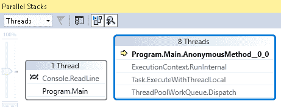
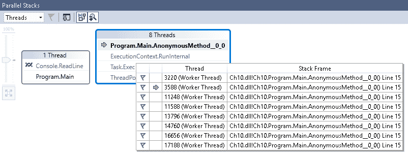
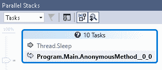
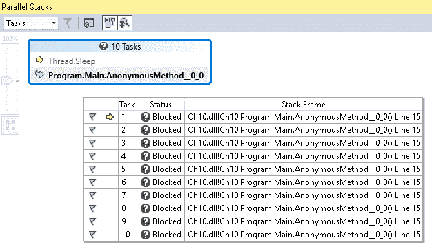
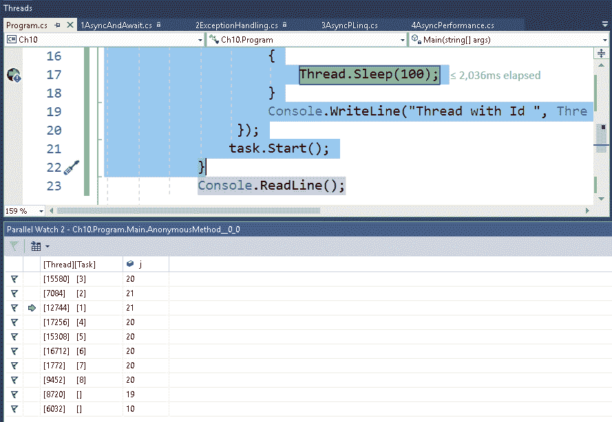
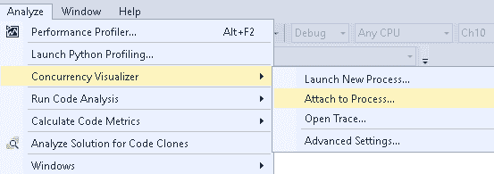

# 十、使用 Visual Studio 调试任务

并行编程可以提高应用的性能和响应能力，但有时效果并不理想。 与并行/异步代码相关的常见问题是性能和正确性。

对于性能，我们的意思是执行的结果是缓慢的。 对于正确性，我们的意思是结果不像预期的那样(这可能是由于竞争条件)。 处理多个并发任务时的另一个大问题是死锁。 调试多线程代码总是一个挑战，因为在调试时线程一直在切换。 在处理基于 gui 的应用时，找出哪个线程正在运行我们的代码也很重要。

在本章中，我们将解释如何使用 Visual Studio 中可用的工具调试线程，包括线程窗口、任务窗口和并发可视化工具。

本章将涵盖以下主题:

*   使用 VS 2019 进行调试
*   如何调试线程
*   使用并行任务窗口
*   使用并行堆栈窗口进行调试
*   使用并发可视化工具

# 技术要求

在开始本章之前，您需要先了解线程、任务、Visual Studio 和并行编程。

你可以在 GitHub 上通过以下链接查看伴随的源代码:[https://github.com/PacktPublishing/-Hands-On-Parallel-Programming-with-C-8-and-.NET-Core-3/tree/master/Chapter10](https://github.com/PacktPublishing/-Hands-On-Parallel-Programming-with-C-8-and-.NET-Core-3/tree/master/Chapter10)。

# 使用 VS 2019 进行调试

Visual Studio 提供了许多内置工具来帮助解决上述调试和故障排除问题。 我们将在本章中讨论的一些工具如下:

*   线程窗口
*   并行堆栈窗口
*   平行监视窗口
*   调试位置工具栏
*   并发可视化工具(截止撰写本文时仅 VS 2017)
*   GPU 线程窗口

在下面几节中，我们将尝试深入了解所有这些工具。

# 如何调试线程

在处理多个线程时，找出哪个线程在特定时间执行变得非常重要。 这允许我们排除跨线程问题和竞态条件。 使用`Threads`窗口，我们可以在调试时检查和处理线程。 在 Visual Studio IDE 中调试代码时遇到断点时，线程窗口提供一个表，每行包含有关活动线程的信息。

现在，让我们来探索如何使用 Visual Studio 调试线程:

1.  让我们在 Visual Studio 中编写以下代码:

```cs
for (int i = 0; i < 10; i++) 
           {
               Task task = new TaskFactory().StartNew(() =>
                {
                 Console.WriteLine($"Thread with Id 
                  {Thread.CurrentThread.ManagedThreadId}");
                });
           }
```

2.  通过在`Console.Writeline`语句上按*F9*来创建断点。
3.  在调试模式下按*F5*运行应用。 应用将创建线程并开始执行。 当遇到一个断点时，我们将从工具栏的 Debug | Windows |线程窗口打开线程窗口:


. net 环境捕获了大量关于列中显示的线程的信息。 黄色箭头表示当前正在执行的线程。

一些专栏包括以下内容:

*   **Flag**:如果我们想跟踪一个特定的线程，我们可以标记它。 这可以通过单击标志图标来完成。
*   ID:这显示分配给每个线程的唯一标识号。
*   托管 ID:显示分配给每个线程的托管标识号。
*   类别:每个线程被分配一个独特的类别，以帮助我们识别它是 GUI 线程(主线线程)还是工作线程。
*   名称:显示每个线程的名称，或者显示为<no name="">。</no>
*   Location:这有助于识别线程正在执行的位置。 我们可以深入查看完整的调用堆栈。

我们可以通过单击标志图标来标记我们想要监视的线程。 要查看仅标记线程，我们可以在线程窗口中单击 Show 标记线程 only 选项:


Threads 窗口的另一个很酷的特性是，我们可以在调试期间冻结我们认为可能导致问题的线程，以便监视应用的行为。 即使有足够的可用资源，系统也不会开始执行冻结的线程。 冻结时，线程会移动到挂起状态:


在调试时，我们也可以通过在 Threads 窗口中右键单击线程或双击线程来从一个线程切换到另一个线程:


Visual Studio 还支持使用并行堆栈窗口调试任务。 我们将在下一节中了解这一点。

# 使用并行堆栈窗口

Parallel Stacks 窗口是一个非常好的调试线程和任务的工具，它已经在 Visual Studio 的后续版本中被引入。 我们可以在调试时打开并行堆栈窗口，导航到 Debug | Windows |并行堆栈:


正如您从前面的截图中看到的，在 Parallel Stacks 窗口上工作时，我们可以在各种视图中切换。 在下一个主题中，我们将学习如何使用并行堆栈窗口和这些视图进行调试。

# 使用并行堆栈窗口进行调试

并行堆栈窗口有一个带有两个选项的下拉菜单。 我们可以在这些选项之间切换，从而在 Parallel Stacks 窗口中获得多个视图。 这些观点如下:

*   线程视图
*   任务视图

让我们在下面几节中详细研究这些视图。

# 线程视图

Threads 视图显示了在调试应用时所有线程的调用栈:



黄色箭头显示代码执行的当前位置。 将鼠标悬停在 Parallel Stacks 窗口中的任何方法上，将打开 Threads 窗口，其中包含当前正在执行的线程的信息:



我们可以通过双击它切换到任何其他方法:


我们也可以切换到方法视图来查看完整的调用堆栈:


方法视图非常便于调试调用堆栈，以找出在任何时间点向方法传递了哪些值。

# 任务视图

如果我们在代码中使用 Task Parallel Library 来创建`System.Threading.Tasks.Task`对象，我们应该使用 Tasks 视图:



从下面的截图中可以看到，目前有 10 个任务正在执行，每个任务都显示在当前执行的行中。

悬停在任何方法上，都可以看到所有正在运行的任务的状态:



Tasks 窗口帮助我们分析由于缓慢的方法调用或死锁引起的应用中的性能问题。

# 使用并行监视窗口进行调试

当我们想要查看不同线程上的变量值时，我们可以使用 Parallel Watch 窗口。 考虑以下代码:

```cs
for (int i = 0; i < 10; i++)
{
    Task task = new Task(() =>
     {
         for (int j = 0; j < 100; j++)
         {
             Thread.Sleep(100);
         }
         Console.WriteLine($"Thread with Id 
          {Thread.CurrentThread.ManagedThreadId}");
     });
    task.Start();
}
```

此代码创建多个任务，每个任务运行一个`for`循环，迭代 100 次。 在每次迭代中，线程休眠 100 毫秒。 我们允许代码运行一段时间，然后遇到断点。 我们可以使用“平行观察”窗口查看所有这些操作。 我们可以从 Debug | windows |平行监视窗口打开平行监视窗口。 我们可以打开四个这样的窗口，每个窗口一次只能监视不同任务上的一个变量值:



从前面的代码中可以看到，我们想要监视 j 的值。因此，我们在第三列的标题中写入 j，并按下*Enter*键。 这会将 j 添加到这里显示的观察窗口中，我们可以看到所有线程/任务上 j 的值。

# 使用并发可视化工具

并发可视化工具是 Visual Studio 工具集合中一个非常方便的添加。 它在 Visual Studio 中不默认提供，但可以从 Visual Studio 市场下载:[https://marketplace.visualstudio.com](https://marketplace.visualstudio.com)。

这是一个非常高级的工具，可用于排除复杂的线程问题，如性能瓶颈、线程争用问题、检查 CPU 利用率、跨核心线程迁移和重叠 I/O 区域。

并发可视化工具只支持 Windows/控制台项目，对 web 项目不可用。 让我们考虑一下控制台应用中的以下代码:

```cs
Action computeAction = () =>
{
int i = 0;
    while (true)
    {
        i = 1 * 1;
    }
};
Task.Run(() => computeAction());
Task.Run(() => computeAction());
Task.Run(() => computeAction());
Task.Run(() => computeAction());
```

在前面的代码中，我们创建了四个任务，它们无限期地运行一个计算任务，比如 1*1。 然后，我们将在`while`循环中放置一个断点，并打开 Concurrency Visualizer。

现在，我们将在 Visual Studio 中运行前面的代码，在代码运行时，单击 Attach to Process… 如下截图所示:



You first need to install Concurrency Visualizer for your version of Visual Studio. Concurrency Visualizer for Visual Studio 2017 can be found here: [https://marketplace.visualstudio.com/items?itemName=VisualStudioProductTeam.ConcurrencyVisualizer2017# overview](https://marketplace.visualstudio.com/items?itemName=VisualStudioProductTeam.ConcurrencyVisualizer2017# overview).

一旦附加，Concurrency Visualizer 将停止分析。 我们将让应用运行一段时间，以便它能够收集足够的数据进行检查，然后停止分析器生成视图。

默认情况下，这会打开 Utilization 视图，它是并发可视化工具中存在的三个视图之一。 另外两个是 Threads 和 Cores 视图。 我们将在下一节中探讨 Utilization 视图。

# 利用视图

Utilization 视图显示了所有处理器之间的系统活动。 这里是一个快照的并发探查器一旦它停止剖析:


正如你从前面的屏幕截图中看到的，有四个核心拥有 100%的 CPU 负载。 用绿色表示。 此视图通常用于获得并发状态的高级概述。

# 线程视图

Threads 视图提供了当前系统状态的非常详细的分析。 通过这种方法，我们可以识别线程是在执行还是由于 I/O 和同步等问题而阻塞:


该视图对于识别和修复系统中的性能瓶颈非常有帮助。 因此，我们可以清楚地确定在实际执行中花费了多少时间，以及花了多少时间处理同步问题。

# 大小 view

Cores 视图可以用来识别线程执行核心切换的次数:


如上图所示，id 为 12112、1604、16928 和 4928 的四个线程在近 60%的时间内跨核心执行上下文切换。

在了解了并发可视化工具中存在的所有三个视图之后，我们已经到了本章的末尾。 现在，让我们总结一下所学到的。

# 总结

在本章中，我们讨论了如何使用 Thread 窗口来监视.NET 环境捕获的无数信息来调试多线程应用。 我们还学习了如何通过使用标志线程、在线程之间切换、在并行堆栈窗口中拥有线程和任务视图、打开多个并行监视窗口以及一次观察不同任务上的单变量值来更好地了解应用。

除此之外，我们还研究了 Concurrency Visualizer，它是一种高级工具，用于排除只支持 Windows/控制台项目的复杂线程问题。

在下一章中，我们将学习如何为并行和异步代码编写单元测试用例，以及与之相关的问题。 此外，我们将了解设置模拟对象所涉及的挑战以及如何解决它们。

# 问题

1.  在 Visual Studio 中，哪一个不是调试线程的有效窗口?
    1.  并行线程
    2.  并行堆栈
    3.  GPU 线程
    4.  并行监视
2.  我们可以在调试时通过标记来跟踪一个特定的线程。
    1.  真正的
    2.  假
3.  以下哪一个在“平行监视”窗口中不是有效视图?
    1.  任务
    2.  过程
    3.  线程
4.  我们如何检查线程的调用堆栈?
    1.  方法的观点
    2.  Task 视图
5.  以下哪一个不是并发可视化工具的有效视图?
    1.  线程视图
    2.  大小 view
    3.  流程视图

# 进一步的阅读

你可以通过以下链接了解并行编程和调试技术:

*   [https://www.packtpub.com/application-development/c-multithreaded-and-parallel-programming](https://www.packtpub.com/application-development/c-multithreaded-and-parallel-programming)
*   [https://www.packtpub.com/application-development/net-45-parallel-extensions-cookbook](https://www.packtpub.com/application-development/net-45-parallel-extensions-cookbook)