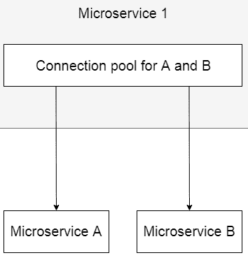
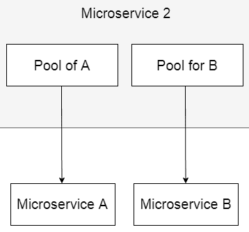
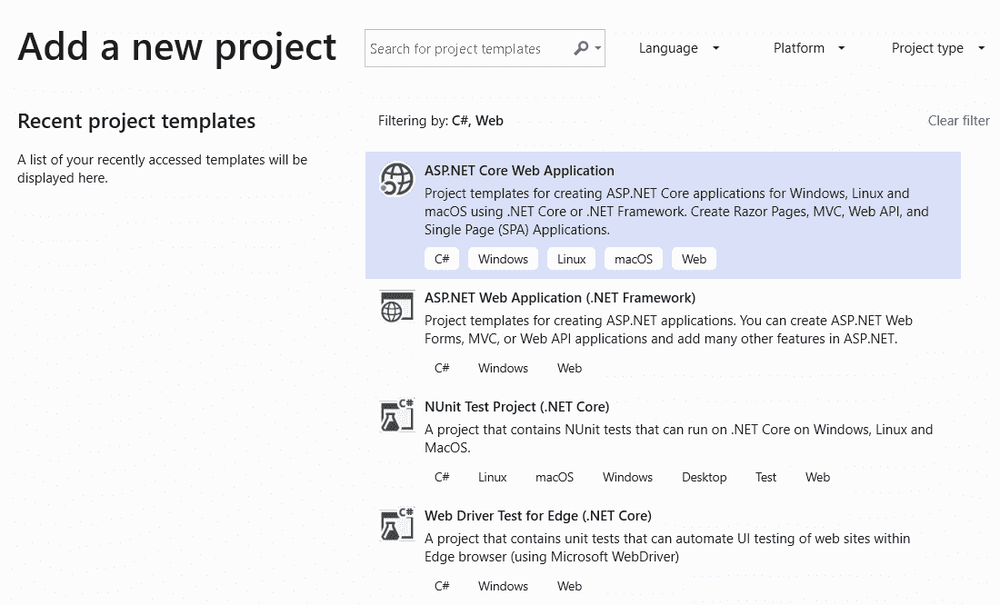
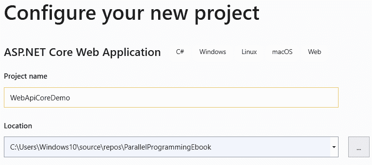
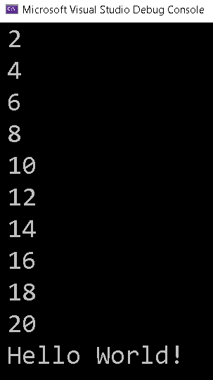

# 十二、ASP.NETCore 中的 IIS 和 Kestrel

在前一章中，我们讨论了为并行和异步代码编写单元测试用例。 我们还讨论了 Visual Studio 中可用的三种单元测试框架:MSUnit、NUnit 和 xUnit。

在本章中，我们将介绍线程模型如何与**Internet Information Services**(**IIS**)和 Kestrel 一起工作。 我们还将研究我们可以进行的各种调整，以最大限度地利用服务器上的资源。 我们将介绍 Kestrel 的工作模型，以及在创建微服务时如何利用并行编程技术。

在本章中，我们将涵盖以下主题:

*   IIS 线程模型和内部
*   Kestrel 线程模型和内部
*   介绍微服务中线程的最佳实践
*   介绍 ASP 中的异步。 净 MVC 核心
*   异步流(.NET Core 3.0 新特性)

让我们开始吧。

# 技术要求

要理解本章，您需要对服务器的工作方式有一个很好的理解。 在开始本章之前，你还应该学习线程模型。 本章的源代码可以在 GitHub 上的[https://github.com/PacktPublishing/-Hands-On-Parallel-Programming-with-C-8-and-.NET-Core-3/tree/master/Chapter12](https://github.com/PacktPublishing/-Hands-On-Parallel-Programming-with-C-8-and-.NET-Core-3/tree/master/Chapter12)找到。

# IIS 线程模型和内部

顾名思义，这些服务在 Windows 系统上被利用，通过一组协议，如 HTTP、TCP、web 套接字等，通过互联网从其他系统连接您的 web 应用。

在本节中，我们将讨论**IIS 线程模型**是如何工作的。 IIS 的核心是**CLR 线程池**。 了解 CLR 线程池如何添加和删除线程对于理解 IIS 如何为用户请求服务非常重要。

每个部署到 IIS 的应用都被分配一个唯一的工作进程。 每个工作进程有两个线程池:**工作线程池**和**IOCP**(简称**I/O 完成端口**)线程池:

*   每当我们使用遗留的`ThreadPool.QueueUserWorkItem`或**TPL**创建一个新的线程池线程时，ASP. php 将使用 NET 运行时使用工作线程进行处理。
*   当我们执行任何 I/O 操作时，即数据库调用、文件读/写或对另一个 web 服务的网络调用。 NET 运行时使用 IOCP 线程。

默认情况下，每个处理器有一个工作线程和一个 IOCP 线程。 所以，一个双核 CPU 默认会有两个 worker 和两个 IOCP 线程。 `ThreadPool`根据负载和需求不断添加和删除线程。 IIS 为它接收到的每个请求分配一个线程。 这允许每个请求与同时到达服务器的其他请求具有不同的上下文。 线程的职责是迎合请求，以及生成响应并将响应发送回客户机。

如果可用的线程池线程数小于服务器在任何时候接收到的请求数，则请求将开始排队。 之后，线程池使用两种重要算法中的一种生成线程，即*爬坡*和*饥饿避免*。 线程的创建不是瞬间完成的，从`ThreadPool`知道线程不足开始，通常需要 500 毫秒。 让我们试着理解`ThreadPool`用于生成线程的两种算法。

# 避免饥饿

在这个算法中，`ThreadPool`一直监视队列，如果队列没有进展，那么它就继续将新线程注入队列。

# 希尔攀登

在这个算法中，`ThreadPool`尝试使用尽可能少的线程来最大化吞吐量。

使用默认设置运行 IIS 将对性能产生重大影响，因为在默认情况下，每个处理器只有一个工作线程可用。 我们可以通过修改`machine.config`文件中的配置元素来增加这个设置，如下所示:

```cs
<configuration>  
    <system.web>     
        <processModel minWorkerThreads="25" minIoThreads="25" />  
    </system.web> 
</configuration>
```

如你所见，我们将最小工作线程和 IOCP 线程增加到 25 个。 随着更多的请求进入，将创建更多的线程。 这里需要注意的重要一点是，由于每个请求都被分配了一个唯一的线程，我们应该避免编写阻塞代码。 使用阻塞代码，将不会有空闲线程。 一旦线程池耗尽，请求将开始排队。 IIS 每个应用池最多只能队列 1,000 个请求。 我们可以通过更改`machine.config`文件中的`requestQueueLimit`应用设置来修改这一点。

要修改所有应用池的设置，我们需要添加具有所需值的`applicationPool`元素:

```cs
<system.web>
  <applicationPool
    maxConcurrentRequestPerCPU="5000"
    maxConcurrentThreadsPerCPU="0"
    requestQueueLimit="5000" />
</system.web>
```

要修改单个应用池的设置，我们需要在 IIS 中导航到特定应用池的高级设置。 如下面的截图所示，我们可以改变队列长度属性来修改每个应用池中可以排队的请求数:


对于开发人员来说，为了减少争用问题，从而避免服务器上的队列，我们应该尝试对任何阻塞 I/O 代码使用`async`/`await`关键字。 这将减少服务器上的争用问题，因为线程不会被阻塞并返回到线程池来服务其他请求。

# Kestrel 线程模型和内部

IIS 一直是承载.NET 应用的最流行的服务器，但它绑定在 Windows 操作系统上。 随着越来越多的云提供商的出现，非 windows 云托管的选择变得越来越便宜，需要一个跨平台的托管服务器。 微软引入 Kestrel 作为一个跨平台的 web 服务器托管 ASP.NETCore 应用。 如果我们创建并运行 ASP。 NETCore 应用，Kestrel 是运行它们的默认 web 服务器。 Kestrel 是开源的，使用事件驱动的异步 I/ o 服务器。 Kestrel 不是一个成熟的 web 服务器，建议在 IIS 和 Nginx 等功能齐全的 web 服务器后使用。

当它最初启动时，Kestrel 是基于`libuv`库的，它也是开源的。 在.NET 中使用`libuv`并不是新的，可以追溯到 asp.net。 净 5。 `libuv`是专门为异步 I/O 操作而构建的，并且使用了单线程事件循环模型。 这个库还支持 Windows、macOS 和 Linux 上的跨平台异步套接字。 你可以查看它的进度，并从 GitHub 上下载`libuv`的源代码来自定义实现[https://github.com/libuv/libuv](https://github.com/libuv/libuv)。

`libuv`在 Kestrel 中只支持异步 I/O。 除了 I/O 操作，所有在 Kestrel 中完成的其他工作仍然是由. net worker 线程使用托管代码来完成的。 创建 Kestrel 的核心理念是提高服务器的性能。 该堆栈非常健壮和可扩展。 在 Kestrel 中`libuv`仅用作传输层，由于其出色的抽象，它也可以被其他网络实现所替代。 Kestrel 还支持运行多个事件循环，因此它比 Node.js 更健壮。 所使用的事件循环的数量取决于机器上的逻辑处理器的数量以及是否有一个线程运行一个事件循环。 我们可以在创建主机时通过代码配置这个数字。

以下摘录自`Program.cs`文件，它存在于所有的 ASP.NETCore 项目:

```cs
public class Program
{
    public static void Main(string[] args)
    {
        CreateWebHostBuilder(args).Build().Run();
    }
    public static IWebHostBuilder CreateWebHostBuilder(string[] args) =>    
     WebHost.CreateDefaultBuilder(args).UseStartup<Startup>();
    }
```

正如您将看到的，Kestrel 服务器基于构建器模式，可以使用适当的包和扩展方法添加功能。 在接下来的章节中，我们将学习如何为不同版本的.NET Core 修改 Kestrel 的设置。

# ASP.NETCore 的 1.倍

我们可以使用名为`UseLibuv`的扩展方法来设置线程数。 我们可以通过设置`ThreadCount`属性来实现这一点，如下面的代码所示:

```cs
public static IWebHostBuilder CreateWebHostBuilder(string[] args) =>
            WebHost.CreateDefaultBuilder(args)
            .UseLibuv(opts => opts.ThreadCount = 4)
            .UseStartup<Startup>();
```

`WebHost` has been replaced by a generic host in .NET Core 3.0\. The following is a code snippet for ASP.NET Core 3.0:

```cs
public static IHostBuilder CreateHostBuilder(string[] args) =>
            Host.CreateDefaultBuilder(args)
                .ConfigureWebHostDefaults(webBuilder =>
                {
                    webBuilder.UseStartup<Startup>();
                });
```

# ASP.NETCore 的 2.倍

从 ASP。 在 NET 2.1 中，Kestrel 已经替换了托管套接字的默认传输方式`libuv`。 所以，如果你从 ASP 升级你的项目。 asp.net Core 到 asp.net。 净 2。 x 或 3。 x 并且仍然想要使用`libuv`，你需要添加`Microsoft.AspNetCore.Server.Kestrel.Transport.Libuv`NuGet 包来让代码工作。

Kestrel 目前支持以下场景:

*   HTTPS
*   不透明升级，用于启用 websockets([https://github.com/aspnet/websockets](https://github.com/aspnet/websockets))
*   Unix 套接字背后的 Nginx 高性能
*   HTTP/2(目前 macOS 不支持)

因为 Kestrel 是建立在 socket 上的，你可以通过在`Host`上使用`ConfigureLimits`方法来配置它们的连接限制:

```cs
Host.CreateDefaultBuilder(args)
.ConfigureKestrel((context, options) =>
{
    options.Limits.MaxConcurrentConnections = 100;
    options.Limits.MaxConcurrentUpgradedConnections = 100;
}
```

如果我们将`MaxConcurrentConnections`设置为空，那么默认的连接限制是无限的。

# 介绍微服务中线程的最佳实践

微服务是最流行的软件设计模式，用于制作高性能和可伸缩的后端服务。 不是为整个应用构建一个服务，而是创建多个松散耦合的服务，每个服务负责一个特性。 根据特性上的负载，每个服务都可以单独放大或缩小。 因此，在设计微服务时，选择使用的线程模型变得非常重要。

微服务可以是无状态的或有状态的。 无状态和有状态之间的选择确实会对性能产生影响。 对于无状态服务，可以按照任何顺序处理请求，而不考虑当前请求之前或之后发生了什么;而对于有状态服务，所有请求都应该按照特定的顺序处理，就像队列一样。 这可能会对性能产生影响。 由于微服务是异步的，我们需要编写一些逻辑，以确保在将每个请求通信到下一个消息后，以正确的顺序和状态处理请求。 微服务可以是单线程的，也可以是多线程的，这种选择加上状态确实可以提高或降低性能，在规划服务时应该仔细考虑。

微服务的设计方法可以分为以下几类:

*   单线程单进程微服务
*   单线程-多进程微服务
*   多线程-单进程微服务

在下面的小节中，我们将更详细地研究这些设计方法。

# 单线程单进程微服务

这是微服务最基本的设计。 微服务运行在单个 CPU 核心中的单个线程上。 对于来自客户机的每一个新请求，都会创建一个新线程，从而生成一个新进程。 这就失去了连接池缓存的好处。 在使用数据库时，每个新进程都将创建一个新的连接池。 此外，由于一次只能创建一个进程，所以只能服务一个客户端。

单线程-单进程微服务的缺点包括浪费资源，并且当负载增加**时，服务的吞吐量不会增加。**

# 单线程多进程微服务

微服务运行在单个线程上，但可以产生多个进程，从而提高了它们的吞吐量。 由于为每个客户机创建了一个新进程，所以在连接数据库时我们不能利用连接池。 有一些第三方环境，如 Zend、OpCache 和 APC，提供了跨进程的操作码缓存。

单线程-多进程微服务方法的优点是它提高了负载时的吞吐量，但请注意，我们不能利用连接池。

# 多个 threads-single 过程

微服务运行在多个线程上，并且只有一个长期存在的进程。 使用相同的数据库，我们可以利用连接池，并在需要时限制连接的数量。 单进程的问题是，所有线程都将使用共享资源，并且可能会有资源争用问题。

多线程-单进程方法的优点是它提高了无状态服务的性能，而缺点是在共享资源时可能会出现同步问题。

# 异步服务

我们可以通过解耦微服务之间的通信来避免与各种应用组件集成期间的性能问题。 为了实现这种解耦，必须设计异步创建微服务。

# 专用的线程池

如果应用流要求我们连接到各种微服务，那么为这些任务创建一个专用的线程池更有意义。 对于单个线程池，如果服务开始出现问题，那么池中的所有线程都可能耗尽。 这可能会影响微服务的性能。 此模式也称为**Bulkheads**模式。 下图显示了两个具有共享池的微服务。 正如你所看到的，两个微服务都使用一个共享的连接池:



下图显示了两个带有专用线程池的微服务:



在下一节中，我们将介绍如何在 ASP 中使用 async。 净 MVC 核心。

# 介绍 ASP 中的异步。 净 MVC 核心

`async`和`await`是帮助我们使用 TPL 编写异步代码的代码标记。 它们有助于维护代码结构，并使其在后台异步处理代码时看起来是同步的。

We introduced `async` and `await` in [Chapter 9](09.html), *Async, Await, and Task-Based Asynchronous Programming Basics*.

现在，让我们用 ASP 创建一个异步 web API。 NET Core 3.0 和 VS 2019 预览版。 API 将从服务器读取一个文件:

1.  打开 Visual Studio 2019，显示如下屏幕。 创建一个新的 ASP。 NET Core Web Application project in VS 2019，如下截图所示:



2.  给项目一个名字和你想要创建它的位置:



3.  选择项目的类型，在我们的例子中是 API，然后单击 Create:


4.  现在，在我们的项目中创建一个名为`Files`的新文件夹，并添加一个名为`data.txt`的文件，该文件包含以下内容:


5.  接下来我们将对`ValuesController.cs`中的`Get`方法进行修改，如下:

```cs
[HttpGet]
public ActionResult<IEnumerable<string>> Get()
{
    var filePath = System.IO.Path.Combine(
     HostingEnvironment.ContentRootPath,"Files","data.txt");
    var text = System.IO.File.ReadAllText(filePath);
    return Content(text);
}
```

这是一个简单的方法，它从服务器读取文件并将内容作为字符串返回给用户。 这段代码的问题是，当调用`File.ReadAllText`时，调用线程将被阻塞，直到文件被完全读取。 正如我们现在知道的，我们的服务器的响应将使调用异步，如下所示:

```cs
[HttpGet]
public async Task<ActionResult<IEnumerable<string>>> GetAsync()
{
    var filePath = System.IO.Path.Combine(
      HostingEnvironment.ContentRootPath, "Files", "data.txt");
    var text = await System.IO.File.ReadAllTextAsync(filePath);
    return Content(text);
}
```

ASP。 NET Core web API 支持并行编程的所有新特性，包括异步，正如我们在前面的代码示例中看到的那样。

# 异步流

. net Core 3.0 也引入了异步流支持。 `IAsyncEnumerable<T>`是`IEnumerable<T>`的异步版本。 这个新特性允许开发人员等待`IAsyncEnumerable<T>`上的`foreach`循环来消费流中的元素，并使用`yield`返回一个流来产生元素。

这在我们希望异步遍历元素并对遍历的元素执行一些计算操作的场景中非常重要。 随着现在越来越强调大数据(可以通过流输出获得)，使用*异步*流更有意义，它支持大量的数据，同时通过有效地利用线程使服务器响应。

新增两个接口以支持异步流**:**

```cs
public interface IAsyncEnumerable<T>
{
  public IAsyncEnumerator<T> GetEnumerator();
}
public interface IAsyncEnumerator<out T>
{
  public T Current { get; }
  public Task<bool> MoveNextAsync();
}
```

从`IAsyncEnumerator`的定义可以看出，`MoveNext`是异步的。 这有两个好处:

*   很容易将`Task<bool>`缓存到`Task<T>`之上，这样分配的内存就会更少
*   现有集合只需要添加一个额外的方法来支持异步行为

让我们尝试使用一些异步枚举奇数索引上的数字的示例代码来理解这一点。

下面是一个自定义枚举数:

```cs
class OddIndexEnumerator : IAsyncEnumerator<int>
{
    List<int> _numbers;
    int _currentIndex = 1;
    public OddIndexEnumerator(IEnumerable<int> numbers)
    {
        _numbers = numbers.ToList();
    }
    public int Current
    {
        get
        {
            Task.Delay(2000);
            return _numbers[_currentIndex];
        }
    }
    public ValueTask DisposeAsync()
    {
        return new ValueTask(Task.CompletedTask);
    }
    public ValueTask<bool> MoveNextAsync()
    {
        Task.Delay(2000);
        if (_currentIndex < _numbers.Count() - 2)
        {
            _currentIndex += 2;
            return new ValueTask<bool>(Task.FromResult<bool>(true));
        }
        return new ValueTask<bool>(Task.FromResult<bool>(false));
    }
}
```

从前面代码中定义的`MoveNextAsync()`方法可以看到，该方法从奇数索引(即索引 1)开始，并以奇数索引读取项。

下面是我们的集合，它使用了我们之前创建的自定义枚举逻辑，并实现了`IAsyncEnumerable<T>`接口的`GetAsyncEnumerator()`方法来返回我们创建的`OddIndexEnumerator`枚举器:

```cs
class CustomAsyncIntegerCollection : IAsyncEnumerable<int>
{
    List<int> _numbers;
    public CustomAsyncIntegerCollection(IEnumerable<int> numbers)
    {
        _numbers = numbers.ToList();
    }
    public IAsyncEnumerator<int> GetAsyncEnumerator(
     CancellationToken cancellationToken = default)
    {
        return new OddIndexEnumerator(_numbers);
    }
}
```

下面是我们的神奇扩展方法，它将把我们的自定义集合转换为`AsyncEnumerable`。 如您所见，它适用于实现`IEnumerable<int>`的任何集合，并将底层集合包装为`CustomAsyncIntegerCollection`，从而实现`IAsyncEnumerable<T>`:

```cs
public static class CollectionExtensions
{
    public static IAsyncEnumerable<int> AsEnumerable(this 
     IEnumerable<int> source) => new CustomAsyncIntegerCollection(source);
}
```

一旦所有部分就绪，我们就可以创建一个返回异步流的方法。 我们可以看到如何使用`yield`关键字生成条目:

```cs
static async IAsyncEnumerable<int> GetBigResultsAsync()
{
    var list = Enumerable.Range(1, 20);
    await foreach (var item in list.AsEnumerable())
    {
        yield return item;
    }
}
```

下面的代码调用这个流。 这里，我们调用`GetBigResultsAsync()`方法，它在`foreach`循环中返回`IAsyncEnumerable<int>`，然后异步遍历:

```cs
async static Task Main(string[] args)
{
    await foreach (var dataPoint in GetBigResultsAsync())
    {
        Console.WriteLine(dataPoint);
    }
    Console.WriteLine("Hello World!");
}
```

下面是前面代码的输出。 如您所见，它在集合**:**的奇数索引处生成数字。



在这一节中，我们介绍了异步流，它使我们能够非常高效地并行遍历集合，而不会阻塞调用者线程，这是自从引入 TPL 以来所缺少的。

现在，让我们来看看我们在这一章中所涵盖的内容。

# 总结

在这一章中，我们讨论了 IIS 线程模型，并通过从使用`libuv`到使用.NET Core 2.0 来改变服务器的.NET Core 实现，以便从.NET Core 2.1 开始管理 socket。 我们还讨论了如何提高 IIS、Kestrel 以及一些线程池算法(如饥饿回避和 Hill climb)的性能。 我们介绍了微服务的概念和在微服务中使用的各种线程模式，如单线程-单进程微服务、单线程-多进程微服务和多线程-单进程微服务。

讨论了在 ASP 中使用异步的过程。 NET MVC Core 3.0 中引入了异步流的新概念，以及它的用法。 异步流在大数据场景中非常方便，在这种场景中，由于数据的快速涌入，服务器的负载可能非常大。

在下一章中，我们将学习一些在并行和异步编程中常用的模式。 这些模式将增强我们对并行编程的理解。

# 问题

1.  哪些是用来托管 web 应用的?
    1.  `IWebHostBuilder`
    2.  `IHostBuilder`
2.  下列哪一种`ThreadPool`算法试图使用尽可能少的线程来最大化吞吐量?
    1.  希尔攀登
    2.  避免饥饿
3.  哪一种不是有效的微服务设计方法?
    1.  单一的 thread-single 过程
    2.  单一 thread-multiple 流程
    3.  多个 threads-single 过程
    4.  多个 threads-multiple 流程
4.  我们可以在.NET Core 的新版本中等待`foreach`循环。
    1.  真正的
    2.  假