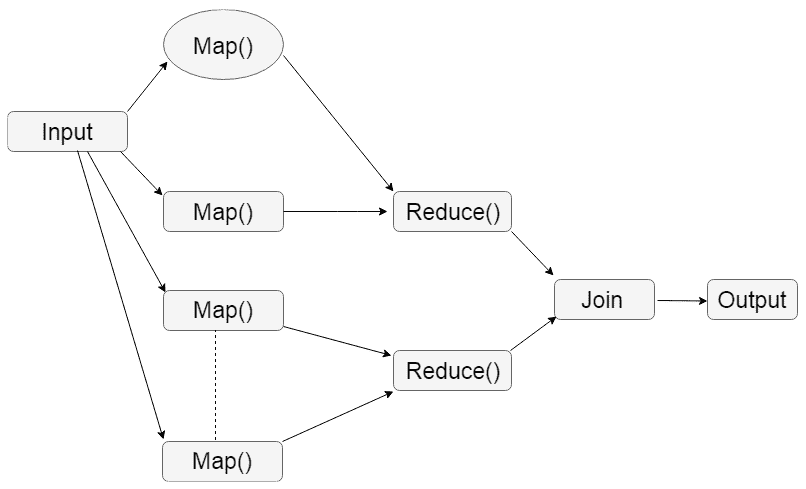
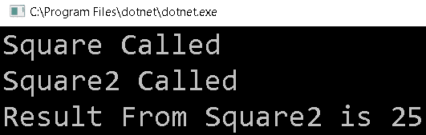

# 十三、并行编程中的模式

在前一章中，我们介绍了 IIS 和 Kestrel 中的线程模型，以及如何优化它们以提高性能，以及.NET Core 3.0 中一些新的异步特性支持。

在本章中，我们将介绍并行编程模式，并着重于理解并行代码问题场景，并使用并行编程/异步技术解决它们。

尽管在并行编程技术中已经使用了许多模式，但我们将只介绍最重要的模式。

在本章中，我们将涵盖以下主题:

*   `MapReduce`
*   聚合
*   join 的/
*   投机的处理
*   懒惰
*   共享状态

# 技术要求

要理解本章，需要具备 C# 和并行编程的知识。 本章的源代码可以在 GitHub 上的[https://github.com/PacktPublishing/-Hands-On-Parallel-Programming-with-C-8-and-.NET-Core-3/tree/master/Chapter13](https://github.com/PacktPublishing/-Hands-On-Parallel-Programming-with-C-8-and-.NET-Core-3/tree/master/Chapter13)找到。

# MapReduce 的模式

引入`MapReduce`模式是为了处理大数据问题，比如跨服务器集群的大规模计算需求。 该模式也可以在单核计算机上使用。

一个`MapReduce`程序由两个任务组成:**map**和**reduce**。 `MapReduce`程序的输入以一组键值对的形式传递，输出也以键值对的形式接收。

要实现此模式，首先需要编写一个`map`函数，该函数将数据(键/值对)作为单个输入值接收，并将其转换为另一组中间数据(键/值对)。 然后，用户编写一个`reduce`函数，该函数将`map`函数(键/值对)的输出作为输入，并将该数据与一个包含任意行数据的较小的数据集组合。

让我们看看如何使用 LINQ 实现基本的`MapReduce`模式，并将其转换为基于 plinq 的实现。

# 使用 LINQ 实现 MapReduce

下面是`MapReduce`模式的典型图形表示。 输入经过各种映射函数，每个函数返回一组映射值作为输出。 然后用`Reduce()`函数将这些分组并连接起来，以创建最终输出:



按照以下步骤使用 LINQ 实现`MapReduce`模式:

1.  首先，我们需要编写一个带有单个输入值的`map`函数，该输入值返回一组映射值。 我们可以使用 LINQ 的`SelectMany`函数。
2.  然后，我们需要根据中间密钥对数据进行分组。 我们可以使用 LINQ 的`GroupBy`方法来实现这一点。
3.  最后，我们需要一个将中间键作为输入的`reduce`方法。 它还将获取相应的一组值并产生输出。 我们可以用`SelectMany`**来表示。**
***   我们最后的`MapReduce`模式现在看起来如下:**

 **```cs
public static IEnumerable<TResult> MapReduce<TSource, TMapped, TKey, TResult>(
this IEnumerable<TSource> source,
Func<TSource, IEnumerable<TMapped>> map,
Func<TMapped, TKey> keySelector,
Func<IGrouping<TKey, TMapped>, IEnumerable<TResult>> reduce)
{
return source.SelectMany(map) .GroupBy(keySelector) .SelectMany(reduce); }
```

5.  现在，我们可以改变输入和输出，使其与`ParallelQuery<T>`而不是`IEnumerable<T>`一起工作，如下所示:

```cs
public static ParallelQuery<TResult> MapReduce<TSource, TMapped, TKey, TResult>(
this ParallelQuery<TSource> source,
Func<TSource, IEnumerable<TMapped>> map,
Func<TMapped, TKey> keySelector,
Func<IGrouping<TKey, TMapped>, IEnumerable<TResult>> reduce)
{
return source.SelectMany(map)
.GroupBy(keySelector)
.SelectMany(reduce);
}
```

下面是在.NET Core 中使用`MapReduce`自定义实现的示例。 程序生成一定范围内的正负随机数。 然后，它应用一个映射来过滤掉任何正数，并按数字对它们进行分组。 最后，它应用`reduce`函数返回一个数字列表，以及它们的计数:

```cs
private static void MapReduceTest()
{
    //Maps only positive number from list
    Func<int, IEnumerable<int>> mapPositiveNumbers = number =>
    {
        IList<int> positiveNumbers = new List<int>();
        if (number > 0)
            positiveNumbers.Add( number);
            return positiveNumbers;
    };
    // Group results together
    Func<int, int> groupNumbers = value => value;
    //Reduce function that counts the occurrence of each number
    Func<IGrouping<int, int>,IEnumerable<KeyValuePair<int, int>>> 
     reduceNumbers =  grouping => new[] {                                 
        new KeyValuePair<int, int>( grouping.Key, grouping.Count()) 
    };
    // Generate a list of random numbers between -10 and 10
    IList<int> sourceData = new List<int>();
    var rand = new Random();
    for (int i = 0; i < 1000; i++)
    {
        sourceData.Add(rand.Next(-10, 10));
    }
    // Use MapReduce function
    var result = sourceData.AsParallel().MapReduce(mapPositiveNumbers,
                                                    groupNumbers,
                                                    reduceNumbers);
    // process the results
    foreach (var item in result)
    {
       Console.WriteLine($"{item.Key} came {item.Value} times" );
    }
}
```

下面是在 Visual Studio 中运行上述程序代码所得到的输出的摘录。 正如你所看到的，它迭代所提供的列表，并找到出现次数的计数:


在下一节中，我们将讨论另一种常见且重要的并行设计模式，即聚合。 虽然`MapReduce`模式充当过滤器，但聚合只是组合来自输入的所有数据并将其转换为另一种格式。

# 聚合

聚合是在并行应用中使用的另一种常见设计模式。 在并行程序中，数据被划分为多个单元，以便由多个线程跨核处理。 在某些情况下，需要将来自所有相关来源的数据组合起来，然后才能呈现给用户。 这就是聚合出现的原因。

现在，让我们探讨一下对聚合的需求以及 PLINQ 提供了什么。

聚合的一个常见用例如下。 这里，我们尝试迭代一组值，执行一些操作，并将结果返回给调用者:

```cs
var output = new List<int>();
var input = Enumerable.Range(1, 50);
Func<int,int> action = (i) => i * i;
foreach (var item in input)
{
    var result = action(item);
    output.Add(result);
}
```

前面代码的问题是输出不是线程安全的。 因此，为了避免跨线程问题，我们需要使用同步原语:

```cs
var output = new List<int>();
var input = Enumerable.Range(1, 50);
Func<int, int> action = (i) => i * i;
Parallel.ForEach(input, item =>
{
    var result = action(item);
    lock (output) 
        output.Add(result);
});
```

如果每个项目的计算量很小，那么前面的代码可以很好地工作。 然而，随着每个道具的计算增加了获取和释放的成本，锁也会增加。 这会导致性能下降。 我们在[第 6 章](06.html)、*使用并发集合*中讨论过的并发集合可以在这里解决这个问题。 使用并发集合，我们不必担心同步。 下面的代码片段正在使用并发收集:

```cs
var input = Enumerable.Range(1, 50);
Func<int, int> action = (i) => i * i;
var output = new ConcurrentBag<int>();
Parallel.ForEach(input, item =>
{
    var result = action(item);
    output.Add(result);
});
```

PLINQ 还定义了帮助聚合和处理同步的方法。 这些方法包括`ToArray`，`ToList`，`ToDictionary`和`ToLookup`:

```cs
var input = Enumerable.Range(1, 50);
Func<int, int> action = (i) => i * i;
var output = input.AsParallel()
             .Select(item => action(item))
             .ToList();
```

在前面的代码中，`ToList()`方法负责聚合所有数据，同时处理同步。 一些实现模式在 TPL 中可用，并内置在编程语言中。 其中之一是 fork/join 模式，我们将在后面讨论。

# fork / join 模式

在 fork/join 模式中，工作被*fork*(*拆分*)为一组可以异步执行的任务。 之后，根据并行化的要求和范围，将分叉的工作以相同或不同的顺序进行连接。 在这本书中，当我们讨论有趣的并行循环时，我们已经看到了 fork/join 模式的一些常见例子。 fork/join 的一些实现如下:

*   `Parallel.For`
*   `Parallel.ForEach`
*   `Parallel.Invoke`
*   `System.Threading.CountdownEvent`

利用这些框架提供的方法有助于更快的开发，而开发人员不必担心同步开销。 这些模式导致高吞吐量。 为了实现高吞吐量和减少延迟，另一种模式，称为推测处理，被广泛使用。

# 投机加工模式

推测处理模式是另一种并行编程模式，它依赖于高吞吐量来减少延迟。 这在有多种方式执行任务，但用户不知道哪种方式返回结果最快的情况下非常有用。 这种方法为每个可能的方法创建一个任务，然后跨处理器执行。 最先完成的任务被用作输出，忽略其他任务(这些任务可能仍然成功完成，但速度较慢)。

下面是一个典型的`SpeculativeInvoke`表示。 它接受一个数组`Func<T>`作为参数，并并行执行它们，直到其中一个返回:

```cs
public static T SpeculativeInvoke<T>(params Func<T>[] functions)
{
    return SpeculativeForEach(functions, function => function());
}
```

下面的方法会并行执行传递给它的每个动作，一旦被调用的实现成功执行，就会调用`ParallelLoopState.Stop()`方法，从而中断一个并行循环:

```cs
public static TResult SpeculativeForEach<TSource, TResult>(
                        IEnumerable<TSource> source,
                        Func<TSource, TResult> body)
{
    object result = null;
    Parallel.ForEach(source, (item, loopState) =>
    {
        result = body(item);
        loopState.Stop();
    });
    return (TResult)result;
}
```

下面的代码使用两种不同的逻辑来计算 5 的平方。 我们将通过`SpeculativeInvoke`方法的两种方法，并尽快打印`result`:

```cs
Func<string> Square = () => {
                Console.WriteLine("Square Called");
                return $"Result From Square is {5 * 5}";
                };
Func<string> Square2 = () =>
             {
                 Console.WriteLine("Square2 Called");
                 var square = 0;
                 for (int j = 0; j < 5; j++)
                 {
                     square += 5;
                 }
                 return $"Result From Square2 is {square}";
             };
string result = SpeculativeInvoke(Square, Square2);
Console.WriteLine(result);
```

下面是前面代码的输出:



正如您将看到的，两个方法都完成了，但只有第一个完成执行的输出返回给调用者。 创建太多的任务可能会对系统内存产生不利影响，因为需要分配和保存越来越多的变量。 因此，只在实际需要时才分配对象变得非常重要。 我们的下一个模式帮助我们实现这一点。

# 懒惰的模式

Lazy 是应用开发人员用来提高应用性能的另一种编程模式。 懒惰就是把计算延迟到真正需要的时候。 在最好的情况下，可能根本不需要计算，这有助于不浪费计算资源，从而提高整个系统的性能。 延迟计算对于计算来说并不新鲜，LINQ 大量使用*延迟加载*。 LINQ 遵循延迟执行模型，在此模型中，查询直到使用一些迭代器函数调用`MoveNext()`才会执行。

下面是一个线程安全的惰性单例模式的例子，它在创建时使用了一些繁重的计算操作，因此被延迟:

```cs
public class LazySingleton<T> where T : class
    {
        static object _syncObj = new object();
        static T _value;
        private LazySingleton()
        {
        }
        public static T Value
        {
            get
            {
                if (_value == null)
                {
                    lock (_syncObj)
                    {
                        if (_value == null)
                            _value = SomeHeavyCompute();
                    }
                }
                return _value;
            }
        }
        private static T SomeHeavyCompute() { return default(T); }
    }
```

惰性对象是通过调用`LazySingleton<T>`类的`Value`属性创建的。 惰性保证直到`Value`属性被调用时才创建对象。 一旦创建，单例实现确保在后续调用中返回相同的对象。 对`_value`进行空检查可以避免对后续调用创建锁，从而节省一些内存 I/O 操作并提高性能。

我们可以通过使用`System.Lazy<T>`来避免编写这么多代码，如下面的代码示例所示:

```cs
public class MyLazySingleton<T>
{
    //Declare a Lazy<T> instance with initialization 
    //function (SomeHeavyCompute) 
    static Lazy<T> _value = new Lazy<T>();
    //Value property to return value of Lazy instance when 
    //actually required by code
    public T Value { get { return _value.Value; } }
    //Initialization function
    private static T SomeHeavyCompute() 
    { 
        return default(T); 
    }
}
```

在使用异步编程时，我们可以将`Lazy<T>`的强大功能与 TPL 结合起来，以获得显著的结果。

下面是使用`Lazy<T>`和`Task<T>`来实现惰性和异步行为的示例:

```cs
var data = new Lazy<Task<T>>(() => Task<T>.Factory.StartNew(SomeHeavyCompute));
```

我们可以通过`data.Value`属性访问底层的`Task`。 底层惰性实现将确保每次返回相同的任务实例，无论您调用`data.Value`属性多少次。 这在您不想启动许多线程而只想启动一个可能执行某些异步处理的线程的情况下非常有用。

考虑下面这段代码，它从服务中获取数据并从两个不同的线程实现中将其保存到 Excel 或 CSV 文件:

```cs
public static string GetDataFromService()
{
    Console.WriteLine("Service called");
    return "Some Dummy Data";
}
```

下面是两个示例方法，我们可以保存为文本或在 CSV 格式的逻辑:

```cs
public static void SaveToText(string data)
{
    Console.WriteLine("Save to Text called");
    //Save to Text
}
public static void SaveToCsv(string data)
{
    Console.WriteLine("Save to CSV called");
    //Save to CSV
}
```

下面的代码展示了如何在`lazy`中包装服务调用，并确保在输出可以异步使用时只进行一次服务调用。 正如你所看到的，我们使用`Task.Factory.StartNew(GetDataFromService)`将 lazy 初始化方法包装为一个任务:

```cs
 //
 Lazy<Task<string>> lazy = new Lazy<Task<string>>(
  Task.Factory.StartNew(GetDataFromService));
  lazy.Value.ContinueWith((s)=> SaveToText(s.Result));
  lazy.Value.ContinueWith((s) => SaveToCsv(s.Result));
```

下面是上述代码的输出:


如您所见，该服务只被调用一次。 无论何时需要创建对象，对于开发人员来说，惰性模式都是一个可取的建议。 当我们创建多个任务时，我们会面临与资源同步相关的问题。 在这些场景中，对共享状态模式的理解非常有用。

# 共享状态模式

我们在[第 5 章](05.html)、*同步原语*中介绍了这些模式的实现。

并行应用必须不断地处理共享状态问题。 应用将有一些在多线程环境中访问时需要保护的数据成员。 有许多方法可以处理共享状态问题，例如使用`Synchronization`、`Isolation`和`Immutability`。 同步可以使用. net 框架提供的同步原语来实现，它还可以在共享的数据成员上提供互斥。 不变性保证一个数据成员只有一个状态，并且永远不会改变。 因此，可以在线程之间共享相同的状态而不会产生任何问题。 隔离处理具有自己数据成员副本的每个线程。

现在，我们来总结一下本章所学的内容。

# 总结

在本章中，我们介绍了并行编程的各种模式，并提供了每个模式的示例。 尽管这些模式并不是详尽的列表，但事实证明它们是并行应用编程开发人员的良好起点。

简而言之，我们讨论了`MapReduce`模式、推测处理模式、惰性模式和聚合模式。 我们还介绍了一些实现模式，例如 fork/join 和共享状态模式，它们都在.NET Framework 库中用于并行编程。

在下一章中，我们将介绍分布式内存管理，并重点了解共享内存模型和分布式内存模型。 我们还将通过示例实现讨论各种类型的通信网络及其属性。

# 问题

1.  以下哪个不是 fork/join 模式的实现?
    1.  `System.Threading.Barrier`
    2.  `System.Threading.Countdown`
    3.  `Parallel.For`
    4.  `Parallel.ForEach`
2.  下面哪一个是 TPL 中惰性模式的实现?
    1.  `Lazy<T>`
    2.  `LazySingleton`
    3.  `LazyInitializer`
3.  哪种模式依赖于实现高吞吐量来减少延迟?
    1.  懒惰的
    2.  共享状态
    3.  投机的处理
4.  如果需要从列表中过滤出数据并返回单个输出，那么可以使用哪个模式?
    1.  聚合
    2.  `MapReduce`**