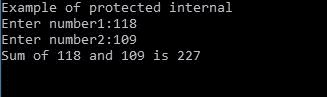
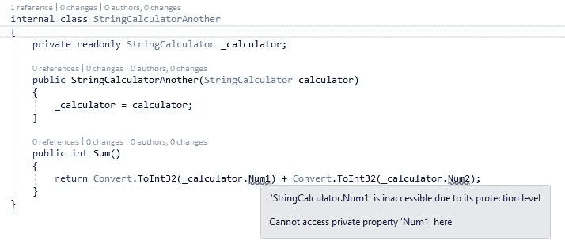
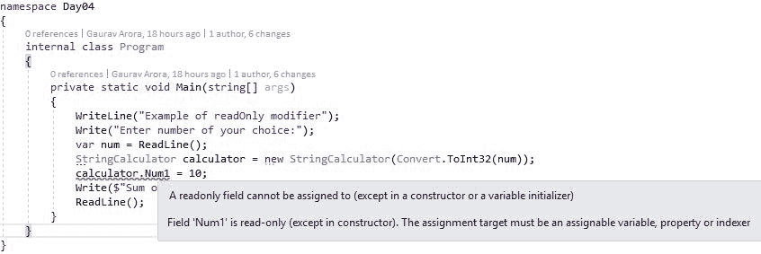
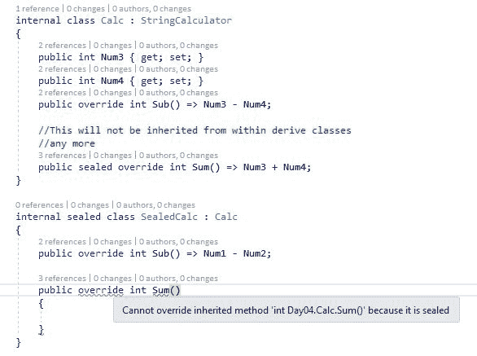
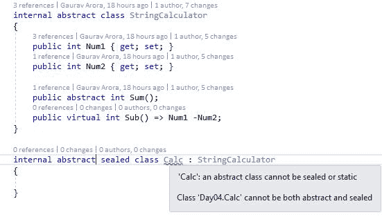
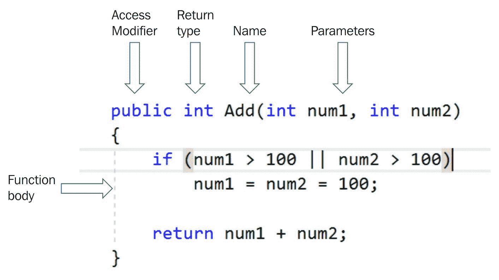
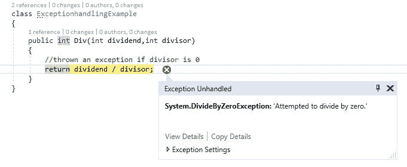
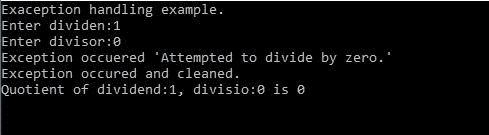

# 四、讨论 C# 类成员

我们在七天学习系列的第四天。第二天，我们讨论了典型的 C# 程序，您了解了如何编译和执行程序。我们讨论了`Main`方法及其使用。我们还讨论了 C# 语言的保留关键字，然后，我们得到了 C# 中类和结构的概述。第三天，我们讨论了 C# 7.0 中引入的所有新特性。

在本章中，将解释 C# 方法和属性的基础，我们还将介绍 C# 中索引器的概念。第二天讨论的字符串操作将通过正则表达式进行扩展，我们将解释它为什么强大。文件管理将与一些中级文件系统观察员一起讨论。

今天，我们将更深入地介绍 C# 类。本章将涵盖以下主题:

*   修饰语
*   方法
*   性能
*   索引器
*   文件输入输出
*   异常处理
*   讨论正则表达式及其重要性

第二天，我们讨论了一个典型的 C# 程序，并讨论了如何编译和执行一个程序。`Main`方法的用途/重要性是什么？我们将继续同样的讨论，开始我们的第四天。

在开始之前，让我们在 String 计算器([https://github . com/garora/TDD-Katas/tree/develop/Src/cs/String calculator](https://github.com/garora/TDD-Katas/tree/develop/Src/cs/StringCalculator))中浏览一下我们程序的步骤。添加以字符串形式提供的数字是一个简单的要求。下面是一个简单的代码片段，它基于一行代码的要求，没有提到一个字符串中需要提供多少个数字:

```cs
namespace Day04
{
    class Program
    {
        static void Main(string[] args)
        {
            Write("Enter number1:");
            var num1 = ReadLine();
            Write("Enter number2:");
            var num2 = ReadLine();
            var sum = Convert.ToInt32(num1) +
            Convert.ToInt32(num2);
            Write($"Sum of {num1} and {num2} is {sum}");
            ReadLine();
        }
    }
}
```

当我们运行前面的代码时，我们将获得以下输出:


前面的代码运行良好，并给了我们预期的结果。我们之前讨论的需求非常有限和模糊。让我们详细说明最初的要求:

*   使用`Add`操作创建一个简单的字符串计算器:
    *   此操作应该只接受字符串数据类型的输入。
    *   `Add`操作可以取零、一或两个逗号分隔的数字，并将返回它们的和，例如， *1* 或 *1，2* 。
    *   `Add`操作应该接受空字符串，但是对于空字符串，它将返回零。

前面的需求在我们前面的代码片段中没有得到回答。为了达到这些要求，我们应该调整我们的代码片段，我们将在接下来的章节中讨论。

# 修饰语

修饰符只不过是 C# 中的特殊关键字，用于声明如何访问特定的方法、属性或变量。在本节中，我们将讨论修饰符，并使用代码示例讨论它们的用法。

The whole point of modifiers is encapsulation. It's about how objects get simplified by encapsulations, and modifiers are like knobs saying how much you want to show to some clients, and how much not to. To understand encapsulation, refer to day seven, *Encapsulation*.

# 访问修饰符和可访问性级别

访问修饰符告诉我们如何以及在哪里可以访问或使用成员、声明的类型等。下面的讨论将让您对所有访问修饰符和可访问性级别有一个更广泛的了解。

# 公众的

一个`public`修饰符帮助我们定义成员的范围，没有任何限制。这意味着，如果我们用公共访问修饰符定义任何类、方法、属性或变量，就可以访问该成员，而对其他成员没有任何限制。

The accessibility level of the type or the member of derived type that is declared using the public access modifier is unrestricted, which means it can be accessible anywhere.

为了理解无限制的可访问性级别，让我们考虑下面的代码示例:

```cs
namespace Day04
{
    internal class StringCalculator
    {
        public string Num1 { get; set; }
        public string Num2 { get; set; }

        public int Sum() => Convert.ToInt32(Num1) + Convert.ToInt32(Num2);
     }
}
```

在前面的代码片段中，我们用访问修饰符`public`声明了两个属性`Num1`和`Num2`，以及一个方法`Sum()`。这意味着其他类也可以访问这些属性和方法。下面是使用前面的类的代码片段:

```cs
namespace Day04
{
    class Program
    {
        static void Main(string[] args)
        {
            StringCalculator calculator = new
            StringCalculator();
            Write("Enter number1:");
            calculator.Num1 = ReadLine();
            Write("Enter number2:");
            calculator.Num2 = ReadLine();
            Write($"Sum of {calculator.Num1} and
            {calculator.Num2} is {calculator.Sum()}");
            ReadLine();
        }
    }
}
```

前面的代码片段将完美运行并产生预期的结果。当您运行前面的代码时，它将显示结果，如下图所示:


# 保护

一个`protected`修饰符帮助我们定义成员的范围，而不需要从定义成员的类中定义/创建类或类型。换句话说，当我们用访问修饰符`protected`定义变量、属性或方法时，这意味着这些的可用性范围在定义所有这些成员的类中。

The accessibility level of the type or the member of derived type that is declared using protected access modifiers is restricted, which means it can only be accessible within the class or from the derived types that are created from class of the member. The protected modifier is importantly and actively responsible in OOPS using C#. You should get an idea of inheritance. Refer to day seven, *Inheritance*.

为了理解受保护的可访问性级别，让我们考虑下面的代码示例:

```cs
namespace Day04
{
    class StringCalculator
    {

        protected string Num1 { get; set; }
        protected string Num2 { get; set; }

    }

    class StringCalculatorImplementation : StringCalculator
    {
        public void Sum()
        {
            StringCalculatorImplementation calculator =
            new StringCalculatorImplementation();

            Write("Enter number1:");

            calculator.Num1 = ReadLine();

            Write("Enter number2:");

            calculator.Num2 = ReadLine();

            int sum = Convert.ToInt32(calculator.Num1) +
            Convert.ToInt32(calculator.Num2);

            Write($"Sum of {calculator.Num1} and
            {calculator.Num2} is {sum}");
        }
    }
}
```

在前面的代码中，我们有两个类:`StringCalculator`和`StringCalculatorImplementation`。属性是用`StringCalculator`类中的`protected`访问修饰符定义的。这意味着这些属性只能从`StringCalculator`类或`StringCalculatorImplementation`中访问(这是`StringCalculatorclass`的派生类型)。前面的代码将产生以下输出:


以下代码将不起作用，并将产生编译时错误:

```cs
class StringCalculatorImplementation : StringCalculator
{
    readonly StringCalculator _stringCalculator = new
    StringCalculator();
    public int Sum()
    {
        var num=_stringCalculator.Num1; //will not work
        var number=_stringCalculator.Num2; //will not work

        //other stuff
    }
}
```

在前面的代码中，我们试图通过创建`StringCalculator`类的实例来从`StringCalculatorImplementation`类访问`Num1`和`Num2`。这是不可能的，也不会起作用。参考以下截图:


# 内部的

内部修饰符帮助我们定义同一程序集的成员范围。使用内部访问修饰符定义的成员不能访问定义它们的程序集之外的内容。

The accessibility level of the type or the member that is declared using internal access modifiers is restricted for outside the assembly. This means these members are not allowed to access from external assemblies.

为了理解内部可访问性级别，让我们考虑下面的代码示例:

```cs
namespace ExternalLib
{
    internal class StringCalculatorExternal
    {
        public string Num1 { get; set; }
        public string Num2 { get; set; }
    }
}
```

该代码属于程序集`ExternalLib`，该程序集包含一个`StringCalculatorExternal`类内部访问修饰符，具有两个属性，`Num1`和`Num2`，用`public`访问修饰符定义。如果我们从其他程序集中调用这段代码，它将不起作用。让我们考虑下面的代码片段:

```cs
namespace Day04
{
    internal class StringCalculator
    {
        public int Sum()
        {
            //This will not work
            StringCalculatorExternal externalLib = new StringCalculatorExternal();
            return Convert.ToInt32(externalLib.Num1) + Convert.ToInt32(externalLib.Num2);
        }
    }
}
```

前面的代码是第四天单独的组装，我们试图调用一个`StringCalculatorExternal`类的组装`ExternalLib`这是不可能的，因为我们已经将这个类定义为`internal`。此代码将引发以下错误:


# 复合材料

当我们联合使用受保护和内部访问修饰符时，即受保护的内部，这种修饰符的组合称为复合修饰符。

`protected internal` means protected or internal and not protected and internal. This means a member can be accessed from any class within the same assembly.

为了理解受保护的内部可访问性级别，让我们考虑下面的代码示例:

```cs
namespace Day04
{
    internal class StringCalculator
    {
        protected internal string Num1 { get; set; }
        protected internal string Num2 { get; set; }
    }

    internal class StringCalculatorImplement :
    StringCalculator
    {
        public int Sum() => Convert.ToInt32(Num1) + Convert.ToInt32(Num2);
    }
}
```

前面的代码是针对装配第四天的类`StringCalculatorImplement`，也就是继承的`StringCalculator`类(这个类有两个带有`protected internal`访问修饰符的属性)。让我们考虑来自同一程序集的代码:

```cs
namespace Day04
{
    internal class Program
    {
        private static void Main(string[] args)
        {
            var calculator = new
            StringCalculatorImplement();
            Write("Enter number1:");
            calculator.Num1 = ReadLine();
            Write("Enter number2:");
            calculator.Num2 = ReadLine();

            Write($"Sum of {calculator.Num1} and
            {calculator.Num2} is {calculator.Sum()}");
            ReadLine();
        }
    }
}
```

前面的代码将产生以下输出:



# 私人的

一个`private`修饰符是成员的最低范围。这意味着每当使用`private`修饰符定义成员时，该成员只能在定义它的类中访问。

`private` means restricted access, and the member can only be accessed from within class or its nested types, if defined.

为了理解私有可访问性级别，让我们考虑下面的代码示例:

```cs
internal class StringCalculator
{
    private string Num1 { get; set; }
    private string Num2 { get; set; }

    public int Sum() => Convert.ToInt32(Num1) + Convert.ToInt32(Num2);
}
```

在前面的代码属性中，`StringCalculator`类之外的人无法访问`Num1`和`Num2`。以下代码不起作用:

```cs
internal class StringCalculatorAnother
{
    private readonly StringCalculator _calculator;

    public StringCalculatorAnother(StringCalculator
    calculator)
    {
        _calculator = calculator;
    }

    public int Sum() => Convert.ToInt32(_calculator.Num1) +        Convert.ToInt32(_calculator.Num2);

}
```

前面的代码将抛出一个编译时错误，如下图所示:



# 访问修饰符的规则

我们已经讨论了访问修饰符和使用这个访问修饰符的可访问性。现在，在使用这里讨论的这些访问修饰符时，我们应该遵循某些规则:

*   **组合限制**:使用访问修饰符时有限制。除非您使用受内部保护的访问修饰符，否则这些修饰符不应组合使用。考虑上一节中讨论的代码示例。
*   **命名空间限制**:这些访问修饰符不应该和命名空间一起使用。
*   **默认可访问性限制**:当或者如果一个成员声明时没有访问修饰符，则使用默认可访问性。所有类都是隐式内部的，其成员是私有的。
*   **顶级类型限制**:顶级类型是有直接父类型对象的父类型。父级或顶级类型不能使用除`internal`或`public`可访问性以外的任何可访问性。如果没有应用访问修饰符，默认的可访问性将是内部的。
*   **嵌套类型限制**:嵌套类型是其他类型的成员，或者具有通用类型以外的直接父类型，即对象。这些的可访问性可以声明如下表中所述([https://docs . Microsoft . com/en-us/dotnet/csharp/language-reference/keywords/accessibility-levels](https://docs.microsoft.com/en-us/dotnet/csharp/language-reference/keywords/accessibility-levels)):

| **嵌套类型** | **成员的默认可访问性** | **可以声明允许的可访问性** | **描述** |
| 列举型别 | `public` | 没有人 | `enum`有公共可达性，其成员只有`public`可达性。这些用于其他类型；因此，不允许他们显式设置任何可访问性。 |
| 班级 | `private` | `public`、`internal`、`protected`、`private`、`protected internal` | 默认情况下，类是内部的，成员是`private.`有关更多详细信息，请参考上一节-访问修饰符规则。 |
| 连接 | `public` | 没有人 | 默认情况下，接口是内部的，其成员是`public.`接口的成员意味着从继承的类型中使用，因此接口不允许显式的可访问性。 |
| 结构体 | `private` | `public`、`internal`、`private` | 与`class`相同，结构体默认为内部，其成员为`private`。我们可以明确应用`public`、`internal`和`private`的可访问性。 |

# 摘要

简单来说，我们可以说一个抽象修饰语表示事情还有待完成。当使用抽象修改器创建`class`时，`class`只是其他类的基类。在这个`class`中标记为抽象的成员应该在派生类中实现。

The abstract modifier indicates incomplete things and can be used with class, method, property, indexer, and/or event. Members marked as abstract would not be allowed to define accessibility other than `public`, `protected`, `internal` and `protected internal`.

抽象类是半定义的。这意味着它们提供了一种将成员重写为子类的方法。我们应该在项目中使用基类，在项目中，我们需要为所有具有自己实现的子类拥有相同的成员，或者需要重写。例如，让我们考虑具有抽象方法颜色的抽象类汽车，并拥有子类本田汽车、福特汽车、马鲁蒂汽车等等。在这种情况下，所有的子类都有 color 成员，但是实现方式不同，因为 color 方法会在子类中被它们自己的实现所覆盖。这里需要注意的一点是，抽象类表示的是一种关系。

为了理解这个修饰符的能力，让我们考虑下面的例子:

```cs
namespace Day04
{
    internal abstract class StringCalculator
    {
        public abstract string Num1 { get; set; }
        protected abstract string Num2 { get; set; }
        internal abstract string Num3 { get; set; }
        protected internal abstract string Num4 { get;
        set; }

        public int Sum() => Convert.ToInt32(Num1) +            Convert.ToInt32(Num2);
    }
}
```

前面的代码片段是一个抽象类，包含抽象属性和非抽象方法。其他类只能实现这个类。请参考以下代码片段:

```cs
internal class StringCalculatorImplement : StringCalculator
{
    public override string Num1 { get; set; }
    protected override string Num2 { get; set; }
    internal override string Num3 { get; set; }
    protected internal override string Num4 { get; set; }

    //other stuffs here
}
```

在前面的代码片段中，`StringCalculatorImplement`正在实现抽象类`StringCalculator`，所有成员都被标记为抽象。

# 抽象修饰语的规则

使用抽象修饰符时，我们需要遵循某些规则，这些规则讨论如下:

*   **实例化**:如果一个类被标记为抽象类，我们就不能创建它的实例。换句话说，抽象类不允许对象初始化。如果我们试图显式地这样做，我们将会得到一个编译时错误。参考下面的截图，我们试图实例化一个抽象类:


*   **非抽象**:类可以包含也可以不包含被标记为抽象的抽象方法或成员。这意味着当我们必须为抽象类创建所有抽象成员和方法时，没有任何限制。以下代码遵循此规则:

```cs
internal abstract class StringCalculator
{
    public abstract string Num1 { get; set; }
    public abstract string Num2 { get; set; }
    public abstract int SumToBeImplement();

    //non-abstract
    public int Sum() => Convert.ToInt32(Num1) + Convert.ToInt32(Num2);
}

internal class StringCalculatorImplement : StringCalculator
{
    public override string Num1 { get; set; }
    public override string Num2 { get; set; }
    public override int SumToBeImplement() => Convert.ToInt32(Num1) + Convert.ToInt32(Num2);
}
```

*   **限制** - **继承自然**:正如我们所讨论的，抽象类意味着被其他类继承。如果我们不想从其他类继承抽象类，我们应该使用密封的修饰符。我们将在接下来的章节中详细讨论这一点。

For more information, refer to [https://docs.microsoft.com/en-us/dotnet/csharp/programming-guide/classes-and-structs/abstract-and-sealed-classes-and-class-members.](https://docs.microsoft.com/en-us/dotnet/csharp/programming-guide/classes-and-structs/abstract-and-sealed-classes-and-class-members)

*   **实现性质**:抽象类的所有成员都应该在继承抽象类的子类中实现，前提是该子类是非抽象的。为了理解这一点，让我们考虑以下示例:

```cs
internal abstract class StringCalculator
{
    public abstract string Num1 { get; set; }
    public abstract string Num2 { get; set; }
    public abstract int SumToBeImplement();

    //non-abstract
    public int Sum() => Convert.ToInt32(Num1) + Convert.ToInt32(Num2);
}
internal abstract class AnotherAbstractStringCalculator: StringCalculator
{
    //no need to implement members of StringCalculator class  
}
```

前面的代码片段显示了两个抽象类。一个子抽象类`AnotherAbstractString`正在继承另一个抽象类`StringCalculator`。因为两个类都是抽象的，所以没有必要实现继承的抽象类的成员，即`StringCalculator`。

现在，考虑另一个例子，其中继承的类是非抽象的。在这种情况下，子类应该实现抽象类的所有抽象成员；否则，它将引发编译时错误。请看下面的截图:


*   **本质上是虚拟的**:默认情况下，`abstract`类标记为抽象的方法和属性本质上是虚拟的。这些方法和属性将在继承的类中被重写。

下面是抽象类实现的完整示例:

```cs
internal abstract class StringCalculator
{
    public  string Num1 { get; set; }
    public  string Num2 { get; set; }
    public abstract int Sum();

}

internal class StringCalculatorImplement : StringCalculator
{
    public override int Sum() => Convert.ToInt32(Num1) +     Convert.ToInt32(Num2);
}
```

# 异步ˌ非同步(asynchronous)

`async`修饰符提供了一种使匿名类型的方法或 lambda 表达式异步的方法。当与方法一起使用时，该方法被称为`async`方法。

`async` will be discussed in details on day six.

考虑下面的代码示例:

```cs
internal class StringCalculator
{
    public string Num1 { get; set; }
    public string Num2 { get; set; }
    public async Task<int> Sum() => await Task.Run(()=>Convert.ToInt32(Num1) +
        Convert.ToInt32(Num2));
}
```

前面的代码将提供与前面部分的代码示例中讨论的相同的结果；唯一的区别是这个方法调用是异步的。

# 常数

`const`修改器提供了定义常量字段或常量局部的能力。当我们使用`const`定义字段或变量时，这些字段不再被称为变量，因为`const`不意味着改变，而变量是。常量字段是类级常量，可以在`class`内部或外部访问(取决于它们的修饰符)，而常量局部变量是在方法中定义的。

Fields and variables defined as `const` are not variables and may not be modified. These constants can be any of these: numbers, bool, string, or null references. A static modifier is not allowed while declaring constants.

下面是显示有效常量声明的代码片段:

```cs
internal class StringCalculator
{
    private const int Num1 = 70;
    public const double Pi = 3.14;
    public const string Book = "Learn C# in 7-days";

    public int Sum()
    {
        const int num2 = Num1 + 85;
        return  Convert.ToInt32(Num1) + Convert.ToInt32(num2);
    }
}
```

# 事件

修饰符`event`帮助声明`publisher`类的事件。我们将在第五天详细讨论这个问题。有关该修饰符的更多信息，请参考[https://docs . Microsoft . com/en-us/dotnet/csharp/language-reference/keywords/event。](https://docs.microsoft.com/en-us/dotnet/csharp/language-reference/keywords/event)

# 走读生

修饰符`extern`帮助声明一个使用外部库或 dll 的方法。当您想要使用外部非托管库时，这一点很重要。

使用`extern`关键字实现外部非托管库的方法必须声明为静态的。更多信息请参考[https://docs . Microsoft . com/en-us/dotnet/cs harp/language-reference/keywords/extern。](https://docs.microsoft.com/en-us/dotnet/csharp/language-reference/keywords/extern)

# 新的

`new`运算符可以是修饰符、运算符或修饰符。让我们详细讨论一下:

*   **操作符** : `new`作为操作符帮助我们创建`class`的对象实例，并调用它们的构造函数。例如，下面一行显示了`new`作为操作员的用法:

```cs
StringCalculator calculator = new StringCalculator();
```

*   **修改器**:新修改器有助于隐藏从基类继承的成员:

```cs
internal class StringCalculator
{
    private const int Num1 = 70;
    private const int Num2 = 89;

    public int Sum() => Num1 + Num2;
}

internal class StingCalculatorImplement : StringCalculator
{
    public int Num1 { get; set; }
    public int Num2 { get; set; }

    public new int Sum() => Num1 + Num2;
}
```

这也被称为隐藏在 C# 中。

*   **约束**:作为约束的`new`运算符确保在每个泛型类的声明中，它必须有一个公共的无参数构造函数。这将在第五天详细讨论。

# 推翻

`override`修饰符有助于扩展继承成员(即方法、属性、索引器或事件)的抽象或虚拟实现。这将在第七天详细讨论。

# 部分的

借助`partial`修改器，我们可以将一个类、一个接口或一个结构拆分成多个文件。请看下面的代码示例:

```cs
namespace Day04
{
    public partial class Calculator
    {
        public int Add(int num1, int num2) => num1 + num2;
    }
}
namespace Day04
{
    public partial class Calculator
    {
        public int Sub(int num1, int num2) => num1 - num2;
    }
}
```

这里，我们有两个文件，`Calculator.cs`和`Calculator1.cs`。两个文件都有`Calculator`作为他们的分部。

# 只读的

`readonly`修改器帮助我们创建一个字段声明为`readonly`。`readonly`字段只能在声明时或作为声明本身的一部分被赋值。为了更好地理解这一点，请考虑下面的代码片段:

```cs
internal class StringCalculator
{
    private readonly int _num2;
    public readonly int Num1 = 179;

    public StringCalculator(int num2)
    {
        _num2 = num2;
    }

    public int Sum() => Num1 + _num2; 
}
```

在前面的代码片段中，我们有两个字段，`Num1`和`_num2`是`readonly`。下面是告诉我们如何使用这些字段的代码片段:

```cs
namespace Day04
{
    internal class Program
    {
        private static void Main(string[] args)
        {
            WriteLine("Example of readOnly modifier");
            Write("Enter number of your choice:");
            var num = ReadLine();
            StringCalculator calculator =
            newStringCalculator(Convert.ToInt32(num));
            Write($"Sum of {calculator.Num1} and {num} is
            {calculator.Sum()}");
            ReadLine();
        }
    }
}
```

在前面的代码片段中，字段`_num2`是从构造函数初始化的，`Num1`是在其声明时初始化的。当您运行前面的代码时，它会生成如下图所示的输出:


如果我们显式地试图给`Num1 readonly`字段赋值，它会抛出一个编译时错误。请看下面的截图:



在前面截图中显示的代码片段中，我们试图将值`Num1`赋给`readonly`字段。这是不允许的，所以它会抛出一个错误。

# 密封的

修饰语`sealed`是这样的东西，当与`class`一起应用时，表示“我不会再有任何类型的继承了。现在不要继承我。”简单来说，这个修饰符限制了类被其他类继承。

The modifier sealed is used with override when applying abstract methods (which are virtual in default by nature) to derived or inherited class.

为了更好地理解这一点，让我们考虑下面的代码示例:

```cs
internal abstract class StringCalculator
{
    public int Num1 { get; set; }
    public int Num2 { get; set; }

    public abstract int Sum();
    public virtual int Sub() => Num1 -Num2;
}
internal class Calc : StringCalculator
{
    public int Num3 { get; set; }
    public int Num4 { get; set; }
    public override int Sub() => Num3 - Num4;
    //This will not be inherited from within derive classes
    //any more
    public sealed override int Sum() => Num3 + Num4;
}
```

前面的代码片段定义了抽象类及其抽象方法和一个虚拟方法。现在，抽象方法和虚拟方法都可以在派生类中被重写。因此，在类`calc`中，方法`Sum()`和`Sub()`都被覆盖。从这里开始，方法`Sub()`可以进一步覆盖，但是`Sum()`是一个密封的方法，所以我们不能在派生类中再覆盖这个方法了。如果我们明确地尝试这样做，它会抛出一个编译时错误，如下图所示:



不能对抽象类应用密封修饰符。如果我们明确尝试这样做，它最终会抛出一个编译时错误。请看下面的截图:



# 静电

修饰符`static`帮助我们声明静态成员。这些成员实际上也称为类级成员，而不是对象级成员。这意味着不需要创建对象的实例来使用这些成员。

# 静态修饰符的规则

使用`static`修改器时，需要遵循某些规则:

*   **限制**:只能对类、字段、方法、属性、运算符、事件和构造函数使用`static`修饰符。该修饰符不能用于除`class`以外的索引器和类型。
*   **由静而自然**:当我们声明一个常数时，它就隐含着由静而自然。考虑以下代码片段:

```cs
internal class StringCalculator
{
   public const int Num1 = 10;
   public const int Num2 = 20;
}
```

前面的`StringCalculator`类有两个常量，`Num1`和`Num2`。这些都可以通过`class`访问，不需要创建`class.`的实例，参见下面的代码片段:

```cs
internal class Program
{
    private static void Main(string[] args)
    {
        WriteLine("Example of static modifier");
        Write($"Sum of {StringCalculator.Num1} and
        {StringCalculator.Num2} is{StringCalculator.Num1 +
        StringCalculator.Num2}");
        ReadLine();
    }
}
```

*   **完全静态**:如果类是用`static`修饰符定义的，那么这个`static`类的所有成员都应该是`static`。如果明确定义`static`类来创建非静态成员，将会出现编译时错误。考虑以下截图:


*   **可用性**:不需要创建类的实例来访问`static`成员。
    关键字`this`不能应用于`static`方法或属性。我们已经在第二天讨论过这个问题，并建立了关键词。

# 危险的

这个修饰符有助于使用不安全的代码块。我们将在第六天详细讨论这个问题。

# 虚拟的

这个修饰符帮助我们定义在继承类中被覆盖的虚拟方法。请参见以下代码:

```cs
internal class StringCalculator
{
    private const int Num1 = 70;
    private const int Num2 = 89;

    public virtual int Sum() => Num1 + Num2;
}

internal class StingCalculatorImplement : StringCalculator
{
    public int Num1 { get; set; }
    public int Num2 { get; set; }

    public override int Sum() => Num1 + Num2;
}
```

For more information, refer to [https://docs.microsoft.com/en-us/dotnet/csharp/language-reference/keywords/virtual.](https://docs.microsoft.com/en-us/dotnet/csharp/language-reference/keywords/virtual)

# 方法

具有访问修饰符、名称、返回类型和参数(可能有也可能没有)的语句块只不过是一个方法。方法意味着执行一些任务。

Methods are meant to call either by another method or by another program.

# 如何使用方法？

如前所述，方法旨在执行一些操作。因此，任何需要使用这些动作的方法或程序都可以调用/消费/使用定义的方法。

一种方法具有如下讨论各种元素:

*   **访问修饰符**:一个方法应该有一个访问修饰符(关于修饰符的更多细节，请参考上一节)。例如，修饰符帮助我们定义方法的范围或方法的可用性。使用`private`修改器定义的方法只能对自己的类可见。
*   **返回类型**:执行一个动作之后，一个方法可能会也可能不会返回什么。方法返回类型基于数据类型(有关数据类型的信息，请参考第二天)。例如，如果方法返回一个数字，它的数据类型将是一个 int，如果方法不返回任何东西，它的返回类型将是`void`。
*   **名称**:一个名称在`class`内是唯一的。名称区分大小写。在类`StringCalculator`中，我们不能定义两个名为`Sum()`的方法。
*   **参数:**这些参数对于任何方法都是可选的。这意味着方法可能有参数，也可能没有参数。参数是基于数据类型定义的。
*   **功能体**:一个方法要执行的一部分指令只不过是该方法的一个功能。

下面的截图显示了一个典型的方法:



在继续之前，让我们回顾一下我们在第四天开始时讨论的需求，在那里我们创建了一个计算字符串参数列表总和的方法。以下是满足这些要求的程序:

```cs
namespace Day04
{
    class StringCalculatorUpdated
    {
        public int Add(string numbers)
        {
            int result=0;
            if (string.IsNullOrEmpty(numbers))
                return result;
            foreach (var n in numbers.Split(','))
            {
                result +=
                Convert.ToInt32(string.IsNullOrEmpty(n) ? "0" : n);
            }
            return result;
        }
    }
}
namespace Day04
{
    internal class Program
    {
        private static void Main(string[] args)
        {
            WriteLine("Example of method");
            StringCalculatorUpdated calculator = new
            StringCalculatorUpdated();
            Write("Enter numbers comma separated:");
            var num = ReadLine();
            Write($"Sum of {num} is
            {calculator.Add(num)}");
            ReadLine();
        }
    }
}
```

前面的代码产生了预期的输出。参考以下截图:


前面的代码运行得非常好，但是需要重构，所以让我们将代码分成小方法:

```cs
namespace Day04
{
    internal class StringCalculatorUpdated
   {
        public int Add(string numbers) =>
        IsNullOrEmpty(numbers) ? 0 :
        AddStringNumbers(numbers);

        private bool IsNullOrEmpty(string numbers) =>
        string.IsNullOrEmpty(numbers);

        private int AddStringNumbers(string numbers) =>
        GetSplittedStrings(numbers).Sum(StringToInt32);

        private IEnumerable<string>
        GetSplittedStrings(string numbers) =>
        numbers.Split(',');
        private int StringToInt32(string n) =>
        Convert.ToInt32(string.IsNullOrEmpty(n) ? "0" : n);
    }
}
```

Code refactoring is beyond the scope of this book. For more details on code refactoring, refer to [https://www.packtpub.com/application-development/refactoring-microsoft-visual-studio-2010.](https://www.packtpub.com/application-development/refactoring-microsoft-visual-studio-2010)

现在，我们的代码看起来更好读了。这将产生相同的输出。

# 性能

属性是类、结构或接口的成员，通常称为命名成员。属性的预期行为类似于字段，区别在于属性的实现可以使用访问器。

Properties are extensions to fields. The accessors get and set helps retrieve and assign value to property.

下面是一个类的典型属性(也称为带有自动属性语法的属性):

```cs
public int Number { get; set; }
```

对于 auto 属性，编译器生成备份字段，它只是一个存储字段。因此，前面的属性将显示如下，带有一个备份字段:

```cs
private int _number;

public int Number
{
    get { return _number; }
    set { _number = value; }
}
```

前面带有表达式主体的属性如下所示:

```cs
private int _number;
public int Number
{
    get => _number;
    set => _number = value;
}
```

For more details on the expression bodies property, refer to [https://visualstudiomagazine.com/articles/2015/06/03/c-sharp-6-expression-bodied-properties-dictionary-initializer.aspx.](https://visualstudiomagazine.com/articles/2015/06/03/c-sharp-6-expression-bodied-properties-dictionary-initializer.aspx)

# 属性类型

我们可以声明或玩多种口味的属性。我们刚刚讨论了自动属性，并讨论了编译器如何用备份存储字段转换它。在本节中，我们将讨论其他类型的可用属性。

# 读写属性

允许我们存储和检索值的属性只是一个读写属性。具有后备存储字段的典型读写属性将同时具有`set`和`get`访问器。`set`存取器存储属性的数据类型的数据。请注意，对于 set 访问器，总是有一个参数，即值，这与属性的存储数据或数据类型相匹配。

Auto properties are automatically converted to property with backing storage fields by the compiler.

请参见下面的代码片段来详细理解这一点:

```cs
internal class ProeprtyExample
{
    private int _num1;
    //with backing field
    public int Num1
    {
        get => _num1;
        set => _num1 = value;
    }
    //auto property
    public int Num2 { get; set; }
}
```

以前，我们有两个属性:一个使用 backing 字段定义，另一个由 auto 属性定义。存取器`set`负责使用参数值存储数据，与数据类型 int 匹配，`get`负责检索数据类型 int 的数据。

# 只读属性

仅使用`get`访问器或私有`set`访问器定义的属性称为只读属性。

There is slight difference between read-only and `const`. Refer to [https://stackoverflow.com/questions/55984/what-is-the-difference-between-const-and-readonly](https://stackoverflow.com/questions/55984/what-is-the-difference-between-const-and-readonly) for more details.

顾名思义，只读属性只检索值。不能将数据存储在只读属性中。有关更多详细信息，请参见下面的代码片段:

```cs
internal class PropertyExample
{
    public PropertyExample(int num1)
    {
        Num1 = num1;
    }
    //constructor restricted property
    public int Num1 { get; }
    //read-only auto proeprty
    public int Num2 { get; private set; }
    //read-only collection initialized property
    public IEnumerable<string> Numbers { get; } = new List<string>();
}
```

在前面的代码中，我们有三个属性；都是只读的。`Num1`是只读属性，这受到构造函数的限制。这意味着您只能在构造函数中设置属性。`Num2`是纯只读属性；这意味着它旨在检索数据。Numbers 是自动初始值设定项的只读属性；它具有集合属性的默认初始化。

# 计算属性

返回表达式结果的属性称为计算属性。该表达式可以基于同一类的其他属性，也可以基于任何具有符合 CLR 的数据类型(有关数据类型，请参考第二天)的有效表达式，这些数据类型应该与属性数据类型相同。

Computed properties return the results of an expression and cannot allow to set data, so these are some kind of read-only property.

为了详细了解这一点，让我们考虑以下几点:

# 身体强壮的成员

在块体计算属性中，使用 get 访问器返回计算结果。请参考以下示例:

```cs
internal class ProeprtyExample
{
    //other stuff removed
    public int Num3 { get; set; }
    public int Num4 { get; set; }
    public int Sum {
        get
        {
            return Num3 + Num4;
        }
    }
}
```

在前面的代码中，我们有三个属性:`Num3`、`Num4`和`Sum`。属性`Sum`是一个计算属性，它从 get 访问器中返回一个表达式结果。

# 表达体成员

在表达式主体中，使用表达式主体成员使用的 lambda 表达式返回计算的属性计算。请参考以下示例:

```cs
internal class ProeprtyExample
{
    public int Num3 { get; set; }
    public int Num4 { get; set; }
    public int Add => Num3 + Num4;
}
```

在前面的代码中，我们的`Add`属性返回了另外两个属性的`Sum`表达式。

# 使用验证的属性

可能会有我们想要验证某些属性数据的场景。然后，我们将使用一些验证和属性。这些不是特殊类型的属性，而是带有验证的完整属性。

数据注释是验证各种属性和添加自定义验证的一种方式。更多信息请参考[https://www . code project . com/Articles/826304/Basic-数据介绍-NET-Frame 中的注释。](https://www.codeproject.com/Articles/826304/Basic-Introduction-to-Data-Annotation-in-NET-Frame)

当我们需要使用属性验证输入时，这些属性在场景中非常重要。考虑以下代码片段:

```cs
internal class ProeprtyExample
{
    private int _number;
    public int Number
    {
        get => _number;
        set
        {
            if (value < 0)
            {
                //log for records or take action
                //Log("Number is negative.");
                throw new ArgumentException("Number can't be -ve.");
            }
            _number = value;
        }
    }
}
```

在前面的代码中，没有必要对前面属性的客户端代码应用任何显式验证。每当调用属性`Number`来存储数据时，它都是自验证的。在前面的代码中，每当客户端代码试图输入任何负数时，它都会隐式抛出一个该数不能为负数的异常。在这种情况下，客户端代码只输入正数。在同一个节点上，您可以根据需要应用任意多的验证。

# 索引器

索引器提供了一种通过类似数组的索引来访问对象的方法。例如，如果我们为一个类定义一个索引器，这个类的工作方式类似于数组。这意味着这个类的集合可以通过索引来访问。

Keyword `this` is used to define an indexer. The main benefit of indexer is that we can set or retrieve the indexed value without explicitly specifying a type.

考虑以下代码片段:

```cs
public class PersonCollection
{
    private readonly string[] _persons = Persons();
    public bool this[string name] => IsValidPerson(name);
    private bool IsValidPerson(string name) =>
    _persons.Any(person => person == name);

    private static string[] Persons() => new[]
    {"Shivprasad","Denim","Vikas","Merint","Gaurav"};
}
```

前面的代码是表示索引器能力的更简单的代码。我们有一个`PersonCollection`类，它有一个索引器，可以通过索引器访问这个类。请参考以下代码:

```cs
private static void IndexerExample()
{
    WriteLine("Indexer example.");
    Write("Enter person name to search from collection:");
    var name = ReadLine();
    var person = new PersonCollection();
    var result = person[name] ? "exists." : "does not
    exist.";
    WriteLine($"Person name {name} {result}");
}
```

执行前面的代码后，我们可以看到以下输出:


有关索引器的更多信息，请参考[https://docs . Microsoft . com/en-us/dotnet/cs harp/programming-guide/索引器/。](https://docs.microsoft.com/en-us/dotnet/csharp/programming-guide/indexers/)

# 文件输入输出

文件只不过是物理存储在系统目录中的数据集合。文件包含的数据可以是任何信息。在 C# 中，只要文件可以通过编程方式进行信息检索(读取)或更新信息(写入)，它就是一个流。

Stream is nothing but a sequence of bytes.

在 C# 文件中，输入/输出只是调用输入流或输出流的一种方式:

*   **输入流**:这只是一个读操作。每当我们以编程方式从文件中读取数据时，它就被称为输入流或读取操作。
*   **输出流**:这不过是一个更新操作。每当我们以编程方式向文件中添加数据时，它就被称为输出流或写操作。

文件输入/输出是包含各种类的`System.IO`命名空间的一部分。在本节中，我们将讨论我们将在代码示例中使用的 FileStream。

A complete list of System.IO classes is available at [https://docs.microsoft.com/en-us/dotnet/api/system.io?view=netcore-2.0.](https://docs.microsoft.com/en-us/dotnet/api/system.io?view=netcore-2.0)

# 对象

如前所述，在`System.IO`命名空间下有几个有用的类。FileStream 是帮助我们向/从文件中读取/写入数据的类之一。在继续讨论这个`class`之前，让我们考虑一个简短的例子，我们将创建一个文件:

```cs
private static void FileInputOutputOperation()
{
    const string textLine = "This file is created during
    practice of C#";
    Write("Enter file name (without extension):");
    var fileName = ReadLine();
    var fileNameWithPath = $"D:/{fileName}.txt";
    using (var fileStream = File.Create(fileNameWithPath))
    {
        var iBytes = new
        UTF8Encoding(true).GetBytes(textLine);
        fileStream.Write(iBytes, 0, iBytes.Length);
    }
    WriteLine("Write operation is completed.");
    ReadLine();
    using (var fileStream =
    File.OpenRead(fileNameWithPath))
    {
        var bytes = new byte[1024];
        var encoding = new UTF8Encoding(true);
        while (fileStream.Read(bytes, 0, bytes.Length) >
        0)
        WriteLine(encoding.GetString(bytes));
    }
}
```

前面的代码首先创建一个包含特定文本/数据的文件，然后显示相同的内容。下面是前面代码的输出。参考以下截图:


A complete reference of FileStream is available at [https://docs.microsoft.com/en-us/dotnet/api/system.io.filestream?view=netcore-2.0.](https://docs.microsoft.com/en-us/dotnet/api/system.io.filestream?view=netcore-2.0)

# 异常处理

异常是一种错误，当方法不能按预期工作或者不能按预期处理情况时就会出现。有时，可能会出现未知的异常情况；例如，在除法运算中，一个方法可能会出现被零除的情况。当有人编写该方法时，这种情况是从未预料到的，这是一个不可预测的情况错误。为了处理这类情况和其他可能产生异常或错误的未知场景，C# 提供了一种称为异常处理的方法。在本节中，我们将详细讨论使用 C# 的异常和异常处理。

Exceptions can be handled using the `try`...`catch`...`finally` block. Catch or finally blocks should be there with the try block to handle exceptions.

考虑以下代码:

```cs
class ExceptionhandlingExample
    {
        public int Div(int dividend,int divisor)
        {
            //thrown an exception if divisor is 0
            return dividend / divisor;
        }
    }
```

如果使用以下代码调用除数为零，前面的代码将引发未处理的除以零异常:

```cs
private static void ExceptionExample()
{
    WriteLine("Exaception handling example.");
    ExceptionhandlingExample example = new ExceptionhandlingExample();
    Write("Enter dividen:");
    var dividend = ReadLine();
    Write("Enter divisor:");
    var divisor = ReadLine();
    var quotient = example.Div(Convert.ToInt32(dividend), Convert.ToInt32(divisor));
    WriteLine($"Quotient of dividend:{dividend}, divisio:{divisor} is {quotient}");
}
```

请参见以下异常截图:



为了处理类似于前面情况的情况，我们可以使用异常处理。在 C# 中，异常处理有常见的组件，这里将讨论这些组件。

# 尝试阻止

`try`块是异常源块的代码。一个`try`区块可以有多个`catch`区块和/或一个最终区块。这意味着`try`块应该至少有一个捕捉块或一个最终块。

# 捕捉块

`catch`块是正在处理特定或一般异常的代码块。`catch`有一个参数`Exception`，告诉我们发生了什么异常。

# 最后封锁

`finally`块是在任何情况下执行的块(如果提供的话)，无论是否抛出异常。一般来说，`finally`块意味着在异常后执行很少的清理任务。

The `throw` keyword helps to throw a system or a custom exception.

现在，让我们重温前面抛出异常的代码:

```cs
class ExceptionhandlingExample
{
    public int Div(int dividend,int divisor)
    {
        int quotient = 0;
        try
        {
            quotient = dividend / divisor;
        }
        catch (Exception exception)
        {
            Console.WriteLine($"Exception occuered
            '{exception.Message}'");
        }
        finally
        {
            Console.WriteLine("Exception occured and cleaned.");
        }
        return quotient;
    }
}
```

这里我们通过增加`try`修改了代码...`catch`...`finally`街区。现在，只要发生异常，它首先进入`catch`模块，然后进入`finally`模块。放入`finally`块后，无论何时我们除以零，都会出现异常，这将产生以下结果:



# catch 块中不同的编译器生成的异常

正如我们之前讨论的，在一个`try`块中可能有多个`catch`块。这意味着我们可以捕捉多个异常。可以编写不同的`catch`块来处理特定的异常类。例如，除零例外的`exception`类是`System.DivideByZeroException`。对所有这些类的完整讨论超出了本书的范围。关于这些异常类的进一步研究，请参考[https://docs . Microsoft . com/en-us/dotnet/cs harp/编程指南/异常/编译器生成的异常。](https://docs.microsoft.com/en-us/dotnet/csharp/programming-guide/exceptions/compiler-generated-exceptions)

# 用户定义的异常

根据需求创建的自定义异常是用户异常，当我们创建一个`exception`类来处理一个特定的场景时，它被称为用户定义的异常。所有用户定义的`exception`类都是从`Exception`类派生的。

让我们创建一个用户定义的`exception`。回想一下`StringCalculatorUpdated`类(在**方法**一节中讨论过)，它负责计算字符串数的总和。在现有的需求上增加一个场景，即如果任何数字大于 1000，抛出`NumberIsExceded`异常:

```cs
internal class NumberIsExcededException : Exception
{
    public NumberIsExcededException(string message) :
    base(message)
    {
    }
    public NumberIsExcededException(string message,
    Exception innerException):base(message,innerException)
    {
    }
    protected NumberIsExcededException(SerializationInfo
    serializationInfo, StreamingContext streamingContext)
    : base(serializationInfo, streamingContext) {}
}
```

前面的代码片段代表了我们的`NumberIsExcededException`类。我们有三个构造函数，它们都是不言自明的。第三个构造函数用于序列化。如果这里需要，我们可以进行序列化。因此，当异常从远程服务器传到客户端时，应该对其进行序列化。

下面是处理我们新创建的异常的代码片段:

```cs
internal class StringCalculatorUpdated
{
    public int Add(string numbers)
    {
        var result = 0;
        try
        {
            return IsNullOrEmpty(numbers) ? result :
            AddStringNumbers(numbers);
        }
        catch (NumberIsExcededException excededException)
        {
            Console.WriteLine($"Exception
            occurred:'{excededException.Message}'");
        }

        return result;
    }
    //other stuffs omitted

    private int StringToInt32(string n)
    {
        var number = 
        Convert.ToInt32(string.IsNullOrEmpty(n) ? "0" : n);
        if(number>1000)
            throw new NumberIsExcededException($"Number
            :{number} excedes the limit of 1000.");
        return number;
    }
}
```

现在，每当这个数字超过 1000，它就会抛出一个异常。让我们编写一个抛出异常的客户端代码，考虑前面的代码叫做:

```cs
private static void CallStringCalculatorUpdated()
{
    WriteLine("Rules for operation:");
    WriteLine("o This operation should only accept input
    in a string data type\n" +
              "o Add operation can take 0, 1, or 2 comma -
              separated numbers, and will return their sum
              for example \"1\" or \"1, 2\"\n" +
              "o Add operation should accept empty string
              but for an empty string it will return 0.\n"
              +
              "o Throw an exception if number > 1000\n");
              StringCalculatorUpdated calculator = new
              StringCalculatorUpdated();
    Write("Enter numbers comma separated:");
    var num = ReadLine();

    Write($"Sum of {num} is {calculator.Add(num)}"); 
}
```

前面的代码将生成以下输出:


# 讨论正则表达式及其重要性

正则表达式或模式匹配只是一种检查输入字符串是否正确的方法。这可以通过使用`System.Text.RegularExpressions`命名空间的`Regex`类来实现。

# 正则表达式的重要性

在我们验证文本输入时，模式匹配非常重要。在这里，正则表达式起着重要的作用。

# 灵活的

模式非常灵活，为我们提供了一种方法来创建自己的模式来验证输入。

# 构成

有各种各样的结构帮助我们定义正则表达式。因此，我们需要让它们在我们的编程中变得重要，因为我们需要经过验证的输入。这些构造是字符类、字符转义、量词等。

# 特殊字符

正则表达式在我们的日常程序中有大量的使用，这就是为什么正则表达式很重要。根据它们的用法，这里有各种场景，其中正则表达式的特殊字符帮助我们在输入带有模式时验证输入。

# 句点符号(。)

这是一个通配符，它匹配除换行符之外的任何字符。

# 文字符号(w)

反斜杠和一个小写的 *w* 是一个字符类，可以匹配任何单词字符。

# 空间标志

可以使用 *s* (反斜杠和 *s* 匹配空格。

# 数字符号(d)

数字 0 到 9 可以使用 *d* (反斜杠和小写 *d* 匹配。

# 连字符(-)

可以使用连字符( *-* )匹配字符范围。

# 指定匹配的数量

字符、组或字符类所需的最小匹配数可以用花括号( *{n}* )指定。

下面的代码片段显示了前面的特殊字符:

```cs
private static void ValidateInputText(string inputText, string regExp,bool isCllection=false,RegexOptions option=RegexOptions.IgnoreCase)
{
    var regularExp = new Regex(regExp,option);

    if (isCllection)
    {
        var matches = regularExp.Matches(inputText);
        foreach (var match in matches)
        {
            WriteLine($"Text '{inputText}' matches
            '{match}' with pattern'{regExp}'");
        }
    }
    var singleMatch = Regex.Match(inputText, regExp,
    option);
    WriteLine($"Text '{inputText}' matches '{singleMatch}'
    with pattern '{regExp}'");
    ReadLine();

}
```

前面的代码允许对其执行`inputText`和`Regexpression`。以下是调用代码:

```cs
private static void RegularExpressionExample()
{
    WriteLine("Regular expression example.\n");
    Write("Enter input text to match:");
    var inpuText = ReadLine();
    if (string.IsNullOrEmpty(inpuText))
        inpuText = @"The quick brown fox jumps over the lazy dog.";
    WriteLine("Following is the match based on different pattern:\n");
    const string theDot = @"\.";
    WriteLine("The Period sign [.]");
    ValidateInputText(inpuText,theDot,true);
    const string theword = @"\w";
    WriteLine("The Word sign [w]");
    ValidateInputText(inpuText, theword, true);
    const string theSpace = @"\s";
    WriteLine("The Space sign [s]");
    ValidateInputText(inpuText, theSpace, true);
    const string theSquareBracket = @"\[The]";
    WriteLine("The Square-Brackets sign [( )]");
    ValidateInputText(inpuText, theSquareBracket, true);
    const string theHyphen = @"\[a-z0-9]ww";
    WriteLine("The Hyphen sign [-]");
    ValidateInputText(inpuText, theHyphen, true);
    const string theStar = @"\[a*]";
    WriteLine("The Star sign [*] ");
    ValidateInputText(inpuText, theStar, true);
    const string thePlus = @"\[a+]";
    WriteLine("The Plus sign [+] ");
    ValidateInputText(inpuText, thePlus, true);
}
```

上述代码生成以下输出:


Regular expression is a broad topic. For more details, refer to [https://docs.microsoft.com/en-us/dotnet/api/system.text.regularexpressions?view=netcore-2.0.](https://docs.microsoft.com/en-us/dotnet/api/system.text.regularexpressions?view=netcore-2.0)

# 动手练习

以下是直到第四天你所学到的尚未解决的问题:

1.  什么是访问修饰符及其可访问性？
2.  编写程序使用`protected internal`。
3.  什么是抽象类？借助程序精心制作。
4.  抽象类有构造函数吗？如果是，为什么我们不能实例化抽象类？(参考[https://stackoverflow . com/questions/2700256/为什么不能创建抽象类的对象](https://stackoverflow.com/questions/2700256/why-cant-an-object-of-abstract-class-be-created))
5.  借助一个小程序，解释我们如何阻止抽象类被继承。
6.  区分`sync`和`async`方法。
7.  借助小程序区分`const`和`readOnly`修改器。
8.  给我们的`StringCalcuatorUpdated`例子写一个程序来计算除以下规则之外的字符串数:

*   当数字大于 1，000 时引发异常。
*   用零代替负数来忽略它们。
*   如果输入的字符串不是数字，则引发异常。

9.  写一个小程序来详细说明属性类型。
10.  使用验证创建一个属性，以满足*问题 8 中讨论的所有规则。*
11.  什么是例外？

12.  我们如何在 C# 中处理异常？用一个小程序精心制作。
13.  如果字符串包含除分隔符之外的特殊字符，请编写一个用户定义的异常，如我们的类`StringCalculatorUpdated`的要求中所定义的。

14.  编写一个程序，利用`System.IO`命名空间的各种类动态创建一个文件(参考[https://docs . Microsoft . com/en-us/dotnet/API/system . io . filestream？view=netcore-2.0](https://docs.microsoft.com/en-us/dotnet/api/system.io.filestream?view=netcore-2.0) )。
15.  什么是索引器？写一个短程序来创建一个分页列表的集合。
16.  什么是正则表达式，它们对字符串操作有什么帮助。用一个小程序精心制作。

# 重游第四天

我们即将结束第四天的学习。今天，我们讨论了所有可用的修饰符，并浏览了这些修饰符的代码示例；我们还讨论了访问器修饰符，即`public`、`private`、`internal`、`protected`等等。

然后，我们来到方法和属性，在这里我们讨论了各种场景并处理程序。我们还讨论了索引器和文件输入/输出，并通过学习正则表达式结束了我们的一天。我们研究了常数，讨论了常数场和常数局部。

明天，也就是第五天，我们将讨论一些涵盖反射的高级概念，并了解我们如何动态地创建和执行代码。