# 一、了解你的环境

流行文化经常将计算机程序员描述为局外人、独行侠或极客黑客。 他们在算法思维方面拥有非凡的天赋，社交智商不高，还有奇怪的无政府主义倾向。 虽然事实并非如此，但学习编码从根本上改变了你看待世界的方式这一想法还是有些道理的。 好消息是，你天生的好奇心已经想要看到世界上的这些模式，你甚至可能开始享受这种新的思维方式。

从早晨睁开眼睛的那一刻起，到睡前看一眼吊扇的最后一眼，你都在无意识地使用转化为编程的分析技能——你只是缺少将这些生活技能转化为代码的正确语言和语法。 你知道自己的年龄，对吧? 这是一个变量。 当你过马路的时候，我假定你会朝两个方向看，然后像我们其他人一样走下马路沿儿。 这是评估不同的条件，在编程术语中称为控制流。 当你看到一个易拉罐时，你会本能地识别出它有某些属性，比如形状、重量和内容。 这是一个类对象! 你懂的。

有了这些触手可及的现实世界的经验，您已经准备好跨入编程领域。 为了开始您的旅程，您需要知道如何设置开发环境，使用所涉及的应用，并确切地知道当您需要帮助时应该去哪里。

为了达到这些目的，我们将开始深入研究以下 C# 主题:

*   从 Unity 2021 开始
*   使用 C# 和 Unity
*   探索文档

让我们开始吧!

# 技术要求

有时候从一件事不是什么开始比从它是什么开始要容易得多。 本书的目标并不是要教你 Unity 游戏引擎或游戏开发的所有知识。 出于必要，我们将在我们旅程的开始在基本层面上涵盖这些主题，并在*第 6 章*、*Getting Your Hands Dirty with Unity*中进行更详细的介绍。 然而，包含这些主题是为了提供一种有趣的、可访问的方式来从头开始学习 C# 编程语言。

因为这本书的目标是完全初学者的编程，如果你没有任何 C# 或 Unity 的经验，你是在正确的地方! 如果你有使用 Unity 编辑器的经验，但没有编程经验，你猜怎么着? 这里仍然是我们要去的地方。 即使你已经在 C# 和 Unity 的混合中有所涉水，但想要探索一些更中级或高级的主题，本书后面的章节可以为你提供你所寻找的。

如果你是其他语言的经验丰富的程序员，可以跳过初学者理论，直接进入你感兴趣的部分，或者坚持下去，刷新你的基础知识。

除了运行 Unity 2021，你还将使用 C# 8.0 和 Visual Studio 来编写你的游戏代码。

# 从 Unity 2021 开始

如果你没有安装 Unity，或者正在运行一个较早的版本，按照以下步骤来设置你的环境:

1.  前往[https://www.unity.com/](https://www.unity.com/)。
2.  Select **Get started** (shown in the following screenshot):

    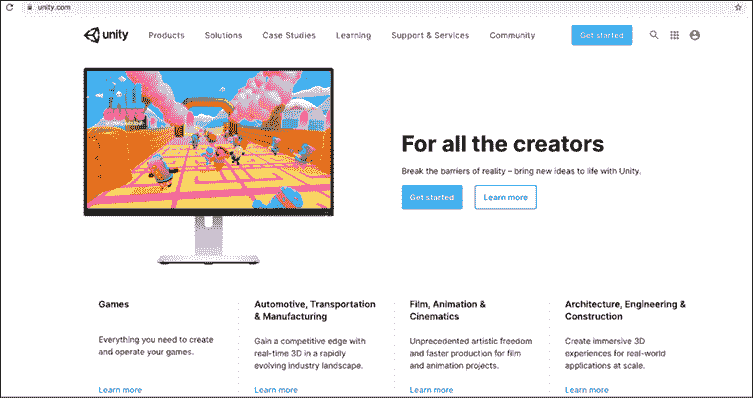

    图 1.1:Unity 主页

    这将把带到 Unity 商店页面。 不要感到不知所措——你可以完全免费获得 Unity !

    如果 Unity 主页看起来与你在*图 1.1*中看到的不同，你可以直接进入[https://store.unity.com](https://store.unity.com)。

3.  Select the **Personal** option. The other paid options offer more advanced functionality and services, but you can check these out on your own:

    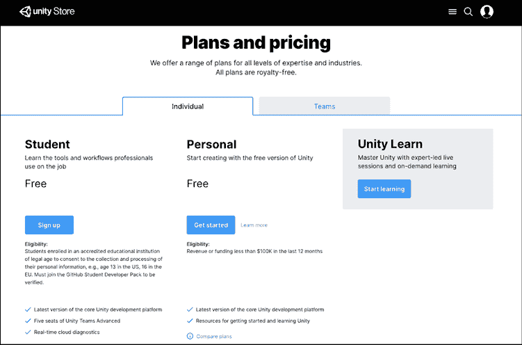

    图 1.2:统一计划和定价

4.  After selecting the **Personal** plan, you'll be asked if you're a first-time or returning user. Select **Start here** under **First-time users**:

    

    图 1.3:开始创建 Unity 门户

5.  选择**同意并下载**以获得你的 Unity Hub 副本:

    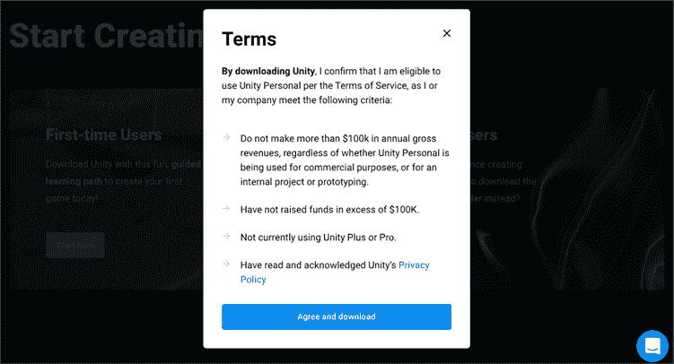

图 1.4:统一条款和条件

一旦下载完成，遵循以下步骤:

1.  打开安装程序(通过双击它)
2.  接受用户协议
3.  按照安装说明操作

当你得到绿灯时，继续并启动 Unity Hub 应用!

最新版本的 Unity Hub 会在你第一次打开应用时提供一个安装向导。 如果你想继续，请随意。

下面的步骤展示了如何在没有应用任何帮助的情况下启动一个新项目:

1.  Select **Skip Install Wizard** in the lower left, then confirm **Skip Wizard**:

    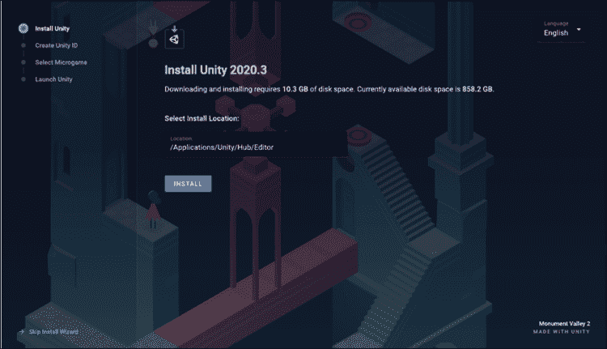

    图 1.5:安装向导

2.  Switch to the **Installs** tab from the left-hand menu, and select **ADD** to choose your Unity version:

    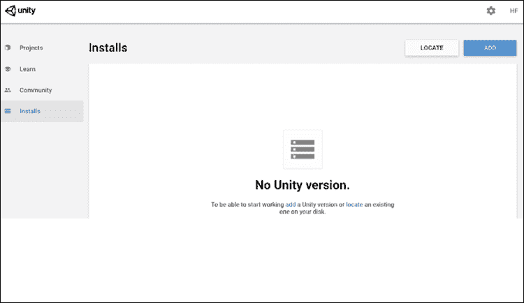

    图 1.6:Unity Hub 安装面板

3.  Select your desired version of Unity, then click **NEXT**. At the time of writing, Unity 2021 is still in pre-release, but you should be able to select a 2021 version from the **Official Releases** list by the time you're reading this:

    

    图 1.7:添加 Unity 版本弹出窗口

4.  然后，您可以选择向安装中添加各种模块。 确认选择了 Visual Studio 模块，点击**NEXT****:**

    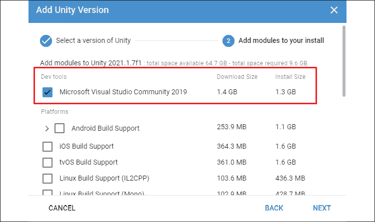

图 1.8:添加安装模块

如果以后需要添加任何模块，可以在**安装**窗口中，点击任意版本右上角的**More**按钮(三点式图标)。

当安装完成后，您将在您的**安装**面板中看到一个新版本，如下所示:

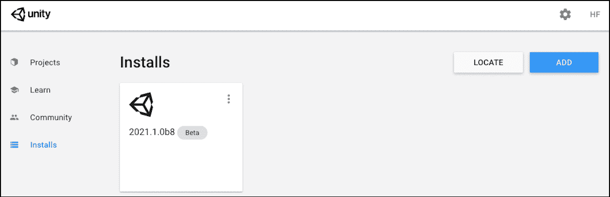

图 1.9:安装 Unity 版本选项卡

您可以在[https://docs.unity3d.com/Manual/GettingStartedInstallingHub.html](https://docs.unity3d.com/Manual/GettingStartedInstallingHub.html)找到关于 Unity Hub 应用的更多信息和资源。

出错的可能性总是存在，所以如果您使用 macOS Catalina 或更高版本，请务必检查以下部分，因为众所周知，macOS Catalina 会产生问题。

## 使用 macOS

如果你是在带有 Catalina OS 或更高版本的 Mac 上工作，那么在使用 Unity Hub 的某些版本安装 Unity 时就会出现一个已知的问题。 如果你是这种情况，请深呼吸，进入**Unity 下载存档**，并获取你需要的 2021 版本([https://unity3d.com/get-unity/download/archive](https://unity3d.com/get-unity/download/archive))。 记得使用**下载(Mac)**选项来代替 Unity Hub 下载:

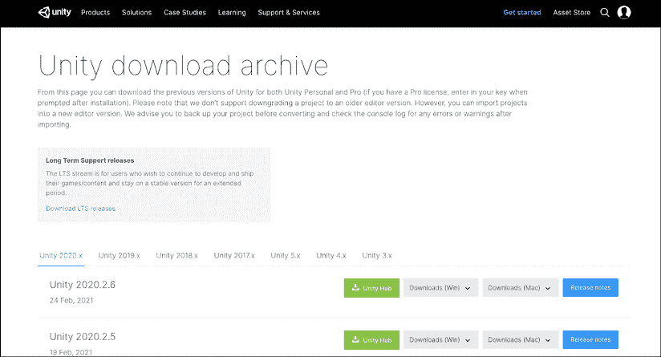

图 1.10:Unity 下载存档

如果你是在 Windows 上工作，并遇到类似的安装问题，下载 Unity 的存档副本也可以。

下载是一个正常的应用安装程序，因为它是一个`.dmg`文件。 打开它，按照说明，你马上就能准备好了!


图 1.11:从下载管理器成功安装 Unity

本书的所有示例和截图都是使用 Unity 2021.1.0b8 创建和捕获的。 如果你使用的是新版本，在 Unity 编辑器中可能会有一些不同，但这不会影响你的后续操作。

现在已经安装了 Unity Hub 和 Unity 2021，是时候创建一个新项目了!

## 创建一个新项目

启动 Unity Hub 应用来启动一个新项目。 如果你有一个 Unity 账户，那就登录吧; 如果没有，您可以创建一个，或者点击屏幕底部的**Skip**。

现在，让我们通过选择右上角**new**按钮旁边的箭头图标来建立一个新项目:

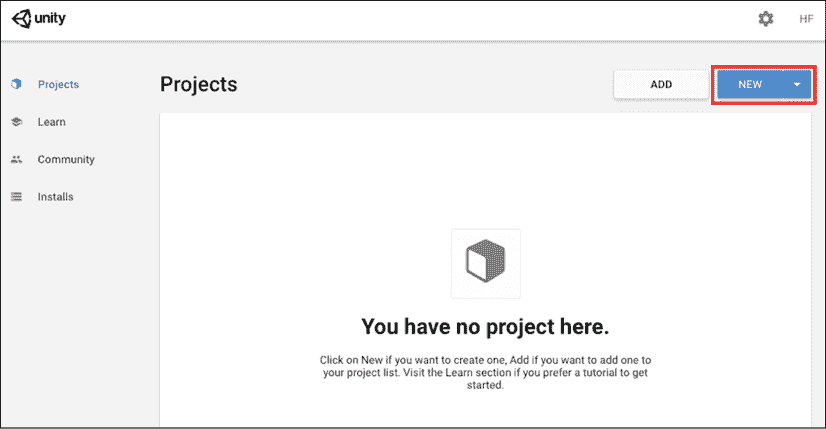

图 1.12:Unity Hub Projects 面板

选择您的 2021 版本并设置以下字段:

*   **模板**:项目将默认为**3D**
*   **项目名称**:我将调用我的`Hero Born`
*   **位置**:您希望将项目保存到的任何位置

设置完成后，按**CREATE**:

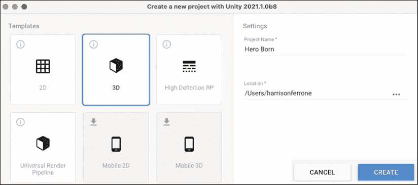

图 1.13:Unity Hub 弹出新项目配置

随着项目的创建，你已经设置了来探索 Unity 界面! 你可以在 Unity Hub 的**Projects**面板中重新打开你的项目。

## 浏览编辑器

当新的项目完成初始化时，你将看到光荣的 Unity 编辑器! 我在下面的截图中标记了重要的标签(或者面板，如果你喜欢的话):

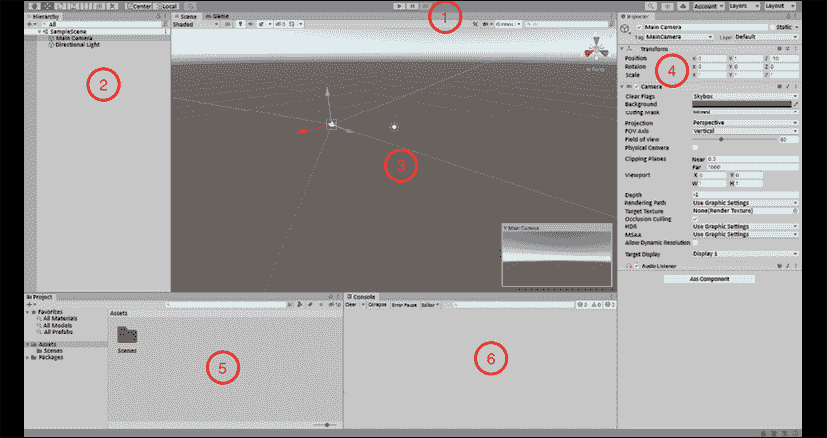

图 1.14:Unity 界面

这有很多要考虑的，所以我们将更详细地看每一个面板:

1.  **工具栏**面板是 Unity 编辑器的顶部部分。 从这里，你可以操作对象(最左边的按钮组)，并播放和暂停游戏(中间的按钮)。 最右边的按钮组包含 Unity 服务，**LayerMasks**和布局方案特性，这些我们不会在本书中使用，因为它们不适用于学习 C#。
2.  **等级**窗口显示当前游戏**场景**中的所有道具。 在初始项目中，这只是默认的相机和方向光，但当我们创建原型环境时，这个窗口将开始填充。
3.  **游戏**和**场景**窗口是编辑器最具视觉效果的部分。 把**Scene**窗口想象成你的舞台，在这里可以移动和安排 2D 和 3D 物体。 当你点击**Play**按钮时，**Game**窗口将接管，呈现**场景**视图和任何已编程的交互。
4.  **Inspector**窗口是您查看和编辑场景中对象属性的一站式商店。 如果你选择**层级**中的**主摄像头****游戏对象**，你会看到几个部分(Unity 称它们为组件)显示出来——所有这些部分都可以从这里访问。
5.  **项目**窗口包含当前项目中的所有资产。 可以将其视为项目文件夹和文件的表示。
6.  控制台**窗口将显示我们希望脚本打印的任何输出。 从开始，如果我们讨论控制台或调试输出，这个面板将显示它。**

 **如果这些窗口中的任何一个意外关闭，您可以在任何时候从**Unity**|**Window**|**General**重新打开它们。 你可以在 Unity 文档中的[https://docs.unity3d.com/Manual/UsingTheEditor.html](https://docs.unity3d.com/Manual/UsingTheEditor.html)找到更多关于每个窗口功能的深入分解。

在继续之前，将 Visual Studio 设置为项目的脚本编辑器是很重要的。 去**统一菜单**|**选择**|**外部工具**和**检查外部脚本编辑器【显示】设置为 Mac 或 Windows Visual Studio:**


图 1.15:将外部脚本编辑器更改为 Visual Studio

最后一个技巧,如果你想在光明与黑暗之间切换模式,去**统一菜单**|**选择**|**和**改变编辑主题【显示】:****

 **

图 1.16:Unity 通用首选项面板

我知道如果你是 Unity 新手，那么你需要处理很多事情，但请放心，任何指导都将参考必要的步骤。 我不会让你思考该按哪个按钮。 完成这些之后，让我们开始创建一些实际的 C# 脚本。

# 使用 C# 和 Unity

展望未来，将 Unity 和 C# 视为共生实体是很重要的。 Unity 是你可以创建脚本和游戏对象的引擎，但实际的编程是在另一个叫做 Visual Studio 的程序中进行的。 现在不要担心，我们一会儿再谈。

## 使用 C# 脚本

尽管我们还没有涉及到任何基本的编程概念，但在我们知道如何在 Unity 中创建真正的 C# 脚本之前，它们都不会有自己的立足之地。 C# 脚本是一种特殊的 C# 文件，你可以在其中编写 C# 代码。 这些脚本可以在 Unity 中用于任何事情，从响应玩家输入到创建游戏机制。

有几种方法可以从编辑器中创建 C# 脚本:

*   |**创建**|**C# Script**
*   在**Project**标签下，选择**+**图标，然后选择**C# Script**
*   右键单击**Project**tab 中的**Assets**文件夹上的，在弹出菜单中选择**Create**|**C# Script**
*   在**层级**窗口中选择任意游戏对象，点击**添加组件**|**新脚本**

接下来，无论何时你被要求创建一个 C# 脚本，请使用任何你喜欢的方法。

除了 C# 脚本，资源和对象可以使用上述方法在编辑器中创建。 我不会在每次我们创造新内容时都提到这些变化，所以你只需要在脑海中保留这些选项。

为了便于组织，我们将在标记的文件夹中存储各种资产和脚本。 这不仅仅是一项与 unity 相关的任务——这是你应该经常做的事情，你的同事会感谢你的(我保证):

1.  From the **Project** tab, select **+** | **Folder** (or whichever method you like best—in *Figure 1.17* we've selected **Assets** | **Create** | **Folder**) and name it `Scripts`:

    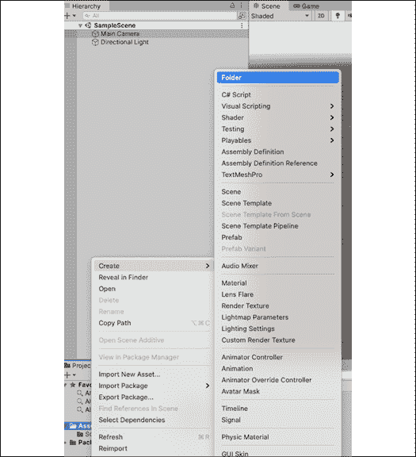

    图 1.17:创建 C# 脚本

2.  双击**Scripts**文件夹，创建一个新的 C# 脚本。 默认情况下，脚本将被命名为`NewBehaviourScript`，但是您将看到突出显示的文件名，因此您可以选择立即重命名它。

    

图 1.18:选择了 Scripts 文件夹的项目窗口

您可以使用**Project**选项卡右下方的小滑块来更改文件的显示方式。

因此，您已经创建了一个名为`Scripts`的子文件夹，如上面的截图所示。 在父文件夹中，您创建了一个名为`LearningCurve.cs`的 C# 脚本(如果您想知道的话，`.cs`文件类型代表 C- sharp)，它现在被保存为*Hero Born*项目资产的一部分。 剩下要做的就是在 Visual Studio 中打开它!

## 介绍 Visual Studio 编辑器

虽然 Unity 可以创建和存储 C# 脚本，但它们需要使用 Visual Studio 进行编辑。 Visual Studio 的副本是预先与 Unity 打包的，当你在编辑器中双击任何 C# 脚本时，它就会自动打开。

### 打开一个 C# 文件

Unity 将在你第一次打开一个文件时与 Visual Studio 同步。 最简单的方法是从**Project**选项卡中选择脚本。

双击`LearningCurve.cs`，将在 Visual Studio 中打开 C# 文件:


图 1.19:Visual Studio 中的 LearningCurve C# 脚本

您可以在任何时候从**Visual Studio**|**View**|**Layout**更改 Visual Studio 选项卡。 我将在本书的其余部分使用**Design**布局，这样我们就可以在编辑器的左侧看到我们的项目文件。

你会在界面的左侧看到一个文件夹结构，它反映了 Unity 中的那个，你可以像其他任何东西一样访问它。 右边是实际的代码编辑器，神奇的事情就发生在这里。 Visual Studio 应用有更多的特性，但这是我们开始所需要的全部。

Visual Studio 的界面在 Windows 和 Mac 环境中是不同的，但是我们将在本书中使用的代码在这两种环境中都能很好地工作。 本书中所有的截图都是在 Mac 环境下拍摄的，所以如果在你的电脑上看起来不一样，没有必要担心。

### 注意命名不匹配

给新程序员带来的一个常见陷阱是文件命名——更确切地说，命名不匹配——我们可以用 Visual Studio 中 C# 文件*图 1.19*中的第 5 行来说明这个问题:

```cs
public class LearningCurve : MonoBehaviour 
```

`LearningCurve`类名与`LearningCurve.cs`文件名相同。 **这是一个基本要求**。 如果你还不知道什么是类也没关系。 重要的是要记住，在 Unity 中，文件名和类名必须相同。 如果你在 Unity 之外使用 C#，文件名和类名不需要匹配。

当你在 Unity 中创建一个 C# 脚本文件时，**Project**标签中的文件名已经处于**Edit**模式，准备好重命名。 当场给它重新命名是个好习惯。 如果稍后重命名脚本，文件名和类名将不匹配。

如果你稍后重命名文件，文件名将会改变，但是第 5 行如下所示:

```cs
public class NewBehaviourScript : MonoBehaviour 
```

如果你不小心这样做了，这并不是世界末日。 您所需要做的就是进入 Visual Studio，将`NewBehaviourScript`更改为您的 C# 脚本的名称，以及桌面上的`.meta`文件的名称。 您可以在项目文件夹中**Assets**|**Scripts**下找到`.meta`文件:


图 1.20:找到 META 文件

## 同步的 C# 文件

作为共生关系的一部分，Unity 和 Visual Studio 相互通信以同步其内容。 这意味着，如果您在一个应用中添加、删除或更改脚本文件，另一个应用将自动看到这些更改。

那么，当墨菲定律(Murphy's Law)指出“*任何可能出错的事情都会出错*”，而同步似乎不能正确工作时，会发生什么呢? 如果你遇到这种情况，深呼吸，在 Unity 中选择问题脚本，右键单击，选择**刷新**。

现在，您已经掌握了脚本创建的基本知识，因此，现在是时候讨论如何查找和有效地使用有用的资源了。

# 探索文档

在这第一次尝试 Unity 和 C# 脚本时，我们将触及的最后一个主题是文档。 我知道这并不吸引人，但在处理新的编程语言或开发环境时，尽早养成良好的习惯是很重要的。

## 访问统一的文档

一旦你开始认真地编写脚本，你就会经常使用 Unity 的文档，所以及早知道如何访问它是非常有益的。 *参考手册*将为您提供组件或主题的概述，而具体的编程示例可以在*脚本参考*中找到。

每一个游戏对象(一个项目**层次结构中的**窗口)在一个场景一个**变换组件,控制其**,【旋转 T6】**,【显示】。 为了简单起见，我们只需要在参考手册中查找相机的**Transform**组件:**

 **1.  在**Hierarchy**tab 中，选择**Main Camera**游戏对象
2.  移到**Inspector**选项卡，点击**Transform**组件右上角的信息图标(问号):

    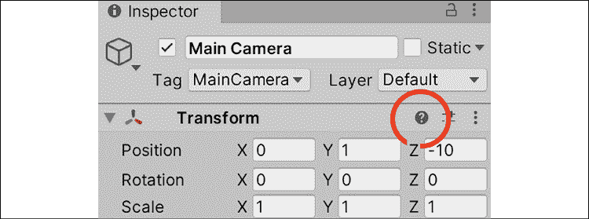

图 1.21:在检查器中选择游戏的主摄像机对象

你会看到在参考手册的**Transforms**页面上打开一个 web 浏览器:

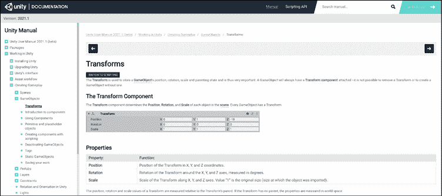

图 1.22:统一参考手册

Unity 中的所有组件都有这个特性，所以如果你想知道更多关于某些东西是如何工作的，你知道该怎么做。

所以，我们已经打开了参考手册，但是如果我们想要与**Transform**组件相关的具体编码示例呢? 这非常简单——我们所需要做的就是询问脚本参考。

单击组件或类名下方的**SWITCH TO SCRIPTING**链接(在本例中，**Transform**):

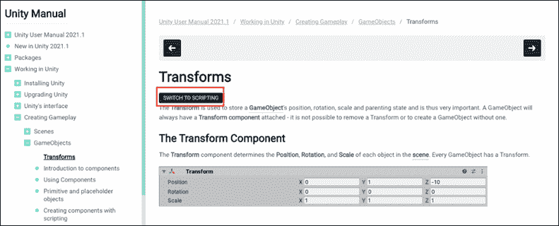

图 1.23:突出显示 SWITCH TO SCRIPTING 按钮的 Unity 参考手册

通过这样做，参考手册自动切换到脚本参考:

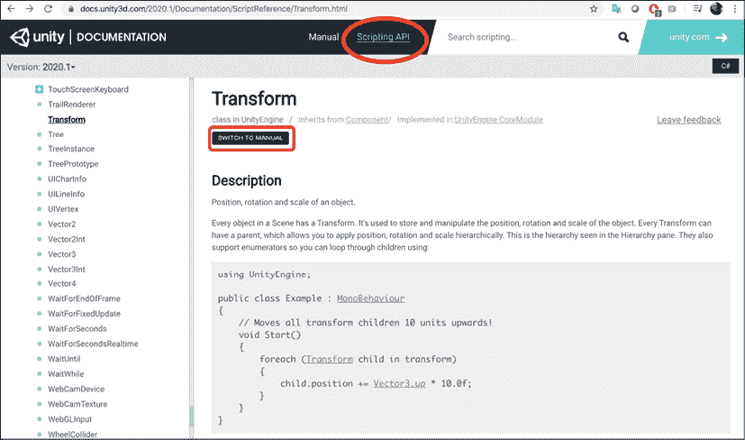

图 1.24:突出显示 SWITCH TO MANUAL 的 Unity 脚本文档

如您所见，作为和编码帮助，如果必要的话，还有一个选项可以切换回参考手册。

脚本引用是一个大文档，因为它必须如此。 然而，这并不意味着您必须记住它或者熟悉它的所有信息才能开始编写脚本。 顾名思义，它是一个引用，而不是一个测试。

如果你发现自己迷失在文档中，或者不知道该去哪里找，你也可以在以下丰富的 Unity 开发社区中找到解决方案:

*   论坛:[https://forum.unity.com/](https://forum.unity.com/)
*   答案:[https://answers.unity.com/index.html](https://answers.unity.com/index.html)
*   [https://discord.com/invite/unity](https://discord.com/invite/unity)

另一方面，你需要知道在哪里可以找到任何 C# 问题的资源，我们接下来会讲到。

## 定位 C# 资源

现在我们已经处理好了 Unity 的资源，让我们来看看微软的 C# 资源的一些。 对于初学者，在[https://docs.microsoft.com/en-us/dotnet/csharp](https://docs.microsoft.com/en-us/dotnet/csharp)的 Microsoft Learn 文档中有大量优秀的教程、快速入门指南和 how-to 文章。 你也可以在[https://docs.microsoft.com/en-us/dotnet/csharp/programming-guide/index](https://docs.microsoft.com/en-us/dotnet/csharp/programming-guide/index)找到关于单个 C# 主题的很棒的概述。

然而，如果你想要关于特定 C# 语言特性的详细信息，参考指南是你可以去的地方。 这些参考指南对于任何 C# 程序员来说都是很重要的资源，但是因为它们并不总是最容易导航的，所以让我们花几分钟来学习如何找到我们要查找的内容。

让我们加载编程指南链接并查找 C# `String`类。 做以下任何一项:

*   在页面左上角的搜索栏中输入`Strings`
*   向下滚动到**Language Sections**，直接点击**Strings**链接:

    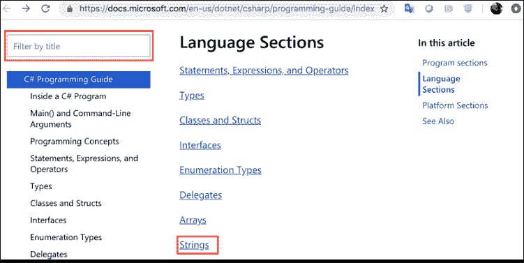

图 1.25:浏览微软的 C# 参考指南

您应该看到类似于以下类描述页面的内容:


图 1.26:Microsoft 的 Strings (C# 编程指南)页面

不像 Unity 的文档，C# 引用和脚本信息都捆绑在一起，但它的可取之处是右边的子主题列表。 使用它! 当你遇到困难或有问题时，知道去哪里寻求帮助是极其重要的，所以当你遇到困难时，一定要回到这一部分。

# 总结

在本章中，我们讨论了相当多的逻辑信息，所以我可以理解您是否渴望编写一些代码。 开始新项目，创建文件夹和脚本，访问文档，这些都是很容易在兴奋的新冒险中忘记的话题。 只要记住，本章有很多你可能在接下来的页面中需要的资源，所以不要害怕回来访问。 像程序员一样思考就像肌肉一样:你做得越多，它就越强壮。

在下一章中，我们将开始规划你需要启动你的编码大脑的理论、词汇和主要概念。 即使材料是概念性的，我们仍然要在`LearningCurve`脚本中编写第一行代码。 做好准备!

# 突击测验-处理脚本

1.  Unity 和 Visual Studio 有什么样的关系?
2.  脚本参考提供了使用特定 Unity 组件或特性的示例代码。 你在哪里可以找到关于 Unity 组件的更详细的(非代码相关的)信息?
3.  脚本引用是一个大文档。 在编写脚本之前，你需要记住多少内容?
4.  什么时候是命名 C# 脚本的最佳时机?******