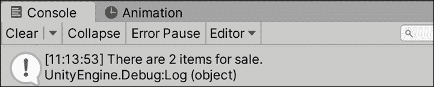
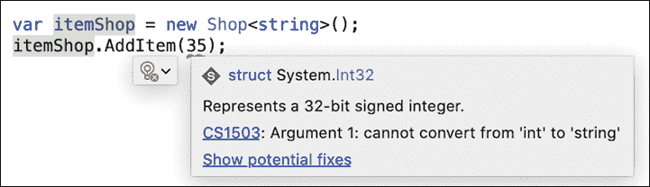
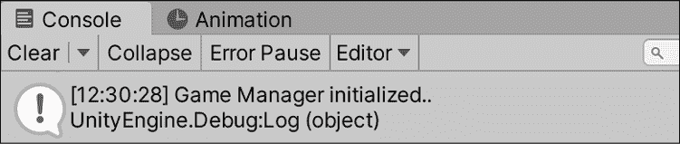
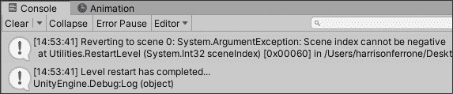

# 十三、探索泛型、委托和其他

你花在编程上的时间越多，你开始考虑系统的时间就越多。 构造类和对象如何交互、通信和交换数据都是我们迄今为止使用过的系统的例子; 现在的问题是如何使它们更安全、更有效。

由于这将是本书的最后一个实用章节，我们将学习泛型编程概念、委托、事件创建和错误处理的示例。 这些主题中的每一个都是一个很大的研究领域，所以利用您在这里学到的知识，并在您的项目中扩展它。 在完成我们的实际编码之后，我们将以对设计模式的简要概述以及它们如何在您的编程旅程中发挥作用作为结束。

本章将涵盖以下主题:

*   泛型编程
*   使用的代表
*   创建事件和订阅
*   抛出和处理错误
*   理解设计模式

# 引入泛型

到目前为止，我们所有的代码在定义和使用类型方面都非常具体。 然而，在某些情况下，您需要一个类或方法以相同的方式处理其实体，无论其类型如何，同时仍然是类型安全的。 泛型编程允许我们使用占位符创建可重用的类、方法和变量，而不是使用具体类型。

当在编译时创建泛型类实例或使用方法时，将分配具体类型，但代码本身将其视为泛型类型。 能够编写通用代码是一个巨大的好处,当你需要使用不同的对象类型以同样的方式,例如,自定义集合类型,需要能够执行相同的操作无论在元素类型,或类,需要相同的底层功能。 虽然您可能会问自己为什么我们不只是子类化或使用接口，但在我们的示例中，您将看到泛型以另一种方式帮助我们。

我们已经在`List`类型中看到了这一点，它是一个泛型类型。 我们可以访问它的所有加法、移除和修改函数，而不管它是存储整数、字符串还是单个字符。

## 通用的对象

创建泛型类的工作原理与创建非泛型类相同，但有一个重要的区别:它的泛型类型参数。 让我们看一个泛型集合类的例子，我们可能想要创建它来更清楚地了解它是如何工作的:

```cs
public class SomeGenericCollection**<****T****>** {} 
```

我们声明了一个名为`SomeGenericCollection`的泛型集合类，并指定其类型参数将命名为`T`。 现在，`T`将代替泛型列表将存储的元素类型，并且可以像任何其他类型一样在泛型类中使用。

无论何时创建`SomeGenericCollection`的实例，我们都需要指定它可以存储的值的类型:

```cs
SomeGenericCollection**<****int****>** highScores = new SomeGenericCollection<int>(); 
```

在本例中，`highScores`存储整数值，`T`代表`int`类型，但是`SomeGenericCollection`类将对任何元素类型进行相同的处理。

您可以完全控制泛型类型参数的命名，但是许多编程语言中的行业标准是大写的`T`。 如果您打算以不同的方式命名类型参数，请考虑以大写`T`作为名称的开头，以保持一致性和可读性。

接下来让我们创造一个更专注于游戏的例子，使用一个通用的`Shop`类来存储一些虚构的库存道具，步骤如下:

1.  在`Scripts`文件夹中创建新的 C# 脚本，命名为`Shop`，并将其代码更新为:

    ```cs
    using System.Collections;
    using System.Collections.Generic;
    using UnityEngine;

    // 1
    public class Shop<T>
    {
        // 2
        public List<T> inventory = new List<T>();
    } 
    ```

2.  在`GameBehavior`:

    ```cs
    public class GameBehavior : MonoBehaviour, IManager
    {
        // ... No other changes needed ...

        public void Initialize()
        {
            // 3
            var itemShop = new Shop<string>();
            // 4
            Debug.Log("There are " + itemShop.inventory.Count + " items for sale.");
        }
    } 
    ```

    中创建`Shop`的新实例

让我们分解代码:

1.  使用`T`类型参数声明一个名为`IShop`的新泛型类
2.  添加一个类型为`T`的库存`List<T>`来存储初始化泛型类所用的任何项目类型
3.  在`GameBehavior`中创建`Shop<string>`的新实例并将字符串值指定为泛型类型
4.  Prints out a debug message with the inventory count:

    

    图 13.1:泛型类的控制台输出

在功能方面，这里还没有发生什么新变化，但是 Visual Studio 将`Shop`识别为泛型类，因为它的泛型类型参数`T`。 这使我们包含了额外的通用操作，如添加库存项目或查找每种项目的可用数量。

这里值得注意的是，默认情况下 Unity Serializer 不支持泛型。 如果您想序列化泛型类，就像我们在上一章中对自定义类所做的那样，您需要将`Serializable`属性添加到类的顶部，就像我们对`Weapon`类所做的那样。 你可以在[https://docs.unity3d.com/ScriptReference/SerializeReference.html](https://docs.unity3d.com/ScriptReference/SerializeReference.html)找到更多信息。

## 泛型方法

一个独立的泛型方法可以有一个占位符类型参数，就像泛型类一样，这允许根据需要将其包含在泛型类或非泛型类中:

```cs
public void GenericMethod**<****T****>**(**T** genericParameter) {} 
```

`T`类型可以在方法体中使用，并在调用方法时定义:

```cs
GenericMethod**<****string****>(****"Hello World!"****)**; 
```

如果你想在泛型类中声明泛型方法，你不需要指定一个新的`T`类型:

```cs
public class SomeGenericCollection<T> 
{
    public void NonGenericMethod(**T** genericParameter) {}
} 
```

当你调用使用泛型类型参数的非泛型方法时，不会有问题，因为泛型类已经负责分配具体类型:

```cs
SomeGenericCollection**<****int****>** highScores = new SomeGenericCollection
<int> ();
highScores.NonGenericMethod(**35**); 
```

泛型方法可以重载并标记为静态，就像非泛型方法一样。 如果需要这些情况的特定语法，请查看[https://docs.microsoft.com/en-us/dotnet/csharp/programming-guide/generics/generic-methods](https://docs.microsoft.com/en-us/dotnet/csharp/programming-guide/generics/generic-methods)。

您的下一个任务是创建一个方法，将新的通用项添加到库存中，并在`GameBehavior`脚本中使用它。

既然我们已经有了一个带有已定义类型参数的泛型类，让我们添加一个非泛型方法来看看它们如何一起工作:

1.  打开`Shop`，更新如下:

    ```cs
    public class Shop<T>
    {
        public List<T> inventory = new List<T>();
        **// 1**
        **public****void****AddItem****(****T newItem****)**
        **{**

            **inventory.Add(newItem);**
        **}**
    } 
    ```

2.  在`GameBehavior`中添加一个条目到`itemShop`:

    ```cs
    public class GameBehavior : MonoBehaviour, IManager
    {
        // ... No other changes needed ...

         public void Initialize()
        {
            var itemShop = new Shop<string>();
            **// 2**
            itemShop**.AddItem(****"Potion"****);**
            itemShop**.AddItem(****"Antidote"****);**
           Debug.Log("There are " + itemShop.inventory.Count + " items for sale.");
        }
    } 
    ```

让我们分解一下的代码:

1.  声明一个将类型`T`的`newItems`添加到库存的方法
2.  Adds two string items to `itemShop` using `AddItem()` and prints out a debug log:

    

    图 13.2:向泛型类添加项后的控制台输出

我们编写了`AddItem()`来接受与泛型`Shop`实例相同类型的参数。 因为`itemShop`是为了保存字符串值而创建的，所以我们添加`"Potion"`和`"Antidote"`字符串值时没有任何问题。

但是，如果你尝试添加一个整数，例如，你会得到一个错误，说`itemShop`的泛型类型不匹配:



图 13.3:泛型类中的转换错误

既然已经编写了泛型方法，就需要知道如何在一个类中使用多个泛型类型。 例如，如果我们想要向`Shop`类中添加一个方法来查找给定物品的库存数量，该怎么办? 我们不能再使用类型`T`，因为它已经在类定义中定义了。 那么我们该怎么办呢?

将以下方法添加到`Shop`类的底部:

```cs
// 1
public int GetStockCount<U>()
{
    // 2
    var stock = 0;
    // 3
    foreach (var item in inventory)
    {
        if (item is U)
        {
            stock++;
        }
    }
    // 4
    return stock;
} 
```

让我们分解一下我们的新方法:

1.  声明一个方法，该方法返回一个 int 值，表示在库存中找到了多少类型`U`的匹配项
    *   泛型类型参数的命名完全由您决定，就像命名变量一样。 按照惯例，它们从`T`开始，并从那里按字母顺序继续。
2.  创建一个变量来保存我们找到并最终从库存中返回的匹配库存项目的数量
3.  使用`foreach`循环遍历库存列表，并在每次找到匹配时增加库存价值
4.  返回匹配股票项目的数量

这里的问题是我们在商店中存储字符串值，所以如果我们尝试查看我们有多少字符串项，我们将得到完整的库存:

```cs
Debug.Log("There are " + itemShop.GetStockCount<string>() + " items for sale."); 
```

这将打印如下内容到控制台:


图 13.4:使用多种通用字符串类型的控制台输出

另一方面，如果我们试图在库存中查找整数类型，我们将不会得到任何结果，因为我们只存储字符串:

```cs
Debug.Log("There are " + itemShop.GetStockCount<int>() + " items for sale."); 
```

这将打印如下内容到控制台:


图 13.5:使用多个非匹配泛型类型的控制台输出

这两种情况都不理想，因为我们不能确保我们的商店库存存储和可以搜索相同的物品类型。 但这里正是泛型真正发挥作用的地方——我们可以为泛型类和方法添加规则，以强制执行我们想要的行为，我们将在下一节中讨论。

## 约束类型参数

泛型的优点之一是它们的类型参数可以是有限的。 这可能与我们迄今为止学到的关于泛型的内容相抵触，但仅仅因为类*可以*包含任何类型，并不意味着应该允许它包含任何类型。

为了约束泛型类型形参，我们需要一个 new 关键字和一个以前没有见过的语法:

```cs
public class SomeGenericCollection<T> where T: ConstraintType {} 
```

`where`关键字定义了`T`作为泛型类型参数使用之前必须通过的规则。 它本质上是说，只要符合约束类型，`SomeGenericClass`就可以接受任何`T`类型。 约束规则并不是什么神秘或可怕的东西; 这些概念我们已经讲过了:

*   添加`class`关键字将约束`T`为类类型
*   添加`struct`关键字将约束`T`为结构类型
*   添加一个接口，例如`IManager`，作为类型将`T`限制为采用该接口的类型
*   添加自定义类(如`Character`)将限制`T`只适用于该类类型

如果需要更灵活的方法来考虑具有子类的类，可以使用`where T : U`，它指定泛型`T`类型必须是`U`类型，或从`U`类型派生。 这对于我们的需求来说有点高级，但是您可以在[https://docs.microsoft.com/en-us/dotnet/csharp/programming-guide/generics/constraints-on-type-parameters](https://docs.microsoft.com/en-us/dotnet/csharp/programming-guide/generics/constraints-on-type-parameters)找到更多细节。

为了好玩，让我们限制`Shop`只接受一个名为`Collectable`的新类型:

1.  Create a new script in the `Scripts` folder, name it `Collectable`, and add the following code:

    ```cs
    using System.Collections;
    using System.Collections.Generic;
    using UnityEngine;

    public class Collectable
    {
        public string name;
    }

    public class Potion : Collectable
    {
        public Potion()
        {
            this.name = "Potion";
        }
    }

    public class Antidote : Collectable
    {
        public Antidote()
        {
            this.name = "Antidote";
        }
    } 
    ```

    我们在这里所做的只是声明了一个名为`Collectable`的新类，该类带有一个 name 属性，并为药水和解毒剂创建了子类。 使用这个结构，我们可以强制我们的`Shop`只接受`Collectable`类型，并且我们的股票查找方法也只接受`Collectable`类型，这样我们就可以比较它们并找到匹配的类型。

2.  打开`Shop`并更新类声明:

    ```cs
    public class Shop<T> **where****T** **:** **Collectable** 
    ```

3.  更新 `GetStockCount()`方法以约束`U`等于初始泛型`T`类型:

    ```cs
    public int GetStockCount<U>() **where** **U : T**
    {
        var stock = 0;
        foreach (var item in inventory)
        {
            if (item is U)
            {
                stock++;
            }
        }
        return stock;
    } 
    ```

4.  In `GameBehavior`, update the `itemShop` instance to the following code:

    ```cs
    var itemShop = new Shop<**Collectable**>();
    itemShop.AddItem(**new** **Potion()**);
    itemShop.AddItem(**new** **Antidote()**);
    Debug.Log("There are " + itemShop.GetStockCount<**Potion**>() + " items for sale."); 
    ```

    这将导致如下输出:

    

    图 13.6:更新后的 GameBehavior 脚本的输出

在我们的示例中，我们可以确保我们的商店只允许收藏类型。 如果我们不小心在代码中添加了不可收集的类型，Visual Studio 将会提醒我们不要破坏自己的规则!

## 向 Unity 对象添加泛型

泛型也适用于 Unity 脚本和游戏对象。 例如，我们可以很容易地创建一个通用的可销毁类，用于我们想要从场景中删除的任何`MonoBehaviour`或对象`Component`。 如果这听起来很熟悉，这是我们的`BulletBehavior`为我们做的事情，但它不适用于除了这个脚本以外的任何事情。 为了使其更具可伸缩性，让我们使从`MonoBehaviour`继承的任何脚本都可以销毁。

1.  在`Scripts`文件夹中创建一个新脚本，命名为`Destroyable`，并添加以下代码:

    ```cs
    using System.Collections;
    using System.Collections.Generic;
    using UnityEngine;

    public class Destroyable<T> : MonoBehaviour where T : MonoBehaviour
    {
        public int OnscreenDelay;

        void Start()
        {
            Destroy(this.gameObject, OnscreenDelay);
        }
    } 
    ```

2.  删除`BulletBehavior`内的所有代码，并继承新的泛型类:

    ```cs
    public class BulletBehavior : **Destroyable****<****BulletBehavior****>**
    {
    } 
    ```

现在我们已经将我们的`BulletBehavior`脚本变成了一个通用的可销毁对象。 在 Bullet Prefab 中没有任何改变，但是我们可以通过继承从一般的`Destroyable`类中获取来摧毁任何其他对象。 在我们的例子中，如果我们创建多个抛射预制件并希望它们在不同的时间都可以摧毁，这将提高代码的效率和可重用性。

泛型编程是我们的工具箱中一个强大的工具，但是在介绍了基础知识之后，是时候讨论一个在编程过程中同样重要的主题了——委托!

# 授权行为

有时候，您需要将方法的执行从一个文件传递或委托给另一个文件。 在 C# 中，这可以通过委托类型来实现，委托类型存储对方法的引用，可以像对待任何其他变量一样对待。 唯一需要注意的是，委托本身和任何分配的方法都需要具有相同的签名——就像整数变量只能保存整数，字符串只能保存文本一样。

创建委托是在编写函数和声明变量之间的混合:

```cs
public **delegate** returnType DelegateName(int param1, string param2); 
```

首先是一个访问修饰符，然后是`delegate`关键字，该关键字将其识别为`delegate`类型。 类型可以具有作为常规函数的返回类型和名称，如果需要，还可以具有参数。 但是，该语法只声明了`delegate`类型本身; 要使用它，你需要像创建类一样创建一个实例:

```cs
public **DelegateName** someDelegate; 
```

声明了`delegate`类型变量后，很容易分配一个匹配委托签名的方法:

```cs
public DelegateName someDelegate = **MatchingMethod**;
public void **MatchingMethod****(****int** **param1,** **string** **param2****)** 
{
    // ... Executing code here ...
} 
```

请注意，在将`MatchingMethod`赋值给`someDelegate`变量时，没有包括括号，因为此时它还没有调用方法。 它所做的是将`MatchingMethod`的调用职责委托给`someDelegate`，这意味着我们可以这样调用该函数:

```cs
someDelegate(); 
```

在您的 C# 技能开发阶段，这可能看起来很麻烦，但我向您保证，能够将方法作为变量存储和执行将在以后的道路上非常有用。

## 创建调试委托

让我们创建一个简单的委托类型来定义一个方法，该方法接收一个字符串，并最终使用指定的方法将其打印出来。 打开`GameBehavior`，添加以下代码:

```cs
public class GameBehavior : MonoBehaviour, IManager
{
    // ... No other changes needed ...

    **// 1**
    **public****delegate****void****DebugDelegate****(****string** **newText****)****;**

    **// 2**
    **public** **DebugDelegate debug = Print;**

    public void Initialize() 
    {
        _state = "Game Manager initialized..";
        _state.FancyDebug();
        **// 3**
        **debug(_state);**
   // ... No changes needed ...
    }
    **// 4**
    **public****static****void****Print****(****string** **newText****)**
    **{**
        **Debug.Log(newText);**
    **}**
} 
```

让我们分解代码:

1.  声明名为`DebugDelegate`的`public delegate`类型以保存一个方法，该方法接受`string`参数并返回`void`
2.  创建一个名为`debug`的新`DebugDelegate`实例，并为其分配一个具有匹配签名`Print()`的方法。
3.  用对`debug`委托实例的调用替换`Initialize()`中的`Debug.Log(_state)`代码
4.  Declares `Print()` as a `static` method that takes in a `string` parameter and logs it to the console:

    

    图 13.7:委托操作的控制台输出

控制台中什么都没有改变，只是没有在`Initialize()`中直接调用`Debug.Log()`，而是将该操作委托给了`debug`委托实例。 虽然这是一个简单的示例，但当您需要将方法作为其类型存储、传递和执行时，委托是一个强大的工具。

在 Unity 中，我们已经使用`OnCollisionEnter()`和`OnCollisionExit()`方法处理了委托的例子，这两个方法是通过委托调用的。 在现实世界中，自定义委托在与事件配对时最有用，我们将在本章后面的章节中看到这一点。

## 委托作为参数类型

既然我们已经了解了如何创建用于存储方法的委托类型，那么委托类型本身也可以用作方法参数本身是有意义的。 这与我们已经做过的事情相差不大，但这是一个覆盖我们基础的好主意。

让我们看看如何将委托类型用作方法参数。 用以下代码更新`GameBehavior`:

```cs
public class GameBehavior : MonoBehaviour, IManager
{
    // ... No changes needed ...
    public void Initialize() 
    {
        _state = "Game Manager initialized..";
        _state.FancyDebug();
        debug(_state);
        **// 1**
        **LogWithDelegate(debug);**
    }
    **// 2**
    **public****void****LogWithDelegate****(****DebugDelegate del****)**
    **{**
        **// 3**
        **del(****"Delegating the debug task..."****);**
    **}**
} 
```

让我们分解代码:

1.  调用`LogWithDelegate()`并将`debug`变量作为其类型参数传入
2.  声明一个接受`DebugDelegate`类型参数的新方法
3.  Calls the delegate parameter's function and passes in a string literal to be printed out:

    

    图 13.8:作为参数类型的委托的控制台输出

我们已经创建了一个接受`DebugDelegate`类型参数的方法，这意味着传入的实际参数将表示一个方法，并且可以将其视为一个方法。 可以把这个示例看作一个委托链，其中`LogWithDelegate()`是从执行调试的实际方法(即`Print()`)中删除的两个步骤。 在游戏或应用场景中，创建这样的委托链并不总是常见的解决方案，但当您需要控制委托级别时，理解其中的语法是很重要的。 在委托链分布于多个脚本或类的场景中尤其如此。

很容易迷路代表团如果你错过一个重要的精神连接,所以回去复习的开始部分的代码并检查文档在 https://docs.microsoft.com/en-us/dotnet/csharp/programming-guide/delegates/。

现在您已经了解了如何使用基本委托，现在是讨论如何使用事件在多个脚本之间有效地通信信息的时候了。 老实说，委托的最佳用例是与事件配对，我们将在接下来深入讨论。

# 发射事件

C# 事件允许你基于游戏或应用中的操作创建一个订阅系统。 例如，如果你想在收集道具时发送事件，或者当玩家按下空格键时发送事件，你可以这样做。 然而，当事件触发时，它不会自动拥有一个订阅者或接收器来处理在事件操作之后需要执行的任何代码。

任何类都可以通过触发事件的调用类来订阅或取消订阅事件; 就像当一个新帖子在 Facebook 上被分享时，注册在手机上接收通知一样，事件形成了一种分布式信息高速公路，用于在你的应用中分享行动和数据。

声明事件与声明委托类似，因为事件具有特定的方法签名。 我们将使用委托来指定我们希望事件具有的方法签名，然后使用`delegate`类型和`event`关键字创建事件:

```cs
public delegate void EventDelegate(int param1, string param2);
public **event** EventDelegate eventInstance; 
```

这个设置允许我们将`eventInstance`作为一个方法，因为它是一个委托类型，这意味着我们可以在任何时候通过调用它来发送:

```cs
eventInstance(35, "John Doe"); 
```

您的下一个任务是创建一个您自己的事件，并在`PlayerBehavior`内的适当位置发射它。

## 创建和调用事件

让我们创建事件，让玩家在任何时候跳跃。 打开`PlayerBehavior`并添加以下更改:

```cs
public class PlayerBehavior : MonoBehaviour 
{
    // ... No other variable changes needed ...
    **// 1**
    **public****delegate****void****JumpingEvent****()****;**
    **// 2**
    **public****event** **JumpingEvent playerJump;**
    void Start()
    {
        // ... No changes needed ...
    }
    void Update() 
    {
        // ... No changes needed ...
;
    }
    void FixedUpdate()
    {
        if(IsGrounded() &&  _isJumping)
        {
            _rb.AddForce(Vector3.up * jumpVelocity,
               ForceMode.Impulse);
            **// 3**
            **playerJump();**
        }
    }
    // ... No changes needed in IsGrounded or OnCollisionEnter
} 
```

让我们分解代码:

1.  声明一个新的`delegate`类型，该类型返回`void`且不接受任何参数
2.  创建名为`playerJump`的`JumpingEvent`类型的事件，该事件可被视为与前面的委托的`void`返回值匹配且不带参数签名的方法
3.  `Update()`施加力后调用`playerJump`

我们已经成功地创建了一个简单的委托类型，它不接受任何参数且不返回任何内容，以及当玩家跳跃时执行的该类型事件。 每当玩家跳跃时，`playerJump`事件就会发送给所有订阅者，通知他们该动作。

事件触发后，它的订阅者将对其进行处理并执行其他操作，下面我们将在*处理事件订阅*一节中看到。

## 处理事件订阅

目前，我们的`playerJump`事件还没有订阅者，但改变这一点很简单，而且非常类似于我们在上一节中为委托类型分配方法引用的方式:

```cs
someClass.eventInstance += EventHandler; 
```

由于事件是属于声明它们的类的变量，而订阅程序将是其他类，因此订阅程序需要引用包含事件的类。 `+=`操作符用于分配一个方法，该方法将在事件执行时触发，就像设置一个不在办公室的电子邮件。 与分配委托一样，事件处理程序方法的方法签名必须匹配事件的类型。 在前面的语法示例中，这意味着`EventHandler`需要如下所示:

```cs
public void EventHandler(int param1, string param2) {} 
```

在需要取消订阅事件的情况下，只需使用`-=`操作符执行相反的赋值操作:

```cs
someClass.eventInstance -= EventHandler; 
```

事件订阅通常在类初始化或销毁时处理，这使得管理多个事件很容易，而无需混乱的代码实现。

现在，您已经了解了订阅和取消订阅事件的语法，现在该在`GameBehavior`脚本中实践这些语法了。

现在我们的事件是在玩家每次跳跃时触发的，我们需要一种方法去捕捉这种动作:

1.  返回`GameBehavior`并更新以下代码:

    ```cs
    public class GameBehavior : MonoBehaviour, IManager
    {
        // 1
        public PlayerBehavior playerBehavior;

        // 2
        void OnEnable()
        {
            // 3
            GameObject player = GameObject.Find("Player");
            // 4
            playerBehavior = player.GetComponent<PlayerBehavior>();
            // 5
            playerBehavior.playerJump += HandlePlayerJump;
            debug("Jump event subscribed...");
        }

        // 6
        public void HandlePlayerJump()
        {
             debug("Player has jumped...");
        **}**
        // ... No other changes ...
    } 
    ```

让我们分解代码:

1.  创建类型为`PlayerBehavior` 的公共变量
2.  Declares the `OnEnable()` method, which is called whenever the object the script is attached to becomes active in the scene

    `OnEnable`是`MonoBehaviour`类中的一个方法，所以所有的 Unity 脚本都可以访问它。 这是放置事件订阅而不是`Awake`的好地方，因为它只在对象处于活动状态时执行，而不只是在加载过程中执行。

3.  在场景中找到`Player`对象并将其`GameObject`存储在局部变量中
4.  使用`GetComponent()`检索附加到`Player`的`PlayerBehavior`类的引用，并将其存储在`playerBehavior`变量中
5.  使用`+=`操作符通过名为`HandlePlayerJump`的方法订阅`PlayerBehavior`中声明的`playerJump`事件
6.  Declares the `HandlePlayerJump()` method with a signature that matches the event's type and logs a success message using the debug delegate each time the event is received:

    

    图 13.9:委托事件订阅的控制台输出

为了正确地订阅和接收`GameBehavior`中的事件，我们必须获取附属于玩家的`PlayerBehavior`类的引用。 我们本可以在一行中完成所有这些，但如果将它们分开，可读性会更好。 然后，我们将一个方法分配给`playerJump`事件，该事件将在接收到事件时执行，并完成订阅过程。

现在每次你跳转，你都会看到一个带有事件消息的调试消息:


图 13.10:委托事件触发的控制台输出

因为事件订阅是在脚本中配置的，而脚本是附加到 Unity 对象的，所以我们的工作还没有完成。 我们仍然需要处理当对象被销毁或从场景中删除时如何清理订阅，我们将在下一节中讨论这一点。

## 清除事件订阅

尽管我们的原型并未摧毁玩家，但当玩家在游戏中失败时，这是一个常见的特征。 清理事件订阅总是很重要的，因为它们占用了已分配的资源，正如我们在第 12 章*、*保存、加载和序列化数据*中讨论的流一样。*

 *我们不希望在销毁已订阅对象之后有任何订阅挂起，因此让我们清理跳跃事件。 在`OnEnable`方法之后添加以下代码到`GameBehavior` :

```cs
// 1
private void OnDisable()
{
    // 2
    playerBehavior.playerJump -= HandlePlayerJump;
    debug("Jump event unsubscribed...");
} 
```

让我们分解一下新的代码添加:

1.  声明`OnDisable()`方法，该方法属于`MonoBehavior`类，是我们前面使用的`OnEnable()`方法的同伴
    *   您需要编写的任何清理代码通常都应该放在这个方法中，因为当脚本所附加的对象处于非活动状态时，它就会执行
2.  使用`-=`操作符取消`HandlePlayerJump`中的`playerJump`事件，并打印出一条控制台消息

现在，当游戏对象被启用和禁用时，我们的脚本正确地订阅和取消订阅事件，在我们的游戏场景中没有未使用的资源。

我们关于事件的讨论到此结束。 现在你可以通过单一脚本将它们传播到游戏的各个角落，并对玩家失去生命、收集道具或更新 UI 等场景做出反应。 然而，我们仍然必须讨论一个非常重要的主题，没有程序就不能成功，那就是错误处理。

# 处理异常

有效地将错误和异常合并到代码中是编程过程中一个专业和个人的基准。 在您开始大喊“为什么我要添加错误，我已经花了这么多时间试图避免它们?!”之前，您应该知道我的意思不是添加错误来破坏您现有的代码。 这恰恰相反——包括错误或异常，并在错误使用部分功能时适当地处理它们，这会使您的代码库更强大，更不容易崩溃，而不是更弱。

## 抛出异常

当我们讨论添加错误时，我们将该过程称为抛出异常*，这是一个恰当的视觉类比。 抛出异常是称为防御性编程的一部分，它本质上意味着您积极地、有意识地防范代码中的不当或计划外操作。 要标记这些情况，可以从方法中抛出一个异常，然后由调用代码处理该异常。*

 *让我们举个例子:假设我们有一个`if`语句，在让玩家注册之前检查他们的电子邮件地址是否有效。 如果输入的电子邮件无效，我们希望我们的代码抛出一个异常:

```cs
public void ValidateEmail(string email)
{
    if(!email.Contains("@"))
    {
        **throw****new** **System.ArgumentException(****"Email is invalid"****);**
    }
} 
```

我们使用`throw`关键字来发送异常，该异常是用`new`关键字创建的，后面跟着我们指定的异常。 默认情况下，`System.ArgumentException()`将记录关于异常在何处和何时执行的信息，但如果您想要更具体，也可以接受一个自定义字符串。

`ArgumentException`是`Exception`类的一个子类，可以通过前面显示的`System`类访问。 C# 自带了许多内置的异常类型，包括用于检查空值、外集合值或范围集合值以及无效操作的子类。 异常是使用正确的工具进行正确的工作的一个主要例子。 我们的示例只需要基本的`ArgumentException`，但是您可以在[https://docs.microsoft.com/en-us/dotnet/api/system.exception# Standard](https://docs.microsoft.com/en-us/dotnet/api/system.exception# Standard)中找到完整的描述性列表。

让我们在首次尝试例外情况时保持简单，确保只有当提供一个积极的场景索引数时关卡才会重新启动:

1.  打开`Utilities`并将以下代码添加到`RestartLevel(int)`的重载版本:
2.  改变`GameBehavior`中的`RestartLevel()`以接受消极场景索引而输掉游戏:

    ```cs
    // 3
    public void RestartScene()
    {
        Utilities.RestartLevel(**-1**);
    } 
    ```

让我们分解代码:

1.  声明一个`if`语句来检查`sceneIndex`不小于 0 或一个负数
2.  如果传递一个负面场景索引作为参数，则抛出带有自定义消息的`ArgumentException`
3.  Calls `RestartLevel()` with a scene index of `-1`:

    

    图 13.11:抛出异常时的控制台输出

当我们现在输掉游戏时，会调用`RestartLevel()`，但由于我们使用`-1`作为场景索引参数，所以异常会在任何场景管理器逻辑执行之前触发。 我们目前还没有在游戏中配置任何其他场景，但这些防御代码起到了保护作用，不会让我们采取可能导致游戏崩溃的行动(Unity 在加载场景时不支持负面索引)。

现在您已经成功抛出了一个错误，您需要知道如何处理错误带来的后果，这将引导我们进入下一节和`try-catch`语句。

## 使用 try - catch

现在我们已经抛出了一个错误，我们的工作是安全地处理调用`RestartLevel()`可能产生的的可能结果，因为此时还没有正确地解决这个问题。 要做到这一点，可以使用一种新的语句`try-catch`:

```cs
try
{
    // Call a method that might throw an exception
}
catch (ExceptionType localVariable)
{
    // Catch all exception cases individually
} 
```

`try-catch`语句由在不同条件下执行的连续代码块组成; 它就像一个专门的`if`/`else`语句。 我们调用所有可能在`try`块中抛出异常的方法——如果没有抛出异常，代码将继续执行而不中断。 如果抛出异常，则代码跳转到匹配抛出的异常的`catch`语句，就像`switch`语句处理它们的情况一样。 `catch`语句需要定义它们要解释的异常，并指定一个局部变量名，该变量名将在`catch`块中表示该异常。

如果需要处理单个方法抛出的多个异常，可以在`try`块之后链接尽可能多的`catch`语句，前提是它们捕获不同的异常。 例如:

```cs
try
{
    // Call a method that might throw an exception
}
catch (ArgumentException argException)
{
    // Catch argument exceptions here
}
catch (FileNotFoundException fileException)
{
    // Catch exceptions for files not found here
} 
```

还有一个可选的`finally`块可以声明在任何`catch`语句之后，该语句将在`try-catch`语句的最后执行，而不管是否抛出了异常:

```cs
finally
{
    // Executes at the end of the try-catch no matter what
} 
```

您的下一个任务是使用`try-catch`语句来处理由于重新启动关卡失败而抛出的任何错误。 现在我们有了一个在输掉游戏时抛出的异常，让我们安全地处理它。 用以下代码更新`GameBehavior`，再次输掉游戏:

```cs
public class GameBehavior : MonoBehaviour, IManager
{
    // ... No variable changes needed ...
    public void RestartScene()
    {
        // 1 
        try
        {
            Utilities.RestartLevel(-1);
            debug("Level successfully restarted...");
        }
        // 2
        catch (System.ArgumentException exception)
        {
            // 3
            Utilities.RestartLevel(0);
            debug("Reverting to scene 0: " + exception.ToString());
        }
        // 4
        finally
        {
            debug("Level restart has completed...");
        }
    }
} 
```

让我们分解一下的代码:

1.  声明`try`块，并使用`debug`命令将调用移动到内部`RestartLevel()`，以便在重启完成且没有任何异常的情况下打印出来。
2.  声明`catch`块并定义`System.ArgumentException`作为它将处理的异常类型，`exception`作为局部变量名。
3.  Restarts the game at the default scene index if the exception is thrown:
    *   使用`debug`委托打印自定义消息，加上异常信息，可以从`exception`访问该消息，并通过`ToString()`方法转换为字符串

    由于`exception`属于`ArgumentException`类型，您可以访问与`Exception`类相关联的几个属性和方法。 当您需要关于特定异常的详细信息时，这些通常很有用。

4.  Adds a `finally` block with a debug message to signal the end of the exception-handling code:

    

    图 13.12:一个完整的 try-catch 语句的控制台输出

现在调用`RestartLevel()`时，我们的`try`块可以安全地执行它，如果抛出错误，则在`catch`块中捕获它。 `catch`块重新启动默认场景索引的级别，代码继续进入`finally`块，它只是为我们记录一条消息。

理解如何使用异常是很重要的，但是您不应该养成在代码中到处放置异常的习惯。 这将导致类的膨胀，并可能影响游戏的处理时间。 相反，你应该在最需要的地方使用异常——失效或数据处理，而不是游戏机制。

C# 允许您自由地创建异常类型，以满足代码可能具有的任何特定需求，但这超出了本书的范围。 [https://docs.microsoft.com/en-us/dotnet/standard/exceptions/how-to-create-user-defined-exceptions](https://docs.microsoft.com/en-us/dotnet/standard/exceptions/how-to-create-user-defined-exceptions)这是一件值得未来记住的好事情。

# 总结

虽然本章带我们结束了 C# 和 Unity 2020 的实践冒险，但我希望你进入游戏编程和软件开发的旅程才刚刚开始。 从创建变量、方法和类对象到编写游戏机制、敌人行为等等，你都学到了很多东西。

我们在本章中讨论的主题比我们在本书大部分内容中讨论的要高一个层次，这是有充分理由的。 你已经知道，你的编程大脑是一块肌肉，你需要锻炼，才能进入下一个高原阶段。 这就是泛型、事件和设计模式:它们只是编程阶梯上的下一个阶梯。

在下一章中，我将留给你一些资源，进一步阅读，以及许多其他有用的(我敢说，很酷)机会和关于 Unity 社区和整个软件开发行业的信息。

编码快乐!

# 突击测验-中级 C#

1.  泛型类和非泛型类之间的区别是什么?
2.  将值赋给委托类型时需要匹配什么?
3.  如何取消订阅某个事件?
4.  你会用哪个 C# 关键字在你的代码中发送一个异常?**