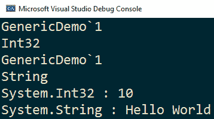

# 六、泛型

在前一章中，我们学习了 C# 中的 OOP。 在本章中，我们将探讨泛型的概念。 泛型允许我们创建类、结构、接口、方法和委托，以使它们能够在具有不同数据类型的类型安全环境中工作。 泛型是作为 C# 2.0 版本的一部分添加的。 它促进了代码的可重用性和可扩展性，是 C# 最强大的特性之一。

本章将学习以下概念:

*   泛型类和泛型继承
*   泛型接口和变种泛型接口
*   通用的结构
*   泛型方法
*   类型约束

在本章结束时，您将获得编写泛型类型、方法和变种泛型接口以及使用类型约束所需的技能。

# 理解泛型

简单地说，泛型是用其他类型参数化的类型。 如前所述，我们可以创建一个类、结构、接口、方法或委托，它们接受一个或多个用作参数的数据类型。 这些参数称为**类型参数**，作为在编译时传递的实际数据类型的*占位符*。

例如，我们可以创建一个建模列表的类，列表是由相同类型的元素组成的变长序列。 与使用整数、双精度浮点数、字符串或我们可能需要的任何其他用户定义类型的不同类不同，我们可以创建一个泛型类，它具有一个类型参数来指定其元素的实际类型。 然后在编译时实例化类时指定实际类型。

使用泛型的优点包括:

*   **泛型提供可重用性**:我们可以创建代码的单一版本，并对不同的数据类型重用它。
*   **泛型促进了类型安全性**:在使用泛型时，我们不需要执行显式的类型转换。 类型转换由编译器负责。
*   **泛型提供了更好的性能**:在值类型的情况下，它们可以避免装箱和拆箱。 即使将**对象**类型转换为引用类型也非常耗时。 因此，通过避免这些操作，它们有助于提高执行时间。

可以对泛型类型和方法进行约束，以便只有满足需求的类型才能用作类型参数。 关于实际类型的信息用于实例化可在运行时使用反射获得的泛型类型。

泛型最常见的用途是创建集合或包装器类。 收藏将是下一章的主题。

# 泛型类型

引用类型和值类型都可以是泛型。 我们在本书前面已经看到了泛型类型的例子，如**Nullable<T>**和**List<T>**。

在本节中，我们将学习如何创建泛型类、结构和接口。

## 泛型类

泛型类的创建与非泛型类没有什么不同。 唯一不同的是类型参数的列表以及它们在类中作为实际类型占位符的使用。 让我们看一个泛型类的例子:

```cs
public class GenericDemo<T>
{
    public T Value { get; private set; }
    public GenericDemo(T value)
    {
        Value = value;
    }
    public override string ToString() => $"{typeof(T)} : {Value}";
}
```

在这里，我们定义了一个泛型类**GenericDemo**，它接受一个类型参数**T**。 我们定义了**T**类型的一个名为**Value**的属性，并在类构造函数中初始化它。 构造函数正在接受一个**T**类型的实参。 覆盖的方法**ToString()**将返回一个包含属性类型和值的字符串。

要实例化这个泛型类的对象，我们将按以下步骤进行:

```cs
var obj1 = new GenericDemo<int>(10);
var obj2 = new GenericDemo<string>("Hello World");
```

在本例中，我们在创建泛型类的对象**GenericDemo<T>**时为 type 参数指定数据类型。 **obj1**和**obj2**都是相同泛型类型的实例，但它们的类型参数不同:一个是**int**，另一个是**string**。 因此，它们彼此之间不是类型兼容的。 这意味着，如果我们试图将一个对象赋值给另一个对象，就会导致编译时错误。

我们可以得到这些对象的类型信息和他们的泛型类型参数使用反射(我们将看看在[*第 11 章*](11.html# _idTextAnchor200),*反射和动态编程*),如以下示例所示:

```cs
var t1 = obj1.GetType();
Console.WriteLine(t1.Name);
Console.WriteLine(t1.GetGenericArguments()
                    .FirstOrDefault().Name);
var t2 = obj2.GetType();
Console.WriteLine(t2.Name);
Console.WriteLine(t2.GetGenericArguments()
                    .FirstOrDefault().Name);
Console.WriteLine(obj1);
Console.WriteLine(obj2);
```

执行后，我们将看到如下所示的输出:



图 6.1 -显示类型的反射内容的控制台屏幕截图

可以为泛型类型声明多个类型参数。 在本例中，我们需要将所有类型参数指定为尖括号中逗号分隔的值。 示例如下:

```cs
class Pair<T, U>
{
    public T Item1 { get; private set; }
    public U Item2 { get; private set; }
    public Pair(T item1, U item2)
    {
        Item1 = item1;
        Item2 = item2;
    }
}
var p1 = new Pair<int, int>(1, 2);
var p2 = new Pair<int, double>(1, 42.99);
var p3 = new Pair<string, bool>("true", true);
```

这里，**对<T, U>**是一个需要两个类型参数的类。 我们使用不同的类型组合实例化对象**p1**、**p2**和**p3**。

这个类实际上非常类似于.NET 类**KeyValueType<TKey**，**TValue>**，来自**System.Collections.Generic**命名空间。 事实上，框架提供了许多泛型类。 您应该在可用时使用现有类型，而不是定义自己的类型。

## 具有泛型类的继承

一个类可以表现为*基类*或*派生类*。 从泛型类派生时，子类必须指定基类所需的类型参数。 这些类型参数可以是实际类型，也可以是派生类的类型参数，派生类也是泛型类。

让我们通过下面的例子来了解泛型类的继承是如何工作的:

```cs
public abstract class Shape<T>
{
    public abstract T Area { get; }
}
```

我们有定义了一个通用抽象类**Shape**，它包含一个称为**Area**的单一抽象属性，该属性表示一个形状的面积。 该属性的类型也是**T**。 考虑这里的类定义:

```cs
public class Square : Shape<int>
{
    public int Length { get; set; }
    public Square(int length)
    {
        Length = length;
    }
    public override int Area => Length * Length;
}
```

在这里，我们定义了一个名为**Square**的类，它继承自通用抽象类**Shape**。 我们使用**int**类型作为类型参数。 我们为**Square**类定义了一个名为**Length**的属性，并在构造函数中初始化它。 我们重写**Area**属性来计算广场的面积。 现在，考虑下面显示的另一个类定义:

```cs
public class Circle : Shape<double>
{
    public double Radius { get; set; }
    public Circle(double radius)
    {
        Radius = radius;
    }
    public override double Area => Math.PI * Radius * Radius;
}
```

**圆形**类也继承自通用抽象类**Shape<T>**。 父类**Shape**的类型参数现在指定为**双**。 **Radius**属性被定义为存储圆的半径。 我们再次覆盖**Area**属性来计算圆的面积。 我们可以像下面这样使用这些派生类:

```cs
Square objSquare = new Square(10);
Console.WriteLine($"The area of square is {objSquare.Area}");
Circle objCircle = new Circle(7.5);
Console.WriteLine($"The area of circle is {objCircle.Area}");
```

我们正在创建**正方形**和**圆形**的实例，并将每个形状的区域打印到控制台。 执行后，我们将看到如下所示的输出:


图 6.2 -显示在控制台的正方形和圆形区域

值得注意的是，虽然**方形**和**圆形**都是由**形状<T>**衍生而来，但这些类型不能被多态治疗。 一个是**Shape<int>T7】，另一个是**Shape<double>**。 因此，**方形**和**圆形**的实例不能放在同一容器中。 唯一可能的解决方案是使用**对象**类型来保存对这些实例的引用，然后执行类型强制转换。**

在这个例子中，**形状<T>**是一个泛型类型。 **【T25 形状】int>**是一种由**<T 形状>【5】**通过替换类型参数 T**和【显示】int**。 这种类型被称为**构造型**。 这也是一个*封闭构造类型*，因为所有的类型参数都被替换了。 非泛型均为*闭型*。 泛型为*开放型*。 构造的泛型类型可以是打开的或关闭的。 开放构造类型是具有未被替换的类型参数的类型。 封闭构造类型是任何不打开的类型。

在创建泛型类型时要记住的另一件重要的事情是，一些运算符(例如算术运算符)不能用于类型参数的对象。 让我们看看下面的代码来举例说明这个情况:

```cs
public class Square<T> : Shape<T>
{
    public T Length { get; set; }
    public Square(T length)
    {
        Length = length;
    }
    /* ERROR: Operator '*' cannot be applied to operands 
    of type 'T' and 'T' */
    public override T Area => Length * Length;
}
```

**Square**类型现在是一个泛型类型。 类型参数**T**用于基类的类型参数以及**Length**属性。 然而，在计算区域时，使用*****运算符会产生编译错误。 这是因为编译器不知道**T**将使用哪些具体类型，以及它们是否重载了*****运算符。 为了确保在任何情况下都不会发生无效的实例化，编译器会生成一个错误。

可以确保在编译时只使用匹配某些预定义约束的类型来实例化泛型类型或调用泛型方法。 这些是，称为*类型约束*，将在本章后面的*类型参数约束*部分进行讨论。

现在我们已经了解了如何创建和使用泛型类，让我们看看如何对泛型接口进行同样的操作。

## 通用接口

在前面的示例中，通用类**Shape<T>**除了抽象属性外不包含任何内容。 这不是一个很好的类候选，它应该是一个接口。 泛型接口与非泛型接口的区别就像泛型类与非泛型类的区别一样。 下面是一个通用接口的例子:

```cs
public interface IShape<T>
{
    public T Area { get; }
}
```

类型参数的指定方式与类或结构相同。 接口实现如下:

```cs
public class Square : IShape<int>
{
    public int Length { get; set; }
    public Square(int length)
    {
        Length = length;
    }
    public int Area => Length * Length;
}
public class Circle : IShape<double>
{
    public double Radius { get; set; }
    public Circle(double radius)
    {
        Radius = radius;
    }
    public double Area => Math.PI * Radius * Radius;
}
```

**Square**和**Circle**类的实现与上一节中看到的只有细微的差别。

具体类,如**圆广场**和**在这里,可以实现封闭构造接口,如**【显示】IShape int>**或**IShape<>**的两倍。 如果类参数列表提供了接口所需的所有类型参数，泛型类也可以实现泛型或闭构造接口。 另一方面，泛型接口可以从非泛型接口继承; 然而，泛型类必须是逆变的。**

 **泛型接口的差异将在下一节中讨论。

## 变种通用接口

在通用接口中可以声明类型参数为*协变*或*逆变*:

*   使用**out**关键字声明*协变*类型参数，并允许接口方法具有比指定类型参数更派生的返回类型。
*   用关键字中的**声明一个*逆变*类型参数，并允许接口方法具有一个比指定类型参数派生得更少的参数。**

具有协变或逆变类型参数的泛型接口称为**变体泛型接口**。 仅引用类型支持方差。

为了理解协方差是如何工作的，让我们看看**系统。 IEnumerable<T>**通用接口。 这是一个变体接口，因为它的类型参数被声明为协变的。 接口定义如下:

```cs
public interface IEnumerable
{
    IEnumerator GetEnumerator();
}
public interface IEnumerable<out T> : IEnumerable
{
    IEnumerator<T> GetEnumerator();
}
```

实现**IEnumerable<T>**(和其他接口)的类是**List<T>**。 由于**T**是协变的，我们可以编写如下代码:

```cs
IEnumerable<string> names = 
   new List<string> { "Marius", "Ankit", "Raffaele" };
IEnumerable<object> objects = names;
```

在这个例子中,**名称**是一个**<IEnumerable 字符串>**和**对象**是**<IEnumerable 对象>**。 前者并不来自于后者,但弦【显示】来自**对象**,因为【病人】T 是协变的,我们可以把**名称**【t16.1】对象。 然而，这只有在使用不同接口时才可能实现。

实现变量接口的类本身不是变量，而是不变的。 这意味着下面的例子,我们用**【显示】列表 T>****IEnumerable<>**,将产生一个编译器错误,因为**【病人】字符串列表>**不能分配给**<列表对象>**:

```cs
IEnumerable<string> names = 
   new List<string> { "Marius", "Ankit", "Raffaele" };
List<object> objects = names; // error
```

如前所述，值类型不支持方差。 **IEnumerable>int>T1 不能被分配给 T2<对象>**

```cs
IEnumerable<int> numbers = new List<int> { 1, 1, 2, 3, 5, 8 };
IEnumerable<object> objects = numbers; // error
```

总之，接口中的协变类型参数必须:

*   以**out**关键词作为前缀
*   只能用作方法的返回类型，而不能用作方法参数的类型
*   不能用作接口方法的通用约束

逆变是处理传递给接口方法的参数的另一种形式的方差。 为了理解它是如何工作的，让我们考虑一个情况，我们想要比较不同形状的大小，定义如下:

```cs
public interface IShape
{
    public double Area { get; }
}
public class Square : IShape
{
    public double Length { get; set; }
    public Square(int length)
    {
        Length = length;
    }
    public double Area => Length * Length;
}
public class Circle : IShape
{
    public double Radius { get; set; }
    public Circle(double radius)
    {
        Radius = radius;
    }
    public double Area => Math.PI * Radius * Radius;
}
```

这些与以前使用的类型只有轻微的不同，因为为了保持示例的简单，**isshape**不再是通用的。 我们想要的是能够比较形状。 为此，我们提供了以下一系列类:

```cs
public class ShapeComparer : IComparer<IShape>
{
    public int Compare(IShape x, IShape y)
    {
        if (x is null) return y is null ? 0 : -1;
        if (y is null) return 1;
        return x.Area.CompareTo(y.Area);
    }
}
public class SquareComparer : IComparer<Square>
{
    public int Compare(Square x, Square y)
    {
        if (x is null) return y is null ? 0 : -1;
        if (y is null) return 1;
        return x.Length.CompareTo(y.Length);
    }
}
public class CircleComparer : IComparer<Circle>
{
    public int Compare(Circle x, Circle y)
    {
        if (x is null) return y is null ? 0 : -1;
        if (y is null) return 1;
        return x.Radius.CompareTo(y.Radius);
    }
}
```

这里，**shapcomparer**比较**IShape**物体的面积，**SquareComparer**比较正方形的长度，**CircleComparer**比较圆的半径。 所有这些类都实现了**System.Collections.Generic**命名空间中的**IComparer<T>**接口。 这个接口定义如下:

```cs
public interface IComparer<in T>
{
    int Compare(T x, T y);
}
```

该接口有一个名为**Compare()**的方法，它接受两个**T**类型的对象，并返回以下其中之一:

*   如果第一个比第二个小，则为负数
*   0，如果它们相等
*   如果第一个大于第二个，则为正数

然而，其定义的关键是关键字中的**以及使其成为逆变的类型参数。 正因为如此，有可能通过**IShape**引用，而期望通过**Square**或**Circle**引用。 这意味着我们可以安全地通过**IComparer<IShape>**，而需要**IComparer<Square>**。 让我们看一个具体的例子。**

下面的类包含一个方法，用于检查一个**Square**对象是否大于另一个对象。 **IsBigger()**方法也引用了实现**icomcomparer<Square>**的对象:

```cs
public class SquareComparison
{
    public static bool IsBigger(Square a, Square b,
                                IComparer<Square> comparer)
    {
        return comparer.Compare(a, b) >= 0;
    }
}
```

我们可以同时调用**SquareComparer**或**shapeccomparer**，结果是相同的:

```cs
Square sqr1 = new Square(4);
Square sqr2 = new Square(5);
SquareComparison.IsBigger(sqr1, sqr2, new SquareComparer());
SquareComparison.IsBigger(sqr1, sqr2, new ShapeComparer());
```

如果**IComparer<T>**接口是不变的，传递**ShapeComparer**会导致编译错误。 如果我们试图通过**CircleComparer**，因为**Circle**不是一个比**Square**更小的派生类，那么编译器错误也会发出，实现如下所示; 它实际上是继承层次结构中的一个兄弟。

总而言之，接口中的逆变类型参数:

*   在关键字中必须加上**前缀**
*   必须只用于方法参数，而不是作为返回类型
*   可以用作接口方法的通用约束吗

可以定义一个既为*协变又为*逆变的接口，如下所示:

```cs
interface IMultiVariant<out T, in U>
{
    T Make();
    void Take(U arg);
}
```

在前面片段中显示的**multivariant<T, U>**接口相对于**T**是协变的，相对于**U**是逆变的。

## 类结构

与泛型类类似，我们也可以创建泛型结构。 泛型结构的语法与泛型类的语法相同。 前面示例中使用的**圆形**和**方形**类型较小，可以定义为结构而不是类:

```cs
public struct Square : IShape<int>
{
    public int Length { get; set; }
    public Square(int length)
    {
        Length = length;
    }
    public int Area => Length * Length;
}
public struct Circle : IShape<double>
{
    public double Radius { get; set; }
    public Circle(double radius)
    {
        Radius = radius;
    }
    public double Area => Math.PI * Radius * Radius;
}
```

适用于泛型类的所有规则也适用于泛型结构。 由于值类型不支持继承，结构不能从其他泛型类型派生，但可以实现任意数量的泛型或非泛型接口。

# 泛型方法

C# 允许我们创建接受一个或多个泛型类型参数的泛型方法。 我们可以在泛型类和非泛型类中创建泛型方法。 静态方法和非静态方法都可以是泛型的。 类型推断的规则对所有类型都是相同的。 类型参数必须在方法名之后和参数列表之前的尖括号内声明，就像我们对类型所做的那样。

让我们了解如何使用泛型方法的帮助下，这里显示的例子:

```cs
class CompareObjects
{
    public bool Compare<T>(T input1, T input2)
    {
        return input1.Equals(input2);
    }
}
```

非泛型类**CompareObjects**包含泛型方法**Compare**，该方法用于比较两个对象。 该方法接受两个参数:**input1**和**input2**。 我们正在使用**系统中的**Equals()**方法。 对象**基类来比较输入参数。 该方法将根据输入是否相等返回一个布尔值。 考虑下面显示的代码:

```cs
CompareObjects comps = new CompareObjects();
Console.WriteLine(comp.Compare<int>(10, 10));
Console.WriteLine(comp.Compare<double>(10.5, 10.8));
Console.WriteLine(comp.Compare<string>("a", "a"));
Console.WriteLine(comp.Compare<string>("a", "b"));
```

我们正在创建**CompareObjects**类的一个对象，并为各种数据类型调用**Compare()**方法。 在本例中，类型参数是显式指定的。 然而，编译器可以从参数中推断出; 因此，可以跳过它，如下所示:

```cs
CompareObjects comp = new CompareObjects();
Console.WriteLine(comp.Compare(10, 10));
Console.WriteLine(comp.Compare(10.5, 10.8));
Console.WriteLine(comp.Compare("a", "a"));
Console.WriteLine(comp.Compare("a", "b"));
```

如果泛型方法的类型形参与定义它的类、结构或接口的类型形参相同，编译器就会发出警告，因为方法类型形参隐藏了外部类型的类型形参，如下所示:

```cs
class ConflictingGenerics<T>
{
    public void DoSomething<T>(T arg) // warning
    { 
    }
}
```

泛型方法和泛型类型都支持类型参数约束来对类型施加限制。 这个问题将在本章的下一节讨论。

# 类型参数约束

泛型类型或方法中的类型参数可以替换为任何有效类型。 然而，在有些情况下，我们想要限制类型参数可以使用的类型。 例如，我们前面看到的通用**Shape<T>T2】类或**IShape<T>T4】接口。****

类型参数**T**用于表示**区域**属性的类型。 我们希望它是整型或浮点型。 但是没有限制，可以使用**bool**、**string**或任何其他类型。 当然，根据类型参数的使用方式，这可能会导致各种编译器错误。 但是，能够限制用于实例化泛型类型或调用泛型方法的类型是很有用的。

为此，我们可以对类型参数应用约束。 约束用于通知编译器类型参数必须具有什么样的功能。 如果不指定约束，则类型参数可以替换为任何类型。 应用约束将限制可以用作类型参数的类型。

约束使用关键字**指定，其中**。 C# 定义了以下八种类型的泛型约束:


约束应该在类型参数之后指定。 我们可以使用多个约束，用逗号分隔它们。 使用这些约束有一些规则:

*   结构约束意味着**新()**约束，因此所有值类型都必须有一个公共的无参数构造函数。 这两个约束，**结构**和**new()**不能一起使用。
*   **未管理**约束暗示**结构**约束; 因此，这两者不能同时使用。 它也不能与**new()**约束一起使用。
*   当使用多个约束时，**new()**约束必须在约束列表的最后提到。
*   **notnull**约束在 C# 8 中可用，并且必须在可为空的上下文中使用，否则编译器会生成一个警告。 当违反约束时，编译器不会生成错误，而是生成警告。
*   从 C# 7.3 开始，**系统。 枚举**、**系统。 委托**和**系统。 MulticastDelegate**可以用作基类约束。

没有约束的类型参数称为*无界*。 对于无界类型参数有几个规则:

*   您不能对这些类型使用**!=**和**==**运算符，因为不可能知道具体类型是否会重载它们。
*   它们可以与**null**进行比较。 对于值类型，这个比较总是会产生**false**。
*   它们可以在**系统之间进行转换。 对象**。
*   它们可以在任意接口类型之间进行转换。

为了理解约束是如何工作的，让我们从以下泛型结构的例子开始:

```cs
struct Point<T>
{
    public T X { get; }
    public T Y { get; }
    public Point(T x, T y)
    {
        X = x;
        Y = y;
    }
}
```

**Point<T>**是表示二维空间中的一个点的结构。 这个类是泛型的，因为我们可能希望对点坐标或实值(浮点值)使用整型值。 但是，我们可以使用任何类型实例化类，例如**bool**、**string**或**Circle**，如下例所示:

```cs
Point<int> p1 = new Point<int>(3, 4);
Point<double> p2 = new Point<double>(3.12, 4.55);
Point<bool> p3 = new Point<bool>(true, false);
Point<string> p4 = new Point<string>("alpha", "beta");
```

限制**<T 的实例化>**数值类型(即积分和浮点类型),我们可以把约束的类型参数 T**,如下所示:**

```cs
struct Point<T>
    where T : struct, 
              IComparable, IComparable<T>,
              IConvertible,
              IEquatable<T>,
              IFormattable
{
    public T X { get; }
    public T Y { get; }
    public Point(T x, T y)
    {
        X = x;
        Y = y;
    }
}
```

我们使用了两种类型的约束:**结构**约束和接口约束，它们用逗号分隔。 不幸的是，没有约束将类型定义为数值类型，但是这些约束是表示数值类型的最佳组合，因为所有数值类型都是值类型，而且它们都实现了这里列出的 5 个接口。 **bool**类型实现前四个，但不实现**IFormattable**。 因此，使用**bool**或**string**实例化**Point<T>**将产生编译器错误。

一个类型或方法可以有多个类型参数，每个类型参数都可以有自己的约束。 我们可以在下面的例子中看到:

```cs
class RestrictedDictionary<TKey, TValue> : Dictionary<TKey, List<TValue>>
    where TKey : System.Enum
    where TValue : class, new()
{
    public T Make<T>(TKey key) where T : TValue, new()
    {
        var value = new T();
        if (!TryGetValue(key, out List<TValue> list))
            Add(key, new List<TValue>() { value });
        else
            list.Add(value);
        return value;
    }
}
```

**RestrictedDictionary<TKey, TValue>**类是一个特殊的字典，它只允许键类型的枚举类型。 为此，它使用了**System 的基类约束。 Enum**。 值的类型必须是具有公共默认构造函数的引用类型。 为此，它使用了**类**和**new()**约束。 这个类有一个公共泛型方法**Make<T>()**。

类型参数**T**必须是**TValue**或从**TValue**派生的类型，并且还必须有一个公共默认构造函数。 该方法创建一个新的类型实例**T**，将其添加到与指定键关联的字典列表中，并返回对新创建对象的引用。

让我们也考虑下面的形状类的层次结构。 请注意，为了简单起见，这些都保持在最小值:

```cs
enum ShapeType { Sharp, Rounded };
class Shape { }
class Ellipsis  : Shape { }
class Circle    : Shape { }
class Rectangle : Shape { }
class Square    : Shape { }
```

我们可以使用**RestrictedDictionary**类，如下所示:

```cs
var dictionary = new RestrictedDictionary<ShapeType, Shape>();
var c = dictionary.Make<Circle>(ShapeType.Rounded);
var e = dictionary.Make<Ellipsis>(ShapeType.Rounded);
var r = dictionary.Make<Rectangle>(ShapeType.Sharp);
var s = dictionary.Make<Square>(ShapeType.Sharp);
```

在本例中，我们将几个形状(圆、椭圆、矩形和正方形)添加到受限字典中。 键类型为**ShapeType**，值类型为**Shape**。 **Make()**方法接受**ShapeType**类型的参数，并返回一个对形状对象的引用。 每个类型必须派生自**Shape**，并且有一个公共的默认构造函数。 否则，代码将产生错误。

# 总结

在本章中，我们学习了 C# 中的泛型。 泛型允许我们在 C# 中创建参数化类型。 泛型增强了代码的可重用性并确保类型安全。 我们探索了如何创建泛型类和泛型结构。 我们还在泛型类中实现了继承。

我们学习了如何在泛型类型或方法的类型参数上实现约束。 约束允许我们限制可以用作类型参数的数据类型。 我们还学习了如何创建泛型方法和泛型接口。

您可以将泛型主要用于创建集合和包装器。 在下一章中，我们将探讨.NET 中最重要的集合。

# 测试你所学的内容

1.  什么是泛型，它们提供了什么好处?
2.  什么是类型参数?
3.  如何定义泛型类? 那么泛型方法呢?
4.  类可以从泛型类型派生吗? 结构是什么?
5.  什么是构造类型?
6.  泛型接口的协变类型参数是什么?
7.  泛型接口的逆变类型参数是什么?
8.  什么是类型参数约束，如何指定它们?
9.  **new()**类型参数约束做什么?
10.  在 C# 8 中引入了什么类型的参数约束，它做什么?**