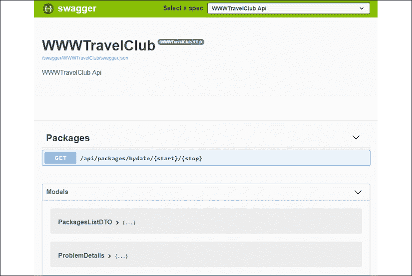
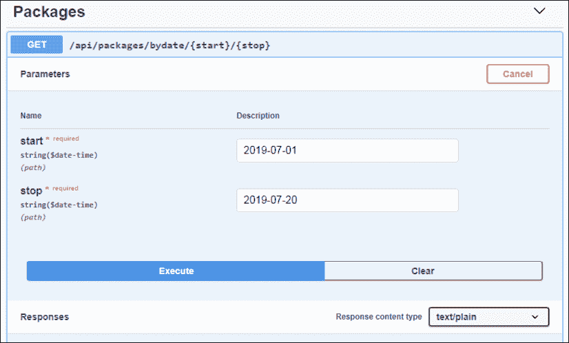

# 十四、.NETCore 应用的面向服务的架构

术语**面向服务架构**（**SOA**是指通过通信实现系统组件之间交互的模块化架构。SOA 允许来自不同组织的应用自动交换数据和事务，并允许组织在 internet 上提供服务。

此外，正如我们在*第 5 章*的*微服务和模块概念*部分中所讨论的，*将微服务架构应用于您的企业应用*，基于通信的交互解决了由共享相同地址空间的模块组成的复杂系统中不可避免地出现的二进制兼容性和版本不匹配问题。此外，使用 SOA，您不需要在使用它的各种系统/子系统中部署同一组件的不同副本——每个组件只需要部署在一个地方。这可以是单个服务器、位于单个数据中心的群集或地理分布的群集。在这里，每个版本的组件只部署一次，服务器/集群逻辑自动创建所有必要的副本，从而简化了整个**持续集成/持续交付**（**CI/CD**周期。

如果较新版本符合向客户端声明的通信接口，则不会发生不兼容。另一方面，对于 DLL/包，当维护同一接口时，可能会出现不兼容，因为库模块与其客户端可能具有的其他 DLL/包的依赖关系可能存在版本不匹配。

*第 5 章**将微服务架构应用于企业应用*中讨论了如何组织协作服务的集群/网络。在本章中，我们将主要关注每个服务提供的通信接口。更具体地说，我们将讨论以下主题：

*   了解 SOA 方法的原则
*   SOAP 和 RESTWeb 服务
*   NET5 如何处理 SOA？
*   用例–公开 WWTravelClub 包

在本章结束时，您将了解如何通过 ASP.NETCore 服务公开 WWTravelClub 图书用例中的数据。

# 技术要求

本章要求安装有所有数据库工具的 Visual Studio 2019 免费社区版或更高版本。

本章中的所有概念都将根据本书的 WWTravelClub 图书使用案例，通过实例加以澄清。您可以在[找到本章的代码 https://github.com/PacktPublishing/Software-Architecture-with-C-9-and-.NET-5](https://github.com/PacktPublishing/Software-Architecture-with-C-9-and-.NET-5) 。

# 了解 SOA 方法的原则

与面向对象架构中的类一样，服务是接口的实现，而接口又来自系统的功能规范。因此，*服务*设计的第一步是定义其*抽象接口*。在此阶段，您将定义所有的服务操作作为接口方法，这些接口方法对您喜爱的语言（C 语言、java、C++、java 脚本等）进行操作，并决定用同步通信实现哪些操作，哪些操作要用异步通信实现。

在这个初始阶段定义的接口不一定用于实际的服务实现，只是有用的设计工具。一旦我们确定了服务的架构，这些接口通常会被重新定义，以便我们能够使它们适应架构的特性。

值得指出的是，SOA 消息必须保持与方法调用/应答相同的语义；也就是说，对消息的反应不能依赖于以前收到的任何消息。在这里，消息必须相互独立，并且服务*不能记住*以前接收到的任何消息。这就是我们所说的无状态开发。

例如，如果消息的目的是创建新的数据库条目，则此语义不得随其他消息的上下文而更改，并且创建数据库条目的方式必须取决于当前消息的内容，而不是以前接收到的其他消息。因此，客户端无法创建会话，也无法登录到服务，执行某些操作，然后注销。必须在每条消息中重复身份验证令牌。

这种限制的原因是模块性、可测试性和可维护性。事实上，基于会话的服务将很难测试和修改，因为会话数据中隐藏了*交互。*

一旦决定了服务将要实现的接口，就必须决定采用哪个通信堆栈/SOA 架构。通信堆栈必须是某些官方或*事实上的*标准的一部分，以确保服务的互操作性。互操作性是 SOA 规定的主要约束：服务必须提供不依赖于所使用的特定通信库、实现语言或部署平台的通信接口。

考虑到您已经决定了通信堆栈/架构，您需要根据架构的特点调整以前的接口（有关更多详细信息，请参阅本章*REST web services*小节）。然后，您必须将这些接口转换为所选的通信语言。这意味着您必须将所有编程语言类型映射为所选通信语言中可用的类型。

数据的实际转换通常由开发环境使用的 SOA 库自动执行。然而，可能需要一些配置，而且在任何情况下，我们都必须知道在每次通信之前编程语言类型是如何转换的。例如，某些数值类型可能转换为精度较低或值范围不同的类型。

对于集群之外无法访问的微服务，互操作性约束可以用更轻松的形式来解释，因为它们需要与属于同一集群的其他微服务通信。在这种情况下，这意味着通信堆栈可能是特定于平台的，因此可以提高性能，但它必须是标准的，以避免与随着应用的发展可能添加到集群中的其他微服务的兼容性问题。

我们提到了*通信堆栈*，而不是*通信协议*，因为 SOA 通信标准通常定义消息内容的格式，并为用于嵌入这些消息的特定协议提供不同的可能性。例如，SOAP 协议只是为各种消息定义了一种基于 XML 的格式，但是 SOAP 消息可以通过各种协议进行传输。通常，用于 SOAP 的最常见协议是 HTTP，但您可能会决定跳到 HTTP 级别，直接通过 TCP/IP 发送 SOAP 消息以获得更好的性能。

应采用的通信堆栈的选择取决于几个因素：

*   **兼容性约束**：如果您的服务必须在互联网上向业务客户公开，那么您必须遵守最常见的选择，即使用 HTTP 上的 SOAP 或 JSON REST 服务。如果您的客户不是商业客户而是**物联网**（**物联网**客户，则最常见的选择是不同。此外，在物联网中，用于不同应用领域的协议可能不同。例如，海上车辆状态数据通常不与*信号 K*交换。
*   **开发/部署平台**：并非所有的开发框架和部署平台上都有可用的通信栈，但幸运的是，公共业务服务中使用的所有最常见的通信栈，如基于 SOAP 和 JSON 的 REST 通信，可在所有主要开发/部署平台上使用。
*   **性能**：如果您的系统不暴露于外界，并且是微服务集群的私有部分，则性能考虑因素具有更高的优先级。在这种情况下，我们将在本章中很快讨论的 gRPC 是一个不错的选择。
*   **团队中工具和知识的可用性**：在选择可接受的通信堆栈时，了解团队/组织中工具的可用性具有重要的重要性。然而，这种约束的优先级总是低于兼容性约束，因为设想一个易于为您的团队实现但几乎没有人可以使用的系统是没有意义的。
*   **灵活性与可用功能**：一些通信解决方案虽然不太完整，但灵活性更高，而其他解决方案虽然更完整，但灵活性更低。对灵活性的需求在过去几年中开始了从基于 SOAP 的服务向更灵活的 REST 服务的转变。当我们在本节的剩余部分描述 SOAP 和 REST 服务时，将更详细地讨论这一点。
*   **服务描述**：当服务必须在互联网上公开时，客户端应用需要公开可用的服务规范描述来设计其通信客户端。一些通信堆栈包括描述服务规范的语言和约定。可以处理以这种方式公开的正式服务规范，以便它们自动创建通信客户端。SOAP 更进一步，通过包含每个 web 服务可以执行的任务的信息的基于 XML 的公共目录，允许服务的可发现性。

一旦选择了要使用的通信堆栈，就必须使用开发环境中可用的工具，以符合所选通信堆栈的方式实现服务。有时，开发工具会自动确保通信堆栈的一致性，但有时可能需要一些开发工作。例如，在.NET 世界中，如果您使用 WCF，SOAP 服务的遵从性将由开发工具自动确保，而 REST 服务的遵从性则由开发人员负责。SOA 解决方案的一些基本功能如下：

*   **认证**：允许客户端通过认证访问服务操作。
*   **授权**：处理客户的权限。
*   **安全**：这是如何确保通信安全，即如何防止未经授权的系统读取和/或修改通信内容。通常，加密可以防止未经授权的修改和读取，而电子签名算法只能防止修改。
*   **异常**：向客户端返回异常。
*   **消息可靠性**：确保在基础设施可能出现故障的情况下，消息能够可靠地到达目的地。

虽然有时需要以下功能，但并非总是必需的：

*   **分布式事务**：处理分布式事务的能力，从而撤销在分布式事务失败或中止时所做的所有更改。
*   **对发布者/订阅者模式**的支持：是否以及如何支持事件和通知。
*   **寻址**：如果和如何支持对其他服务和/或服务/方法的引用。
*   **路由**：如果和如何通过服务网络路由消息。

本节的其余部分专门描述 SOAP 和 REST 服务，因为它们是在集群/服务器之外公开的业务服务的*事实上的*标准。出于性能原因，微服务使用其他协议，如*第 5 章*中所述*将微服务架构应用于企业应用*中所述；*第 6 章*、*Azure 服务结构*；以及*第 7 章**Azure Kubernetes 服务*。集群间通信采用**高级消息队列协议**（**AMQP**），链路在*进一步阅读*部分给出。

# soapweb 服务

**简单对象访问协议**（**SOAP**允许单向消息和应答消息。通信可以是同步的，也可以是异步的，但是，如果基础协议是同步的，例如在 HTTP 的情况下，发送方会收到一个确认，说明消息已被接收（但不一定已处理）。使用异步通信时，发送方必须侦听传入的通信。通常，异步通信是通过我们在*第 11 章*、*设计模式和.NET 5 实现*中描述的发布者/订阅者模式来实现的。

消息以称为**信封**的 XML 文档表示。每个信封包含一个`header`、一个`body`和一个`fault`元素。`body`是放置消息实际内容的位置。`fault`元素包含可能的错误，因此这是发生通信时交换异常的方式。最后，`header`包含丰富协议的任何辅助信息，但不包含域数据。例如，`header`可能包含认证令牌和/或签名（如果消息已签名）。

用于发送 XML 信封的底层协议通常是 HTTP，但 SOAP 规范允许任何协议，因此我们可以直接使用 TCP/IP 或 SMTP。事实上，更分散的底层协议是 HTTP，因此，如果您没有很好的理由选择另一个协议，那么应该使用 HTTP 以最大限度地提高服务的互操作性。

SOAP 规范包含消息交换的基础，而其他辅助功能在称为`WS- *`的单独规范文档中描述，通常通过在 SOAP 头中添加额外信息来处理。`WS-*`规范处理了我们前面列出的 SOA 的所有基本和需要的特性。例如，`WS-Security`负责安全，包括身份验证、授权和加密/签名；`WS-Eventing`和`WS-Notification`是实现发布者/订阅者模式的两种可选方式；`WS-ReliableMessaging`关注在可能出现故障的情况下消息的可靠传递；`WS-Transaction`涉及分布式事务。

前面的`WS-*`规范并非详尽无遗，而是更相关、更受支持的特性。事实上，各种环境（如 Java 和.NET）中的实际实现提供了更相关的`WS-*`服务，但没有实现支持所有`WS-*`规范。

SOAP 协议中涉及的所有 XML 文档/文档部分都在 XSD 文档中正式定义，XSD 文档是一种特殊的 XML 文档，其内容提供了对 XML 结构的描述。此外，如果您的所有自定义数据结构（面向对象语言中的类和接口）将成为 SOAP 信封的一部分，则必须将它们转换为 XSD。

每个 XSD 规范都有一个相关的`namespace`，用于标识规范和可以找到它的物理位置。命名空间和物理位置都是 URI。如果 web 服务仅可从 intranet 中访问，则不需要公开访问位置 URI。

服务的整个定义是一个 XSD 规范，其中可能包含对其他名称空间的引用，即对其他 XSD 文档的引用。简单地说，SOAP 通信的所有消息都必须在 XSD 规范中定义。然后，如果服务器和客户机引用相同的 XSD 规范，则它们可以通信。例如，这意味着您需要在每次向消息添加另一个字段时创建新的 XSD 规范。之后，您需要通过创建新版本的 XSD 文件，将引用旧消息定义的所有 XSD 文件更新为新消息定义。反过来，这些修改需要为其他 XSD 文件创建其他版本，等等。因此，保持与以前行为兼容的简单修改（客户端可以简单地忽略添加的字段）可能会导致版本更改的指数链。

在过去几年中，处理修改的困难，以及处理所有`WS-*`规范的配置和性能问题的复杂性，导致逐步转向更简单的 REST 服务，我们将在接下来的章节中描述。这一举措始于 JavaScript 调用的服务，因为很难实现能够在 web 浏览器中高效运行的完整 SOAP 客户端。此外，复杂的 SOAP 机制对于在浏览器中运行的典型客户机的简单需求来说过于庞大，可能会造成开发时间的完全浪费。

出于这个原因，针对非 JavaScript 客户端的服务开始了向 REST 服务的大规模移动，如今首选的是 REST 服务，SOAP 要么用于与遗留系统的兼容性，要么用于需要 REST 服务不支持的功能时。支付/银行系统是一个继续倾向于使用 SOAP 系统的典型应用领域，因为这些系统需要`WS-Transaction`SOAP 规范提供的事务支持。在 REST 服务世界中没有类似的服务。

# RESTWeb 服务

REST 服务最初是为了避免在简单的情况下使用复杂的 SOAP 机制，例如从网页的 JavaScript 代码调用服务。然后，它们逐渐成为复杂系统的首选。REST 服务使用 HTTP 以 JSON 格式或不太常见的 XML 格式交换数据。简单地说，它们用 HTTP 正文替换 SOAP 正文，用 HTTP 标头替换 SOAP 标头，HTTP 响应代码替换 fault 元素，并提供有关所执行操作的进一步辅助信息。

REST 服务成功的主要原因是 HTTP 已经在本地提供了大多数 SOAP 特性，这意味着我们可以避免在 HTTP 之上构建 SOAP 级别。此外，整个 HTTP 机制比 SOAP 更简单：编程更简单，配置更简单，实现更高效。

此外，REST 服务对客户端施加的约束更少。服务器和客户端之间的类型兼容性符合更灵活的 JavaScript 类型兼容性模型，因为 JSON 是 JavaScript 的子集。此外，当使用 XML 代替 JSON 时，它维护相同的 JavaScript 类型兼容性规则。不需要指定 XML 名称空间。

使用 JSON 和 XML 时，如果服务器向响应中添加更多字段，同时保持所有其他字段的相同语义与以前的客户端兼容，则它们可以忽略新字段。因此，对 REST 服务定义所做的更改只需要传播到以前的客户机，以防中断更改导致服务器中的实际不兼容行为。

此外，更改可能是自限的，不会导致指数级的更改链，因为类型兼容性不要求在唯一共享位置定义对特定类型的引用，只要求类型的形状是兼容的。

## 服务类型兼容性规则

让我们用一个例子来澄清 REST 服务类型兼容性规则。假设有几个服务使用一个包含`Name`、`Surname`和`Address`字符串字段的`Person`对象。此对象由**S1**提供：

```cs
{
    Name: string,
    Surname: string,
    Address: string
} 
```

如果服务和客户端引用前面定义的不同副本，则可以确保类型兼容性。客户机也可以使用字段较少的定义，因为它可以忽略所有其他字段：

```cs
{
    Name: string,
    Surname: string,
} 
```

您只能在“自己的”代码中使用字段较少的定义。尝试在没有预期字段的情况下将信息发送回服务器可能会导致问题。

现在，想象一下这样一个场景：您有一个**S2**服务，它从**S1**获取`Person`对象，并将它们添加到它在某些方法上返回的响应中。假设处理`Person`对象的**S1**服务将`Address`字符串替换为复杂对象：

```cs
{
    Name: string,
    Surname: string,
    Address:
        {
            Country: string,
            Town: string,
            Location: string
        }
} 
```

在突破性更改之后，**S2**服务必须将其调用**S1**服务的通信客户端调整为新格式。然后，在响应中使用`Person`对象之前，它可以将新的`Person`格式转换为旧的格式。这样，**S2**服务避免传播**S1**的中断变化。

一般来说，基于对象形状（嵌套属性树）的类型兼容性，而不是参考相同的形式类型定义，增加了灵活性和可修改性。我们为这种增加的灵活性付出的代价是不能通过比较服务器和客户端接口的形式定义来自动计算类型兼容性。事实上，在没有统一规范的情况下，每次发布新版本的服务时，开发人员都必须验证客户端和服务器共同拥有的所有字段的语义是否与以前的版本保持不变。

REST 服务背后的基本思想是为了更大的灵活性和简单性而放弃严重性检查和复杂的协议，而 SOAP 恰恰相反。

## Rest 和本机 HTTP 功能

REST 服务宣言声明 REST 使用本机 HTTP 特性来实现所有必需的服务特性。因此，例如，使用 HTTP`Authorization`字段直接执行身份验证，使用 HTTPS 实现加密，使用 HTTP 错误状态码处理异常，HTTP 协议所依赖的机器处理路由和可靠消息。寻址是通过使用 URL 引用服务、服务的方法和其他资源来实现的。

由于 HTTP 是一种同步协议，因此本机不支持异步通信。发布者/订阅者模式也没有本机支持，但是两个服务可以通过各自向另一个公开端点来与发布者/订阅者模式交互。更具体地说，第一个服务公开订阅端点，而第二个服务公开接收其通知的端点，这些通知通过在订阅期间交换的公共机密进行授权。这种模式很常见。GitHub 还允许我们将 REST 服务发送到存储库事件。

REST 服务在实现分布式事务时没有提供简单的选项，这就是为什么支付/银行系统仍然喜欢 SOAP 的原因。幸运的是，大多数应用领域不需要分布式事务所保证的强大的一致性。对于他们来说，较轻的一致性形式，如*最终一致性*就足够了，出于性能原因，他们更喜欢这种形式。请参考*第 9 章*、*如何选择您在云中的数据存储*，讨论各种类型的一致性。

REST 宣言不仅规定了 HTTP 中已有的预定义解决方案的使用，还规定了类似 web 的语义的使用。更具体地说，所有服务操作都必须被视为对由 URL 标识的资源（同一资源可以由多个 URL 标识）的 CRUD 操作。事实上，REST 是**代表性状态转移**的首字母缩写，意思是每个 URL 都是某种对象的表示。每种服务请求都需要采用适当的 HTTP 动词，如下所示：

*   `GET`（读取操作）：URL 表示读取操作返回的资源。因此，`GET`操作模拟指针解引用。如果操作成功，则返回 200（正常）状态代码。
*   `POST`（创建操作）：请求主体中包含的 JSON/XML 对象作为新资源添加到操作 URL 表示的对象中。如果立即成功创建新资源，将返回 201（已创建）状态代码，以及一个响应对象，该响应对象取决于操作和可从何处检索已创建资源的指示。响应对象应该包含标识所创建资源的最具体的 URL。如果创建延迟到稍后时间，则返回 202（已接受）状态代码。
*   `PUT`（编辑操作）：请求主体中包含的 JSON/XML 对象替换请求 URL 引用的对象。如果操作成功，则返回 200（正常）状态代码。此操作是幂等的，这意味着重复相同的请求两次会导致相同的修改。
*   `PATCH`：请求主体中包含的 JSON/XML 对象包含如何修改请求 URL 引用的对象的说明。此操作不是幂等的，因为修改可能是数值字段的增量。如果操作成功，则返回 200（正常）状态代码。
*   `DELETE`：请求 URL 引用的资源被删除。如果操作成功，则返回 200（正常）状态代码。

如果资源已从请求 URL 移动到另一个 URL，则返回重定向代码：

*   `301`（永久移动），加上我们可以找到资源的新 URL
*   `307`（暂时移动），加上我们可以找到资源的新 URL

如果操作失败，则返回一个状态代码，该代码取决于故障的类型。故障代码的一些示例如下：

*   `400`（错误请求）：发送到服务器的请求格式错误。
*   `404`（未找到）：当请求 URL 未引用任何已知对象时。
*   `405`（不允许方法）：当 URL 引用的资源不支持请求动词时。
*   `401`（未授权）：操作需要认证，但客户端没有提供任何有效的授权头。
*   `403`（禁止）：客户端已正确验证，但无权执行操作。

上述状态代码列表并非详尽无遗。*进一步阅读*一节将提供详尽清单的参考资料。

必须指出的是，`POST`/`PUT`/`PATCH`/`DELETE`操作可能会——通常也会——对其他资源产生副作用。否则，就不可能对同时作用于多个资源的操作进行编码。

换句话说，HTTP 谓词必须符合在资源上执行并由请求 URL 引用的操作，但该操作可能会影响其他资源。在其他涉及的资源之一上，可以使用不同的 HTTP 谓词执行相同的操作。开发人员有责任选择执行相同操作的方式，以便在服务接口中实现它。

由于 HTTP 谓词的副作用，REST 服务可以将所有这些操作编码为 URL 表示的资源上的 CRUD 操作。

通常，将现有服务移动到 REST 需要我们在请求 URL 和请求正文之间分割各种输入。更具体地说，我们提取输入字段，这些字段以单音形式定义方法执行中涉及的一个对象，并使用它们创建一个 URL，以单音形式标识该对象。然后，我们根据对所选对象执行的操作来决定使用哪个 HTTP 谓词。最后，我们将输入的其余部分放在请求主体中。

如果我们的服务是以业务领域对象为中心的面向对象架构设计的（如 DDD，如*第 12 章*、*理解软件解决方案*中的不同领域所述），那么所有服务方法的其余翻译应该是相当即时的，因为服务应该已经围绕域资源进行组织。否则，移动到 REST 可能需要重新定义一些服务接口。

采用完全 REST 语义的优点是，可以在对现有操作定义进行小修改的情况下扩展服务。事实上，扩展应该主要表现为一些对象的附加属性和带有一些相关操作的附加资源 URL。因此，预先存在的客户端可以简单地忽略它们。

## REST 语言中的方法示例

现在，让我们通过一个简单的银行内部转账示例，学习如何用 REST 语言表达方法。银行账户可以用 URL 表示，如下所示：

```cs
https://mybank.com/bankaccounts/{bank account number} 
```

转账可以表示为一个`PATCH`请求，其主体包含一个对象，该对象的属性表示金额、转账时间、描述和接收款项的帐户。

该操作会修改 URL 中提到的帐户，但也会修改接收帐户作为*副作用*。如果帐户没有足够的钱，将返回一个`403`（禁止）状态码，以及一个包含所有错误详细信息（错误描述、可用资金等）的对象。

但是，由于所有银行操作都记录在账户对账单中，因此为与银行账户关联的*银行账户操作*集合创建和添加新的转账对象是表示转账的更好方式。在本例中，URL 可能类似于以下内容：

```cs
https://mybank.com/bankaccounts/{bank account number}/transactions 
```

这里，HTTP 动词是`POST`，因为我们正在创建一个新对象。正文内容相同，如果缺少资金，则返回`422`状态码。

传输的两种表示形式在数据库中引起相同的更改。此外，一旦从不同的 URL 和可能不同的请求主体提取了输入，后续处理是相同的。在这两种情况下，我们都有相同的输入和相同的处理——只是两个请求的外观不同而已。

然而，虚拟*操作*采集的引入允许我们使用更多*操作*采集特定方法来扩展服务。值得指出的是，*操作*集合不需要与数据库表或任何物理对象连接：它生活在 URL 世界中，为我们建模传输提供了一种方便的方式。

REST 服务使用的增加导致创建 REST 服务接口的描述，如为 SOAP 开发的接口。该标准称为**OpenAPI**。我们将在下面的小节中讨论这一点。

## OpenAPI 标准

OpenAPI 是用于描述 RESTAPI 的标准。它目前是版本 3。整个服务由一个 JSON 端点描述，也就是说，一个用 JSON 对象描述服务的端点。这个 JSON 对象有一个应用于整个服务的通用部分，包含服务的通用特性，如版本和描述，以及共享定义。

然后，每个服务端点都有一个特定的部分，描述端点 URL 或 URL 格式（如果 URL 中包含一些输入）、其所有输入、所有可能的输出类型和状态代码以及所有授权协议。每个端点特定的部分都可以引用常规部分中包含的定义。

对 OpenAPI 语法的描述不在本书的范围之内，但在*进一步阅读*一节中提供了参考资料。各种开发框架通过处理 RESTAPI 代码自动生成 OpenAPI 文档，开发人员提供了进一步的信息，因此您的团队不需要深入了解 OpenAPI 语法。我们将在本章中介绍的`Swashbuckle.AspNetCore`NuGet 包就是一个例子。

*NET 5 如何处理 SOA？*部分介绍了如何在 ASP.NETCore REST API 项目中自动生成 OpenAPI 文档，而本章末尾的用例提供了一个实际的使用示例。

在本小节的结尾，我们将讨论如何在 REST 服务中处理身份验证和授权。

## REST 服务授权和身份验证

由于 REST 服务是无会话的，当需要身份验证时，客户端必须在每个请求中发送一个身份验证令牌。该令牌通常放在 HTTP 授权头中，但这取决于您使用的身份验证协议的类型。最简单的身份验证方法是通过显式传输共享密钥。这可以通过以下代码完成：

```cs
Authorization: Api-Key <string known by both server and client> 
```

共享密钥称为 API 密钥。由于在编写本文时，没有关于如何发送的标准，因此也可以在其他头中发送 API 密钥，如以下代码所示：

```cs
X-API-Key: <string known by both server and client> 
```

值得一提的是，基于 API 密钥的身份验证需要 HTTPS 来阻止共享机密被窃取。API 密钥使用非常简单，但它们不传递有关用户授权的信息，因此，当客户端允许的操作非常标准且没有复杂的授权模式时，可以采用 API 密钥。此外，当在请求中交换时，API 密钥很容易在服务器或客户端受到攻击。缓解这种情况的一种常见模式是创建一个“服务帐户”用户，并将其权限限制为仅需要的权限，并在与 API 交互时使用该特定帐户的 API 密钥。

更安全的技术使用的共享秘密在很长一段时间内有效，只需用户登录即可。然后，登录返回一个短生命令牌，该令牌在所有后续请求中用作共享密钥。当短生命秘密即将过期时，可以通过调用续订端点来续订该秘密。

整个逻辑与基于令牌的短生命周期授权逻辑完全解耦。登录通常基于接收长期凭据并返回短期令牌的登录端点。登录凭据是作为登录方法的输入传递的常用用户名-密码对，或者是转换为登录端点提供服务的短生命令牌的其他类型的授权令牌。还可以使用基于 X.509 证书的各种身份验证协议实现登录。

最普遍的短寿命令牌类型是所谓的承载令牌。每个承载令牌编码有关其持续时间的信息，以及可用于授权目的的断言列表（称为声明）。承载令牌通过登录操作或续订操作返回。它们的特点是不与接收它们的客户机或任何其他特定客户机绑定。

无论客户机如何获得不记名令牌，这都是客户机需要被授予的所有权利。将不记名令牌转移到另一个客户机就足以赋予该客户机所有不记名令牌声明隐含的所有权利，因为基于不记名令牌的授权不需要身份证明。

因此，一旦客户端获得了承载令牌，它就可以通过将其承载令牌传输给第三方，从而将一些操作委托给第三方。通常，当必须使用承载令牌进行委托时，在登录阶段，客户端指定要包括的声明，以限制令牌可以授权的操作。

与 API 密钥认证相比，基于承载令牌的认证受到标准的约束。他们必须使用以下`Authorization`标题：

```cs
Authorization: Bearer <bearer token string> 
```

承载令牌可以通过多种方式实现。REST 服务通常使用 JWT 标记，这些标记与 JSON 对象的 Base64URL 编码相关联。更具体地说，JWT 创建从 JSON 头和 JSON 负载开始。JSON 头指定令牌的种类及其签名方式，而有效负载由一个 JSON 对象组成，该对象包含作为属性/值对的所有声明。以下是标题示例：

```cs
{
  "alg": "RS256",
  "typ": "JWT"
} 
```

以下是一个有效载荷示例：

```cs
{
  "iss": "wwtravelclub.com"
  "sub": "example",
  "aud": ["S1", "S2"],
  "roles": [
    "ADMIN",
    "USER"
  ],
  "exp": 1512975450,
  "iat": 1512968250230
} 
```

然后，对报头和有效负载进行 Base64URL 编码，并按如下方式连接相应的字符串：

```cs
<header BASE64 string>.<payload base64 string> 
```

然后，使用标头中指定的算法对前面的字符串进行签名，在我们的示例中，该算法为 RSA+SHA256，签名字符串与原始字符串连接如下：

```cs
<header BASE64 string>.<payload base64 string>.<signature string> 
```

前面的代码是最终的承载令牌字符串。对称签名可以代替 RSA 使用，但在这种情况下，JWT 颁发者和使用它进行授权的所有服务必须共享一个公共密钥，而在 RSA 中，JWT 颁发者的私钥不需要与任何人共享，因为签名可以仅使用颁发者公钥进行验证。

某些有效负载属性是标准的，例如：

*   `iss`：JWT 的发行人。
*   `aud`：受众，即可以使用令牌进行授权的服务和/或操作。如果服务在此列表中未看到其标识符，则应拒绝令牌。
*   `sub`：标识向其发出 JWT 的*主体*（即用户）的字符串。
*   `iat`、`exp`和`nbf`：分别是 JWT 发出的时间、其到期时间，以及令牌有效的时间（如果设置）。自 1970 年 1 月 1 日 UTC 午夜起，所有时间均以秒表示。在这里，所有的日子都被认为正好有 86400 秒。

如果我们用唯一的 URI 表示其他声明，则可以将其定义为公共声明；否则，它们被认为是发行人和发行人已知服务的私有信息。

# NET5 如何处理 SOA？

WCF 技术尚未移植到.NET5，也没有计划对其进行完整的端口。相反，微软正在投资谷歌的开源技术 gRPC。此外，.NET5 还通过 ASP.NETCore 对 REST 服务提供了出色的支持。

决定在.NET 5 中放弃 WCF 的主要原因如下：

*   正如我们已经讨论过的，SOAP 技术在大多数应用领域已经被 REST 技术所取代。
*   WCF 技术与 Windows 有着严格的联系，因此在.NET5 中从头开始重新实现其所有功能将非常昂贵。由于对完整.NET 的支持将继续，需要 WCF 的用户仍然可以依赖它。
*   作为一项总体战略，对于.NET5，微软更愿意投资于可以与其他竞争对手共享的开源技术。这就是为什么微软没有投资 WCF，而是从.NET Core 3.0 开始提供 gRPC 实现。

下一小节将介绍 VisualStudio 内部为我们提到的每种技术提供的支持。

## SOAP 客户端支持

在 WCF 中，服务规范是通过.NET 接口定义的，实际的服务代码是在实现这些接口的类中提供的。端点、底层协议（HTTP 和 TCP/IP）以及任何其他功能都在配置文件中定义。反过来，可以使用易于使用的配置工具编辑配置文件。因此，开发人员只负责将服务行为作为标准的.NET 类提供，并负责以声明方式配置所有服务功能。通过这种方式，服务配置与实际的服务行为完全解耦，并且每个服务都可以重新配置，以便能够适应不同的环境，而无需修改其代码。

虽然.NET5 不支持 SOAP 技术，但它确实支持 SOAP 客户端。更具体地说，在 Visual Studio 中为现有 SOAP 服务创建 SOAP 服务代理非常容易（有关代理是什么以及代理模式的讨论，请参阅*第 11 章*、*设计模式和.NET 5 实现*）。

对于服务，代理是一个实现服务接口的类，其方法通过调用远程服务的类似方法来执行其任务。

要创建服务代理，请在**解决方案资源管理器**中右键单击项目中的**依赖项**，然后选择**添加连接的服务**。然后，在出现的表单中，选择**Microsoft WCF 服务参考提供商**。在这里，您可以指定服务的 URL（其中包含 WSDL 服务描述）、希望在其中添加代理类的名称空间，等等。在向导结束时，VisualStudio 会自动向代理类添加所有必要的 NuGet 包和框架。这足以创建该类的实例并调用其方法，以便我们可以与远程 SOAP 服务交互。

还有第三方，比如 NuGet 包，它们为 SOAP 服务提供有限的支持，但目前它们不是很有用，因为这种有限的支持不包括 REST 服务中不可用的特性。

## gRPC 支持

Visual Studio 2019 支持 gRPC 项目模板，该模板构建了 gRPC 服务器和 gRPC 客户端。gRPC 实现了一种远程过程调用模式，该模式提供了同步和异步调用，从而减少了客户端和服务器之间的消息流量。

尽管在撰写本书时，Azure 中的 IIS 和应用服务无法使用 gRPC，但有许多与之相关的伟大计划。其中之一是 gRPC 网站（[https://devblogs.microsoft.com/aspnet/grpc-web-for-net-now-available/](https://devblogs.microsoft.com/aspnet/grpc-web-for-net-now-available/) 。

它的配置方式类似于 WCF 和.NET 远程处理，正如我们在*第 6 章*、*Azure 服务结构*末尾所述。也就是说，服务通过接口定义，它们的代码在实现这些接口的类中提供，而客户端通过实现相同服务接口的代理与这些服务交互。

gRPC 对于 microservices 群集内的内部通信是一个很好的选择，特别是当群集不完全基于服务结构技术且不能依赖.NET 远程处理时。由于所有主要语言和开发框架都有 gRPC 库，因此可以在基于 Kubernetes 的集群中使用，也可以在承载已在其他框架中实现的 Docker 映像的 Service Fabric 集群中使用。

gRPC 比 REST 服务协议更高效，因为它更紧凑地表示数据，并且更易于使用，因为与协议相关的一切都由开发框架负责。然而，在撰写本文时，它的任何特性都不依赖于成熟的标准，因此它不能用于公开的端点——它只能用于集群内通信。因此，我们将不详细描述 gRPC，但本章的*进一步阅读*部分包含对 gRPC 及其.NETCore 实现的参考。

使用 gRPC 非常简单，因为 VisualStudio 的 gRPC 项目模板构建了一切，所以 gRPC 服务及其客户机可以正常工作。开发人员只需要定义特定于应用的 C# 服务接口和实现它的类。

您可以在[查看此实现的详细信息 https://docs.microsoft.com/en-us/aspnet/core/tutorials/grpc/grpc-start?view=aspnetcore-5.0](https://docs.microsoft.com/en-us/aspnet/core/tutorials/grpc/grpc-start?view=aspnetcore-5.0)。

本节的其余部分将专门讨论服务器端和客户端对 REST 服务的.NETCore 支持。

## ASP.NETCore 简介

ASP.NETCore 应用是基于*第 5 章*的*使用通用主机*小节中描述的*主机*概念的.NETCore 应用，*将微服务架构应用于您的企业应用*。每个 ASP.NET 应用的`program.cs`文件都会创建一个主机，构建它，并使用以下代码运行它：

```cs
public class Program
{
    public static void Main(string[] args)
    {
        CreateHostBuilder(args).Build().Run();
    }
    public static IHostBuilder CreateHostBuilder(string[] args) => 
        Host
        .CreateDefaultBuilder(args)
        .ConfigureWebHostDefaults(webBuilder =>
        {
            webBuilder.UseStartup<Startup>();
        });
} 
```

`CreateDefaultBuilder`设置标准主机，`ConfigureWebHostDefaults`对其进行配置，使其能够处理 HTTP 管道。更具体地说，它为当前目录设置`IWebHostEnvironment`接口的`ContentRootPath`属性。

然后从`appsettings.json`和`appsettings.[EnvironmentName].json`加载配置信息。加载后，JSON 对象属性中包含的配置信息可以通过 ASP.NETCore 选项框架映射到.NET 对象属性。更具体地说，`appsettings.json`和`appsettings.[EnvironmentName].json`合并，文件的环境特定信息覆盖相应的`appsettings.json`设置。

`EnvironmentName`取自`ASPNETCORE_ENVIRONMENT`环境变量。反过来，当应用在 Visual Studio 中运行时，它会在**解决方案资源管理器**上的`Properties\launchSettings.json`文件中定义。在这个文件中，您可以通过 VisualStudio 的 run 按钮**IIS Express**旁边的下拉菜单定义几个可以选择的环境。默认情况下，**IIS Express**设置将`ASPNETCORE_ENVIRONMENT`设置为`Development`。以下是一个典型的`launchSettings.json`文件：

```cs
{
  "iisSettings": {
    "windowsAuthentication": false, 
    "anonymousAuthentication": true, 
    "iisExpress": {
      "applicationUrl": "http://localhost:2575",
      "sslPort": 44393
    }
  },
  "profiles": {
    "IIS Express": {
      "commandName": "IISExpress",
      "launchBrowser": true,
      "environmentVariables": {
        "ASPNETCORE_ENVIRONMENT": "Development"
      }
    },
    ...
    ...
    }
  }
} 
```

发布应用时使用的`ASPNETCORE_ENVIRONMENT`值可以在 Visual Studio 创建后添加到发布的 XML 文件中。该值为`<EnvironmentName>Staging</EnvironmentName>`。也可以在 Visual Studio ASP.NETCore 项目文件（`.csproj`中指定：

```cs
<PropertyGroup>
<EnvironmentName>Staging</EnvironmentName>
</PropertyGroup> 
```

稍后，应用将配置主机日志记录，以便可以写入控制台和调试输出。此设置可以通过进一步配置进行更改。然后，它将 web 服务器设置/连接到 ASP.NETCore 管道。

当应用在 Linux 中运行时，ASP.NETCore 管道连接到.NETCore Kestrel web 服务器。由于 Kestrel 是一个最小的 web 服务器，您负责从完整的 web 服务器（如 Apache 或 NGINX）向其反向代理请求，从而添加 Kestrel 没有的功能。当应用在 Windows 中运行时，默认情况下，`ConfigureWebHostDefaults`将 ASP.NETCore 管道直接连接到**互联网信息服务**（**IIS**）。但是，您也可以在 Windows 中使用 Kestrel，您可以通过更改 Visual Studio 项目文件的`AspNetCoreHostingModel`设置，将代理 IIS 请求反转为 Kestrel，如下所示：

```cs
<PropertyGroup>
    ...
<AspNetCoreHostingModel>OutOfProcess</AspNetCoreHostingModel>
</PropertyGroup> 
```

`UseStartup<Startup>()`允许主机服务（参见*第 5 章*中的*使用通用主机*小节、*将微服务架构应用于企业应用*以及 ASP.NETCore 管道的定义取自项目`Startup.cs`类的方法。更具体地说，服务在其`ConfigureServices(IServiceCollection services)`方法中定义，而 ASP.NETCore 管道在`Configure`方法中定义。以下代码显示了与 API REST 项目搭建的标准`Configure`方法：

```cs
public void Configure(IApplicationBuilder app, 
    IWebHostEnvironment env)
{
    if (env.IsDevelopment())
    {
        app.UseDeveloperExceptionPage();
    }
    app.UseHsts();
    app.UseHttpsRedirection();
    app.UseRouting();
    app.UseAuthorization();
    app.UseEndpoints(endpoints =>
    {
        endpoints.MapControllers();
    });
} 
```

管道中的每个中间件都由一个`app.Use<something>`方法定义，该方法通常接受一些选项。它们中的每一个都处理请求，然后将修改后的请求转发到管道中的下一个请求，或者返回 HTTP 响应。当返回 HTTP 响应时，以前的所有响应都会以相反的顺序处理该响应。

模块按照`app.Use<something>`方法调用定义的顺序插入到管道中。若`ASPNETCORE_ENVIRONMENT`为`Development`，则前面代码增加错误页；否则，`UseHsts`与客户端协商安全协议。最后，`UseEndpoints`添加了创建实际 HTTP 响应的 MVC 控制器。在*第 15 章**呈现 ASP.NETCore MVC*中的*理解 web 应用的表示层*部分将给出 ASP.NETCore 管道的完整描述。

在下一小节中，我们将解释 MVC 框架如何让您实现 REST 服务。

## 用 ASP.NETCore 实现 REST 服务

今天，我们可以保证 MVC 和 Web API 的使用得到整合。在 MVC 框架中，HTTP 请求由称为控制器的类处理。每个请求都映射到控制器公共方法的调用。选择的控制器和控制器方法取决于请求路径的形状，它们由路由规则定义，对于 RESTAPI，路由规则通常通过与`Controller`类及其方法关联的属性提供。

`Controller`处理 HTTP 请求的方法称为操作方法。选择控制器和操作方法后，MVC 框架将创建一个控制器实例来服务请求。控制器构造函数的所有参数都是通过依赖注入解析的，其类型在`Startup.cs`类的`ConfigureServices`方法中定义。

请参阅*第 5 章*中的*使用通用主机*小节、*将微服务架构应用于您的企业应用*，了解如何对.NETCore 主机使用依赖注入，以及*中的*依赖注入模式*小节第 11 章*、*设计模式和.NET 5 实现*，对依赖注入进行一般性讨论。

以下是典型的 REST API 控制器及其控制器方法定义：

```cs
[Route("api/[controller]")]
    [ApiController]
    public class ValuesController : ControllerBase
    {
        // GET api/values/5
        [HttpGet("{id}")]
        public ActionResult<string> Get(int id)
        {
            ... 
```

`[ApiController]`属性声明该控制器是 REST API 控制器。`[Route("api/[controller]")]`声明必须在以`api/<controller name>`开头的路径上选择控制器。控制器名称是不带`Controller`后缀的控制器类的名称。因此，在本例中，我们有`api/values`。

`[HttpGet("{id}")]`声明必须在`api/values/<id>`类型的 GET 请求上调用该方法，其中`id`必须是作为参数传递给方法调用的数字。这可以通过`Get(int id)`完成。每个 HTTP 动词都有一个`Http<verb>`属性：`HttpPost`和`HttpPatch`。

我们还可以定义另一种方法，如下所示：

```cs
[HttpGet]
public ... Get() 
```

此方法在`api/values`类型的`GET`请求上调用，即在控制器名称后面没有`id`的`GET`请求上调用。

多个动作方法可以同名，但每个请求路径只能兼容一个动作方法；否则，将引发异常。换句话说，路由规则和`Http<verb>`属性必须统一定义为每个请求选择哪个控制器及其操作方法。

默认情况下，参数根据以下规则传递给 API 控制器的操作方法：

*   如果路由规则将简单类型（`integers`、`floats`和`DateTimes`指定为参数，则从请求路径中获取它们，如前一示例的`[HttpGet("{id}")]`属性。如果在路由规则中找不到它们，MVC 框架将查找具有相同名称的查询字符串参数。因此，例如，如果我们将`[HttpGet("{id}")]`替换为`[HttpGet]`，MVC 框架将寻找类似`api/values?id=<an integer>`的内容。
*   格式化程序从请求正文中提取复杂类型。根据请求的`Content-Type`头的值选择正确的格式化程序。如果未指定`Content-Type`头，则采用 JSON 格式化程序。JSON 格式化程序尝试将请求主体解析为 JSON 对象，然后尝试将此 JSON 对象转换为.NETCore 复杂类型的实例。如果 JSON 提取或后续转换失败，将引发异常。默认情况下，只支持 JSON 输入格式化程序，但您也可以添加一个 XML 格式化程序，当`Content-Type`指定 XML 内容时可以使用该格式。在`Startup.cs`的`ConfigureServices`方法中，添加`Microsoft.AspNetCore.Mvc.Formatters.Xml`NuGet 包并用`services.AddControllers().AddXmlSerializerFormatters()`替换`services.AddControllers()`就足够了。

通过使用适当的属性作为参数的前缀，可以自定义用于填充操作方法参数的源。以下代码显示了这方面的一些示例：

```cs
...MyActionMethod(....[FromHeader] string myHeader....)
// x is taken from a request header named myHeader
...MyActionMethod(....[FromServices] MyType x....)
// x is filled with an instance of MyType through dependency injection 
```

`Action`方法的返回类型必须是`IActionResult`接口或实现该接口的类型。反过来，`IActionResult`只有以下方法：

```cs
Task ExecuteResultAsync(ActionContext context); 
```

MVC 框架在正确的时间调用此方法，以创建实际的响应和响应头。当传递给方法时，`ActionContext`对象包含 HTTP 请求的整个上下文，其中包括一个包含原始 HTTP 请求（头、正文和 cookie）所有必要信息的请求对象，以及一个收集正在构建的所有响应片段的响应对象。

您不必手动创建`IActionResult`的实现，因为`ControllerBase`已经有了创建`IActionResult`实现的方法，以便生成所有必要的 HTTP 响应。其中一些方法如下。

*   `OK`：返回 200 状态码，可选结果对象。用作`return OK()`或`return OK(myResult)`。
*   `BadRequest`：返回 400 状态码，可选响应对象。
*   `Created(string uri, object o)`：返回 201 状态码，以及结果对象和已创建资源的 URI。
*   `Accepted`：返回 202 状态结果，以及可选的结果对象和资源 URI。
*   `Unauthorized`：返回 401 状态结果，以及可选的结果对象。
*   `Forbid`：返回 403 状态结果，以及失败权限的可选列表。
*   `StatusCode(int statusCode, object o = null)`：返回自定义状态码，以及可选的结果对象。

动作方法可以直接用`return myObject`返回结果对象。这相当于返回`OK(myObject)`。

当所有结果路径返回相同类型的结果对象时，比如说，`MyType`，动作方法可以声明为返回`ActionResult<MyType>`。您也可以返回类似于`NotFound`的响应，但可以肯定的是，通过这种方法，您将获得更好的类型检查。

默认情况下，结果对象在响应体中以 JSON 进行序列化。但是，如前所示，如果已将 XML 格式化程序添加到 MVC 框架处理管道中，则序列化结果的方式取决于 HTTP 请求的`Accept`头。更具体地说，如果客户端显式要求使用带有`Accept`头的 XML 格式，则对象将被序列化为 XML 格式；否则，它将在 JSON 中序列化。

可以使用验证属性验证作为操作方法输入传递的复杂对象，如下所示：

```cs
public record MyType
{
   [Required]
    public string Name{get; set;}
    ...
    [MaxLength(64)]
    public string Description{get; set;}
} 
```

如果控制器已使用`[ApiController]`属性修饰，并且验证失败，MVC 框架将自动创建一个`BadRequest`响应，其中包含检测到的所有验证错误的字典，而不执行操作方法。因此，您不需要添加更多代码来处理验证错误。

操作方法也可以声明为异步方法，如下所示：

```cs
public async Task<IActionResult>MyMethod(......)
{
    await MyBusinessObject.MyBusinessMethod();
    ...
}
public async Task<ActionResult<MyType>>MyMethod(......)
{
    ... 
```

控制器/动作方法的实际示例将在本章的*用例*部分中显示。在下一小节中，我们将解释如何使用 JWT 令牌处理授权和身份验证。

### ASP.NETCore 服务授权

使用 JWT 令牌时，授权基于 JWT 令牌中包含的声明。任何操作方法中的所有令牌声明都可以通过`User.Claims`控制器属性访问。由于`User.Claims`是一个`IEnumerable<Claim>`，因此可以与`LINQ`一起处理，以验证索赔的复杂条件。如果授权基于*角色*声明，您只需使用`User.IsInRole`功能，如下代码所示：

```cs
If(User.IsInRole("Administrators") || User.IsInRole("SuperUsers"))
{
    ...
}
else return Forbid(); 
```

但是，权限通常不会从操作方法内部进行检查，而是由 MVC 框架根据修饰整个控制器或单个操作方法的授权属性自动进行检查。如果一个动作方法或整个控制器用`[Authorize]`修饰，则只有当请求具有有效的身份验证令牌时，才能访问该动作方法，这意味着我们不必对令牌声明执行检查。还可以使用以下代码检查令牌是否包含一组角色：

```cs
[Authorize(Roles = "Administrators,SuperUsers")] 
```

更复杂的索赔条件要求在`Startup.cs`的`ConfigureServices`方法中定义授权策略，如下代码所示：

```cs
public void ConfigureServices(IServiceCollection services)
{
    services.AddControllers();
    ...
    services.AddAuthorization(options =>
   {
      options.AddPolicy("CanDrive", policy =>
         policy.RequireAssertion(context =>
         context.User.HasClaim(c =>c.Type == "HasDrivingLicense"));
   });
} 
```

之后，您可以使用`[Authorize(Policy = "Father")]`装饰动作方法或控制器。

在使用基于 JWT 的授权之前，必须在`Startup.cs`中进行配置。首先，您必须在`Configure`方法中定义的 ASP.NETCore 处理管道中添加处理身份验证令牌的中间件，如下所示：

```cs
public void Configure(IApplicationBuilder app, IWebHostEnvironment env)
{
   ...
   app.UseAuthorization();
   ...
   app.UseEndpoints(endpoints =>
   {
   endpoints.MapControllers();
   });

} 
```

然后，您必须在`ConfigureServices`部分中配置身份验证服务。这里，您定义了将通过依赖项注入到身份验证中间件中的身份验证选项：

```cs
services.AddAuthentication(JwtBearerDefaults.AuthenticationScheme)
    .AddJwtBearer(options => {
      options.TokenValidationParameters =
        new TokenValidationParameters
        {
            ValidateIssuer = true, 
            ValidateAudience = true, 
            ValidateLifetime = true, 
            ValidateIssuerSigningKey = true,
            ValidIssuer = "My.Issuer",
            ValidAudience = "This.Website.Audience",
            IssuerSigningKey = new
                SymmetricSecurityKey(Encoding.ASCII.GetByte
                ("MySecret"))
        };
}); 
```

前面的代码为身份验证方案提供了一个名称，即默认名称。然后，它指定 JWT 身份验证选项。通常，我们要求认证中间件验证 JWT 令牌是否未过期（`ValidateLifetime = true`），是否拥有正确的颁发者和受众（请参见本章*REST 服务授权和认证*部分），以及其签名是否有效。

前面的示例使用从字符串生成的对称签名密钥。这意味着相同的密钥用于签名和验证签名。如果 JWT 令牌是由使用它们的同一网站创建的，那么这是一个可接受的选择，但是如果有一个唯一的 JWT 颁发者控制对多个 Web API 站点的访问，那么这不是一个可接受的选择。

这里，我们应该使用非对称密钥（通常是`RsaSecurityKey`，因此 JWT 验证只需要知道与实际私有签名密钥相关联的公钥。Identity Server 4 可用于快速创建用作身份验证服务器的网站。它使用通常的用户名/密码凭据发出 JWT 令牌，或转换其他身份验证令牌。如果使用身份验证服务器（如 Identity server 4），则无需指定`IssuerSigningKey`选项，因为授权中间件能够自动从授权服务器检索所需的公钥。

只需提供身份验证服务器 URL 即可，如下所示：

```cs
.AddJwtBearer(options => {
options.Authority = "https://www.MyAuthorizationserver.com";
options.TokenValidationParameters =...
        ... 
```

另一方面，如果您决定在 Web API 的站点中发出 JWT，您可以定义一个`Login`操作方法，该方法接受带有用户名和密码的对象，并且在依赖数据库信息的同时，使用类似于以下代码构建 JWT 令牌：

```cs
var claims = new List<Claim>
{ 
   new Claim(...), 
   new Claim(...) ,
   ...
};
var token = new JwtSecurityToken( 
          issuer: "MyIssuer", 
          audience: ..., 
          claims: claims, 
          expires: DateTime.UtcNow.AddMinutes(expiryInMinutes), 
signingCredentials: 
new SymmetricSecurityKey(Encoding.ASCII.GetBytes("MySecret"));
return OK(new JwtSecurityTokenHandler().WriteToken(token)); 
```

这里，`JwtSecurityTokenHandler().WriteToken(token)`根据`JwtSecurityToken`实例中包含的令牌属性生成实际的令牌字符串。

在下一小节中，我们将学习如何使用 OpenAPI 文档点增强 Web API，以便自动生成用于与我们的服务通信的代理类。

### ASP.NET 对 OpenAPI 的核心支持

填写 OpenAPI JSON 文档所需的大部分信息可以通过反射从 Web API 控制器中提取，即输入类型和源（路径、请求体和头）以及端点路径（可以从路由规则中提取）。通常，返回的输出类型和状态代码无法轻松计算，因为它们可以动态生成。

因此，MVC 框架提供了`ProducesResponseType`属性，以便我们可以声明一个可能的返回类型——状态代码对。只要有可能的类型，即可能的状态代码对，就可以用尽可能多的`ProducesResponseType`属性来装饰每个动作方法，如下代码所示：

```cs
[HttpGet("{id}")] 
[ProducesResponseType(typeof(MyReturnType), StatusCodes.Status200OK)]
[ProducesResponseType(typeof(MyErrorReturnType), StatusCodes.Status404NotFound)]
public IActionResult GetById(int id)... 
```

如果路径上没有返回任何对象，我们只需声明状态代码，如下所示：

```cs
 [ProducesResponseType(StatusCodes.Status403Forbidden)] 
```

当所有路径返回相同类型时，以及当该类型在操作方法返回类型中指定为`ActionResult<CommonReturnType>`时，我们还可以只指定状态代码。

一旦记录了所有的操作方法，要为 JSON 端点生成任何实际的文档，我们必须安装`Swashbuckle.AspNetCore`NuGet 包，并在`Startup.cs`文件中放置一些代码。更具体地说，我们必须在`Configure`方法中添加一些中间件，如下所示：

```cs
app.UseSwagger(); //open api middleware
...
app.UseEndpoints(endpoints =>
{
   endpoints.MapControllers();
}); 
```

然后，我们必须在`ConfigureServices`方法中添加一些配置选项，如下所示：

```cs
services.AddSwaggerGen(c =>
{
c.SwaggerDoc("MyServiceName", new OpenApiInfo
   {
        Version = "v1",
        Title = "ToDo API",
        Description = "My service description",
   });
}); 
```

`SwaggerDoc`方法的第一个参数是文档端点名称。默认情况下，可以通过`<webroot>//swagger/<endpoint name>/swagger.json`路径访问文档端点，但可以通过多种方式进行更改。`Info`类中包含的其余信息是不言自明的。

我们可以添加几个`SwaggerDoc`调用来定义几个文档端点。但是，默认情况下，所有文档端点将包含相同的文档，其中包括项目中包含的所有 REST 服务的描述。可以通过在`services.AddSwaggerGen(c => {...})`中调用`c.DocInclusionPredicate(Func<string, ApiDescription> predicate)`方法来更改此默认值。

必须向`DocInclusionPredicate`传递一个函数，该函数接收 JSON 文档名称和操作方法描述，如果该 JSON 文档中必须包含操作的文档，则必须返回`true`。

要声明您的 REST API 需要 JWT 令牌，您必须在`services.AddSwaggerGen(c => {...})`中添加以下代码：

```cs
var security = new Dictionary<string, IEnumerable<string>>
{
    {"Bearer", new string[] { }},
};
c.AddSecurityDefinition("Bearer", new ApiKeyScheme
{
    Description = "JWT Authorization header using the Bearer scheme. 
    Example: \"Authorization: Bearer {token}\"",
    Name = "Authorization",
    In = "header",
    Type = "apiKey"
});
c.AddSecurityRequirement(security); 
```

您可以使用从三重斜杠注释中提取的信息来丰富 JSON 文档端点，这些注释通常用于生成自动代码文档。下面的代码显示了这方面的一些示例。以下代码段显示了如何添加方法说明和参数信息：

```cs
/// <summary>
/// Deletes a specific TodoItem.
/// </summary>
/// <param name="id">id to delete</param>
[HttpDelete("{id}")]
public IActionResultDelete(long id) 
```

以下代码段显示了如何添加用法示例：

```cs
/// <summary>
/// Creates an item.
/// </summary>
/// <remarks>
/// Sample request:
///
/// POST /MyItem
/// {
/// "id": 1,
/// "name": "Item1"
/// }
///
/// </remarks> 
```

以下代码段显示了如何为每个 HTTP 状态代码添加参数描述和返回类型描述：

```cs
/// <param name="item">item to be created</param>
/// <returns>A newly created TodoItem</returns>
/// <response code="201">Returns the newly created item</response>
/// <response code="400">If the item is null</response> 
```

要从三斜杠注释中启用提取，我们必须通过在项目文件（`.csproj`中添加以下代码来启用代码文档创建：

```cs
<PropertyGroup>
<GenerateDocumentationFile>true</GenerateDocumentationFile>
<NoWarn>$(NoWarn);1591</NoWarn>
</PropertyGroup> 
```

然后，我们必须通过添加以下代码从`services.AddSwaggerGen(c => {...})`中启用代码文档处理：

```cs
var xmlFile = $"{Assembly.GetExecutingAssembly().GetName().Name}.xml";
var xmlPath = Path.Combine(AppContext.BaseDirectory, xmlFile);
c.IncludeXmlComments(xmlPath); 
```

一旦我们的文档端点准备就绪，我们可以添加更多包含在同一`Swashbuckle.AspNetCore`NuGet 包中的中间件，以生成友好的用户界面，我们可以在该界面上测试 REST API：

```cs
app.UseSwaggerUI(c =>
{
    c.SwaggerEndpoint("/swagger/<documentation name>/swagger.json", "
    <api name that appears in dropdown>");
}); 
```

如果您有多个文档端点，则需要为每个端点添加一个`SwaggerEndpoint`调用。我们将使用此接口测试本章用例中定义的 RESTAPI。

一旦有了一个工作的 JSON 文档端点，您就可以使用以下方法之一自动生成代理类的 C# 或 TypeScript 代码：

*   NSwagStudio Windows 程序，可从[获取 https://github.com/RicoSuter/NSwag/wiki/NSwagStudio](https://github.com/RicoSuter/NSwag/wiki/NSwagStudio) 。
*   如果要自定义代码生成，请使用`NSwag.CodeGeneration.CSharp`或`NSwag.CodeGeneration.TypeScript`NuGet 包。
*   如果要将代码生成与 VisualStudio 构建操作联系起来，请使用`NSwag.MSBuild`NuGet 包。相关文件可在[中找到 https://github.com/RicoSuter/NSwag/wiki/MSBuild](https://github.com/RicoSuter/NSwag/wiki/MSBuild) 。

在下一小节中，您将学习如何从另一个 REST API 或.NETCore 客户端调用 REST API。

### .NETCore HTTP 客户端

`System.Net.Http`命名空间中的`HttpClient`类是一个.NET 标准 2.0 内置 HTTP 客户端类。虽然它可以在我们需要与 REST 服务交互时直接使用，但在重复创建和释放`HttpClient`实例时存在一些问题，如下所示：

*   他们的创作是昂贵的。
*   当`HttpClient`被释放时，例如，在`using`语句中，底层连接不会立即关闭，而是在第一个垃圾收集会话中关闭，这是一个重复创建。释放操作会快速耗尽操作系统可以处理的最大连接数。

因此，要么重用单个`HttpClient`实例（如单例），要么以某种方式将`HttpClient`实例合并。从.NET Core 的 2.1 版本开始，`HttpClientFactory`类被引入到池 HTTP 客户端。更具体地说，每当`HttpClientFactory`对象需要一个新的`HttpClient`实例时，就会创建一个新的`HttpClient`。但是，底层`HttpClientMessageHandler`实例的创建成本很高，在它们的最长生存期到期之前都会被合并。

`HttpClientMessageHandler`实例必须具有有限的持续时间，因为它们缓存可能随时间变化的 DNS 解析信息。`HttpClientMessageHandler`的默认生存期为 2 分钟，但可由开发人员重新定义。

使用`HttpClientFactory`允许我们自动将所有 HTTP 操作与其他操作连接起来。例如，我们可以添加 Polly 重试策略来自动处理所有 HTTP 操作的所有失败。有关 Polly 的介绍，请参阅*第 5 章*的*弹性任务执行*小节*将微服务架构应用于您的企业应用*。

利用`HttpClientFactory`类提供的优势的最简单方法是添加`Microsoft.Extensions.Http`NuGet 包，然后执行以下步骤：

1.  定义一个代理类，例如`MyProxy`，以与所需的 REST 服务交互。
2.  让`MyProxy`在其构造函数中接受`HttpClient`实例。
3.  使用注入构造函数的`HttpClient`来执行所有必要的操作。
4.  在主机的服务配置方法中声明代理，对于 ASP.NETCore 应用，该方法是`Startup.cs`类的`ConfigureServices`方法；对于客户端应用，该方法是`HostBuilder`实例的`ConfigureServices`方法。在最简单的情况下，声明类似于`services.AddHttpClient<MyProxy>()`。这将自动将`MyProxy`添加到可用于依赖注入的服务中，因此您可以轻松地将其注入到控制器的构造函数中。此外，每次创建一个`MyProxy`实例时，`HttpClientFactory`返回一个`HttpClient`，并自动注入到其构造函数中。

在需要与 REST 服务交互的类的构造函数中，我们可能还需要一个接口，而不是具有以下类型声明的特定代理实现：

```cs
services.AddHttpClient<IMyProxy, MyProxy>() 
```

Polly 弹性策略（参见*第 5 章*中的*弹性任务执行*小节，*将微服务架构应用于您的企业应用*可以应用于我们代理类发出的所有 HTTP 调用，如下所示：

```cs
var myRetryPolicy = Policy.Handle<HttpRequestException>()
    ...//policy definition
    ...;
services.AddHttpClient<IMyProxy, MyProxy>()
    .AddPolicyHandler(myRetryPolicy ); 
```

最后，我们可以预配置传递给代理的所有`HttpClient`实例的一些属性，如下所示：

```cs
services.AddHttpClient<IMyProxy, MyProxy>(clientFactory =>
{
  clientFactory.DefaultRequestHeaders.Add("Accept", "application/json");
  clientFactory.BaseAddress = new Uri("https://www.myService.com/");
})
 .AddPolicyHandler(myRetryPolicy ); 
```

这样，传递给代理的每个客户机都经过预配置，因此它们需要 JSON 响应，并且必须使用特定的服务。一旦定义了基址，每个 HTTP 请求都需要指定要调用的服务方法的相对路径。

下面的代码显示了如何对服务执行`POST`。这需要一个额外的包`System.Net.Http.Json`。在这里，我们声明注入代理构造函数的`HttpClient`已存储在`webClient`私有字段中：

```cs
//Add a bearer token to authenticate the call
webClient.DefaultRequestHeaders.Add("Authorization", "Bearer " + token);
...
//Call service method with a POST verb and get response
var response = await webClient.PostAsJsonAsync<MyPostModel>("my/method/relative/path",
    new MyPostModel
    {
        //fill model here
        ...
    });
//extract response status code
var status = response.StatusCode;
...
//extract body content from response
string stringResult = await response.Content.ReadAsStringAsync(); 
```

如果使用 Polly，则不需要拦截和处理通信错误，因为此作业由 Polly 执行。首先，您需要验证状态代码以决定下一步要做什么。然后，您可以解析响应体中包含的 JSON 字符串，以获得一个类型的.NET 实例，该类型通常取决于状态代码。执行解析的代码基于`System.Text.Json`NuGet 包的`JsonSerializer`类，如下所示：

```cs
var result = 
  JsonSerializer.Deserialize<MyResultClass>(stringResult); 
```

执行 GET 请求与此类似，但您需要调用`GetAsync`，而不是调用`PostAsJsonAsync`，如下所示。其他 HTTP 动词的使用完全类似：

```cs
var response = 
  await webClient.GetAsync("my/getmethod/relative/path"); 
```

正如您在本主题中所看到的，访问 HTTP API 非常简单，需要实现一些.NET 5 库。自.NETCore 诞生以来，微软一直致力于提高该框架这一部分的性能和简单性。这取决于您与他们不断实施的文档和设施保持联系。

# 用例–公开 WWTravelClub 包

在本节中，我们将实现一个 ASP.NET REST 服务，该服务列出给定假期开始和结束日期可用的所有包。出于教学目的，我们不会按照*第 12 章*中所述的最佳实践来构建应用，*理解软件解决方案*中的不同领域；相反，我们将简单地使用 LINQ 查询生成结果，该查询将直接放置在控制器操作方法中。一个结构良好的 ASP.NETCore 应用将在*第 15 章*中介绍，*介绍 ASP.NETCore MVC*，该应用专用于 MVC 框架。

让我们复制一份`WWTravelClubDB`解决方案文件夹，并将新文件夹重命名为`WWTravelClubREST`。WWTravelClubDB 项目是在*第 8 章*的各个章节中逐步构建的，*与 C#–实体框架核心*中的数据交互。让我们打开新的解决方案，并向其中添加一个名为`WWTravelClubREST`（与新解决方案文件夹同名）的新 ASP.NETCore API 项目。为简单起见，请选择“无身份验证”。右键点击新建项目，选择**设为启动项目**，使其成为解决方案运行时启动的默认项目。

最后，我们需要添加对 WWTravelClubDB 项目的引用。

ASP.NETCore 项目将配置常量存储在`appsettings.json`文件中。让我们打开此文件，并将我们在 WWTravelClubDB 项目中创建的数据库的数据库连接字符串添加到其中，如下所示：

```cs
{
    "ConnectionStrings": {
        "DefaultConnection": "Server=
   (localdb)\\mssqllocaldb;Database=wwtravelclub;
Trusted_Connection=True;MultipleActiveResultSets=true"
    },
    ...
    ...
} 
```

现在，我们必须将 WWTravelClubDB 实体框架数据库上下文添加到`Startup.cs`中的`ConfigureServices`方法中，如下所示：

```cs
services.AddDbContext<WWTravelClubDB.MainDBContext>(options =>
options.UseSqlServer(
Configuration.GetConnectionString("DefaultConnection"),
            b =>b.MigrationsAssembly("WWTravelClubDB"))); 
```

传递给`AddDbContext`的选项对象设置指定 SQL server 的用法，该连接字符串使用`Configuration.GetConnectionString("DefaultConnection")`方法从`appsettings.json`配置文件的`ConnectionStrings`部分提取。`b =>b.MigrationsAssembly("WWTravelClubDB")`lambda 函数声明包含数据库迁移的程序集的名称（请参见*第 8 章*、*与 C#–实体框架核心*中的数据交互），在我们的例子中，这是 WWTravelClubDB 项目生成的 DLL。要编译前面的代码，您应该添加`Microsoft.EntityFrameworkCore`。

因为我们想用 OpenAPI 文档丰富 REST 服务，所以让我们添加一个对`Swashbuckle.AspNetCore`NuGet 包的引用。现在，我们可以在`ConfigureServices`方法中添加以下非常基本的配置：

```cs
services.AddSwaggerGen(c =>
{
c.SwaggerDoc("WWWTravelClub", new OpenAPIInfo
    {
        Version = "WWWTravelClub 1.0.0",
        Title = "WWWTravelClub",
        Description = "WWWTravelClub Api",
TermsOfService = null
    });
}); 
```

然后，我们可以为 OpenAPI 端点添加中间件，并为 API 文档添加用户界面，如下所示：

```cs
app.UseSwagger();
app.UseSwaggerUI(c =>
{
    c.SwaggerEndpoint(
        "/swagger/WWWTravelClub/swagger.json", 
        "WWWTravelClub Api");
});
app.UseEndpoints(endpoints => //preexisting code//
{
    endpoints.MapControllers();
}); 
```

现在，我们已经准备好对我们的服务进行编码。让我们删除由 Visual Studio 自动搭建的`ValuesController`。然后，右键点击`Controller`文件夹，选择**添加****控制器**。现在，选择一个名为`PackagesController`的空 API 控制器。首先，让我们修改代码，如下所示：

```cs
[Route("api/packages")]
[ApiController]
public class PackagesController : ControllerBase
{
    [HttpGet("bydate/{start}/{stop}")]
    [ProducesResponseType(typeof(IEnumerable<PackagesListDTO>), 200)]
    [ProducesResponseType(400)]
    [ProducesResponseType(500)]
    public async Task<IActionResult> GetPackagesByDate(
        [FromServices] WWTravelClubDB.MainDBContext ctx, 
        DateTime start, DateTime stop)
    {
    }
} 
```

`Route`属性声明我们服务的基本路径为`api/packages`。我们实现的唯一动作方法是`GetPackagesByDate`，它在`bydate/{start}/{stop}`类型路径上的`HttpGet`请求上调用，其中`start`和`stop`是作为输入传递给`GetPackagesByDate`的`DateTime`参数。`ProduceResponseType`属性声明以下内容：

*   当请求成功时，返回一个 200 代码，主体包含一个包含所需包信息的`PackagesListDTO`（我们将很快定义）类型的`IEnumerable`。
*   当请求格式错误时，返回 400 代码。我们没有指定返回的类型，因为坏请求是由 MVC 框架通过`ApiController`属性自动处理的。
*   在出现意外错误的情况下，返回的 500 代码的正文为空。

现在，让我们在新的`DTOs`文件夹中定义`PackagesListDTO`类：

```cs
namespace WWTravelClubREST.DTOs
{
    public record PackagesListDTO
    {
        public int Id { get; set; }
        public string Name { get; set; }
        public decimal Price { get; set; }
        public int DurationInDays { get; set; }
        public DateTime? StartValidityDate { get; set; }
        public DateTime? EndValidityDate { get; set; }
        public string DestinationName { get; set; }
        public int DestinationId { get; set; }
    }
} 
```

最后，让我们在控制器代码中添加以下`using`子句，以便我们可以轻松地引用 DTO 和实体框架 LINQ 方法：

```cs
using Microsoft.EntityFrameworkCore;
using WWTravelClubREST.DTOs; 
```

现在，我们准备用以下代码填充`GetPackagesByDate`方法的主体：

```cs
try
{
    var res = await ctx.Packages
        .Where(m => start >= m.StartValidityDate
        && stop <= m.EndValidityDate)
        .Select(m => new PackagesListDTO
        {
            StartValidityDate = m.StartValidityDate,
            EndValidityDate = m.EndValidityDate,
            Name = m.Name,
            DurationInDays = m.DurationInDays,
            Id = m.Id,
            Price = m.Price,
            DestinationName = m.MyDestination.Name,
            DestinationId = m.DestinationId
        })
        .ToListAsync();
    return Ok(res);
}
catch (Exception err)
{
    return StatusCode(500, err);
} 
```

LINQ 查询类似于我们在*第 8 章*中测试的`WWTravelClubDBTest`项目*与 C#–实体框架核心*中的数据交互。一旦计算出结果，就会返回一个`OK`调用。该方法的代码通过捕获异常并返回 500 状态代码来处理内部服务器错误，因为在`ApiController`属性调用`Controller`方法之前，会自动处理错误请求。

让我们运行解决方案。当浏览器打开时，它无法从我们的 ASP.NETCore 网站接收任何结果。让我们修改浏览器 URL，使其为`https://localhost:<previous port>/swagger`。OpenAPI 文档的用户界面如下所示：

<figure class="mediaobject"></figure>

图 14.1：招摇输出

`PackagesListDTO`是我们定义用于列出包的模型，`ProblemDetails`是用于在出现错误请求时报告错误的模型。点击**获取**按钮，我们可以获得更多关于`GET`方法的详细信息，我们也可以对其进行测试，如下图所示：

<figure class="mediaobject"></figure>

图 14.2：获取方法详细信息

在数据库中插入数据包包含的日期时要注意；否则，将返回一个空列表。前面屏幕截图中显示的那些应该可以工作。

日期必须以正确的 JSON 格式输入；否则，将返回 400 错误请求错误，如以下代码所示：

```cs
{
  "errors": {
    "start": [
      "The value '2019' is not valid."
    ]
  },
  "title": "One or more validation errors occurred.",
  "status": 400,
  "traceId": "80000008-0000-f900-b63f-84710c7967bb"
} 
```

如果插入正确的输入参数，Swagger UI 将以 JSON 格式返回满足查询的包。

就这些！您已经用 OpenAPI 文档实现了您的第一个 API！

# 总结

在本章中，我们介绍了 SOA、其设计原则及其约束。其中，值得记住的是互操作性。

然后，我们重点关注业务应用的成熟标准，这些标准可以实现公开服务所需的互操作性。因此，我们详细讨论了 SOAP 和 REST 服务，以及从 SOAP 服务到 REST 服务的过渡，这在过去几年中发生在大多数应用领域。然后，对 REST 服务原则、身份验证/授权及其文档进行了更详细的描述。

最后，我们研究了.NET5 中可用的工具，这些工具可用于实现服务并与服务交互。我们研究了用于集群内通信的各种框架，如.NETRemoting 和 gRPC，以及用于 SOAP 和基于 REST 的公共服务的工具。

在这里，我们主要关注 REST 服务。详细描述了它们的 ASP.NETCore 实现，以及我们可以用来验证/授权它们和它们的文档的技术。我们还关注如何实现高效的.NETCore 代理，以便能够与 REST 服务交互。

在下一章中，我们将学习如何在 ASP.NETCore MVC 上构建应用时使用.NET5。

# 问题

1.  服务可以使用基于 cookie 的会话吗？
2.  使用自定义通信协议实现服务是否是一种良好的做法？为什么？
3.  对 REST 服务的`POST`请求是否会导致删除？
4.  JWT 承载令牌中包含多少个点分隔的部分？
5.  默认情况下，REST 服务的操作方法的复杂类型参数来自哪里？
6.  控制器如何声明为 REST 服务？
7.  ASP.NETCore 服务的主要文档属性是什么？
8.  ASP.NETCore REST 服务路由规则是如何声明的？
9.  如何声明代理，以便我们能够利用.NETCore 的`HttpClientFactory`类特性？

# 进一步阅读

本章主要关注更常用的 REST 服务。如果您对 SOAP 服务感兴趣，可以从关于 SOAP 规范的 Wikipedia 页面开始：[https://en.wikipedia.org/wiki/List_of_web_service_specifications](https://en.wikipedia.org/wiki/List_of_web_service_specifications) 。另一方面，如果您对用于实现 SOAP 服务的 Microsoft.NET WCF 技术感兴趣，可以在此处参考 WCF 的官方文档：[https://docs.microsoft.com/en-us/dotnet/framework/wcf/](https://docs.microsoft.com/en-us/dotnet/framework/wcf/) 。

本章提到 AMQP 协议作为集群内通信的一个选项，但没有对其进行描述。有关本协议的详细信息，请访问 AMQP 的官方网站：[https://www.amqp.org/](https://www.amqp.org/) 。

有关 gRPC 的更多信息，请访问谷歌 gRPC 的官方网站：[https://grpc.io/](https://grpc.io/) 。有关 Visual Studio gRPC 项目模板的更多信息可在此处找到：[https://docs.microsoft.com/en-US/aspnet/core/grpc/](https://docs.microsoft.com/en-US/aspnet/core/grpc/) 。您也可以通过[查看 gRPC 网站 https://devblogs.microsoft.com/aspnet/grpc-web-for-net-now-available/](https://devblogs.microsoft.com/aspnet/grpc-web-for-net-now-available/) 。

有关 ASP.NETCore 服务的更多详细信息，请参见官方文档：[https://docs.microsoft.com/en-US/aspnet/core/web-api/](https://docs.microsoft.com/en-US/aspnet/core/web-api/) 。有关.NET Core HTTP 客户端的更多信息，请访问：[https://docs.microsoft.com/en-US/aspnet/core/fundamentals/http-requests](https://docs.microsoft.com/en-US/aspnet/core/fundamentals/http-requests) 。

有关 JWT 令牌身份验证的更多信息，请参见：[https://jwt.io/](https://jwt.io/) 。如果您想使用 Identity Server 4 生成 JWT 令牌，您可以参考其官方文档页面：[http://docs.identityserver.io/en/latest/](http://docs.identityserver.io/en/latest/) 。

有关 OpenAPI 的更多信息，请访问[https://swagger.io/docs/specification/about/](https://swagger.io/docs/specification/about/) ，而更多关于 Swashback 的信息可以在其 GitHub 存储库页面上找到：[https://github.com/domaindrivendev/Swashbuckle](https://github.com/domaindrivendev/Swashbuckle) 。