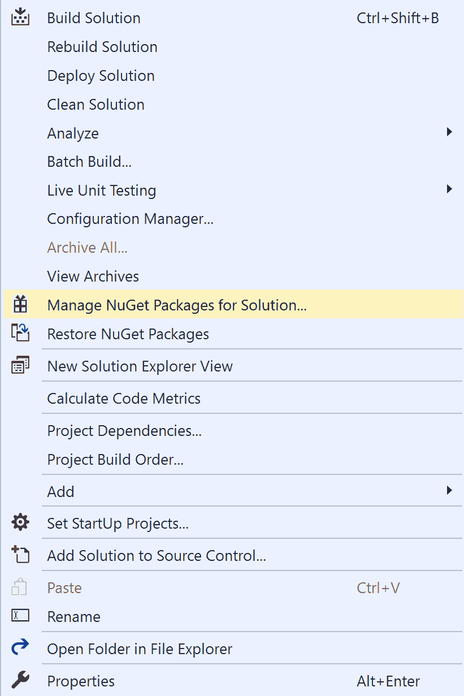
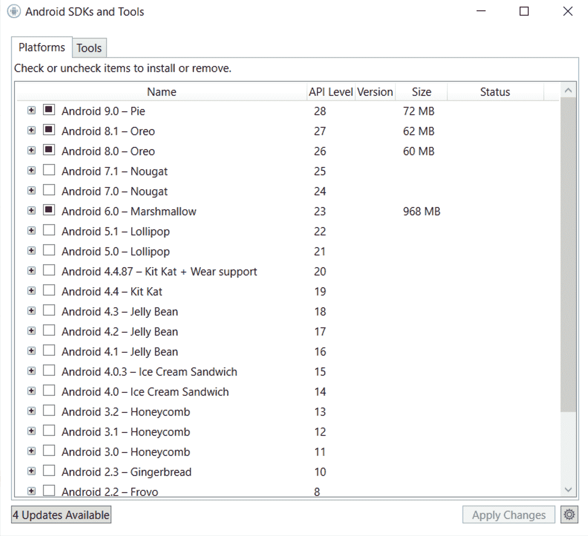
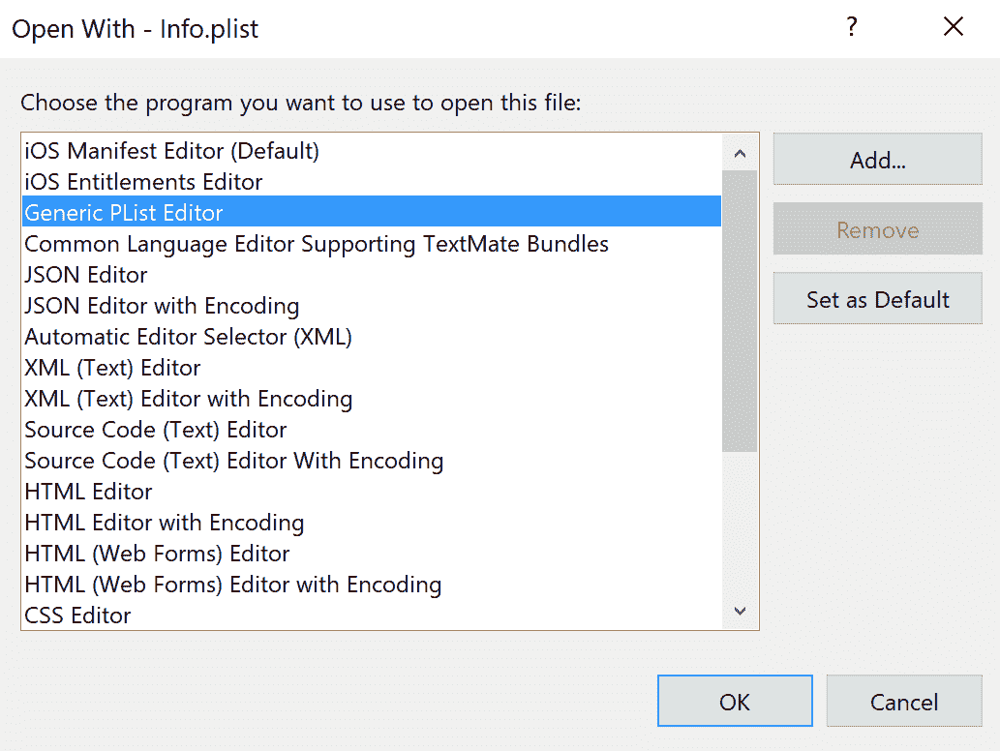
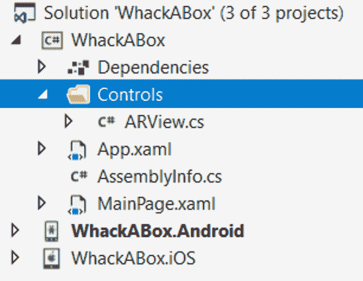
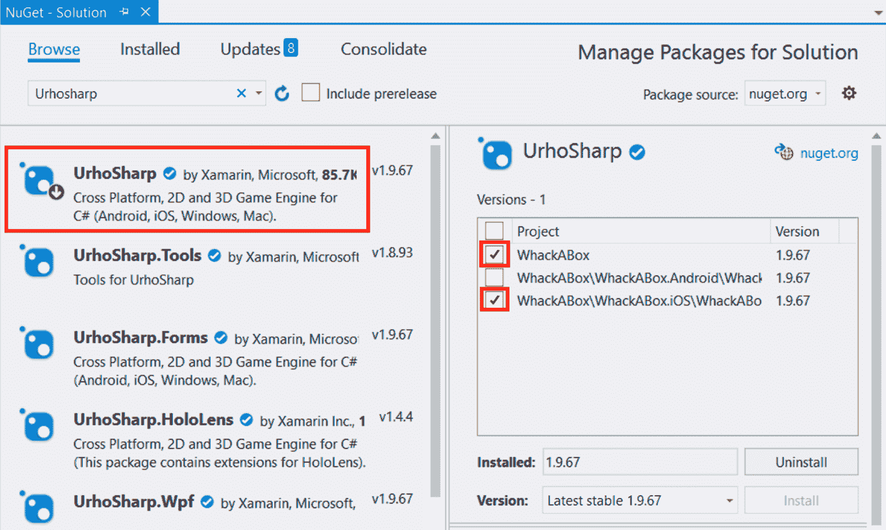
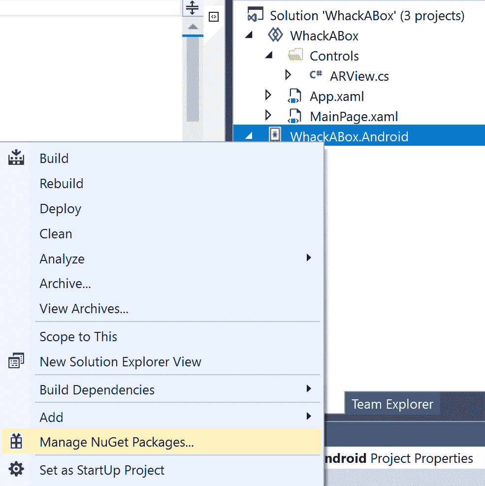

# 十、创建增强现实游戏

在本章中，我们将使用 Xamarin.Forms 探索**增强现实**（**AR**）。我们将使用自定义渲染器注入特定于平台的代码，**UrhoSharp**渲染场景并处理输入，`MessagingCenter`在应用中传递内部消息。

本章将介绍以下主题：

*   项目概况
*   建立项目
*   使用 ARKit
*   使用 ARCore
*   学习如何使用 UrhoSharp 渲染图形和处理输入
*   使用自定义渲染器注入特定于平台的代码
*   使用`MessagingCenter`发送消息

# 技术要求

要完成此项目，您需要安装 Visual Studio for Mac 或 PC 以及 Xamarin 组件。请参见[第 1 章](10.html)、*Xamarin 简介*，了解有关如何设置您的环境的更多详细信息。

您不能在模拟器上运行 AR。要运行 AR，您需要一个物理设备以及以下软件：

*   在 iOS 上，您需要 iOS 11 或更高版本，以及具有 A9 或更高处理器的设备。
*   在 Android 上，您需要 Android 9 和支持 ARCore 的设备。

# 基本理论

本节将介绍 AR 的工作原理。不同平台之间的实现略有不同。谷歌的实现名为**ARCore，**，苹果的实现名为**ARKit**。

AR 是将计算机图形叠加在摄像机馈送上。这听起来像是一件简单的事情，只是你必须非常精确地跟踪摄像机的位置。谷歌和苹果都编写了一些很棒的**应用编程接口**（**API**），借助手机中的运动传感器和摄像头中的数据，为您实现这一魔力。我们添加在相机馈送上的计算机图形将与周围的真实对象同步在同一坐标空间中，使它们看起来就像是您在手机上看到的图像的一部分。

# 项目概述

在本章中，我们将创建一个探索 AR 基本原理的游戏。我们还将学习如何在 Xamarin.Forms 中集成 AR 控制。Android 和 iOS 实现 AR 的方式不同，因此我们需要在此过程中统一平台。我们将使用开放源码的 3D 游戏引擎 UrhoSharp 来完成这项工作，它将为我们进行渲染。这只是由到**Urho3D**引擎的绑定组成，它允许我们将 Urho3D 与.NET 和 C# 一起使用。

游戏将在 AR 中渲染用户需要点击以使其消失的方框。然后，您可以通过学习 Urho3D 引擎来扩展游戏。

此项目的估计构建时间为 90 分钟。

# 建立项目

是时候开始编码了！但是，首先，请确保您已经设置了您的开发环境，如[第 1 章](10.html)、*Xamarin 简介*中所述。

本章将是一个经典的文件|新|项目章节，指导您逐步完成创建应用的过程。将不会有任何需要下载。

## 创建项目

按照以下几个步骤创建项目：

1.  打开 Visual Studio 并单击文件|新建|项目，如以下屏幕截图所示：


这将打开“创建新项目”向导。

2.  在搜索字段中输入`xamarin forms`，选择移动应用（Xamarin.Forms）模板，如下图所示，点击下一步：


3.  我们将在本项目中调用我们的应用`WhackABox`，所以让我们在项目名称字段中输入它，如下图所示，然后单击**创建**：


4.  接下来，我们选择一个项目模板。选择空白模板选项来创建最小的 XAMARIN。表单应用。
5.  取消选中平台标题下的 Windows（UWP）复选框，因为此应用将仅支持**iOS**和 Android。
6.  单击“确定”完成安装向导，然后让 Visual Studio 为您搭建项目。这可能需要几分钟。您可以在以下屏幕截图中看到需要选择的上述字段和选项：


就这样，应用已经创建。让我们继续将 Xamarin.Forms 更新到最新版本。

### 更新 Xamarin.Forms NuGet 包

目前，创建项目时使用的 Xamarin.Forms 版本很可能有点旧。为了纠正这个问题，我们需要更新 NuGet 包。请注意，您应该只更新 Xamarin.Forms 包，而不更新 Android 包；更新 Android 软件包可能会导致软件包彼此不同步，导致应用根本无法构建。要更新 NuGet 软件包，请执行以下步骤：

1.  在解决方案资源管理器中右键单击我们的解决方案。
2.  单击管理解决方案…的 NuGet 软件包，如以下屏幕截图所示：



这将在 Visual Studio 中打开 NuGet 软件包管理器，如以下屏幕截图所示：


要将 Xamarin.Forms 更新至最新版本，请执行以下步骤：

1.  单击更新选项卡。
2.  选中 Xamarin.Forms 复选框并单击更新。
3.  接受任何许可协议。

更新最多需要几分钟。查看输出窗格以查找有关更新的信息。在这一点上，我们可以运行应用，以确保它的工作。我们应该看到文本欢迎来到 Xamarin.Forms！在屏幕中央。

### 将 Android 目标框架版本设置为 9.0

ARCore 可从 Android 9.0 及更高版本获得。因此，我们将通过以下步骤验证 Android 项目的目标框架版本：

1.  在解决方案资源管理器中，双击 Android 项目下的 Properties 节点。
2.  验证目标框架版本是否至少为 Android 9.0（Pie），如以下屏幕截图所示：


如果目标框架名称旁边有星号，则需要通过以下步骤安装该**软件开发工具包**（**SDK**：

1.  在工具栏中找到 Android SDK 管理器。您也可以在菜单中的工具**Android******Android SDK 管理器**中找到它。**
***   单击突出显示的按钮打开 Android SDK 管理器，如以下屏幕截图所示：**

 **

这是系统上安装的所有 Android SDK 版本的控制中心。

3.  展开要安装的 SDK 版本。在我们的例子中，这至少应该是 Android 9.0-Pie。

4.  选择 Android SDK 平台<version number="">节点。您还可以选择 emulator 将使用哪些 emulator 映像来运行选定版本的 Android。</version>
5.  单击应用更改，如以下屏幕截图所示：



### 向 Android 添加摄像头权限

为了在 Android 中访问摄像头，我们必须在 Android 清单中添加所需的权限。这可以通过以下步骤完成：

1.  在解决方案资源管理器中，打开 Android 项目节点。
2.  双击 Properties 节点打开 Android 的属性。
3.  单击左侧的 Android 清单选项卡，向下滚动，直到看到所需的权限：部分。
4.  找到相机权限并选中该框。
5.  按*Ctrl*+*S*或文件保存文件，然后保存。您可以在以下屏幕截图中看到需要选择的上述字段和选项：


现在我们已经配置了 Android，在编写一些代码之前，我们只需要在 iOS 上做一个小改动。

### 为 iOS 添加摄像头使用说明

在 iOS 中，您需要指定为什么需要访问相机。方法是在 iOS 项目根文件夹的`Info.plist`文件中添加一个条目。`Info.plist`文件是一个**可扩展标记语言**（**XML**文件），您可以在任何文本编辑器中编辑该文件。但是，一种更简单的方法是使用 VisualStudio 提供的通用 PList 编辑器。

使用通用 PList 编辑器添加所需的摄影机使用说明，如下所示：

1.  定位`WhackABox.iOS`项目。
2.  右键点击`Info.plist`并点击打开…，如下图所示：


3.  选择通用 PList 编辑器并单击确定，如以下屏幕截图所示：



4.  找到属性列表底部的加号（+）图标。
5.  单击加号（+）图标以添加新键。确保密钥位于文档的根目录下，而不是位于其他属性下，如以下屏幕截图所示：


通用 PList 编辑器通过为正确的属性提供更友好的名称来帮助您找到它。让我们添加我们需要的值来描述为什么要使用相机，如下所示：

1.  在新创建的行上打开下拉菜单。
2.  选择隐私-摄像头使用说明。
3.  在右边的值字段中写一个好的理由，如下面的屏幕截图所示。原因字段是一个自由文本字段，因此请使用简单的英语描述您的应用需要访问摄像头的原因：


就这样。Android 和 iOS 的设置已经完成，我们现在可以专注于编写代码的有趣部分了！

You can also open the `Info.plist` file in any text editor, since it's an XML file. The key's name is `NSCameraUsageDescription`, and it must be added as a direct child of the root node.

## 定义用户界面

首先，我们将定义包装 AR 组件的**用户界面**（**UI**）。首先，我们将定义一个自定义控件，该控件将用作插入包含 AR 组件的`UrhoSurface`的占位符。然后，我们将把这个控件添加到一个网格中，该网格将包含一些统计信息，这些统计信息包括我们找到了多少个平面，以及世界上有多少个盒子处于活动状态。游戏的目标是用你的手机在 AR 中找到盒子，然后点击它们使它们消失。

让我们从定义自定义`ARView`控件开始。

### 创建 ARView 控件

`ARView`控件属于.NET 标准项目，因为它将是这两个应用的一部分。它是一个标准的 Xamarin.Forms 控件，直接从`Xamarin.Forms.View`继承。它不会加载任何**可扩展应用标记语言**（**XAML**）（因此它将只是一个类），也不会包含任何功能，除了简单定义之外，因此我们可以将其添加到主网格中。

转到 Visual Studio 并通过以下三个步骤创建一个`ARView`控件：

1.  在`WhackABox`项目中，添加一个名为`Controls`的文件夹。
2.  在`Controls`文件夹中，创建一个名为`ARView`的新类。
3.  将以下代码添加到`ARView`类中：

```cs
using Xamarin.Forms;

namespace WhackABox.Controls
{
    public class ARView : View
    {
    }
}
```

我们在这里创建的是一个简单的类，没有实现，它继承自`Xamarin.Forms.View`。这一点是为了为每个平台使用自定义渲染器，允许我们指定特定于平台的代码，插入到 XAML 代码中放置此控件的位置。您的项目现在应该如下所示：



`ARView`控制装置坐在那里不好。我们需要将其添加到`MainPage`XAML 代码中。

### 修改主页

我们将替换`MainPage`的全部内容，并添加对`WhackABox.Controls`名称空间的引用，以便使用`ARView`控件。让我们通过以下步骤进行设置：

1.  在`WhackABox`项目中，打开`MainPage.xaml`文件。
2.  编辑 XAML 代码，使其看起来像下面的代码。粗体的 XAML 表示必须添加的新元素：

```cs
<?xml version="1.0" encoding="utf-8"?>
<ContentPage  
           xmlns:x="http://schemas.microsoft.com/winfx/2009/xaml" 
           xmlns:local="clr-namespace:WhackABox" 
           xmlns:controls="clr-namespace:WhackABox.Controls"
           x:Class="WhackABox.MainPage">

<Grid>
 <Grid.ColumnDefinitions>
 <ColumnDefinition Width="*" />
 <ColumnDefinition Width="*" />
 </Grid.ColumnDefinitions>

 <Grid.RowDefinitions>
 <RowDefinition Height="100" />
 <RowDefinition Height="*" />
 </Grid.RowDefinitions>

 <StackLayout Grid.Row="0" Padding="10">
 <Label Text="Plane count" />
 <Label Text="0" FontSize="Large" 
             x:Name="planeCountLabel" />
 </StackLayout>

 <StackLayout Grid.Row="0" Grid.Column="1" Padding="10">
 <Label Text="Box count" />
 <Label Text="0" FontSize="Large" 
             x:Name="boxCountLabel"/>
 </StackLayout>

 <controls:ARView Grid.Row="1" Grid.ColumnSpan="2" />
</Grid>
</ContentPage>

```

现在我们有了代码，让我们一步一步地看一下，如下所示：

*   首先，我们定义一个指向代码中`WhackABox.Controls`名称空间的`controls`名称空间。这个名称空间在 XAML 的末尾用于定位`ARView`控件。
*   然后，我们通过将内容元素设置为`Grid`来定义它。一个页面只能有一个子页面，在本例中，该子页面是一个`Grid`。`Grid`定义了两列两行。这些列将`Grid`分为两个相等的部分，其中一行的顶部为`100`单元高，另一行占用其下方的所有可用空间。
*   我们使用最上面的两个单元格添加`StackLayout`的实例，其中包含游戏中飞机数量和盒子数量的信息。`StackLayout`实例在网格中的位置由`Grid.Row=".."`和`Grid.Column=".."`属性定义。请记住，行和列是从零开始的。实际上，您不必为行或列`0`添加属性，但有时这是一种很好的做法，可以提高代码的可读性。
*   最后，我们有`ARView`控件，它位于`1`行，但通过指定`Grid.ColumnSpan="2"`跨越两列。

下一步是安装 UrhoSharp，它将是我们的库，用于渲染图形以表示现实的增强部分。

## 添加 UrhoSharp

Urho 是一个开源的 3D 游戏引擎。UrhoSharp 是一个包含 iOS 和 Android 二进制文件绑定的包，使我们能够在.NET 中使用 Urho。这是一个非常有能力的软件，当我们在应用中渲染平面和长方体时，我们将只使用它的一小部分来完成繁重的工作。我们敦促您了解更多有关 UrhoSharp 的信息，以便在应用中添加您自己的酷炫功能。一个很好的起点是[https://github.com/xamarin/urho](https://github.com/xamarin/urho) 。

安装 UrhoSharp 只需为每个平台下载一个 NuGet 软件包。iOS 平台使用 UrhoSharp NuGet 包，Android 使用 UrhoSharp.ARCore 包。此外，在 Android 中，我们需要添加一些代码来连接生命周期事件，但我们将在稍后讨论。基本上，我们将在每个平台上设置一个`UrhoSurface`。我们将访问它以将节点添加到节点树中。这些节点将根据其类型和属性进行渲染。

然而，首先，我们需要安装软件包。

### 安装 iOS 和.NET 标准项目的 UrhoSharp NuGet 包

对于`WhackABox`和`WhackABox.iOS`项目，我们需要添加 UrhoSharp NuGet 包。这包含我们 AR 应用所需的一切。您可以按如下方式添加包：

1.  右键点击`WhackABox`解决方案。
2.  单击管理解决方案…的 NuGet 软件包，如以下屏幕截图所示：


3.  这将打开 NuGet Package Manager 窗口。单击窗口左上角的浏览链接。
4.  在搜索框中输入`Urhosharp`，点击*输入*。
5.  选择 UrhoSharp**包，勾选`WhackABox`项目和`WhackABox.iOS`项目，点击窗口右侧的安装，如下图所示：**

 **

`WhackABox`和`WhackABox.iOS`项目就是这样。安卓的设置有点复杂，因为它需要一个特殊的 UrhoSharp 包和一些代码来编写，以便将所有内容连接起来。

### 安装适用于 Android 的 UrhoSharp.ARCore NuGet 包

对于 Android，我们将添加 UrhoSharp.ARCore 包，其中包含对 ARCore 的扩展。它依赖于 UrhoSharp，因此我们不必专门添加该包。您可以添加**UrhoSharp.ARCore 包，如下所示：**

 **1.  右键点击`WhackABox.Android`项目。
2.  单击管理 NuGet 软件包…，如以下屏幕截图所示：



3.  这将打开 NuGet Package Manager 窗口。单击窗口左上角的浏览链接。
4.  在搜索框中输入`UrhoSharp.ARCore`，点击**输入。**

5.  选择 UrhoSharp.ARCore 软件包，然后单击窗口右侧的安装，如以下屏幕截图所示：


就是这样，您对 UrhoSharp 的所有依赖项都已安装在项目中。我们现在必须联系一些生命周期事件。

### 添加 Android 生命周期事件

在 Android 中，**Urho**需要了解一些特定事件，并能够相应地做出响应。我们还需要使用`MessagingCenter`添加一条内部消息，以便稍后在应用中对`OnResume`事件做出反应。当我们添加初始化 ARCore 的代码时，我们将看到这一点。但现在，添加 Android 事件所需的五个覆盖，如下所示：

1.  在 Android 项目中，打开`MainActivity.cs`。
2.  通过为`Urho.Droid`和`Xamarin.Forms`添加`using`语句，在`MainActivity`类的任意位置添加来自以下代码的五个覆盖，以及未解析的引用，如下代码块所示：

```cs
protected override void OnResume()
{
    base.OnResume();
    UrhoSurface.OnResume();

    MessagingCenter.Send(this, "OnResume");
}

protected override void OnPause()
{
    UrhoSurface.OnPause();
    base.OnPause();
}

protected override void OnDestroy()
{
    UrhoSurface.OnDestroy();
    base.OnDestroy();
}

public override void OnBackPressed()
{
    UrhoSurface.OnDestroy();
    Finish();
}

public override void OnLowMemory()
{
    UrhoSurface.OnLowMemory();
    base.OnLowMemory();
} 
```

这些事件一对一映射到内部 UrhoSharp 事件，除了调用`UrhoSharp.OnDestroy()`的`OnBackPressed`之外。这样做的原因是为了内存管理，以便 UrhoSharp 知道何时清理。

The `MessagingCenter` library is a built-in Xamarin.Forms pub/sub library for passing internal messages in an app. It has a dependency on Xamarin.Forms. We have created a library of our own called `TinyPubSub` that breaks this dependency and has a slightly easier API (as well as some additional features). You can check it out on GitHub at [https://github.com/TinyStuff/TinyPubSub](https://github.com/TinyStuff/TinyPubSub).

### 定义 PlaneNode 类

在`Urho`中，处理包含节点树的场景。节点可以是游戏中的任何东西，例如渲染器、声音播放器，或者只是子节点的占位符。

正如我们在前面讨论 AR 基础时所述，飞机是平台之间共享的公共实体。我们需要创建一个表示平面的公共基础，我们可以通过扩展`Urho`节点来实现。位置和旋转将由节点本身跟踪，但我们需要添加一个属性来跟踪平面的原点和大小，用 ARKit 和 ARCore 表示为平面的范围。

我们现在将添加这个类，并在每个平台上实现 AR 相关代码时使用它。执行此操作的代码非常简单，可以通过以下步骤进行设置：

1.  在`WhackABox`项目根目录中，创建一个名为`PlaneNode.cs`的新文件。
2.  添加类的以下实现：

```cs
using Urho;

namespace WhackABox
{
    public class PlaneNode :Node
    {
        public string PlaneId { get; set; }
        public float ExtentX { get; set; }
        public float ExtentZ { get; set; }
    }
} 
```

`PlaneId`属性将是一个标识符，允许我们跟踪此节点表示的平台特定平面。在 iOS 中，这将是一个字符串，而在 Android 中，这将是转换为字符串的平面对象的哈希代码。`ExtentY`和`ExtentZ`属性表示平面的大小，单位为米。我们现在已经准备好开始创建游戏逻辑，并将我们的应用连接到 AR SDK。

### 为 ARView 控件添加自定义渲染器

自定义渲染器是将特定于平台的行为扩展到自定义控件的一种非常智能的方法。它们还可用于覆盖已定义控件上的行为。事实上，Xamarin.Forms 中的所有控件都使用渲染器将 Xamarin.Forms 控件转换为特定于平台的控件。

我们将创建两个渲染器，一个用于 iOS，一个用于 Android，用于初始化我们要渲染的`UrhoSurface`。`UrhoSurface`的实例化在每个平台上都不同，这就是为什么我们需要两种不同的实现。

#### 对于 iOS

自定义渲染器是从另一个渲染器继承的类。它允许我们为重要事件添加自定义代码，例如在解析 XAML 文件时创建 XAML 中的元素。由于`ARView`控件继承自`View`，我们将使用`ViewRenderer`作为基类。让我们通过以下步骤创建`ARViewRenderer`类：

1.  在`WhackABox.iOS`项目中，创建一个名为`Renderers`的文件夹。
2.  在该文件夹中，添加一个名为`ARViewRenderer`的新类。
3.  将以下代码添加到类中：

```cs
using System.Threading.Tasks;
using Urho.iOS;
using WhackABox.Controls;
using WhackABox.iOS.Renderers;using Xamarin.Forms;
using Xamarin.Forms.Platform.iOS;

 [assembly: ExportRenderer(typeof(ARView), typeof(ARViewRenderer))]

 namespace WhackABox.iOS.Renderers
{
    public class ARViewRenderer : ViewRenderer<ARView, UrhoSurface>
    {
          protected async override void 
          OnElementChanged(ElementChangedEventArgs<ARView> e)
        {
            base.OnElementChanged(e);

            if (Control == null)
            {
                await Initialize();
            }
         }

         private async Task Initialize()
         {
             var surface = new UrhoSurface();
             SetNativeControl(surface);
             await surface.Show<Game>();
         }
     }
}
```

`ExportRenderer`属性将此呈现程序注册到 Xamarin.Forms，以便它知道在解析（或编译）一个`ARView`元素时，它应该使用这个特定的呈现程序来呈现它。它有两个参数：第一个参数是我们要向其注册渲染器的控件，第二个参数是渲染器的类型。此属性必须放置在命名空间声明之外。

`ARViewRenderer`类继承了`ViewRenderer<ARView, UrhoSurface>`。这将指定为哪个控件创建此渲染器以及应该渲染哪个本机控件。在这种情况下，`ARView`元素将在本机上被一个`UrhoSurface`控件替换，该控件本身是一个 iOS 特定的`UIView`。

我们重写了`ARView`元素每次更改时调用的`OnElementChanged()`方法，无论是在创建还是替换时。然后我们可以检查是否设置了`Control`属性。该控件是`UrhoSurface`类型，因为我们在类定义中声明了它。如果它是`null`，那么我们调用`Initialize()`来创建它。

创作很简单。我们只需创建一个新的`UrhoSurface`控件，并将本机控件设置为这个新创建的对象。然后我们调用`Show<Game>()`方法，通过指定哪个类代表我们的`Urho`游戏来启动游戏。请注意，`Game`类尚未定义，但很快就会定义，就在我们为 Android 创建自定义渲染器之后。

#### 对于 Android

Android 的自定义渲染器与 iOS 的功能相同，但需要检查权限。让我们通过以下步骤为 Android 创建`ARViewRenderer`类：

1.  在`WhackABox.Droid`项目中，创建一个名为`Renderers`的文件夹。
2.  在该文件夹中，添加一个名为`ARViewRenderer`的新类。
3.  将以下代码添加到类中：

```cs
 using System.Threading.Tasks;
 using Android;
 using Android.App;
 using Android.Content;
 using Android.Content.PM;
 using Android.Support.V4.App;
 using Android.Support.V4.Content;
 using WhackABox.Droid.Renderers;
 using WhackABox;
 using WhackABox.Controls;
 using WhackABox.Droid;
 using Urho.Droid;
 using Xamarin.Forms;
 using Xamarin.Forms.Platform.Android;

  [assembly: ExportRenderer(typeof(ARView), 
  typeof(ARViewRenderer))]
  namespace WhackABox.Droid.Renderers
 {
     public class ARViewRenderer : ViewRenderer<ARView,  
     Android.Views.View>
     {
         private UrhoSurfacePlaceholder surface;
         public ARViewRenderer(Context context) : base(context)
         {
             MessagingCenter.Subscribe<MainActivity>(this,  
             "OnResume", async (sender) =>
             {
                 await Initialize();
             });
         }

         protected async override void 
         OnElementChanged(ElementChangedEventArgs<ARView> e)
         {
             base.OnElementChanged(e);

             if (Control == null)
             {
                 await Initialize();
             }
         }

         private async Task Initialize()
         {
             if (ContextCompat.CheckSelfPermission(Context, 
                 Manifest.Permission.Camera) != Permission.Granted)
             {
                 ActivityCompat.RequestPermissions(Context as  
                 Activity, new[] { Manifest.Permission.Camera },  
                 42);
                 return;
             }

             if (surface != null)
                 return;

             surface = UrhoSurface.CreateSurface(Context as 
             Activity);
             SetNativeControl(surface);

             await surface.Show<Game>();
         }
     }
 }

```

此自定义渲染器还继承自`ViewRenderer<T1, T2>`，其中第一种类型是渲染器本身的类型，第二种类型是渲染器将生成的本机控件。在这种情况下，本机控件将是从`Android.Views.View`继承的控件。渲染器创建一个`UrhoSurfacePlaceholder`实例，并将其指定为本机控件。`UrhoSurfacePlaceholder`是一个类，它封装了`Urho`在 Android 上用于访问媒体功能的**简单 DirectMedia 层**（**SDL**库）的一些功能。它做的最后一件事是基于即将存在的`Game`**类启动游戏。我们将在本章的下一节中对此进行定义。**

 **## 创建游戏

要编写使用`Urho`的应用，我们需要创建一个继承自`Urho.Application`的类。这个类定义了一些虚拟方法，我们可以使用它们来设置场景。我们将使用的方法是`Start()`。然而，在此之前，我们需要创建类。我们将在`WhackABox`项目中将其创建为一个抽象类，并在每个平台项目中将其用作基类。

### 添加共享抽象游戏类

我们首先创建包含共享代码的`Game.cs`文件。让我们通过以下步骤进行设置：

1.  在`WhackABox`项目中，在项目根目录中创建一个名为`Game.cs`的新文件。
2.  将以下代码添加到类中：

```cs
using System;
using System.Linq;
using Urho;
using Urho.Shapes;

namespace WhackABox
{
    public abstract class Game : Application
    {
        protected Scene scene; 

        public Game(ApplicationOptions options) : base(options)
        {
        } 
    }
}
```

`Game`继承自`Urho.Application`，后者将完成游戏本身的大部分工作。我们定义了一个名为`scene`的属性，属于`Scene`**类型。`Urho`中的`Scene`代表游戏的一个屏幕（例如，我们可以为游戏的不同部分或菜单设置不同的场景）。在这个游戏中，我们将只定义一个场景，稍后将对其进行初始化。`scene`维护组成它的节点层次结构，每个节点可以有任意数量的子节点和任意数量的组件。是组件完成了这项工作。例如，稍后我们将渲染长方体，该长方体将由一个连接有`Box`组件的节点表示。**

 **`Game`类本身是从我们在前面部分中定义的自定义呈现器实例化的，它将`ApplicationOptions`实例作为构造函数中的参数。这需要传递给基类。我们现在需要编写一些特定于 AR 的方法，这些方法将由我们稍后编写的代码使用。

#### 初始化

我们需要为 iOS 和 Android 提供一个共同的入口点。由于 ARKit 和 ARCore 的初始化是特定于平台的，因此我们将简单地定义一个抽象方法，每个平台都可以覆盖该方法。您可以按照以下步骤执行此操作：

1.  在`WhackABox`项目中，打开`Game.cs`类。
2.  将以下`InitializeAR()`方法添加到类中：

```cs
protected abstract void InitializeAR();
```

由于类本身是抽象的，我们也可以将方法定义为抽象的。这意味着该方法必须由继承自`Game`类的任何类实现。

#### 创建子平面

第二种方法是`CreateSubPlane()`方法。当应用找到可以放置对象的平面时，它将创建一个节点。我们将很快专门为每个平台编写代码。该节点还定义了一个子平面，用于定位长方体，表示该平面的位置和大小。我们在本章前面已经定义了`PlaneNode`类。

让我们通过以下步骤添加代码：

1.  在`WhackABox`项目中，打开`Game.cs`类。
2.  将以下`CreateSubPlane()`方法添加到类中：

```cs
protected void CreateSubPlane(PlaneNode planeNode)
{
    var node = planeNode.CreateChild("subplane");
    node.Position = new Vector3(0, 0.05f, 0);

    var box = node.CreateComponent<Box>();
    box.Color = Color.FromHex("# 22ff0000");
} 
```

任何继承自**`Urho.Node`**的类，如`PlaneNode`都有`CreateChild()`方法。这允许我们创建一个子节点并指定该节点的名称。稍后将使用该名称查找要对其执行操作的特定子级。我们将节点定位在与父节点相同的位置，只是将其升高到平面上方`0.05`米（5 厘米）。

为了查看平面，我们添加了一个半透明红色的`box`组件。`box`是通过调用节点上的`CreateComponent()`创建的组件。颜色是使用 AARGGBB 图案定义的，其中 AA 是 alpha 分量（透明度），RRGGBB 是标准的红-绿-蓝格式。我们使用十六进制表示颜色。

#### 更新子平面

ARKit 和 ARCore 都在不断更新平面。我们感兴趣的是子平面位置和范围的变化。从广义上讲，我们指的是飞机的大小。让我们通过以下步骤进行设置：

1.  在`WhackABox`项目中，打开`Game.cs`类。
2.  在`Game.cs`类的任意代码中添加`UpdateSubPlane()`方法，如下代码片段所示：

```cs
protected void UpdateSubPlane(PlaneNode planeNode, Vector3 position)
{
    var subPlaneNode = planeNode.GetChild("subplane");
    subPlaneNode.Scale = new Vector3(planeNode.ExtentX, 0.05f, 
    planeNode.ExtentZ);
    subPlaneNode.Position = position;
}
```

该方法使用我们想要更新的`PlaneNode`实例，以及它的新位置。我们通过查询当前节点中任何名为`"subplane"`的节点来定位子平面。记住，我们在`AddSubPlane()`方法中命名了子平面。现在，我们可以通过名称轻松访问节点。我们通过从`PlaneNode`中获取`ExtentX`和`ExtentZ`属性来更新子平面节点的比例。在我们调用`UpdateSubPlane()`之前，`PlaneNode`实例会被一些特定于平台的代码更新。最后，我们将子平面的位置设置为传递的`position` 参数。

#### FindNodeByPlaneId

我们需要一种快速查找节点的方法。ARKit 和 ARCore 都对其平面进行内部跟踪，为了将这些平面的内部表示映射到我们的`PlaneNode`，我们必须在创建平面时为其指定一个自定义 ID。这将在平台特定的代码中完成，但我们仍然可以编写函数来查询场景中的`PlaneNode`。

`planeId`参数是`string`，因为 ARKit 以类似于**全局唯一标识符**（**GUID**的形式定义平面 ID。GUID 是十六进制数字的结构化序列，可以用`string`格式表示。让我们添加一个方法，该方法将使用此 ID 查找我们正在查找的节点，如下所示：

1.  在`WhackABox`项目中，打开`Game.cs`类。
2.  在`Game.cs`类的任意代码中添加`FindNodeByPlaneId()`方法，如下代码片段所示：

```cs
protected PlaneNode FindNodeByPlaneId(string planeId)
{
    return scene.Children.OfType<PlaneNode>().FirstOrDefault(e => 
    e.PlaneId == planeId);
}
```

该方法使用`Linq`查询场景，并使用给定的平面 ID 查找第一个子对象。如果找不到，则返回`null`，因为`null`是引用类型对象的默认值。

这些都是我们在进入 ARKit 和 ARCore 之前在共享代码中需要的方法。

### 添加特定于平台的类

现在是添加特定于平台的代码的时候了。我们将创建两个类，一个用于 iOS，一个用于 Android，它们将从抽象的`Game`类继承。

在本节中，我们将简单地为这些文件设置框架代码。

#### 添加 iOS 特定类

我们先在 iOS 上为`Game`创建类，如下所示：

1.  在`WhackABox.iOS`项目根目录中，添加一个名为`Game.cs`的新文件。
2.  将代码添加到类中，如以下代码段所示：

```cs
using Urho;

namespace WhackABox.iOS
{
    public class Game : WhackABox.Game
    {
        public Game(ApplicationOptions options) : base(options)
        {
        }
    }
}
```

由于抽象基类需要调用构造函数，因此我们需要将该构造函数扩展到特定于平台的类中。现在，让我们对 Android 做同样的事情。

#### 添加特定于 Android 的类

Android 也是如此：只有名称空间发生了变化。让我们通过以下步骤进行设置：

1.  在`WhackABox.Android`项目中，添加一个名为`Game.cs`的新文件。
2.  添加代码，如以下代码段所示：

```cs
using Urho;

namespace WhackABox.Droid
{
    public class Game : WhackABox.Game
    {
        public Game(ApplicationOptions options) : base(options)
        {
        }
    }
}
```

如您所见，除了名称空间之外，它与 iOS 代码相同。现在让我们开始添加一些特定于平台的代码。

## 编写特定于 ARKit 的代码

在本节中，我们将为 iOS 编写特定于平台的代码，这些代码将初始化 ARKit，查找平面，并为 UrhoSharp 创建要在屏幕上渲染的节点。我们将利用在 iOS 中封装 ARKit 的`Urho`组件。我们还将编写所有将定位、添加和删除节点的函数。ARKit 使用锚定，锚定充当虚拟点，将叠加的图形粘合到真实世界。我们特别寻找`ARPlaneAnchor`，它代表 AR 世界中的一个平面。有其他类型的锚可用，但对于这个应用，我们只需要找到水平面。

我们先定义`ARKitComponent`字段，以便以后使用。

### 定义 ARKitComponent

我们首先将一个`private`字段添加到一个`ARKitComponent`字段，该字段稍后将被初始化。让我们通过以下步骤进行设置：

1.  在`WhackABox.iOS`项目中，打开`Game.cs`。
2.  添加一个包含`ARKitComponent`的`private`字段，如下代码块中粗体显示：

```cs
using System.Linq;
using ARKit;
using Urho;
using Urho.iOS;

namespace WhackABox.iOS
{
    public class Game : WhackABox.Game
    {
        protected ARKitComponent arkitComponent;

        public Game(ApplicationOptions options) : base(options)
        {
        }
    }
}
```

确保您添加了所有的`using`语句，以确保我们以后使用的所有代码都解析了正确的类型。

### 编写用于添加和更新锚的处理程序

现在我们将添加必要的代码来添加和更新锚。我们还将添加一些方法，以帮助在 ARKit 更新锚之后设置节点的方向。

#### 坐位

`SetPositionAndRotation()`方法将由`Add`和`Update`锚使用，因此我们需要在为 ARKit 引发的事件创建处理程序之前定义它。让我们通过以下步骤进行设置：

1.  在`WhackABox.iOS`项目中，打开`Game.cs`文件。
2.  将`SetPositionAndRotation()`方法添加到类中，如下代码块所示：

```cs
private void SetPositionAndRotation(ARPlaneAnchor anchor, PlaneNode 
                                    node)
{
     arkitComponent.ApplyOpenTkTransform(node, anchor.Transform, 
                                         true);

     node.ExtentX = anchor.Extent.X;
     node.ExtentZ = anchor.Extent.Z;

     var position = new Vector3(anchor.Center.X, anchor.Center.Y, -
                                anchor.Center.Z);
     UpdateSubPlane(node, position);
} 
```

该方法采用两个参数。第一个是 ARKit 定义的`ARPlaneAnchor`对象，第二个是场景中的`PlaneNode`实例。该方法的目的是确保`PlaneNode`与 ARKit 传递的`ARPlaneAnchor`对象同步。`arkitComponent`对象有一个名为`ApplyOpenTkTransform()`的辅助方法，将`ARPlaneAnchor`对象的位置和旋转转换为`Urho`使用的位置和旋转对象。然后我们将飞机的`Extent`（大小）更新为`PlaneNode`，并从`ARPlaneAnchor`获取`anchor`中心位置。最后，我们调用前面定义的方法来更新包含`Box`组件的子平面节点，该组件将实际渲染平面为半透明的红色框。

我们还需要一个方法来处理更新和添加功能。

#### 更新 RaddPlaneNode

`UpdateOrAddPlaneNode()`方法的作用与名称的含义完全相同：它将`ARPlaneAnchor`作为参数，更新或向`scene`添加一个新的`PlaneNode`实例。让我们通过以下步骤进行设置：

1.  在`WhackABox.iOS`项目中，打开`Game.cs`文件。
2.  添加`UpdateOrAddPlaneNode()`方法，如下代码块所示：

```cs
private void UpdateOrAddPlaneNode(ARPlaneAnchor anchor)
{
    var node = FindNodeByPlaneId(anchor.Identifier.ToString());

    if (node == null)
    {
        node = new PlaneNode()
        {
            PlaneId = anchor.Identifier.ToString(),
            Name = $"plane{anchor.GetHashCode()}"
        };

        CreateSubPlane(node);
        scene.AddChild(node);
    }

    SetPositionAndRotation(anchor, node);
} 
```

场景中已经存在节点，或者需要添加节点。第一行代码调用`FindNodeByPlaneId()`方法查询场景中具有给定`PlaneId`的对象。对于 iOS，我们使用`anchor.Identifier`属性跟踪 iOS 定义的平面。如果此调用返回`null`，则表示该平面不在场景中，我们需要创建它。为此，我们实例化了一个新的`PlaneNode`实例，为它提供了一个`PlaneId`和一个用户友好的名称，以便进行调试。然后，我们通过调用`CreateSubPlane()`（我们之前定义的）并将节点添加到`scene`来创建子平面以可视化平面本身。最后，我们更新位置和旋转。我们对`UpdateOrAddPlaneNode()`方法的每次调用都这样做，因为它对新节点和现有节点都是相同的。现在是时候编写我们最终将直接连接到 ARKit 的处理程序了。

#### 奥纳丹彻

让我们添加一些代码。`OnAddAnchor()`方法将在 ARKit 每次更新其锚定集合时调用，这些锚定集合描述了我们将用于在虚拟世界中关联的点。我们专门寻找`ARPlaneAnchor`型锚。

通过以下两个步骤将`OnAddAnchor()(`方法添加到`Game.cs`类中：

1.  在`WhackABox.iOS`项目中，打开`Game.cs`文件。
2.  在类中的任意位置添加`OnAddAnchor()`方法，如下代码段所示：

```cs
private void OnAddAnchor(ARAnchor[] anchors)
{
    foreach (var anchor in anchors.OfType<ARPlaneAnchor>())
    {
        UpdateOrAddPlaneNode(anchor);
    }
}
```

该方法以一个数组`ARAnchors`为参数。我们过滤掉`ARPlaneAnchor`类型的锚，并遍历列表。对于每个`ARPlaneAnchor`对象，我们调用前面创建的`UpdateOrAddPlaneNode()`方法向场景中添加节点。现在，让我们在 ARKit 想要更新锚时执行相同的操作。

#### OnUpdateAnchors

每次 ARKit 收到关于锚的新信息时，它都会调用此方法。我们的操作与前面代码相同，并遍历列表以更新场景中`anchor`对象的范围和位置，如下所示：

1.  在`WhackABox.iOS`项目中，打开`Game.cs`文件。
2.  在类中的任意位置添加`OnUpdateAnchors()`方法，如下代码段所示：

```cs
private void OnUpdateAnchors(ARAnchor[] anchors)
{
    foreach (var anchor in anchors.OfType<ARPlaneAnchor>())
    {
        UpdateOrAddPlaneNode(anchor);
    }
}
```

该代码是`OnAddAnchors()`方法的副本。它根据 ARKit 提供的信息更新场景中的所有节点。

我们还需要编写一些代码来删除 ARKit 已删除的锚。

### 编写用于移除锚的处理程序

当 ARKit 确定某个锚点无效时，它会将其从场景中移除。这种情况并不经常发生，但无论如何处理这个电话都是一个很好的做法。

#### 安瑞姆安彻斯酒店

让我们通过以下步骤添加一个方法来处理删除`ARPlaneAnchor`对象：

1.  在`WhackABox.iOS`项目中，打开`Game.cs`文件。
2.  在类中的任意位置添加`OnRemoveAnchors()`方法，如下代码段所示：

```cs
private void OnRemoveAnchors(ARAnchor[] anchors)
{
 foreach (var anchor in anchors.OfType<ARPlaneAnchor>())
 {
 FindNodeByPlaneId(anchor.Identifier.ToString())?.Remove();
 }
} 
```

与`Add`和`Remove`函数一样，此方法接受一个`ARAnchor`数组。我们遍历这个数组，寻找`ARPlaneAnchor`类型的锚。然后，我们通过调用`FindNodeByPlaneId()`方法来寻找表示该平面的节点。如果不是`null`，则我们要求删除该节点。注意`Remove()`调用前的 null check 运算符。

### 初始化 ARKit

现在，我们来到了 iOS 特定代码的最后一部分，我们在这里初始化它。此方法称为`InitializeAR()`，不带参数。它在`Game`基类中定义为抽象方法，必须由 iOS 项目中定义的`Game`类实现。

初始化 ARKit 的代码很简单，`ARKitComponent`类为我们做了很多工作。让我们通过以下步骤进行设置：

1.  在`WhackABox.iOS`项目中，打开`Game.cs`文件。
2.  在类的任意位置添加`InitializeAR()`方法，如下代码块所示：

```cs
protected override void InitializeAR()
{
    arkitComponent = scene.CreateComponent<ARKitComponent>();
    arkitComponent.Orientation = 
    UIKit.UIInterfaceOrientation.Portrait;
    arkitComponent.ARConfiguration = new 
    ARWorldTrackingConfiguration
    {
        PlaneDetection = ARPlaneDetection.Horizontal
    };
    arkitComponent.DidAddAnchors += OnAddAnchor;
    arkitComponent.DidUpdateAnchors += OnUpdateAnchors;
    arkitComponent.DidRemoveAnchors += OnRemoveAnchors;
    arkitComponent.RunEngineFramesInARKitCallbakcs = 
    Options.DelayedStart;
    arkitComponent.Run();
} 
```

代码首先创建一个`ARKitComponent`类。然后我们设置允许的方向并创建一个`ARWorldTrackingConfiguration`类，该类声明我们只对水平面感兴趣。为了响应平面的添加、更新和删除，我们附加了前面创建的事件处理程序。

我们指示`ARKitComponent`延迟调用回调，以允许 ARKit 正确初始化。注意`RunEngineFramesInARKitCallbakcs`属性中的拼写错误。这是一个很好的例子，说明了为什么需要对代码进行检查，因为在不破坏向后兼容性的情况下很难更改此名称。命名很难。

最后一件事是告诉 ARKit 开始跑步。我们通过调用`arkitComponent.Run()`方法来实现这一点。

## 编写特定于 ARCore 的代码

现在是时候用 ARCore 为 Android 做同样的事情了。就像 iOS 一样，我们将把所有 Android 特定的代码放在它自己的文件中。这是我们之前创建的 Android 项目中的`Game.cs`文件。

### 定义 Arcore 组件

首先，我们将添加一个字段来存储对`ARCoreComponent`实例的引用。这就结束了与 ARCore 的大部分交互。`ARCoreComponent`是在我们在本章开头安装的 UrhoSharp.ARCore NuGet 包中定义的。

让我们通过以下步骤添加一些`using`语句和`arCore`私有字段：

1.  在`WhackABox.Droid`项目中，打开`Game.cs`文件。
2.  添加`arCore`**私有字段，并确保在以下代码块中添加以粗体标记的`using`语句：**

```cs
using Com.Google.AR.Core;
using Urho;
using Urho.Droid;

namespace WhackABox.Droid
{
    public class Game : WhackABox.Game
    {
        public Game(ApplicationOptions options) : base(options)
        {
        }

        private ARCoreComponent arCore;
    }
} 
```

`using`语句将允许我们解析此文件中需要的类型，`arCore`属性将是我们想要访问 ARCore 函数时的简写。

我们将继续为此类添加一些方法。

### 坐位

每当检测到或更新飞机时，我们需要添加或更新一个`PlaneNode`。`SetPositionAndRotation()`方法更新传递的`PlaneNode`并根据`AR.Core.Plane`对象的内容设置该节点的属性。让我们通过以下步骤进行设置：

1.  在`WhackABox.Droid`项目中，打开`Game.cs`文件。
2.  将`SetPositionAndRotation()`方法添加到类中，如下代码块所示：

```cs
private void SetPositionAndRotation(Com.Google.AR.Core.Plane plane,  
                                    PlaneNode node)
{
    node.ExtentX = plane.ExtentX;
    node.ExtentZ = plane.ExtentZ;
    node.Rotation = new Quaternion(plane.CenterPose.Qx(),
                                   plane.CenterPose.Qy(),
                                   plane.CenterPose.Qz(),
                                   -plane.CenterPose.Qw());

    node.Position = new Vector3(plane.CenterPose.Tx(),
                                plane.CenterPose.Ty(),
                                -plane.CenterPose.Tz());
}
```

前面的代码更新节点的平面范围并创建旋转`Quaternion`。如果你不知道`Quaternion`旋转是什么，不要担心。很少有人会这样做，但他们似乎神奇地以非常灵活的方式掌握了模型的旋转信息。`plane.CenterPose`属性是保存平面位置和方向的矩阵。最后，我们从`CenterPose`属性更新节点的位置。

下一步是创建一个处理来自 ARCore 的帧更新的方法。

### 为 ARFrame 更新编写处理程序

Android 处理 ARCore 更新的方式与 ARKit 稍有不同，ARKit 为添加、更新和删除的节点公开了三种不同的事件。在使用 ARCore 时，每当发生任何更改时都会调用这些事件，我们将添加处理程序来处理这些事件。

让我们通过以下步骤添加该方法：

1.  在`WhackABox.Droid`项目中，打开`Game.cs`文件。
2.  在类的任意位置添加`OnARFrameUpdated()`方法，如下代码块所示：

```cs
private void OnARFrameUpdated(Frame arFrame)
{
    var all = arCore.Session.GetAllTrackables(
                  Java.Lang.Class.FromType(
                  typeof(Com.Google.AR.Core.Plane)));

    foreach (Com.Google.AR.Core.Plane plane in all)
    {
        var node = 
        FindNodeByPlaneId(plane.GetHashCode().ToString());

        if (node == null)
        {
            node = new PlaneNode
            {
                PlaneId = plane.GetHashCode().ToString(),
                Name = $"plane{plane.GetHashCode()}"
            };

            CreateSubPlane(node);
            scene.AddChild(node);
        }

        SetPositionAndRotation(plane, node);
        UpdateSubPlane(node, Vector3.Zero);
    }
} 
```

我们首先查询`arCore`组件，查找它跟踪的所有平面。然后，我们迭代这个列表，通过调用`FindNodeByPlaneId()`方法，使用平面的哈希代码作为标识符，查看场景中是否有任何节点。如果找不到，我们将创建一个新的`PlaneNode`并将哈希代码指定为`PlaneId`。然后，我们创建一个子平面，其中包含`Box`组件以可视化该平面，最后，我们将其添加到场景中。然后更新平面的位置和旋转，并调用更新子平面。现在我们已经编写了处理程序，我们需要连接它。

### 初始化弧心

为了初始化 ARCore，我们将添加两个方法。第一种方法是负责 ARCore 配置的方法，称为`OnConfigRequested()`。第二个是稍后将从共享的`Game`类调用的`InitializeAR()`方法。

#### 未配置的

ARCore 需要知道一些事情，就像 iOS 一样。在 Android 中，这是通过定义 ARCore 组件将在初始化时调用的方法来实现的。要创建方法，请执行以下步骤：

1.  在`WhackABox.Droid`项目中，打开`Game.cs`文件。
2.  在类中的任意位置添加`OnConfigRequested()`方法，如下代码段所示：

```cs
private void OnConfigRequested(Config config)
{
    config.SetPlaneFindingMode(Config.PlaneFindingMode.Horizontal);
    config.SetLightEstimationMode(Config.LightEstimationMode.AmbientIntensity);
    config.SetUpdateMode(Config.UpdateMode.LatestCameraImage);
} 
```

该方法采用一个`Config`对象，该对象将存储您在此方法中进行的任何配置。首先，我们设置要查找的飞机类型。我们对这个游戏的`Horizontal`飞机感兴趣。我们定义了我们想要使用的光照估计模式的种类，最后，我们选择了我们想要的更新模式。在这种情况下，我们希望使用可用的最新相机图像。您可以在配置期间进行许多微调，但这超出了本书的范围。请务必查看 ARCore 的文档，以了解有关其强大功能的更多信息。

我们现在拥有初始化 ARCore 所需的所有代码。

#### 初始化

如前所述，`InitializeAR()`方法是在抽象基类中定义的。现在，我们将通过覆盖 Android 来实现它，如下所示：

1.  在`WhackABox.Droid`项目中，打开`Game.cs`文件。
2.  在类中的任意位置添加`InitializeAR()`方法，如下代码段所示：

```cs
protected override void InitializeAR()
{
    arCore = scene.CreateComponent<ARCoreComponent>();
    arCore.ARFrameUpdated += OnARFrameUpdated;
    arCore.ConfigRequested += OnConfigRequested;
    arCore.Run();
} 
```

第一步是创建 UrhoSharp 提供的`ARCoreComponent`。此组件封装了本机 ARCore 类的初始化。然后，我们添加两个事件处理程序：一个用于处理帧更新，另一个将在初始化期间调用。我们做的最后一件事是调用`ARCoreComponent`上的`Run()`方法开始跟踪世界。

现在我们已经配置了 ARKit 和 ARCore 并准备就绪，是时候编写实际的游戏了。

## 编写游戏

在本节中，我们将通过设置摄影机、照明和渲染器来初始化`Urho`。所有剩余的代码现在都将在`WhackABox`项目（.NET 标准库项目）的抽象`Game`类中编写。摄影机是确定对象渲染位置的对象。AR 组件负责更新相机的位置，以虚拟跟踪您的手机，从而使我们渲染的任何对象都与您所看到的对象处于相同的坐标空间。首先，我们需要一个相机，它将成为场景的观察点。

### 添加照相机

添加相机是一个简单的过程，如以下步骤所示：

1.  在`WhackABox`项目中，打开`Game.cs`文件。
2.  将`camera`属性添加到类中，如下面的代码段所示。一个好的做法是将它放在班级声明之后。

3.  在类中的任意位置添加`InitializeCamera()`方法，如下代码段所示：

```cs
private Camera camera; 

private void InitializeCamera()
{
    var cameraNode = scene.CreateChild("Camera");
    camera = cameraNode.CreateComponent<Camera>();
} 
```

在 UrhoSharp 中，一切都是一个节点，就像一切都是统一体中的`GameObject`，包括`camera`对象。我们创建一个新的节点，我们称之为`camera`，然后在该节点上创建一个`Camera`组件，并保留对它的引用以供以后使用。

### 配置渲染器

UrhoSharp 需要将场景渲染为`viewport`。基于多个摄像头，游戏可以有多个视口。想象一个你开车的游戏。从车手的角度来看，主要的`viewport`将是游戏。另一个`viewport`可能是后视镜，它实际上是摄像机本身，将他们看到的东西呈现在主`viewport`上。让我们通过以下步骤进行设置：

1.  在`WhackABox`项目中，打开`Game.cs`文件。
2.  将`viewport`属性添加到类中，如下面的代码段所示。一个好的实践是将它放在类本身声明之后，但是将它放在类中的任何位置都会起作用。
3.  在类中的任意位置添加`InitializeRenderer()`方法，如下代码段所示：

```cs
private Viewport viewport; 

private void InitializeRenderer()
{
    viewport = new Viewport(Context, scene, camera, null);
    Renderer.SetViewport(0, viewport);
}
```

`viewport`属性将保存对`viewport`的引用，以供以后使用。`viewport`是通过实例化一个新的`Viewport`类创建的。该类的构造函数需要基类提供的一个`Context`、我们在初始化游戏时将创建的`scene`、一个知道从空间中的哪个点进行渲染的摄影机，以及一个渲染路径，我们默认为`null`。渲染路径允许对渲染时创建的帧进行后处理。这也超出了本书的范围，但也值得一看。

现在，让我们有光明。

### 添加灯光

要使对象可见，我们需要定义一些照明。我们通过创建一个方法来定义我们想要在游戏中使用的照明类型。让我们通过以下步骤进行设置：

1.  在`WhackABox`项目中，打开`Game.cs`文件。
2.  在类的任意位置添加`InitializeLights()`方法，如下代码块所示：

```cs
private void InitializeLights()
{
    var lightNode = camera.Node.CreateChild();
    lightNode.SetDirection(new Vector3(1f, -1.0f, 1f));
    var light = lightNode.CreateComponent<Light>();
    light.Range = 10;
    light.LightType = LightType.Directional;
    light.CastShadows = true;
    Renderer.ShadowMapSize *= 4;
} 
```

同样，UrhoSharp 中的所有内容都是一个节点，灯光也不例外。我们通过访问存储的摄影机组件并访问它所属的节点，在摄影机节点上创建一个通用节点。然后，我们设置该节点的方向，并创建一个`Light`组件来定义灯光。灯光的范围长度为`10`单位。该类型是定向的，这意味着它将从节点的位置沿其定义的方向发光。它也会投射阴影。我们将`ShadowMapSize`设置为默认值的四倍，以提高阴影贴图的分辨率。

现在，我们已经具备了初始化 UrhoSharp 和 AR 组件所需的全部功能。

### 实现游戏启动

`Game`类的基类提供了一些我们可以重写的虚拟方法。其中一个是`Start()`，它将在自定义渲染器设置`UrhoSurface`后不久调用。

通过执行以下步骤添加该方法：

1.  在`WhackABox`项目中，打开`Game.cs`文件。
2.  在类中的任意位置添加`Start()`方法，如下代码段所示：

```cs
protected override void Start()
{
   scene = new Scene(Context);
   var octree = scene.CreateComponent<Octree>();

    InitializeCamera();
    InitializeLights();
    InitializeRenderer();

    InitializeAR();
} 
```

我们所讨论的场景是在方法的第一行中创建的。这是我们在 UrhoSharp 运行时看到的场景。它跟踪我们添加到其中的所有节点。UrhoSharp 中的所有 3D 游戏都需要一个`Octree`，这是一个实现空间分区的组件。3D 引擎使用它快速查找 3D 空间中的对象，而无需查询每个帧中的每个对象。该方法的第二行直接在场景中创建该组件。

接下来，我们有四个方法初始化相机、灯光和渲染器，并调用两个`InitializeAR()`方法中的一个，基于我们编译的平台。如果你在这一点上启动应用，你应该看到它会找到平面并渲染它们，但不会发生更多的事情。是时候添加一些可以交互的东西了。

### 添加框

我们现在将把重点放在为我们的增强世界添加虚拟盒子上。我们将编写两个方法。第一种是`AddBox()`方法，它将在平面上的任意位置添加一个新框。第二个是对`OnUpdate()`方法的重写，UrhoSharp 在每一帧调用该方法来执行游戏逻辑。

#### AddBox（）

要将长方体添加到平面，我们需要添加一个方法。此方法称为`AddBox()`。让我们通过以下步骤进行设置：

1.  在`WhackABox`项目中，打开`Game.cs`文件。
2.  将`random`属性添加到类中（最好在顶部，但类中的任何位置都可以）。
3.  在类的任意位置添加`AddBox()`方法，如下代码块所示：

```cs
private static Random random = new Random(); 

private void AddBox(PlaneNode planeNode)
{
    var subPlaneNode = planeNode.GetChild("subplane");

    var boxNode = planeNode.CreateChild("Box");
    boxNode.SetScale(0.1f);

    var x = planeNode.ExtentX * (float)(random.NextDouble() -
      0.5f);
    var z = planeNode.ExtentZ * (float)(random.NextDouble() - 
      0.5f);

    boxNode.Position = new Vector3(x, 0.1f, z) +  
    subPlaneNode.Position;

    var box = boxNode.CreateComponent<Box>();
    box.Color = Color.Blue;
} 
```

我们创建的静态`random`对象将用于随机化平面上长方体的位置。我们希望使用静态`Random`实例，因为我们不想冒险创建多个可能使用相同值播种的实例，从而返回完全相同的随机数序列。该方法首先查找我们通过调用`planeNode.GetChild("subplane")`传入的`PlaneNode`实例的子平面子级。然后，我们创建一个节点来渲染长方体。为了使盒子适合世界，我们需要将刻度设置为`0.1`，这将使它的尺寸达到 10 厘米。

然后，我们使用`ExtentX`和`ExtentZ`属性，乘以`0`和`1`之间的一个新的随机值，然后我们首先从中减去`0.5`。这是为了使位置居中，因为父节点的位置是平面的中心。然后，我们将长方体节点的位置设置为随机化位置和平面上方的`0.1`单元。我们还需要添加子平面的位置，因为它可能与父节点有一点偏移。最后，我们添加要渲染的实际长方体，并将颜色设置为蓝色。

现在，我们根据一些游戏逻辑，添加代码来调用`AddBox()`方法。

#### OnUpdate（）

许多游戏使用游戏循环。这将调用一个`Update()`方法，该方法接受输入并计算游戏状态。乌霍沙普也不例外。我们游戏的基类有一个虚拟的`OnUpdate()`方法，我们可以重写它，这样我们就可以编写代码，在每一帧中执行。这个方法经常被调用，通常每秒调用 50 次。

我们现在将覆盖`Update()`方法，添加每隔一秒添加一个新框的游戏逻辑。让我们通过以下步骤进行设置：

1.  在`WhackABox`项目中，打开`Game.cs`文件。
2.  将`newBoxTtl`字段和`newBoxIntervalInSeconds`字段添加到代码开头的类中，如图所示。
3.  在类的任意位置添加`OnUpdate()`方法，如下代码块所示：

```cs
private float newBoxTtl;
private readonly float newBoxIntervalInSeconds = 2; 

protected override void OnUpdate(float timeStep)
{
    base.OnUpdate(timeStep);

    newBoxTtl -= timeStep;

    if (newBoxTtl < 0)
    {
        foreach (var node in scene.Children.OfType<PlaneNode>())
        {
            AddBox(node);
        }

        newBoxTtl += newBoxIntervalInSeconds;
    }
} 
```

第一个字段`newBoxTtl`-其中`Ttl`是**生存时间**（**TTL**）-是一个内部计数器，它将减少自上一帧以来经过的毫秒数。当它低于`0`时，我们将向场景的每个平面添加一个新框。我们通过查询场景的`Children`集合并只返回`PlaneNode`类型的子对象来查找`PlaneNode`的所有实例。第二个字段`newBoxIntervalInSeconds`表示`newBoxTtl`到达`0`后，我们将向其添加多少秒。为了知道自上一帧以来经过了多少时间，我们使用了由 UrhoSharp 传递到`OnUpdate()`方法中的`timeStep`参数。此参数的值是自上一帧起的秒数。它通常是一个很小的值，如果更新循环以每秒 50 帧的速度运行，它将是类似于`0.016`的值。但是，它可能会有所不同，这就是为什么您希望使用此值从`newBoxTtl`执行减法。

如果您现在运行游戏，您将看到检测到的平面上出现方框。然而，我们仍然无法与他们互动，他们看起来很无聊。让我们继续让它们旋转。

### 使箱子旋转

通过创建继承自`Urho.Component`的类，您可以将自己的组件添加到 UrhoSharp 中。我们将创建一个组件，使盒子围绕所有三个轴旋转。

#### 创建旋转组件

正如我们提到的，组件是从`Urho.Component`继承的类。这个基类定义了一个名为`OnUpdate()`的虚拟方法，其行为方式与`Game`类本身上的`Update()`方法相同。这允许我们向组件添加逻辑，以便它可以修改它所属节点的状态。

让我们通过以下步骤创建`rotate`组件：

1.  在`WhackABox`项目根目录中，创建一个名为`Rotator.cs`的新类。
2.  添加以下代码：

```cs
using Urho;

namespace WhackABox
{
    public class Rotator : Component
    {
        public Vector3 RotationSpeed { get; set; }

        public Rotator()
        {
            ReceiveSceneUpdates = true;
        }

        protected override void OnUpdate(float timeStep)
        {
            Node.Rotate(new Quaternion(
                RotationSpeed.X * timeStep,
                RotationSpeed.Y * timeStep,
                RotationSpeed.Z * timeStep),
                TransformSpace.Local);
        }
    }
}
```

`RotationSpeed`属性将用于确定绕任何特定轴的旋转速度。当我们在下一步将组件分配到`box`节点时，将进行设置。为了使组件能够在每个帧上接收对`OnUpdate()`方法的调用，我们需要将`ReceiveSceneUpdates`属性设置为`true`。如果我们不这样做，UrhoSharp 不会在每次更新时调用该组件。出于性能原因，默认设置为`false`。

所有的乐趣都发生在`OnUpdate()`方法的`override`中。我们创建一个新的四元数来表示新的旋转状态。同样，我们不需要详细了解它是如何工作的，只需要知道四元数属于高等数学的神秘世界。我们将`RotationSpeed`向量中的每个轴乘以`timeStep`参数，生成一个新值。`timeStep`参数是自上一帧起经过的秒数。我们还将旋转定义为围绕此框的局部坐标空间旋转。

现在组件已经创建，我们需要将其添加到框中。

#### 指定旋转器组件

添加`Rotator`组件与添加任何其他组件一样简单。让我们通过以下步骤进行设置：

1.  在`WhackABox`项目中，打开`Game.cs`文件。
2.  更新`AddBox()`方法，在以下代码块中添加粗体标记的代码：

```cs
private void AddBox(PlaneNode planeNode)
{
    var subPlaneNode = planeNode.GetChild("subplane");

    var boxNode = planeNode.CreateChild("Box");
    boxNode.SetScale(0.1f);

    var x = planeNode.ExtentX * (float)(random.NextDouble() -
      0.5f);
    var z = planeNode.ExtentZ * (float)(random.NextDouble() - 
      0.5f);

    boxNode.Position = new Vector3(x, 0.1f, z) + 
    subPlaneNode.Position;

    var box = boxNode.CreateComponent<Box>();
    box.Color = Color.Blue;

 var rotationSpeed = new Vector3(10.0f, 20.0f, 30.0f);
 var rotator = new Rotator() { RotationSpeed = rotationSpeed };
 boxNode.AddComponent(rotator);
} 
```

我们首先通过创建一个新的`Vector3`结构并将其分配给一个名为`rotationSpeed`的新变量来定义希望长方体如何旋转。在本例中，我们希望它围绕*x*轴旋转`10`单元，围绕*y*轴旋转`20`单元，围绕*z*轴旋转`30`单元。我们使用`rotationSpeed`变量设置`Rotator`组件的`RotationSpeed`属性，我们在添加的代码的第二行中实例化了该组件。

最后，我们将组件添加到`box`节点。盒子现在应该以一种有趣的方式旋转。

### 添加框命中测试

我们现在有不断堆积的旋转盒子。我们需要增加一种方法来移除盒子。最简单的方法是添加一个功能，当我们触摸盒子时，它会移除盒子，但我们会让它更华丽：每当我们触摸一个盒子，我们都希望它在从场景中移除之前收缩并消失。要做到这一点，我们将使用新获得的组件知识，然后添加一些代码来确定我们是否正在触摸一个盒子。

#### 添加死亡动画

我们将要添加的`Death`组件与我们在上一节中创建的`Rotator`组件具有相同的模板。让我们通过执行以下步骤并查看代码来添加它：

1.  在`WhackABox`项目根目录中，创建一个名为`Death.cs`的新类。
2.  将类中的代码替换为以下代码：

```cs
 using Urho;
 using System;

 namespace WhackABox
 {
     public class Death : Component
     {
         private float deathTtl = 1f;
         private float initialScale = 1;

         public Action OnDeath { get; set; }

         public Death()
         {
             ReceiveSceneUpdates = true;
         }

         public override void OnAttachedToNode(Node node)
         {
             initialScale = node.Scale.X;
         }

         protected override void OnUpdate(float timeStep)
         {
             Node.SetScale(deathTtl * initialScale);

             if (deathTtl < 0)
             {
                 Node.Remove();
             }

             deathTtl -= timeStep;
         }
     }
 } 
```

我们首先定义两个字段。`deathTtl`字段确定动画的长度，以秒为单位。当组件连接到节点时，`initialScale`字段跟踪节点的规模。要接收更新，我们需要在构造函数中将`ReceiveSceneUpdates`设置为`true`。当组件连接到节点时，调用重写的`OnAttachedToNode()`方法。我们使用此方法设置`initialScale`字段。连接组件后，我们开始在每个帧上调用`OnUpdate()`。在每次调用中，我们根据`deathTtl`字段乘以`initialScale`**字段来设置节点的新比例。当`deathTtl`字段达到`0`时，我们将节点从场景中移除。如果我们没有达到零，那么我们减去自调用最后一帧以来的时间量，这是由`timeStep`参数提供给我们的。我们现在需要做的就是弄清楚何时将`Death`组件添加到一个框中。**

 **#### 确定它（）

我们需要一种方法，可以解释屏幕 2D 表面上的触摸，并使用从相机向我们正在观看的场景传播的假想光线来确定我们正在击中哪些框。此方法称为`DetermineHit()`。让我们通过以下步骤进行设置：

1.  在`WhackABox`项目中，打开`Game.cs`文件。
2.  在类的任意位置添加`DetermineHit()`方法，如下代码块所示：

```cs
private void DetermineHit(float x, float y)
{
    var cameraRay = camera.GetScreenRay(x, y);
    var result = scene.GetComponent<Octree>
    ().RaycastSingle(cameraRay);

    if (result?.Node?.Name?.StartsWith("Box") == true)
    {
        var node = result?.Node;

        if (node.Components.OfType<Death>().Any())
        {
            return;
        }

        node.CreateComponent<Death>();
    }
} 
```

传入方法的`x`和`y`参数范围为`0`到`1`，其中`0`表示屏幕的左边缘或上边缘，`1`表示屏幕的右边缘或下边缘。屏幕的确切中心是`x=0.5`和`y=0.5`。因为我们想从相机中获取光线，我们可以直接在相机组件上使用一种称为`GetScreenRay()`的方法。这将从场景中的摄影机返回光线，方向与摄影机设置的方向相同。我们使用这条射线并将其传递给`Octree`组件的`RaycastSingle()`方法，该方法返回一个结果，如果命中一个节点，该结果将包含一个节点。

我们检查结果，执行多个空检查，最后检查节点名称是否以`Box`开头。如果这是`true`，我们通过检查是否有`Death`组件连接来检查我们击中的盒子是否已经注定要失败。如果有，我们`return`。如果没有，我们就创建一个`Death`组件，让盒子去死。

到目前为止，这一切看起来都很好。我们现在需要一些东西来调用`DetermineHit()`方法。

#### OnTouchBegin（）

触摸在 UrhoSharp 中作为事件处理，这意味着它们需要事件处理程序。让我们通过以下步骤为`TouchBegin`事件创建一个处理程序：

1.  在`WhackABox`项目中，打开`Game.cs`文件。
2.  在代码中的任意位置添加`OnTouchBegin()`方法，如下代码段所示：

```cs
private void OnTouchBegin(TouchBeginEventArgs e)
{
    var x = (float)e.X / Graphics.Width;
    var y = (float)e.Y / Graphics.Height;

    DetermineHit(x, y);
}
```

注册触摸时，将调用此方法，并将有关该触摸事件的信息作为参数发送。此参数有一个`X`和一个`Y`属性，表示我们在屏幕上触摸到的点。由于`DetermineHit()`方法需要`0`到`1`范围内的值，我们需要将`X`和`Y`坐标除以屏幕的宽度和高度。

完成后，我们称之为`DetermineHit()`方法。要完成这一部分，我们只需将事件连接起来。

#### 接线输入

现在只剩下将事件连接到 UrhoSharp 的`Input`子系统。这是通过在`Start()`方法中添加一行代码来完成的，如以下步骤所示：

1.  在`WhackABox`项目中，打开`Game.cs`文件。
2.  在`Start()`方法中，在以下代码块中添加以粗体突出显示的代码：

```cs
protected override void Start()
{
 scene = new Scene(Context);
 var octree = scene.CreateComponent<Octree>();

 InitializeCamera();
 InitializeLights();
 InitializeRenderer();

 Input.TouchBegin += OnTouchBegin;

 InitializeAR();
} 
```

这将把`TouchBegin`事件连接到我们的`OnTouchBegin`事件处理程序。

如果你现在运行游戏，当你点击盒子时，盒子应该会有动画并消失。我们现在需要的是某种统计数据，显示有多少飞机，还有多少盒子还活着。

## 更新统计数据

在本章的开头，我们在 XAML 中添加了一些控件，用于显示游戏中存在的平面和盒子的数量。现在是时候添加一些代码来更新这些数字了。我们将使用内部消息将游戏与用于显示此信息的 Xamarin.Forms 页面分离。

游戏将向主页发送一条消息，其中将包含一个类，其中包含我们需要的所有信息。主页面将接收此消息并更新标签。

### 定义统计类

我们将在 Xamarin.Forms 中使用`MessagingCenter`，它允许我们在发送消息的同时发送一个对象。我们需要创建一个类来承载我们想要传递的信息。让我们通过以下步骤进行设置：

1.  在`WhackABox`项目根目录中，创建一个名为`GameStats.cs`的新类。
2.  将以下代码添加到类中：

```cs
public class GameStats
{
    public int NumberOfPlanes { get; set; }
    public int NumberOfBoxes { get; set; }
} 
```

该类将是一个简单的数据载体，指示我们有多少飞机和箱子。

### 通过 MessagingCenter 发送更新

创建或删除节点时，我们需要向正在侦听的任何对象发送统计信息。要做到这一点，我们需要一种新的方法，它将遍历场景，计算我们拥有多少个平面和盒子，然后发送消息。让我们通过以下步骤进行设置：

1.  在`WhackABox`项目中，打开`Game.cs`**文件。**
***   在类的任意位置添加一个名为`SendStats()`的方法，如下代码块所示：**

```cs
private void SendStats()
{
    var planes = scene.Children.OfType<PlaneNode>();
    var boxCount = 0;

    foreach (var plane in planes)
    {
        boxCount += plane.Children.Count(e => e.Name == "Box");
    }

    var stats = new GameStats()
    {
        NumberOfBoxes = boxCount,
        NumberOfPlanes = planes.Count()
    };

    Xamarin.Forms.Device.BeginInvokeOnMainThread(() =>
    {
        Xamarin.Forms.MessagingCenter.Send(this, "stats_updated",  
        stats);
    });
} 
```

该方法检查`scene`对象的所有子对象，以查找`PlaneNode`类型的节点。我们遍历所有这些节点，计算节点的子节点中有多少个具有名称`Box`，然后在一个名为`boxCount`的变量中指出这个数字。当我们有这个信息时，我们创建一个`GameStats`对象，并用框计数和平面计数初始化它。

最后一步是发送消息。我们必须确保我们正在使用 UI 线程（`MainThread`，因为我们将要更新**图形用户界面**（**GUI**。只有 UI 线程才允许触摸 GUI。这是通过在`BeginInvokeOnMainThread()`中包装`MessagingCenter.Send()`调用来完成的。

发送的消息是`stats_updated`。它包含作为参数的统计信息。现在让我们使用`SendStats()`方法。

### 连接事件

现场有很多我们可以联系的事件。我们将连接到`NodeAdded`和`NodeRemoved`以确定何时需要发送统计信息。让我们通过以下步骤进行设置：

1.  在`WhackABox`项目中，打开`Game.cs`文件。
2.  在`Start()`方法中，在以下代码块中添加以粗体突出显示的代码：

```cs
protected override void Start()
{
    scene = new Scene(Context);
    scene.NodeAdded += (e) => SendStats();
 scene.NodeRemoved += (e) => SendStats();
    var octree = scene.CreateComponent<Octree>();

    InitializeCamera();
    InitializeLights();
    InitializeRenderer();

    Input.TouchEnd += OnTouchEnd;

    InitializeAR();
} 
```

每次添加或删除节点时，都会向 GUI 发送一条新消息。

### 更新 GUI

这将是我们添加到游戏中的最后一种方法。它处理信息更新，还更新 GUI 中的标签。让我们通过以下步骤添加它：

1.  在`WhackABox`项目中，打开`MainPage.xaml.cs`文件。
2.  在代码中的任意位置添加一个名为`StatsUpdated()`的方法，如以下代码段所示：

```cs
private void StatsUpdated(Game sender, GameStats stats)
{
    boxCountLabel.Text = stats.NumberOfBoxes.ToString();
    planeCountLabel.Text = stats.NumberOfPlanes.ToString();
}
```

该方法接收我们发送的`GameStats`对象，并更新 GUI 中的两个标签。

### 订阅 MainPage 类中的更新

要添加的最后一行代码将把`StatsUpdated`处理程序连接到传入消息。让我们通过以下步骤进行设置：

1.  在`WhackABox`项目中，打开`MainPage.xaml.cs`文件。
2.  在构造函数中，添加以下代码段中以粗体突出显示的代码行：

```cs
public MainPage()
{
    InitializeComponent();
    MessagingCenter.Subscribe<Game, GameStats>(this,  
    "stats_updated", StatsUpdated);
} 
```

这行代码将内容为`stats_updated`的传入消息连接到`StatsUpdated`方法。现在，运行游戏，到世界上去寻找那些盒子！

完成的应用看起来像以下截图，旋转框在随机位置弹出：


# 总结

在本章中，我们学习了如何使用自定义渲染器将 AR 集成到 Xamarin.Forms 中。我们利用 UrhoSharp 使用跨平台渲染、组件和输入管理与世界进行交互。我们还学习了一点关于`MessagingCenter`的知识，它可以用来在应用的不同部分之间发送内部进程内消息，以减少耦合。

接下来，我们将深入机器学习，创建一个能够识别图像中热狗的应用。****************