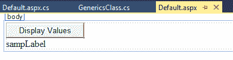
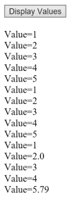

# 创建简单泛型类

在本章中，您将了解创建简单泛型类的基础知识，以便一个类可以操作多种不同的数据类型。 泛型的一大好处是灵活性。

# 创建泛型类

打开一个项目，然后转到解决方案资源管理器; 右键单击，选择 Add，然后单击 Class。 命名类`GenericsClass`; 一个简单的泛型类。 然后单击 OK。 当 Visual Studio 消息出现时，单击 Yes。

出于我们的目的，您不需要顶部的任何`using System`行，也不需要底部的任何评论，所以删除它们。 您的初始屏幕应该看起来像图 1.1.1:


Figure 1.1.1: The initial GenericsClass.cs screen

# 使用不同的数据类型

现在，让我们在它说`public class GenericsClass`的地方加上一个`<T>`符号，如下所示:

```cs
public class GenericsClass<T>
```

这意味着这个类可以很好地处理几种不同的数据类型。 接下来，在前一行的左花括号下面输入以下内容:

```cs
private T[] vals;
```

在这一行的正上方输入以下注释:

```cs
//generic array instance variable
```

换句话说，这将同样适用于双精度、小数、整数等。

# 创建泛型参数

现在，在下面一行中，输入以下内容:

```cs
public GenericsClass(T[] input)
```

如您所见，您还可以使参数像这样通用。 这是一个参数，`input`是它的名称，类型是`T`。 它是一个泛型数组。

接下来，在前一行下面的一组花括号之间输入以下内容:

```cs
vals = input;
```

# 显示的值

当然，您应该能够显示这些值。 因此，在`vals = input;`行下的右花括号下面输入以下一行:

```cs
public string DisplayValues()
```

要显示这些值，您将在前一行下面的一组花括号之间输入以下内容。

首先，放入一个字符串，如下所示:

```cs
string str = null;
```

接下来，声明字符串并将值初始化为空。

然后，在这一行下面直接输入以下内容:

```cs
foreach ( T t in vals)
```

如您所见，这里的`foreach`循环将运行。 对象将是不同的数据类型，这取决于我们如何选择创建对象。 当然，`t`变量是`vals`数组中的每个特定值。

接下来，你将在前一行下面的一组花括号之间输入以下内容:

```cs
str += $"<br>Value={t}";
```

记住，我们使用`+=`操作符进行累积，使用`<br>`向下推到下一行。 当然，为了得到值，我们将输入`t`变量。

最后，你想返回这个，所以你要在前一行的右花括号下面输入以下内容:

```cs
return str;
```

就是这样。 本章的最终版本`GenericsClass.cs`文件，包括注释，如下代码块所示:

```cs
 //<T> means this class can operate on many different data types
public class GenericsClass<T>
{
    //generic array instance variable
    private T[] vals;//array of T inputs
    public GenericsClass(T[] input)
    {
        //set value of instance variable
        vals = input;
    }
    public string DisplayValues()
    {
        string str = null;//create string to build up display
        foreach(T t in vals)
        {
            //actually accumulate stuff to be displayed
            str += $"<br>Value={t}";
        }
    //return string of outputs to calling code
    return str;
    }
}  
```

注意我们有一个单独的代码块; 现在将对整数、双精度浮点数等进行操作。

# 添加一个按钮到 Default.aspx

现在，让我们来看看`Default.aspx`。 此时我们真正需要做的唯一一件事就是添加一个`Button`控件。 为此，转到工具箱并从那里抓取一个`Button`控件。 将其拖放到以`<form id=...`开头的行下面(您可以删除`<div>`行，因为我们不需要它们)。 将`Button`控件上的文本更改为，例如`Display Values`。 您完整的`Default.aspx`文件应该类似于*图 1.1.2*所示:


Figure 1.1.2: The complete HTML for this project

现在，转到 Design 视图。 我们非常简单的界面如图*图 1.1.3*:



Figure 1.1.3: Our very simple interface in the Design view

# 初始化整数集合到其数组并显示结果

现在，双击`Display Values`按钮并进入`Default.aspx.cs`。 删除`Page_Load`块。 接下来，在以`protected void Button1_Click...`开头的行下面的一组花括号之间，输入以下内容:

```cs
GenericsClass<int> ints = new GenericsClass<int>(new int[] { 1, 2, 3, 4, 5 });
```

你可以在这一行中看到，我们基本上是在初始化整数的集合到它们的数组。

现在，您可以显示它。 所以，例如，你可以在这一行下面输入以下内容:

```cs
sampLabel.Text += ints.DisplayValues();
```

请注意，我们构造的`GenericsClass`运算的是整数，但它可以同样很好地运算任何其他数据类型。

# 改变泛型类中的数据类型

使代码效率更明显,前两行,复制(*Ctrl + C*)粘贴他们*(*Ctrl + V*下面这些就改变它翻倍,如下:***

 **```cs
GenericsClass<double> dubs = new GenericsClass<double>(new double[] {1, 2, 3, 4, 5});
sampLabel.Text = ints.DisplayValues();
```

我们将其命名为`dubs`，并将这里的名称改为 double:可以对 double 进行操作的是相同的代码、相同的类和相同的泛型类。 再次强调这一点，看看灵活性和代码重用才是真正的目的; 也就是说，重用代码的能力，我们现在将这两个新行，再次复制并粘贴到下面，然后将`double`改为`decimal`，如下所示:

```cs
GenericsClass<decimal> decs = new GenericsClass<decimal>(new decimal[] { 1, 2, 3, 4, 5 });
sampLabel.Text = ints.DisplayValues();
```

让我们称这个为`decs`。 当然，如果你想让事情变得更有趣，你可以加入一些小数点:

```cs
GenericsClass<double> dubs = new GenericsClass<double>(new double[] { 1.0, -2.3, 3, 4, 5 });
sampLabel.Text = ints.DisplayValues();
GenericsClass<decimal> decs = new GenericsClass<decimal>(new decimal[] { 1, 2.0M, 3, 4, 5.79M });
sampLabel.Text = ints.DisplayValues();
```

With decimals, just make sure that you put the `M` suffix in there, because you need the `M` suffix at the end to indicate that it's a decimal.

# 运行程序

现在，让我们来看一看。 当您运行此代码并单击 Display Values 按钮时，您的屏幕将类似于*图 1.1.4*所示:


Figure 1.1.4: The initial run of our code

# 积累的输入

现在，我们将输入累加。 因此，在下面的`sampLabel.Text`行中，我们将`=`符号改为`+=`，如下所示:

```cs
GenericsClass<double> dubs = new GenericsClass<double>(new double[] { 1.0, -2.3, 3, 4, 5 });
sampLabel.Text += ints.DisplayValues();
GenericsClass<decimal> decs = new GenericsClass<decimal>(new decimal[] { 1, 2.0M, 3, 4, 5.79M });
sampLabel.Text += ints.DisplayValues();
```

让我们再运行一次。 单击 Display Values 按钮，您的屏幕现在看起来就像*图 1.1.5*所示:



Figure 1.1.5: The input is now being accumulated, and the values are showing as expected

该计划目前正按预期进行。

因此，在这一点上泛型的主要思想是您可以定义一个泛型类。 这个类可以很好地操作许多不同的数据类型。 例如，您可以创建一个泛型类，既可以对整数进行操作，也可以对双精度数和小数进行操作。

This step isn't strictly required, but here's a little bit of additional insight. If you want to, you can set a breakpoint as follows. Select the line with the open curly brace under the line beginning with `protected void Button1_Click....` Now, go to Debug | Step Into (*F11*) and click on Display Values.

现在，我们来看看。 因此，第一步，将鼠标悬停在`Generics Class.cs`中的`T`对象上:

```cs
public GenericsClass(T[] input)
```

这里，`T`本质上类似于一个参数，所以它有一个特定的值，在`vals = input;`行中表示。 第一次，`T`用于整数。 这就是逐步执行这段代码的方法。 在屏幕底部，显示数组内部的值，如图*所示:*


Figure 1.1.6: The values inside the array

`t`变量，正如你在*图 1.1.7*中看到的，是一个整数，它是这样工作的:

 Figure 1.1.7: The t is an integer

还请注意，在屏幕截图中，它是一个数据类型为`<int>`的泛型类。

`foreach(T t in vals)`行的`T`对象现在代表一个整数，其他数据类型依此类推。 因此，代码的灵活性和代码的重用意味着您将编写更少的代码。 如果不是泛型，则必须创建单独的类来处理每种不同的数据类型。

# 章回顾

为了便于审阅，本章的`Default.aspx.cs`文件的完整版本，包括注释，如下代码块所示:

```cs
//using is a directive
//System is a name space
//name space is a collection of features that our needs to run
using System;
//public means accessible anywhere
//partial means this class is split over multiple files
//class is a keyword and think of it as the outermost level of grouping
//:System.Web.UI.Page means our page inherits the features of a Page
public partial class _Default : System.Web.UI.Page
{
    protected void Button1_Click(object sender, EventArgs e)
    {
        //in each case below, GenericsClass<...> works equally well with
        //integers, doubles and decimals, among others
        GenericsClass<int> ints = new GenericsClass<int>(new int[] { 1, 2, 3, 4, 5 });
        sampLabel.Text = ints.DisplayValues();
        GenericsClass<double> dubs = new GenericsClass&lt;double>(new double[] { 1.0, -2.3, 3, 4, 5 });
        sampLabel.Text += ints.DisplayValues();
        GenericsClass<decimal> decs = new GenericsClass<decimal>(new decimal[] { 1, 2.0M, 3, 4, 5.79M });
        sampLabel.Text += decs.DisplayValues();
    }
} 
```

# 总结

在本章中，您学习了创建简单泛型类的基础知识，这样一个类就可以操作许多不同的数据类型。 泛型的一大好处是灵活性。 您创建了一个简单的泛型类，该类使用不同的数据类型、生成泛型参数、初始化整数集合到它们的数组并显示结果，然后将泛型类中的数据类型更改为双精度和小数。

在下一章中，您将学习泛型方法，或者可以操作不同数据类型的方法。 您还将了解如何根据方法可以操作的数据类型约束方法，因此我们将添加一个称为约束的概念。**