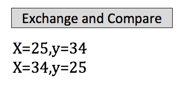

# 二、创建泛型方法

在本章中，您将学习泛型方法，泛型方法是可以操作不同数据类型的方法。 您还将了解如何根据方法可以操作的数据类型约束它，因此我们将添加一个名为*约束*的概念。

# 创建一个按钮来交换，然后比较两个值

打开一个项目并单击选项卡。 唯一要放进去的就是一个按钮。 这一次，为了节省时间，我们不会从用户那里读取任何值。 因此，转到工具箱并抓取一个`Button`控件。 将其拖放到以`<form id=...`开头的行下面(您可以删除`<div>`行，因为我们将不再需要它们)。 将按钮上的文字改为`Exchange And Compare`。 这将交换两个值，然后比较它们。 您的完整的`Default.aspx`文件应该与*图 2.2.1*所示类似:


Figure 2.2.1: The complete HTML file for this chapter

# 编写交换函数

*交换*函数是一种常见的写法:交换两个值的函数。 为此，转到“解决方案资源管理器”，右键单击网站名称，选择“添加”，然后单击“类”。 将类命名为`GenMethods`以保持简单，然后单击 OK。 当 Visual Studio 消息出现时，单击 Yes。

当`GenMethods`文件出现时，您只需要留下`using System`。 我们不需要这个类的构造函数，所以去掉它。 然后，在`GenMethods`的主体内，在公共类`GenMethods`行下面的花括号之间定义以下内容:

```cs
public static void Swap<T>(ref T x, ref T y)
```

这将在类级别上执行:您不必创建`GenMethods`类型的对象。 从某种意义上说，这里唯一的新特性是这是一个`Swap<T>`函数，这意味着它可以同样出色地处理几种不同的数据类型。 现在，还请记住，`ref`关键字表明，通过这一行中的`x`和`y`参数，当您更改方法内部的值时，这些更改的值也可以在调用代码中访问。 记住这一点。

在继续之前，让我们在这一行上面输入以下注释:

```cs
//method can operate on multiple data types 
```

这基本上意味着该方法可以同等地对多种数据类型进行操作。

现在，在前一行下面的花括号集合之间，输入以下代码来交换值:

```cs
T temp = x;
```

在这里，您将取`x`的值并将其赋值给一个临时值。 然后，在下一阶段，你可以取`x`并分配`y`给它，然后你可以取`y`并分配`temp`给它，如下:

```cs
x = y;
y = temp;
```

在继续之前，让我们添加以下注释:

```cs
T temp = x; 
//save x 
x = y;
//assign y to x 
y = temp;
//assign original value of x back to y 
```

这里，第一行表示用`y`的值覆盖`x`的值，然后将`y`分配给`x`。 在最后一个阶段，您将`x`的原始值`temp`分配给`y`。 这表示值的切换。

# 使用 CompareTo 方法比较值

现在，我们再做一个方法。 这个会更复杂一点。 它将被称为`Compare`，它将对不同的数据类型进行操作。 因此，在前几行末尾的右花括号下面输入以下内容:

```cs
public static string Compare<T>(T x, T y) where T : IComparable
```

# 引入约束

要比较值，您需要使用`CompareTo`方法。 如果你有`where T : IComparable`，就可以使用它。 这是一个新的概念。 它是一个*约束*。 `Compare`方法可以工作，但它只有在其操作的数据类型上实现了`IComparable`时才能工作。 换句话说，比较这些值是有意义的。

# 完成 GenMethods 类

对于下一阶段，您可以这样说。 在这一行下面的一组花括号中输入:

```cs
if(x.CompareTo(y) < 0)
```

为什么要写这个? 我们这样写是因为如果右键单击`CompareTo`方法并在下拉菜单中选择 Go To Definition(*F12*)，您可以看到它是在`IComparable`界面中定义的。 如果你展开它，看看它返回什么，它说:Values 含义小于零这个实例在排序顺序中在 obj 之前。 图 2.2.2:


Figure 2.2.2: The definition of IComparable

换句话说，在我们的语境中，这意味着`x`和`y`在以下意义上是相关的。

如果`CompareTo`返回的值小于`0`，则`x`小于`y`。

现在，在前一行下面的一组花括号中输入以下内容:

```cs
return $"<br>{x}<{y}"; 
```

在这一行中，您返回并实际格式化一个字符串，因此这不仅仅是一个简单的比较。 例如，你可以说这里`x`小于`y`。

另一种可能恰恰相反。 现在，在前面的右花括号下面输入以下内容:

```cs
else
{
     return $"<br>{x}>{y}";
} 
```

如果你想知道更多关于`CompareTo`的信息，右键单击它，在下拉菜单中选择*F12*去定义。 正如在图 7.2.3 中的返回栏中所看到的，它说:0 这个实例发生在与 obj 相同的位置上。 该实例按照排序顺序跟随对象。


Figure 2.2.3: The definition of CompareTo

在`if (x.CompareTo(y) < 0)`行中，该实例表示`x`变量，对象表示`y`变量。

所以，这是基本的`GenMethods`类。 `GenMethods.cs`文件的最终版本，包括注释，显示在以下代码块中:

```cs
using System;
public class GenMethods
{
    //method can operate on multiple data types
    public static void Swap<T>(ref T x, ref T y)
    {
        T temp = x; //save x
        x = y;//assign y to x
        y = temp;//assign original value of x back to y
    }
    //this function has a constraint, so it can operate on values
    //that can be compared
    public static string Compare<T>(T x, T y) where T :IComparable
    {
        //CompareTo returns < 0, =0,or >0, depending on the relationship
        //between x and y
        if(x.CompareTo(y)<0)
        {
            return $"<br>{x}<{y}";
        }
        else
        {
            return $"<br>{x}>{y}";
        }
    }
} 
```

如您所见，`GenMethods`类包含两个泛型函数，因为它可以操作不同的数据类型，除了第二个`CompareTo`方法，它是一个稍微受限制的版本，这意味着应用了`IComparable`类型的约束。

# 硬编码的值

现在，回到`Default.aspx`，转到 Design 视图并双击 Exchange 和 Compare 按钮。 我们所要做的就是硬编码这些值以节省时间。 我们不需要从用户那里读取它们。 当然，如果您愿意，您可以通过放入两个盒子并使用`double`转换来处理。

现在，在`Default.aspx.cs`中，在以`protected void Button1_Click...`开头的行下面的一组花括号之间，输入以下几行:

```cs
double x = 25, y = 34;
```

然后使用`sampLabel.Text`在这个屏幕上显示原始值，先显示`x`的值，然后显示`y`的值:

```cs
sampLabel.Text = $"x={x}, y={y}";
```

接下来，进行值的交换。 输入以下:

```cs
GenMethods.Swap<double>(ref x, ref y);  
```

首先，输入类名，然后输入函数，即`Swap`。 您将看到，现在可以用`<double>`替换`<T>`，因为我们正在交换双精度数。 然后输入`ref x`和`ref y`。

因为我们使用了`ref`，所以`x`和`y`的值必须被初始化，现在我们可以再次显示它们，但要交换，如下所示:

```cs
sampLabel.Text += $"<br>x={x}, y={y}";
```

# 运行程序

让我们看看效果，看看这是否像预期的那样工作。 所以，在你的浏览器中尝试一下。 单击 Exchange and Compare 按钮。 结果见图 2.2.4:



Figure 2.2.4: Results of the initial program run

如你所见，x 是 25 y 是 34。 然后，在单击 Exchange 和 Compare 之后，x 是 34,y 是 25。 这和预期的一样。

# 修改程序以获得附加类型的比较

现在，回到`Default.aspx`，在下一阶段，在 Design 视图中，我们还将比较这些值。 为此，再次双击 Exchange and Compare 按钮，并在我们输入的最后一行下面添加以下内容:

```cs
sampLabel.Text += GenMethods.Compare<double>(x, y);
```

记住我们设计`Compare`的方式，它返回一个返回两个值之一的字符串，这取决于具体情况。 因此，在这一行中，我们将比较`double`; 所以你把它放在这里，然后两个值将是`x`，`y`。

让我们在浏览器中尝试一下。 再次单击 Exchange and Compare 按钮。 新的结果如图*图 2.2.5*:


Figure 2.2.5: Results of the modified program run

现在，x = 25 y = 34。 当你交换值时，x 是 34 y 是 25。 此外，34 当然比 25 要多。 它看起来真的很漂亮和专业。

# 为不同的数据类型修改程序

现在的好处是:想象你想重做这个; 您可以键入`int`作为示例，并将数据类型更改为整数或十进制类型和方法。 我们在本章中编写的代码同样适用于以下方面:

```cs
int x = 25, y = 34;
sampLabel.Text = $"x={x}, y={y}";
GenMethods.Swap<int> (ref x, ref y);
sampLabel.Text += $"<br>x={x}, y={y}";
sampLabel.Text += GenMethods.Compare<int>(x, y);
```

当然，如果你右键单击`int`并在下拉菜单中选择 Go To Definition(*F12*)，你会看到它显示`public struct Int32`并执行`IComparable`:


Figure 2.2.6: Definition for public struct Int32

这将工作，因为我们的函数有一个约束，它规定了`T`在哪里应该具有可比性，如下所示:

```cs
public static string Compare<T>(T x, T y) where T : IComparable
```

这些是基本的。

# 章回顾

为了便于审阅，本章的`Default.aspx.cs`文件的完整版本，包括注释，如下代码块所示:

```cs
//using is a directive
//System is a name space
//name space is a collection of features that our needs to run
using System;
//public means accessible anywhere
//partial means this class is split over multiple files
//class is a keyword and think of it as the outermost level of grouping
//:System.Web.UI.Page means our page inherits the features of a Page
public partial class _Default : System.Web.UI.Page
{
    protected void Button1_Click(object sender, EventArgs e)
    {
        int x = 25, y = 34;//declare and set two variables
        sampLabel.Text = $"x={x}, y={y}";//display variables
        GenMethods.Swap (ref x, ref y);//swap values
        sampLabel.Text += $"<br>x={x}, y={y}";//display swapped values
        sampLabel.Text += GenMethods.Compare (x, y);
    }
}
```

# 总结

在本章中，您学习了泛型方法，泛型方法是可以操作不同数据类型的方法。 您还了解了根据方法可以操作的数据类型约束方法，这是一个称为*约束*的概念。 您创建了一个`GenMethods`类，编写了`Swap`函数，使用`CompareTo`方法比较了值，了解了约束，并修改了程序来执行其他类型的比较并处理不同的数据类型。

在下一章中，您将学习向上类型转换、向下类型转换，以及如何实现泛型接口，以及它究竟如何帮助我们。