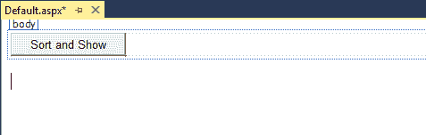
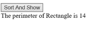

# 实现通用接口来完成排序

在这一章中，您将学习向上转换和向下转换，然后如何实现通用接口，以及它如何帮助我们。

假设您有一个对象列表，您用自己的类型创建了这些对象，并且您想对它们进行排序。 您需要弄清楚如何对这些对象进行排序。 这是通过实现`IComparable`实现的，这是一个可以处理不同数据类型的通用接口。

# 添加一个按钮来排序和显示结果

打开一个项目并单击选项卡。 再说一遍，你只需要放一个按钮。 为此，转到工具箱并抓取一个`Button`控件。 将其拖放到以`<form id=...`开头的行下面，并将按钮上的文本改为`Sort and Show`。 现在，在一行的末尾放一个`<br>`标签，并保持标签像往常一样:

```cs
<asp:Button ID="Button1" runat="server" Text="Sort And Show"/><br />
```

现在，转到 Design 视图，在这里您应该只看到 Sort 和 Show 按钮，如图*图 3.3.1*所示。



Figure 3.3.1: Adding a button

# 创建泛型接口类

接下来，转到解决方案资源管理器。 右键单击网站的名称，选择 Add，然后单击 Class。 将类命名为`GenInterface`，然后单击 OK。 当 Visual Studio 消息出现时，单击 Yes。 记住，这只是一个例子。

`GenInterface`类的代码非常复杂。 现在我将逐行创建它，解释我正在做什么以及为什么要这样做。

首先，删除除最顶端的`using System;`之外的所有内容。 接下来，您将为一个四边形状制作一个名为`Quad`的课程。 在`using System`后输入以下内容:

```cs
public class Quad : IComparable<Quad>
```

这需要`System`才能使用`IComparable`。 如果您右键单击它并在下拉菜单中选择 Go To Definition(*F12*)，您可以看到这个东西的定义。 你会看到靠近顶部的`namespace System`，以及`Returns`定义后的`public intCompareTo (T other);`函数，如图*图 3.3.2*所示:


Figure 3.3.2: The definition of IComparable

注意，它返回一个整数。 当我们实现这个接口时，我们必须记住这一点。 现在，关闭定义窗口。

在我们的特殊情况下，在以`public class Quad...`开头的行下的左花括号下面输入以下文本:

```cs
private string name;
public Quad(string na)
```

现在，要设置值，在前面几行下面的一组花括号之间输入以下内容:

```cs
name = na;
```

毕竟，每一个四边形，正方形、长方形或菱形，都有一个名字，不是吗? 因此，将名称特性集中在`Quad class`中是一个好主意。

# 实现该接口

接下来，因为`IComparable`有一个功能，右键单击它，选择 Quick Actions，并从弹出窗口中选择实现接口。 现在，我们必须编写代码。

首先，删除`throw new NotImplementedException()`。 现在，我们将以一种足以说明这一点的方式实现接口。 为此，在`public int CompareTo(Quad other)`行下的左花括号下输入以下内容:

```cs
if(this.name.CompareTo(other.name) <0)
```

这里，`this`表示当前对象，该对象的名称与`other.name`比较，`other.name`表示另一个对象。 看看在这上面的一行中，它说`(Quad other)`; 换句话说，我们在比较两个`Quads`。 因此，在左边的类中，`this`是调用函数的类，而另一个`Quad`是与之比较的类。 因此，如果`this`小于`0`，我们将返回一个数字`-1`，否则它可以返回一些其他值，如`1`。 在这一行下面的一组花括号之间输入以下内容:

```cs
{
    return -1;
}
else
{
    return 1;
} 
```

我们刚刚实施了`CompareTo`。 现在，请注意，*这个*不是必需的。 你可以移除它，它仍然可以工作。 但是请记住，该名称实际上意味着将在其中调用`CompareTo`的当前对象。 这就是为什么我喜欢用`this`关键字，因为它更能暗示我想知道的东西。

基本上,这条线是什么说的是,如果当前对象相比其他名称小于`0`,然后我们返回`-1`,这意味着当前对象列表中的下一个对象之前会来当你解决它。 这是一个简单的解释。

# 添加虚函数

现在，在下一阶段中，我们将添加一个名为`Perimeter`的虚拟函数。 为此，在右花括号下面输入以下内容:

```cs
public virtual string Perimeter()
```

同样，我们会尽可能集中。 因此，在这一行下面的一组花括号中输入以下内容:

```cs
return $"The perimeter of {name} is ";
```

具体的名称可以来自这一行，因为`name`实例变量在上面的`private string name`中声明。 然而，`Perimeter`将来自派生类。

所以现在，在前面的右花括号下面输入以下内容:

```cs
public class Square : Quad
```

# 添加细化

现在我们添加类特定的细化; 为此，在前一行下面的一组花括号之间输入以下内容:

```cs
private double sideLength;
public Square(string n, double s) : base(n) {sideLength = s;}
```

其中，`string n`为名称，`doubles`为侧面。 然后，使用名称(`n`)调用`base`类构造函数，然后输入`sideLength = s`。 请记住，当您调用`base`类构造函数时，您是在重用代码。

为了节省空间，我选择将其表示为单行。 记住，通常情况下，它看起来是这样的:

```cs
private double sideLength;
public Square(string n, double s) : base(n)
{
    sideLength = s;
}
```

接下来，我们必须实现`Perimeter`的覆盖版本。 因此，在前面的右花括号下面输入以下内容:

```cs
public override string Perimeter()
```

现在，我们希望保留自动出现的`return base.Perimeter()`，因为它提供了有用的默认功能`$"The perimeter of {name} is ";`，与前面的返回行保持一致:我们不想一直输入它。 我们想做的是做一些改进。 因此，在`return base.Perimeter()`中添加以下细化:

```cs
return base.Perimeter() + 4 * sideLength;
```

这意味着 4 乘以变量`sideLength`，因为要求正方形的周长，你需要用 4 乘以一边的长度。

细化来自派生类泛型功能，它同样适用于`base`类中插入虚拟方法的所有类:您不必一直编写它。

接下来，我们可以对矩形重复这个操作。 所以，复制`public class Square : Quad`块(*Ctrl*+*C*)，然后粘贴(*Ctrl*+&V*)到下面:*

```cs
public class Rectangle : Quad
{
    private double sideOne, sideTwo;
    public Rectangle(string n, double s1, double s2) : base(n)
    {
        sideOne = s1; sideTwo = s2;
    }
    public override string Perimeter()
    {
        return base.Perimeter() + (2 * sideOne + 2 * sideTwo);
    } 
}
```

现在，进行以下更改:

1.  将此块重命名为`Rectangle`。 这也是从`Quad`衍生出来的，所以没问题。
2.  改变它说`sideLength`的地方; 因为矩形有两个不同的边长，所以把它改为`sideOne`和`sideTwo`。
3.  将`public Square`更改为`public Rectangle`作为构造函数的名称。 它使用名称调用基类构造函数。
4.  然后，初始化另外两个，因此现在您将键入`double s1`和`double s2`。

5.  接下来，必须初始化字段，比如`sideOne = s1;`和`sideTwo = s2;`。 就是这样:它们已经被初始化了。
6.  现在，再次在`Rectangle`类中重写`Perimeter`，如前面所示。 在这里，您指定应用于矩形的位，即`(2 * sideOne + 2 * sideTwo)`。 确保将其括在括号内，以便首先完成计算，然后将其与`base.Perimeter`与其余部分结合在一起。

这就是那个类。 `GenInterface`类的完整版本(包括注释)如下代码块所示，以供参考:

```cs
using System;
public class Quad:IComparable<Quad>//implement IComparable
{
    private string name;//instance field
    public Quad(string na)
    {
        name = na;//set value of instance field
    }
    //implement CompareTo to make list sortable
    //in this case, the items are sorted by name
    public int CompareTo(Quad other)
    {
        if(this.name.CompareTo(other.name) < 0)
        {
            return -1;
        }
        else
        {
            return 1;
        }
    }//put default code inside Perimeter
    public virtual string Perimeter()
    {
        return $"The perimeter of {name} is ";
    }
}
public class Square: Quad
{
    private double sideLength;
    public Square(string n, double s):base(n)
    {
        sideLength = s;
    }
    //override Perimeter, calling the base portion
    //and then adding refinement with 4*sideLength
    public override string Perimeter()
    {
        return base.Perimeter() + 4 * sideLength;
    }
}
public class Rectangle: Quad
{
    private double sideOne, sideTwo;
    public Rectangle(string n, double s1, double s2) : base(n)
    {
        sideOne = s1; sideTwo = s2;
    }
    //override Perimeter, calling the base portion
    //and then adding refinement with 2sideOne+2sideTwo
    public override string Perimeter()
    {
        return base.Perimeter() + (2 * sideOne + 2 * sideTwo);
    } 
 }
```

# 输入参考代码

现在，我将执行我的参考代码。 这个代码是机械的。 有很多，但都是机械的。 记住，这里的主要思想是`IComparable`是使用`Quad`类中的`CompareTo`方法实现的，这意味着现在当我们将不同的形状插入到一个四头体列表中时，我们将能够以某种方式对它们进行排序。 现在我们的名字将被排序。 在本例中，我们将按名称对它们排序。

现在转到`Default.aspx`，并进入 Design 视图。 双击排序和显示按钮。 这把我们带入`Default.aspx.cs`。 删除`Page_Load`块。

接下来，在以`protected void Button1_Click...`开头的那行下面的一组花括号之间，我们要做的第一件事是在左边放一个`Quad`，我们将其命名为`sqr`:

```cs
Quad sqr = new Square("Square", 4);
```

# 向上转型

注意我写了`new Square`。 这是*上调*。 这里，这涉及到右边的物体的变换，因为它是从它的`Quad`衍生出来的。 在左侧，您可以创建一个`Quad`命名空间，并将派生类型的对象放在右侧; 因此，我们将这个命名为`Square`，然后输入边长为`4`。

接下来，在这一行下面直接输入以下内容:

```cs
Quad rect = new Rectangle("Rectangle", 2, 5);
```

同样，我们在左侧放置了一个`Quad`名称空间，这一次我们将其命名为`rect`。 我们给它命名为`Rectangle`，然后我们把长度为`2`和`5`的两条边放进去。

现在，你可以把它存储在一个列表中，例如，你可以对它排序。 想象一下，如果您有许多这样的信息，您将需要一种方法来对这些信息进行排序。 所以现在，转到这个文件的顶部，并在`using System`下面输入以下内容:

```cs
using System.Collections.Generic;
```

接下来，在`Quad rect...`行下，输入以下内容:

```cs
List<Quad> lst = new List<Quad>(new Quad[] { sqr, rect, rect2, sqr1 });
```

我们将此列表命名为`new List<Quad>`，并且您总是可以使用数组来初始化列表。 为此，键入`new Quad`，然后用`sqr`和`rect`初始化它。 这就是在数组中初始化列表的方法。

然后，要对列表进行排序，在这一行下面直接输入以下内容:

```cs
lst.Sort();
```

这就说得通了。 它不会给出错误。 想象一下，如果你没有把`IComparable<Quad>`放在`GenInterface`这门课的顶端。 这种方式行不通。 如果你切断`IComparable<Quad>`，然后取出`CompareTo`方法，你将会有问题。 因此，出于我们的目的，我们现在有了对这些`Quads`类进行排序的方法。

对于最后一个阶段，首先在`Sort`行下面输入以下内容:

```cs
if(lst[0] is Square)
```

因此，`is`是一个新的关键词。 你可以用它来检查某物是否是某种类型。

# Downcasting

现在，我们将讨论*向下转换*，这意味着，例如，从父类型转换为子类型。 在这一行下面的一组花括号之间输入以下内容:

```cs
sampLabel.Text += ((Square)lst[0]).Perimeter();
```

现在，在前一行后的右花括号下，输入以下内容:

```cs
else if(lst[0] is Rectangle)
```

然后，您可以调用以下代码; 因此，复制`sampLabel.Text...`行，并将其粘贴到一组花括号中:

```cs
sampLabel.Text += ((Rectangle)lst[0]).Perimeter();
```

确保将`Square`更改为`Rectangle`，以便将其强制转换为一个矩形，然后调用矩形上的`Perimeter`函数。 当您将鼠标悬停在前两行中的`Perimeter`上时，弹出窗口将分别显示`string Square.Perimeter()`和`string Square.Perimeter()`。 如果你从前一行中移除`(Rectangle)`并将鼠标悬停在`Perimeter`上，弹出窗口将显示`string Quad.Perimeter()`。 你明白吗? 这就是我使用强制转换的原因:因为它改变了识别函数的方式。

这是从父类向下转换到子类。 因此，当我们讨论批量操作时，您不能强制转换为父类，不能执行类似于排序的批量操作，或者如果您想添加称为子类和子类对象的细化，则可以向下强制转换。

# 运行程序

现在，让我们来看一看。 在浏览器中打开该程序并单击 Sort and Show 按钮。 图 3.3.3:



Figure 3.3.3: The results of running the program

这确实是矩形的周长。

这些是向上转换、向下转换和实现通用接口(如`IComparable`)的基础知识。 这是非常复杂的代码，但是我希望您已经学到了很多。

# 章回顾

为了便于审阅，本章的`Default.aspx.cs`文件的完整版本，包括注释，如下代码块所示:

```cs
//using is a directive
//System is a name space
//name space is a collection of features that our needs to run
using System;
using System.Collections.Generic;
//public means accessible anywhere
//partial means this class is split over multiple files
//class is a keyword and think of it as the outermost level of grouping
//:System.Web.UI.Page means our page inherits the features of a Page
public partial class _Default : System.Web.UI.Page
{
    protected void Button1_Click(object sender, EventArgs e)
    {
        sampLabel.Text = "";//clear label every time
        Quad sqr = new Square("John",4);//make a square
        Quad rect = new Rectangle("Bob", 2, 5);//make a rectangle
        Quad rect2 = new Rectangle("Jerry", 4, 5);//make another rectangle
        //stick all these shapes into a list of quads
        List<Quad> lst = new List<Quad>(new Quad[] { sqr, rect,rect2});
        lst.Sort();//sort the list
        if(lst[0] </span>is Square) //if it's asquare
        {
               //down cast to a square, and call Perimeter on it
                sampLabel.Text += ((Square)lst[0]).Perimeter();
        }
        else if(lst[0] is Rectangle)
        {
            //if it's a rectangle, down cost to a rectangle, 
            //and call Perimeter
            sampLabel.Text += ((Rectangle)lst[0]).Perimeter();
        }
    }
} 
```

# 总结

在本章中，您学习了向上转换和向下转换，以及如何实现通用接口以及它如何帮助我们。 您创建了一个泛型接口类和一个 Quad 类，实现了一个接口，添加了一个虚拟的`Perimeter`函数，对代码进行了细化，并输入了大量机械参考代码。

在下一章中，您将了解通用委托。