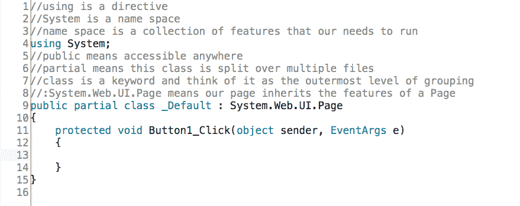

# 委托和 Lambda 表达式之间的连接

在本章中，我们将看看委托和 Lambda 表达式之间的联系。

# 向 HTML 添加一个 Show Results 按钮

打开一个项目，在中放入一个显示结果的按钮。 为此，转到“工具箱”并抓取一个`Button`控件。 将其拖放到以`<form id=...`开头的行下面。 您可以删除`<div>`行，因为您不需要它们。 请确保在带有按钮的行末尾插入一个`<br>`标签:

```cs
<asp:Button ID="Button1" runat="server" Text="Show Results" /><br />
```

我会做一些大杂烩来展示不同的概念。

转到 Design 视图，双击 Show Results 按钮。 这把我们带入了`Default.aspx.cs`。 删除`Page_Load`块。 这个项目的初始代码屏幕应该类似于图 6.1.1:



Figure 6.1.1: The initial Default.aspx.cs code for this project

# 添加的代表

在第一阶段，您必须添加委托。 虽然您可以将它们放入一个单独的文件中，但出于我们的目的，我们还是将它们放在这里。 因此，在以`public partial class...`开头的行上输入以下内容:

```cs
public delegate bool Compare(double x, double y);
```

记住，委托实际上是函数或方法包装器。 然后，直接在这一行下面，输入以下内容:

```cs
public delegate double Multiply(double x, double y);
```

你可以看到我们有两个代表。 一个返回`Boolean`数据类型，另一个返回`double`数据类型。

# 设置变量

接下来，在`Button1_Click`的事件处理程序内部，我们将创建两个变量:`x`(我们将其设置为`10`)和`y`(等于`25`)。 因此，在花括号之间输入以下内容:

```cs
double x = 10, y = 25;
```

# 创建委托类型的对象

现在，我们要做的下一件事是在前面一行的下面输入以下内容:

```cs
Compare comp = (a, b) => (a == b);
```

当你开始输入`Compare`时，注意在弹出的窗口中，一旦你有了一个委托(`Compare`)，基本上，你就可以制作这种类型的对象; 然后键入`comp`。

# 定义 lambda 表达式

现在，要定义一个 lambda 表达式，输入`= (a,b)`，如下所示。 然后这将被映射到接下来的操作; 所以可以将`=>`看作映射符号或映射运算符。 它将被映射到`(a==b)`操作。 所以，`comp`，换句话说，将允许我们检查两个值是否相同，这发生在比较`a`和`b`的阶段。 `(a, b)`基本上是参数，计算的表达式是`a`是否等于`b`。

现在，输入下面的下一步:

```cs
sampLabel.Text = $"{x} and {y} are equal is {comp(x, y).ToString().ToLower()}";
```

要调用它，请注意键入`comp`，然后传入`x`和`y`值。 然后，为了表明您可以进一步对它进行操作，一旦您从它得到一个结果，您可以将它转换为一个字符串版本，然后全部转换为小写，如前面的代码行所示。

记住，这是链接的*函数，所以它在执行时从左到右。 换句话说，首先是`comp`运行，然后是`ToString`，最后是`ToLower`。*

另外，请注意，在运行时，当调用`comp(x, y)`时传入`x`和`y`值时，基本上是`(a==b)`将被命中; 将进行比较，并将值发送回。

接下来，我们还可以执行`Multiply`委托，因此在这一行下面输入以下内容:

```cs
Multiply mult = (a, b) => (a * b);
```

请注意，可以使用和重用`(a,b)`等等。 请记住，这里的`(a,b)`是参数，您可以使用和重用它们。 它们是局部的，在它们出现的每一行中。 所以，你可以在另一个例子中使用它。 然后，再次说明`(a,b)`映射到`(a*b)`的操作。 用分号结束。

现在,调用这个乘法委托(Lambda 表达式,它表示),副本(*Ctrl + C*)`sampLabel.Text`行从上面粘贴*(*Ctrl + V*【显示】)下面,如下所示:***

```cs
sampLabel.Text += $"<br>{x}*{y} is {mult(x, y).toString()}";
```

这里，我们用`{x}*{y}`代替，然后用`+=`追加、删除`are equal`，并将`comp`替换为`mult`作为对象的名称。 你不需要`toString`来让它工作，因为它会返回一个数字，你也不需要`ToLower`。

# 操作数组

下一阶段，你能做的另一件事是操作数组。 例如，您可以创建一个双精度数组。 我们将其命名为`dubsArray`，这将是一个新的`double`数组。 为此，在下一行输入以下内容:

```cs
double[] dubsArray = new double[] { 1, 2, 3, 4, 5 };
```

# 处理操作

现在，我们将讨论动作，所以输入以下内容作为下一行:

```cs
Action<double> showDouble = (a) => sampLabel.Text += "<br>" + (a * a);
```

请注意，`Action`是一个委托。 因此，如果右键单击`Action`并选择 Go To Definition，您将看到`public delegate void Action()`。 如果展开它，它会说，封装一个没有参数且不返回值的方法。 这是。net 中一个动作的基本定义。

但是，您可以扩展一个`Action`委托。 它们可以是通用的。 例如，如果键入`Action<double>`并右键单击它并再次选择 Go To Definition，那么这个特定的表单将接受一个参数。 如果你展开它，参数部分会说，这个委托封装的方法的参数。 此外，*Summary*部分说:封装一个只有一个参数且不返回值的方法。 所以，再一次，没有必要去猜。 右键单击并选择 Go To Definition 或将鼠标悬停在其上。 它告诉你你需要知道的。 在我们的例子中，它实际上是前面一行中看到的`showDouble`。 现在，另一个 lambda 可以用来定义这个; 因此您将`(a)`作为单个参数插入其中，然后输入映射符号`=>`，然后输入`sampLabel.text`。 您希望将其附加到现有文本中，因此键入`+=`，然后键入`<br>`，然后显示`a`的方框，键入`+ (a * a)`并以分号结束。

现在还记得从定义`Actions`，它们不返回值，对吧? 事实上，如果我们输入`Action<double>,`，然后看看弹出的提示，如果你浏览整个列表到 T16，它说，封装一个有 16 个参数且不返回值的方法，如图*所示:*


Figure 6.1.2\. None of the actions return a value after typing Action<double>,

所以，它们都不返回值。 正如这里定义的，这是`Actions`的一个基本特性，但请记住，它最终只是一个委托。

然后，例如，要使用这些`Actions`，你可以做的一件事是输入以下:

```cs
foreach(var d in dubsArray)
```

在下一阶段，在这一行下面的一组花括号之间输入以下语句来调用动作:

```cs
showDouble(d);
```

这些是使用委托和 Lambda 表达式的基础知识。 顶部的两个代表的文件是我们的核心程序,紧随其后的是`Compare`和`Multiply`,所使用的委托类型下面,然后是 Lambda 表达式,参数表达式,如`(a, b) => (a == b)`、`(a, b) => (a * b)`和`(a) => sampLabel.Text += "<br>" + (a * a)`使用这些定义的代表。

现在，在浏览器中查看一下。 单击 Show Results 按钮。 它说，10 和 25 相等是假的 10*25 是 250，然后这些正方形就打印出来了。 这些是基本的结果，一切看起来都像它应该的样子:


Figure 6.1.3\. The results of running our program

# 章回顾

为了便于审阅，本章的`Default.aspx.cs`文件的完整版本，包括注释，如下代码块所示:

```cs
//using is a directive
//System is a name space
//name space is a collection of features that our needs to run
using System;
//public means accessible anywhere
//partial means this class is split over multiple files
//class is a keyword and think of it as the outermost level of grouping
//:System.Web.UI.Page means our page inherits the features of a Page
public delegate bool Compare(double x, double y);
public delegate double Multiply(double x, double y);
public partial class _Default : System.Web.UI.Page
{
    protected void Button1_Click(object sender, EventArgs e)
    {
        double x = 10, y = 25; //declare two variables
        //the two variables are accessible inside the lambda expressions
        Compare comp = (a, b) => (a == b);//define comparison lambda
        //invoke the lambda in the line below
        sampLabel.Text =
         $"{x} and {y} are equal is {comp(x, y).ToString().ToLower()}";
        //line define a lambda for multiplication
        Multiply mult = (a, b) => (a * b);
        //invoke the multiplication lambda
        sampLabel.Text += $"<br>{x}*{y} is {mult(x, y)}";
        //make array of doubles
        double[] dubsArray = new double[] { 1, 2, 3, 4, 5 };
        //actions encapsulate functions that do not return a value
        //but actions can accept arguments to operate on
        Action<double> showDouble = 
        (a) => sampLabel.Text += "&lt;br>" + (a * a);
        //it's now possible to perform the action on each d repeatedly
        foreach (var d in dubsArray)
        {
            showDouble(d);
        }
    }
}
```

# 总结

在本章中，您学习了委托和 lambda 表达式之间的联系。 您添加了委托、设置了项目变量、创建了委托类型的对象、操作了数组并使用了`Actions`。

在下一章中，您将学习表达式主体成员，然后学习由代码块定义的 lambda 表达式。*