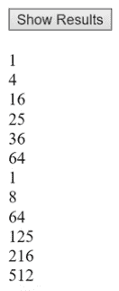
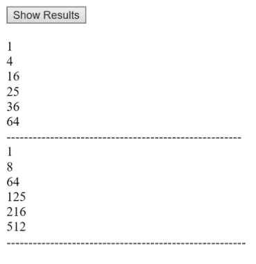
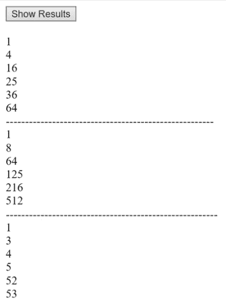

# 运行自己委托的匿名方法和对象

在本章中，我们将讨论匿名函数。

# 向 HTML 添加一个 Show Results 按钮

打开一个项目，在内放入一个按钮，显示`Show Results`。 为此，转到“工具箱”并抓取一个`Button`控件。 将其拖放到以`<form id=...`开头的行下面。 您可以删除`<div>`行，因为您不需要它们。 请确保在 Button 行末尾插入一个`<br>`标签。

```cs
<asp:Button ID="Button1" runat="server" Text="Show Results" /><br />
```

接下来，我们将向用户显示一些结果。 为此，转到 Design 视图，并双击 Show Results 按钮。 这把我们带入了`Default.aspx.cs`。 删除`Page_Load`块。 这个项目开始代码的相关部分应该类似于图 8.3.1:


Figure 8.3.1: The starting code section for this project

# 简化编写函数

在正文中，但在以`protected void Button1_Click...`开头的行之上，输入以下内容:

```cs
private void ShowSquare(double x) => sampLabel.Text += "<br>" + (x * x);
```

记住，`=>`是一个*表达成员*。 这是一个函数。 换句话说，它的形式是。 在行结束时，返回`x * x`。 如您所见，这是一种非常精简的函数编写方法。

接下来，我们需要添加名称空间。 因此，在`using System`之后，输入以下几行:

```cs
using System.Collections.Generic;
using System.Threading;
```

现在，在按钮的事件中，我们将放置以下代码列表; 因此，在以`protected void Button1_Click...`开头的行下面的一组花括号之间输入这一行:

```cs
List<double> vals = new List<double>(new double[] { 1, 2, 4, 5, 6, 8 });
```

在这一行中，您正在创建一个包含`double`数据类型的新列表，然后将其初始化。 你可以用几种方法来做这个，但是你可以只写一个数组然后输入一些值。 它们是什么并不重要。 这将生成一个`double`数据类型列表。

# 对所有值执行操作

现在，您可以做的一件事是对所有值执行一个操作。 这样做的方法是输入以下内容:

```cs
vals.ForEach(ShowSquare);
```

这就是对每个值调用`ShowSquare`的方式。 注意，在本例中，命名为`ShowSquare`。 `ShowSquare`表示该表达式，`sampLabel.Text += "<br>" + (x * x)`; 所以它是一个*命名量*。

# 生成匿名函数或方法

现在，如果你愿意，你也可以做一些不涉及名字的事情。 例如，您可以输入以下内容:

```cs
vals.ForEach(delegate (double x)
```

接下来，我们将在一组花括号之间定义主体或逻辑。 这是一个无名的或*匿名的*。 例如，你可以在这行下面输入以下内容(注意，你在右花括号后面加上了圆括号和分号):

```cs
{
    sampLabel.Text += "<br>" + Math.Pow(x, 3);
});
```

这一行的操作与前一行类似。 唯一的区别是我们没有调用任何命名的东西; 我们只是定义了一个*匿名函数*，一个使用`delegate`关键字的无名函数。 当然，这只接受一个值`x`。 然后对`x`值进行立方; `Math.Pow(x, 3)`的意思是，将其立方体化，然后像往常一样，使用`+=`追加并使用`<br>`向下推一行，将其显示在标签上。

现在，在下一阶段，你还可以做以下事情，这很有趣:

```cs
Thread td = new Thread(delegate ())
```

Believe it or not, though it isn't recommended, after `new Thread` you can even can type `dele` instead of `delegate`, in this case.

现在，当您创建这种类型的对象时，您还可以创建一个委托。 因此，当你创建这个`Thread`对象时，你也在创建一个匿名函数。 换句话说，你正在发送一个处理片段，让它在自己的线程上运行，然后你可以插入如下内容:

```cs
{
List<double> arrs = new List<double>(new double[] { 1, 4, 5, 3, 53, 52 });arrs.Sort();arrs.ForEach(x => sampLabel.Text += $"<br>{x}");
}); 
```

再次注意，这里结束时在右花括号后面加上圆括号和分号。

# 启动一个线程

现在，像这样的线程，你得到一个线程在下一行开始如下:

```cs
td.Start();
```

这将在它自己独立的一小段处理中启动线程，可以说，它独立于主程序。

所以，这里的主要思想是，这种匿名的东西是非常强大的。 例如，您可以构建一个匿名函数或方法，就像我们前面创建的那样。 它运行，但没有命名，基本上，即使你创建一个新的`Thread`对象，你也可以创建一个委托。 换句话说，它可以自己做一些处理你不需要把它放到其他函数或类似的东西中。

# 运行和修改程序

现在，让我们运行程序。 为此，在浏览器中打开它并单击 Show Results 按钮。 看看结果，如图*图 8.3.2*所示。 程序在编写时有一个小问题。 我们将暂时了解这个问题的原因，然后修复它:



Figure 8.3.2: The initial run of our program

现在，我想告诉你们另外一个函数，`Join`。 输入以下内容作为下一行:

```cs
td.Join();
```

现在，如果将鼠标悬停在`Join`上，弹出提示将显示阻塞调用线程，直到线程终止，同时继续执行标准的 COM 和 Send, Message Pumping。 如果将鼠标悬停在`Start`上，弹出提示将显示“导致操作系统将当前实例的状态更改为 ThreadState.Running”。 换句话说，在`Thread td = new Thread(delegate ()`块中，`Thread`是一个对象。 在这种情况下，您正在创建一个具有委托的新线程，因此它在自己的处理线程中运行，远离主程序。 这很有趣。

现在，请注意，当我们打印这些东西时，实际上只有两个主列表，第二个实际上是附加在第一个上面的。 我们这样做; 否则，我们将无法清楚地看到效果。 在前面的`vals.ForEach(ShowSquare)`行中，输入以下内容:

```cs
sampLabel.Text += "<br>------------------------------------------------------";
```

注意，我在引号中用长虚线分隔了这一行。

接下来，在这一次之后，让我们在`sampLabel.Text += "<br>" + Math.Pow(x, 3)`行后的右花括号、括号和分号下面再做一次。

```cs
sampLabel.Text += "<br>-------------------------------------------------------";
```

现在，如果我们删除`td.Join()`并运行程序，只有两个列表，如图 8.3.3 所示。 然而，应该有三个:



Figure 8.3.3: The modified run shows only two lists

所以重新插入`td.Join();`并在浏览器中再次查看。 现在，正如你在图 8.3.4 中看到的，这里有三个列表，应该是:



Figure 8.3.4: The final program run shows three separate lists

再次回顾一下，我们在这个程序中做了以下工作:

1.  首先，我们调用`vals.ForEach(ShowSquare)`位，它生成一个列表。
2.  然后我们调用以`vals.ForEach(delegate (double x)`开头的块，作为生成列表的匿名函数或方法。
3.  接下来，对于以`Thread td = new Thread(delegate ()`开头的块，我们创建了这个名为`td`的匿名对象，它是一个内部有自己的匿名方法的`Thread`类，在自己的独立线程中运行。
4.  最后，我们启动它，而`Join`函数阻塞当前线程，等待`Thread td = new Thread(delegate ()`块执行，然后继续执行，以便显示所有内容。

这些是这类匿名构造的基本原理。

# 章回顾

为了便于审阅，本章的`Default.aspx.cs`文件的完整版本，包括注释，如下代码块所示:

```cs
//using is a directive
//System is a name space
//name space is a collection of features that our needs to run
using System;
using System.Collections.Generic;
using System.Threading;
//public means accessible anywhere
//partial means this class is split over multiple files
//class is a keyword and think of it as the outermost level of grouping
//:System.Web.UI.Page means our page inherits the features of a Page
public partial class _Default : System.Web.UI.Page
{
    private void ShowSquare(double x) => 
    sampLabel.Text += "<br>" + (x * x);//expression bodied function
    protected void Button1_Click(object sender, EventArgs e)
    {
        //make list of double values
        List<double> vals = 
        new List<double>(new double[] { 1, 2, 4, 5, 6, 8 });
        //call ShowSquare on each value inside the list
        vals.ForEach(ShowSquare);
        sampLabel.Text += "<br>-----------------------------------" ;
        //lines 21-24 define an unnamed method, which is applied to each 
        //value in the list
        vals.ForEach(delegate (double x)
        {
            sampLabel.Text += "<br>" + Math.Pow(x, 3);
        });
        sampLabel.Text += "<br>-----------------------------------" ;
        //lines 28-35 create a thread object, and an unnamed method inside
        //it that spawns
        //a thread of processing separate from the "main" program
        Thread td = new Thread(delegate ()
        {
            List<double> arrs = 
            new List<double>(new double[] { 1, 4, 5, 3, 53, 52 });
            arrs.Sort();
            arrs.ForEach(x => sampLabel.Text += $"<br>{x}");
        });
        //start the thread
        td.Start();
        td.Join(); //this is needed to ensure that the thread 
        //"td" runs, and then joins back to the
        //current, main thread, so the program finishes running
    }
} 
```

# 总结

在本章中，您了解了匿名函数。 您简化了函数的编写，对所有值执行了操作，创建了一个匿名函数或方法，并启动了一个线程。

在下一章中，我们将看看语言的基础知识:语言集成查询。 这是一种在 c#代码中直接操作数据的强大方法。