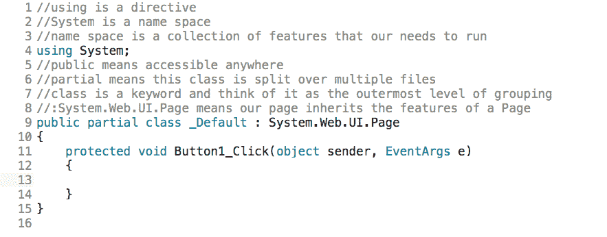
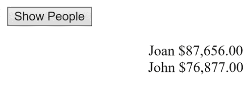

# c#与 LINQ 和自定义数据类型

在本章中，我们将讨论在自定义类型中使用 LINQ。

# 向 HTML 添加一个 Show People 按钮

提出一个项目。 转到`Default.aspx`，在以`with <form id=...`开头的线下面，放入一个按钮。 为此，转到“工具箱”，抓取一个`Button`控件，并将其拖动到其中。 将按钮上的文字改为 Show People:

```cs
<asp:Button ID="Button1" runat="server" Text="Show People" />
```

# 建立数据库

我们会有一个数据库，我们会查询它，我们会显示那些人，例如，他们的名字里有一个字母，赚了一定数量的钱，然后按照一定的方式排序。

为此，转到 Design 视图，并双击 Show People 按钮。 这把我们带入了`Default.aspx.cs`。 删除`Page_Load`块。 这个项目开始代码的相关部分应该类似于图 10.5.1:



Figure 10.5.1: The starting code section for this project

在下一阶段，首先转到文件的顶部，在`using System`之后输入以下内容:

```cs
using System.Linq;
```

接下来，我们将制作一个类。 我们称之为`Person`。 因此，在以`public partial class...`开头的行之上，插入以下内容:

```cs
public class Person
```

# 使用 LINQ 创建自定义类型

现在，在前一行下面的花括号中，你将声明两个 auto 属性，如下所示:

```cs
public string Name { get; set; }
public decimal Salary { get; set; }
```

然后，要创建一个构造函数，在下面这几行输入以下代码:

```cs
public Person(string name, decimal salary)
```

接下来，您将在构造函数中设置属性的值。 因此，在这几行下面的一组花括号之间输入以下内容:

```cs
Name = name; Salary = salary;
```

这是我们简单的自定义类型`Person`，在参数化构造函数中有两个自动属性。

# 安排了一群人

在下一个阶段，你将创造一群人; 在以`protected void Button1_Click....`开头的行下面的一组花括号之间输入以下内容:

```cs
Person[] people = new Person[] { new Person("John", 76877), new Person("Bobby", 78988), new Person("Joan", 87656) };
```

# 查询数组

现在，要查询这个，在这行下面输入以下内容:

```cs
IEnumerable<Person> peopleWithN = people.Where(per => per.Name.EndsWith("n")).OrderByDescending(per => per.Salary);
```

当你输入时，注意到`IEnumerable`没有显示出来，所以你必须再次到文件的顶部，在`using System.Linq`之后输入以下内容:

```cs
using System.Collections.Generic;
```

下面我们来利用这个; 所以，在以`Person[] people...`开头的行下面，输入前面提到的行`IEnumerable<Person>...`。

这里，`Person`是一种可以从人员列表中枚举的对象类型。 `peopleWithN`表示我们将寻找姓名中有`n`字母的人。 实际上，代码搜索的是姓名以`n`结尾的人。 (注意，`per`代表列表中的每个人。) 此外，我们按薪资降序排序。

Because people sometimes type information inconsistently, you first have to convert everything to the equivalent case, but this is something for you to figure out on your own.

记住，在这一行中，我们有`people`，这是某种对象的名称，还有`Where`，一个扩展方法，后面跟着一个 Lambda。 接下来，我们使用`OrderByDescending`(您可以从方法列表中选择它)来按降序排列值，比如一个人的工资。

所以，这一行的目的是选择名字以`n`结尾的每个人，然后按薪水排序。 这样就产生了一个`IEnumerable`对象，当然，现在你可以遍历它，并在下一行中这样说:

```cs
foreach(Person p in peopleWithN)
```

现在，要打印所有内容，在这一行下面的一组花括号之间输入以下内容:

```cs
sampLabel.Text += $"<br>{p.Name} {p.Salary:C}";
```

这里，我们将变量`Name`放在首位，将变量`Salary`格式化为 Currency。

# 运行程序

这是我们项目的核心。 在浏览器中打开它。 点击 Show People 按钮，显示结果，如图*所示。图 10.5.2*



Figure 10.5.2: The results of running the program

琼赚了 87656.00 美元，约翰赚了 76877.00 美元。 选择它们是因为它们的名称都以小写**n**结尾，如您所见，然后按薪水降序排序。 所以，它像预期的那样工作。 如您所见，您还可以使用 LINQ 定义自定义类型，例如在`public class Person`下面的花括号内的类型。 它是非常强大和工作良好。

# 章回顾

为了便于审阅，本章的`Default.aspx.cs`文件的完整版本，包括注释，如下代码块所示:

```cs
//using is a directive
//System is a name space
//name space is a collection of features that our needs to run
using System;
using System.Linq;
using System.Collections.Generic;
//public means accessible anywhere
//partial means this class is split over multiple files
//class is a keyword and think of it as the outermost level of grouping
//:System.Web.UI.Page means our page inherits the features of a Page
public class Person
{
    public string Name { get; set; } //auto implemented properties
    public decimal Salary { get; set; }
    public Person(string name, decimal salary)
    {
        Name = name; Salary = salary;//set values of properties
    }
}
public partial class _Default : System.Web.UI.Page
{
    protected void Button1_Click(object sender, EventArgs e)
    {
        //make array of people
        Person[] people = new Person[] { new Person("John", 76877), 
                                         new Person("Bobby",78988), 
                                         new Person("Joan", 87656) };
        //find all people with "n" as the last letter, and then display 
        //the results sorted from high to low salary
        IEnumerable<Person> peopleWithN = 
        people.Where(per => per.Name.EndsWith("n")).OrderByDescending
        (per => per.Salary);
        //display name and salary formatted as currency
        foreach (Person p in peopleWithN)
        {
            sampLabel.Text += $"<br>{p.Name} {p.Salary:C}";
        }
    }
}
```

# 总结

在本章中，我们讨论了在自定义类型中使用 LINQ。 您可以设置一个数据库，使用 LINQ 创建一个自定义类型，设置一个人员数组，并查询该数组。

在下一章中，您将学习如何使用查询语法编写查询。