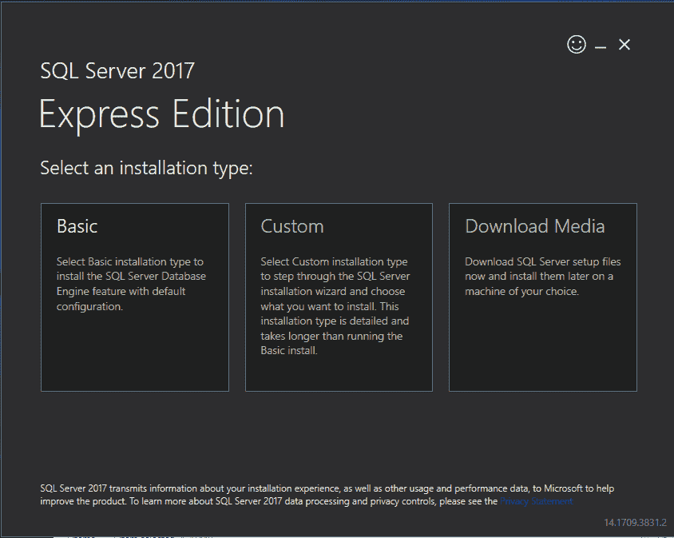
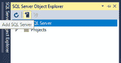
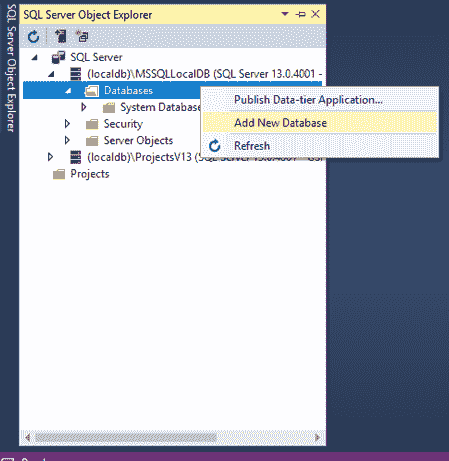
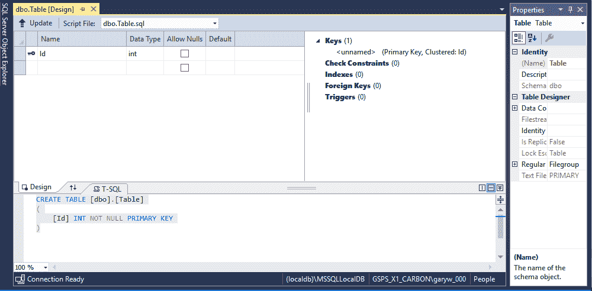
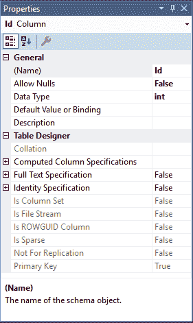
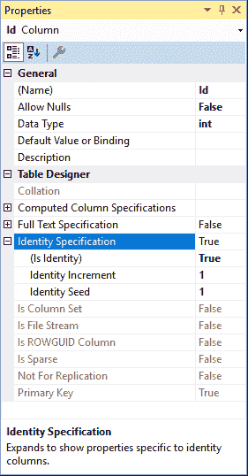
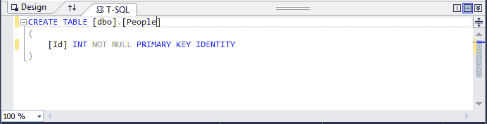
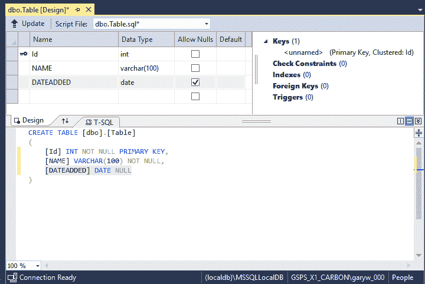
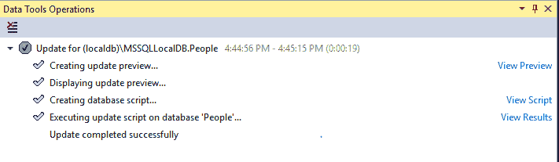

# 十六、下载、安装和运行 SQL Server 2017

在本章中，您将下载、安装和运行 SQL Server 2017 Express。

# 下载 SQL Server 2017 express

点击以下链接进入下载 SQL Server 2017 Express 的站点，如图*所示:*

[https://www.microsoft.com/en-us/sql-server/sql-server-editions-express](https://www.microsoft.com/en-us/sql-server/sql-server-editions-express)


Figure 16.1.1: Download screen for SQL Server 2017 Express edition

接下来，单击“立即下载”按钮。 下载完成后，双击`SQL Server2017-SSEI-Expr.exe`。 在“用户帐户控制”界面中回答“是”。

# 选择安装类型

接下来，需要选择安装类型，如图 16.1.2*图 16.1.2*所示。 选择基本安装并接受许可条款协议:



Figure 16.1.2: Select the Basic installation from the installation type screen

# 安装包

接下来，要么接受默认安装位置，要么选择自己的安装位置。 然后安装包将下载并安装程序。 在安装过程中要有耐心，因为它是一个大程序，可能需要一些时间。

当安装完成后，您将看到如图 16.1.3 所示的屏幕:


Figure 16.1.3: The installation has completed successfully

# 在 Visual Studio 中使用 SQL 服务器

下载并安装 SQL server 之后，让我们在 Visual Studio 中查看一下它。 转到视图，然后选择 SQL Server 对象资源管理器; 它将在左侧打开一个小窗格，如图*所示:*


Figure 16.1.4: The SQL Server Object Explorer pane in Visual Studio

接下来，点击 Add SQL Server 按钮，如图*所示:*



Figure 16.1.5: The Add SQL Server Button

现在，出现图 16.1.6 中所示的对话框。 注意这里写的是 Windows 身份验证。 这被称为*集成安全性*。 您不必指定不同的用户名和密码。 只需填写服务器名称字段，点击连接，你将登录到它:


Figure 16.1.6: The Connect dialog box

您所拥有的特定版本将不同于图 16.1.7 中所示的版本，但这些是适用于许多不同版本的基本内容:


Figure 16.1.7: The Databases folder specific to this version of SQL Server 2017 Express

# 创建 SQL server 数据库

现在，我们将创建一个数据库。 为此，展开 Databases 文件夹并右键单击它。 选择 Add New Database，如图 16.1.8 所示，将数据库命名为`People`:



Figure 16.1.8: Adding a new database

# 添加和定义一个表

现在，展开 People 节点，然后在其中，您将看到一个名为 Tables 的文件夹。 再次展开 Tables 节点，因为您必须添加自己的表。 您的 SQL Server 对象资源管理器窗格应该看起来像一个显示在*图 16.1.9*:


Figure 16.1.9: The SQL Server Object Explorer pane with the People node and the Tables node expanded

现在，右键单击 Tables 文件夹并选择 Add New Table。 由此进入表定义阶段，如图*图 16.1.10*所示:



Figure 16.1.10: Table Definition screen

这就是定义表的地方。 看看第一个带有小键的字段，它出现在屏幕截图左上角附近。 此键将用于标识记录或表的行，并在您希望启用自动生成时使用。 换句话说，您希望分配给每个记录的号码自动生成，这样您就不必跟踪它。

因此，如果您右键单击该键并选择 Properties，它将打开屏幕右侧的面板，如图*图 16.1.11*所示:



Figure 16.1.11: The Table properties panel

现在，看看它说的身份规范。 展开该节点，然后在它显示 Is Identity 的地方，从下拉菜单中选择 True。 从*图 16.1.12*可以看出，Identity Increment 为 1,Identity Seed 为 1，这很好。 因此，它从 1 开始，每添加一条新记录，记录数只增加 1。 注意，它还会自动更改 Code 视图。



Figure 16.1.12: Setting the Identity Specification

现在，在屏幕底部的 T-SQL 窗口中，显示`CREATE TABLE [dbo].[Table]`。 如果您将`[Table]`改为`[People]`，那么现在就是表名，如图*图 16.1.13*所示:



Figure 16.1.13: Changing the Name of the table

在下一行中，`[Id]`是列或字段的名称; `INT`为数据类型，`NOT NULL`为必须指定的条目，`PRIMARY KEY`用于标识记录; 您现在已经知道了`IDENTITY`是什么，正如您在前面的步骤中看到的那样。

# 向表中添加字段

现在，您将添加自己的字段和列。 所以接下来，输入以下内容:

```cs
[NAME] VARCHAR(100) NOT NULL
```

这是`NAME`字段，数据类型为`varchar`，代表变量字符。 这基本上是一个文本字段，因此将长度指定为`100`，并且因为应该指定条目，所以我们将其设置为`NOT NULL`。

让我们再添加一个字段。 为此，输入以下命令:

```cs
[DATEADDED] DATE NULL
```

这里，`DATE ADDED`是添加记录的日期，`DATE`是数据类型。 您的屏幕应该类似于图 16.1.14 中所示的*。*

同样，如果不想要空值，可以在 Design 窗口中取消这些选项。 因此，设计选项卡中的表视图和代码视图交互:



Figure 16.1.14: Two fields, NAME and DATEADDED, have been added to the table

这里，需要注意的一点是标签上的 T-SQL。 好的，SQL 是*结构化查询语言*，而微软的版本是 T-SQL 或*事务式结构化查询语言*。 核心功能基本相同，但微软版本增加了一些功能。

# 更新数据库结构

现在您必须更新事物的结构，因此单击屏幕右上角的 update 按钮。 给它一秒钟时间来更新所有内容，然后单击 update Database 按钮。

从*图 16.1.15*可以看出，更新成功完成:



Figure 16.1.15: The database update is complete and successful!

现在，在左侧的 SQL Server 对象资源管理器窗格中，如果展开 dbo。 People，然后展开 Columns，您可以看到默认字段或列以及您创建的新字段或列，如图*图 16.1.16*所示:


Figure 16.1.16: The columns we created in dbo.People

# 章回顾

在前面的屏幕截图中，从顶部开始，第二个向下的项表示一个服务器(SQL server)。 然后，在其中，您拥有 People 图标所指示的数据库。 在展开数据库时，有一个表图标、一个列图标和一个表示主键的键图标。 所以，使用的小图标是有意义的。 它们表示这个数据库结构中不同层次的嵌套。

这些是基本的。

所以，确保你能重新创造这一切。 退出此窗口，然后单击“查看”并转到“开始页面”。 然后，做以下工作:

1.  打开“SQL Server 对象资源管理器”窗格。
2.  右键单击 SQL Server。
3.  从下拉菜单中选择“断开”。
4.  再次右键单击，并从下拉菜单中选择 Add SQL Server。
5.  浏览您的服务器。
6.  单击 Connect 屏幕底部的 Connect 按钮。
7.  展开服务器以显示`Databases`文件夹。
8.  展开`Databases`文件夹，在那里您可以看到`People`数据库。
9.  打开`Tables`文件夹，这里是`dbo.People`表。

# 总结

在本章中，您下载、安装并运行了 SQL Server 2017 Express。 您在 Visual Studio 中使用 SQL Server，将两者连接起来，创建一个 SQL Server 数据库，添加并定义一个表，向表添加字段，并更新数据库的结构。

在下一章中，您将学习如何连接到 SQL Server，然后在一个网页中显示数据库表中的记录。