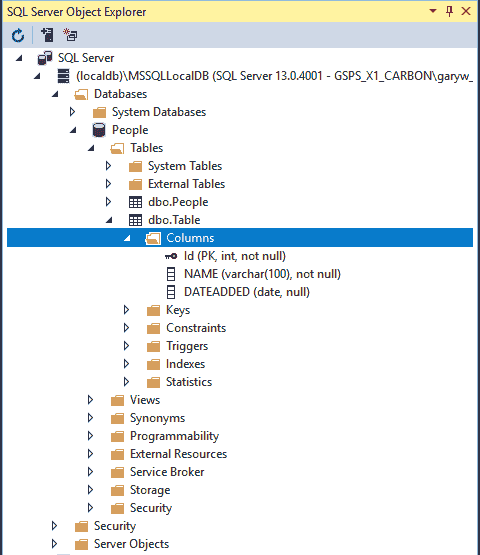
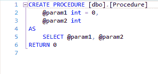
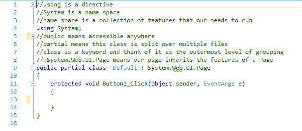
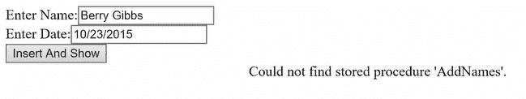

# 使用存储过程将记录插入表中

在本章中，您将学习如何使用存储在 SQL Server 的`Programmability`文件夹中的*存储过程*将记录直接插入到表中。 我们将通过 HTML 页面中的文本框来实现。

# 向 HTML 添加文本框和按钮

启动一个项目。 首先，让我们在页面中放入几个框。 为此，在以`<form id= ....`开头的行下输入以下内容:

```cs
Enter Name:<asp:TextBoxID="TextBox1" runat="server"></asp:TextBox><br />
Enter Date:<asp:TextBoxID="TextBox2" runat="server"></asp:TextBox><br />
```

对于`Name`字段，它只是一个文本框。 对于文本，换句话说，我们会使用字符串。 转到“工具箱”，抓取一个`TextBox`控件，并将其拖动到其中。 对于日期，我们将尝试从该框解析为日期时间。

您的`Default.aspx`屏幕现在看起来应该与*图 18.3.1*所示类似:


Figure 18.3.1: The Default.aspx screen for this chapter

记住，我们有两个框，我们输入值，并将它们保存到表中。 这就是我们的目标。

接下来，我们也在这里放一个按钮。 因此，再次转到工具箱，抓取一个按钮，并将其拖放到这些行下面。 更改按钮上的文本，使其更有帮助，例如，说`Insert And Show`。

因此，当您单击该按钮时，您将插入新的记录，并且还将显示这些记录，以确认它与现有的记录一起保存。

# 检查您已经在 SQL Server 中创建的内容

接下来，打开 SQL Server 对象资源管理器屏幕。 现在，请记住，您创建了一个名为`People`的数据库，其中还有一个名为`People`的表。 此外，在其中有一个名为`Id`的列。 这是主键。 记住，它是自动增加的，所以你不需要指定 ID。 也就是说，它会自动为你完成。

接下来有两个字段:一个是`NAME`，另一个是`DATEADDED`; `NAME`为`varchar(100)`，`DATEADDED`为`date`型。 两个值都必须提供，这就是为什么它说`not null`。 到目前为止，SQL Server 对象管理器屏幕显示在*图 18.3.2*:



Figure 18.3.2: The SQL Server Object Explorer screen for the database People

# 创建一个新的存储过程

现在，展开可编程性文件夹。 有一个文件夹叫*Stored Procedures*。 右键单击它，并选择 Add New Stored Procedure... . 这是基本的存储过程代码:



Figure 18.3.3: The default Stored Procedure screen

要使用存储过程，首先需要重命名它。 为此，将顶部一行中的`[Procedure]`改为`[AddName]`，如下所示:

```cs
CREATE PROCEDURE[dbo].[AddName]
```

如您所见，它只是一些代码驻留在 SQL Server 中。 然后，例如，您可以执行该代码来在数据库表中执行某些操作。

在本例中，我们将使用这个过程将记录插入到表中。 我们需要参数，因为我们将输入两个值。 因此，编辑存储过程的接下来两行，如下所示:

首先，将`param1`更改为`Name`，并更改默认值`int = 0`，并将数据类型赋值为`varchar(100)`。

对于下一行，将`param2`更改为`DateAdded`，它是`date`类型。 这是两个参数:

```cs
@Name varchar(100), 
@DateAdded date
```

现在，因为您不会选择记录，相反，您将*插入*记录，因此，我们将输入一个`insert`语句，然后输入以下语句来代替`SELECT`行:

```cs
insert into People (NAME,DATEADDED) values (@Name,@DateAdded)
```

这里，您将`insert into`创建`People`数据库，然后创建应该接收新信息的字段列表，即`NAME`和`DATEADDED`。 然后输入`values`，然后输入参数列表`@Name`和`@DateAdded`。

请记住，这个 line 函数中的参数与之前创建的函数类似。 当你用 c#编写函数时，通过它们，值被传递到函数中。 同样的原则也适用于这里。 通过参数，将值传递到存储过程的主体中，在这种特殊情况下，将字段值直接插入到表中。 这里，将`@Name`和`@DateAdded`值传递给`NAME`和`DATEADDED`。 这就是我们的目标。

完整的存储过程如图*图 18.3.4*所示:


Figure 18.3.4: The stored procedure, dbo.AddName

# 更新数据库结构

现在，让我们更新事物的结构; 因此，单击 Update 按钮，然后单击对话框中的 Update Database，如图 18.3.5*图 18.3.5*所示。


Figure 18.3.5: Preview database update dialog box

更新后，展开“可编程性”文件夹，然后展开“存储过程”文件夹。 在那里，你看到`dbo.AddName`。 现在，如果展开`dbo.AddName`，就会出现一个参数列表:`@Name`和`@DateAdded`。

现在，我们来利用一下我们已经做过的。 单击`Default.aspx`选项卡，然后进入 Design 视图，双击 Insert and Show 按钮。 这把我们带入`Default.aspx.cs`。 删除`Page_Load`存根。 对于这个项目，我们将从图 18.3.6 中所示的代码开始:



Figure 18.3.6: The starting code for this project

# 添加一个名称空间

同样，为了在 SQL Server 中使用此功能，您必须添加一个名称空间。 因此，转到文件的顶部，在`using System`下，输入以下内容:

```cs
using System.Data.SqlClient;//commands and connections 
```

当然，这将用于命令和连接，您将它们作为注释填写。 我们将在这一行下面再做一次，所以输入下面的内容:

```cs
using System.Data;
```

这条线路也符合我们的目的。 这将有很多代码，但它是高度顺序的—从上到下非常自然地进行，它将为您完成这项工作。

现在，每次单击按钮时，您都希望清除标签，以便输出不会继续累积; 因此，在以`protected void Button1_Click...`开头的行下的一组花括号中，输入以下内容:

```cs
sampLabel.Text = "";
```

# 构建连接字符串

在下一阶段，你想要得到连接字符串; 因此，在下面一行中，首先输入`string connString =`，然后输入`@`符号，使其成为一个逐字字符串，然后输入`""`符号。 现在，要获取连接字符串，执行以下操作:

1.  单击菜单栏中的“查看”，然后选择“SQL Server 对象资源管理器”。
2.  右键单击`People`数据库，然后选择 Properties。
3.  在“属性”窗格中，双击“连接字符串”以选择它及其较长的描述。
4.  然后，右键单击长描述并复制它。
5.  将描述粘贴到一组`""`符号之间。

连接字符串行应该如下所示:

```cs
string connString = @"Data Source=(localdb)\MSSQLLocalDB;Initial Catalog=People;Integrated Security=True;Connect Timeout=30;Encrypt=False;TrustServerCertificate=True;ApplicationIntent=ReadWrite;MultiSubnetFailover=False";
```

现在可以关闭 SQL Server 对象资源管理器和属性窗格。

# 初始化连接

在下一阶段，因为我们正在访问硬盘读取和保存记录，所以输入以下内容:

```cs
using (SqlConnection conn = new SqlConnection(connString))
```

这就是初始化连接的方式。 如果右键单击`SqlConnection`并选择 Go to Definition，它会显示它属于`DbConnection`类型，并且它继承自`SqlConnection`。 现在，如果右键单击`DbConnection`并选择 Go To Definition，它会显示它实现了`IDisposable`。 然后，如果右键单击`IDisposable`并选择 Go To Definition，它会显示“执行与释放、释放或重置非托管资源相关的应用程序定义的任务”。 因此，例如，对于从硬盘中获取信息而打开的低级别通道，你必须确保它们被正确地清除。 现在可以关闭此窗口。

# 捕获异常

接下来，因为在使用数据库时可能会出现各种各样的问题，所以需要对数据库进行`try`处理，然后`catch`处理任何异常。 为此，在前一行的左花括号下面，输入以下内容:

```cs
try
{

}
catch (Exception ex) 
```

在这里，为了能够显示一些诊断信息，我实际上添加了更多`catch (Exception ex)`。 接下来，在它下面的一组花括号中，输入以下内容:

```cs
sampLabel.Text = $"{ex.Message}";
```

我们使用这一行只是为了显示诊断信息。

# 尝试命令

现在，让我们进入`try`部分。 这里是一切都可能发生的地方。 首先，让我们制定一个命令。 在`try`下的花括号之间输入以下内容:

```cs
SqlCommand cmd = new SqlCommand();
```

接下来，您将设置命令的类型，因此输入以下命令:

```cs
cmd.CommandType = CommandType.StoredProcedure;
```

这句话本身就说明了一切。

现在，为了让文本选择要调用的特定存储过程，您需要输入以下命令:

```cs
cmd.CommandText = "AddName";
```

记住，`AddName`是我们在 SQL Server 中所称的过程。

# 添加参数

现在，对于下一阶段，我们将添加所谓的*参数*。 换句话说，您必须确保将值实际传递到存储过程中，以便将它们保存在表中。 因此，输入以下内容:

```cs
cmd.Parameters.AddWithValue("@Name", TextBox1.Text);
```

这里，我们从参数的名称`@Name`开始，然后它的值将来自第一个框:`TextBox1.Text`。

接下来，您将重复这个逻辑，因此输入以下内容:

```cs
cmd.Parameters.AddWithValue("@DateAdded", DateTime.Parse(TextBox2.Text));
```

这里，`@DateAdded`是参数的名称，下一个阶段来自第二个框:`TextBox2.Text`。 这一行将转换方框中的值，假设它可以转换为`DateTime`对象，以便与数据库中的`@DateAdded`类型匹配。 这就是我们采取这一步骤的原因。

当然，在更现实的情况下，您可能想尝试`DateTime.TryParse`。 但是，为了避免过于复杂，我们将使用`DateTime.Parse`。

接下来输入以下内容:

```cs
cmd.Connection = conn;
```

您必须设置`conn`属性。 我们在靠近文件顶部的以`using(SqlConnection conn...`开头的行中创建了这个。

对于下一行，输入以下命令打开连接:

```cs
conn.Open();
```

# 保存信息以供以后检索

在下一阶段，我们将执行`NonQuery`。 为此，输入以下内容:

```cs
cmd.ExecuteNonQuery();
```

这一行将保存信息。 现在，从这里开始，当您想要检索信息时，请确保它按预期工作。 我们只需将命令类型切换为`Text`类型的`CommandType`，因此输入下面的命令:

```cs
cmd.CommandType = CommandType.Text;
```

接下来，我们将指定文本，因此输入以下内容:

```cs
cmd.CommandText = "select * from dbo.People";
```

这里，`select *`表示从`People`数据库中选择所有内容。

然后，输入以下内容:

```cs
using (SqlDataReader reader = cmd.ExecuteReader())
```

# 认识到索引器的作用

现在，我要给你们看一些我之前没有给你们看的东西。 将鼠标悬停在`ExecuteReader`上。 这会返回一个`SqlDataReader`类。 现在，右键单击前面一行中的`SqlDataReader`并选择 Go To Definition。 你还记得我们之前学习索引器的时候吗? 看看它说的 public override object this[string name]。 如果展开它，它会说它获取指定列的值及其给定列名的本机格式。 如果返回，下一个定义读取 public override object this[int i]。 如果展开这个，它说，在给定列序号(这里是列序号)的情况下，以其原生格式获取指定列的值。 因此，`public override object...`行指的是当前的`SqlDataReader`对象。 这基本上是一个索引器。 现在您可以看到索引器确实发挥了作用。 你现在可以把它关掉了。

为了使用这些信息，在前一行`using`的一组花括号之间输入下面的 next:

```cs
while(reader.Read())
```

然后，在这一行下面的一组花括号之间，输入以下内容:

```cs
sampLabel.Text += $"<br>{reader[0]}, {reader[1]}, {reader[2]}";
```

这里，在`sampLabel.Text...`之后，指定`reader[0]`、`{reader[1]}`和`{reader[2]`，这是索引访问的三列。

现在您已经输入了程序的核心。

# 运行程序

现在，让我们看看结果。 在浏览器中打开它。 首先，输入一些值:`Name`的值`Berry Gibbs`，日期，然后单击 Insert and Show 按钮。 结果见图 18.3.7:


Figure 18.3.7: The initial results of running our program

所以，这就是我们所期望的。 现在，我们再试一个。 为`Name`输入`Mark Owens`，添加日期，然后再次单击插入和显示按钮。 正如您在图 18.3.8 中所看到的，它已经被自动添加。 这确认它已经被保存到表中，然后进一步，我们可以检索它:


Figure 18.3.8: The modified results of running the program

所以，这些是获得连接的基础。

现在考虑这个。 想象一下，在前面一行中，我把`AddName`换成了`cmd.CommandText = "AddNames"`。 换句话说，我拼错了存储过程的名称。 如果我在浏览器中打开这个选项(如图*图 18.3.9*所示)，它显示，String 未被识别为有效的 DateTime。 这是有用的,对吗? 我没有填入`Name`或`Date` 所以它不能转化为`DateTime`:


Figure 18.3.9: The results of running the program with no values entered

现在，即使我输入了`Name`和`Date`的值，它也会显示，无法找到存储过程'AddNames'，如图*图 18.3.10*所示，因为我拼错了存储过程的名称:



Figure 18.3.10: The results of running the program with the misspelled the name of the stored procedure

因此，对于`try`行，因为它之后的所有命令都可能生成某种类型的错误，至少您可以捕获它并显示错误消息，并且您将能够知道发生了什么。 所以，它非常有用。

# 章回顾

为了便于审阅，本章的`Default.aspx.cs`文件的完整版本，包括注释，如下代码块所示:

```cs
//using is a directive
//System is a name space
//name space is a collection of features that our needs to run
using System;
using System.Data.SqlClient;//commands and connections
using System.Data;
//public means accessible anywhere
//partial means this class is split over multiple files
//class is a keyword and think of it as the outermost level of grouping
//:System.Web.UI.Page means our page inherits the features of a Page
public partial class _Default : System.Web.UI.Page
{
    protected void Button1_Click(object sender, EventArgs e)
    {
        sampLabel.Text = "";
        string connString = @"Data Source=DESKTOP-4L6NSGO\SQLEXPRESS;Initial Catalog=People;Integrated Security=True;Connect Timeout=15;Encrypt=False;TrustServerCertificate=False;ApplicationIntent=ReadWrite;MultiSubnetFailover=False";
        //put conn in a using so it can be properly closed and disposed of
        using (SqlConnection conn = new SqlConnection(connString))
        {
            try
            {
                //make sql command
                SqlCommand cmd = new SqlCommand();
                //specify type
                cmd.CommandType = CommandType.StoredProcedure;
                //write name of stored procedure inside SQL Server as  
                //the name here
                cmd.CommandText = "AddName";
                //read the field box 1, and pass in through @Name
                cmd.Parameters.AddWithValue("@Name", TextBox1.Text);
                //pass in date through @DateAdded
                cmd.Parameters.AddWithValue("@DateAdded", 
                DateTime.Parse(TextBox2.Text));
                //set connection property of command object
                cmd.Connection = conn;
                //open connection
                conn.Open();
                //execute the stored procedure
                cmd.ExecuteNonQuery();
                //change command type to just plain text
                cmd.CommandType = CommandType.Text;
                //write a simple SQL select statement
                cmd.CommandText = "select * from dbo.People";
                //execute reader
                using (SqlDataReader reader = cmd.ExecuteReader())
                {
                    //Read() returns true while it can read
                    while(reader.Read())
                    {
                        //reader[0] means get first column, 
                        //reader uses an indexer to do this
                        sampLabel.Text += $"<br>{reader[0]}, {reader[1]}, {reader[2]}";
                    }
                }
            }
            catch(Exception ex)
            {
                sampLabel.Text = $"{ex.Message}";
            }
        }
    }
}
```

# 总结

在本章中，您学习了如何使用存储过程将记录直接插入到表中，并存储在 SQL Server 的可编程性文件夹中。 您创建了一个新的存储过程、更新了数据库结构、构建了连接字符串、初始化了连接、尝试了命令和捕获了异常、添加了参数、保存了信息以供以后检索，并识别了索引器的作用。

在下一章中，您将学习如何使用`nullable`关键字来确保仍然可以将丢失值的记录带入应用程序，例如。