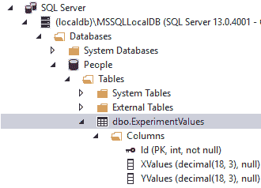
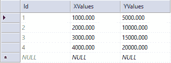
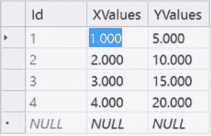
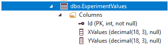

# 使用 LINQ 操作 SQL Server 中的表

在本章中，您将学习如何将 LINQ 与 SQL 和 SQL Server 结合使用。

# 更改 ExperimentValues 表中的数据

我们将使用在上一章中创建的数据库表`ExperimentValues`，如图*图 21.6.1*所示:



Figure 21.6.1: The ExperimentValues table from chapter 20

请记住，该表有一个`Id`字段(PK，主键整数，非 null)，然后是`XValues (decimal, (18, 3)`，这意味着 18 个单位宽，小数点后 3 位，然后向左 15 个单位，总共 18 个单位。 如果你愿意，你可以做这个`null`。 `YValues, (decimal, (18, 3)`; 小数点右 3 位，左 15 位，总共 18 个单位。

现在确保你有数据在里面。 因此，右键单击`dbo.ExperimentValues`并选择 View Data。 您应该能看到我们在前一章中输入的数据。 当然，你可以随时改变它。 为了让事情更简单，让我们将值更改为图 21.6.2 中所示的值:



Figure 21.6.2: The new data for the ExperimentValues table

如果您愿意，可以重新加载它以查看是否已保存。 这就是简单的数据库表。

# 汇总的字段

现在我们将深入研究并总结其领域。 您将使用 LINQ 找到`X`值和`Y`值的和。 首先，进入<html>并在以`<form id= ....`开头的行下面放置一个按钮。 进入工具箱(*Ctrl*+*Alt*+*X*)，抓取一个`Button`控件，并将其拖动到工具箱中。 将按钮上的文本更改为 Sum Fields。 当然，还可以执行其他几个操作。 这只是一个运算:求和。

关闭“工具箱”并切换到“设计”视图。 双击 Sum Fields 按钮。 这把我们带入了`Default.aspx.cs`。 删除`Page_Load`块。 此项目启动代码的相关部分应该类似于图 21.6.3:


Figure 21.6.3: The starting code section for this project

# 添加名称空间

首先，在靠近文件顶部的`using System`下，输入以下几行，所有这些都是必要的:

```cs
using System.Data.SqlClient;
using System.Linq;
using System.Data;
```

# 构建连接字符串

下一阶段将连接字符串,所以在一组花括号线下始于`protected void Button1_Click...`,进入`string connString =`首先,紧随其后的是`@`象征逐字字符串,然后你把`""`符号。 现在要获取连接字符串，执行以下操作:

1.  单击菜单栏中的“查看”，然后选择“SQL Server 对象资源管理器”。
2.  右键单击`People`数据库，然后选择 Properties。
3.  在“属性”窗格中，双击“连接字符串”以选择具有长描述的连接字符串。

4.  然后右键单击长描述并复制它。
5.  将描述粘贴在一组`""`符号之间。

连接字符串行应该如下所示:

```cs
string connString = @"Data Source=(localdb)\MSSQLLocalDB;Initial Catalog=People;Integrated Security=True;Connect Timeout=30;Encrypt=False;TrustServerCertificate=True;ApplicationIntent=ReadWrite;MultiSubnetFailover=False";
```

现在可以关闭 SQL Server 对象资源管理器和属性窗格。

# 创建 SQL 连接

在下一阶段，我们将照常进行。 因此，输入以下一行:

```cs
using (SqlConnection conn = new SqlConnection(connString))
```

注意，当您输入这个时，您将看到文件顶部的`using System.Data.SqlClient;`行中的`SqlClient`变为活动的。 它变成了黑色。 这意味着 SQL 连接存储在那里，如果将鼠标悬停在它上面，它还会告诉您情况是这样的:class System.Data.SqlClient.SqlConnection

在下一阶段，在这一行下面的一组花括号之间输入以下内容:

```cs
SqlCommand command = new SqlCommand("select * from dbo.ExperimentValues", conn);
```

在`SqlCommand()`后面的圆括号之间，将定义该命令的文本作为参数直接放入构造函数中。 记住，你已经有了`ExperimentValues`。 符号表示选择所有列。 因此，您需要命令文本，然后是连接。

# 做一个适配器

接下来，您将制作一个适配器。 因此，输入以下内容:

```cs
SqlDataAdapter adapter = new SqlDataAdapter(command);
```

这里，`SqlDataAdapter`是存在于实际数据库和我们之间的东西。 可以说，这是一种将信息从这里调整到那里的方法。 要初始化它，可以传入一个特定的 SQL 命令。 因此，在我们的例子中，我们将传入`(command)`。 您可以在这一行后面添加注释`//make adapter`。

# 制作数据表

接下来，您将创建一个数据表，如下所示:

```cs
DataTable dt = new DataTable();
```

再次注意，一旦键入`DataTable`，文件顶部的`using System.Data;`命名空间就会激活。 因此，如果将鼠标悬停在`DataTable`上，它会显示 class System.Data.DataTable。 这是储存它的地方。 因此，它被存储在`Data`名称空间中。

# 用数据填充表

现在我们需要用一些信息填充这个表。 因此，输入以下内容:

```cs
adapter.Fill(dt);
```

在这里，您键入适配器的名称，然后键入要填充的数据集。 因此，使用这三行代码，首先创建一个适配器并使用 SQL 命令获取信息，然后创建一个数据表。 然后使用适配器填充该表。 现在我们可以这样利用它:

```cs
var summedXValues = dt.AsEnumerable().Sum(row => row.Field<decimal>(1));
```

这里，我们可以把这个数据表变成可枚举的，这样我们就可以遍历它。 注意，我们使用`=>`将一个 Lambda 表达式放入其中; `<decimal>`是数据类型，然后，如果将鼠标悬停在`<decimal>()`之后的括号上，工具提示将显示(`DataColumn column`):提供对指定行的每个列值的强类型访问。 所以，在括号中插入一个 1。

接下来，为`summedYValues`变量输入以下内容，注意我们在圆括号之间放了一个 2:

```cs
var summedYValues = dt.AsEnumerable().Sum(row => row.Field<decimal>(2));
```

一旦您输入了所有这些，然后您可以显示`x`和`y`值的总和，所以接下来输入以下几行:

```cs
sampLabel.Text = $"Sum of y values={summedYValues}";
sampLabel.Text += $"<br>Sum of x values={summedXValues}";
```

# 显示求和值

在前面的几行中，注意第一行不需要`<br>`标记，但是下一行需要。 另外，第一行只需要`=`，而下一行需要`+=`追加。

# 运行程序

记住，这个想法是求和字段，所以打开浏览器，点击求和字段按钮:


Figure 21.6.4: The initial results of running our program

你可以看到 Y 值的和是 50.000,X 值的和是 10.000。 您可以通过打开 SQL Server Object Explorer 窗格，右键单击`ExperimentValues`表，并将值相加，如图*图 21.6.5*所示:



Figure 21.6.5: Add the values in the X and Y columns

XValues 列加起来是 10.000,YValues 列加起来是 50.000。 这两个和都与程序运行的结果进行校验。

关闭`ExperimentValues`表窗口和 SQL 对象资源管理器窗格。 这和预期的一样。

# 添加注释

现在在连接字符串行上面添加这条注释:

```cs
//make connection string
```

在处理低级资源时，应用一个`using`块。 在以`using (SqlConnection conn...`开头的行上面添加以下注释:

```cs
//make connection object
```

请记住，其目的是正确地制作、使用和处理它，以便不存在剩余的内存泄漏。 例如，在处理硬盘访问时就这样做。

在以`SqlCommand command =...`开头的行上面添加以下注释:

```cs
//make SQL command
```

然后，在以`sqlDataAdapter adapter...`开头的行之上添加以下注释，以强调适配器的用途:

```cs
//make adapter object and pass in the command
```

另外，在该行的末尾添加以下注释:

```cs
//make adapter
```

接下来，对于`DataTable dt...`，添加以下注释:

```cs
//make table
```

适配器是允许我们填充表的机制，所以在`adapter.Fill(dt);`行末尾添加以下注释:

```cs
//fill table with adapter
```

接下来，在第 30 行上面添加以下注释:

```cs
//lines 30 - 31 use LINQ to sum each column
```

最后，在第 33 行上面添加以下注释:

```cs
//lines 33-34 display the results in the web page
```

在下面一行中，注意这里的字段是`decimal`，因为这是我们在 SQL Server 中创建它的方式，1 表示第一个字段，索引是 1。 但是，请记住，这实际上是指第二列，因为有三列:

```cs
var summedXValues = dt.AsEnumerable().Sum(row => row.Field<decimal>(1));
```

从图 21.6.6 中可以看出，Id 实际上是索引 0,XValues 是索引 1,YValues 是索引 2。 这就是为什么我们在这里使用 1 和 2，因为这里有三列，第二列的下标是 1:



Figure 21.6.6: Id is index 0, XValues is index 1, and YValues is index 2

# 章回顾

本章的完整版本`Default.aspx.cs`文件，包括注释，显示在下面的代码块中。

```cs
//using is a directive
//System is a name space
//name space is a collection of features that our needs to run
using System;
using System.Data.SqlClient;
using System.Linq;
using System.Data;
//public means accessible anywhere
//partial means this class is split over multiple files
//class is a keyword and think of it as the outermost level of grouping
//:System.Web.UI.Page means our page inherits the features of a Page
public partial class _Default : System.Web.UI.Page
{
    protected void Button1_Click(object sender, EventArgs e)
    {
        //make connection string
        string connString = @"Data Source=DESKTOP-4L6NSGO\SQLEXPRESS;Initial Catalog=People;Integrated Security=True;Connect Timeout=15;Encrypt=False;TrustServerCertificate=False;ApplicationIntent=ReadWrite;MultiSubnetFailover=False";
        //make connection object
        using (SqlConnection conn = new SqlConnection(connString))
        {
            //make sql command
            SqlCommand command = new SqlCommand("select * from dbo.ExperimentValues", conn);
            //make adapter object and pass in the command
            //make adapter
            SqlDataAdapter adapter = new SqlDataAdapter(command);
            //make table
            DataTable dt = new DataTable();
            adapter.Fill(dt); //fill table with adapter
            //lines 30 - 31 use linq to sum each column
            var summedXValues = dt.AsEnumerable().Sum(row => row.Field< 
            decimal>(1));
            var summedYValues = dt.AsEnumerable().Sum(row => row.Field< 
            decimal>(2));
            //lines 33-34 display the results in the web page
            sampLabel.Text = $"Sum of y values={summedYValues}";
            sampLabel.Text += $"<br>Sum of x values={summedXValues}";
        }
    }
} 
```

# 总结

在本章中，您学习了如何将 LINQ 与 SQL 和 SQL Server 结合使用。 你改变了`ExperimentValues`表中的数据,编写代码总结使用 LINQ 的字段,添加名称空间,建立了连接字符串,使 SQL 连接,适配器,数据表,表填充数据,总结值显示,运行程序,最后添加评论。

在下一章中，你将学习如何制作一个页面，将页面中的内容保存到硬盘上，然后再读回来。