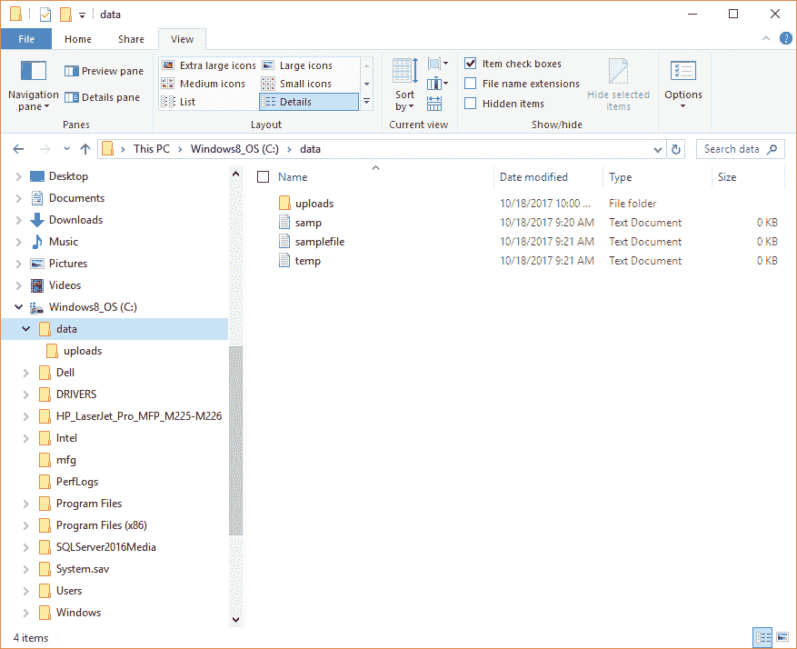
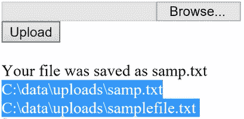
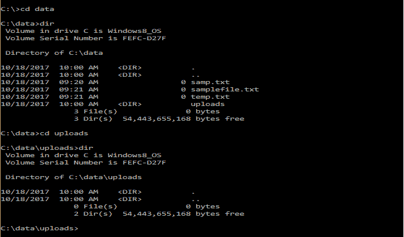
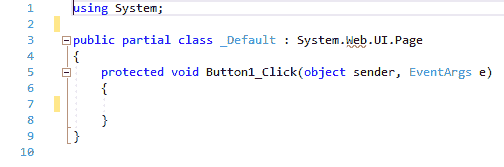
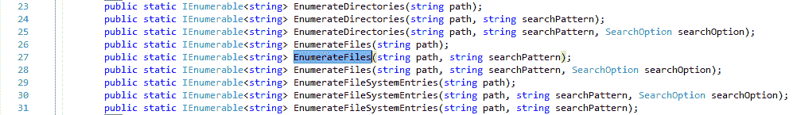

# 创建使用文件上传控件的页面

在本章中，你将学习如何使用 ASP.NET 中的上传功能。 为此，我们将在页面上创建一个包含以下控件的界面:


Figure 23.2.1: The controls for our user interface

当您单击 Browse 按钮时，您应该得到一些示例文件，如图 23.2.2 所示。 选择其中一个文件，例如`samp.txt`:



Figure 23.2.2: The C:\data directory file listing

现在,当你点击上传按钮,一旦上传文件,浏览器将显示一条消息中所示的图 23.2.3*,显示已经上传的文件,有多少文件目录内,和他们的姓名。 这是我们的目标:*

 *

Figure 23.2.3: Message displayed when the Upload button is clicked

确保您在硬盘的根目录中有一个文件夹`data`，并且在该文件夹中有另一个文件夹`uploads`。 要在命令行级别执行此操作，请转到命令提示符(`C:\`)，并遵循以下步骤:

1.  输入`cd..`切换到根目录。
2.  然后，输入`cd data`，按*进入*。
3.  在`C:\data`目录下，键入`dir`，如下所示:

```cs
 C:\data\dir
```

4.  在`C:\data`目录下，键入`cd uploads`，如下所示:

```cs
 C:\data\cd uploads
```

5.  在`C:\data\uploads`目录，再次键入`dir`:

```cs
 C:\data\cd uploads\dir
```

您的屏幕将看起来类似于图 23.2.4 所示:



Figure 23.2.4: Command line directory listing of C:\data\uploads

现在让我们实现它。

# 从头开始我们的项目

让我们从头开始做一个新项目。 去文件|新|网站…; 然后，转到解决方案资源管理器，单击`Default.aspx`。

现在我们可以看到一个基本的 HTML。 让我们将一个`FileUpload`控件放入其中。 为此，转到“工具箱”，抓取一个`FileUpload`控件，并将其拖放到以`<form id=...`开头的行下面，并向其添加一个`<br/>`标记，如下所示:

```cs
<asp:FileUploadID ="FileUpload1" runat="server" /><br/>
```

接下来，让我们在这条线下面添加一个按钮，如下所示:

```cs
<asp:Button ID="Button1" runat="server" Text="Upload" /><br /> 
```

更改按钮上的文本，使其显示更有意义的内容，例如`Upload`。

删除这两行`<div>`—您将不再需要它们。

当您转到 Design 视图时，您将看到这个简单的界面，如图 23.2.5 所示。 你有一个浏览按钮，这是上传控件的一部分，所以它不需要单独放在那里，还有一个上传按钮:


Figure 23.2.5: The simple interface for our project

现在，双击 Upload 按钮。 这将把你带入`Default.aspx.cs`。 删除`Page_Load`块。 这个项目开始代码的相关部分应该类似于图 23.2.6:



Figure 23.2.6: The starting code for this project

# 添加一个名称空间

要读取文件，首先在文件顶部附近的`using System`后面插入以下内容:

```cs
using System.IO;
```

# 将文件保存到特定位置

您需要做的第一件事是指定一个应该保存文件的位置。 因此，在以`protected void Button1_Click...`开头的行下面的一组花括号之间输入以下内容:

```cs
string savePath = @"c:\data\uploads\";
```

这里，`savePath`是将保存文件的路径名。 您输入`@`符号来生成一个逐字字符串，而`c:\data\uploads`是将其保存的位置。 请记住，如果您删除了`@`符号，就会导致错误，因为这意味着要完全按照字符串的本来样子读取字符串。

接下来，输入以下内容:

```cs
if(FileUpload1.HasFile)
```

这里，`HasFile`是一个简单的属性。 然后，你可以这样说(在一组花括号之间):

```cs
{
    string fileName = FileUpload1.FileName;
}
```

这一行获得文件名，这里，`FileName`也是一个属性。

现在，输入以下内容:

```cs
savePath += fileName;
```

因此，`savePath`首先是文件夹结构，然后将文件名附加到它上。

# 保存文件

现在，要真正保存文件，输入以下命令:

```cs
FileUpload1.SaveAs(savePath);
```

记住，任何时候你想要学习更多的这些术语，你可以这样做。 右键单击它们，选择 Go To Definition。 例如，如图*图 23.2.7*所示，如果展开`public void SaveAs`行，则显示将上传文件的内容保存到 Web 服务器上的指定路径。 此外，它还会抛出异常，因此存在错误的可能性。 记住这一点。


Figure 23.2.7: The explanation of SaveAs within Go To Definition

# 向用户显示消息

接下来，让我们向用户显示一些有用的诊断消息。 为此，输入以下内容:

```cs
sampLabel.Text = "<br>Your file was saved as " + fileName;
```

另一种可能性是没有文件。 所以，换句话说，`FileUpload1.HasFile`是假的。 如果是这种情况——没有文件，您可以将前面的行粘贴到下面，并更改文本以使其有意义。 在前一个大括号下键入`else`，然后输入以下内容:

```cs
{
   sampLabel.Text = "<br>You did not specify a file to upload.";
} 
```

# 确定哪些文件存储在一个目录中

接下来，让我们看看目录中有哪些文件。 因此，在前一行的右括号下面输入以下内容:

```cs
string sourceDirectory = @"C:\data\uploads";
```

同样，您将从前面以`String savePath...`开头的行的相同位置获得它，并将`c:\data\uploads\`粘贴到这里。

接下来，你在接下来的一行上键入`try`，然后在它下面的一组花括号之间输入以下内容:

```cs
{
   var txtFiles = Directory.EnumerateFiles(sourceDirectory, "*.txt");
}
```

在输入`EnumerateFiles`时出现的工具提示表明有两个重载——`string path`和`string searchPattern`。 因此，这里的路径将是`sourceDirectory`，而`searchPattern`将用于搜索以`.txt`结尾的所有内容。 因此我们把`*.txt`放在最后。 这就是枚举所有文件的方法。

# 确定返回类型

如果将鼠标悬停在前面一行中的`var`上，弹出的工具提示将告诉您返回类型是什么。 上面写着`IEnumerable`。 现在将鼠标悬停在`EnumerateFiles`上，右键单击它，选择转到定义:



Figure 23.2.8: In the definition, it shows that the return type is IEnumerable

如图 23.2.8 所示，返回类型为`IEnumerable`，这意味着您可以遍历结果，或者使用`foreach`语句显示结果。

接下来，在前一行下面输入以下内容:

```cs
foreach(string currentFile in txtFiles)
```

然后在这下面，输入以下(缩进):

```cs
sampLabel.Text += $"<br>{currentFile}";
```

# 探索 EnumerateFiles 的例外

现在，再次将鼠标放在`EnumerateFiles`上，右键单击它，并选择 Go To Definition。 展开定义并查看它可能引发的异常。 其中有很多，其中的一个采样如图*图 23.2.9*所示:


Figure 23.2.9: A partial listing of the exceptions that EnumerateFiles can throw

例如，`DirectoryNotFound`可能是一个常见的异常; `path`是文件名，`PathTooLong`和`SecurityException`也是常见的异常。 所以`EnumerateFiles`有很多。

# 捕获异常

换句话说，您需要插入某种类型的`catch`来处理这些事情。 因此，在最后一个右花括号后输入以下内容:

```cs
catch(Exception ex)
```

现在，在一组花括号中，输入以下内容:

```cs
{
    sampLabel.Text += ex.Message;
}
```

这里，`ex.Message`表示来自要显示在屏幕上的异常对象的消息。

# 运行程序

现在让我们确认这将工作，所以在浏览器中打开它。 单击 Browse，从`C:\data`目录中抓取`temp.txt`文件。 点击上传。 正如您在图 23.2.10 中所看到的，您的文件已经被保存，并且在同一目录中还有其他文件。 完美!


Figure 23.2.10: The results of running our program

现在，假设你犯了如下错误(输入`upload`而不是*uploads*):

```cs
string sourceDirectory = @"C:\data\upload";
```

如果您再次运行它，通过单击 Browse 并选择`samplefile.txt`文件，您可以从图 23.2.11 所示的错误消息中看到，它无法找到路径的一部分… ：


Figure 23.2.11: Error message displayed when the path is incorrectly entered

这些是基本的工作原理。 同样，请确保输入并运行此代码几次，然后您就会确切地知道发生了什么。 请记住，我们可以安全地这样做，因为网页只能在我们的本地计算机上访问。 在更现实的情况下，您需要更多地关注安全性并防范恶意上传。

# 章回顾

本章的完整版本`Default.aspx.cs`文件，包括注释，如下代码块所示:

```cs
using System;
using System.IO;
public partial class _Default : System.Web.UI.Page
{
    protected void Button1_Click(object sender, EventArgs e)
    {
        string savePath = @"c:\data\uploads\"; //make upload directory
        if (FileUpload1.HasFile)
        {
            string fileName = FileUpload1.FileName;//get file name
            savePath += fileName;//attach file name to save path
            FileUpload1.SaveAs(savePath);//save file
            sampLabel.Text = "<br>Your file was saved as " + fileName;
        }
        else
        {
            sampLabel.Text = "<br>You did not specify a file to upload.";
        }
        //could also use savePath here
        string sourceDirectory = @"C:\data\uploads";
        try
        {
            //list files using EnumerateFiles
            var txtFiles = Directory.EnumerateFiles(sourceDirectory,
            "*.txt");
            foreach (string currentFile in txtFiles) //display files
            sampLabel.Text += $"<br>{currentFile}";
        }
        //display any error messages
        catch (Exception ex)
        {
            sampLabel.Text += ex.Message;
        }
    }
} 
```

# 总结

在本章中，您学习了如何使用 ASP.NET 中的上传功能。 将文件保存到特定位置，向用户显示消息，确定目录中存储哪些文件，研究`EnumerateFiles`的异常，并编写代码来捕获异常。

在下一章中，您将学习另一种使用序列化在硬盘上保存对象的方法。 然后，您将了解从硬盘重新构建对象的过程，该过程称为**反序列化**。*