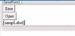
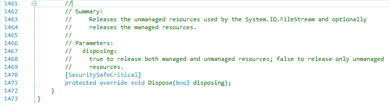
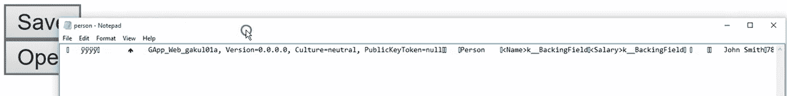
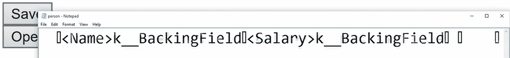

# 二十四、序列化和反序列化对象

在本章中，您将学习另一种将对象保存到硬盘驱动器的方法—序列化。 您还将了解从硬盘重新构建对象的过程，这称为反序列化。

# 向 HTML 添加两个按钮

打开一个项目，在本例中，您将在页面中插入两个按钮。 您将把第一个按钮放在以`<form id=...`开头的行下面。 为此，转到“工具箱”，抓取一个`Button`控件，并将其拖动到其中。 将第一个按钮上的文字改为`Save`。 现在抓住另一个按钮，并将其拖放到这条线的下面。 将第二个按钮上的文字改为`Open`。 所以你在页面中放置两个按钮，如下所示:

```cs
<asp:ButtonID="Button1" runat="server" Text="Save" /><br/>
<asp:ButtonID="Button2" runat="server" Text="Open" /><br/>
```

删除这两行`<div>`—您将不再需要它们。 当然，在最后你也有一个标签:

```cs
<asp:LabelID="sampLabel" runat="server"></asp:Label>
```

在 Design 视图中，如图*图 24.3.1*所示，有两个按钮——save 和 open，然后是一个标签，用来显示打开的对象:



Figure 24.3.1: Our simple interface in the Design view

# 开始对项目进行编码

首先，我们将创建`Save`按钮，双击它，这将打开`Button1_click`的事件处理程序。 删除`Page_Load`块。 此项目的启动代码的相关部分应该类似于图 24.3.2:


Figure 24.3.2: The starting code for this project

# 添加名称空间

接下来，您需要添加新的名称空间，因此在靠近文件顶部的`using System`下，输入以下内容:

```cs
using System.IO;
```

显然，这一行用于输入和输出。 接下来，输入以下内容:

```cs
using System.Runtime.Serialization.Formatters.Binary;
```

这一行允许您执行代码的编写。 在我们一起编写代码时，您将更好地理解这些名称空间的用途。 接下来，我们再做一个，如下:

```cs
using System.Diagnostics;
```

需要这一行只是为了您可以打开记事本。 在文件以二进制格式保存后，您将使用记事本查看该文件。 如果愿意，现在可以折叠这些名称空间。

# 创建可序列化的类

因此，首先需要一些可以序列化的东西——一个可序列化的类。 您将把它放在前面的`using`语句下面。 输入以下:

```cs
[Serializable()]
```

您可以这样装饰类。 接下来，要序列化的东西在这个下面输入，如下所示:

```cs
public class Person
```

# 向可序列化类添加特性

这是您的可序列化类。 接下来，您将向它添加特性。 因此，在这一行下面的一组花括号之间，输入以下内容:

```cs
public string Name { get; set; }
public decimal Salary { get; set; }
```

接下来，我们将重写一个方法，以便我们可以显示一个人并实际格式化它。 因此，输入以下内容:

```cs
public override string ToString()
```

现在，如果将鼠标悬停在`ToString`上，您将看到它是一个对象类。 记住，对象类是整个层次结构的父类。 这就是定义`ToString`的地方。 工具提示说 string object.ToString()。 我们现在重写它，写出我们自己的定义。

接下来，在`override`行下面的一组花括号之间输入以下内容:

```cs
return $"{Name} makes {Salary:C} per year.";
```

这将是我们具体实施的`ToString`; 也就是说，`Name`每年赚一定数量的钱，无论`Person`每个班的名字和薪水是多少。

# 定义保存文件的路径

接下来，在以`protected void Button1_Click...`开头的行下面的一组花括号中，输入以下内容:

```cs
string file = @"c:\data\person.bin"; 
```

在这里，您将定义文件保存的路径。 注意，这一次我们使用的是不同的扩展名——`.bin`用于二进制，而不是`.txt`用于文本。

# 制作 Person 对象

接下来，要创建一个新的`Person`对象，输入以下内容:

```cs
Person per = new Person() { Name = "John Smith", Salary = 78999 };
```

记住，创建对象的另一种方法是可以在花括号中设置属性的值。 这里我们有`John Smith`和他的`Salary`财产价值。 这样，我们就得到了一个`new Person`物体。

# 处理非托管资源

现在，输入以下内容:

```cs
using (FileStream str = File.Create(file))
```

将鼠标悬停在前一行的`FileStream`上，查看它的位置; 它在里面`System.IO`。 注意，`using System.IO;`不再是灰色的，因为`FileStream`现在在那里。

接下来，右键单击`FileStream`并选择 Go To Definition。 你可以看到它是从`Stream`衍生出来的。 现在，如果你向下滚动到底部，上面写着`Dispose`，然后展开，你会看到它写着“释放系统. io . filestream 使用的非托管资源……” 图 24.3.3:



Figure 24.3.3: Expanded definition of FileStream

这就是为什么我们把它放在`using`语句中，因为它处理非托管资源，比如低级磁盘访问。 因此，我们将创建一个文件。

# 创建二进制格式化程序

接下来，您将创建一个二进制格式化程序，因此在一组花括号之间输入以下内容:

```cs
BinaryFormatter binFormatter = new BinaryFormatter();
```

同样，`BinaryFormatter`这里是一个类，所以如果将鼠标悬停在该类上，工具提示将显示“序列化和反序列化一个对象”，或者以二进制格式显示连接对象的整个图形。

# 序列化一个对象

接下来，要序列化我们的对象，你说`binFormatter.Serialize`，这是一个定义在这里的函数，然后你需要一个流和一个对象(`per`)通过流序列化:

```cs
binFormatter.Serialize(str, per);
```

为了确认这是有效的，在右花括号下面输入以下内容:

```cs
Process.Start("notepad.exe", file);
```

这将启动文件，以便我们确认它已被保存。

# 测试程序

在编写其余代码之前，我们可以对其进行测试。 所以让我们在浏览器中启动它，点击保存*:*



Figure 24.3.4: A test run of the program to make sure that it works

现在您可以看到，当您检查它时，保存的内容看起来与纯文本非常不同。 记住，当您学习属性时，我们讨论了*支持字段*。 字段的实际值见图 24.3.5。 您可以看到薪水、名称值，然后是字段。 这就是我们所说的*二进制*。 它看起来与纯文本非常不同:


Figure 24.3.5: The Backing Field shows the actual values of the field

# 从硬盘重新构建对象

在下一阶段，我们希望能够从硬盘重新构建该对象。 为此，双击 Design 视图中的 Open 按钮。 这将把您带回到`Default.aspx.cs`文件。

现在，在以`protected void Button2_Click...`开头的行下面的一组花括号中，您将创建一个新的`Person`对象，如下所示:

```cs
Person personRebuilt;
```

我们从硬盘上构建这个。 接下来，在这一行下面输入以下内容:

```cs
string file = @"c:\data\person.bin";
```

通过这一行，我们将从该文件中读取。

接下来，您必须确认该文件实际存在，因此输入以下内容:

```cs
if(File.Exists(file))
```

如果文件存在，您将采取一些操作，而这些操作将是重新构建对象的操作。

现在在这一行下面的一组花括号之间输入以下内容:

```cs
using (FileStream personStream = File.OpenRead(file))
```

在这里，我们打开文件进行读取。 将鼠标悬停在`OpenRead`上。 注意，它返回一个`FileStream`类，因此表达式的左右两边是一致的。

接下来，在这一行下面的另一组花括号中，输入以下内容:

```cs
BinaryFormatter binReader = new BinaryFormatter();
```

现在，我们将重新构建`Person`对象，因此输入下面的内容:

```cs
personRebuilt = (Person)binReader.Deserialize(personStream);
```

这将是一个类型转换为`Person`类型。 然后，将`personStream`传入在二进制读取器上定义的`Deserialize`函数，然后将其强制转换回`Person`对象。

# 显示结果

现在，有了这些，我们就可以显示东西了。 例如，输入如下 next:

```cs
sampLabel.Text = personRebuilt.ToString();
```

记住，这一行中的`ToString`是在`Person`中定义的。 它覆盖了在对象内部定义的基本`ToString`方法。 如果你将鼠标悬停在这里的`ToString`上，它会显示字符串 Person.ToString()。

# 运行程序

现在让我们在浏览器中打开这个新代码。 点击 Save 按钮，打开记事本，如图*所示*



Figure 24.3.6: The results of running the program when the Save button is clicked

现在单击 Open 按钮，如图*所示。图 24.3.7*:


Figure 24.3.7: The results of running the program when the Open button is clicked

因此，这证明了对象已经构造，而且还确认了在这个重建的对象`personRebuilt`上，您可以调用在`return $"{Name} makes {Salary:C} per year.";`行中类定义中阐明的常用函数、方法等。

# 章回顾

回顾一下，请记住这里的主要思想是可以从一个对象开始，并添加许多名称空间，特别是`BinaryFormatter`和`IO`。 接下来，定义一个类，并添加下面的可序列化属性。 然后编写代码以二进制格式保存，也编写代码以从二进制格式重构到您可以在应用中使用的格式。

本章的完整版本`Default.aspx.cs`文件，包括注释，如下代码块所示:

```cs
//using is a directive
//System is a name space
//name space is a collection of features that our needs to run
using System;
using System.IO;
using System.Runtime.Serialization.Formatters.Binary;
using System.Diagnostics; //for notepad
//public means accessible anywhere
//partial means this class is split over multiple files
//class is a keyword and think of it as the outermost level of grouping
//:System.Web.UI.Page means our page inherits the features of a Page
[Serializable()]
public class Person //make class serializable
{
    public string Name { get; set; } //define name property
    public decimal Salary { get; set; } //define Salary property
    public override string ToString() 
    //override ToString() from object class
    {
        //return pretty string to describe each person
        return $"{Name} makes {Salary:C} per year.";
    }
}
public partial class _Default : System.Web.UI.Page
{
    protected void Button1_Click(object sender, EventArgs e)
    {
        //define path where file will be saved
        string file = @"c:\data\person.bin";
        //build an object
        Person per = new Person() { Name = "John Smith", Salary = 78999 };
        //enclose FileStream in a using because of low level access
        using (FileStream str = File.Create(file))
        {
            //make a formatter
            BinaryFormatter binFormatter = new BinaryFormatter();
            //this is the step that saves the information
            binFormatter.Serialize(str, per);
        }
        //start notepad and display file
        Process.Start("notepad.exe", file);
    }
    protected void Button2_Click(object sender, EventArgs e)
    {
        //person object to hold the rebuild person from disk
        Person personRebuilt;
        string file = @"c:\data\person.bin"; //path
        if(File.Exists(file)) //first confirm file exists
        {
            //enclose FileStream in a using
            using (FileStream personStream = File.OpenRead(file))
            {
                //make a formatter
                BinaryFormatter binReader = new BinaryFormatter();
                //reconstruct person using a cast
                personRebuilt = 
                (Person)binReader.Deserialize(personStream);
                //invoke to string on the person
                sampLabel.Text = personRebuilt.ToString();
            }
        }
    }
}
```

# 总结

在本章中，您学习了另一种将对象保存到硬盘驱动器的方法—序列化。 然后，您了解了从硬盘反序列化重新构建对象的过程。 您创建了一个`serializable`类，向该类添加了一些特性，定义了保存文件的路径，创建了`Person`对象，编写了处理非托管资源的代码，创建了一个二进制格式化器，序列化了一个对象，并测试了您的程序。

在下一章中，您将了解如何处理像素级的图像。 我们把颜色倒过来，改变一下。