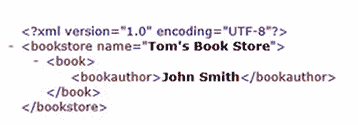
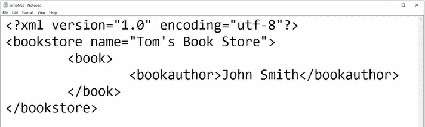

# 二十八、使用 C# 创建 XML 文件

在本章中，您将学习如何将 XML 写入文件，然后在记事本和 Internet Explorer 中查看结果。

# 向 HTML 添加一个按钮

启动一个项目，并在 HTML 页面中放置一个按钮。 要做到这一点,查看|工具箱(**Ctrl + Alt*-【显示】X),`but`在搜索字段,类型和拖拽线下面的`Button`控制始于`<form id=...`。 将按钮上的文字改为`Save File`。*

 *接下来，转到 Design 视图。 双击“保存文件”按钮。 这将在`Default.aspx.cs`中打开事件处理程序。 删除`Page_Load`存根。 折叠上面和下面的所有评论`using System;`-你不需要它们。 此项目的启动代码的相关部分应该类似于图 28.2.1:


Figure 28.2.1: The starting code for this project

# 添加名称空间

首先，让我们添加一些名称空间。 在文件顶部附近的`using System`后输入以下内容:

```cs
using System.Xml;
using System.Diagnostics;
```

您需要`using System.Diagnostics;`以便您可以在创建文件后立即在 Internet Explorer 和记事本中查看文件。

# 编码 XmlWriter 设置

接下来，您将进行`XmlWriter`设置。 因此，在以`protected void Button1_Click...`开头的行下面的一组花括号之间输入以下内容:

```cs
XmlWriterSettings settings = new XmlWriterSettings();
```

在这一行中，创建该类的设置对象，然后设置特性。 接下来输入以下内容:

```cs
settings.Indent = true;
```

在这一行下面输入以下内容:

```cs
settings.IndentChars = "\t";
```

这里，`"\t"`是一个标签。

# 写入硬盘

现在，因为`XmlWriter`类使用硬盘驱动器等，所以需要将其包含在`using`语句中。 因此，输入以下内容:

```cs
using (XmlWriter writer = XmlWriter.Create(@"c:\data\sampfile2.xml", settings))
```

您将在硬盘驱动器上创建一个文件`c:\data \sampfile2.xml`，然后传入要使用的设置。 settings 对象作为参数传递给定义在`XmlWriter`内部的`Create`函数。

在下一阶段，我们将实际写入，因此在一组花括号之间输入以下内容:

```cs
writer.WriteStartElement("bookstore");
writer.WriteEndElement();
```

使用第二行，立即关闭`WriteStartElement`方法。 我们在这里添加了一个结构。

现在您将在这两行之间添加几行代码。 首先编写一个属性字符串，如下所示:

```cs
writer.WriteAttributeString("name", "Tom's Book Store");
```

接下来，您将创建另一个元素。 在这里，如果您缩进代码，将会很有帮助，这表明`book`元素在`bookstore`元素下面。 为此，输入以下内容:

```cs
writer.WriteStartElement("book");
```

要写入的元素是`book`。 接下来输入以下内容:

```cs
writer.WriteStartElement("bookauthor");
```

现在让我们做以下操作来关闭它:

```cs
writer.WriteEndElement();
```

你这样做是为了让终点和起点成对出现。

现在，在此(在`WriteEndElement`行之上)中，您可以编写另一个元素。 在这一行中，您将包括特定的图书作者。 同样，您将编写一个字符串，作者的名字将是值。 输入以下:

```cs
writer.WriteString("John Smith");
```

这里，请注意，因为`WriteAttribute`不同于`WriteString`。 `WriteString`位于标签之间，而`WriteAttribute`给出了一个属性，所以这是不同的。 这对于我们的目的已经足够了。

# 格式化结果

现在你要确保结果看起来不错。 因此，在最后一行`WriteEndElement`下的右花括号外，输入以下内容:

```cs
Process.Start("notepad.exe", @"c:\data\sampfile2.xml");
```

您将在记事本中查看结果，然后需要文件的路径，因此从前面的`using`行、`c:\data\sampfile2.xml`行复制该路径，并将其粘贴到这一行中。

我们再做一个。 基本上，只需重复这一行，并将其内容`notepad.exe`改为`iexplore.exe`，如下所示，以表明接下来应该使用 Internet Explorer:

```cs
Process.Start("iexplore.exe", @"c:\data\sampfile2.xml");
```

# 运行程序

现在让我们在浏览器中打开它并查看结果。 点击保存文件按钮，你会看到它在 ie 浏览器中的样子:



Figure 28.2.2: The results of running the program as they appear in Internet Explorer

可以看到，它具有结构，结果甚至是可折叠的，正如 XML 标记前的-符号所表明的那样，当然也可扩展。 书店的名称是 Tom's book store，这是一个属性，然后是作者 John Smith，这是一个位于图书作者标记或元素之间的字符串。

同样，在 Notepad 中，它看起来像图 28.2.3 中所示的屏幕，使用正确格式化的 XML:



Figure 28.2.3: The results of running the program as they appear in Notepad

这些是做这些运算的基础。

# 章回顾

本章的完整版本`Default.aspx.cs`文件，包括注释，如下代码块所示:

```cs
//using is a directive
//System is a name space
//name space is a collection of features that our needs to run
using System;
using System.Xml;
using System.Diagnostics;
//public means accessible anywhere
//partial means this class is split over multiple files
//class is a keyword and think of it as the outermost level of grouping
//:System.Web.UI.Page means our page inherits the features of a Page
public partial class _Default : System.Web.UI.Page
{
    protected void Button1_Click(object sender, EventArgs e)
    {
        //make a setting object
        XmlWriterSettings settings = new XmlWriterSettings();
        //set indent to true
        settings.Indent = true;
        //use tabs for indenting
        settings.IndentChars = "\t";
        //create file to write to
        using (XmlWriter writer = 
        XmlWriter.Create(@"c:\data\sampfile2.xml", settings))
        {
            //outermost element
            writer.WriteStartElement("bookstore");
            //attribute of book store
            writer.WriteAttributeString("name", "Tom's Book Store");
                //new element called book
                writer.WriteStartElement("book");
                    //new element called author
                    writer.WriteStartElement("bookauthor");
                    //this goes between the author tags
                    writer.WriteString("John Smith");
                writer.WriteEndElement();
            writer.WriteEndElement();
        }
        //priview the files in notepad and internet explorer
        Process.Start("notepad.exe", @"c:\data\sampfile2.xml");
        Process.Start("iexplore.exe", @"c:\data\sampfile2.xml");
    }
}
```

# 总结

在本章中，您学习了如何将 XML 写入文件，然后在记事本和 Internet Explorer 中查看结果。 您编写了`XmlWriter`设置，并编写了将其写入硬盘驱动器以及格式化结果的代码。

在下一章中，您将学习如何结合 LINQ 和 XML 来实现更实用的东西。*