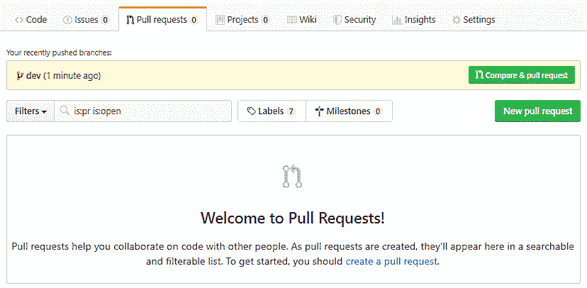
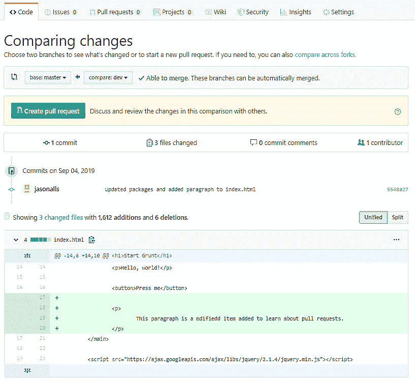
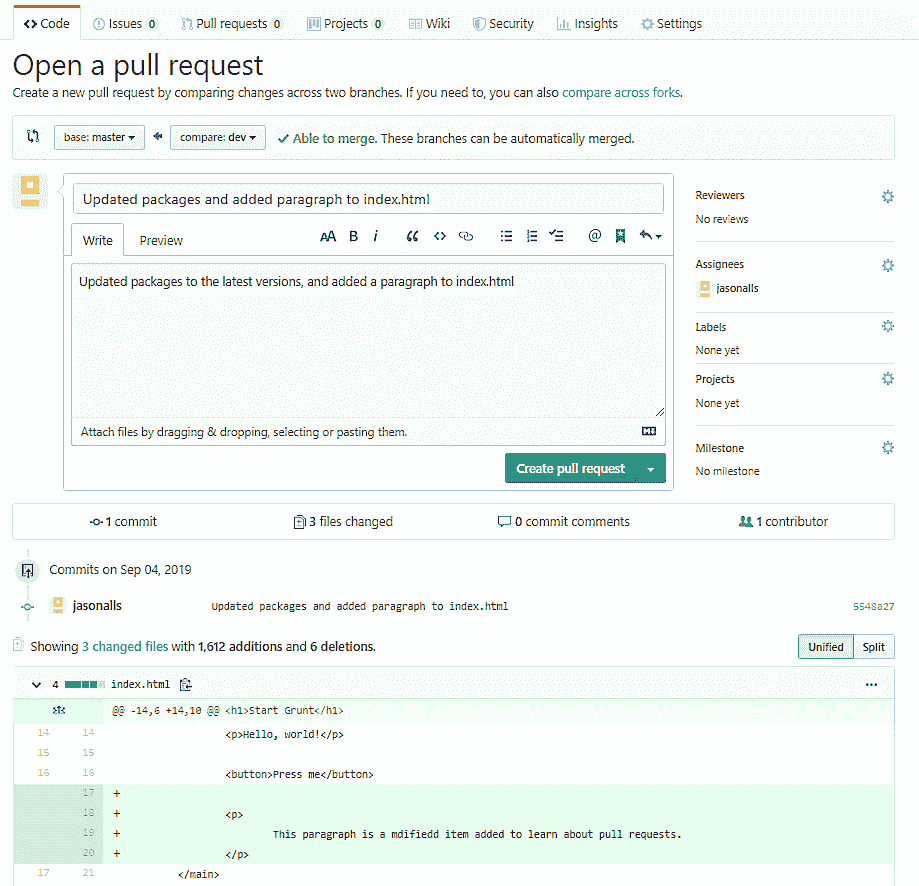
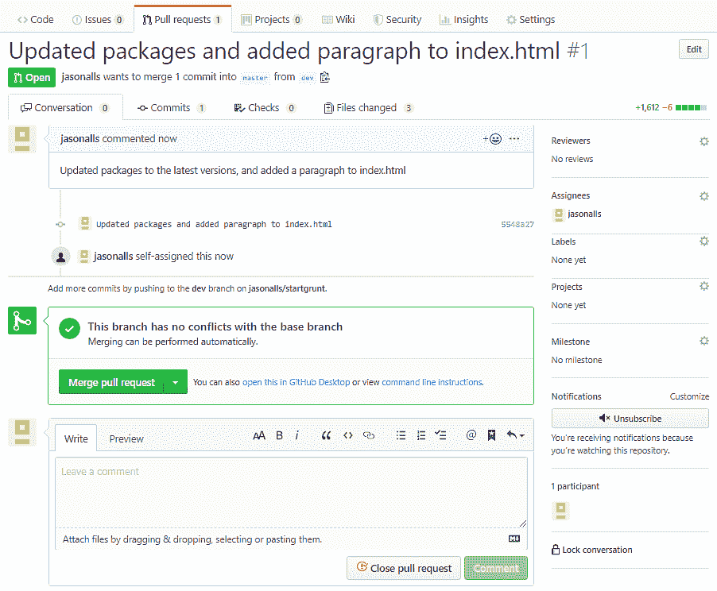
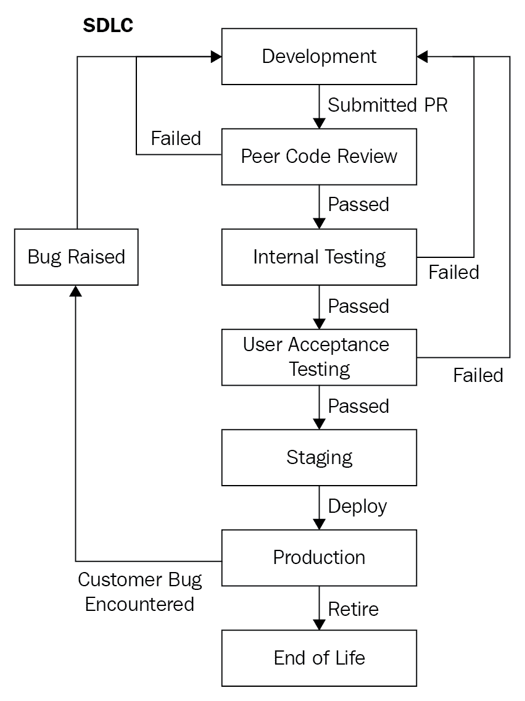
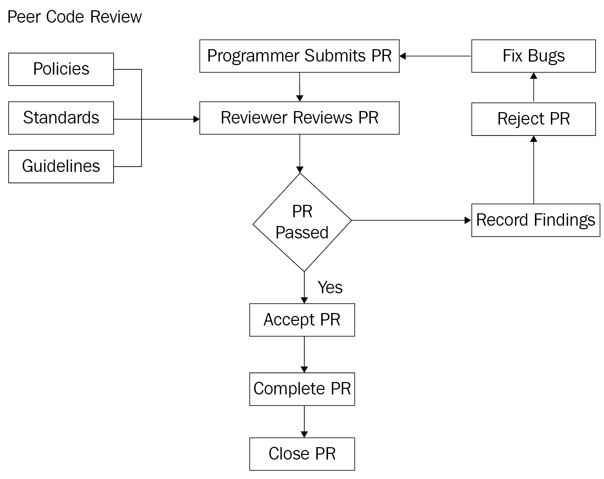

Code Review – Process and Importance

任何代码审查背后的主要动机都是提高代码的总体质量。代码质量非常重要。这几乎是不言而喻的，尤其是如果您的代码是团队项目的一部分，或者其他人可以访问，例如开源开发人员和客户可以通过托管协议访问您的代码。

如果每个开发人员都可以随心所欲地编写代码，那么最终您将得到以多种不同方式编写的相同类型的代码，最终代码将变得一团糟。这就是为什么制定一项编码标准政策非常重要，该政策概述了公司的编码实践和要遵循的代码审查程序。

进行代码审查时，同事将审查其他同事的代码。同事们会明白，只有人类才会犯错误。他们将检查代码是否有错误，是否有违反公司编码行为准则的编码，以及任何在语法正确的情况下可以改进以使其更可读、更易维护或更具性能的代码。

因此，在本章中，我们将涵盖以下主题，以详细了解代码审查过程：

*   准备代码以供审阅
*   领导代码评审
*   知道复习什么
*   知道何时发送代码以供审阅
*   提供并回应评审反馈

Please note that for the *Preparing code for review* and *Knowing when to send code for review* sections, we will be talking from the point of view of the **programmer.** For the *Leading a code review* and *Knowing what to review* sections, we will be talking from the point of view of the **code reviewer**. However, as regards the *Providing and responding to review feedback* section, we will cover the viewpoints of both the **programmer** and the **code** **reviewer**.

本章的学习目标是让您能够做到以下几点：

*   理解代码评审以及为什么它们是好的
*   参与代码评审
*   提供建设性的批评
*   积极回应建设性的批评

在深入研究这些主题之前，让我们先了解一下一般的代码审查过程。

# 代码审查过程

执行代码审查的正常过程是确保代码编译并满足要求集。它还应该通过所有单元测试和端到端测试。一旦您确信您能够成功编译、测试和运行代码，那么它将签入当前工作分支。签入后，您将发出请求。

然后，同行评审员将评审您的代码，并分享评论和反馈。如果代码通过了代码审查，那么代码审查就完成了，然后可以将工作分支合并到主干中。否则，同行评审将被拒绝，您将被要求审查您的工作，并解决评审员提供的评论中提出的问题。

下图显示了同行代码审查流程：

# 准备代码以供审阅

准备代码评审有时是一件非常痛苦的事情，但它确实可以提高代码的整体质量，并且易于阅读和维护。开发团队应该作为标准的编码过程来执行，这绝对是一个值得的实践。这是代码评审过程中的一个重要步骤，因为完善这一步骤可以节省评审人员执行评审的大量时间和精力。

在准备代码以供审阅时，请记住以下几点：

*   **时刻牢记代码审查**：开始任何编程时，都应该牢记代码审查。因此，代码要小。如果可能，将代码限制为一个功能。
*   **确保所有测试都通过，即使您的代码生成**：如果您的代码生成但测试失败，那么立即处理导致这些测试失败的原因。然后，当测试按预期通过时，您可以继续。确保所有单元测试都通过了，并且端到端测试通过了所有测试，这一点很重要。重要的是，所有测试都已完成并获得批准，因为发布可以工作但测试失败的代码可能会在代码投入生产时导致一些非常不满意的客户。

*   **记住雅格尼**：在编写代码时，确保只添加满足您正在处理的需求或功能所必需的代码。如果您还不需要它，那么就不要编写代码。仅在需要时添加代码，而不是在需要之前添加。
*   **检查重复的代码**：如果您的代码必须是面向对象的，并且是干燥的、坚实的，那么请检查您自己的代码，看看它是否包含任何过程性的或重复的代码。如果它这样做了，花点时间重构它，使它是面向对象的、枯燥的、可靠的。
*   **使用**s**静态分析器**：配置为强制执行公司最佳实践的静态代码分析器将检查您的代码并突出显示遇到的任何问题。确保不要忽略信息和警告。这些可能会导致问题进一步恶化。

Most importantly, only check your code in when you are confident that your code satisfies business requirements, adheres to coding standards, and passes all tests. If you check your code in as part of a **Continuous Integration** (**CI**) pipeline, and your code fails the build, then you will need to address the areas of concern raised by the CI pipeline. When you are able to check in your code and the CI gives the green light, then you can issue a pull request.

# 领导代码评审

在领导代码评审时，有合适的人员在场是很重要的。参与同行代码审查的人员将与项目经理商定。负责提交代码以供审查的程序员将出席代码审查，除非他们远程工作。在远程工作的情况下，审阅者将审阅代码，并接受拉取请求、拒绝拉取请求，或者在采取任何进一步的操作之前向开发人员发送一些需要回答的问题。

代码评审的合适领导应具备以下技能和知识：

*   **成为技术权威**：负责代码评审的人员应该是理解公司编码指南和软件开发方法的技术权威。同样重要的是，他们对所审查的软件有一个良好的整体理解。
*   **具备良好的软技能**：作为代码评审的领导者，该人员必须是一个热情、鼓励的人，能够提供建设性的反馈。重要的是，审查程序员代码的人必须具备良好的软技能，以便审查者和被审查代码的人之间不存在冲突。
*   **不要过于挑剔**：代码评审负责人不能过于挑剔，必须能够解释他们对程序员代码的批评。如果领导者接触过不同的编程风格，并且能够客观地查看代码以确保其满足项目的需求，那么这是非常有用的。

根据我的经验，同行代码评审总是在团队使用的版本控制工具中对 pull 请求执行。程序员将向版本控制提交代码，然后发出请求。然后，对等代码审阅者将审阅 pull 请求中的代码。建设性反馈将以评论的形式提供，并附在请求后。如果 pull 请求存在问题，那么审阅者将拒绝更改请求，并对需要程序员解决的特定问题进行评论。如果代码审阅成功，那么审阅者可以添加一条提供正面反馈的注释，合并请求并关闭它。

程序员需要记下审稿人的任何评论，并将其记录下来。如果代码需要重新提交，那么程序员需要确保在重新提交之前，所有审阅者的评论都已被处理。

保持代码审查简短是一个好主意，同时不要审查太多的行。

由于代码审查通常从拉请求开始，因此我们将考虑发出拉请求，然后响应拉请求。

## 发出拉取请求

当您完成了编码，并且对代码的质量和它的构建有信心时，您就可以根据您使用的源代码管理系统推送或签入更改。当您的代码被推送时，您可以发出拉取请求。当提出拉取请求时，会通知对代码感兴趣的其他人，他们可以查看您的更改。然后可以讨论这些更改，并就您需要进行的任何潜在更改发表评论。本质上，您推送到您的源代码管理存储库并发出一个 pull 请求是 kick 启动对等代码审查过程的原因。

要发出拉取请求，您只需单击版本控制的拉取请求选项卡（在签入或推送代码后）。然后会有一个按钮，你可以点击-新的拉请求。这将把您的请求添加到一个队列中，由相关的审阅者挑选。

在下面的屏幕截图中，我们将看到通过 GitHub 请求和实现拉取请求的过程：

1.  在 GitHub 项目页面上，单击 Pull requests 选项卡：

2.  然后，单击“新建拉动请求”按钮。这将显示比较更改页面：

3.  如果您满意，则单击创建拉动请求按钮以启动拉动请求。然后，您将看到打开拉取请求屏幕：

4.  写下您对拉取请求的评论。为代码审阅者提供所有必要的信息，但要简明扼要。有用的评论包括识别所做的更改。根据需要修改审阅者、受让人、标签、项目和里程碑字段。然后，一旦您对拉请求的详细信息满意，单击 CreatePullRequest 按钮来创建拉请求。您的代码现在将准备好供同行审阅。

## 响应拉取请求

由于审阅者负责在分支机构合并之前审阅拉请求，因此我们最好看看对拉请求的响应：

1.  首先，克隆正在审查的代码的副本。
2.  查看拉取请求中的注释和更改。
3.  检查是否与基本分支没有冲突。如果有，那么您将不得不拒绝包含必要注释的请求。否则，您可以检查更改，确保代码生成时没有错误，并且确保没有编译警告。在此阶段，您还将注意代码气味和任何潜在的 bug。您还将检查生成、运行的测试是否正确，并为要合并的功能提供良好的测试覆盖率。做出任何必要的评论并拒绝拉取请求，除非您满意。如果满意，您可以通过单击合并请求按钮添加注释并合并请求，如下所示：

4.  现在，通过输入注释并单击确认合并按钮来确认合并：

5.  合并拉请求并关闭拉请求后，可以通过单击 Delete branch（删除分支）按钮删除分支，如以下屏幕截图所示：

在上一节中，您看到了被检阅者如何提出拉取请求，以便在合并代码之前对其代码进行同行检阅。在本节中，您已经了解了如何审查拉取请求，并将其作为代码审查的一部分完成。现在，我们将看看在响应拉请求时，在对等代码评审中要评审什么。

## 反馈对被审查者的影响

在对同事的代码进行代码审查时，还必须考虑到反馈可能是正面的，也可能是负面的。非正面反馈没有提供有关问题的具体细节。评审员关注被评审者，而不是问题。审核人不向被审核人提供改进代码的建议，审核人的反馈旨在伤害被审核人。

被审查者收到的这种负面反馈冒犯了他们。这会产生负面影响，并可能导致他们开始怀疑自己。然后，在被审核人中会出现缺乏动力的情况，这会对团队产生负面影响，因为工作没有按时完成或没有达到要求的水平。评审员和被评审者之间的不好情绪也会被团队感受到，一种压抑的气氛会对团队中的每个人产生负面影响。这可能会导致其他同事失去积极性，整个项目最终可能会因此受苦。

最后，它到达了被审查者已经受够了的地步，离开到其他地方的一个新职位去摆脱这一切。然后，该项目将在时间上甚至在财务上遭受损失，因为需要花费时间和金钱寻找替代品。无论谁被发现填补该职位，都必须接受有关制度、工作程序和指南的培训。下图显示了审核人对被审核人的负面反馈：

相反，评审员对被评审者的积极反馈会产生相反的效果。当审核人向被审核人提供积极反馈时，他们关注的是问题，而不是人。他们解释了为什么提交的代码不好，以及它可能导致的问题。然后，审阅者将向被审阅者建议改进代码的方法。审核人提供的反馈仅用于提高被审核人提交的代码的质量。

当被审核人收到积极（建设性）反馈时，他们会以积极的方式做出回应。他们采纳评审员的意见，并以适当的方式回答任何问题，自己提出任何相关问题，然后根据评审员的反馈更新代码。然后重新提交修订后的规范，以供审查和验收。这对团队有积极的影响，因为气氛仍然是积极的，工作按时完成，达到了要求的质量。下图显示了审核人对被审核人的积极反馈结果：

要记住的一点是，你的反馈可能是建设性的，也可能是破坏性的。作为评论者，你的目标是建设性的，而不是破坏性的。快乐的团队是富有成效的团队。士气低落的团队效率低下，对项目造成损害。因此，始终努力通过积极反馈来维持一个快乐的团队。

积极批评的一种技巧是反馈三明治技巧。你从表扬优点开始，然后提出建设性的批评，最后再进一步表扬。如果团队中的成员对任何形式的批评反应都不好，那么这种技巧会非常有用。与人打交道的软技能与交付高质量代码的软件技能同样重要。别忘了！

我们现在将继续研究我们应该审查的内容。

# 知道复习什么

在审查代码时，必须考虑代码的不同方面。首先，被审查的代码应该是程序员修改并提交审查的代码。这就是为什么你应该经常提交一些小的意见。少量的代码更容易检查和评论。

让我们看一下代码审阅者应该评估的不同方面，以便进行全面彻底的审阅。

## 公司编码指南和业务要求

应根据公司的编码指南和代码所述的业务需求检查所有正在审查的代码。所有新代码应遵守公司采用的最新编码标准和最佳实践。

有不同类型的业务需求。这些需求包括业务和用户/干系人的需求以及功能和实施需求。无论代码处理的是哪种类型的需求，都必须全面检查代码是否满足需求。

例如，如果用户/干系人需求声明*作为用户，我想添加一个新的客户账户*，那么审查中的代码是否满足该需求中规定的所有条件？如果公司的编码指南规定，所有代码必须包括测试正常流和异常情况的单元测试，那么是否执行了所有要求的测试？如果这些问题的答案是*否*，则必须对代码进行注释，由程序员处理注释，然后重新提交代码。

## 命名约定

应该检查代码，以查看各种代码构造（例如类、接口、成员变量、局部变量、枚举和方法）是否遵循了命名约定。没有人喜欢难以破译的神秘名称，特别是如果代码库很大的话。

以下是评论员应该问的几个问题：

*   这些名字是否足够长，让人可读和理解？
*   它们相对于代码的意图是否有意义，但是否足够短，不会激怒其他程序员？

作为审阅者，您必须能够阅读并理解代码。如果代码很难阅读和理解，那么它确实需要在合并之前进行重构。

## 格式化

格式化对于使代码易于理解有很大帮助。应根据指南使用名称空间、大括号和缩进，代码块的开头和结尾应易于识别。

再者，这里有一组审稿人在审阅中应该考虑的问题：

*   代码是否使用空格或制表符缩进？
*   是否使用了正确数量的空白？
*   是否有太长的代码行应该分散在多行上？
*   换行怎么样？
*   按照样式指南，每行是否只有一条语句？每行只有一个声明吗？
*   连续行是否使用一个制表位正确缩进？
*   方法是否由一行分隔？
*   组成单个表达式的多个子句是否用括号分隔？
*   类和方法是否干净、小，它们是否只做它们应该做的工作？

## 测试

测试必须是可理解的，并且涵盖用例的一个良好子集。它们必须涵盖正常的执行路径和异常用例。在测试代码时，审阅者应检查以下内容：

*   程序员是否为所有代码提供了测试？
*   是否有未经测试的代码？
*   所有的测试都有效吗？
*   有没有测试失败？
*   是否有足够的代码文档，包括注释、文档注释、测试和产品文档？
*   您是否看到任何突出的东西，即使它是独立编译和工作的，在集成到系统中时也可能导致 bug？
*   代码是否有良好的文档记录以帮助维护和支持？

让我们看看这个过程是如何进行的：

未经测试的代码有可能在测试和生产过程中引发意外异常。但不正确的测试和未经测试的代码一样糟糕。这可能会导致难以诊断的错误，可能会让客户感到恼火，并让您在以后的工作中做得更多。缺陷是技术债务，被企业视为负面因素。此外，您可能已经编写了代码，但其他人在维护和扩展项目时可能必须阅读代码。为同事提供一些文档总是一个好主意。

现在，关于客户，他们将如何知道您的功能在哪里以及如何使用它们？用户友好的好文档是个好主意。记住，并非所有用户都精通技术。因此，要迎合那些可能需要握手的技术性较低的人，但不要光顾他们。

作为审查代码的技术权威，您是否检测到任何可能成为问题的代码气味？如果是这样，那么您必须标记、注释和拒绝请求，并让程序员重新提交他们的工作。

作为审阅者，您应该检查这些异常是否未用于控制程序流，以及引发的任何错误是否具有对开发人员和将接收它们的客户有用的有意义的消息。

## 建筑指南和设计模式

必须检查新代码是否符合项目的架构指南。代码应该遵循公司采用的任何编码范式，如 SOLID、DRY、YAGNI 和 OOP。此外，在可能的情况下，代码应该采用合适的设计模式。

这就是**四人帮**（**GoF**模式发挥作用的地方。GOF 由一本 C++书的四位作者称为“Ont4”设计模式：可重用面向对象软件 Ty5 T5 的元素。作者是埃里希·伽马、理查德·赫尔姆、拉尔夫·约翰逊和约翰·维利西斯。

今天，它们的设计模式在大多数（如果不是全部的话）面向对象编程语言中被大量使用。Packt 拥有涵盖设计模式的书籍，包括 Prasee Pai 和 Shine Xavier 的*.NET 设计模式*。这里有一个非常好的资源，我建议您访问：[https://www.dofactory.com/net/design-patterns](https://www.dofactory.com/net/design-patterns) 。该站点涵盖了每个 GoF 模式，并提供了模式的定义、UML 类图、参与者、结构代码和一些实际代码。

GoF 模式包括创意、结构和行为设计模式。创造性设计模式包括抽象工厂、构建器、工厂方法、原型和单例。结构设计模式包括适配器、桥梁、复合材料、装饰器、立面、Flyweight 和代理。行为设计模式包括责任链、命令、解释器、迭代器、中介器、纪念品、观察者、状态、策略、模板方法和访问者。

代码也应该正确组织并放置在正确的名称空间和模块中。还要检查代码，看看它是过于简单还是设计过度。

## 性能和安全

可能需要考虑的其他事项包括性能和安全性：

*   代码的性能如何？
*   是否存在需要解决的瓶颈？
*   代码的编程方式是否可以防止 SQL 注入攻击和拒绝服务攻击？
*   是否正确验证代码以保持数据干净，从而只在数据库中存储有效数据？
*   您是否检查了用户界面、文档和错误消息中的拼写错误？
*   您是否遇到过幻数或硬编码值？
*   配置数据正确吗？
*   有没有意外查到什么秘密？

全面的代码评审将包括前面的所有方面及其各自的评审参数。但是，让我们看看什么时候才是执行代码审查的正确时机。

# 知道何时发送代码以供审阅

代码评审应该在开发完成后，代码程序员将代码传递给 QA 部门之前进行。在将任何代码签入版本控制之前，所有代码都应该在没有错误、警告或信息的情况下生成和运行。您可以通过执行以下操作来确保这一点：

*   您应该对程序运行静态代码分析，以查看是否出现任何问题。如果您收到任何错误、警告或信息，请解决提出的每一点。不要忽视它们，因为它们可能会进一步导致问题。您可以访问 Visual Studio 2019 项目属性选项卡的代码分析页面上的代码分析配置对话框。右键单击项目并选择属性|代码分析。
*   您还应该确保所有测试都成功运行，并且您的目标应该是让所有新代码完全被正常和异常用例覆盖，这些用例根据您正在使用的规范测试代码的正确性。
*   如果您在工作场所采用了持续开发软件实践，将代码集成到一个更大的系统中，那么您需要确保系统集成成功，并且所有测试都能正常运行。如果遇到任何错误，则必须在进一步操作之前修复它们。

当您的代码完整、文档完整、测试正常、系统集成正常且没有任何问题时，这是进行同行代码审查的最佳时机。一旦您的同行代码审查获得批准，您的代码就可以传递给 QA 部门。下图显示了从代码开发到代码生命周期结束的**软件开发生命周期**（**SDLC**）：

程序员根据规范对软件进行编码。他们将源代码提交到版本控制存储库并发出请求。审查了该请求。如果请求失败，则请求将被拒绝并添加注释。如果代码审查通过，那么代码将部署到 QA 团队中，QA 团队将执行自己的内部测试。发现的任何 bug 都将提交给开发人员进行修复。如果内部测试通过 QA，则部署到**用户验收测试**（**UAT**）。

如果 UAT 失败，则会向 DevOps 团队提出错误，他们可能是开发人员或基础设施。如果 UAT 通过 QA，那么它将部署到暂存。Staging 是负责在生产环境中部署产品的团队。当软件在客户手中时，如果遇到任何错误，他们会提出错误报告。然后，开发人员着手修复客户的 bug，然后重新启动该过程。一旦产品寿命结束，它将退出服务。

# 提供并回应评审反馈

值得记住的是，代码评审的目标是确保代码的总体质量符合公司的指导方针。因此，反馈应该是建设性的，而不是作为贬低或羞辱同事的借口。同样，评审员的反馈也不应该是针对个人的，对评审员的回应应该集中在适当的行动和解释上。

下图显示了发出**拉取请求**（**PR**），执行代码审查，以及接受或拒绝 PR 的过程：

## 作为评审员提供反馈

职场欺凌可能是一个问题，编程环境也不能幸免。没有人喜欢自以为是的程序员。因此，重要的是，评论者要有良好的软技能，并且非常圆滑。请记住，有些人很容易被冒犯，并采取错误的方式。因此，要知道你在和谁打交道，以及他们可能会如何反应；这将有助于你仔细选择你的方法和措辞。

作为同行代码审阅者，您将负责理解需求并确保代码满足该需求。因此，寻找这些问题的答案：

*   你能阅读和理解代码吗？
*   你能看到任何潜在的 bug 吗？
*   是否进行了权衡？
*   如果是这样，为什么要进行权衡？
*   权衡是否会产生任何技术债务，这些债务需要进一步纳入项目中？

一旦你的评估完成，你将有三类反馈可供选择：积极的、可选的和关键的。有了**正面反馈**，你可以对程序员做得非常好的地方给予表扬。这是一个很好的鼓舞士气的方法，因为在编程团队中，士气往往很低。**可选反馈**在帮助计算机程序员根据公司指南磨练编程技能方面非常有用，并且他们可以努力提高正在开发的软件的整体性能。

最后，我们有重要的反馈。**关键反馈**对于任何已识别的问题都是必要的，并且必须在代码被接受并传递给 QA 部门之前予以解决。这是一个反馈，你需要仔细选择你的话，以避免冒犯任何人。重要的是，您的批评性意见应针对提出的具体问题，并提供支持反馈的有效理由。

## 作为被审查者回应反馈

作为 reviewee 程序员，您必须有效地将代码的背景传达给您的审阅者。你可以通过做一些小的承诺来帮助他们。少量代码比大量代码更容易检查。被审查的代码越多，就越容易遗漏和漏掉。在等待代码被审阅时，不能对其进行任何进一步的更改。

正如您所猜测的，您将收到来自审阅者的积极、可选或批评性反馈。积极的反馈有助于提高你对项目的信心和士气。在此基础上继续你的良好实践。你可以选择根据可选反馈采取行动，也可以选择不采取行动，但最好与你的评论者进行讨论。

对于关键反馈，您必须认真对待并采取行动，因为此反馈对于项目的成功至关重要。以礼貌和专业的方式处理批评反馈是非常重要的。不要让自己被评论者的任何评论所冒犯；它们不是针对个人的。这对于新程序员和缺乏自信的程序员来说尤其重要。

一旦你收到你的评论者的反馈，立即采取行动，并确保在必要时与他们讨论。

# 总结

在本章中，我们讨论了执行代码审阅的重要性，以及作为程序员准备好代码进行审阅和响应审阅者评论的完整过程，以及如何引导代码审阅，以及作为代码审阅者执行审阅时要寻找什么。可以看出，同行代码评审中显然有两个角色。他们是审稿人和被审稿人。审阅者是执行代码审阅的人员，而被审阅者是代码被审阅的人员。

您还了解了作为评审员，您如何对反馈进行分类，以及为什么在向其他程序员提供反馈时，软技能非常重要。作为一名代码正在被仔细审查的被审查者，您已经看到了建立在积极和可选反馈基础上的重要性，以及根据关键反馈采取行动的重要性。

到目前为止，您应该已经很好地理解了为什么定期进行代码审查很重要，以及为什么应该在代码传递给 QA 部门之前进行这些审查。同行代码评审确实需要时间，而且对于评审者和被评审者来说都会感到不舒服。但从长远来看，它们致力于开发易于扩展和维护的高质量产品，并带来更好的代码重用。

在下一章中，我们将研究如何编写干净的类、对象和数据结构。您将看到我们如何组织我们的课程，确保我们的课程只有一个职责，并对我们的课程进行评论，以帮助生成文档。然后，我们将研究内聚和耦合，为改变而设计，以及德米特定律。然后，在最终查看数据结构之前，我们将查看不可变对象和数据结构、隐藏数据和在对象中公开方法。

# 问题

1.  同行代码评审涉及的两个角色是什么？
2.  谁同意参与同行代码评审的人员？
3.  在请求同行代码评审之前，如何节省评审员的时间和精力？
4.  在检查代码时，您必须注意哪些方面？
5.  反馈的三种类型是什么？

# 进一步阅读

*   [https://docs.microsoft.com/en-us/visualstudio/code-quality/?view=vs-2019](https://docs.microsoft.com/en-us/visualstudio/code-quality/?view=vs-2019)：Microsoft 提供的此文档提供了有关不同工具的信息，可帮助您分析和提高代码的质量和可维护性。
*   [https://en.wikipedia.org/wiki/Code_review](https://en.wikipedia.org/wiki/Code_review) ：此页面上有许多有用的链接，可帮助您进一步了解代码评审及其对业务的价值。
*   [https://springframework.guru/gang-of-four-design-patterns/](https://springframework.guru/gang-of-four-design-patterns/) ：四人帮设计模式书。
*   [https://www.packtpub.com/application-development/net-design-patterns](https://www.packtpub.com/application-development/net-design-patterns) ：。*网络设计模式*，由 Praseed Pai 和 Shine Xavier 创作。
*   [https://help.github.com/en](https://help.github.com/en) ：GitHub 的帮助页面。