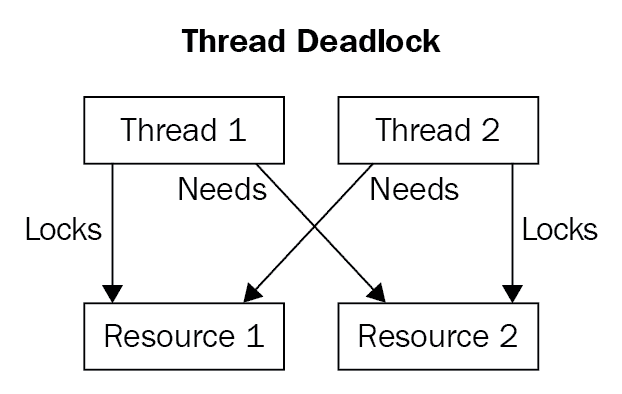
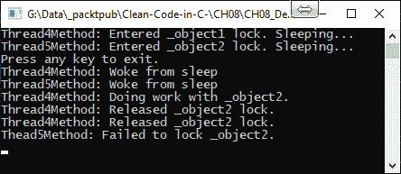
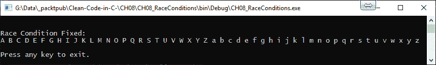
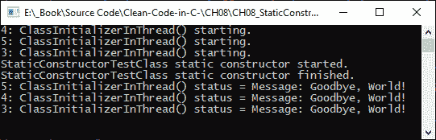
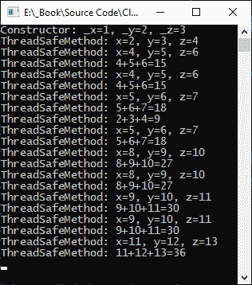
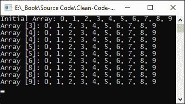

# 八、线程和并发

进程本质上是在操作系统上执行的程序。此进程由多个执行线程组成。执行线程是由进程发出的一组命令。一次执行多个线程的能力称为**多线程**。在本章中，我们将研究多线程和并发。

多个线程被分配一定的执行时间，每个线程由线程调度程序轮流执行。线程调度器使用一种称为**时间切片**的技术来调度线程，然后将每个线程传递给 CPU，以便在计划的时间执行。

**并发**是在同一时间运行多个线程的能力。这可以在具有多个处理器核心的计算机上实现。计算机的处理器核越多，可以并发执行的线程就越多。

当我们在本章中讨论并发和线程时，我们将遇到阻塞、死锁和竞争条件等问题。您将看到如何使用干净的编码技术克服这些问题。

在本章中，我们将介绍以下主题：

*   了解线程生命周期
*   添加线程参数
*   使用线程池
*   使用具有同步线程的互斥对象
*   使用信号量处理并行线程
*   限制线程池中处理器和线程的数量
*   防止死锁
*   防止种族状况
*   理解静态构造函数和方法
*   易变性、不变性和线程安全性
*   同步方法依赖项
*   使用`Interlocked`类进行简单的状态更改
*   一般性建议

完成本章的学习并发展线程和并发技能后，您将获得以下技能：

*   理解和讨论线程生命周期的能力
*   理解并能够使用前台和后台线程
*   使用线程池限制线程并设置并发使用的处理器数量的能力
*   理解静态构造函数和方法对多线程和并发性的影响的能力
*   考虑可变性和不变性及其对线程安全性的影响的能力
*   了解导致比赛状态的原因以及如何避免这些情况的能力
*   了解导致死锁的原因以及如何避免死锁的能力
*   使用`Interlocked`类执行简单状态更改的能力

要运行本章中的代码，您需要一个.NET Framework 控制台应用。除非另有说明，否则所有代码将置于`Program`类中。

# 了解线程生命周期

C# 中的线程具有相关的生命周期。线程的生命周期如下所示：


当线程启动时，它进入**运行**状态。线程运行时可以进入**等待**、**睡眠**、**加入**、**停止**或**暂停**状态。线程也可以中止。中止的线程进入停止状态。您可以通过分别调用`Suspend()`和`Resume()`方法来挂起和恢复线程。

调用`Monitor.Wait(object obj)`方法时，线程将进入等待状态。当调用`Monitor.Pulse(object obj)`方法时，线程将继续。线程通过调用`Thread.Sleep(int millisecondsTimeout)`方法进入睡眠模式。经过一段时间后，线程将返回到运行状态。

`Thread.Join()`方法使线程进入等待状态。连接的线程将保持等待状态，直到所有依赖线程完成运行，然后进入运行状态。但是，如果中止任何依赖线程，则该线程也将中止并进入停止状态。

Threads that have completed or have been aborted cannot be restarted.

线程可以在前台或后台运行。让我们看看前台和后台线程，从前台线程开始：

*   **前台线程**：默认情况下，线程在前台运行。当至少一个前台线程当前正在运行时，进程将继续运行。即使`Main()`完成，但前台线程正在运行，应用进程仍将保持活动状态，直到前台线程终止。创建前台线程非常简单，如下代码所示：

```cs
var foregroundThread = new Thread(SomeMethodName);
foregroundThread.Start();
```

*   **后台线程**：创建后台线程的方式与创建前台线程的方式相同，只是还需要显式设置一个线程在后台运行，如图所示：

```cs
var backgroundThread = new Thread(SomeMethodName);
backgroundThread.IsBackground = true;
backgroundThread.Start();
```

后台线程用于执行后台任务并保持用户界面对用户的响应。当主进程终止时，正在执行的所有后台线程也将终止。但是，即使主进程终止，任何正在运行的前台线程都将运行到完成。

在下一节中，我们将研究线程参数。

# 添加线程参数

在线程中运行的方法通常具有参数。因此，在线程内执行方法时，了解如何将方法参数传递到线程中是非常有用的。

假设我们有以下方法，将两个整数相加并返回结果：

```cs
private static int Add(int a, int b)
{
 return a + b;
}
```

如您所见，该方法很简单。有两个参数称为`a`和`b`。这两个参数需要传递到线程中，才能使`Add()`方法正常运行。我们将添加一个示例方法来实现这一点：

```cs
private static void ThreadParametersExample()
{
    int result = 0;
    Thread thread = new Thread(() => { result = Add(1, 2); });
    thread.Start();
    thread.Join();
    Message($"The addition of 1 plus 2 is {result}.");
}
```

在这个方法中，我们声明一个初始值为`0`的整数。然后，我们创建一个新线程，该线程使用`1`和`2`参数值调用`Add()`方法，然后将结果分配给整数变量。然后线程启动，我们通过调用`Join()`方法等待它完成执行。最后，我们将结果打印到控制台窗口。

让我们添加我们的`Message()`方法：

```cs
internal static void Message(string message)
{
    Console.WriteLine(message);
}
```

`Message()`方法只需获取一个字符串并将其输出到控制台窗口。我们现在要做的就是更新`Main()`方法，如下所示：

```cs
static void Main(string[] args)
{
    ThreadParametersExample();
    Message("=== Press any Key to exit ===");
    Console.ReadKey();
}
```

在我们的`Main()`方法中，我们调用示例方法，然后等待用户按下任何键，然后退出。您应该看到以下输出：


如您所见，`1`和`2`是传递给加法方法的方法参数，`3`是线程返回的值。下一个主题是使用线程池。

# 使用线程池

线程池通过在应用初始化期间创建线程集合来提高性能。当需要一个线程时，它被分配一个任务。这项任务将被执行。一旦执行，线程将返回到线程池以重用。

由于在.NET 中创建线程的成本很高，我们可以通过使用线程池来提高性能。根据可用的系统资源（如内存和 CPU），每个进程都有固定数量的线程。但是，我们可以增加或减少线程池使用的线程数。通常最好让线程池负责使用多少线程，而不是手动设置这些值。

创建线程池的不同方法如下所示：

*   使用**任务并行库**（**TPL**）（在.NET Framework 4.0 及更高版本上）
*   使用`ThreadPool.QueueUserWorkItem()`
*   使用异步委托
*   使用`BackgroundWorker`

As a rule of thumb, you should only use a thread pool for server-side applications. For client-side applications, use foreground and background threads, as necessary.

在本书中，我们将只看一下**TPL**和`QueueUserWorkItem()`方法。您可以在[查看如何使用其他两种方法 http://www.albahari.com/threading/](http://www.albahari.com/threading/) 。接下来我们来看看第三方物流。

## 任务并行库

C# 中的异步操作由任务表示。C# 中的任务由 TPL 中的`Task`类表示。正如您将从名称中了解到的，task parallelism 允许同时执行多个任务，我们将在下面的小节中了解这一点。我们要看的第一个`Parallel`类方法是`Invoke()`方法。

### Parallel.Invoke（）

在第一个示例中，我们将使用`Parallel.Invoke()`调用三个单独的方法。添加以下三种方法：

```cs
private static void MethodOne()
{
    Message($"MethodOne Executed: Thread Id({Thread.CurrentThread.ManagedThreadId})");
}

private static void MethodTwo()
{
    Message($"MethodTwo Executed: Thread Id({Thread.CurrentThread.ManagedThreadId})");
}

private static void MethodThree()
{
    Message($"MethodThree Executed: Thread Id({Thread.CurrentThread.ManagedThreadId})");
}
```

如您所见，这三种方法几乎相同，除了它们的名称和通过我们前面编写的`Message()`方法打印到控制台窗口的消息之外。现在，我们将添加`UsingTaskParallelLibrary()`方法来并行执行这三个方法：

```cs
private static void UsingTaskParallelLibrary()
{
    Message($"UsingTaskParallelLibrary Started: Thread Id = ({Thread.CurrentThread.ManagedThreadId})");
    Parallel.Invoke(MethodOne, MethodTwo, MethodThree);
    Message("UsingTaskParallelLibrary Completed.");
}
```

在这个方法中，我们向控制台窗口写入一条消息，指示方法的开始。然后我们并行调用`MethodOne`、`MethodTwo`和`MethodThree`方法。然后，我们向控制台窗口写入一条消息，指示该方法已经结束，然后在退出该方法之前等待按下一个键。运行代码，您将看到以下输出：


在前面的屏幕截图中，您可以看到线程 1 被重用。现在让我们进入`Parallel.For()`循环。

### 平行

在下一个 TPL 示例中，我们将看一个简单的`Parallel.For()`循环。将以下方法添加到新.NET Framework 控制台应用的`Program`类中：

```cs
private static void Method()
{
    Message($"Method Executed: Thread Id({Thread.CurrentThread.ManagedThreadId})");
}
```

这个方法所做的就是向控制台窗口输出一个字符串。现在我们将创建执行`Parallel.For()`循环的方法：

```cs
private static void UsingTaskParallelLibraryFor()
{
    Message($"UsingTaskParallelLibraryFor Started: Thread Id = ({Thread.CurrentThread.ManagedThreadId})");
    Parallel.For(0, 1000, X => Method());
    Message("UsingTaskParallelLibraryFor Completed.");
}
```

在这个方法中，我们通过`0`循环到`1000`，调用`Method()`。您将看到线程如何通过不同的方法调用重用，如以下屏幕截图所示：


现在，我们来看看如何使用`ThreadPool.QueueUserWorkItem()`方法。

## ThreadPool.QueueUserWorkItem（）

`ThreadPool.QueueUserWorkItem()`方法接受`WaitCallback`方法并将其排队等待执行。`WaitCallback`是一个委托，表示线程池线程要执行的回调方法。当线程可用时，将执行该方法。让我们添加一个简单的示例。我们将首先添加`WaitCallbackMethod`：

```cs
private static void WaitCallbackMethod(Object _)
{
    Message("Hello from WaitCallBackMethod!");
}
```

此方法接受一种类型的对象。但是，由于参数将不使用，因此我们使用 discard 变量（`_`）。消息将打印到控制台窗口。现在，我们只需要调用该方法的代码：

```cs
private static void ThreadPoolQueueUserWorkItem()
{
    ThreadPool.QueueUserWorkItem(WaitCallbackMethod);
    Message("Main thread does some work, then sleeps.");
    Thread.Sleep(1000);
    Message("Main thread exits.");
}
```

如您所见，我们使用`ThreadPool`类通过调用`QueueUserWorkItem()`方法在线程池中对`WaitCallbackMethod()`进行排队。然后我们在主线程上做一些工作。然后主线程进入睡眠状态。线程池中的线程变为可用，并执行`WaitCallBackMethod()`。然后，该线程返回到线程池进行重用。执行返回到主线程，然后主线程完成并终止。

在下一节中，我们将讨论线程锁定对象，称为**互斥对象**（**m****utexes**）。

# 使用具有同步线程的互斥体

在 C# 中，互斥锁是一个线程锁定对象，可跨多个进程工作。只有能够请求或释放资源的进程才能修改互斥锁。当一个互斥锁被锁定时，进程将不得不在队列中等待。当互斥锁解锁时，就可以访问它。多个线程可以使用相同的互斥锁，但只能以同步方式使用。

使用互斥锁的好处是，互斥锁是在输入关键代码之前获得的简单锁。当关键代码段退出时，该锁被释放。因为在任何时候都只有一个线程处于关键代码段中，所以数据将保持一致状态，因为不存在争用条件。

使用互斥锁有几个缺点：

*   当现有线程已获得锁并进入睡眠状态或被抢占（阻止完成其任务），线程无法向前移动时，就会发生线程饥饿。
*   当一个互斥锁被锁定时，只有获得锁的线程才能解锁它。没有其他线程可以锁定或解锁它。
*   一次只允许一个线程进入关键代码段。CPU 时间可能会被浪费，因为互斥的正常实现可能会导致*忙等待*状态。

现在我们将编写一个程序来演示互斥的使用。启动新的.NET Framework 控制台应用。将以下行添加到类的顶部：

```cs
private static readonly Mutex _mutex = new Mutex();
```

这里，我们声明了一个名为`_mutex`的原语，我们将使用它进行进程间同步。现在，添加一个方法来演示使用互斥锁的线程同步：

```cs
private static void ThreadSynchronisationUsingMutex()
{
    try
    {
        _mutex.WaitOne();
        Message($"Domain Entered By: {Thread.CurrentThread.Name}");
        Thread.Sleep(500);
        Message($"Domain Left By: {Thread.CurrentThread.Name}");
    }
    finally
    {
        _mutex.ReleaseMutex();
    }
}
```

在这种方法中，当前线程被阻塞，直到当前等待句柄接收到信号。然后，当信号发出时，下一个线程进入是安全的。完成后，其他线程将被解锁，无法尝试获得互斥锁的所有权。接下来，添加`MutexExample()`方法：

```cs
private static void MutexExample()
{
    for (var i = 1; i <= 10; i++)
    {
        var thread = new Thread(ThreadSynchronisationUsingMutex)
        {
            Name = $"Mutex Example Thread: {i}"
        };
        thread.Start();
    }
}
```

在这个方法中，我们创建 10 个线程并启动它们。每个线程执行`ThreadSynchronisationUsingMutex()`方法。现在，最后更新`Main()`方法：

```cs
static void Main(string[] args)
{
    SemaphoreExample();
    Console.ReadKey();
}
```

`Main()`方法运行我们的互斥示例。输出应类似于以下屏幕截图中的输出：


再次运行该示例，您可能会得到不同的线程编号。如果它们是相同的数字，那么它们的顺序可能不同。

现在我们已经了解了互斥体，让我们看看信号量。

# 使用信号量处理并行线程

在多线程应用中，一个称为**信号量**的非负数在编号为`1`或`2`的线程之间共享。在同步方面，`1`指定*等待*，而`2`指定*信号*。**我们可以将一个信号量与多个缓冲区相关联，每个缓冲区可以由不同的进程同时处理。**

 **所以，本质上，信号量是整数和二进制原语类型的信令机制，可以通过等待和信号操作进行修改。如果没有可用资源，则需要资源的进程应执行等待操作，直到信号量值*大于 0*。信号量可以有多个程序线程，它们可以被任何对象更改，获取或释放资源。

使用信号量的优势在于多个线程可以访问关键代码段。信号量在内核中执行，与机器无关。如果您使用信号量，那么关键代码段将受到多个进程的保护。与互斥不同，信号量从不浪费处理时间和资源。

就像互斥锁一样，信号量也有自己的缺点。优先级反转是最大的缺点之一，当高优先级线程被迫等待其低优先级拥有线程释放信号量时，就会发生优先级反转。

如果低优先级线程在释放之前被中等优先级线程阻止完成，则这可能会进一步加剧。这被称为**无界优先级反转**，因为我们无法再预测高优先级线程的延迟。对于信号量，操作系统必须跟踪所有等待和信号调用。

信号量由约定使用，但不是强制使用的。您需要按照正确的顺序执行等待和信号操作；否则，代码可能会出现死锁。由于使用信号量的复杂性，有时可能无法获得互斥。在大型系统中模块化的丢失也是另一个缺点，信号量容易出现编程错误，导致死锁和互斥冲突。

我们现在要编写一个程序来演示信号量的使用：

```cs
private static readonly Semaphore _semaphore = new Semaphore(2, 4); 
```

我们添加了一个新的信号量变量。第一个参数表示可以同时授予的信号量的初始请求数。第二个参数表示可以同时授予的信号量的最大请求数。增加`StartSemaphore()`方法：

```cs
private static void StartSemaphore(object id)
{
    Console.WriteLine($"Object {id} wants semaphore access.");
 try
 {
 _semaphore.WaitOne();
 Console.WriteLine($"Object {id} gained semaphore access.");
 Thread.Sleep(1000);
 Console.WriteLine($"Object {id} has exited semaphore.");
 }
 finally
 {
 _semaphore.Release();
 }
}
```

当前线程被阻塞，直到当前等待句柄接收到信号。然后，线程可以执行其工作。最后，信号量被释放，计数返回到上一个计数。现在，添加`SemaphoreExample()`方法：

```cs
private static void SemaphoreExample()
{
    for (int i = 1; i <= 10; i++)
    {
        Thread t = new Thread(StartSemaphore);
        t.Start(i);
    }
}
```

本例生成 10 个线程，执行`StartSemaphore()`方法。让我们更新`Main()`方法来运行代码：

```cs
static void Main(string[] args)
{
    SemaphoreExample();
    Console.ReadKey();
}
```

`Main()`方法调用`SemaphoreExample()`，然后等待用户按键退出。您应该看到以下输出：


让我们继续看看如何限制线程池中处理器和线程的数量。

# 限制线程池中处理器和线程的数量

有时可能需要限制计算机程序使用的处理器和线程的数量。

要减少程序使用的处理器数量，请获取当前进程并设置其处理器关联值。例如，假设我们有一台四核计算机，我们想将使用限制在前两个核。前两个核的二进制值为`11`，为整数形式的`3`。现在，让我们为一个新的.NET Framework 控制台应用添加一个方法，并将其命名为`AssignCores()`：

```cs
private static void AssignCores(int cores)
{
    Process.GetCurrentProcess().ProcessorAffinity = new IntPtr(cores);
}
```

我们将一个整数传递给该方法。此整数值将由.NET Framework 转换为二进制值。该二进制值将使用由`1`值标识的处理器。对于`0`的二进制值，将不使用处理器。因此，由于机器代码由二进制数字表示，`0110`（`6`将使用核`2`和`3`，`1100`（`3`将使用核`1`和`2`，`0011`（`12`将使用核`3`和`4`。

If you want a refresher on binary, refer to [https://www.computerhope.com/jargon/b/binary.htm](https://www.computerhope.com/jargon/b/binary.htm).

现在，为了设置最大线程数，我们在`ThreadPool`类上调用`SetMaxThreads()`方法。此方法采用两个参数，都是整数。第一个参数是线程池中工作线程的最大数量，第二个参数是线程池中异步 I/O 线程的最大数量。现在，我们将添加设置最大线程数的方法：

```cs
private static void SetMaxThreads(int workerThreads, int asyncIoThreads)
{
    ThreadPool.SetMaxThreads(workerThreads, asyncIoThreads);
}
```

As you can see, it is pretty straightforward to set thread maximums and processors in your programs. Most of the time, you will not have to do this in your programs. The main reason for manually setting the number of threads and/or processors to use in your program is for if your programs run into performance issues. If your program does not experience performance issues, then it is best not to set the number of threads or the number of processors.

下一个主题是死锁。

# 防止死锁

当两个或多个线程执行并等待对方完成时，会发生**死锁**。这个问题在计算机程序挂起时表现出来。对于最终用户来说，这可能非常糟糕，并可能导致数据丢失或损坏。这方面的一个例子是执行两批数据输入，这些数据输入在事务中途崩溃，无法回滚。这不好,；让我用一个例子来解释原因。

考虑一个主要的银行交易，从客户的商业银行账户中拿出 100 万英镑来支付他们的收入和关税。资金从业务账户中取出，但在资金存入 HMRC 银行账户之前，会发生死锁。没有恢复选项，因此必须终止并重新启动应用。因此，商业银行账户减少了 100 万英镑，但 HMRC 税单尚未支付。客户仍有责任支付税款账单。但是从账户中取出的钱会发生什么变化呢？因此，您可以看到消除因死锁可能导致的问题而发生死锁的可能性的重要性。

为了简单起见，我们将处理两个线程，如下图所示：



我们将调用线程 1 和线程 2 以及资源 1 和资源 2。线程 1 获得对**资源 1**的锁定。**线程 2**获得**资源 2**的锁。**线程 1**需要访问**资源 2**但必须等待，因为**线程 2**已锁定**资源 2**。**线程 2**需要访问**资源 1**但必须等待，因为**线程 1**已锁定**资源 1**。这导致**线程 1**和**线程 2**都处于等待状态。由于两个线程都无法继续，直到另一个线程释放其资源，因此两个线程都处于**死锁状态**。当计算机程序处于死锁状态时，*挂起*，迫使您终止程序。

死锁的代码示例将是说明这一点的好方法，因此在下一节中，我们将编写一个死锁示例。

## 编写死锁示例

理解这一点的最佳方法是使用一个工作示例。我们将编写一些由两个方法组成的代码，每个方法都有两个不同的锁。它们都将锁定另一个方法所需的对象。因为每个线程都锁定另一个线程所需的资源，所以它们都将进入死锁状态。一旦我们的示例开始工作，我们将对其进行修改，以便我们的代码从死锁状态中恢复并能够继续。

创建一个新的.NET Framework 控制台应用并将其命名为`CH08_Deadlocks`。我们需要两个对象作为成员变量，所以让我们添加它们：

```cs
static object _object1 = new object();
 static object _object2 = new object();
```

这些对象将用作我们的锁对象。我们将有两个线程，每个线程将执行自己的方法。现在，将`Thread1Method()`添加到您的代码中：

```cs
private static void Thread1Method()
 {
     Console.WriteLine("Thread1Method: Thread1Method Entered.");
     lock (_object1)
     {
         Console.WriteLine("Thread1Method: Entered _object1 lock. Sleeping...");
         Thread.Sleep(1000);
         Console.WriteLine("Thread1Method: Woke from sleep");
         lock (_object2)
         {
             Console.WriteLine("Thread1Method: Entered _object2 lock.");
         }
         Console.WriteLine("Thread1Method: Exited _object2 lock.");
     }
     Console.WriteLine("Thread1Method: Exited _object1 lock.");
 }
```

`Thread1Method()`获得`_object1`上的锁。然后睡眠 1 秒钟。当它醒来时，在`_object2`上获得一个锁。然后，该方法退出两个锁并终止。

`Thread2Method()`获得`_object2`上的锁。然后睡眠 1 秒钟。当它醒来时，在`_object1`上获得一个锁。然后，该方法退出两个锁并终止：

```cs
private static void Thread2Method()
 {
     Console.WriteLine("Thread2Method: Thread1Method Entered.");
     lock (_object2)
     {
         Console.WriteLine("Thread2Method: Entered _object2 lock. Sleeping...");
         Thread.Sleep(1000);
         Console.WriteLine("Thread2Method: Woke from sleep.");
         lock (_object1)
         {
             Console.WriteLine("Thread2Method: Entered _object1 lock.");
         }
         Console.WriteLine("Thread2Method: Exited _object1 lock.");
     }
     Console.WriteLine("Thread2Method: Exited _object2 lock.");
 }
```

现在我们有两种方法来演示死锁。我们只需要代码以一种会导致死锁的方式调用它们。让我们添加`DeadlockNoRecovery()`方法：

```cs
private static void DeadlockNoRecovery()
 {
     Thread thread1 = new Thread((ThreadStart)Thread1Method);
     Thread thread2 = new Thread((ThreadStart)Thread2Method);

     thread1.Start();
     thread2.Start();

     Console.WriteLine("Press any key to exit.");
     Console.ReadKey();
 }
```

在`DeadlockNoRecovery()`方法中，我们创建了两个线程。每个线程都分配了不同的方法。然后，启动每个线程。然后暂停程序，直到用户按键。现在，更新`Main()`方法并运行您的代码：

```cs
static void Main()
 {
     DeadlockNoRecovery();
 }
```

运行程序时，应看到以下输出：


如您所见，由于`thread1`已锁定`_object1`，因此`thread2`无法获得`_object1`上的锁。此外，由于`thread2`已锁定`_object2`，因此`thread1`无法获得`_object2`上的锁。因此，两个线程都处于死锁状态，程序挂起。

我们现在将编写一些代码来演示如何避免这种死锁情况的发生。我们将使用`Monitor.TryLock()`方法尝试在一定的毫秒数内获得锁。然后我们将使用`Monitor.Exit()`退出一个成功的锁。

现在，添加`DeadlockWithRecovery()`方法：

```cs
private static void DeadlockWithRecovery()
 {
     Thread thread4 = new Thread((ThreadStart)Thread4Method);
     Thread thread5 = new Thread((ThreadStart)Thread5Method);

     thread4.Start();
     thread5.Start();

     Console.WriteLine("Press any key to exit.");
     Console.ReadKey();
 }
```

`DeadlockWithRecovery()`方法创建两个前台线程。然后，它启动线程，将消息打印到控制台，并等待用户在退出前按键。我们现在将为`Thread4Method()`添加代码：

```cs
private static void Thread4Method()
 {
     Console.WriteLine("Thread4Method: Entered _object1 lock. Sleeping...");
     Thread.Sleep(1000);
     Console.WriteLine("Thread4Method: Woke from sleep");
     if (!Monitor.TryEnter(_object1))
     {
         Console.WriteLine("Thead4Method: Failed to lock _object1.");
         return;
     }
     try
     {
         if (!Monitor.TryEnter(_object2))
         {
             Console.WriteLine("Thread4Method: Failed to lock _object2.");
             return;
         }
         try
         {
             Console.WriteLine("Thread4Method: Doing work with _object2.");
         }
         finally
         {
             Monitor.Exit(_object2);
             Console.WriteLine("Thread4Method: Released _object2 lock.");
         }
     }
     finally
     {
         Monitor.Exit(_object1);
         Console.WriteLine("Thread4Method: Released _object2 lock.");
     }
 }
```

`Thread4Method()`睡眠 1 秒。然后它试图锁定`_object1`。如果无法在`_object1`上获得锁，则从该方法返回。如果获得了`_object1`上的锁，那么它将尝试获得`_object2`上的锁。如果无法获得`_object2`上的锁，则它将从该方法返回。如果在`_object2`上获得锁，则在`_object2`上执行必要的工作。然后松开`_object2`上的锁，然后松开`_object1`上的锁。

我们的`Thread5Method()`方法做的事情完全相同，除了对象`_object1`和`_object2`按相反顺序锁定：

```cs
private static void Thread5Method()
 {
     Console.WriteLine("Thread5Method: Entered _object2 lock. Sleeping...");
     Thread.Sleep(1000);
     Console.WriteLine("Thread5Method: Woke from sleep");
     if (!Monitor.TryEnter(_object2))
     {
         Console.WriteLine("Thead5Method: Failed to lock _object2.");
         return;
     }
     try
     {
         if (!Monitor.TryEnter(_object1))
         {
             Console.WriteLine("Thread5Method: Failed to lock _object1.");
             return;
         }
         try
         {
             Console.WriteLine("Thread5Method: Doing work with _object1.");
         }
         finally
         {
             Monitor.Exit(_object1);
             Console.WriteLine("Thread5Method: Released _object1 lock.");
         }
     }
     finally
     {
         Monitor.Exit(_object2);
         Console.WriteLine("Thread5Method: Released _object2 lock.");
     }
 }
```

现在，将`DeadlockWithRecovery()`方法调用添加到您的`Main()`方法中：

```cs
static void Main()
 {
     DeadlockWithRecovery();
 }
```

然后，运行代码几次。大多数情况下，您将看到以下屏幕截图中的内容，其中所有锁都已成功获得：



然后，按任意键，程序将退出。如果您继续运行该程序，最终将发现一个失败的锁。程序未能在`Thread5Method()`中锁定`_object2`。但是，如果按任意键，程序将退出。如您所见，通过使用`Monitor.TryEnter()`，您可以尝试锁定一个对象。但是如果没有获得锁，那么您可以在不挂起程序的情况下执行另一个操作。

在下一节中，我们将介绍如何防止种族状况。

# 防止种族状况

当使用相同资源的多个线程由于每个线程的计时而产生不同的结果时，这称为**竞态条件**。我们现在将在行动中证明这一点。

在我们的演示中，我们将有两个线程。每个线程将调用一个方法来打印字母表。一种方法是使用*大写字母*打印字母表。第二种方法将使用*小写字母*打印字母表。从演示中，我们将看到输出是如何错误的，并且每次运行程序时，输出都是错误的。

首先，增加`ThreadingRaceCondition()`方法：

```cs
static void ThreadingRaceCondition()
 {
     Thread T1 = new Thread(Method1);
     T1.Start();
     Thread T2 = new Thread(Method2);
     T2.Start();
 }
```

`ThreadingRaceCondition()`产生两条线程并启动它们。它还引用了两种方法。`Method1()`打印大写字母，`Method2()`打印小写字母。我们加上`Method1()`和`Method2()`：

```cs
static void Method1()
 {
     for (_alphabetCharacter = 'A'; _alphabetCharacter <= 'Z'; _alphabetCharacter ++)
     {
         Console.Write(_alphabetCharacter + " ");
     }
 }

private static void Method2()
 {
     for (_alphabetCharacter = 'a'; _alphabetCharacter <= 'z'; _alphabetCharacter++)
     {
         Console.Write(_alphabetCharacter + " ");
     }
 }
```

`Method1()`和`Method2()`都引用`_alphabetCharacter`变量。因此，将成员添加到类的顶部：

```cs
private static char _alphabetCharacter;
```

现在，更新`MainMethod()`：

```cs
static void Main(string[] args)
 {
     Console.WriteLine("\n\nRace Condition:");
     ThreadingRaceCondition();
     Console.WriteLine("\n\nPress any key to exit.");
     Console.ReadKey();
 }
```

我们现在已经准备好了代码来演示竞争条件。如果您多次运行该程序，您将看到结果并非我们所期望的。您甚至应该看到不属于字母表的字符：


这不完全是我们所期望的，是吗？

我们将通过使用第三方物流解决这个问题。TPL 的目的是简化**并行**和**并发**。由于当今大多数计算机都有两个或多个处理器，TPL 将动态扩展并发度，以最有效地利用所有可用的处理器。

The partitioning of work, the scheduling of threads in the thread pool, cancellation support, state management, and so on are also carried out by the TPL. A link to the official Microsoft TPL documentation can be found in the *Further reading* section of this chapter.

您将看到上述问题的解决方案是多么简单。我们有一个运行`Method1()`的任务。然后，任务继续执行`Method2()`。然后我们调用`Wait()`等待任务完成执行。现在，将`ThreadingRaceConditionFixed()`方法添加到源代码中：

```cs
static void ThreadingRaceConditionFixed()
 {
     Task
         .Run(() => Method1())
         .ContinueWith(task => Method2())
         .Wait();
 }
```

修改您的`Main()`方法，如下所示：

```cs
static void Main(string[] args)
 {
     //Console.WriteLine("\n\nRace Condition:");
     //ThreadingRaceCondition();
     Console.WriteLine("\n\nRace Condition Fixed:");
     ThreadingRaceConditionFixed();
     Console.WriteLine("\n\nPress any key to exit.");
     Console.ReadKey();
 }
```

现在运行代码。如果多次运行，您将看到输出始终相同，如以下屏幕截图所示：



到目前为止，我们已经了解了线程是什么，以及如何在前台和后台使用它们。我们还研究了死锁以及如何使用`Monitor.TryEnter()`解决它们。最后，我们研究了什么是竞争条件，以及如何使用 TPL 解决它们。

现在，我们将继续研究静态构造函数和方法。

# 理解静态构造函数和方法

如果多个类同时需要访问属性实例，那么其中一个线程将被请求运行**静态构造函数**（也称为**类型初始值设定项**。在等待类型初始值设定项运行时，所有其他线程都将被锁定。一旦类型初始值设定项运行，锁定的线程将被解锁，并且能够访问`Instance`属性。

静态构造函数是线程安全的，因为它们保证每个应用域只运行一次。它们在访问任何静态成员和执行任何类实例化之前执行。

Should an exception be raised in and escape from a static constructor, then `TypeInitializationException` is generated, which causes the CLR to exit your program.

在任何线程可以访问类之前，静态初始值设定项和静态构造函数必须完成执行。

**静态方法**仅在类型级别保留方法及其数据的单个副本。这意味着相同的方法及其数据将在不同的实例之间共享。应用中的每个线程都有自己的堆栈。传入静态方法的值类型是在调用线程的堆栈上创建的，因此它们是线程安全的。这意味着，如果两个线程调用相同的代码并传入相同的值，那么每个线程的堆栈上将有该值的两个副本。因此，多个线程不会相互影响。

但是，如果您有一个访问成员变量的静态方法，那么它不是线程安全的。两个不同的线程调用相同的方法，因此两个线程都可以访问成员变量。线程之间发生进程或上下文切换；每个线程都将访问和修改成员变量。这将导致比赛条件，正如您在本章前面看到的。

如果将引用类型传递到静态方法中，也会遇到问题，因为不同的线程将有权访问相同的引用类型。这也会导致竞争状况。

When working with static methods that will be used across threads, avoid member variable access and do not pass reference types in. Static methods are thread-safe as long as you pass in primitive types and don't modify the state.

现在我们已经讨论了静态构造函数和方法，我们将运行一些示例代码。

## 向示例代码中添加静态构造函数

启动新的.NET Framework 控制台应用。将名为`StaticConstructorTestClass`的类添加到项目中。然后，添加一个名为`_message`的只读静态字符串变量：

```cs
public class StaticConstructorTestClass
{
    private readonly static string _message;
}
```

`_message`变量通过`Message()`方法返回给调用者。现在我们来编写`Message()`方法：

```cs
public static string Message()
{
    return $"Message: {_message}";
}
```

此方法返回存储在`_message`变量中的消息。现在，我们需要编写构造函数：

```cs
static StaticConstructorTestClass()
{
    Console.WriteLine("StaticConstructorTestClass static constructor started.");
    _message = "Hello, World!";
    Thread.Sleep(1000);
    _message = "Goodbye, World!";
    Console.WriteLine("StaticConstructorTestClass static constructor finished.");
}
```

在我们的构造函数中，我们向屏幕写入一条消息。然后设置成员变量，让线程休眠一秒钟。然后，我们再次设置消息并向控制台写入另一条消息。现在，在`Program`类中，更新`Main()`方法，如下所示：

```cs
static void Main(string[] args)
{
    var program = new Program();
    program.StaticConstructorExample();
    Thread.CurrentThread.Join();
}
```

我们的`Main()`方法实例化了`Program`类。然后调用`StaticConstructorExample()`方法。当程序停止并且我们可以看到结果时，我们加入线程。您可以在以下屏幕截图中看到输出：



我们现在来看看静态方法的例子。

## 向示例代码中添加静态方法

我们现在将研究线程安全的静态方法和非线程安全的方法。将名为`StaticExampleClass`的新类添加到新的.NET Framework 控制台应用中。然后，添加以下代码：

```cs
public static class StaticExampleClass
{
    private static int _x = 1;
    private static int _y = 2;
    private static int _z = 3;
}
```

在类的顶部，我们分别添加三个整数-`_x`、`_y`和`_z`，其值分别为`1`、`2`和`3`。这些变量可以在线程之间修改。现在，我们将添加一个静态构造函数来打印这些变量的值：

```cs
static StaticExampleClass()
{
    Console.WriteLine($"Constructor: _x={_x}, _y={_y}, _z={_z}");
}
```

如您所见，静态构造函数只是将变量的值打印到控制台窗口。我们的第一种方法是线程安全方法，称为`ThreadSafeMethod()`：

```cs
internal static void ThreadSafeMethod(int x, int y, int z)
{
    Console.WriteLine($"ThreadSafeMethod: x={x}, y={y}, z={z}");
    Console.WriteLine($"ThreadSafeMethod: {x}+{y}+{z}={x+y+z}");
}
```

此方法是线程安全的，因为它只对按值参数进行操作。它不与成员变量交互，也不包含任何引用值。因此，无论传入什么值，您都将得到预期的结果。

这意味着，无论是只有一个线程还是数百万个线程正在访问该方法，当您传入输入值时，每个线程的输出都将是您所期望的，即使上下文切换也是如此。以下屏幕截图显示了输出：



既然我们已经研究了线程安全的方法，那么我们只应该研究非线程安全的方法。到目前为止，您已经知道，对引用值或静态成员变量进行操作的静态方法不是线程安全的。

在我们的下一个示例中，我们将使用一个与`ThreadSafeMethod()`具有相同三个参数的方法，但这次，我们将设置成员变量，输出消息，进入睡眠状态一段时间，然后唤醒以再次打印值。在`StaticExampleClass`中增加以下`NotThreadSafeMethod()`方法：

```cs
internal static void NotThreadSafeMethod(int x, int y, int z)
{
    _x = x;
    _y = y;
    _z = z;
    Console.WriteLine(
        $"{Thread.CurrentThread.ManagedThreadId}-NotThreadSafeMethod: _x={_x}, _y={_y}, _z={_z}"
    );
    Thread.Sleep(300);
    Console.WriteLine(
        $"{Thread.CurrentThread.ManagedThreadId}-ThreadSafeMethod: {_x}+{_y}+{_z}={_x + _y + _z}"
    );
}
```

在这个方法中，我们将成员变量设置为传递到方法中的值。然后，我们将这些值输出到控制台窗口并进入睡眠状态 300 毫秒。然后，当我们从睡眠中醒来时，我们再次打印出这些值。在`Program`类中更新`Main()`方法，如图所示：

```cs
static void Main(string[] args)
{
    var program = new Program();
    program.ThreadUnsafeMethodCall();
    Console.ReadKey();
}
```

在`Main()`方法中，我们实例化程序类，调用`ThreadUnsafeMethodCall()`，然后等待用户按键后退出。那么，让我们在`Program`类中添加`ThreadUnsafeMethodCall()`：

```cs
private void ThreadUnsafeMethodCall()
{
    for (var index = 0; index < 10; index++)
    {
        var thread = new Thread(() =>
        {
            StaticExampleClass.NotThreadSafeMethod(index + 1, index + 2, index + 3);
        });
        thread.Start();
    }
}
```

此方法生成 10 个线程，这些线程调用`StaticExampleClass`的`NotThreadSafeMethod()`。如果运行代码，您将看到与以下屏幕截图中类似的输出：


正如您所看到的，输出不是我们所期望的。这是因为来自不同线程的污染。这很好地将我们引向下一节关于可变性、不变性和线程安全性的内容。

# 易变性、不变性和线程安全性

**易变性**是多线程应用中错误的来源。可变错误通常是由线程之间更新和共享的值引起的数据错误。为了消除可变性 bug 的风险，最好使用**不可变类型**。由多个线程同时保证代码体的安全执行称为**线程安全**。使用多线程程序时，代码必须是线程安全的。如果代码消除了竞争条件和死锁，以及由可变性引起的问题，那么代码是线程安全的。

创建后无法修改的对象是**不可变对象**。一旦创建，如果使用正确的线程同步在线程之间传递，所有线程将看到相同的对象有效状态。不可变对象允许您在线程之间安全地共享数据。

创建后可以修改的对象是可变对象。可变对象可以在线程之间更改其数据值。这可能导致一些严重的数据损坏。因此，即使程序没有崩溃，它也可能使数据处于无效状态。因此，在处理多个执行线程时，对象不可变是很重要的。在[第 3 章](03.html)*类、对象和数据结构*中，我们介绍了为不可变对象创建和使用不可变数据结构的过程。

To ensure thread safety, do not use mutable objects, pass parameters by reference, or modify member variables—only pass parameters by value and only operate on parameter variables. Do not access member variables. Immutable structures are a good and thread-safe way to pass data between objects.

我们将通过以下示例简要介绍易变性、不变性和线程安全性。我们将从线程安全方面的可变性开始。

## 编写可变且非线程安全的代码

为了演示多线程应用中的可变性，我们将编写一个新的.NET Framework 控制台应用。使用以下代码向名为`MutableClass`的应用添加一个新类：

```cs
internal class MutableClass
{
    private readonly int[] _intArray;

    public MutableClass(int[] intArray)
    {
        _intArray = intArray;
    }

    public int[] GetIntArray()
    {
        return _intArray;
    }
}
```

在我们的`MutableClass`类中，我们有一个构造函数，它将整数数组作为参数。然后为成员整数数组分配传递给构造函数的数组。`GetIntArray()`方法返回整数数组成员变量。如果您查看这个类，您不会认为它是可变的，因为一旦数组被传递到构造函数中，该类就无法修改它。然而，传递给构造函数的整数数组是可变的。`GetIntArray()`方法返回对可变数组的引用。

在我们的`Program`类中，我们将添加`MutableExample()`方法来显示整数数组是可变的：

```cs
private static void MutableExample()
{
    int[] iar = { 0, 1, 2, 3, 4, 5, 6, 7, 8, 9 };
    var mutableClass = new MutableClass(iar);

    Console.WriteLine($"Initial Array: {iar[0]}, {iar[1]}, {iar[2]}, {iar[3]}, {iar[4]}, {iar[5]}, {iar[6]}, {iar[7]}, {iar[8]}, {iar[9]}");

    for (var x = 0; x < 9; x++)
    {
        var thread = new Thread(() =>
            {
                iar[x] = x + 1;
                var ia = mutableClass.GetIntArray();
                Console.WriteLine($"Array [{x}]: {ia[0]}, {ia[1]}, {ia[2]}, {ia[3]}, {ia[4]}, {ia[5]}, {ia[6]}, {ia[7]}, {ia[8]}, {ia[9]}");
            });
            thread.Start();
    }
}
```

在我们的`MutableExample()`方法中，我们声明并启动了一个从`0`到`9`的整数项数组。然后我们声明一个新的`MutableClass`实例并传入整数数组。接下来，我们在修改初始数组之前打印出其内容。然后，我们循环九次。对于每次迭代，我们在当前循环计数值`x`指定的索引处增加数组，使其等于`x + 1`。然后，我们开始线程。现在更新`Main()`方法，如下所示：

```cs
static void Main(string[] args)
{
    MutableExample();
    Console.ReadKey();
}            
```

我们的`Main()`方法只是调用`MutableExample()`，然后等待按键。运行代码，您将看到如下屏幕截图所示的内容：


如您所见，尽管我们在创建和运行线程之前只创建了一个`MutableClass`实例，但更改本地数组会修改`MutableClass`实例中的数组。这证明了数组是可变的，因此它们不是线程安全的。

现在我们将从线程安全的角度来研究不变性。

## 编写不可变且线程安全的代码

在我们的不变性示例中，我们将再次创建一个.NET Framework 控制台应用，并使用相同的数组。添加一个名为`ImmutableStruct`的类并修改代码，如图所示：

```cs
internal struct ImmutableStruct
{ 
    private ImmutableArray<int> _immutableArray;

    public ImmutableStruct(ImmutableArray<int> immutableArray)
    {
        _immutableArray = immutableArray;
    }

    public int[] GetIntArray()
    {
        return _immutableArray.ToArray<int>();
    }
}
```

我们使用`ImmutableArray`，而不是使用普通整数数组。一个不可变数组被传递到构造函数中并分配给`_immutableArray`成员变量。我们的`GetIntArray()`方法将不可变数组作为普通整数数组返回。

将`ImmutableExample()`数组添加到`Program`类中：

```cs
private static void ImmutableExample()
{
    int[] iar = { 0, 1, 2, 3, 4, 5, 6, 7, 8, 9 };
    var immutableStruct = new ImmutableStruct(iar.ToImmutableArray<int>());

    Console.WriteLine($"Initial Array: {iar[0]}, {iar[1]}, {iar[2]}, {iar[3]}, {iar[4]}, {iar[5]}, {iar[6]}, {iar[7]}, {iar[8]}, {iar[9]}");

    for (var x = 0; x < 9; x++)
    {
        var thread = new Thread(() =>
        {
            iar[x] = x + 1;
            var ia = immutableStruct.GetIntArray();
            Console.WriteLine($"Array [{x}]: {ia[0]}, {ia[1]}, {ia[2]}, {ia[3]}, {ia[4]}, {ia[5]}, {ia[6]}, {ia[7]}, {ia[8]}, {ia[9]}");
        });
        thread.Start();
    }
}
```

在我们的`ImmutableExample()`方法中，我们创建了一个整数数组，作为不可变数组传递给`ImmutableStruct`的构造函数。然后在修改之前打印本地数组的内容。然后，我们循环九次。在每次迭代中，我们访问数组中当前迭代的计数位置，并将当前迭代的计数加上 1 添加到数组中该位置的变量中。

然后，我们通过调用`GetIntArray()`将`immutableStruct`数组的副本分配给局部变量。然后，我们继续打印返回数组的值。最后，我们开始线程。从`Main()`方法调用`ImmutableExample()`方法，然后运行代码。您应该看到以下输出：



如您所见，不会通过更新本地数组来修改数组的内容。这个版本的程序表明我们的程序是线程安全的。

在下一节中，我们将简要介绍到目前为止所了解的线程安全性。

## 理解线程安全

正如您在前两部分中所看到的，在编写多线程代码时要非常小心。编写线程安全代码可能非常困难，尤其是在大型项目中。在使用集合、通过引用传递参数以及访问静态类中的成员变量时，必须特别小心。多线程应用的最佳实践是只传递不可变类型，不访问静态成员变量，如果必须执行任何非线程安全的代码，则使用锁、互斥锁或信号量锁定代码。虽然在本章中您已经看到了类似的代码，但我们将用一些代码片段快速刷新我们的记忆。

下面的代码片段显示了如何使用`readonly struct`编写不可变类型：

```cs
public readonly struct ImmutablePerson
{
    public ImmutablePerson(int id, string firstName, string lastName)
    {
        _id = id;
        _firstName = firstName;
        _lastName = lastName;
    }

    public int Id { get; }
    public string FirstName { get;
    public string LastName { get { return _lastName; } }
}
```

在我们的`ImmutablePerson`结构中，我们有一个公共构造函数，它接受一个整数作为 ID，字符串作为名字和姓氏。我们将`id`、`firstName`和`lastName`参数分配给成员只读变量。对数据的唯一访问是通过只读属性。这意味着无法修改数据。因为数据一旦创建就不能修改，所以它被归类为线程安全的。因为它是线程安全的，所以不能被不同的线程修改。修改数据的唯一方法是使用新数据创建一个新结构。

Structs can be mutable, just like classes. However, to pass data around that you don't want to be modified, then read-only structs are a good, lightweight choice. They are faster to create and destroy than classes as they are added to the stack—that is, unless they are part of a class that is added to the heap.

前面，我们看到了集合是如何可变的。然而，还有一个名为`System.Collections.Namespace`的不可变集合的名称空间。下表列出了此命名空间中的各种项：


The `System.Collections.Immutable` namespace contains a number of immutable collections that you can use safely between threads. Refer to [https://docs.microsoft.com/en-us/dotnet/api/system.collections.immutable?view=netcore-3.1](https://docs.microsoft.com/en-us/dotnet/api/system.collections.immutable?view=netcore-3.1) for more details.

在 C# 中使用 lock 对象非常简单，如下代码片段所示：

```cs
public class LockExample
{
    public object _lock = new object();

    public void UnsafeMethod() 
    {
        lock(_lock)
        {
            // Execute unsafe code.
        }
    }
}
```

我们创建并实例化`_lock`成员变量。然后，当执行非线程安全的代码时，我们将代码包装在锁中，并传入`_lock`变量以用作锁对象。当一个线程进入锁时，所有其他线程都被禁止执行代码，直到该线程离开锁为止。使用此代码的一个问题是线程可能会进入死锁状态。解决这个问题的一种方法是使用互斥锁。

可以使用同步原语进行进程间同步。首先，将以下代码添加到具有需要保护的代码的类的顶部：

```cs
private static readonly Mutex _mutex = new Mutex();
```

然后，要使用互斥锁，需要用以下`try/catch`块包装需要保护的代码：

```cs
try
{
    _mutex.WaitOne();
    // ... Do work here ...
}
finally
{
    _mutex.ReleaseMutex();
}
```

在前面的代码中，`WaitOne()`方法阻塞当前线程，直到等待句柄接收到信号。一旦发信号通知互斥体，`WaitOne()`方法返回`true`。然后，调用线程承担互斥对象的所有权。然后，调用线程可以访问受保护的资源。在受保护资源上完成工作后，通过调用`ReleaseMutex()`释放互斥锁。`ReleaseMutex()`在`finally`块中被调用，因为如果某个线程出于任何原因引发异常，则不希望该线程保持资源锁定。因此，始终在`finally`块中释放互斥。

另一种保护资源访问的机制是使用信号量。信号量的编码非常类似于互斥，它们执行相同的保护资源的作用。信号量和互斥量之间的主要区别在于互斥量是一种锁定机制，而信号量是一种信令机制。要使用信号量而不是锁和互斥，请在类的顶部添加以下行：

```cs
private static readonly Semaphore _semaphore = new Semaphore(2, 4); 
```

我们现在添加了一个新的信号量变量。第一个参数表示可以同时授予的信号量的初始请求数。第二个参数表示可以同时授予的信号量的最大请求数。然后，您将保护对方法中资源的访问，如下所示：

```cs
try
{
    _semaphore.WaitOne();
    // ... Do work here ...
}
finally
{
    _semaphore.Release();
}
```

当前线程被阻塞，直到当前等待句柄接收到信号。然后，线程可以执行其工作。最后，信号量被释放。

在本章中，您已经了解了如何使用锁、互斥锁和信号量来锁定非线程安全的代码。还要记住，后台线程在进程完成并终止时终止，而前台线程将继续执行直到完成。如果您有任何代码必须运行到完成，而线程不会中途终止，那么最好使用前台线程而不是后台线程。

下一节将介绍同步方法依赖项。

# 同步方法依赖项

要同步代码，请像前面一样使用 lock 语句。您还可以在项目中引用`System.Runtime.CompilerServices`名称空间。然后，您可以将`[MethodImpl(MethodImplOptions.Synchronized)]`注释添加到方法和属性中。

以下是应用于方法的`[MethodImpl(MethodImplOptions.Synchronized)]`注释示例：

```cs
[MethodImpl(MethodImplOptions.Synchronized)]
 public static void ThisIsASynchronisedMethod()
 {
      Console.WriteLine("Synchronised method called.");
 }
```

以下是将`[MethodImpl(MethodImplOptions.Synchronized)]`与属性一起使用的示例：

```cs
private int i;
 public int SomeProperty
 {
     [MethodImpl(MethodImplOptions.Synchronized)]
     get { return i; }
     [MethodImpl(MethodImplOptions.Synchronized)]
     set { i = value; }
 }
```

如您所见，很容易遇到死锁或竞争条件，但通过使用`Monitor.TryEnter()`和`Task.ContinueWith()`的竞争条件克服死锁也同样容易。

在下一节中，我们来看`Interlocked`类。

# 使用联锁类

在多线程应用中，错误可能会在线程调度程序上下文切换过程中潜入。出现的主要问题之一是不同线程更新相同的变量。`mscorlib`程序集中`System.Threading.Interlocked`类的方法有助于防止此类错误。`Interlocked`类的方法不会抛出异常，因此它们非常有助于以比我们前面看到的`lock`语句更高效的方式应用简单的状态更改。

`Interlocked`类中可用的方法如下：

*   `CompareExchange`：比较两个变量并将结果存储在不同的变量中
*   **`Add`**：将两个`Int32`或`Int64`整数变量相加，结果存储在第一个整数中
*   `Decrement`：递减`Int32`和`Int64`整变量值并存储其结果
*   `Increment`：**递增`Int32`和`Int64`整变量值并存储其结果**
***   `Read`：读取`Int64`类型的整数变量*   `Exchange`：**在变量之间交换值****

 ****我们现在将编写一个简单的控制台应用来演示这些方法。首先创建一个新的.NET Framework 控制台应用。在`Program`类的顶部添加以下行：

```cs
private static long _value = long.MaxValue;
private static int _resourceInUse = 0;
```

`_value`变量将用于演示使用联锁方法更新变量。`_resourceInUse`变量用于指示资源是否正在使用。增加`CompareExchangeVariables()`方法：

```cs
private static void CompareExchangeVariables()
{
    Interlocked.CompareExchange(ref _value, 123, long.MaxValue);
}
```

在我们的`CompareExchangeVariables()`方法中，我们调用`CompareExchange()`方法来比较`_value`和`long.MaxValue`。如果两个值相等，则将`_value`替换为`123`的值。现在我们将添加我们的`AddVariables()`方法：

```cs
private static void AddVariables()
{
    Interlocked.Add(ref _value, 321);
}
```

`AddVariables()`方法调用`Add()`方法访问`_value`成员变量，并用`_value`加`321`的值进行更新。接下来，我们将添加我们的`DecrementVariable()`方法：

```cs
private static void DecrementVariable()
{
    Interlocked.Decrement(ref _value);
}
```

此方法调用`Decrement()`方法，将`_value`成员变量递减 1。我们的下一个方法是`IncrementValue()`：

```cs
private static void IncrementVariable()
{
    Interlocked.Increment(ref _value);
}
```

在我们的`IncrementVariable()`方法中，我们通过调用`Increment()`方法来增加`_value`成员变量。我们将要写的下一个方法是`ReadVariable()`方法：

```cs
private static long ReadVariable()
{
    // The Read method is unnecessary on 64-bit systems, because 64-bit 
    // read operations are already atomic. On 32-bit systems, 64-bit read 
    // operations are not atomic unless performed using Read.
    return Interlocked.Read(ref _value);
}
```

由于 64 位读取操作是原子的，因此不需要调用`Interlocked.Read()`方法。但是，在 32 位系统上，要使 64 位读取成为原子的，需要调用`Interlocked.Read()`方法。增加`PerformUnsafeCodeSafely()`方法：

```cs
private static void PerformUnsafeCodeSafely()
{
    for (int i = 0; i < 5; i++)
    {
        UseResource();
        Thread.Sleep(1000);
    }
}
```

`PerformUnsafeCodeSafely()`方法循环五次。循环的每次迭代调用`UseResource()`方法，然后线程进入睡眠状态 1 秒。现在，我们将添加`UseResource()`方法：

```cs
static bool UseResource()
{
    if (0 == Interlocked.Exchange(ref _resourceInUse, 1))
    {
        Console.WriteLine($"{Thread.CurrentThread.Name} acquired the lock");
        NonThreadSafeResourceAccess();
        Thread.Sleep(500);
        Console.WriteLine($"{Thread.CurrentThread.Name} exiting lock");
        Interlocked.Exchange(ref _resourceInUse, 0);
        return true;
    }
    else
    {
        Console.WriteLine($"{Thread.CurrentThread.Name} was denied the lock");
        return false;
    }
}
```

`UseResource()`方法防止在资源正在使用时获得锁，如`_resourceInUse`变量所示。我们首先通过调用`Exchange()`方法将`_resourceInUse`成员变量值设置为`1`。`Exchange()`方法返回一个整数，我们将其与`0`进行比较。如果`Exchange()`返回的值为`0`，则该方法不在使用中。

如果该方法正在使用中，那么我们将输出一条消息，通知用户当前线程被拒绝锁定。

如果该方法未被使用，则输出一条消息，通知用户当前线程已获得锁。然后我们调用`NonThreadSafeResourceAccess()`方法，然后让线程休眠半秒钟以模拟工作。

当线程唤醒时，我们输出一条消息，通知用户当前线程已退出锁。然后，我们通过调用`Exchange()`方法并将`_resourceInUse`的值设置为`0`来释放锁。增加`NonThreadSafeResourceAccess()`方式：

```cs
private static void NonThreadSafeResourceAccess()
{
    Console.WriteLine("Non-thread-safe code executed.");
}
```

`NonThreadSafeResourceAccess()`是在锁的安全中执行非线程安全代码的地方。在我们的方法中，我们只是用一条消息通知用户。在我们运行代码之前要做的最后一项工作是更新我们的`Main()`方法，如下所示：

```cs
static void Main(string[] args)
{
    CompareExchangeVariables();
    AddVariables();
    DecrementVariable();
    IncrementVariable();
    ReadVariable();
    PerformUnsafeCodeSafely();
}
```

我们的`Main()`方法调用测试`Interlocked`方法的方法。运行代码，您应该会看到类似于以下内容的内容：


我们现在将讨论一些一般性建议。

# 一般性建议

在最后一节中，我们将介绍一些微软关于多线程应用的一般建议。这些措施包括：

*   避免使用`Thread.Abort`终止其他线程。
*   使用互斥锁、`ManualResetEvent`、`AutoResetEvent`和`Monitor`在多个线程之间同步活动。
*   在可能的情况下，为工作线程使用线程池。
*   如果有任何工作线程被阻塞，则使用`Monitor.PulseAll`通知所有线程工作线程状态的更改。
*   避免将此、类型实例和包含字符串文字的字符串实例用作`lock`对象。避免使用`lock`对象的类型。
*   实例锁可能导致死锁，因此在使用它们时要小心。
*   对进入监视器的线程使用`try/finally`块，以便在`finally`块中，通过调用`Monitor.Exit()`确保线程离开监视器。
*   对不同的资源使用不同的线程。
*   避免将多个线程分配给同一资源。
*   当 I/O 任务在执行 I/O 操作时阻塞时，它们应该有自己的线程。这样，就允许其他线程运行。
*   用户输入应该有自己的专用线程。
*   通过使用`System.Threading.Interlocked`类的方法而不是 lock 语句来提高简单状态更改的性能。
*   对于大量使用的代码，避免同步，因为它可能导致死锁和竞争条件。
*   默认情况下，使静态数据线程安全。
*   默认情况下，实例数据不能是线程安全的；否则，会降低性能，增加锁争用，并引入竞争条件和死锁发生的可能性。
*   避免使用改变状态的静态方法，因为它们会导致线程错误。

这就结束了我们对线程和并发的研究。让我们把所学的内容总结一下。

# 总结

在本章中，我们介绍了线程是什么以及如何使用它。我们研究了死锁和竞争条件的问题，并了解了如何使用 lock 语句和 TPL 库来防止这些异常情况。我们还讨论了静态构造函数、静态方法、不可变对象和可变对象的线程安全性。我们了解了为什么使用不可变对象是线程间传输数据的线程安全方式，并回顾了一些关于使用线程的一般建议。

我们还看到了使代码线程安全可以带来很多好处。在下一章中，我们将介绍如何设计有效的 API。但是现在，你可以通过回答以下问题来测试你的知识，你也可以通过参考提供的链接来进一步阅读。

# 问题

1.  什么是线？
2.  单线程应用中有多少线程？
3.  有哪些类型的线程？
4.  什么线程在程序退出后立即终止？
5.  哪一个线程持续到完成，即使程序退出？
6.  什么代码使线程睡眠半毫秒？
7.  如何实例化调用名为`Method1`的方法的线程？
8.  如何使线程成为背景线程？
9.  什么是僵局？
10.  如何退出使用`Monitor.TryEnter(objectName)`获得的锁？
11.  如何从僵局中恢复？
12.  什么是比赛条件？
13.  防止比赛状态的一种方法是什么？
14.  什么使静态方法不安全？
15.  静态构造函数是线程安全的吗？
16.  什么负责管理线程组？
17.  什么是不可变对象？
18.  为什么在线程化应用中，不可变对象比可变对象更受欢迎？

# 进一步阅读

*   [https://www.c-sharpcorner.com/blogs/mutex-and-semaphore-in-thread](https://www.c-sharpcorner.com/blogs/mutex-and-semaphore-in-thread) 提供了使用互斥和信号量的示例。
*   [https://www.guru99.com/mutex-vs-semaphore.html](https://www.guru99.com/mutex-vs-semaphore.html) 解释互斥和信号量之间的区别。
*   [https://docs.microsoft.com/en-us/dotnet/csharp/programming-guide/classes-and-structs/static-constructors](https://docs.microsoft.com/en-us/dotnet/csharp/programming-guide/classes-and-structs/static-constructors) 是微软关于静态构造函数的官方文档。
*   [https://docs.microsoft.com/en-us/dotnet/standard/threading/managed-threading-best-practices](https://docs.microsoft.com/en-us/dotnet/standard/threading/managed-threading-best-practices) 是微软关于微软托管线程最佳实践的官方指南。
*   [https://docs.microsoft.com/en-us/dotnet/standard/parallel-programming/task-parallel-library-tpl](https://docs.microsoft.com/en-us/dotnet/standard/parallel-programming/task-parallel-library-tpl) 是 TPL 的官方 Microsoft API 文档。
*   [https://www.c-sharpcorner.com/UploadFile/1d42da/interlocked-class-in-C-Sharp-threading/](https://www.c-sharpcorner.com/UploadFile/1d42da/interlocked-class-in-C-Sharp-threading/) 涵盖 C# 螺纹中的联锁类。
*   [http://geekswithblogs.net/BlackRabbitCoder/archive/2012/08/23/c.net-little-wonders-interlocked-read-and-exchange.aspx](http://geekswithblogs.net/BlackRabbitCoder/archive/2012/08/23/c.net-little-wonders-interlocked-read-and-exchange.aspx) 以实例对`System.Threading.Interlocked`进行了讨论。
*   [http://www.albahari.com/threading/](http://www.albahari.com/threading/) 是约瑟夫·阿尔巴哈里（Joseph Albahari）关于 C# 中线程的免费电子书的链接。
*   [https://docs.microsoft.com/en-us/dotnet/api/system.collections.immutable?view=netcore-3.1](https://docs.microsoft.com/en-us/dotnet/api/system.collections.immutable?view=netcore-3.1)是 Microsoft 关于`System.Collections.Immutable`名称空间中不可变集合的官方文档。******