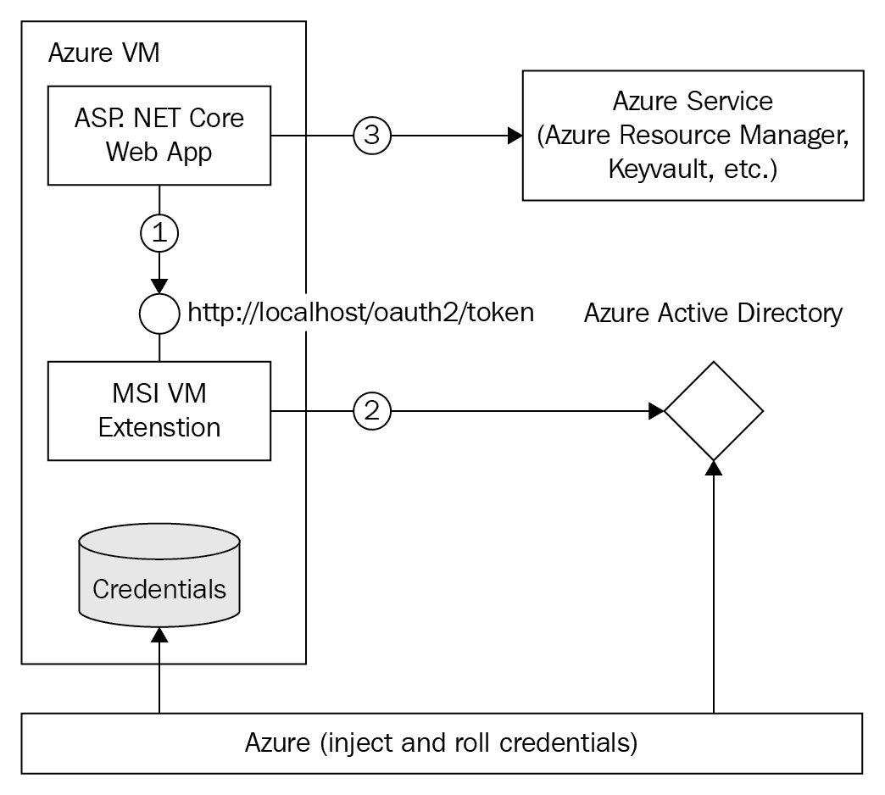
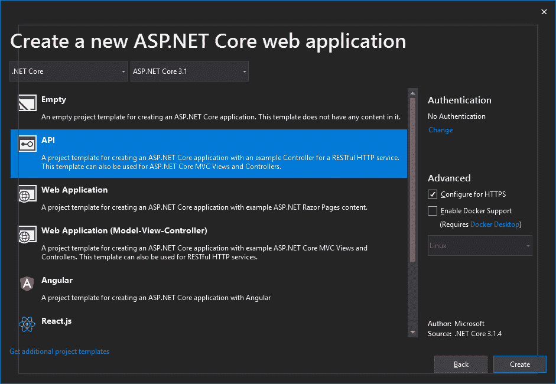
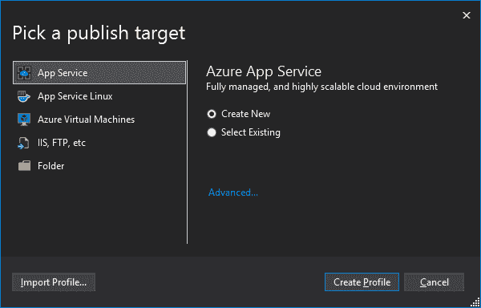
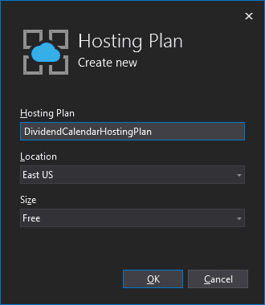
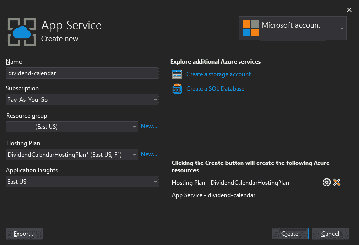
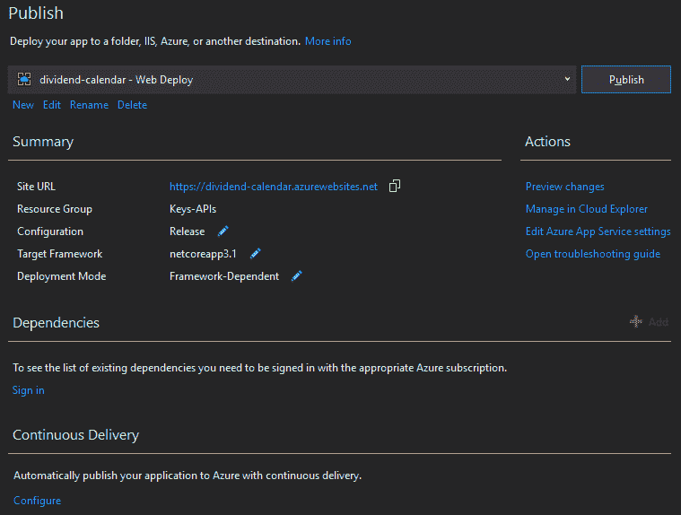
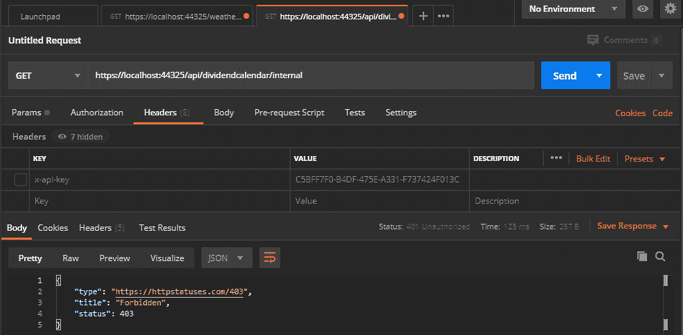
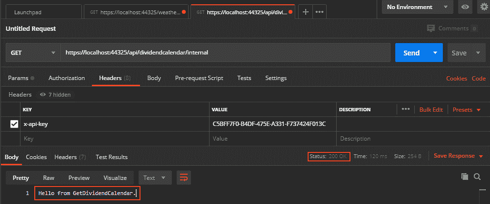
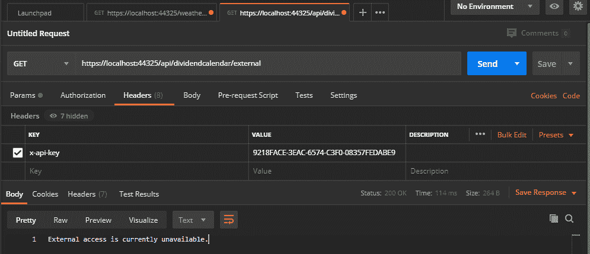

# 十、使用 API 密钥和 Azure 密钥保管库保护 API

在本章中，我们将了解如何在 Azure Key Vault 中保守秘密。我们还将研究如何使用 API 密钥通过身份验证和基于角色的授权来保护我们自己的密钥。为了获得 API 安全方面的第一手经验，我们将构建一个功能齐全的 FinTech API。

我们的 API 将使用私钥（在 Azure key Vault 中保持安全）提取第三方 API 数据。然后，我们将使用两个 API 密钥保护我们的 API；一个密钥将在内部使用，另一个密钥将由外部用户使用。

本章涵盖以下主题：

*   访问晨星 API
*   将晨星 API 存储在 Azure 密钥库中
*   在 Azure 中创建分红日历 ASP.NETCore web 应用
*   发布我们的 web 应用
*   使用 API 密钥保护分红日历 API
*   测试 API 密钥的安全性
*   添加分红日历代码
*   限制我们的 API

您将了解良好 API 设计的基础知识，并掌握推进 API 能力所需的知识。本章将帮助您获得以下技能：

*   使用客户端 API 密钥保护 API
*   使用 Azure Key Vault 存储和检索机密
*   使用 Postman 执行用于发布和获取数据的 API 命令
*   在 RapidAPI.com 上申请和使用第三方 API
*   限制 API 使用
*   编写利用在线金融数据的 FinTech API

在继续之前，请确保您实现了以下技术要求，以充分利用本章。

# 技术要求

在本章中，我们将使用以下技术编写 API：

*   Visual Studio 2019 社区版或更高版本
*   您自己的个人晨星 API 密钥来自[https://rapidapi.com/integraatio/api/morningstar1](https://rapidapi.com/integraatio/api/morningstar1)
*   RestSharp（[http://restsharp.org/](http://restsharp.org/) ）
*   Swashback.AspNetCore 5 或更高版本
*   邮递员（[https://www.postman.com/](https://www.postman.com/) ）
*   昂首阔步（[https://swagger.io](https://swagger.io)

# 承担 API 项目-股息日历

最好的学习方法是通过实践。因此，我们将构建一个工作 API 并对其进行保护。API 并不完美，还有改进的余地。但是，您可以自行实施这些改进，并根据自己的意愿扩展项目。这里的主要目标是拥有一个功能齐全的 API，它只做一件事：返回财务数据，其中列出了本年度将支付的所有公司股息。

Our dividend calendar API, which we will be building in this chapter, is an API that is authenticated with an **API key**. Depending on what key is used, authorization will determine whether the user is internal or external. The controller will then execute the appropriate method, depending on the type of user. Only the internal user method will be implemented, but you are free to implement the external user method yourself as a training exercise.

The internal method extracts an API key from Azure Key Vault and executes various API calls to a third-party API. The data is returned in **JavaScript Object Notation** (**JSON**) format, deserialized into objects and then processed to extract future dividend payments, which are added to a list of dividends. This list is then returned to the caller in JSON format. The end result is a JSON file that has all the scheduled dividend payments for the current year. The end user can then take this data and convert it into a list of dividends that can be queried using LINQ.

本章中我们将构建的项目是一个 web API，它从第三方金融 API 返回经过处理的 JSON。我们的项目将从给定的证券交易所获取公司列表。然后，我们将通过这些公司获取股息数据。然后将处理本年度的股息数据。因此，我们最终将返回给 API 调用方的是 JSON 数据。此 JSON 数据将包含公司列表及其本年度股息支付预测。最终用户可以将 JSON 数据转换为 C# 对象，并对这些对象执行 LINQ 查询。例如，可以执行查询以获得下个月的 x 股息付款或本月到期的付款。

我们将使用的 API 将是晨星 API 的一部分，晨星 API 可通过 RapidAPI.com 获得。您可以注册一个免费的晨星 API 密钥。我们将通过一个登录系统保护我们的 API，用户使用电子邮件地址和密码登录。您还需要 Postman，因为我们将使用它向分红日历 API 发出 API 的`POST`和`GET`请求。

我们的解决方案将包含一个项目，该项目将是一个 ASP.NETCore应用，目标是.NET Framework Core 3.1 或更高版本。现在我们将讨论如何访问晨星 API。

# 访问晨星 API

转到[https://rapidapi.com/integraatio/api/morningstar1](https://rapidapi.com/integraatio/api/morningstar1) 并请求 API 访问密钥。该 API 是一个免费的 API。这意味着您可以在有限的时间内免费拨打一定数量的电话，之后您需要支付使用费。花些时间看看 API 及其文档。请注意定价计划，并在收到密钥时对其保密。

我们感兴趣的 API 如下：

*   `GET /companies/list-by-exchange`：此 API 返回指定交易所的国家列表。
*   `GET /dividends`：此 API 获取指定公司的所有历史和当前股息支付信息。

API 请求的第一部分是`GET`HTTP 谓词，用于检索资源。API 请求的第二部分是指向`GET`的资源，在本例中为`/companies/list-by-exchange`。正如我们在前面列表的第二个要点中所看到的，我们得到了`/dividends`资源。

您可以在浏览器中测试每个 API，并查看返回的数据。我建议您在继续之前执行此操作。这将帮助您了解我们将要进行的工作。我们将使用的基本流程是获取属于指定交易所的公司列表，然后通过它们循环获取股息数据。如果股息数据有未来支付日期，则股息数据将添加到日历中；否则，它将被丢弃。无论一家公司有多少股息数据，我们只对第一条记录感兴趣，这是最新的记录。

现在您已经有了 API 密钥（假设您遵循这些步骤），我们将开始构建我们的 API。

## 将晨星 API 密钥存储在 Azure 密钥库中

我们将在 ASP.NETCore web 应用中使用 Azure 密钥库和**托管服务标识**（**MSI**）。因此，在继续之前，您需要 Azure 订阅。对于新客户，[提供 12 个月的免费优惠 http://azure.microsoft.com/en-us/free](https://azure.microsoft.com/en-us/free/) 。

作为 web 开发人员，重要的是不要在代码中存储机密，因为代码可以*反向工程*。如果代码是开源的，那么就有将个人或企业密钥上载到公共版本控制系统的危险。解决这一问题的一种方法是安全地存储秘密，但这会导致一个两难境地。要访问密钥，我们需要经过身份验证。那么，我们如何克服这一困境呢？

我们可以通过为 Azure 服务启用 MSI 来克服这一困境。因此，Azure 生成了一个服务主体。用户开发的应用使用此服务主体访问 Microsoft Azure 上的资源。对于服务主体，您可以使用证书或用户名和密码，以及您选择的具有所需权限集的任何角色。

控制 Azure 帐户的人控制每个服务可以执行的特定任务。通常最好从完全限制开始，只在需要时添加功能。下图显示了我们的 ASP.NETCore web 应用、MSI 和 Azure 服务之间的关系：



MSI 使用**Azure Active Directory**（**Azure AD**）为服务实例注入服务主体。称为**本地元数据服务**的 Azure 资源用于获取访问令牌，并将用于验证对 Azure 密钥库的服务访问。

然后，代码调用 Azure 资源上可用的本地元数据服务以获取访问令牌。然后，我们的代码使用从本地 MSI 端点提取的访问令牌对 Azure 密钥保险库服务进行身份验证。

打开 Azure CLI 并键入`az login`以登录 Azure。登录后，我们可以创建一个资源组。Azure 资源组是部署和管理 Azure 资源的逻辑容器。以下命令在`East US`位置创建一个资源组：

```cs
az group create --name "<YourResourceGroupName>" --location "East US"
```

在本章其余部分使用此资源组。现在，我们将继续创建密钥库。创建密钥 vault 需要以下信息：

*   密钥库的名称，是一个长度在 3 到 24 个字符之间的字符串，只能包含`0-9`、`a-z`、`A-Z`和`-`（连字符）字符
*   资源组的名称
*   位置，例如，`East US`或`West US`

在 Azure CLI 中，输入以下命令：

```cs
az keyvault create --name "<YourKeyVaultName>" --resource-group "<YourResourceGroupName> --location "East US"
```

在此阶段，只有您的 Azure 帐户有权在您的新 vault 上执行操作。如有必要，您可以添加其他帐户。

我们需要添加到项目中的主键是`MorningstarApiKey`。要将晨星 API 密钥添加到密钥库，请键入以下命令：

```cs
az keyvault secret set --vault-name "<YourKeyVaultName>" --name "MorningstarApiKey" --value "<YourMorningstarApiKey>"
```

您的密钥库现在存储您的晨星 API 密钥。要检查值是否正确存储，请键入以下命令：

```cs
az keyvault secret show --name "MorningstarApiKey" --vault-name "<YourKeyVaultName>"
```

您现在应该可以在 console 窗口中看到您的机密，该窗口显示存储的机密的密钥和值。

# 在 Azure 中创建分红日历 ASP.NETCore web 应用

要完成此阶段的项目，您需要安装 Visual Studio 2019，并安装 ASP.NET 和 web 开发工作负载：

1.  创建新的 ASP.NETCore web 应用：


2.  确保选择了未设置身份验证的 API：



3.  单击“创建”以构建新项目。然后，运行您的项目。默认情况下，定义了一个示例天气预报 API，并在浏览器窗口中输出以下 JSON 代码：

```cs
[{"date":"2020-04-13T20:02:22.8144942+01:00","temperatureC":0,"temperatureF":32,"summary":"Balmy"},{"date":"2020-04-14T20:02:22.8234349+01:00","temperatureC":13,"temperatureF":55,"summary":"Warm"},{"date":"2020-04-15T20:02:22.8234571+01:00","temperatureC":3,"temperatureF":37,"summary":"Scorching"},{"date":"2020-04-16T20:02:22.8234587+01:00","temperatureC":-2,"temperatureF":29,"summary":"Sweltering"},{"date":"2020-04-17T20:02:22.8234602+01:00","temperatureC":-13,"temperatureF":9,"summary":"Cool"}]
```

接下来，我们将把应用发布到 Azure。

## 发布我们的 web 应用

在发布 web 应用之前，我们将首先创建一个新的 Azure 应用服务以将应用发布到。我们需要一个资源组来包含 Azure 应用服务，以及一个新的托管计划，该计划指定托管我们应用的 web 服务器场的位置、大小和功能。因此，让我们注意这些要求，如下所示：

1.  确保您已从 Visual Studio 登录到 Azure 帐户。要创建应用服务，请右键单击刚刚创建的项目，然后从菜单中选择“发布”。这将显示“拾取发布目标”对话框，如图所示：



2.  选择应用服务|新建并单击创建配置文件。创建新的托管计划，如以下示例所示：



3.  然后，确保提供名称、选择订阅并选择资源组。建议您也设置 Application Insights 设置：



4.  单击“创建”创建您的应用服务。创建后，发布屏幕应如下所示：



5.  在此阶段，您可以单击站点 URL。这将在浏览器中加载您的网站 URL。如果您的服务已成功配置并运行，则浏览器应显示以下页面：


6.  让我们发布我们的 API。单击发布按钮。当网页运行时，它将显示一个错误页面。将 URL 修改为`https://dividend-calendar.azurewebsites.net/weatherforecast`。该网页现在应显示天气预报 API JSON 代码：

```cs
[{"date":"2020-04-13T19:36:26.9794202+00:00","temperatureC":40,"temperatureF":103,"summary":"Hot"},{"date":"2020-04-14T19:36:26.9797346+00:00","temperatureC":7,"temperatureF":44,"summary":"Bracing"},{"date":"2020-04-15T19:36:26.9797374+00:00","temperatureC":8,"temperatureF":46,"summary":"Scorching"},{"date":"2020-04-16T19:36:26.9797389+00:00","temperatureC":11,"temperatureF":51,"summary":"Freezing"},{"date":"2020-04-17T19:36:26.9797403+00:00","temperatureC":3,"temperatureF":37,"summary":"Hot"}]
```

我们的服务现在上线了。如果您登录 Azure 门户并访问托管计划的资源组，您将看到四个资源。这些资源如下：

*   **应用服务**：`dividend-calendar`
*   **应用见解**：`dividend-calendar`
*   **App 服务计划**：``DividendCalendarHostingPlan``
*   **钥匙库**：不管你的钥匙库叫什么。在我的例子中，它是`Keys-APIs`，如下所示：


如果您从 Azure 门户主页（[点击您的应用服务 https://portal.azure.com/# home](https://portal.azure.com/# home) ），您将看到您可以浏览到您的服务，以及停止、重新启动和删除您的应用服务：


现在，我们的项目已经准备好了应用洞察，我们的晨星 API 密钥已经安全存储，我们可以开始构建分红日历了。

# 使用 API 密钥保护分红日历 API

为了确保对分红日历 API 的访问安全，我们将使用客户端 API 密钥。有许多方法可以与您的客户共享客户机密钥，但我们这里不讨论它们。你可以想出自己的策略。我们将重点关注的是如何使经过身份验证和授权的客户端能够访问我们的 API。

为了保持简单，我们将使用**存储库模式**。存储库模式有助于将我们的程序与底层数据存储分离。此模式提高了可维护性，并允许您在不影响程序的情况下更改基础数据存储。对于我们的存储库，我们的密钥将在类中定义，但在商业项目中，您将在数据存储中存储密钥，如 Cosmos DB、SQL Server 或 Azure 密钥库。您可以选择最适合自己需要的策略，这也是我们之所以使用存储库模式的主要原因，因为您可以根据自己的需要控制底层数据源。

## 设置存储库

我们将从设置存储库开始：

1.  将名为`Repository`的新文件夹添加到项目中。然后，添加一个名为`IRepository`的新接口和一个将实现`IRepository`的类，名为`InMemoryRepository`。修改您的界面，如下所示：

```cs
using CH09_DividendCalendar.Security.Authentication;
using System.Threading.Tasks;

namespace CH09_DividendCalendar.Repository
{
    public interface IRepository
    {
        Task<ApiKey> GetApiKey(string providedApiKey);
    }
}
```

2.  此接口定义了一种检索 API 密钥的方法。我们还没有定义`ApiKey`类，我们将在稍后进行定义。现在，让我们实现`InMemoryRepository`。添加以下`using`语句：

```cs
using CH09_DividendCalendar.Security.Authentication;
using CH09_DividendCalendar.Security.Authorisation;
using System;
using System.Collections.Generic;
using System.Linq;
using System.Threading.Tasks;
```

3.  `security`名称空间将在我们开始添加身份验证和授权类时创建。修改`Repository`类实现`IRepository`接口。添加保存 API 键的成员变量，然后添加`GetApiKey()`方法：

```cs
    public class InMemoryRepository : IRepository
    {
        private readonly IDictionary<string, ApiKey> _apiKeys;

        public Task<ApiKey> GetApiKey(string providedApiKey)
        {
            _apiKeys.TryGetValue(providedApiKey, out var key);
            return Task.FromResult(key);
        }
    }
```

4.  `InMemoryRepository`类实现了`IRepository`的`GetApiKey()`方法。这将返回 API 键的字典。这些键将存储在我们的`_apiKeys`字典成员变量中。现在，我们将添加构造函数：

```cs
public InMemoryRepository()
{
    var existingApiKeys = new List<ApiKey>
    {
        new ApiKey(1, "Internal", "C5BFF7F0-B4DF-475E-A331-F737424F013C", new DateTime(2019, 01, 01),
            new List<string>
            {
                Roles.Internal
            }),
        new ApiKey(2, "External", "9218FACE-3EAC-6574-C3F0-08357FEDABE9", new DateTime(2020, 4, 15),
            new List<string>
            {
                Roles.External
            })
        };

    _apiKeys = existingApiKeys.ToDictionary(x => x.Key, x => x);
}
```

5.  我们的构造函数创建了一个新的 API 密钥列表。它创建仅供内部使用的内部 API 密钥和仅供外部使用的外部 API 密钥。然后将列表转换为字典，并将字典存储在`_apiKeys`中。因此，我们现在有了存储库。
6.  我们将使用一个名为`X-Api-Key`的 HTTP 头。这将存储客户端的 API 密钥，该密钥将被传递到我们的 API 中进行身份验证和授权。将名为`Shared`的新文件夹添加到项目中，然后添加名为`ApiKeyConstants`的新文件。使用以下代码更新该文件：

```cs
namespace CH09_DividendCalendar.Shared
{
    public struct ApiKeyConstants
    {
        public const string HeaderName = "X-Api-Key";
        public const string MorningstarApiKeyUrl 
            = "https://<YOUR_KEY_VAULT_NAME>.vault.azure.net/secrets/MorningstarApiKey";
    }
}
```

该文件包含两个常量：头名称（在建立用户身份时使用）和晨星 API 密钥的 URL（存储在我们之前创建的 Azure 密钥库中）。

7.  因为我们将处理 JSON 数据，所以需要设置 JSON 命名策略。将名为`Json`的文件夹添加到项目中。然后，添加一个名为`DefaultJsonSerializerOptions`的类：

```cs
using System.Text.Json;

namespace CH09_DividendCalendar.Json
{
    public static class DefaultJsonSerializerOptions
    {
        public static JsonSerializerOptions Options => new JsonSerializerOptions
        {
            PropertyNamingPolicy = JsonNamingPolicy.CamelCase,
            IgnoreNullValues = true
        };
    }
}
```

`DefaultJsonSerializerOptions`类将我们的 JSON 命名策略设置为忽略空值并使用驼峰大小写名称。

现在，我们将开始向 API 添加身份验证和授权。

## 设置身份验证和授权

现在，我们将开始有关身份验证和授权的安全类的工作。最好首先澄清我们所说的身份验证和授权是什么意思。身份验证是确定用户是否有权访问我们的 API。授权是建立用户一旦获得对我们的 API 的访问权限。

### 添加身份验证

在我们继续之前，将一个`Security`文件夹添加到您的项目中，然后在该文件夹下添加`Authentication`和`Authorisation`文件夹。我们将从添加`Authentication`类开始；我们将添加到`Authentication`文件夹的第一个类是`ApiKey`。将以下属性添加到`ApiKey`：

```cs
public int Id { get; }
public string Owner { get; }
public string Key { get; }
public DateTime Created { get; }
public IReadOnlyCollection<string> Roles { get; }
```

这些属性存储与指定 API 密钥及其所有者相关的信息。通过构造函数设置属性：

```cs
public ApiKey(int id, string owner, string key, DateTime created, IReadOnlyCollection<string> roles)
{
    Id = id;
    Owner = owner ?? throw new ArgumentNullException(nameof(owner));
    Key = key ?? throw new ArgumentNullException(nameof(key));
    Created = created;
    Roles = roles ?? throw new ArgumentNullException(nameof(roles));
}
```

构造函数设置 API 密钥属性。如果一个人身份验证失败，那么他将收到一条`Error 403 Unauthorized`消息通知。现在，让我们来定义我们的`UnauthorizedProblemDetails`类：

```cs
public class UnauthorizedProblemDetails : ProblemDetails
{
    public UnauthorizedProblemDetails(string details = null)
    {
        Title = "Forbidden";
        Detail = details;
        Status = 403;
        Type = "https://httpstatuses.com/403";
    }
}
```

这个类继承了`Microsoft.AspNetCore.Mvc.ProblemDetails`类。构造函数接受一个`string`类型的参数，默认为`null`。如果需要，可以将详细信息传递到此构造函数以提供更多信息。接下来，我们添加`AuthenticationBuilderExtensions`：

```cs
public static class AuthenticationBuilderExtensions
{
    public static AuthenticationBuilder AddApiKeySupport(
        this AuthenticationBuilder authenticationBuilder, 
        Action<ApiKeyAuthenticationOptions> options
    )
    {
        return authenticationBuilder
            .AddScheme<ApiKeyAuthenticationOptions, ApiKeyAuthenticationHandler>            
                (ApiKeyAuthenticationOptions.DefaultScheme, options);
    }
}
```

此扩展方法为认证服务添加 API 密钥支持，将在`Startup`类的`ConfigureServices`方法中设置。现在，添加`ApiKeyAuthenticationOptions`类：

```cs
public class ApiKeyAuthenticationOptions : AuthenticationSchemeOptions
{
    public const string DefaultScheme = "API Key";
    public string Scheme => DefaultScheme;
    public string AuthenticationType = DefaultScheme;
}
```

`ApiKeyAuthenticationOptions`类继承`AuthenticationSchemeOptions`类。我们将默认方案设置为使用 API 密钥身份验证。我们授权的最后一部分是建立我们的`ApiKeyAuthenticationHandler`课程。顾名思义，这是验证 API 密钥的主要类，确保客户机有权访问和使用我们的 API：

```cs
public class ApiKeyAuthenticationHandler : AuthenticationHandler<ApiKeyAuthenticationOptions>
{
    private const string ProblemDetailsContentType = "application/problem+json";
    private readonly IRepository _repository;
}
```

我们的`ApiKeyAuthenticationHandler`类继承`AuthenticationHandler`并使用`ApiKeyAuthenticationOptions`。我们将问题详细信息（异常信息）的内容类型定义为`application/problem+json`。我们还使用`_repository`成员变量为 API 密钥存储库提供占位符。下一步是声明我们的构造函数：

```cs
public ApiKeyAuthenticationHandler(
    IOptionsMonitor<ApiKeyAuthenticationOptions> options,
    ILoggerFactory logger,
    UrlEncoder encoder,
    ISystemClock clock,
    IRepository repository
) : base(options, logger, encoder, clock)
{
    _repository = repository ?? throw new ArgumentNullException(nameof(repository));
}
```

我们的构造函数将`ApiKeyAuthenticationOptions`、`ILoggerFactory`、`UrlEncoder`和`ISystemClock`参数传递给基类。明确地说，我们设置了存储库。如果存储库为 null，我们将抛出一个包含存储库名称的 null 参数异常。让我们添加我们的`HandleChallengeAsync()`方法：

```cs
protected override async Task HandleChallengeAsync(AuthenticationProperties properties)
{
    Response.StatusCode = 401;
    Response.ContentType = ProblemDetailsContentType;
    var problemDetails = new UnauthorizedProblemDetails();
    await Response.WriteAsync(JsonSerializer.Serialize(problemDetails, 
        DefaultJsonSerializerOptions.Options));
}
```

当用户质询失败时，`HandleChallengeAsync()`方法返回`Error 401 Unauthorized`响应。现在，让我们添加我们的`HandleForbiddenAsync()`方法：

```cs
protected override async Task HandleForbiddenAsync(AuthenticationProperties properties)
{
    Response.StatusCode = 403;
    Response.ContentType = ProblemDetailsContentType;
    var problemDetails = new ForbiddenProblemDetails();
    await Response.WriteAsync(JsonSerializer.Serialize(problemDetails, 
        DefaultJsonSerializerOptions.Options));
}
```

当用户权限检查失败时，`HandleForbiddenAsync()`方法返回`Error 403 Forbidden`响应。现在，我们需要添加最后一个返回`AuthenticationResult`的方法：

```cs
protected override async Task<AuthenticateResult> HandleAuthenticateAsync()
{
    if (!Request.Headers.TryGetValue(ApiKeyConstants.HeaderName, out var apiKeyHeaderValues))
        return AuthenticateResult.NoResult();
    var providedApiKey = apiKeyHeaderValues.FirstOrDefault();
    if (apiKeyHeaderValues.Count == 0 || string.IsNullOrWhiteSpace(providedApiKey))
        return AuthenticateResult.NoResult();
    var existingApiKey = await _repository.GetApiKey(providedApiKey);
    if (existingApiKey != null) {
        var claims = new List<Claim> {new Claim(ClaimTypes.Name, existingApiKey.Owner)};
        claims.AddRange(existingApiKey.Roles.Select(role => new Claim(ClaimTypes.Role, role)));
        var identity = new ClaimsIdentity(claims, Options.AuthenticationType);
        var identities = new List<ClaimsIdentity> { identity };
        var principal = new ClaimsPrincipal(identities);
        var ticket = new AuthenticationTicket(principal, Options.Scheme);
        return AuthenticateResult.Success(ticket);
    }
    return AuthenticateResult.Fail("Invalid API Key provided.");
}
```

我们刚刚编写的代码检查我们的头是否存在。如果报头不存在，则`AuthenticateResult()`为`None`属性返回一个布尔值`true`，表示没有为此请求提供任何信息。然后检查头是否有值。如果没有提供值，`return`值表示没有为该请求提供任何信息。然后，我们使用客户端密钥从存储库中获取服务器端密钥。

如果服务器端密钥为空，则返回失败的`AuthenticationResult()`实例，表明提供的 API 密钥无效，如`Exception`类型的`Failure`属性所示。否则，用户将被视为可信的，并被允许访问我们的 API。对于有效用户，我们为他们的身份设置声明，然后返回一个成功的`AuthenticateResult()`实例。

因此，我们对身份验证进行了排序。现在，我们需要进行授权。

### 添加授权

我们的授权类将添加到`Authorisation`文件夹中。添加具有以下代码的`Roles`结构：

```cs
public struct Roles
{
    public const string Internal = "Internal";
    public const string External = "External";
}
```

我们希望我们的 API 能够在内部和外部使用。但是，对于我们的最低可行产品，将只实现内部用户的代码。现在，添加`Policies`结构：

```cs
public struct Policies
{
    public const string Internal = nameof(Internal);
    public const string External = nameof(External);
}
```

在我们的`Policies`结构中，我们添加了两个用于内部和外部客户的策略。现在，我们将添加`ForbiddenProblemDetails`类：

```cs
public class ForbiddenProblemDetails : ProblemDetails
{
    public ForbiddenProblemDetails(string details = null)
    {
        Title = "Forbidden";
        Detail = details;
        Status = 403;
        Type = "https://httpstatuses.com/403";
    }
}
```

如果一个或多个权限对经过身份验证的用户不可用，则此类提供禁止的问题详细信息。如果需要，可以将字符串传递到此类的构造函数以提供相关信息。

对于我们的授权，我们需要为内部和外部客户端添加授权要求和处理程序。我们先添加`ExternalAuthorisationHandler`类：

```cs
public class ExternalAuthorisationHandler : AuthorizationHandler<ExternalRequirement>
{
    protected override Task HandleRequirementAsync(
        AuthorizationHandlerContext context, 
        ExternalRequirement requirement
    )
    {
        if (context.User.IsInRole(Roles.External))
            context.Succeed(requirement);
        return Task.CompletedTask;
}
```

```cs
 public class ExternalRequirement : IAuthorizationRequirement
 {
 }
```

`ExternalRequirement`类是实现`IAuthorizationRequirement`接口的空类。现在，添加`InternalAuthorisationHandler`类：

```cs
public class InternalAuthorisationHandler : AuthorizationHandler<InternalRequirement>
{
    protected override Task HandleRequirementAsync(
        AuthorizationHandlerContext context, 
        InternalRequirement requirement
    )
    {
        if (context.User.IsInRole(Roles.Internal))
            context.Succeed(requirement);
        return Task.CompletedTask;
    }
}
```

`InternalAuthorisationHandler`类处理内部需求的授权。如果将上下文用户分配给内部角色，则授予权限。否则，权限将被拒绝。让我们添加所需的`InternalRequirement`类：

```cs
public class InternalRequirement : IAuthorizationRequirement
{
}
```

这里，`InternalRequirement`类是实现`IAuthorizationRequirement`接口的空类。

我们现在有了身份验证和授权类。所以，现在是时候更新我们的`Startup`类来连接`security`类了。首先修改`Configure()`方法：

```cs
public void Configure(IApplicationBuilder app, IHostEnvironment env)
{
    if (env.IsDevelopment())
    {
        app.UseDeveloperExceptionPage();
    }
    app.UseRouting();
    app.UseAuthentication();
 app.UseAuthorization();
    app.UseEndpoints(endpoints =>
    {
        endpoints.MapControllers();
    });
}
```

如果我们正在开发，`Configure()`方法将异常页面设置为开发人员页面。然后，它请求应用使用*路由*将 URI 与控制器中的操作相匹配。然后通知应用应使用我们的身份验证和授权方法。最后，从控制器映射应用端点。

我们需要更新以完成 API 密钥认证和授权的最后一种方法是`ConfigureServices()`方法。我们需要做的第一件事是添加具有 API 密钥支持的身份验证服务：

```cs
services.AddAuthentication(options =>
{
    options.DefaultAuthenticateScheme = ApiKeyAuthenticationOptions.DefaultScheme;
    options.DefaultChallengeScheme = ApiKeyAuthenticationOptions.DefaultScheme;
}).AddApiKeySupport(options => { });
```

这里，我们设置默认的身份验证方案。我们使用`AuthenticationBuilderExtensions`类中定义的扩展键添加`AddApiKeySupport()`，该扩展键返回；`Microsoft.AspNetCore.Authentication.AuthenticationBuilder`。我们的默认方案设置为 API 密钥，如我们的`ApiKeyAuthenticationOptions`类中配置的那样。API 密钥是一个常量值，它通知身份验证服务我们将使用 API 密钥身份验证。现在，我们需要添加授权服务：

```cs
services.AddAuthorization(options =>
{
    options.AddPolicy(Policies.Internal, policy => policy.Requirements.Add(new InternalRequirement()));
    options.AddPolicy(Policies.External, policy => policy.Requirements.Add(new ExternalRequirement()));
});
```

在这里，我们正在制定我们的内部和外部政策和要求。这些在我们的`Policies`、`InternalRequirement`和`ExternalRequirement`类中定义。

我们已经添加了所有 API 密钥安全类。因此，我们现在可以使用 Postman 测试 API 密钥身份验证和授权是否有效。

# 测试我们的 API 密钥安全性

在本节中，我们将使用 Postman 测试 API 密钥身份验证和授权。将名为`DividendCalendar`的类添加到您的`Controllers`文件夹中。按如下方式更新该类：

```cs
[ApiController]
[Route("api/[controller]")]
public class DividendCalendar : ControllerBase
{
    [Authorize(Policy = Policies.Internal)]
    [HttpGet("internal")]
    public IActionResult GetDividendCalendar()
    {
        var message = $"Hello from {nameof(GetDividendCalendar)}.";
        return new ObjectResult(message);
    }

    [Authorize(Policy = Policies.External)]
    [HttpGet("external")]
    public IActionResult External()
    {
        var message = "External access is currently unavailable.";
        return new ObjectResult(message);
    }
}
```

这个类将包含我们所有的 API 代码功能。尽管我们的最低可行产品的初始版本中不会使用外部代码，但我们将能够测试我们的内部和外部身份验证和授权。

1.  打开 Postman 并创建一个新的`GET`请求。对于 URL，请使用`https://localhost:44325/api/dividendcalendar/internal`。单击发送：



2.  如您所见，如果 API 请求中不存在 API 密钥，我们将使用`ForbiddenProblemDetails`类中定义的禁止 JSON 获得预期的`401 Unauthorized`状态。现在，添加带有`C5BFF7F0-B4DF-475E-A331-F737424F013C`值的`x-api-key`标题。然后，单击发送：



3.  您现在的状态为`200 OK`。这意味着 API 请求已成功。您可以在正文中看到请求的结果。内部用户将看到`Hello from GetDividendCalendar`。再次运行请求，但更改 URL，使路由是外部的，而不是内部的。所以，URL 应该是`https://localhost:44325/api/dividendcalendar/external`：


4.  您应该会收到一个状态为`403 Forbidden`的禁止 JSON。这是因为 API 密钥是有效的 API 密钥，但路由用于外部客户端，而外部客户端无权访问内部 API。将`x-api-key`标题值更改为`9218FACE-3EAC-6574-C3F0-08357FEDABE9`。然后，单击发送：



您将看到您的状态为`200 OK`，主体具有`External access is currently unavailable`文本。

好消息！我们使用 API 密钥认证和授权的基于角色的安全系统已经过测试并运行正常。因此，在我们添加实际的 FinTech API 之前，我们已经实现并测试了用于保护 FinTech API 的 API 密钥。因此，在编写一行实际的 API 之前，我们首先考虑了 API 的安全性。现在，我们可以开始认真构建我们的分红日历 API 功能，知道它是安全的。

# 添加分红日历代码

我们的内部 API 只有一个目的，那就是建立一系列将在今年支付的股息。但是，您可以在此项目上构建，将 JSON 保存到某种类型的文件或数据库中。因此，为了节省 API 调用的费用，您每月只进行一次内部调用。但是，外部角色可以根据需要随时访问文件或数据库中的数据。

我们已经为股息日历 API 准备好了控制器。此安全措施用于防止未经验证和未经授权的用户访问我们的内部`GetDividendCalendar()`API 端点。因此，我们现在要做的就是生成分红日历 JSON，我们的方法将返回它。

为了让您了解我们的工作方向，请查看以下截断的 JSON 响应：

```cs
[{"Mic":"XLON","Ticker":"ABDP","CompanyName":"AB Dynamics PLC","DividendYield":0.0,"Amount":0.0279,"ExDividendDate":"2020-01-02T00:00:00","DeclarationDate":"2019-11-27T00:00:00","RecordDate":"2020-01-03T00:00:00","PaymentDate":"2020-02-13T00:00:00","DividendType":null,"CurrencyCode":null},

...

{"Mic":"XLON","Ticker":"ZYT","CompanyName":"Zytronic PLC","DividendYield":0.0,"Amount":0.152,"ExDividendDate":"2020-01-09T00:00:00","DeclarationDate":"2019-12-10T00:00:00","RecordDate":"2020-01-10T00:00:00","PaymentDate":"2020-02-07T00:00:00","DividendType":null,"CurrencyCode":null}]
```

这个 JSON 响应是一个红利数组。股息包括`Mic`、`Ticker`、`CompanyName`、`DividendYield`、`Amount`、`ExDividendDate`、`DeclarationDate`、`RecordDate`、`PaymentDate`、`DividendType`和`CurrencyCode`字段。将名为`Models`的新文件夹添加到项目中，然后使用以下代码添加`Dividend`类：

```cs
public class Dividend
{
    public string Mic { get; set; }
    public string Ticker { get; set; }
    public string CompanyName { get; set; }
    public float DividendYield { get; set; }
    public float Amount { get; set; }
    public DateTime? ExDividendDate { get; set; }
    public DateTime? DeclarationDate { get; set; }
    public DateTime? RecordDate { get; set; }
    public DateTime? PaymentDate { get; set; }
    public string DividendType { get; set; }
    public string CurrencyCode { get; set; }
}
```

让我们看看这些字段代表什么：

*   `Mic`：**ISO 10383 市场识别码**（**MIC**），股票上市的地方。参见[https://www.iso20022.org/10383/iso-10383-market-identifier-codes](https://www.iso20022.org/10383/iso-10383-market-identifier-codes) 了解更多信息。
*   `Ticker`：普通股的股市行情。
*   `CompanyName`：持有该股票的公司名称。
*   `DividendYield`：公司年度股息与股价之比。股息率按百分比计算，采用*股息率=年度股息/股价*公式计算。
*   `Amount`：每股将支付给股东的金额。
*   `ExDividendDate`：您必须购买股份以获得下一次股息支付的日期。
*   `DeclarationDate`：公司宣布派息的日期。
*   `RecordDate`：公司查看其记录以确定谁将收到股息的日期。
*   `PaymentDate`：股东收到股利支付的日期。
*   `DividendType`：例如可以是`Cash Dividend`、`Property Dividend`、`Stock Dividend`、`Scrip Dividend`或`Liquidating Dividend`。
*   `CurrencyCode`：支付金额的币种。

我们需要在`Models`文件夹中的下一个类是`Company`类：

```cs
public class Company
    {
        public string MIC { get; set; }
        public string Currency { get; set; }
        public string Ticker { get; set; }
        public string SecurityId { get; set; }
        public string CompanyName { get; set; }
    }
```

The `Mic` and `Ticker` fields are the same as for our `Dividend` class. Between the different API calls, the APIs use different names for the currency identifier. That is why we have `CurrencyCode` in `Dividend` and `Currency` in `Company`. This helps the JSON with the object-mapping process so that we don't experience formatting exceptions.

每个字段都表示以下内容：

*   `Currency`：用于股票定价的货币
*   `SecurityId`：普通股的股票市场安全标识符
*   `CompanyName`：持有该股票的公司名称

我们的下一个`Models`班叫`Companies`。此类用于存储在初始 Morningstar API 调用中返回的公司。我们将循环浏览公司列表，进一步调用 API 以获取每家公司的记录，这样我们就可以调用 API 以获取公司股息：

```cs
 public class Companies
 {
     public int Total { get; set; }
     public int Offset { get; set; }
     public List<Company> Results { get; set; }
     public string ResponseStatus { get; set; }
 }
```

这些属性中的每一个都定义了以下内容：

*   `Total`：API 查询返回的记录总数
*   `Offset`：记录偏移量
*   `Results`：返回的公司名单
*   `ResponseStatus`：提供详细的响应信息，特别是返回错误时

现在，我们将添加`Dividends`类。此类保存股息的晨星 API 响应返回的股息列表：

```cs
public class Dividends
{
        public int Total { get; set; }
        public int Offset { get; set; }
        public List<Dictionary<string, string>> Results { get; set; }
        public ResponseStatus ResponseStatus { get; set; }
    }
```

除`Results`属性外，这些属性与前面定义的属性相同，该属性定义了为指定公司返回的股息支付列表。

我们需要添加到`Models`文件夹的最后一个类是`ResponseStatus`类。这主要用于存储错误信息：

```cs
public class ResponseStatus
{
    public string ErrorCode { get; set; }
    public string Message { get; set; }
    public string StackTrace { get; set; }
    public List<Dictionary<string, string>> Errors { get; set; }
    public List<Dictionary<string, string>> Meta { get; set; }
}
```

此类的属性如下所示：

*   `ErrorCode`：错误的编号
*   `Message`：错误消息
*   `StackTrace`：错误诊断
*   `Errors`：错误列表
*   `Meta`：错误元数据列表

我们现在已经准备好了所有需要的模型。现在，我们可以开始调用 API 来建立股息支付日历。在控制器中，添加一个名为`FormatStringDate()`的新方法，如下所示：

```cs
private DateTime? FormatStringDate(string date)
{
    return string.IsNullOrEmpty(date) ? (DateTime?)null : DateTime.Parse(date);
}
```

此方法采用字符串日期。如果字符串为 null 或空，则返回`null`。否则，将解析字符串并传回一个可为空的`DateTime`值。我们还需要一种从 Azure 密钥库提取晨星 API 密钥的方法：

```cs
private async Task<string> GetMorningstarApiKey()
{
    try
    {
        AzureServiceTokenProvider azureServiceTokenProvider = new AzureServiceTokenProvider();
        KeyVaultClient keyVaultClient = new KeyVaultClient(
            new KeyVaultClient.AuthenticationCallback(
                azureServiceTokenProvider.KeyVaultTokenCallback
            )
        );
        var secret = await keyVaultClient.GetSecretAsync(ApiKeyConstants.MorningstarApiKeyUrl)
                                         .ConfigureAwait(false);
        return secret.Value;
    }
    catch (KeyVaultErrorException keyVaultException)
    {
        return keyVaultException.Message;
    }
}
```

`GetMorningstarApiKey()`方法实例化`AzureServiceTokenProvider`。然后它创建一个新的`KeyVaultClient`对象类型，执行加密密钥操作。然后，该方法等待响应以从 Azure 密钥库获取晨星 API 密钥。然后它传回响应值。如果处理请求时发生错误，则返回`KeyVaultErrorException.Message`。

在处理股息时，我们首先从证券交易所获得一份公司名单。然后，我们通过这些公司进行循环，再打一次电话，以获得该证券交易所中每家公司的股息。因此，我们将从通过 MIC 获取公司列表的方法开始。记住，我们正在使用`RestSharp`库。因此，如果您尚未安装，那么现在正是安装的好时机：

```cs
private Companies GetCompanies(string mic)
{
    var client = new RestClient(
        $"https://morningstar1.p.rapidapi.com/companies/list-by-exchange?Mic={mic}"
    );
    var request = new RestRequest(Method.GET);
    request.AddHeader("x-rapidapi-host", "morningstar1.p.rapidapi.com");
    request.AddHeader("x-rapidapi-key", GetMorningstarApiKey().Result);
    request.AddHeader("accept", "string");
    IRestResponse response = client.Execute(request);
    return JsonConvert.DeserializeObject<Companies>(response.Content);
}
```

我们的`GetCompanies()`方法创建一个新的 REST 客户端，该客户端指向 API URL，该 URL 检索在指定证券交易所上市的公司列表。请求类型为`GET`请求。我们在`x-rapidapi-host`、`x-rapidapi-key`和`accept`的`GET`请求中添加了三个标题。然后，我们执行请求并通过`Companies`模型返回反序列化的 JSON 数据。

现在，我们将编写返回指定交易所和公司股息的方法。让我们从添加`GetDividends()`方法开始：

```cs
private Dividends GetDividends(string mic, string ticker)
{
    var client = new RestClient(
        $"https://morningstar1.p.rapidapi.com/dividends?Ticker={ticker}&Mic={mic}"
    );
    var request = new RestRequest(Method.GET);
    request.AddHeader("x-rapidapi-host", "morningstar1.p.rapidapi.com");
    request.AddHeader("x-rapidapi-key", GetMorningstarApiKey().Result);
    request.AddHeader("accept", "string");
    IRestResponse response = client.Execute(request);
    return JsonConvert.DeserializeObject<Dividends>(response.Content);
}
```

`GetDividends()`方法与`GetCompanies()`方法相同，只是请求返回指定证券交易所和公司的股息。JSON 被反序列化到`Dividends`对象的实例中并返回。

对于我们的最终方法，我们需要在`BuildDividendCalendar()`方法中构建最小可行产品。此方法将构建股息日历 JSON，并返回给客户端：

```cs
private List<Dividend> BuildDividendCalendar()
{
    const string MIC = "XLON";
    var thisYearsDividends = new List<Dividend>();
    var companies = GetCompanies(MIC);
    foreach (var company in companies.Results) {
        var dividends = GetDividends(MIC, company.Ticker);
        if (dividends.Results == null)
            continue;
        var currentDividend = dividends.Results.FirstOrDefault();
        if (currentDividend == null || currentDividend["payableDt"] == null)
            continue;
        var dateDiff = DateTime.Compare(
            DateTime.Parse(currentDividend["payableDt"]), 
            new DateTime(DateTime.Now.Year - 1, 12, 31)
        );
        if (dateDiff > 0) {
            var payableDate = DateTime.Parse(currentDividend["payableDt"]);
            var dividend = new Dividend() {
                Mic = MIC,
                Ticker = company.Ticker,
                CompanyName = company.CompanyName,
                ExDividendDate = FormatStringDate(currentDividend["exDividendDt"]),
                DeclarationDate = FormatStringDate(currentDividend["declarationDt"]),
                RecordDate = FormatStringDate(currentDividend["recordDt"]),
                PaymentDate = FormatStringDate(currentDividend["payableDt"]),
                Amount = float.Parse(currentDividend["amount"])
            };
            thisYearsDividends.Add(dividend);
        }
    }
    return thisYearsDividends;
}
```

在这个版本的 API 中，我们将 MIC 硬编码为`"XLON"`-**伦敦证券交易所**。但是，在未来的版本中，可以更新此方法和公共端点，以接受 MIC 作为`request`参数。然后，我们添加一个`list`变量来持有今年的股息支付。然后，我们执行 Morningstar API 调用以提取当前在指定 MIC 上列出的公司列表。返回列表后，我们将遍历结果。对于每家公司，我们再进行一次 API 调用，以获取 MIC 和股票代码的完整股息记录。如果该公司没有股息上市，那么我们继续下一次迭代并选择下一家公司。

如果公司有股息记录，我们会得到第一个记录，即最新的股息支付。我们检查应付日期是否为`null`。如果支付日期为`null`，那么我们将继续与下一个客户进行下一次迭代。如果应付日期不是`null`，我们检查应付日期是否大于上一年度的<sup>st</sup>12 月 31 日。如果日期差大于 1，那么我们将在今年的股息列表中添加一个新的股息对象。一旦我们遍历了所有公司并建立了今年股息的列表，然后我们将该列表传递回调用方法。

我们运行项目之前的最后一步是更新`GetDividendCalendar()`方法以调用`BuildDividendCalendar()`方法：

```cs
[Authorize(Policy = Policies.Internal)]
[HttpGet("internal")]
public IActionResult GetDividendCalendar()
{
    return new ObjectResult(JsonConvert.SerializeObject(BuildDividendCalendar()));
}
```

在`GetDividendCalendar()`方法中，我们从今年股息的序列化列表中返回一个 JSON 字符串。因此，如果您使用内部`x-api-key`变量在 Postman 中运行项目，那么您应该会发现大约 20 分钟后，返回以下 JSON：

```cs
[{"Mic":"XLON","Ticker":"ABDP","CompanyName":"AB Dynamics PLC","DividendYield":0.0,"Amount":0.0279,"ExDividendDate":"2020-01-02T00:00:00","DeclarationDate":"2019-11-27T00:00:00","RecordDate":"2020-01-03T00:00:00","PaymentDate":"2020-02-13T00:00:00","DividendType":null,"CurrencyCode":null},

...

{"Mic":"XLON","Ticker":"ZYT","CompanyName":"Zytronic PLC","DividendYield":0.0,"Amount":0.152,"ExDividendDate":"2020-01-09T00:00:00","DeclarationDate":"2019-12-10T00:00:00","RecordDate":"2020-01-10T00:00:00","PaymentDate":"2020-02-07T00:00:00","DividendType":null,"CurrencyCode":null}]
```

这个查询确实需要很多时间运行，大约 20 分钟左右，结果会在一年内发生变化。因此，我们可以使用的一种策略是限制 API 每月运行一次，然后将 JSON 存储在文件或数据库中。然后，这个文件或数据库记录就是您要更新外部方法以调用并传递回外部客户机的内容。让我们限制 API 一个月只运行一次。

# 限制我们的 API

在公开 API 时，您需要限制它们。有很多方法可以做到这一点，例如限制同时用户的数量或限制给定时间段内的调用数量。

在本节中，我们将限制 API。我们将使用的控制 API 的方法是限制我们的 API 仅在每月 25<sup>日</sup>运行一次。将以下行添加到您的`appsettings.json`文件中：

```cs
"MorningstarNextRunDate":  null,
```

该值将包含下一个 API 可以执行的日期。现在，在项目根目录下添加`AppSettings`类，然后添加以下属性：

```cs
public DateTime? MorningstarNextRunDate { get; set; }
```

此属性将保存`MorningstarNextRunDate`键的值。下一步要做的是添加我们的静态方法，它将被调用来添加或更新`appsetting.json`文件中的应用设置：

```cs
public static void AddOrUpdateAppSetting<T>(string sectionPathKey, T value)
{
    try
    {
        var filePath = Path.Combine(AppContext.BaseDirectory, "appsettings.json");
        string json = File.ReadAllText(filePath);
        dynamic jsonObj = Newtonsoft.Json.JsonConvert.DeserializeObject(json);
        SetValueRecursively(sectionPathKey, jsonObj, value);
        string output = Newtonsoft.Json.JsonConvert.SerializeObject(
            jsonObj, 
            Newtonsoft.Json.Formatting.Indented
        );
        File.WriteAllText(filePath, output);
    }
    catch (Exception ex)
    {
        Console.WriteLine("Error writing app settings | {0}", ex.Message);
    }
}
```

`AddOrUpdateAppSetting()`尝试获取`appsettings.json`文件的文件路径。然后从文件中读取 JSON。然后将 JSON 反序列化为一个`dynamic`对象。然后我们调用我们的方法递归地设置所需的值。然后，我们将 JSON 写回同一个文件。如果遇到错误，我们将向控制台输出错误消息。让我们写下我们的`SetValueRecursively()`方法：

```cs
private static void SetValueRecursively<T>(string sectionPathKey, dynamic jsonObj, T value)
{
    var remainingSections = sectionPathKey.Split(":", 2);
    var currentSection = remainingSections[0];
    if (remainingSections.Length > 1)
    {
        var nextSection = remainingSections[1];
        SetValueRecursively(nextSection, jsonObj[currentSection], value);
    }
    else
    {
        jsonObj[currentSection] = value;
    }
}
```

`SetValueRecursively()`方法在第一个撇号字符处拆分字符串。然后，它继续递归处理 JSON，沿着树向下移动。当它到达需要的位置时，即找到所需的值，然后设置该值并返回该方法。将`ThrottleMonthDay`常量添加到`ApiKeyConstants`结构中：

```cs
public const int ThrottleMonthDay = 25;
```

当发出 API 请求时，此常量用于我们每月的检查。在`DividendCalendarController`中增加`ThrottleMessage()`方式：

```cs
private string ThrottleMessage()
{
    return "This API call can only be made once on the 25th of each month.";
}
```

`ThrottleMessage()`方法只返回消息`"This API call can only be made once on the 25th of each month."`。现在，添加以下构造函数：

```cs
public DividendCalendarController(IOptions<AppSettings> appSettings)
{
    _appSettings = appSettings.Value;
}
```

此构造函数使我们能够访问`appsettings.json`文件中的值。将这两行添加到`Startup.ConfigureServices()`方法的末尾：

```cs
var appSettingsSection = Configuration.GetSection("AppSettings");
services.Configure<AppSettings>(appSettingsSection);
```

这两行代码使`AppSettings`类能够在需要时动态注入控制器。将`SetMorningstarNextRunDate()`方法添加到`DividendCalendarController`类中：

```cs
private DateTime? SetMorningstarNextRunDate()
{
    int month;
    if (DateTime.Now.Day < 25)
        month = DateTime.Now.Month;
    else
        month = DateTime.Now.AddMonths(1).Month;
    var date = new DateTime(DateTime.Now.Year, month, ApiKeyConstants.ThrottleMonthDay);
    AppSettings.AddOrUpdateAppSetting<DateTime?>(
        "MorningstarNextRunDate",
        date
    );
    return date;
}
```

`SetMorningstarNextRunDate()`方法检查当月的日期是否小于`25`。如果当月的天数小于`25`，则将该月设置为当月，以便 API 可以在当月的第 25<sup>日</sup>运行。否则，对于`25`及以上的天数，该月将设置为下一个月。然后组装新日期，更新`appsettings.json`的`MorningstarNextRunDate`键，并返回可为空的`DateTime`值：

```cs
private bool CanExecuteApiRequest()
{
    DateTime? nextRunDate = _appSettings.MorningstarNextRunDate;
    if (!nextRunDate.HasValue) 
        nextRunDate = SetMorningstarNextRunDate();
    if (DateTime.Now.Day == ApiKeyConstants.ThrottleMonthDay) {
        if (nextRunDate.Value.Month == DateTime.Now.Month) {
            SetMorningstarNextRunDate();
            return true;
        }
        else {
            return false;
        }
    }
    else {
        return false;
    }
}
```

`CanExecuteApiRequest()`从`AppSettings`类获取`MorningstarNextRunDate`值的当前值。如果`DateTime?`没有值，则设置该值并将其分配给`nextRunDate`局部变量。如果当月的日期不等于`ThrottleMonthDay`，则返回`false`。如果当前月份不等于下一个运行日期月份，则返回`false`。否则，我们将下一个 API 运行日期设置为下个月的 25<sup>th</sup>并返回`true`。

最后，我们更新我们的`GetDividendCalendar()`方法，如下所示：

```cs
[Authorize(Policy = Policies.Internal)]
[HttpGet("internal")]
public IActionResult GetDividendCalendar()
{
    if (CanExecuteApiRequest())
        return new ObjectResult(JsonConvert.SerializeObject(BuildDividendCalendar()));
    else
        return new ObjectResult(ThrottleMessage());
}
```

当内部用户现在调用 API 时，他们的请求将被验证，以查看它是否可以运行。如果它运行，则返回股息日历的序列化 JSON。否则返回`throttle`消息。

我们的项目到此结束。

嗯，我们已经完成了我们的项目。它并不完美，我们可以进行改进和扩展。下一步是记录我们的 API 并部署 API 和文档。我们还应该添加日志记录和监视。

日志记录对于存储异常详细信息和跟踪 API 的使用方式非常有用。监视是一种监视 API 运行状况的方法，这样，如果出现任何问题，我们都可以得到警告。这样，我们就可以主动保持 API 的正常运行。我将让您根据需要扩展 API。这对你来说是一个很好的学习练习。

The next chapter addresses cross-cutting concerns. It will give you an idea about how to address logging and monitoring using aspects and attributes.

让我们总结一下我们所学到的东西。

# 总结

在本章中，您注册了第三方 API 并收到了自己的密钥。API 密钥存储在 Azure 密钥库中，并保持安全，以防未经授权的客户端访问。然后，您继续创建 ASP.NETCore web 应用并将其发布到 Azure。然后，您开始使用身份验证和基于角色的授权来保护 web 应用。

我们设置的授权是使用 API 密钥执行的。您在这个项目中使用了两个 API 键，一个用于内部使用，另一个用于外部使用。我们的 API 和 API 密钥安全性测试是使用 Postman 应用执行的。Postman 是一个非常好且有用的工具，用于测试各种 HTTP 谓词的 HTTP 请求和响应。

然后添加分红日历 API 代码，并基于 API 键启用内部和外部访问。该项目本身执行了许多不同的 API 调用，以建立一个期望向投资者支付股息的公司列表。然后，项目将对象序列化为 JSON 格式，并返回给客户端。最后，项目被限制每月运行一次。

因此，通过阅读本章，您已经创建了一个每月运行一次的 FinTech API。此 API 将提供本年度的股息支付信息。您的客户机可以反序列化此数据，然后对其执行 LINQ 查询，以提取满足其特定需求的数据。

在下一章中，我们将使用 PostSharp 实现**面向方面编程**（**AOP**。通过我们的 AOP 框架，我们将学习如何管理应用中的常见功能，如异常处理、日志记录、安全性和事务。但在那之前，让我们用你的大脑来看看你学到了什么。

# 问题

1.  什么 URL 是托管您自己的 API 和访问第三方 API 的好来源？
2.  保护 API 所需的两个部分是什么？
3.  什么是索赔？为什么要使用索赔？
4.  你用邮递员干什么？
5.  为什么要将存储库模式用于数据存储？

# 进一步阅读

*   [https://docs.microsoft.com/en-us/aspnet/web-api/overview/security/individual-accounts-in-web-api](https://docs.microsoft.com/en-us/aspnet/web-api/overview/security/individual-accounts-in-web-api) 是微软关于 web API 安全性的深入指南。
*   [https://docs.microsoft.com/en-us/aspnet/web-forms/overview/older-versions-security/membership/creating-the-membership-schema-in-sql-server-vb](https://docs.microsoft.com/en-us/aspnet/web-forms/overview/older-versions-security/membership/creating-the-membership-schema-in-sql-server-vb) 包括创建 ASP.NET 成员数据库。
*   [https://www.iso20022.org/10383/iso-10383-market-identifier-codes](https://www.iso20022.org/10383/iso-10383-market-identifier-codes) 是关于 ISO 10383 话筒的。
*   [https://docs.microsoft.com/en-gb/azure/key-vault/vs-key-vault-add-connected-service](https://docs.microsoft.com/en-gb/azure/key-vault/vs-key-vault-add-connected-service) 介绍使用 Visual Studio 连接服务向 web 应用添加密钥库。
*   [https://aka.ms/installazurecliwindows](https://aka.ms/installazurecliwindows) 是关于 Azure CLI MSI 安装程序的。
*   [https://docs.microsoft.com/en-us/azure/key-vault/service-to-service-authentication](https://docs.microsoft.com/en-us/azure/key-vault/service-to-service-authentication) 是 Azure 服务对服务文档。
*   [https://azure.microsoft.com/en-gb/free/?WT.mc_id=A261C142F](https://azure.microsoft.com/en-gb/free/?WT.mc_id=A261C142F) 如果您是新客户，您可以在这里注册 12 个月的 Azure 免费订阅。
*   [https://docs.microsoft.com/en-us/azure/key-vault/basic-concepts](https://docs.microsoft.com/en-us/azure/key-vault/basic-concepts) 查看 Azure Key Vault 的基本概念。
*   [https://docs.microsoft.com/en-us/azure/app-service/app-service-web-get-started-dotnet](https://docs.microsoft.com/en-us/azure/app-service/app-service-web-get-started-dotnet) 涵盖在 Azure 中创建.NETCore应用。
*   [https://docs.microsoft.com/en-gb/azure/app-service/overview-hosting-plans](https://docs.microsoft.com/en-gb/azure/app-service/overview-hosting-plans) 提供 Azure 应用服务计划概述。
*   [https://docs.microsoft.com/en-us/azure/key-vault/tutorial-net-create-vault-azure-web-app](https://docs.microsoft.com/en-us/azure/key-vault/tutorial-net-create-vault-azure-web-app) 是关于在.NET 中使用 Azure Key Vault 和 Azure web 应用的教程。