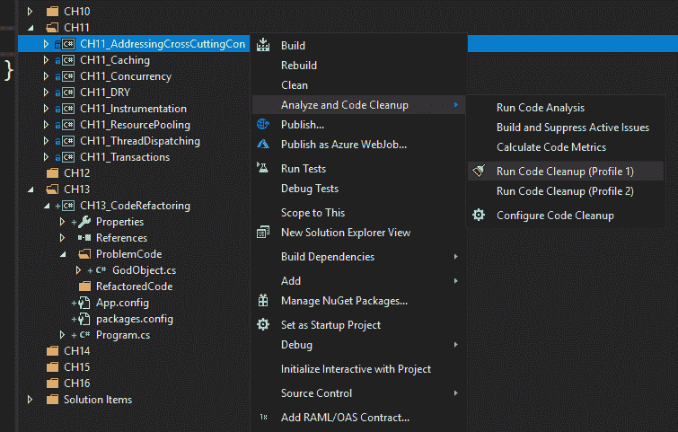
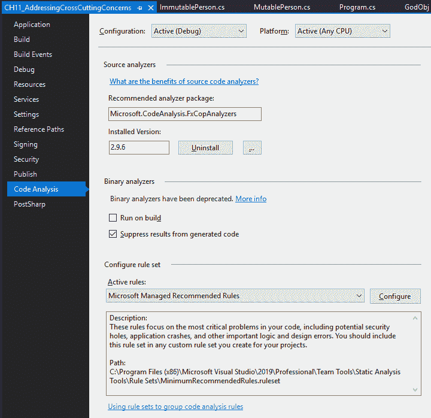
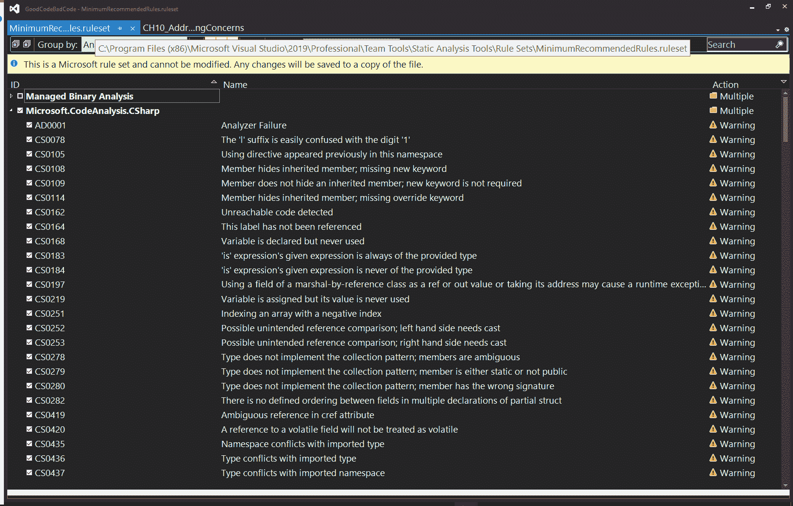
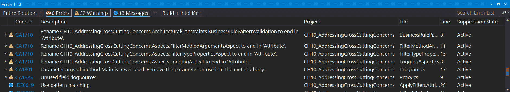
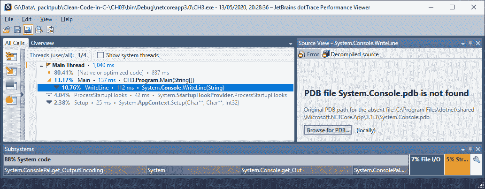
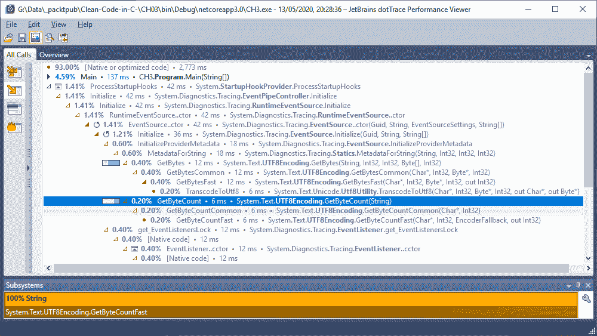
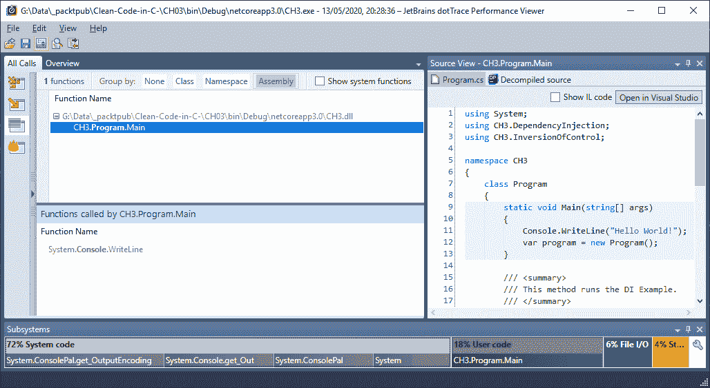
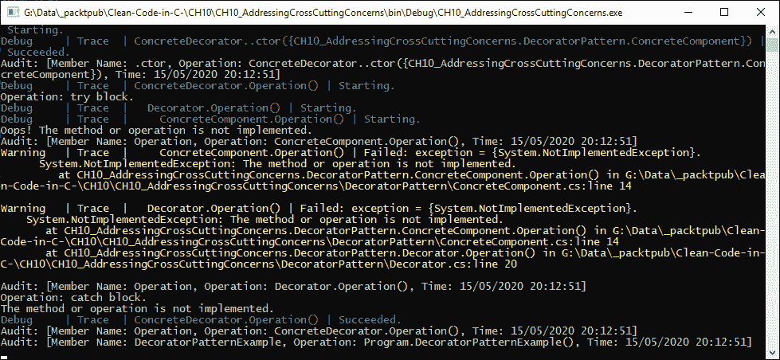
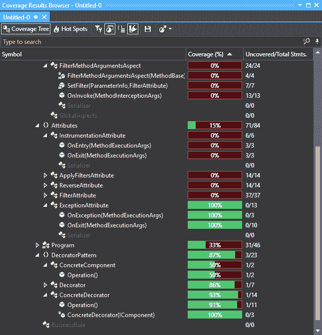
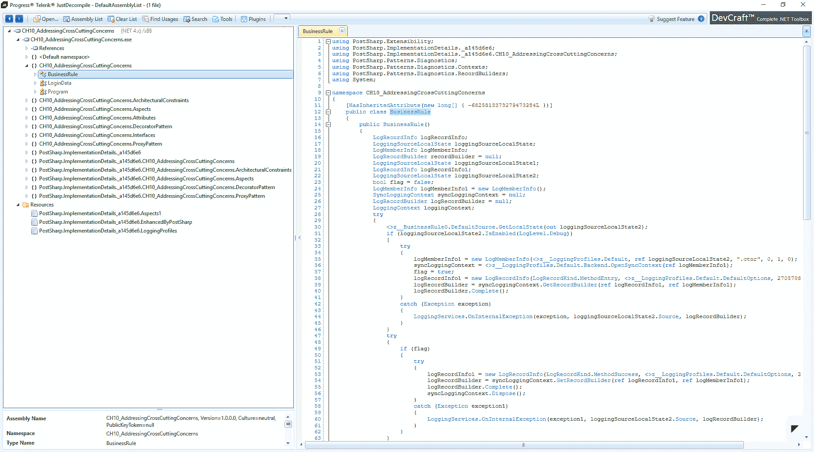

# 十二、使用工具来提升代码质量

作为一名程序员，提高代码质量是您最关心的问题之一。提高代码质量需要使用各种工具。旨在改进代码并加速开发的工具包括**代码度量**、**快速操作**、**JetBrains dotTrace**分析器、**JetBrains ReSharper**和**Telerik JustDecompile**。

这是本章的主要内容，包括以下主题：

*   定义优质代码
*   执行代码清理和计算代码度量
*   执行代码分析
*   快速行动
*   使用 JetBrains dotTrace 探查器
*   使用 JetBrains ReSharper
*   使用 Telerik JustDecompile

本章结束时，您将获得以下技能：

*   使用代码度量度量软件复杂性和可维护性
*   使用快速操作使用单个命令进行更改
*   使用 JetBrains dotTrace 评测代码并分析瓶颈
*   使用 JetBrains ReSharper 重构代码
*   使用 Telerik JustDecompile 反编译代码并生成解决方案

# 技术要求

*   本书的源代码：[https://github.com/PacktPublishing/Clean-Code-in-C-](https://github.com/PacktPublishing/Clean-Code-in-C-)
*   Visual Studio 2019 社区版或更高版本：[https://visualstudio.microsoft.com/downloads/](https://visualstudio.microsoft.com/downloads/)
*   Telerik JustDecompile:[https://www.telerik.com/products/decompiler.aspx](https://www.telerik.com/products/decompiler.aspx)
*   JetBrains ReSharper 终极版：[https://www.jetbrains.com/resharper/download/# section=resharper-安装程序](https://www.jetbrains.com/resharper/download/# section=resharper-installer)

# 定义优质代码

良好的代码质量是软件的基本属性。低质量的代码可能导致财务损失、浪费时间和精力，甚至死亡。高标准代码将具有**性能、可用性、安全性、可扩展性、可维护性、可访问性、可部署性和可扩展性**（**PASSMADE**）的品质。

Performant 代码很小，只做它需要做的事情，而且非常快。性能代码不会使系统停止运行。使系统陷入停顿的是文件**输入/输出**（**I/O**操作、内存使用和**中央处理器**（**CPU**使用。低性能代码是重构的候选对象。

可用性是指软件在要求的性能水平上持续可用。可用性是软件运行的**时间**（**tsf**）与预计运行的**总时间**（**ttef**）之间的比率，例如，tsf=700；ttef=744。700/744=0.9409=94.09%可用性。

安全代码是正确验证输入以防止无效数据格式、无效数据范围和恶意攻击的代码，并对其用户进行完全身份验证和授权。安全代码也是容错代码。例如，如果您正在将资金从一个帐户转移到另一个帐户的过程中，并且系统崩溃，则操作应确保数据保持完整，不会从有问题的帐户中取出任何资金。

可伸缩代码是可以安全地处理使用系统的用户数量呈指数级增长的代码，而不会使系统陷入停顿。因此，无论软件是每小时处理一个请求还是每小时处理一百万个请求，代码的性能都不会下降，也不会因负载过大而停机。

可维护性是指修复 bug 和添加新功能的容易程度。可维护的代码应该组织良好，易于阅读。应该有低耦合和高内聚，这样代码就可以很容易地维护和扩展。

可访问代码是能力有限的人发现易于根据需要修改和使用的代码。示例包括具有高对比度的用户界面、诵读困难者和盲人的讲述者，等等。

可部署性主要关注软件的用户，用户是独立用户、远程访问用户还是本地网络用户？无论用户是哪种类型，软件都应该非常容易部署，不会出现任何问题。

可扩展性是指通过向应用添加新功能来扩展应用的容易程度。意大利面代码和低内聚性的高度耦合代码使得这非常困难并且容易出错。这样的代码很难阅读和维护，并且不容易扩展。因此，可扩展代码是易于阅读、易于维护的代码，因此易于向其添加新功能。

从高质量代码的要求中，您可以很容易地推断出由于未能满足这些要求而可能出现的各种问题。未能满足这些要求将导致性能不佳的代码变得令人沮丧和无法使用。客户会因为停机时间的增加而烦恼。黑客可以利用代码中不安全的漏洞进行攻击。随着越来越多的用户加入到系统中，软件的性能将呈指数级下降。代码将很难修复或扩展，在某些情况下不可能修复或扩展。能力有限的用户将无法围绕其限制修改软件，部署将是一场配置噩梦。

代码度量用于救援。代码度量使开发人员能够度量代码的复杂性和可维护性，从而帮助我们识别重构候选代码。

通过快速操作，您可以使用单个命令重构 C 代码，例如将代码提取到自己的方法中。JetBrains dotTrace 允许您分析代码并查找性能瓶颈。此外，JetBrains ReSharper 是 Visual Studio 生产力扩展，它使您能够分析代码质量、检测代码气味、强制执行编码标准和重构代码。Telerik JustDecompile 帮助您反编译现有代码以进行故障排除，并从中创建**中间语言**（**IL**）、C# 和 VB.NET 项目。如果您不再拥有源代码，并且需要维护或扩展编译后的代码，这一点尤其有用。您甚至可以为编译后的代码生成调试符号。

让我们从代码度量开始，更深入地研究所提到的工具。

# 执行代码清理和计算代码度量

在研究如何收集代码度量之前，我们首先需要知道它们是什么，以及为什么它们对我们有用。**代码度量**主要关注软件复杂性和可维护性。它们帮助我们了解如何提高源代码的可维护性并降低源代码的复杂性。

Visual Studio 2019 为您计算的代码度量包括以下内容：

*   **可维护性指标**：代码可维护性是**应用生命周期管理**（**ALM**的重要组成部分。在软件使用寿命结束之前，必须对其进行维护。代码库越难维护，在需要完全替换之前，源代码的生命周期就越短。与维护现有系统相比，编写新软件来替换出现故障的系统要复杂得多，成本也更高。代码可维护性的度量称为可维护性指数。此值是介于 0 和 100 之间的整数值。以下是可维护性指数评级、颜色及其含义：
    *   *20 及以上*的任何值均具有*绿色*评级，以确保良好的可维护性。
    *   中等可维护代码为*介于 10 和 19*之间，等级为*黄色*。
    *   任何低于 10 的*都会被评为*红色*，这意味着很难维持。*
*   **圈复杂度**：代码复杂度，又称圈复杂度，是指通过软件的各种代码路径。路径越多，软件就越复杂。软件越复杂，测试和维护就越困难。复杂的代码会导致更容易出错的软件发布，并且会使软件的维护和扩展变得困难。因此，建议将代码复杂性保持在最低限度。
*   **继承深度**：继承深度和类耦合度量受流行的编程范式**面向对象编程**（**OOP**的影响。使用 OOP，类可以从其他类继承。从继承的类称为基类。从基类继承的类称为子类。相互继承的类数量的度量称为继承深度。

继承级别越深，如果某个基类中发生了更改，则派生类中出现错误的可能性就越大。理想的继承深度是 1。

*   **类耦合**：OOP 允许类耦合。当一个类被参数、局部变量、返回类型、方法调用、泛型或模板实例化、基类、接口实现、在额外类型上定义的字段和属性装饰直接引用时，就会出现类耦合。

类耦合代码度量确定类之间的耦合级别。为了使代码更易于维护和扩展，类耦合应该保持在绝对最小。在 OOP 中，实现这一点的一种方法是使用基于接口的编程。这样可以避免直接访问类。这种编程方法的好处是，只要类实现相同的接口，就可以将类交换进交换出。低质量代码具有高耦合性和低内聚性，而高质量代码具有低耦合性和高内聚性。

Ideally, software should be highly cohesive with low coupling, because it makes programs easier to test, maintain, and extend.

*   **源代码行**：您的源代码行的完整计数，包括空行，由源代码行度量来衡量。
*   **可执行代码行**：可执行代码中操作的度量是通过可执行代码行度量来度量的。

现在，您已经了解了 Visual Studio 2019 版本 16.4 及以后版本中的代码度量以及可用度量，现在是时候查看它们的实际情况了，如下所示：

1.  在 Visual Studio 中打开您喜欢的任何项目。
2.  右键单击项目。
3.  选择分析和代码清理|**运行**代码清理（配置文件 1），如以下屏幕截图所示：



4.  现在，选择计算代码度量。
5.  您应该会看到“代码度量结果”窗口出现，如以下屏幕截图所示：


从屏幕截图中可以看到，我们所有的类、接口和方法都标有*绿色*指示器。这意味着所选项目是可维护的项目。如果这些行中有任何一行被标记为黄色或红色，那么您需要对它们进行寻址，并将它们重构为绿色。好的，我们已经讨论了代码度量，因此，自然地，我们继续讨论代码分析。

# 执行代码分析

为了帮助开发人员识别源代码中的潜在问题，Microsoft 提供了代码分析工具作为 VisualStudio 的一部分。代码分析执行静态源代码分析。该工具将识别设计缺陷、全球化问题、安全问题、性能问题和互操作性问题。

打开“解决方案”一书，选择 CH11_AddressingCrossCuttingConcerns 项目。然后，从项目菜单中，从菜单中选择项目| CH11_AddressingCrossCuttingConcerns |属性。在项目的属性页面上，选择代码分析，如以下屏幕截图所示：



如前一屏幕截图所示，如果您看到未安装推荐的 analyzer 软件包，请单击 Install 安装。安装后，版本号将显示在“已安装的版本”框中。对我来说，它是 2.9.6 版。默认情况下，活动规则是 Microsoft 托管的推荐规则。如说明所示，此规则集的位置为 C:\Program Files（x86）\Microsoft Visual Studio\2019\Professional\Team Tools\Static Analysis Tools\Rule Sets\MinimumRecommendeRules.ruleset。打开文件。它将作为 Visual Studio 工具窗口打开，如下所示：



正如您在前面的屏幕截图中所看到的，您可以选择和取消选择规则。关闭窗口时，系统将提示您保存任何更改。要运行代码分析，请转到分析和代码清理|代码分析。为了查看结果，您需要打开错误列表窗口。您可以从“视图”菜单中打开它。

运行代码分析后，您将看到错误、警告和消息的列表。您可以解决其中的每一个问题，以提高软件的整体质量。以下屏幕截图中可以看到其中的一个示例：



从前面的屏幕截图中，您可以看到`CH10_AddressingCrossCuttingConcerns`项目有*32 条警告和 13 条消息*。如果我们要处理警告和消息，我们会将它们减少到 0 条消息和 0 条警告。所以，既然您已经了解了如何使用代码度量来查看软件的可维护性，并且已经分析了它以查看可以进行哪些改进，现在是时候来看看快速操作了。

# 快速行动

另一个我喜欢使用的便捷工具是快速行动工具。在代码行中，快速操作以螺丝刀、灯泡或错误灯泡的形式出现，使您能够使用单个命令生成代码、重构代码、抑制警告、执行代码修复和添加`using`语句。

由于`CH10_AddressingCrossCuttingConcerns`项目有 32 条警告和 13 条消息，我们可以使用此项目查看快速行动。请查看以下屏幕截图：


查看前面的屏幕截图，我们可以在第 10 行看到灯泡。如果我们点击灯泡，会弹出以下菜单：


如果我们点击 addreadonly 修饰符，`readonly`访问修饰符放在私有访问修饰符之后。尝试使用快速操作修改代码。一旦你掌握了窍门，这就相当简单了。一旦你有了一个快速行动的游戏，继续看 JetBrains dotTrace 分析工具。

# 使用 JetBrains dotTrace 探查器

JetBrains dotTrace 分析器是 JetBrains ReSharper 最终许可证的一部分。由于我们将研究这两种工具，我建议您在继续之前下载并安装 JetBrains ReSharper Ultimate。

JetBrains does have a trial version available if you don't already own a copy. There are versions available for Windows, macOS, and Linux.

JetBrains dotTrace 评测工具与 Mono、.NET Framework 和.NET Core 配合使用。探查器支持所有应用类型，您可以使用探查器分析和跟踪代码库中的性能问题。探查器将帮助您找到导致 100%CPU 使用率、100%磁盘 I/O、内存最大化或出现溢出异常以及许多其他问题的根源。

许多应用执行**超文本传输协议**（**HTTP**请求。探查器将分析应用是如何处理这些请求的，它还将对数据库上的**结构化查询语言**（**SQL**查询进行同样的分析。可以分析静态方法和单元测试，并且可以在 VisualStudio 中查看结果。还有一个独立的版本，您可以使用。

有四个基本的评测选项：采样、跟踪、逐行和时间线。当您第一次开始查看应用的性能时，您可能会决定使用采样，它提供了对调用时间的准确测量。跟踪和逐行分析提供了更详细的评测，但它们确实会给正在评测的程序增加更多开销（内存和 CPU 使用）。时间线类似于随时间采样和收集应用事件。在他们之间，没有无法追踪和解决的问题。

高级分析选项包括实时性能计数器、线程时间、实时 CPU 指令和线程周期时间。实时性能计数器测量方法进入和退出之间的时间。线程时间度量线程运行时间。基于 CPU 寄存器，实时 CPU 指令提供方法进入和退出的准确时间。

探查器可以连接到正在运行的.NET Framework 4.0（或更高版本）或.NET Core 3.0（或更高版本）应用和进程、评测本地应用和评测远程应用。其中包括独立应用。NETCore应用；**互联网信息服务**（**IIS**）托管的 web 应用；IIS Express 托管的应用。NET Windows 服务，AuthT4。Windows 通信基金会 T5 TAL（AutoT66WCF OLE T7T）服务；Windows 应用商店和**通用 Windows 平台**（**UWP**应用；任何.NET 进程（在运行分析会话后启动）；基于 Mono 的桌面或控制台应用；和 Unity 编辑器或独立的 Unity 应用。

要从菜单中访问 Visual Studio 2019 中的探查器，请选择 Extensions | ReSharper | Profile | Show Performance profiler。在下面的屏幕截图中，您可以看到尚未分析任何内容。此外，当前选择的要分析的项目设置为基本 CH3，分析类型设置为 Timeline。我们将通过扩展时间线下拉功能并选择采样来评测 CH3，如以下屏幕截图所示：


如果要对不同的项目进行采样，只需展开“项目”下拉列表并选择要评测的项目。项目将建成，探查器将启动。然后，您的项目将运行并关闭。结果将显示在 dotTrace 分析应用中，如以下屏幕截图所示：



从前面的屏幕截图中，您可以看到显示了四个线程中的第一个。这是我们程序的线程。其他线程用于支持进程，使我们的程序能够与负责退出程序和清理系统资源的终结器线程一起运行。

左侧下方的“所有呼叫”菜单项包括以下内容：

*   螺纹树
*   呼叫树
*   简单列表
*   热点

当前选项选择了线程树。让我们在下面的屏幕截图中查看扩展的调用树：



探查器为您的代码显示完整的调用树，其中包括系统代码以及您自己的代码。您可以查看打电话所花费的时间百分比。这允许您识别任何长时间运行的方法并解决它们。

现在，我们来看看简单的列表。正如您在下面的屏幕截图中看到的普通列表视图，我们可以根据以下标准对其进行分组：

*   没有一个
*   班
*   名称空间
*   装配

您可以在以下屏幕截图中看到上述条件：



当您单击列表中的项目时，您可以查看该方法所在类的源代码。这是很有用的，因为您可以看到问题所在的代码以及需要执行的操作。我们将看到的最后一个采样配置文件屏幕是热点视图，如以下屏幕截图所示：


分析器显示，作为代码起点的主线程只占用 4.59%的处理时间。如果单击根目录，18%的代码是我们的用户代码，72%的代码是系统代码，如以下屏幕截图所示：


我们只是用这个分析工具接触了表面。还有更多，我鼓励你自己尝试一下。本章的主要目的是向您介绍可用的工具。

For further information on how to use JetBrains dotTrace, I refer you to their online learning materials, at [https://www.jetbrains.com/profiler/documentation/documentation.html](https://www.jetbrains.com/profiler/documentation/documentation.html).

接下来，我们来看 JetBrains ReSharper。

# 使用 JetBrains ReSharper

在本节中，我们将介绍 JetBrains ReSharper 如何帮助您改进代码。ReSharper 是一个非常广泛的工具，就像 profiler 一样，它是 ReSharper 最终版本的一部分，我们将只触及表面，但您希望了解该工具是什么，以及它可以为您改进 Visual Studio 编码体验做些什么。以下是使用 ReSharper 的一些好处：

*   使用 ReSharper，您可以执行代码质量分析。
*   它将提供改进代码、消除代码气味和修复编码问题的选项。
*   使用导航系统，您可以完全遍历解决方案并跳转到任何感兴趣的项目。您有许多不同的助手，包括扩展智能感知、代码重组等。
*   重构得益于 ReSharper 提供的可本地化或解决方案范围的产品。
*   您还可以使用 ReSharper 生成源代码，例如基类和超类，以及内联方法。
*   在这里，可以按照公司的编码策略清理代码，以清除未使用的导入和其他未使用的代码。

您可以从 Visual Studio 2019 Extensions 菜单访问 ReSharper 菜单。在代码编辑器中，用鼠标右键单击一段代码将显示一个包含相应菜单项的上下文菜单。上下文菜单中的 ReSharper 菜单项是重构此…，如以下屏幕截图所示：


现在，从 VisualStudio2019 菜单中，运行 Extensions | ReSharper | Inspect |解决方案中的代码问题。ReSharper 将处理解决方案，然后显示“检查结果”窗口，如以下屏幕截图所示：


正如您在前面的屏幕截图中所看到的，ReSharper 发现我们的代码有 527 个问题，其中 436 个问题正在显示。这些问题包括常见做法和代码改进、编译器警告、约束冲突、语言使用机会、潜在的代码质量问题、代码冗余、符号声明冗余、拼写问题和语法样式。

如果展开编译器警告，我们会发现有三个问题，如下所示：

*   `_name`字段从未分配。
*   从不使用`nre`局部变量。
*   此`async`方法缺少`await`操作符，将同步运行。使用`await`操作符等待非阻塞**应用编程接口**（**API**）调用，或`await TaskEx.Run(...)`在后台线程上执行 CPU 绑定工作。

这些问题是无法赋值或使用的变量声明，以及缺少同步运行的`await`运算符的`async`方法。如果单击第一个警告，它将带您进入从未分配的代码行。查看这个类，您可以看到字符串被声明和使用，但它从未被赋值。由于我们检查字符串是否包含`string.Empty`，因此可以将该值分配给声明。因此，更新的行将如下所示：

```cs
private string _name = string.Empty;
```

由于`_name`变量仍然高亮显示，我们可以将鼠标悬停在它上面，看看问题出在哪里。快速操作通知我们，`_name`变量可以标记为只读。让我们添加`readonly`修饰符。因此，这条线现在变成了：

```cs
private readonly string _name = string.Empty;
```

如果我们点击刷新按钮，我们会发现发现发现的问题数量现在是 526。然而，我们解决了两个问题。那么，这个数字应该是 525 吗？不，我们修复的第二个问题不是 ReSharper 发现的问题，而是 Visual Studio Quick Actions 发现的改进。因此，ReSharper 显示了它检测到的问题的正确数量。

让我们看看`LooseCouplingB`类潜在的代码质量问题。ReSharper 报告了此方法中可能存在的`System.NullReferenceException`。让我们先看一下代码，如下所示：

```cs
public LooseCouplingB()
{
    LooseCouplingA lca = new LooseCouplingA();
   lca = null;
    Debug.WriteLine($"Name is {lca.Name}");
}
```

果不其然，我们确实有`System.NullReferenceException`盯着我们的脸。我们将查看`LooseCouplingA`类，以确认哪些成员应设置为`null`。另外，要设置的成员是`_name`，如下面的代码片段所示：

```cs
public string Name
{
    get => _name.Equals(string.Empty) ? StringIsEmpty : _name;

    set
    {
        if (value.Equals(string.Empty))
            Debug.WriteLine("Exception: String length must be greater than zero.");
    }
}
```

但是，`_name`正在检查是否为空。所以，实际上，代码应该设置为`_name`到`string.Empty`。因此，我们在`LooseCouplingB`中的固定构造函数如下所示：

```cs
public LooseCouplingB()
{
    var lca = new LooseCouplingA
    {
        Name = string.Empty
    };
    Debug.WriteLine($"Name is {lca.Name}");
}
```

现在，如果我们刷新 Inspection Results 窗口，我们的问题列表减少了五个，因为除了正确分配`Name`属性外，我们还利用语言使用机会简化了我们的实例化和初始化，这是由 ReSharper 检测到的。使用该工具，消除“检查结果”窗口中发现的问题。

ReSharper 还可以生成*依赖关系图*。要为我们的解决方案生成依赖关系图，请选择 Extensions | ReSharper | Architecture | Show Project dependency diagram。这将显示我们的解决方案的项目依赖关系图。名为`CH06`的黑色容器框是名称空间，前缀为`CH06_`的灰色/蓝色框是项目，如下图所示：


从`CH06`名称空间中的项目依赖关系图可以看出，`CH06_SpecFlow`和`CH06_SpecFlow.Implementation`之间存在项目依赖关系。类似地，还可以使用 ReSharper 生成类型依赖关系图。选择 Extensions | ReSharper | Architecture |类型依赖关系图。

如果我们在`CH10_AddressingCrossCuttingConcerns`项目中为`ConcreteClass`生成图表，则会生成图表，但最初只显示`ConcreteComponent`类。右键点击图上的`ConcreteComponent`框，选择添加所有引用类型。您将看到添加了`ExceptionAttribute`类和`IComponent`接口。右键点击`ExceptionAttribute`类，选择 Add All Referenced Types（添加所有引用的类型），结果如下：


这个工具真正奇妙之处在于，您可以按名称空间对图表元素进行排序。这对于具有多个大型项目和深层嵌套名称空间的大规模解决方案非常有用。虽然我们可以右键单击代码并转到项目声明是件好事，但您无法在视觉上看到您正在进行的项目的布局，这就是为什么此工具非常有用的原因。以下是按名称空间组织的类型依赖关系图的示例：


很多时候，我真的可以在日常工作中使用这样的图表。此图是帮助开发人员找到解决复杂问题的方法的技术文档。他们将能够看到哪些名称空间可用，以及所有内容是如何相互关联的。这将使开发人员能够正确了解在执行新开发时应将新类、枚举和接口放置在何处，而且，如果他们正在执行维护，他们将知道在何处查找对象。此图也适用于查找重复的名称空间、接口和对象名称。

现在让我们看看覆盖率。进行如下工作：

1.  选择 Extensions | ReSharper | Cover | Cover 应用。
2.  将显示覆盖率配置对话框，默认选择的选项将是独立的。
3.  选择可执行文件。
4.  您可以从`bin`文件夹中选择.NET 应用。
5.  以下屏幕截图显示了“覆盖率配置”对话框：


6.  单击 Run 按钮启动应用并收集分析数据。ReSharper 将显示以下对话框：


然后应用将运行。当应用运行时，覆盖率探查器将收集数据。我们选择的可执行文件是一个控制台应用，它显示以下数据：



7.  单击控制台窗口，然后按任意键退出。覆盖率对话框将消失，然后将初始化存储。最后，将显示覆盖率结果浏览器窗口，如下所示：



这个窗口包含非常有用的信息。它提供了一个未调用的代码的可视指示器，标记为红色。已执行的代码以绿色标记。使用此信息，您可以看到代码是否是可以删除的死代码，或者由于通过系统的路径而未执行但仍然是必需的，或者出于测试目的被注释掉，或者仅仅因为开发人员忘记在正确的位置添加调用或条件检查错误而未被调用。

要转到感兴趣的项目，您只需双击该项目，然后就会看到您感兴趣的特定代码。我们的`Program`类只涵盖 33%的代码。那么，让我们双击`Program`，看看是怎么回事。结果输出显示在以下代码块中：

```cs
static void Main(string[] args)
{
    LoggingServices.DefaultBackend = new ConsoleLoggingBackend();
    AuditServices.RecordPublished += AuditServices_RecordPublished;
    DecoratorPatternExample();
    //ProxyPatternExample();
    //SecurityExample();

    //ExceptionHandlingAttributeExample();

    //SuccessfulMethod();
    //FailedMethod();

    Console.ReadKey();
}
```

正如您从代码中看到的，我们的一些代码没有被涵盖的原因是，出于测试目的，对代码的调用被注释掉了。我们可以让代码保持原样（在本例中我们将这样做）。但是，您也可以删除死代码或通过删除注释来恢复代码。现在，您知道为什么代码没有被覆盖。

好了，现在我们已经向您介绍了 ReSharper，并了解了帮助您编写好的、干净的 C# 代码的工具，现在是时候看看我们的下一个工具了，叫做 Telerik JustDecompile。

# 使用 Telerik JustDecompile

我曾多次使用 Telerik JustDecompile，用于跟踪第三方库中的 bug、恢复丢失的重要项目源代码、检查程序集混淆的强度，以及用于学习目的。这是我极力推荐的一种工具，多年来它已经多次证明了它的价值。

反编译引擎是开源的，您可以从[获取源代码 https://github.com/telerik/justdecompileengine](https://github.com/telerik/justdecompileengine) ，因此您可以自由地为项目做出贡献，并为其编写自己的扩展。您可以从 Telerik 网站下载 Windows Installer，网址为[https://www.telerik.com/products/decompiler.aspx](https://www.telerik.com/products/decompiler.aspx) 。所有源代码都是完全可导航的。反编译器可以作为独立应用或 Visual Studio 扩展提供。从反编译的程序集创建 VB.NET 或 C# 项目，并从反编译的程序集提取和保存资源。

下载并安装 Telerik JustDecompile。然后，我们将完成反编译过程，并从程序集生成一个 C# 项目。安装过程中可能会提示您安装其他工具，但您可以取消选择 Telerik 的其他产品。

运行 Telerik JustDecompile 独立应用。找到一个.NET 程序集，然后将其拖动到 Telerik JustDecompile 的左窗格中。它将反编译代码并在左侧显示代码树。如果选择左侧的项目，代码将显示在右侧，如屏幕截图所示：



正如您所看到的，反编译过程很快，并且在反编译程序集方面做得相当好。反编译并不完美，但在大多数情况下，它完成了这项工作。进行如下工作：

1.  在插件菜单项右侧的下拉列表中，选择 C#。
2.  然后，单击工具|创建项目。
3.  有时会提示您选择要作为目标的.NET 版本；其他时候，不是。
4.  然后，系统将询问您保存项目的位置。
5.  然后将项目写入该位置。

然后，您可以在 VisualStudio 中打开该项目并对其进行操作。如果您遇到任何问题，Telerik 会将问题记录在您的代码中，并提供电子邮件。您可以随时向他们发送电子邮件，告知您遇到的任何问题。他们善于应对和解决问题。

好了，我们已经完成了本章中工具的学习，现在，让我们来看看我们在总结中学到的东西。

# 总结

在本章中，您已经了解了代码度量如何提供代码质量的几种度量，以及生成它们是多么容易。代码度量包括行数（包括空行）与可执行代码行数、圈复杂度、内聚和耦合级别以及代码的可维护性。重构颜色代码为绿色表示良好，黄色表示理想需要重构，红色表示明确需要重构。

然后，您看到了提供项目的静态代码分析并查看结果是多么容易。还介绍了如何查看和修改规则集，这些规则集控制分析的内容和未分析的内容。然后，您体验了快速操作，并了解了如何使用单个命令执行错误修复、使用语句添加和重构代码。

然后，我们使用 JetBrains dotTrace profiler 测量应用的性能，跟踪瓶颈，并确定占用最多处理时间的方法。我们研究的下一个工具是 JetBrains ReSharper，它使我们能够检查代码中的各种问题和潜在改进。我们确定了其中的几个，并进行了必要的更改，并看到使用此工具改进代码是多么容易。然后，我们研究了如何为依赖项和类型依赖项创建体系结构图。

最后，我们看了 Telerik JustDecompile，这是一个非常有用的工具，可用于反编译程序集，并从中生成 C# 或 VB.NET 中的项目。当遇到 bug 或者程序需要扩展，但您无法再访问现有的源代码时，这会非常有用。

在接下来的章节中，我们将主要关注代码，以及如何重构代码。但现在，用以下问题测试你的知识，并通过*进一步阅读*部分提供的链接进一步阅读。

# 问题

1.  什么是代码度量，我们为什么要使用它们？
2.  说出六个代码度量值。
3.  什么是代码分析，为什么它有用？
4.  什么是快速行动？
5.  JetBrains dotTrace 的用途是什么？
6.  JetBrains ReSharper 的用途是什么？
7.  为什么要使用 Telerik JustDecompile 来反编译程序集？

# 进一步阅读

*   关于代码度量的官方 Microsoft 文档：[https://docs.microsoft.com/en-us/visualstudio/code-quality/code-metrics-values?view=vs-2019](https://docs.microsoft.com/en-us/visualstudio/code-quality/code-metrics-values?view=vs-2019)
*   关于快速行动的 Microsoft 官方文档：[https://docs.microsoft.com/en-us/visualstudio/ide/quick-actions?view=vs-2019](https://docs.microsoft.com/en-us/visualstudio/ide/quick-actions?view=vs-2019)
*   JetBrains 点跟踪分析器：[https://www.jetbrains.com/profiler/](https://www.jetbrains.com/profiler/)