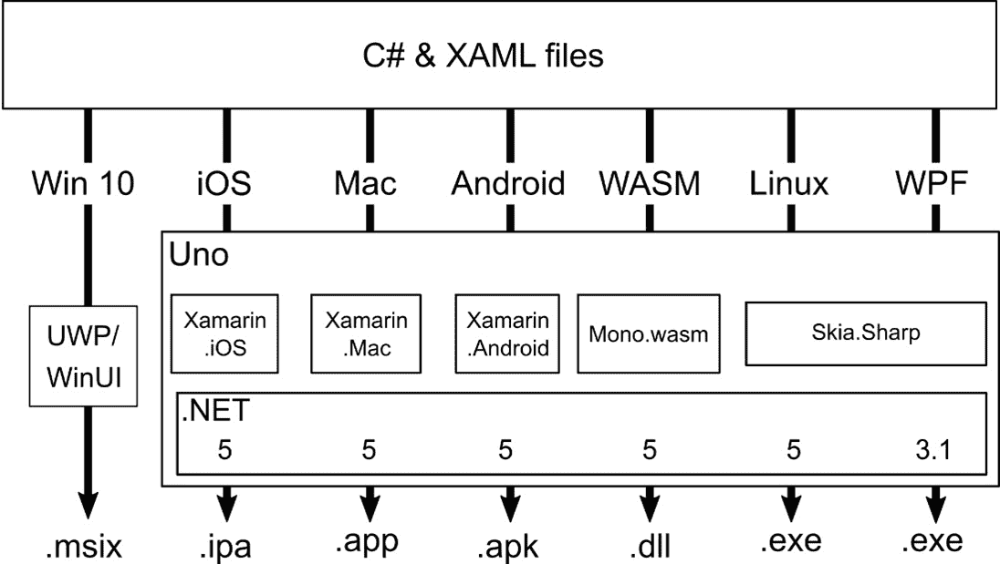
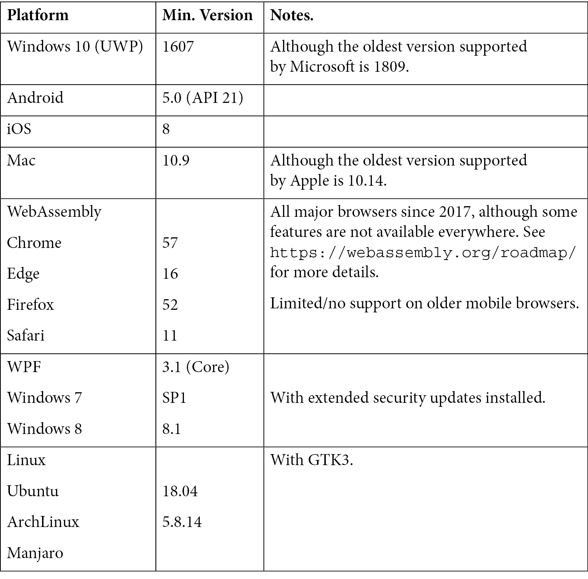
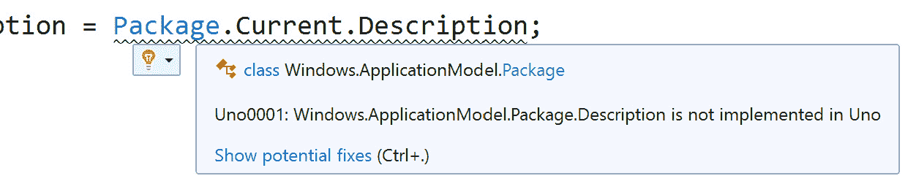

# *第一章*:介绍 Uno 平台

Uno 平台**Uno 平台**是一个跨平台的、单代码基的解决方案，用于开发运行在各种设备和操作系统上的应用程序。 这是建立在 Windows 开发 api 和工具的丰富传统之上的。 这允许你利用你已经拥有的 Windows 应用程序开发技能，并使用它们为 Android、iOS、macOS、WebAssembly、Linux 等平台构建应用程序。

这本书将是你 Uno 平台的指南。 它将向您展示如何使用 Uno 平台的功能来构建各种不同的应用程序，以解决现实场景。

在本章中，我们将涵盖以下主题:

*   了解 Uno 平台是什么
*   使用 Uno 平台
*   设置开发环境

在本章结束时，你会明白为什么你想要使用 Uno 平台来开发应用程序，以及它最适合帮助你构建的应用程序类型。 阅读本书后续章节时，您还可以设置您的环境，以便准备开始构建应用程序。

# 技术要求

在本章中，将指导您完成设置开发机器的过程。 为了完成书中所有的例子，你需要一台能运行以下任何一种的机器:

*   **Windows 10**(1809)或更高
*   **macOS 10.15**(Catalina)或更高

如果你只有一个访问权限，你仍然可以跟随大部分的书。 本书主要假设你使用的是一台 Windows 机器。 我们将只在绝对必要时展示使用 Mac 的示例。

本章没有源代码。 但是，其他章节的代码可以在以下 URL 中找到:[https://github.com/PacktPublishing/Creating-Cross-Platform-C-Sharp-Applications-with-Uno-Platform](https://github.com/PacktPublishing/Creating-Cross-Platform-C-Sharp-Applications-with-Uno-Platform)。

# 了解 Uno 平台是什么

根据网站([https://platform.uno/](https://platform.uno/))，Uno 平台是“*首个也是唯一一个用于 Windows、WebAssembly、iOS、macOS、Android 和 Linux*单代码基应用的 UI 平台。”

这是一个复杂的句子，所以让我们分解一下关键元素:

*   作为一个 UI 平台，它是一种用**用户界面**(**UI**)构建应用程序的方法。 这与那些基于文本、从命令行(或等效)运行、嵌入硬件或以其他方式交互(如语音)的平台形成了对比。
*   使用*单一代码基*意味着您只需要编写一次代码就可以在多个设备和操作系统上运行。 具体来说，这意味着可以为应用程序运行的每个平台编译相同的代码。 这与那些将代码在编译到另一个平台之前转换成不同编程语言的工具形成了对比。 它也是唯一一个奇异的代码基，而不是输出。 一些类似的工具创建一个独特的包，在每个操作系统的主机应用程序中运行，或者用 HTML 和 JavaScript 创建所有内容，并在嵌入式浏览器中运行。 《Uno Platform》没有做到这两点。 相反，它为每个平台生成本机应用程序包。
*   Windows 应用程序基于 Windows 10 的**通用 Windows 平台**(**UWP**)。 微软目前正在进行工作，以使**WinUI 3**成为 UWP 的继承者。 Uno 平台已经与合作，以确保一旦WinUI 3 达到可比较的操作水平，Uno 平台可以轻松地从 UWP 过渡。
*   Windows 支持还包括**Windows Presentation Foundation**(**WPF**)，由 skisharp 提供支持，适用于需要运行在旧版本 Windows(7.1 或 8.1)上的应用程序。
*   在 WebAssembly 中运行的应用程序的所有代码都被编译成在 web 浏览器中运行。 这意味着它们可以从任何具有兼容浏览器的设备访问，而无需在服务器上运行代码。
*   通过支持 iOS，创建的应用程序可以在 iphone 和 ipad 上运行。
*   由于支持 macOS，这些应用程序可以在 MacBook、iMac 或 Mac Mini 上运行。
*   对 Android 的支持适用于运行 Android 操作系统的手机和平板电脑。
*   Linux 支持适用于特定的 Linux PC 等值发行版，并由 skisharp 提供支持。

Uno Platform 通过重用微软为构建 UWP 应用程序而创建的工具、api 和 XAML 来实现上述所有功能。

回答“Uno 平台是什么?”这个问题的另一种方法是，它是一种方法*只写一次代码，然后让它在所有地方运行*。 “无处不在”的确切定义是不精确的，因为它不包括每一个能够运行代码的嵌入式系统或微控制器。 尽管如此，许多开发人员和企业一直希望一次性编写代码并在多个平台上轻松运行。 Uno 平台让这成为可能。

早期对微软 UWP 的一个批评是它在 Windows 上只有*通用*。 有了 Uno 平台，开发者现在可以让他们的 UWP 应用真正通用。

## Uno 平台简史

如今跨平台工具的数量多种多样，我们很容易忘记 2013 年的选择是多么有限。 当时，还没有通用的工具可以轻松地构建可以在多个操作系统上运行的本地应用。

加拿大软件设计开发公司**([https://nventive.com/](https://nventive.com/))在面临挑战。 他们在为 Windows 和微软工具开发应用程序方面拥有丰富的知识和经验，但他们的客户也要求他们为Android 和 iOS 设备开发应用程序。 他们发明了一种方法来编译他们为 Windows Phone(以及后来的 UWP)应用程序编写的代码，然后将其转移到其他平台上，而不是通过为不同平台构建相同软件的多个版本来重新培训员工或重复工作。**

 **到 2018 年，很明显，这种方法对他们来说已经成功了。 然后他们做了以下两件事:

1.  他们把自己创建的工具变成了一个开源项目，称之为 Uno 平台。
2.  他们增加了对 WebAssembly 的支持。

作为一个开源项目，这允许其他开发人员一起处理相同的问题。 Uno 平台已经收到了来自 200 多个外部贡献者的数千份贡献，并且已经扩展到支持更多的平台，并为最初支持的平台增加了额外的功能。

作为一个开源项目，它是免费使用的。 此外，它还得到了一家公司的支持，该公司的业务模式因 Red Hat 而流行，并已被广泛采用。 使用是免费的，并且有一些免费的公众支持。 然而，专业支持、培训和定制开发只能通过付费获得。

## Uno 平台如何工作

Uno 平台以的不同方式工作，并使用多种底层技术，这取决于您所构建的平台。 图 1.1 总结如下:

*   如果你正在为 Windows 10 构建一个应用程序，Uno 平台什么也不做，让所有的 UWP 工具编译和执行你的应用程序。
*   如果你正在为 iOS、macOS 或 Android 构建应用程序，Uno Platform 会将你的 UI 映射到本地平台对等物，并使用本地**Xamarin**库调用它所运行的操作系统。 它为每个操作系统生成适当的本地包。
*   如果你正在构建一个 WebAssembly 应用程序，Uno Platform 会根据**mono 编译你的代码。 wasm**运行，并将 UI 映射到 HTML 和 CSS。 然后将其打包成一个**. net**库，该库作为静态 web 内容与 Uno Platform web bootstrapper 一起启动。
*   要创建 Linux 应用程序，Uno Platform 将您的代码转换为**. net**等效代码，并使用**Skia**创建版本的 UI。 然后输出一个**. net 5**app，该 app 使用**GTK3**呈现 UI。
*   Apps for Windows 7 and 8 are created by Uno Platform by wrapping the compiled code in a simple **WPF** (**NETCore 3.1**) app that uses **SkiaSharp** to render the UI.

    参考下图:



图 1.1 - Uno 平台的高级架构

无论您构建的是哪个操作系统或平台，Uno platform 都会为该平台使用本地控件。 这可以让你的应用获得完全原生应用的体验和性能。唯一的例外是它使用的是 skisharp。 通过使用 skisharp, Uno Platform 在画布上绘制所有 UI 内容，而不是使用平台原生控件。 Uno平台没有为运行中的应用程序添加额外的抽象层(就像你在使用容器的跨平台解决方案中发现的那样，比如在 shell 应用程序中嵌入 WebView)。

Uno 平台可以让你用一个代码库做很多事情。 但它能做到一切吗?

## 这是灵丹妙药吗?

一次性编写代码并在任何地方运行代码的原则既强大又吸引人。 但是，有必要注意以下两点:

*   并不是所有的应用程序都应该针对所有平台创建。
*   这并不是不知道应用将在哪个平台上运行的借口。

此外，并不是所有的东西都需要一个应用程序。假设你只想分享一些不会经常更新的信息。 在这种情况下，拥有静态网页的网站可能更合适。

仅仅因为你能做某事，这一课*并不意味着你应该*也适用于应用程序。 当您看到创建在多个平台上运行的应用程序是多么容易时，您可能会忍不住在任何地方部署应用程序。 在你这么做之前，有一些重要的问题你需要问:

*   *所有平台都需要这个应用吗?* 人们想要并且需要在你提供的所有平台上使用它吗? 如果没有，你可能是在浪费精力。
*   *应用程序在所有平台上都有意义吗?* 假设应用程序有一个关键的功能，包括在外部捕获图像。 把它放在 PC 或 Mac 上有意义吗? 相反，如果应用程序需要输入大量信息，人们会愿意在手机的小屏幕上输入这些信息吗? 关于在何处提供应用程序的决定应该由其功能和将使用它的人来决定。 不要让你的决定仅仅建立在可能性之上。
*   *你能在所有平台上支持它吗?* 让应用程序在平台上可用所获得的价值，是否值得在该平台上发布、维护和支持该应用程序所付出的时间和精力? 如果你只有少数人在特定类型的设备上使用应用程序，但他们产生了许多支持请求，你可以重新评估你对这类设备的支持。

没有任何技术可以为所有场景提供完美的解决方案，但希望你已经看到 Uno 平台提供的机会。 现在让我们仔细看看为什么以及什么时候需要使用它。

# 使用 Uno 平台

现在你知道了Uno 平台是什么，我们来看看你在选择是否使用它时需要考虑什么。 有四个因素需要考虑:

*   你已经知道的。
*   你希望瞄准哪些平台?
*   应用程序所需的功能。
*   它与替代方案的比较。

让我们来探讨一下这些与 Uno 平台相关的因素。

## Uno 平台允许你使用你已经知道的

Uno 平台最初是为开发者在**Visual Studio**中使用 c#和 XAML 创建的。 如果这对你来说很熟悉，这将使你很容易开始使用 Uno 平台，因为你将使用你已经知道的软件。

如果您已经熟悉 UWP 开发，那么差异将非常小。 如果您熟悉 WPF 开发，那么在 XAML 语法和可用功能方面有一些细微的差别。 当我们通过这本书，你将学习你需要建立 Uno 平台的一切。 只要您不期望一切都像在 WPF 中那样工作，那么就没问题。 此外，由于 WinUI 和 Uno 平台团队正在努力消除存在的微小差异，您可能永远不会注意到差异。

如果你不知道 c#或 XAML, Uno 平台还可以适合你,但是这本书假定您熟悉这些语言,你会发现它有助于第一次读*c# 9 和。net 5 -现代跨平台开发第五版马克·j·价格 Packt 出版*和*学习 WinUI 3.0,阿尔文 Ashcraft, 包装出版*。

## Uno 平台支持多种平台

Uno 平台的一大优点是它允许你面向许多平台进行构建。 Uno 平台支持最常见的平台，但如果您需要构建运行在利基平台或专业设备上的应用程序，那么它可能不适合您。 此外，如果您需要支持一个平台或操作系统的旧版本，您可能必须找到变通办法或替代解决方案。 下表显示了你可以使用 Uno 平台构建的支持平台的版本:



图 1.2 - Uno 平台支持的最低平台版本

支持多个平台也有好处，即使您想要跨不同平台的非常不同的应用程序行为或功能。 可以通过创建多个解决方案来支持多个平台，而不是将所有内容组合到一个解决方案中。

Uno 平台拥有高达 99%的代码和 UI 重用。 当你在所有设备上都需要相同的东西时，这很好。 然而，如果你需要不同的行为或为不同平台高度定制的 UI(这一点我们将在以后的章节中讨论)，在不同的解决方案中构建不同的应用程序会更容易，而不是在代码中放入大量的条件逻辑。 对于多少条件代码过多并没有硬性的规则，它取决于项目和个人偏好。 只要记住，如果您发现您的代码充满了条件注释，使其难以管理，它仍然是一个选项。

因此，也可以使用 Uno 平台为单个平台构建。 你可能不想创建一个到处都能运行的应用程序。 您可能只对一个平台感兴趣。 如果是这种情况，你也可以使用 Uno 平台。 如果将来您的需求发生变化，也可以很容易地添加额外的平台。

## Uno 平台可以完成你的应用所需要的一切吗?

Uno 平台能够重用 UWP API 来为其他平台构建的核心是，它有代码将 UWP API 映射到其他平台上的等效 API。 由于时间、实用性和优先级的限制，并不是所有的 api 都可以在所有的平台上使用。 一般来说，最常见的 api 可以在最广泛的平台上使用。 假设你需要使用更专业的功能，或者目标不是 Android、iOS、Mac 或 WebAssembly? 在这种情况下，建议检查您需要的特性是否可用。

提示

我们建议在开始编写代码之前确认应用程序所需的功能可用。 这将让你在开发过程的后期避免任何令人不快的意外。

由于印刷书籍的持久性以及新功能的频繁添加和更多 api 的支持，在这里列出支持的是不合适的。 相反，您可以在以下 URL 中看到一个受支持特性的高级列表:[https://platform.uno/docs/articles/supported-features.html](https://platform.uno/docs/articles/supported-features.html)。 在以下 URL 中还有一个受支持的 UI 元素列表:[https://platform.uno/docs/articles/implemented-views.html](https://platform.uno/docs/articles/implemented-views.html)。 当然，确认可用和不可用的最有效的方法是在以下 URL 中检查源代码:[https://github.com/unoplatform/uno](https://github.com/unoplatform/uno)。

如果您尝试使用不受支持的 API，您将在 Visual Studio 中看到提示，如图*图 1.3*所示。 如果你尝试在运行时使用这个，你会得到什么(一个**NOOP**)或一个**NotSupported**异常:



图 1.3 -一个在 Visual Studio 中显示不支持的 API 的例子

如果有必要，您可以在运行时使用**Windows.Foundation.Metadata.ApiInformation**类检查受支持的特性。

作为一个开源项目，您还可以自己添加任何当前不受支持的特性。 将这样的附加内容贡献到项目中总是非常受欢迎的，团队也总是欢迎新的贡献者。

## Uno 平台与其他选择相比如何?

如前所述，有许多工具可用于开发运行在多个平台上的应用程序。 我们不打算讨论所有可用的选项，因为它们可以被评估，并与前面的三点进行比较。 然而，由于本书的目标读者是已经熟悉 c#、XAML 和 Microsoft 技术的开发人员，所以有必要提到**Xamarin。 形式**。

**Xamarin。 窗体**与 Uno 平台几乎同时创建，并且有一些相似之处。 两个关键的是使用 c#和 XAML 来创建可以在多个操作系统上运行的应用程序。 两者都通过提供对**Xamarin 的抽象来实现这一点。 iOS**和**Xamarin。 包含 c#绑定到底层操作系统的 Android**类库。

Uno Platform 与**Xamarin 最大的两个区别。 表格**如下:

*   Uno 平台支持为更多平台进行构建。
*   Uno 平台重用 UWP api 和 XAML 语法，而不是构建一个自定义的 api。

第二点对于已经熟悉 UWP 开发的开发人员来说很重要。 名称多**Xamarin。 形式**元素和性质听起来很相似，所以记住这些变化是很有挑战性的。

Xamarin 的第 5 版。 表单于 2020 年底发布，预计将成为**Xamarin 的最后一个版本。 形式**。 它将被**. net 多平台应用 UI**(**MAUI**)取代，成为。net 6 的一部分。net MAUI 将支持从单一代码基构建 iOS、Android、Windows 和Mac 应用。 然而，它不包括为 WebAssembly 构建的能力。 微软已经有了用于构建 WebAssembly 的 Blazor，所以不打算将此功能添加到。net MAUI 中。

. net 6 将带来许多新功能。 其中一些功能是专门为。net MAUI 添加的。 一旦成为。net 6 的一部分，这些功能将不仅仅局限于。net MAUI。 Uno 平台的应用程序也可以使用它们。 这些新的功能中最明显的是拥有一个可以为不同平台生成不同输出的单一项目。 这将极大地简化所需的解决方案结构。

重要提示

在我们写这本书的时候，微软正准备发布**WinUI 3**作为下一代 Windows 开发平台。 这将建立在 UWP 之上，是**Project Reunion**努力的一部分，目的是让开发者可以使用所有 Windows 功能和 api，而不管他们使用的是哪种 UI 框架或应用程序打包技术。

由于 WinUI 3 是 UWP 开发的继承者，Uno 平台团队公开表示，他们正在计划和准备将 Uno 平台过渡到使用 WinUI 3 作为其构建的基础。 这是与微软合作完成的，允许 Uno 平台团队获得 WinUI 代码，并修改它以在其他地方工作。 您可以确信，您现在制作的任何东西都将有一个过渡的路径，并利用 WinUI 将带来的好处和功能。

另一个类似的跨平台解决方案是 Avalonia([https://avaloniaui.net/](https://avaloniaui.net/))，它使用 XAML 来定义应用的 UI。 然而，它的不同之处在于它只关注桌面环境中的应用程序。

当你现在对 Uno 平台是什么以及为什么你想要使用它有了坚实的理解，你需要设置你的机器，以便你可以编写代码和创建应用。

# 设置开发环境

既然您已经熟悉了 Uno 平台，那么毫无疑问，您将迫不及待地开始编写代码。 我们将在下一章开始，但是在我们开始之前，您需要设置您的开发环境。

Visual Studio 是目前最流行的**集成开发环境**(**IDE**)，用于开发Uno 平台应用。 这在很大程度上是因为它拥有最广泛的功能集和对构建 UWP 应用程序的最佳支持。

## Visual Studio 开发

要使用 Visual Studio 用Uno 平台构建应用，你需要做以下三件事:

*   确保您拥有**Visual Studio 2019**版本**16.3**或更高版本，但建议使用最新版本。
*   安装必要的工作负载。
*   安装项目和项模板。

### 安装所需的工作负载

可以作为 Visual Studio一部分安装的许多工具、库、模板、SDK 和其他实用程序统称为**组件**。 有超过 100 个可用组件，相关组件被分组到工作负载中，以便更容易地选择您需要的组件。 在 Visual Studio 安装程序**中选择工作负载**，这些工作负载如图*图 1.4*所示:


图 1.4 - Visual Studio 安装程序显示各种工作负载选项

要使用 Uno平台构建应用，你需要安装以下工作负载:

*   **通用 Windows 平台开发**
*   **基于。net 的移动开发**
*   **NET 和 web 开发**
*   **.NET Core 跨平台开发**

### 从市场安装所需的模板

为了更容易地构建 Uno 平台应用程序，可以使用多个项目和项模板。 这些作为**Uno 平台解决方案模板**扩展的一部分安装。 你可以在 Visual Studio 中安装，也可以直接从市场上安装。

#### 从 Visual Studio 中安装模板

要安装包含模板的扩展，请在 Visual Studio 中执行以下操作:

1.  转到**扩展**>**管理扩展**。
2.  搜索**Uno**。 它应该是第一个结果。
3.  点击**下载**按钮。
4.  点击**关闭**，让扩展安装程序完成，然后重启**Visual Studio**:


图 1.5 -管理扩展对话框中显示的 Uno 平台解决方案模板

#### 从市场安装模板

按照以下步骤安装扩展从市场:

1.  Go to [https://marketplace.visualstudio.com](https://marketplace.visualstudio.com) and search for **Uno**. It should be the first result returned.

    或者，直接访问以下 URL:[https://marketplace.visualstudio.com/items?itemName=nventivecorp.uno-platform-addin](https://marketplace.visualstudio.com/items?itemName=nventivecorp.uno-platform-addin)。

2.  点击**下载**按钮。
3.  双击下载的**.vsix**文件，启动安装向导。
4.  按照向导中的步骤操作。

安装了工作负载和模板之后，现在就可以开始构建应用程序了。 然而，如果你想为 iOS 或 Mac 开发，你还需要设置一个 Mac 设备，这样你就可以从 Windows 上的 Visual Studio 连接到它。

## 使用其他编辑器和 ide

在 Windows PC 上使用 Visual Studio 2019 并不是强制性的，而且 Uno 平台团队一直在努力使 Uno 平台应用的构建尽可能灵活。 因此，您可以在现有的工作模式和首选项中使用它。

### 使用命令行安装所需的模板

除了在 Visual Studio 内部使用模板外，还可以通过命令行安装这些模板以使用。 要以这种方式安装它们，请在命令行或终端上运行以下命令:

```cs
dotnet new -i Uno.ProjectTemplates.Dotnet
```

在这个命令完成之后，它将列出所有可用的模板。 您应该看到多个名称较短的条目，以*uno*开头。

### 使用 Visual Studio 为 Mac 构建 Uno 平台应用程序

使用 VisualStudio for Mac 构建 Uno 平台应用程序，你需要以下条件:

*   **Visual Studio**for Mac version 8.8 或更高版本(推荐使用最新版本)。
*   **Xcode 12.0**或更高版本(建议使用最新版本)。
*   一个苹果 ID。
*   ． **NET Core 3.1**和**5.0 sdk**。
*   **GTK+3**(用于运行**Skia/GTK**项目)。
*   已安装的模板(参见前面的部分)。
*   使 Mac 的模板可以在 Visual Studio 中打开**选择**菜单选项,然后选择**其他**【显示】****预览功能和检查显示所有。net 核心模板新项目对话框中的**。**

 **所有的链接可在以下网址:[https://platform.uno/docs/articles/get-started-vsmac.html](https://platform.uno/docs/articles/get-started-vsmac.html)获得。

### 使用 Visual Studio 代码构建 Uno 平台应用程序

您可以使用 Visual Studio Code 在 Windows、Linux 或 Mac 上构建 WebAssembly 应用程序。使用它来为其他平台构建应用程序尚不支持。

要使用 Visual Studio Code 构建Uno 平台应用程序，你需要以下内容:

*   **Visual Studio Code**(推荐使用最新版本)
*   Mono
*   **.NET Core 3.1**和**5.0 sdk**
*   已安装的模板(参见前面的部分)
*   **c#**extension for**Visual Studio Code**
*   **JavaScript Debugger**(Nightly) extension for**Visual Studio Code**

到所有这些的链接可在以下网址:[https://platform.uno/docs/articles/get-started-vscode.html](https://platform.uno/docs/articles/get-started-vscode.html)。

### 使用 JetBrains Rider 构建 Uno 平台应用

可以在 Windows、Mac 和 Linux 上使用**JetBrains Rider**，但是并不是所有的平台都可以用于所有的版本。

要使用 JetBrains Rider 构建Uno 平台应用程序，您需要以下内容:

*   **Rider 版本 2020.2**或更高，但建议使用最新版本
*   Rider Xamarin Android 支持插件
*   **.NET Core 3.1**和**5.0 sdk**
*   已安装的模板(参见前面的部分)

在使用 JetBrains Rider 时，有一些额外的需要注意，如下:

*   WebAssembly 应用程序还不能在 IDE 中调试。 作为一种解决方法，可以使用浏览器内的 Chromium 调试器来代替。
*   如果在 Mac 上构建**Skia/GTK**项目，你还需要安装**GTK+3**。
*   如果你希望使用 Windows PC 构建 iOS 或 Mac 应用程序，你将需要一个附加的 Mac(就像使用 Visual Studio 一样)。

所有这些的链接和更多细节可在以下网址:[https://platform.uno/docs/articles/get-started-rider.html](https://platform.uno/docs/articles/get-started-rider.html)。

重要提示

也可以使用 Blend for Visual Studio(在 Windows 上)来处理代码，就像普通 UWP 应用程序一样。 但是，Blend 并不支持 Uno 平台解决方案包含的所有项目类型。 您可能会发现，拥有一个不包含这些项目的解决方案的独立版本并在 Blend 中访问该版本是有益的。

## 检查你的设置

Uno 平台有一个**dotnet 全局工具**来检查您的机器是否设置正确，并引导您解决它发现的任何问题。 它被称为**uncheck**，使用起来非常简单，如下所示:

1.  打开开发人员命令提示符、终端或 PowerShell 窗口。
2.  安装工具时，请输入:

    ```cs
    dotnet tool install --global Uno.Check
    ```

3.  输入:

    ```cs
    uno-check
    ```

4.  遵循它给你的任何提示，并欣赏下面的消息:**祝贺你，一切看起来都很好!**

## 调试你的设置

无论您使用哪种 IDE 或代码编辑器，都会有许多部分，并且使用多种工具、sdk，甚至是机器，会使您很难知道在事情无法工作时从哪里开始。 下面的是帮助你解决问题的一般技巧。 其中一些可能看起来很明显，但我宁愿看起来像个傻瓜，提醒你检查一些明显的东西，而不是让你浪费时间在一个未经检查的假设:

*   试着重新启动你的机器。 是的，我知道，如果它不是经常起作用的话会很有趣。
*   仔细阅读，然后再重新阅读任何错误信息。 它们有时是有用的。
*   检查您已正确安装*所有*。
*   有什么改变吗? 即使您没有直接进行修改，也可能在您不知情的情况下自动或更改了某些内容(包括但不限于操作系统更新、安全补丁、IDE 更新、正在安装或卸载的其他应用程序，以及网络安全权限更改)。
*   如果有一个东西被更新了，那么所有依赖项和引用的组件是否也被更新了呢? 通常，当事物相互连接、共享引用或通信时，它们必须一起更新。
*   是否有密钥或许可证过期?
*   如果之前创建的应用程序有问题，你可以创建一个新的应用程序，编译并运行它吗?
*   你能创建一个新的应用程序并确认它能在每个平台上编译和运行吗?
*   如果在 Windows 上，你能创建一个新的空白 UWP 应用程序，然后编译和调试它吗?

尝试相同的操作或使用其他工具创建相同的应用程序通常会产生不同的错误消息。 此外，您还可以找到解决方案的路径，以修复您的 Uno 平台项目设置中的问题:

*   如果使用 WebAssembly 应用程序，可以创建一个新的空白**ASP。 NET**web 应用程序或**Blazor**项目的编译和调试?
*   如果 WebAssembly 应用程序不能在一个浏览器中工作，错误消息是否会显示在浏览器日志或调试窗口中? 它能在其他浏览器中工作吗?
*   对于**Android**，**iOS**，或**macOS**问题，可以创建、编译和调试**Xamarin。 表格**应用?
*   如果有一个 Android 特有的问题，你可以创建和调试一个应用与 Android Studio?
*   如果使用 Mac，你能用 Xcode 创建和调试一个空白应用吗?

解决常见设置和配置问题的其他技巧可以在以下两个 url 中找到:

*   [https://platform.uno/docs/articles/get-started-wizard.html#common-issues](https://platform.uno/docs/articles/get-started-wizard.html#common-issues)
*   [https://platform.uno/docs/articles/uno-builds-troubleshooting.html](https://platform.uno/docs/articles/uno-builds-troubleshooting.html)

如果问题来自于从 PC 连接到 Mac, Xamarin 文档可能会有所帮助。 它的网址是，网址是[https://docs.microsoft.com/en-us/xamarin/ios/get-started/installation/windows/connecting-to-mac/](https://docs.microsoft.com/en-us/xamarin/ios/get-started/installation/windows/connecting-to-mac/)。 这也有助于识别和解决 Uno 平台项目中的问题。

具体的 Uno 平台相关问题的答案可以在[*第八章*](11.html#_idTextAnchor132)、*部署您的应用程序和进一步*找到。

# 总结

在本章中，我们了解了 Uno 平台是什么，它旨在解决的问题，以及我们可以使用它的项目类型。 然后，我们了解了如何设置开发环境，以便使用 Uno 平台构建第一个应用程序。

在下一章中，我们将构建我们的第一个 Uno 平台应用。我们将探索生成的解决方案的结构，看看如何在不同的环境中调试，以及当应用在这些不同的环境中运行时，如何定制应用。 我们将了解如何创建可重用库，以便在未来的 Uno 平台项目中使用。 最后，我们将看看创建 Uno 平台应用程序的一些其他选项。

# 进一步阅读

以下标题在本章前面已经提到过，如果你不熟悉 c#和 XAML，它们可能会为你提供有用的背景知识:

*   *c# 9 and .NET 5 -现代跨平台开发-第五版，价格，包出版(2020)*
*   *学习 WinUI 3.0, Ashcraft, pack Publishing (2021)*****