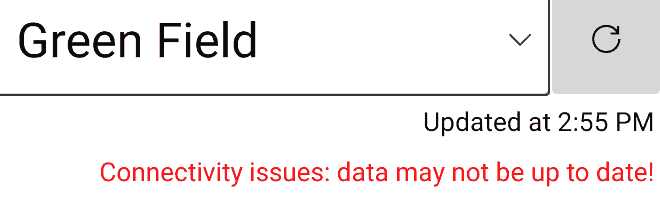
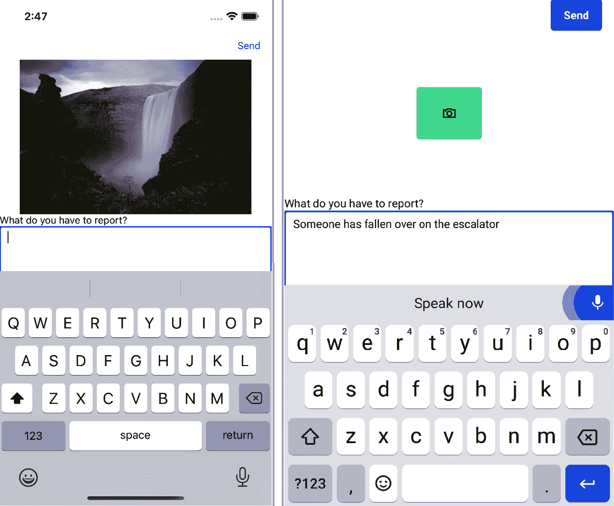

# 四、开发应用

本章将向您展示如何使用 Uno 平台为移动设备开发应用。 这类应用可能与运行在桌面设备或网络上的应用有很大的不同，它们会带来你必须考虑的挑战。

在本章中，我们将涵盖以下主题:

*   面向运行 iOS 和 Android 的移动设备进行构建
*   在偶尔连接的环境中使用远程数据
*   根据应用所运行的平台样式化应用
*   使用运行应用的设备的功能

在本章结束时，你将创建一个运行在 Android 和 iOS 设备上的移动应用，在每个平台上看起来都不一样，并与远程服务器通信来检索和发送数据。

# 技术要求

本章假设您已经设置了开发环境，并安装了必要的项目模板，正如我们在[*第 1 章*](02.html# _idTextAnchor015)，*介绍 Uno 平台*中所述。 本章的源代码可以在[https://github.com/PacktPublishing/Creating-Cross-Platform-C-Sharp-Applications-with-Uno-Platform/tree/main/Chapter04](https://github.com/PacktPublishing/Creating-Cross-Platform-C-Sharp-Applications-with-Uno-Platform/tree/main/Chapter04)找到。

本章中的代码使用了以下库:[https://github.com/PacktPublishing/Creating-Cross-Platform-C-Sharp-Applications-with-Uno-Platform/tree/main/SharedLibrary](https://github.com/PacktPublishing/Creating-Cross-Platform-C-Sharp-Applications-with-Uno-Platform/tree/main/SharedLibrary)。

本章还从一个远程 web 服务器检索数据，您可以用[https://github.com/PacktPublishing/Creating-Cross-Platform-C-Sharp-Applications-with-Uno-Platform/tree/main/WebApi](https://github.com/PacktPublishing/Creating-Cross-Platform-C-Sharp-Applications-with-Uno-Platform/tree/main/WebApi)的代码重新创建该服务器。

查看下面的视频来查看代码的运行:[https://bit.ly/3jKGRkI](https://bit.ly/3jKGRkI)

# 应用介绍

我们将在本章中构建的应用称为**网络辅助**。 这是一个将提供给所有员工的应用。 它对那些在车站以面向公众的身份工作的人特别有用。 这个应用的真正版本会有很多功能，但我们只会实现两个:

*   显示下一列火车何时到达每一站
*   记录和报告网络中发生的事件的细节。

由于这个应用将由工作人员在网络上执行他们的工作时使用，它将被构建为在 Android 和 iOS 设备上运行。

“移动”是什么意思?

我们很容易认为“移动”只是应用所使用的设备，但这么做是有局限性的。 “移动”可以作为“Android 和 iOS 设备”的缩写。 然而，有必要记住，手机(或平板电脑)不仅仅是移动的。 也就是使用该设备的人是移动的。 考虑将使用应用的人通常比它将运行的设备更重要。 设备只是需要考虑的因素之一。 一个人可能在一个过程中使用多个设备，因此需要在设备之间移动时体验是可移动的——可能在一个设备上开始一项任务，在另一个设备上完成它。

我们将 Network Assist 应用作为移动应用的主要原因是，使用它的人将整天四处旅行。 因为这个人是移动的，所以我们在开发一个“移动”应用，它运行在“移动”设备上。

与其花大量时间提前解释功能，不如让我们继续构建应用。我们将在编写代码时扩展需求。

## 创建应用

我们将从创建应用的解决方案开始:

1.  在 Visual Studio 中，使用**Multi-Platform App (Uno Platform)**模板创建一个新项目。
2.  将项目命名为**NetworkAssist**。 您可以使用不同的名称，但需要相应地调整所有后续代码片段。
3.  Remove all the platform head projects *except* for the **Android**, **iOS**, and **UWP** ones.

    始终保持 UWP 头在解决方案中

    即使你不打算发布一个 UWP 版本的应用，有两个理由让 UWP 头在解决方案中。 首先，这有助于诊断任何编译错误，检查代码是否存在基本问题，或者问题是否与特定于 unix 的工具有关。 其次，也是更重要的，当 UWP 头被选中时，Visual Studio 可以提供额外的工具和智能感知。 通过让 UWP 负责人参与项目，您的 Uno 平台开发经验将更加直观。

4.  为了避免编写过多的代码，我们将添加对共享库项目的引用。 右键单击节点的解决方案在解决方案资源管理器**,选择**添加【显示】现有项目…**,导航到**UnoBookRail.Common.csproj**文件,并点击**开放。****
*****   对于每个特定于平台的项目，我们需要向公共库项目添加一个引用。 在**Solution Explorer**中右键单击**Android**项目节点，选择**Add>Reference…>Projects**。 然后，检查**UnoBookRail 条目。 点击**OK**。 现在，*为 iOS 和 UWP 项目重复这个过程*。******

 ****现在已经准备好了基本的解决方案结构，我们可以向主页添加一些功能。

## 创建主页面

由于这个将是一个简单的应用，所以我们将把所有的功能放在一个页面上。 设计要求是，应用在屏幕底部有标签或按钮，以实现在不同功能区域之间的切换。 我们将把不同的功能块放在单独的控件中，并根据用户按下的按钮(或选项卡)更改显示的控件。

这是合适的，因为用户不需要来向后浏览他们已经浏览过的选项卡。

### 允许摄像机切口，切口和安全区域

在我们添加任何我们自己的内容之前，您可能希望运行应用来检查所有内容是否编译成功，并且可以毫无问题地进行调试。 根据运行应用的设备或模拟器，您可能会看到类似于*图 4.1*左侧的内容，其中显示了在 iPhone 12 模拟器上运行的默认应用。 在这个图中，您可以看到**Hello, World!** 文本重叠(或碰撞)的时间和背后的相机凹槽。

如果你没有设备允许你测试这个，一些模拟器有这个缺口。 其他模拟器将有一个可配置的选项，允许测试有或没有切线。 **设置>系统>开发人员选项>模拟带切口的显示屏**:


图 4.1 -前后屏幕截图显示的内容允许状态栏和摄像头缺口

我们的应用将不会有**Hello, World!** 文本，但我们不希望我们的内容被模糊。 幸运的是，Uno 平台提供了一个助手类，可以为相机槽留出空间，无论它们在什么设备上或它们在什么位置。

要使用这个 helper 类，我们需要做以下工作:

1.  添加**xmlns:toolkit="using:Uno.UI. " Toolkit”**到**Page**元素，位于**MainPage 的根目录下。 xaml**。
2.  添加**工具箱:VisibleBoundsPadding。 PaddingMask="All"**到**Page**元素内的**Grid**元素。 通过设置**All**的值，如果设备侧转，助手将提供适当的空间，缺口将显示在屏幕的一侧。

当您现在运行应用时，您将看到类似*图 4.1*中的右侧图像，它演示了如何为布局添加足够的空间。 这可以防止状态栏或摄像头凹槽模糊我们的内容。

现在我们已经解决了允许屏幕上出现缺口的问题，我们可以实现应用所需的功能了。

### 实现主页的内容

由于我们在应用中只有一个页面，我们现在就实现它:

1.  Replace the existing contents of **Grid** with the following:

    ```cs
    <Grid.RowDefinitions>
        <RowDefinition Height="*" />
        <RowDefinition Height="Auto" />
    </Grid.RowDefinitions>
    <CommandBar VerticalAlignment="Bottom" Grid.Row="1">
        <CommandBar.PrimaryCommands>
            <AppBarButton Icon="Clock" Label="Arrivals" 
                Click="ShowArrivals" />
            <AppBarButton Label="Quick Report" 
                Click="ShowQuickReport">
                <AppBarButton.Icon>
                    <FontIcon Glyph="&# xE724;" />
                </AppBarButton.Icon>
            </AppBarButton>
        </CommandBar.PrimaryCommands>
    </CommandBar>
    ```

    网格的顶部一行将包含用于不同功能元素的控件。 底部的行将包含用于选择不同控件的按钮。

    我们使用**CommandBar**,因为这是最适合提供的 UWP 控制按钮用于选择区域内的功能的应用。这只是一个近似我们希望事情看 iOS 和 Android 系统,我们会很快解决这些。

    请注意

    XAML 提供了多种执行任务的方法，这些方法都产生类似的结果。 通过本章中的代码，我们使用了最简单的方法在所有平台上提供一致的输出。

2.  We now need custom controls for displaying the different pieces of functionality. Start by right-clicking on the **Shared** project and selecting **Add > New Folder**. Name it **Views** so that it matches the convention for where to store UI-related controls.

    如果您愿意，您可以将**MainPage**文件移动到**Views**文件夹，但这与本应用的功能无关。

3.  在新文件夹中，右键选择**添加>新建项目**，选择**用户控制(Uno Platform UWP)**选项，并将其命名为**ArrivalsControl**。 重复此操作以添加名为**QuickReportControl**的控件。
4.  现在我们将把控件添加到**MainPage。 xaml**。 在页面级别声明一个新的 XML 命名空间别名，其值为**xmlns:views="using:Network Assist。 Views”**。 在打开**Grid**标签之后，在**CommandBar**之前，添加以下内容来创建我们的新控件的实例:
5.  In the code-behind file (**MainPage.xaml.cs**), we need to add the methods to handle the **Click** events referenced in the XAML for the AppBarButtons:

    ```cs
    public void ShowArrivals(object sender, RoutedEventArgs args) 
    {
        Arrivals.Visibility = Visibility.Visible; 
        QuickReport.Visibility = Visibility.Collapsed;
    }
    public void ShowQuickReport(object sender, RoutedEventArgs args) 
    {
        Arrivals.Visibility = Visibility.Collapsed; 
        QuickReport.Visibility = Visibility.Visible;
    }
    ```

    我们将在这里使用单击事件和后台代码，因为逻辑与 UI 紧密耦合，没有编码测试的好处。 在显示每个控件时，可以使用**iccommand**实现和绑定来实现控件，但如果您愿意，可以由来实现它。

    MVVM 和后台代码

    在本章中，我们将使用代码后置文件的组合和**Model-View-ViewModel**(**MVVM**)模式。 这有三个原因。 首先，它允许我们保持代码更短、更简单，以便您更容易理解。 其次，它避免了解释特定 MVVM 框架或实现的需要，我们可以将重点放在与应用相关的代码上。 最后，它表明 Uno Platform 并不强迫你以特定方式工作。 您可以使用自己喜欢的编码风格、模式或框架。

主页启动并运行后，我们现在可以添加显示即将到达的详细信息的功能。

## 显示即将到来的细节

显示即将到来的的要求如下:

*   将显示一个车站列表，当选择其中一个车站时，将显示每个方向的下三列火车的到达时间。
*   可以刷新数据，以确保始终可用最新的信息。
*   显示检索最后一段数据的时间。
*   如果没有选择车站或者在检索数据时出现问题，就会显示提示。
*   应用指示何时检索数据。

你可以在下图中看到我们将在本章结束时创建的最终功能的示例:


图 4.2 - iPhone(左)和 Android 设备(右)上显示的即将到来的详细信息

这个用于显示即将到来内容的用户控件将是应用中最复杂的 UI 部分。它看起来可能有很多步骤，但每个步骤都很简单:

1.  首先向**ArrivalsControl 中的**Grid**添加两个列定义和四个行定义。 xaml**:

    ```cs
    <Grid.ColumnDefinitions>
        <ColumnDefinition Width="*" />
        <ColumnDefinition Width="Auto" />
    </Grid.ColumnDefinitions>
    <Grid.RowDefinitions>
        <RowDefinition Height="Auto" />
        <RowDefinition Height="Auto" />
        <RowDefinition Height="Auto" />
        <RowDefinition Height="*" />
    </Grid.RowDefinitions>
    ```

2.  The top row will contain a **ComboBox** control for selecting the station and a **Button** element to request that the data be refreshed:

    ```cs
    <ComboBox x:Name="StationList"
        HorizontalAlignment="Stretch" 
        VerticalAlignment="Stretch"
        ItemsSource="{x:Bind VM.ListOfStations}"
        SelectedItem="{x:Bind VM.SelectedStation, 
            Mode=TwoWay}"
        SelectionChanged="OnStationListSelectionChanged"
        SelectionChangedTrigger="Always">
        <ComboBox.ItemTemplate>
            <DataTemplate x:DataType="network:Station">
                <TextBlock Text="{x:Bind Name}" 
                    FontSize="26" />
            </DataTemplate>
        </ComboBox.ItemTemplate>
    </ComboBox>
    <Button Grid.Column="1" 
        Width="60" 
        Height="60"
        Command="{x:Bind VM.RefreshCommand}">
        <SymbolIcon Symbol="Refresh" />
    </Button>
    ```

    数据模板引用了我们尚未添加的数据类型，但现在可以添加名称空间别名为**xmlns:network="using:UnoBookRail.Common。 网络”**。

3.  接下来的两行将使用**TextBlocks**来显示最后一次检索数据的时间以及检索数据时是否存在问题:

    ```cs
    <TextBlock 
        Grid.Row="1" 
        Grid.ColumnSpan="2" 
        Margin="4"
        HorizontalAlignment="Stretch"
        HorizontalTextAlignment="Right"
        Text="{x:Bind VM.DataTimestamp, Mode=OneWay}" />
    <TextBlock 
        Grid.Row="2" 
        Grid.ColumnSpan="2"
        Margin="4"
        HorizontalAlignment="Stretch"
        HorizontalTextAlignment="Right"
        Foreground="Red" 
        TextWrapping="WrapWholeWords"
        Text="Connectivity issues: data may not be up to 
              date!"
        Visibility="{x:Bind VM.ShowErrorMsg, 
            Mode=OneWay}"/>
    ```

4.  **ListView**将使用两个我们将在控制级定义的数据模板。 在打开的**UserControl**标签后添加以下内容:
5.  第四，也是最后一行，包含一个**ListView**，它显示即将到来的到达时间:

    ```cs
    <ListView Grid.Row="3" 
        Grid.ColumnSpan="2"
        ItemTemplate="{StaticResource ItemTemplate}"
        ItemsSource="{x:Bind VM.ArrivalsViewSource}"
        SelectionMode="None">
        <ListView.GroupStyle>
            <GroupStyle HeaderTemplate="{StaticResource 
                HeaderTemplate}" />
        </ListView.GroupStyle>
    </ListView>
    ```

6.  第四行还包含一个**Grid**，该网格承载了其他信息控件，这些控件将在**ListView**上显示或替代相应的

    ```cs
    <Grid Grid.Row="3" Grid.ColumnSpan="2">
        <TextBlock HorizontalAlignment="Stretch"
            VerticalAlignment="Center"
            HorizontalTextAlignment="Center"
            Style="{StaticResource 
                    SubheaderTextBlockStyle}"
            Text="Select a station" TextWrapping="NoWrap"
            Visibility="{x:Bind VM.ShowNoStnMsg,
                Mode=OneWay}" />
        <ProgressRing Width="100" Height="100"
            IsActive="True" IsEnabled="True"
            Visibility="{x:Bind VM.IsBusy, Mode=OneWay}"
        />
    </Grid>
    ```

7.  We've added quite a lot of XAML here. The first step to seeing how it looks is to wire up a ViewModel so that we can access the relevant properties and commands. Change the contents of **ArrivalsControlxaml.cs** to the following:

    ```cs
    public sealed partial class ArrivalsControl : UserControl {
        private ArrivalsViewModel VM { get; set; }
        public ArrivalsControl() 
        {
            InitializeComponent();
            VM = new ArrivalsViewModel();
        }
        private async void OnStationListSelectionChanged
            (object sender, SelectionChangedEventArgs e)
        {
            if ((sender as ComboBox).SelectedItem is 
                Station selectedStn) 
            {
                await VM.LoadArrivalsDataAsync
                    (selectedStn.Id);
            }
        }
    }
    ```

    这里，我们在构造函数中创建了 ViewModel 的一个实例(命名为**VM**，以帮助保持代码简洁)，并且正是这个类包含了大部分逻辑。

    后台代码还包括处理**组合框**上的**SelectionChanged**事件的方法。 由于**组合框**事件发生的顺序不同，这是当前必需的 bug 解决方案。 错误记录在[https://github.com/unoplatform/uno/issues/5792](https://github.com/unoplatform/uno/issues/5792)。 修复后，应该可以绑定到 ViewModel 上的**命令**来执行同等的功能。

8.  在文件顶部使用声明添加以下**，这样编译器就可以找到我们刚刚添加的类型:**
9.  现在，我们已经准备好创建一个 ViewModel，它将包含用于功能的其余逻辑。 我们将首先创建一个名为**ViewModels**的文件夹。 在该文件夹中，创建一个名为**ArrivalsViewModel**的类。
10.  为了避免在遵循 MVVM 模式时需要编写公共代码，在每个平台头项目:

    ```cs
    Install-Package Microsoft.Toolkit.Mvvm -Version 7.0.2
    ```

    中添加对**Microsoft.Toolkit.Mvvm**NuGet 包*的引用。*
11.  更新**ArrivalsViewModel**类，使其继承自**Microsoft.Toolkit.Mvvm.ComponentModel.ObservableObject**。
12.  **ArrivalsViewModel**将使用来自不同位置的类型，因此我们需要引用以下命名空间:
13.  首先向类中添加以下字段:

    ```cs
    private static DataService _data = DataService.Instance;
    private List<Station> _listOfStations;
    private ObservableCollection<StationArrivalDetails> 
    _arrivals = 
        new ObservableCollection<StationArrivalDetails>();
    private Station _selectedStation = null;
    private string _dataTimestamp;
    private bool _isBusy;
    private bool _showErrorMsg;
    ```

14.  我们的**ViewModel**需要以下属性，因为它们在我们之前定义的 XAML 的绑定中被引用。 它们将使用我们刚刚添加的支持字段:

    ```cs
    public List<Station> ListOfStations 
    {
        get => _listOfStations;
        set => SetProperty(ref _listOfStations, value);
    }
    public bool ShowErrorMsg 
    {
        get => _showErrorMsg;
        set => SetProperty(ref _showErrorMsg, value);
    }
    public Station SelectedStation 
    {
        get => _selectedStation;
        set {
            if (SetProperty(ref _selectedStation, value)) 
            {
                OnPropertyChanged(nameof(ShowNoStnMsg));
            }
        }
    }
    public ObservableCollection<StationArrivalDetails> Arrivals 
    {
        get => _arrivals;
        set => SetProperty(ref _arrivals, value);
    }
    public string DataTimestamp 
    {
        get => _dataTimestamp;
        set => SetProperty(ref _dataTimestamp, value);
    }
    public bool IsBusy 
    {
        get => _isBusy;
        set => SetProperty(ref _isBusy, value);
    }
    public IEnumerable<object> ArrivalsViewSource => new CollectionViewSource() 
    {
        Source = Arrivals,
        IsSourceGrouped = true
    }.View;
    public bool ShowNoStnMsg => SelectedStation == null;
    public ICommand RefreshCommand { get; }
    public ICommand SelectionChangedCommand { get; }
    ```

15.  我们将使用构造器初始化站点列表和以下命令:

    ```cs
    public ArrivalsViewModel() 
    {
        ListOfStations = _data.GetAllStations();
        RefreshCommand = new AsyncRelayCommand(async () =>
            { await LoadArrivalsDataAsync(); });
        SelectionChangedCommand = new AsyncRelayCommand(
            async () => { await LoadArrivalsDataAsync(); 
                });
    }
    ```

16.  现在，添加处理检索和显示数据的方法:

    ```cs
    public async Task LoadArrivalsDataAsync(int stationId = 0)
    {
      if (stationId < 1) 
      {
        // if no value passed use the previously selected 
        // Id.
        stationId = SelectedStation?.Id ?? 0;
      }
      else 
      { 
        // We've changed station so clear current details
        Arrivals.Clear();
        DataTimestamp = string.Empty;
        ShowErrorMsg = false;
      }
      if (stationId > 0) 
      {
        IsBusy = true;
        try {
          var arr = await 
              _data.GetArrivalsForStationAsync(stationId);
          ShowErrorMsg = false;
          if (arr.ForStationId == stationId) 
          {
            DataTimestamp = 
                $"Updated at {arr.Timestamp:t}";
            Arrivals.Clear();
            if (!string.IsNullOrEmpty(
                arr.DirectionOneName)) 
            {
              var d1details = new StationArrivalDetails
                  (arr.DirectionOneName);
              d1details.AddRange(arr.DirectionOneDetails);
              Arrivals.Add(d1details);
            }
            if (!string.IsNullOrEmpty(
                arr.DirectionTwoName)) 
            {
              var d2details = new StationArrivalDetails(
                  arr.DirectionTwoName);
              d2details.AddRange(arr.DirectionTwoDetails);
              Arrivals.Add(d2details);
            }
          }
        }
        catch (Exception exc) {
          // Log this or take other appropriate action
          ShowErrorMsg = true;
        }
        finally {
          IsBusy = false;
        }
      }
    }
    ```

17.  You may have noticed that the data was retrieved from a singleton **DataService** class. We'll start by creating a simple version of this that we'll expand upon later. Common convention suggests putting this class in a directory called **Services**, though you could put this in the **ViewModels** folder as well:

    ```cs
    using System.Linq;
    using System.Threading.Tasks;
    using UnoBookRail.Common.Network;
    public class DataService 
    {
        private static readonly Lazy<DataService> ds =
            new Lazy<DataService>(() => new
                DataService());
        private static readonly Lazy<Stations> stations =
            new Lazy<Stations>(() => new Stations());
        public static DataService Instance => ds.Value;
        private DataService() { }
        public List<Station> GetAllStations() => 
            stations.Value.GetAll().OrderBy(s => 
                s.Name).ToList();
        public async Task<Arrivals> 
            GetArrivalsForStationAsync(int stationId) 
    {
            return await Task.FromResult(
               stations.Value.GetNextArrivals(stationId));
        }
    }
    ```

    这个类目前正在从共享库获取它的所有数据，但我们稍后将更改这一点。 这也是为什么**GetArrivalsForStationAsync**方法看起来过于复杂的原因。

18.  Now that we have the **DataService** class, we can retrieve the arrival details, but we need to do a little bit more work to display them. There is one more class we need. This is **StationArrivalDetails**, and it allows us to group the information by the platform and direction the train is traveling in. Create this in the **ViewModels** directory:

    ```cs
    using UnoBookRail.Common.Network;
    public class StationArrivalDetails : 
    List<ArrivalDetail> 
    {
        public StationArrivalDetails(string platform) 
        {
            Platform = platform;
        }
        public string Platform { get; set; }
    }
    ```

    在 Uno 中分组数据的 CollectionViewSource

    使用 Uno 平台显示分组列表比在 UWP 上更复杂。 如果你以前在 UWP 应用中使用过**CollectionViewSource**，你可能已经在 XAML 中定义了它，而不是作为**IEnumerable<对象>**。 不幸的是，有必要将我们的**CollectionViewSource**定义为 Uno 平台的**IEnumerable<IEnumerable>**来正确渲染 Android 和 iOS 上的所有组和头文件。 如果不这么做，我们将在 iOS 上看到群组标题消失，而在 Android 上只会看到第一组内容。

现在我们有了一个可以工作的应用，但是在接下来的两节中我们将进行两个改进。 在此，我们将改进应用的外观并使用一些本地控件，但在此之前，我们将切换到使用来自远程数据源的“实时”数据，而不是应用附带的数据。

# 检索远程数据

很少有应用只使用其附带的数据。 网络协助**提供的值是基于提供实时信息。 知道火车实际到站的时间比知道火车预定到站的时间更有价值。 为了收集这些信息，应用必须连接到一个远程的实时数据源。**

 **大多数移动应用连接到外部数据源，最常见的方式是通过 HTTP(S)。 如果您只是开发一个运行在桌面上的应用，那么您可以假设连接总是可用的。 对于移动应用，有必要考虑设备是**偶尔连接**。

因为我们不可能假设一款应用会有一个可用的连接，或者它会很快，所以在设计一款应用时，我们有必要考虑到这一点。这些问题适用于所有手机应用，并不是 Uno Platform 开发的唯一问题。 处理偶然连接和数据可用性的正确方法因应用而异。 这个问题太大了，我们无法在这里全面讨论，但提出却很重要。 至少，考虑偶尔的连接意味着需要考虑重试失败的连接请求和管理数据。 我们之前在 LoadArrivalsDataAsync 方法中编写的代码已经实现了一种粗糙的缓存形式，即在刷新数据时不删除当前信息，直到成功发出请求并显示新的数据。 虽然应用中显示的信息可能很快就会过时，但人们认为，让应用显示一些它承认已经过时几分钟的信息，比什么都不显示更合适。

在另一个应用中，可能更适合将数据保存在文件或数据库中，以便在远程数据不可用时检索和显示。 [*第五章*](07.html# _idTextAnchor083)，*让你的应用为现实世界做好准备*，展示了如何使用 SQLite 数据库做到这一点。

我们将看看应用如何处理连接远程数据失败，但首先，我们将看看如何连接远程数据。

## 连接到远程数据源

这本书的 GitHub 库[https://github.com/PacktPublishing/Creating-Cross-Platform-C-Sharp-Applications-with-Uno-Platform](https://github.com/PacktPublishing/Creating-Cross-Platform-C-Sharp-Applications-with-Uno-Platform)包括**WebAPI**项目,将返回的火车到达数据应用。

您可以选择运行代码并通过本地机器访问它，或者您可以连接到[https://unobookrail.azurewebsites.net/](https://unobookrail.azurewebsites.net/)可用的版本。 如果您正在连接到托管版本，请注意它基于服务器的本地时间数据，这可能与您所在的位置不同。 如果服务器一直说离下一班火车还有很长一段时间，因为现在是凌晨，服务器所在的地方，如果你自己运行项目，你会看到更多不同的数据:

1.  我们将使用**System.Net.Http.HttpClient**来连接到服务器。 要做到这一点，我们必须在*Android 和 iOS*项目中添加对**System.Net.Http**的包引用:

    ```cs
    Install-Package System.Net.Http -Version 4.3.4
    ```

2.  由于 API 返回的数据是 JSON 格式的，我们还将添加一个对**Newtonsoft 的引用。 Json**库在*所有平台项目*，以便我们可以反序列化响应:

    ```cs
    Install-Package Newtonsoft.Json -Version 12.0.3
    ```

3.  我们现在准备好检索远程数据了。 所有的更改都将在**DataService.cs**文件中。 首先添加一个**HttpClient**的实例。 我们将对所有请求使用此方法:

    ```cs
    using System.Net.Http;
    private static readonly HttpClient _http = new HttpClient();
    ```

4.  To connect to the server, we need to specify where it is. As we will eventually be making multiple requests, it's sensible to define the server domain in a single place. We'll do this by **adding a property** to return this value:

    ```cs
    public static string WebApiDomain {
        get 
        {
            # if __ANDROID__
                           return "https://10.0.2.2:44302";
            # else
                           return "https://localhost:44302";
            # endif
            // Or connect to the hosted version
            //return 
                "https://unobookrail.azurewebsites.net";
        }
    }
    ```

    注意，我们使用的是**__ANDROID__**常量，该常量可用于**# if**预处理器指令。 参见[*第二章*](03.html# _idTextAnchor033)*，编写你的第一款 Uno 平台应用*。

    如果你要从 Android 模拟器连接到本地托管的 WebAPI 实例，有必要使用**10.0.2.2**的 IP 地址来连接。 这是一个特殊的 IP 地址，模拟器使用它来引用主机。 您可以使用条件编译来指定这一点，如前面的代码片段所示。 如果你正在连接一个外部服务器，你可以直接设置地址，不需要任何条件代码。

5.  我们现在可以更新**GetArrivalsForStationAsync**方法来获取实时数据。 *用以下代码替换*当前实现:

如果你现在运行应用，数据将来自远程位置。 您可能会注意到，数据检索不再是即时的，并且在等待时显示一个繁忙指示器。 我们添加了在应用的原始版本中显示进度指示器的代码，但直到现在还没有看到它显示出来。 这突出了在处理需要花费时间检索的数据时的另一个潜在问题。 *重要的是让用户知道发生了什么*。 我们在这里使用**ProgressRing**来表示正在发生一些事情。 否则，用户可能会想知道是否发生了什么事情，并变得沮丧或反复按刷新按钮。

此时，我们已经从远程数据源检索了数据，并在此过程中通知用户，但是当出现问题时，我们需要做更多的工作。 我们接下来会看这个。

## 使用 Polly 来处理异常和重试请求

几乎所有应用都需要处理异常和重试失败请求。 幸运的是，有许多解决方案可以为我们处理一些复杂性。 Polly([https://github.com/App-vNext/Polly](https://github.com/App-vNext/Polly))是一个流行的、用于处理暂态错误的开源库，我们将在我们的应用中使用它。让我们来看看:

1.  We'll start by adding a reference to the **Polly.Extensions.Http** package to *all the platform projects*:

    ```cs
    Install-Package Polly.Extensions.Http -Version 3.0.0
    ```

    这扩展了标准 Polly 功能，并简化了处理与 http 相关的错误。

2.  We'll now update the **GetArrivalsForStationAsync** method again so that it uses a Polly **policy** when making the request:

    ```cs
    using Polly;
    using Polly.Extensions.Http;
    public async Task<Arrivals> GetArrivalsForStationAsync(int stationId) 
    {
      var url = $"{WebApiDomain}/stations/?stationid=
          {stationId}";
      var policy = HttpPolicyExtensions
                      .HandleTransientHttpError()
     .WaitAndRetryAsync(3, attempt => 
     TimeSpan.FromSeconds(Math.Pow(
     attempt, 2)));
      using (var response = await policy.ExecuteAsync(
          async () => await _http.GetAsync(url))) 
      {
          if (response.IsSuccessStatusCode) 
          {
              var rawJson = await 
                  response.Content.ReadAsStringAsync();
              return JsonConvert.DeserializeObject<Arrivals>
                  (rawJson);
          }
      }
      return default;
    }
    ```

    对于代码，是三个重要的部分。

    第一个是调用**HandleTransientHttpError**。 这告诉 Polly，如果 HTTP 响应是服务器错误(HTTP 5xx)或超时错误(HTTP 408)，则重试请求。

    对**WaitAndRetryAsync**的调用告诉 Polly 最多重试三次。 我们还使用**指数回退策略**在每个请求之间指定一个延迟。 第一次尝试前 1 秒，第二次尝试前 4 秒，最后一次尝试前 9 秒。 这种策略使服务器有时间恢复任何错误，并避免多次连续重复请求导致服务器过载。

    最后一段有趣的代码是策略的使用方式。 我们称之为**政策。 ExecuteAsync**，并将我们希望应用策略的动作传递给它。

3.  如果请求失败的原因不是由我们的政策覆盖,我们先前创建的代码导致消息显示在屏幕的顶部,如下面屏幕截图所示,表明这一问题。 其他应用可能需要以不同的方式记录或报告这样的问题，但什么都不做很少是合适的:



图 4.3 -应用显示一条消息，表明连接问题

我们现在有了一个应用，可以从远程数据源以可靠的方式提供有用的数据。 我们想做的最后一件事是改进它在不同平台上的外观。

# 让你的应用看起来像是属于每个平台

到目前为止，应用中的所有都使用了 Uno 平台提供的默认样式。 因为 Uno 平台的一切都基于 UWP 和 WinUI，我们的应用都是基于 Fluent 设计系统设计的，因为这是 Windows 上的默认设置。 如果我们想让应用看起来像这样，这没问题，但如果我们想让应用使用 Android 或 iOS 的默认样式呢? 幸运的是，Uno Platform 为我们提供了解决方案。 它提供了**Material**和**Cupertino**风格的库，我们可以将应用到我们的应用中。 虽然它们分别适用于 Android 和 iOS 设备，但它们可以在任何地方使用。

现在，我们将使用这些库提供的资源，将 Material Design 样式应用于我们的应用的 Android 版本，并将 Cupertino 样式应用于 iOS 版本。

## 应用材质样式到 Android 版本的应用

让我们开始:

1.  我们首先添加对**Uno 的引用。 材质**包到*Android 项目*。 注意，这是一个预发布包，所以如果你通过 UI 搜索:

    ```cs
    Install-Package Uno.Material -Version 1.0.0-dev.790
    ```

    ，启用它。
2.  而**Uno。 Material**库知道如何样式化控件，它不包含所有的资产和引用来使用它们。 为此,T4*【添加】**Xamarin.AndroidX.Lifecycle.LiveData**和**Xamarin.AndroidX.AppCompat.AppCompatResources【显示】包*Android 项目*:

    ```cs
    Install-Package Xamarin.AndroidX.AppCompat.AppCompatResources -Version 1.2.0.5
    Install-Package Xamarin.AndroidX.Lifecycle.LiveData -Version 2.3.1
    ```*** 
3.  要使用 Android 库中的样式，我们必须通过引用**app xaml**:

    ```cs
    <Application
        x:Class="NetworkAssist.App"
        xmlns="http://schemas.microsoft.com/winfx/2006/
               xaml/presentation"
        xmlns:x="http://schemas.microsoft.com/winfx/2006/
                 xaml"
        xmlns:android="http://uno.ui/android"
        xmlns:local="using:NetworkAssist"
        xmlns:mc="http://schemas.openxmlformats.org/
     markup-compatibility/2006"
     mc:Ignorable="android">
        <Application.Resources>
            <ResourceDictionary>
     <ResourceDictionary.MergedDictionaries>
                    <XamlControlsResources xmlns=
                    "using:Microsoft.UI.Xaml.Controls" />
                    <android:MaterialColors xmlns=
     "using:Uno.Material" />
     <android:MaterialResources xmlns=
     "using:Uno.Material" />
                </ResourceDictionary.MergedDictionaries>
     </ResourceDictionary>
        </Application.Resources>
    </Application>
    ```

    来将添加到应用中可用的样式中。
4.  Some controls will pick up Material styling automatically, while others will need to have the styles applied directly. To show this, we'll apply a specific style to the refresh **Button**.

    在**到达控制。 xaml**，*在文件顶部添加 Android 命名空间别名*。 我们只会在 Android 上运行时使用它。 然后，将样式应用到**按钮**元素:

    ```cs
    xmlns:android="http://uno.ui/android"
    mc:Ignorable="d android">
    <Button 
        Grid.Column="1"
        Width="60" 
        Height="60"
        android:Style="{StaticResource 
     MaterialContainedButtonStyle}"
        Command="{x:Bind VM.RefreshCommand}">
        <SymbolIcon Symbol="Refresh" />
    </Button>
    ```

    前面的代码改进了**Button**控件在到达控件上的外观，但它没有改进 shell 页面底部**CommandBar**中的按钮。 让我们现在解决这个问题。

5.  Rather than using the Windows **CommandBar**, the Material Design system has a separate control that is more appropriate for showing navigation-related buttons at the bottom of the screen. This is called **BottomNavigationBar**. We'll start by adding this to **MainPage.xaml** and wrapping the existing **CommandBar** in a **Grid** that will only be shown on Windows:

    ```cs
    xmlns:android="http://uno.ui/android"
    xmlns:win="http://schemas.microsoft.com/winfx/2006/xaml/
     presentation"
    mc:Ignorable="d android">
    <android:Grid Grid.Row="1" >
        <material:BottomNavigationBar 
            xmlns:material="using:Uno.Material.Controls">
            <material:BottomNavigationBar.Items>
                <material:BottomNavigationBarItem 
                    Click="ShowArrivals">
                    <material:
                        BottomNavigationBarItem.Icon>
                        <SymbolIcon Symbol="Clock" />
                    </material:
                        BottomNavigationBarItem.Icon>
              </material:BottomNavigationBarItem>
              <material:BottomNavigationBarItem 
                  Click="ShowQuickReport">
                  <material:BottomNavigationBarItem.Icon>
                       <FontIcon Glyph="&# xE724;" />
                  </material:BottomNavigationBarItem.Icon>
              </material:BottomNavigationBarItem>
            </material:BottomNavigationBar.Items>
        </material:BottomNavigationBar>
    </android:Grid>
    <win:Grid Grid.Row="1">
        <CommandBar />  
            // All XAML for this control notshown
    </win:Grid>
    ```

    这个新控件将使用相同的图像和**单击**事件。 我们改变的只是显示它们的控件。

    请注意

    加入**Xamarin 后。 AndroidX**包，你可能会得到一个与**abc_vector_test.xml**文件相关的编译错误。 此错误是由于包的不同预览版本和 Visual Studio 之间的兼容性不一致。 可以解决这个错误打开****的**部分属性 Android 项目**,选择【显示】Android 选项,并取消勾选**使用增量 Android 包装系统(aap2)**选项。 这可能会导致单独的构建警告和稍微慢一些的构建，但现在代码可以编译了。 希望将来对这些包的更新能够帮助我们避免这个问题。

6.  如果你现在运行应用，你会看到按钮和导航栏是紫色的。 这是在**Uno 中定义的配色方案的一部分。 资料**图书馆。 您可以通过包含一个**ResourceDictionary**来使用自己的配色方案，它为预定义的 Material 颜色提供不同的值。 然后，您可以在添加*步骤 2*中显示的资源时引用。 可以在[https://platform.uno/docs/articles/features/uno-material.html# getting-started](https://platform.uno/docs/articles/features/uno-material.html# getting-started)找到的操作指南。

现在我们已经在 Android 上改进了应用的外观，让我们在 iOS 上做同样的事情。

## iOS 版本应用 Cupertino 风格

让我们开始:

1.  A separate package includes the Cupertino styles, so we must add a reference to **Uno.Cupertino** *in the iOS project*:

    ```cs
    Install-Package Uno.Cupertino -Version 1.0.0-dev.790
    ```

    与上一节中的 Material 包一样，我们需要通过添加以下内容来从**App.xaml**中加载这个包中的资源:

    ```cs
    xmlns:ios="http://uno.ui/ios"
    mc:Ignorable="android ios">
    <Application.Resources>
        <ResourceDictionary>
            <ResourceDictionary.MergedDictionaries>
                <XamlControlsResources xmlns=
                    "using:Microsoft.UI.Xaml.Controls" />
                <android:MaterialColors xmlns=
                    "using:Uno.Material" />
                <android:MaterialResources xmlns=
                    "using:Uno.Material" />
                <ios:CupertinoColors xmlns=
     "using:Uno.Cupertino" />
     <ios:CupertinoResources xmlns=
     "using:Uno.Cupertino" />
           </ResourceDictionary.MergedDictionaries>
        </ResourceDictionary>
    </Application.Resources>
    ```

2.  This package doesn't include a native tab bar control (a **UITabBar**) yet, but we can easily create something that matches Apple's Human Interface Guidelines.

    *将*添加到**MainPage 中。 xaml**，后**获胜:格**元素:

    ```cs
    xmlns:converters="using:UnoBookRail.NetworkAssist.Converters"
    xmlns:ios="http://uno.ui/ios"
    mc:Ignorable="d android ios">
    <ios:Grid Grid.Row="1">
        <Grid.ColumnDefinitions>
            <ColumnDefinition Width="*" />
            <ColumnDefinition Width="*" />
        </Grid.ColumnDefinitions>
        <Grid.Resources>
            <converters:CupertinoButtonColorConverter 
                x:Key="CupertinoBtnColor" />
        </Grid.Resources>
        <Button Click="ShowArrivals" 
            HorizontalAlignment="Center"
                Foreground="{Binding ElementName=Arrivals,
                    Path=Visibility, Converter={
                        StaticResource CupertinoBtnColor},
                            ConverterParameter=Visible,
                                Mode=OneWay}">
            <StackPanel>
                <SymbolIcon 
                    Symbol="Clock" 
                    Width="25" 
                    Height="25" 
                    HorizontalAlignment="Center" />
                <TextBlock>Arrivals</TextBlock>
            </StackPanel>
        </Button>
        <Button 
            Grid.Column="1" 
            Click="ShowQuickReport"
            HorizontalAlignment="Center"
                Foreground="{Binding ElementName=
                    QuickReport, Path=Visibility, 
                        Converter={StaticResource 
                            CupertinoBtnColor},
                               ConverterParameter=Visible,
                                   Mode=OneWay}">
            <StackPanel>
                <FontIcon 
                    Glyph="&# xE724;"
                    Width="25" 
                    Height="25" 
                    HorizontalAlignment="Center" />
                <TextBlock>Quick Report</TextBlock>
            </StackPanel>
        </Button>
    </ios:Grid>
    ```

    我们使用了与之前相同的图标和**单击**事件，但我们为**按钮**的**ForegroundColor**使用了一个新的转换器。 为此，你需要*创建一个文件夹*，名为**Converters**，*创建一个文件*，名为**CupertinoButtonColorConverter.cs**，包含以下代码:

    ```cs
    using Windows.UI.Xaml.Data;
    public class CupertinoButtonColorConverter : IValueConverter 
    {
      public object Convert(object value, Type targetType,
          object parameter, string language) 
      {
          if (value?.ToString() == parameter?.ToString()) 
          {
              return App.Current.Resources[
                  "CupertinoBlueBrush"];
           }
           else 
           {
              return App.Current.Resources[
                  "CupertinoSecondaryGrayBrush"];
           }
        }
        public object ConvertBack(object value, Type 
            targetType, object parameter, string language)
            => throw new NotImplementedException();
    }
    ```

3.  As with the Android project, the Cupertino styles won't be automatically applied to the buttons in the app. However, rather than applying styles to each **Button** element directly, we can create an *implicit style* that will be applied to all the **Button** elements throughout the app. To do this, *modify* **App.xaml** to add the style, as follows:

    ```cs
    <Application.Resources>
        <ResourceDictionary>
            <ResourceDictionary.MergedDictionaries>
                <XamlControlsResources xmlns=
                    "using:Microsoft.UI.Xaml.Controls" />
                <android:MaterialColors xmlns=
                    "using:Uno.Material" />
                <android:MaterialResources xmlns=
                    "using:Uno.Material" />
                <ios:CupertinoColors xmlns=
                    "using:Uno.Cupertino"  />
                <ios:CupertinoResources xmlns=
                    "using:Uno.Cupertino" />
            </ResourceDictionary.MergedDictionaries>
            <ios:Style TargetType="Button"
     BasedOn="{StaticResource 
     CupertinoButtonStyle}" />
        </ResourceDictionary>
    </Application.Resources>
    ```

    隐式风格可以用于任何平台，如果你想，你可以在 Android 版本的应用中做类似的事情。

我们现在有一个应用，它看起来就像属于在每个平台上，它可以显示我们从外部服务器检索到的内容。 现在，让我们看看如何使用设备的功能来创建数据并将其发送到远程数据源。

# 访问设备功能

我们将添加到应用的最后一项功能与我们到目前为止所做的不同。 到目前为止，我们已经了解了如何消费数据，现在我们将了解如何创建数据。

该公司对这部分应用的要求是，当事件发生时，它为员工提供了一种获取信息的方式。 “事件”可以是企业需要记录或了解的任何内容。 可能是一些小事，比如客户在公司物业上绊倒，导致重大事故。 所有这些事件都有一个共同点:当它们发生时捕捉细节，而不是依赖于人们事后记住细节，这是有益的。 其目标是为员工提供一种尽可能快速、简单地捕捉图像或文本的方法，从而增加所捕获的信息量。 该软件将增加捕获的信息与时间和地点的事件，并添加记录它的人。 这将在单独的后端系统中进行聚合和进一步文档化。

让我们创建一个简单的方法来满足这些需求，以演示 Uno 平台如何在不同的平台上使用 UWP api:

1.  To use the camera and get the location of the device, we need to indicate that the app will require the permissions that are necessary to do this. The way we specify permissions is done slightly differently on each platform.

    在 Android 上，打开项目的**属性**窗口，选择**Android Manifest**。 **所需的权限列表下的**,选择**ACCESS_COARSE_LOCATION ACCESS_FINE_LOCATION**、【显示】相机,**READ_EXTERNAL_STORAGE**,【病人】WRITE_EXTERNAL_STORAGE。

    在**iOS**上，右键单击**信息。 plist**，然后用**Generic plist Editor**打开。 双击该文件将打开清单编辑器，但这并没有为我们提供添加所需新属性的方法。 **现在,添加属性隐私——相机使用描述**、【显示】隐私照片库使用描述,**隐私——位置使用描述**,【病人】隐私,位置在使用使用描述。 要添加新属性，请转到列表底部，单击**+**符号，并从下拉菜单中选择它。 对于这些属性，您应该在**值**列中添加说明，解释为什么需要该权限。 这些描述将在请求权限时显示。

    在 Windows 上，打开**Package。 appxmanfiest**，转到**Capabilities**，并选中**Location**选项。 通过**CameraCaptureUI**访问相机时不需要指定任何权限。

2.  We can create the UI by adding the following to **Grid** in **QuickReportControl.xaml**:

    ```cs
    xmlns:android="http://uno.ui/android"
    mc:Ignorable="d android">
    <Grid.RowDefinitions>
        <RowDefinition Height="Auto" />
        <RowDefinition Height="*" />
        <RowDefinition Height="Auto" />
        <RowDefinition Height="2*" />
    </Grid.RowDefinitions>
    <Button HorizontalAlignment="Right" 
            Click="SendClicked"
            Margin="15,0" 
            android:Style="{StaticResource 
     MaterialContainedButtonStyle}">
                    Send</Button>
    <Image Grid.Row="1" x:Name="ImageToInclude" />
    <Button x:Name="TakePictureButton" Grid.Row="1" 
        Click="CaptureImageClicked" 
        VerticalAlignment="Center" 
        HorizontalAlignment="Center" 
        android:Style="{StaticResource
     MaterialContainedSecondaryButtonStyle}">
        <SymbolIcon Symbol="Camera" Height="50" Width="50" />
    </Button>
    <TextBlock Grid.Row="2" Text="What do you have to report?" />
    <TextBox x:Name="EnteredText" Grid.Row="3"
        AcceptsReturn="True" />
    <Grid x:Name="BusyOverlay" Grid.RowSpan="4"
        Visibility="Collapsed" >
        <Grid Background="{ThemeResource 
            ApplicationPageBackgroundThemeBrush}" 
                Opacity="0.5" />
        <ProgressRing 
            Width="100" 
           Height="100"
           IsActive="True" 
           IsEnabled="True"/>
    </Grid>
    ```

    这个 XAML 非常简单。 唯一的新元素是我们在 Android 上对**Button**元素使用了不同的样式。 这是为了突出每个按钮的重要性。

3.  In **QuickReportControl.xaml.cs**, let's add the code to handle what happens when the user clicks on the button to add a photo:

    ```cs
    using Windows.Media.Capture;
    using Windows.UI.Xaml.Media.Imaging;
    Windows.Storage.StorageFile capturedPhoto;
    private async void CaptureImageClicked(object sender, RoutedEventArgs e) 
    {
        try 
        {
             var captureUI = new CameraCaptureUI();
             capturedPhoto = await 
                 captureUI.CaptureFileAsync(
                     CameraCaptureUIMode.Photo);
             if (capturedPhoto == null) 
             {
                 return;
             }
             else 
             {
                 var source = new BitmapImage(new 
                     Uri(capturedPhoto.Path));
                 ImageToInclude.Source = source;
                 TakePictureButton.Visibility = 
                     Visibility.Collapsed;
             }
        }
        catch (Exception ex) 
        {
            // Log the exception as appropriate
        }
    }
    ```

    这段代码很简单:我们创建一个**CameraCaptureUI**的实例，并调用**CaptureFileAsync**让它捕捉一张照片。 当它成功返回时(它没有被用户取消)，我们在屏幕上显示图像并将其存储在一个字段中，以便稍后将其发送给服务器。

4.  我们现在创建一个方法来封装检索设备位置的逻辑:

    ```cs
    using Windows.Devices.Geolocation;
    using System.Threading.Tasks;
    private async Task<string> GetLocationAsync() 
    {
        try 
        {
            var accessStatus = await 
                Geolocator.RequestAccessAsync();
            switch (accessStatus) 
            {
                case GeolocationAccessStatus.Allowed:
                     var geolocator = new Geolocator();
                     var pos = await 
                         geolocator.GetGeopositionAsync();
                     return $"{pos.Coordinate.Latitude},
                        {pos.Coordinate.Longitude},
                            {pos.Coordinate.Altitude}";
                case GeolocationAccessStatus.Denied:
                    return "Location access denied";
                case GeolocationAccessStatus.Unspecified:
                    return "Location Error";
            }
        }
        catch (Exception ex) 
        {
            // Log the exception as appropriate
        }
        return string.Empty;
    }
    ```

5.  The final step is to add the event handler for the **Send** button:

    ```cs
    using System.Net.Http;
    using System.IO;
    using Windows.UI.Popups;
    private async void SendClicked(object sender, RoutedEventArgs e) 
    {
        var url = $"{ViewModels.DataService.WebApiDomain}/
            QuickReports/Create";
        BusyOverlay.Visibility = Visibility.Visible;
        try 
        {
            var http = new HttpClient();
           var formContent =
               new MultipartFormDataContent();
           if (capturedPhoto != null) 
           {
               var fileContent = new StreamContent(await 
                 capturedPhoto?.OpenStreamForReadAsync());
               formContent.Add(fileContent, "imageFile",
                   "capturedFile");
            }
            formContent.Add(new StringContent(await 
                GetLocationAsync()), "location");
            formContent.Add(new StringContent(
                EnteredText.Text), "information");
            var response = await http.PostAsync(new 
                Uri(url), formContent);
            var serverResponse = await 
                response.Content.ReadAsStringAsync();
            if (serverResponse == "success") 
            {
                EnteredText.Text = string.Empty;
                capturedPhoto = null;
                ImageToInclude.Source = null;
                TakePictureButton.Visibility = 
                    Visibility.Visible;
                var msgDlg = new MessageDialog("Quick 
                    report submitted", "Thank you");
                await msgDlg.ShowAsync();
            }
            else 
            {
                throw new HttpRequestException(
                    "Unsuccessful upload");
            }
        }
        catch (Exception ex) 
        {
            // Log or retry the request as appropriate.
            var msgDlg = new MessageDialog("Failed to 
                upload quick report");
            await msgDlg.ShowAsync();
        }
        finally 
        {
            BusyOverlay.Visibility = Visibility.Collapsed;
        }
    }
    ```

    这段代码在服务器上载图像、位置和任何输入文本时显示一个繁忙(活动)指示器。 我们在本章中使用的相同的 WebAPI 可以接收这样的上传，并在提交有效数据时返回**“成功”**的消息。 应用对此进行检查，并向用户显示适当的消息。

    请注意

    你可能会认为让用户对着应用说话并录下自己的声音会更方便。 这是一个明智的建议，将来很容易添加。 我们这里不包括它，因为大多数设备都有内置的功能，可以使用语音文本输入细节。 使用设备现有的功能比复制现有的功能更快捷、更容易。

随着功能的最后一部分完成，我们的应用也完成了。 你可以看到它运行时的样子，如下图所示:



图 4.4 - iPhone 上运行的 Quick Report 屏幕(左)显示选定的图像，Android 设备(右)显示一些口述文本的输入

# 总结

在本章中，我们构建了一个适用于 iOS 和 Android 设备的应用。 这使您能够了解创建“移动”应用的含义，使用远程数据，将本机平台主题应用到应用，并使用本机设备功能。

在下一章中，我们将构建另一个移动应用。这将与我们迄今为止所做的不同，因为它旨在为客户而不是公司的员工使用。 除此之外，我们还将利用这个应用来研究可访问性、本地化和使用 SQLite 数据库。******