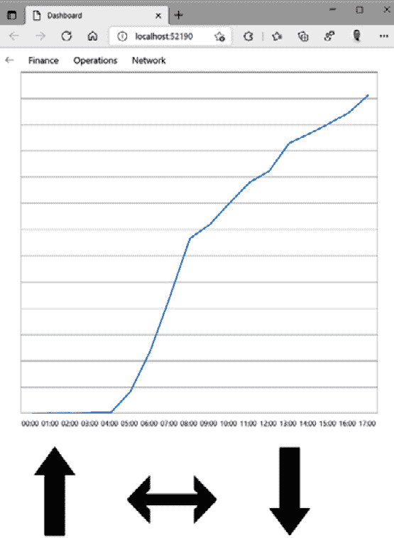
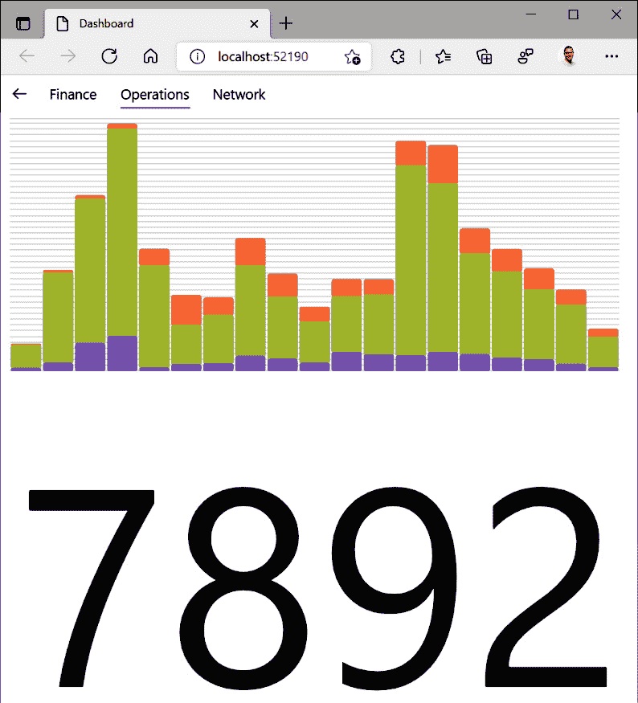
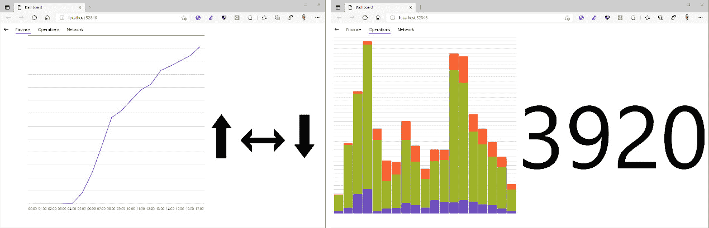

# *第六章*:用图表和自定义 2D 图形显示数据

本章将研究需要显示图表、报告和复杂图形的应用。 应用通常会包含一些图形或图表。 在 UI 中包含标准控件无法轻松生成的元素也变得越来越普遍。

随着本章的深入，我们将为虚构的业务构建一个仪表板应用，它将显示适合业务不同部分的信息。 这类应用通常是管理报告工具的一部分。 你可以想象在每个部门的墙上安装的监视器上显示不同的屏幕。 这使员工能够立即看到他们所在部门的业务发生了什么。

在本章中，我们将涵盖以下主题:

*   显示图形和图表
*   使用 skisharp 创建自定义图形
*   让 UI 布局响应屏幕大小的变化

在本章结束时，你将创建一个仪表盘应用，显示财务，运营，和网络信息，运行在 UWP 和网络上。 它还将调整到不同的屏幕比例，所以每个页面的内容为不同的屏幕大小和纵横比。

# 技术要求

本章假设您已经设置好了开发环境，包括安装项目模板，如[*第 1 章*](02.html# _idTextAnchor015)，*介绍 Uno 平台*所述。 本章的源代码在[https://github.com/PacktPublishing/Creating-Cross-Platform-C-Sharp-Applications-with-Uno-Platform/tree/main/Chapter06](https://github.com/PacktPublishing/Creating-Cross-Platform-C-Sharp-Applications-with-Uno-Platform/tree/main/Chapter06)。

本章中的代码使用了来自[https://github.com/PacktPublishing/Creating-Cross-Platform-C-Sharp-Applications-with-Uno-Platform/tree/main/SharedLibrary](https://github.com/PacktPublishing/Creating-Cross-Platform-C-Sharp-Applications-with-Uno-Platform/tree/main/SharedLibrary)的库。

查看下面的视频来查看代码的运行:[https://bit.ly/3iDchtK](https://bit.ly/3iDchtK)

# 应用介绍

我们将在本章中构建的应用名为**Dashboard**。 它是一个应用，显示按部门划分的业务中的当前活动。 这并不是所有的员工都可以使用的，但是为了让我们专注于本章的特性和感兴趣的领域，我们不关心访问是如何控制的。 这个应用的真实版本会有很多功能，但我们只会实现三个:

*   显示当前财务信息
*   显示实时操作信息
*   显示列车目前在网络中的位置

由于该应用将由员工在他们的办公室使用，它将在桌面(通过 UWP)和 web 浏览器(与 WASM 版本)中可用。

## 创建应用

我们将从创建应用的解决方案开始:

1.  在 Visual Studio 中，使用**Multi-Platform App (Uno Platform)**模板创建一个新项目。
2.  将项目命名为**Dashboard**。 您可以使用不同的名称，但需要相应地调整所有后续代码片段。
3.  移除除**UWP**和**WASM**外的所有平台头项目*。*
4.  为了避免编写过多的代码，我们现在将添加对共享库项目的引用。 右键单击节点的解决方案在解决方案资源管理器**,选择**添加**|**现有项目…**,**UnoBookRail.Common.csproj**导航到文件,并点击【显示】开放。**
***   对于每个特定于平台的项目，我们需要添加一个对公共库项目的引用。 右键单击**UWP**项目节点在解决方案资源管理器**,选择**添加**|**参考…**|【显示】项目,然后检查**UnoBookRail 的条目。 点击**OK。 现在*对 WASM 项目重复这个过程*。****

 ****现在基本的解决方案结构已经准备好了，我们可以向主页添加一些功能。

## 创建单个页面

我们将使用一个单独的页面为我们将要显示的每个功能区域:

1.  在**共享**项目中创建一个名为**Views**的新文件夹。
2.  在**Views**文件夹中，添加*三个*新页面，命名为**FinancePage。 xaml**， **xaml**、**NetworkPage。 xaml**。

现在我们将更新主页，以便能够在这些新页面之间导航。

## 创建主页面

应用已经包含文件**MainPage。 xaml**，我们将使用它作为功能在其他页面之间导航的容器:

1.  更换**MainPage 中的网格。 xaml**和下面的**NavigationView**控件，该控件包含我们将实现的每个单独页面的选项:
2.  现在，我们需要为前面提到的事件**NavItemSelected**添加处理程序，以完成页面之间的实际导航。 **MainPage.xaml.cs**:

    ```cs
    using Dashboard.Views;
    private void NavItemSelected(NavigationView sender, NavigationViewSelectionChangedEventArgs args) 
    {
      var item = (args.SelectedItem as 
                  NavigationViewItem).Content.ToString();
      Type page = null;
      switch (item) {
        case "Finance":
          page = typeof(FinancePage);
          break;
        case "Operations":
          page = typeof(OperationsPage);
          break;
        case "Network":
          page = typeof(NetworkPage);
          break;
      }
      if (page != null && InnerFrame.CurrentSourcePageType
          != page) {
        InnerFrame.Navigate(page);
      }
    }
    ```

3.  We also need to implement the **NavBackRequested** method to handle the user pressing the back button to navigate back through the pages. Add the following to do this:

    ```cs
    private void NavBackRequested(object sender, NavigationViewBackRequestedEventArgs e) 
    {
        InnerFrame.GoBack();
    }
    ```

    导航

    这个应用使用自定义框架和基于堆栈的导航风格。 这允许用户按下内置的后退按钮返回到上一页。 虽然这可能不被认为是最适合这个应用,这是一个最受欢迎的方法,开发人员实现导航在 UWP 应用。由于这个原因,我们认为它适合包括在这本书和显示它可以被纳入一个 Uno 平台应用。

4.  The preceding will allow us to navigate between the pages when an item is selected from the menu, but we also want a page to be shown when the app is first opened. To do this, add the following call at the *end* of the **MainPage** constructor:

    ```cs
    InnerFrame.Navigate(typeof(FinancePage));
    ```

    重要提示

    本节中的代码展示了在**NavigationView**控件中启用页面间导航的最简单方法。 这当然不是唯一的方法，也不是总要这样做的建议。

所有的基础都就绪之后，我们现在就可以向财务页面添加一个图表了。

# 用 SyncFusion 控件显示图表

SyncFusion是一家为 web、桌面和移动开发提供 UI 组件的公司。 他们的 Uno 平台控件在撰写时处于测试状态，在此预览期间可以通过社区许可证([https://www.syncfusion.com/products/communitylicense](https://www.syncfusion.com/products/communitylicense))免费使用。 有许多不同的图表类型，但我们将使用折线图来创建如图*图 6.1*所示的页面。 该图表与一些箭头一起显示，这些箭头提供了一些总体趋势数据，以便查看这些数据的人可以一目了然地看到数据摘要。 想象一下，它们表示的是数据与前一周、前一月、前一年的同一天相比的情况:



图 6.1 -包括 SyncFusion 图表在内的财务信息

## 更新引用以包含 SyncFusion控件

SyncFusion Uno 图表控件的测试版在 GitHub 上提供了完整的源代码:

1.  从[https://github.com/syncfusion/Uno.SfChart](https://github.com/syncfusion/Uno.SfChart)下载或克隆代码。
2.  通过右键单击解决方案，选择**Add**|**Existing project…**，将**syncfus . sfchart . unno .csproj**项目添加到解决方案中。
3.  更新**Syncfusion.SfChart.Uno**项目，使用**Uno 的最新版本。 UI**包。 这是为了避免在解决方案的不同项目中使用库的不同版本时出现任何问题。
4.  从*UWP*和*WASM*项目中引用**Syncfusion.SfChart.Uno**项目。

现在我们可以在应用中使用控件了。

重要提示

由于 SyncFusion 控件只在源代码中可用，但在您阅读本文时，它们可能已经发生了变化。 希望这些控件的编译版本是可用的，但是如果您需要达到编写此文件时的状态，请使用 commit**43cd434**。

## 绘制折线图

我们可以按照以下步骤绘制一个简单的折线图:

1.  首先将此名称空间添加到**FinancePage。 xaml**:

    ```cs
    xmlns:sf="using:Syncfusion.UI.Xaml.Charts"
    ```

2.  Now replace the grid with the following:

    ```cs
    <RelativePanel HorizontalAlignment="Center">
      <sf:SfChart 
          x:Name="MainChart" 
          MaxWidth="600" 
          MaxHeight="600">
        <sf:SfChart.PrimaryAxis>
          <sf:CategoryAxis LabelPlacement="BetweenTicks" 
              ShowGridLines="False" />
        </sf:SfChart.PrimaryAxis>
        <sf:SfChart.SecondaryAxis>
          <sf:NumericalAxis ShowGridLines="True" 
              Visibility="Collapsed" />
        </sf:SfChart.SecondaryAxis>
        <sf:LineSeries 
            ItemsSource="{x:Bind DailySales}"
            XBindingPath="Hour" 
            YBindingPath="TotalSales" />
      </sf:SfChart>
      <TextBlock 
          x:Name="SecondaryItem" 
          FontSize="200"
          FontWeight="Black" 
          RelativePanel.Below="MainChart"
          RelativePanel.AlignHorizontalCenterWithPanel=
    "True"
          Text="{x:Bind TrendArrows}" />
    </RelativePanel>
    ```

    这是我们可以指定的最简单的**SfChart**类。 我们定义了一个**PrimaryAxis**类(x 轴),它反映了小时的一天,**SecondaryAxis**类(y 轴)表示的数值和一组数据作为一个**LineSeries【显示】类。**

    我们还指定了一个**TextBlock**元素，该元素将出现在图表的下方，但要水平对齐。 这将显示指示与图表相关的趋势信息的箭头。

3.  为了提供数据，我们需要向**financpage .xaml.cs**:

    ```cs
    public List<HourlySales> DailySales
        => FinanceInfo.DailySales
           .Select(s => new HourlySales(s.Hour, 
                s.Sales)).ToList();
    public string TrendArrows => FinanceInfo.TrendArrows;
    ```

    中的类添加以下内容
4.  这些属性要求您使用声明添加**:**
5.  我们还必须创建以下类，**SfChart**对象将用来查找我们在 XAML 中引用的命名属性:

显然，我们在这里只创建了一个简单的图表，但关键是要注意它是多么容易。 一个真正的仪表板可能会显示不止一个图表。 您可以在[https://github.com/syncfusion/Uno.SfChart](https://github.com/syncfusion/Uno.SfChart)查看存储库中包含的示例应用中可以包含的图表示例。

我们已经看到，包含一个供应商的图表来显示财务信息是多么容易。 现在让我们添加另一个图表来显示一些不同的信息。

# 用 Infragistics 控件显示图表

Infragistics 是一家为各种平台提供 UI 和 UX工具的公司。 他们还可以在 Uno 平台的应用中选择一些控件，在预览时可以免费使用。

您可以了解更多关于这些控件在 https://www.infragistics.com/products/uno-platform或跟随我们添加一个图表应用来显示相关信息的当前操作 UnoBookRail 业务并创建一个页面,看起来就像一个在图 6.2:

 *

图 6.2 - Infragistics 的图表显示的网络操作细节

## 更新引用

为了能够在我们的应用中使用控件，我们必须首先做以下修改:

1.  参考**UWP**项目中的**infragiss . uno 图表**NuGet 包:

    ```cs
    Install-Package Infragistics.Uno.Charts -Version 20.2.59-alpha
    ```

2.  参考**WASM**项目中的**infragiss . uno . WASM . charts**NuGet 包:

    ```cs
    Install-Package Infragistics.Uno.Wasm.Charts -Version 20.2.59-alpha
    ```

3.  参考**WASM**项目中的**Uno.SkiaSharp.Views**和**Uno.SkiaSharp.Wasm**NuGet 包。 这是必要的，因为 Infragistics 控件使用 skisharp 来绘制控件。 这与我们以前使用的 SyncFusion 控制不同，它使用 XAML:

    ```cs
    Install-Package Uno.SkiaSharp.Views -Version 2.80.0-uno.493
    Install-Package Uno.SkiaSharp.Wasm -Version 2.80.0-uno.493
    ```

通过这些简单的修改，我们现在可以将图表添加到我们的应用中。

重要提示

如果在进行上述更改后发现任何奇怪的编译行为，请尝试清理解决方案，关闭 Visual Studio 的所有打开实例，然后重新打开解决方案。 这不应该是必要的，但我们发现在一些场合需要这样做。

您还可以在 SyncFusion 项目的错误列表中看到条目，尽管它已经成功编译。 可以安全地忽略这些错误。

## 绘制柱状图

现在我们将在应用的**Operations**页面中添加内容。为了简单起见，我们将只添加两条信息。 我们将添加一个图表来显示今天每小时使用了多少种类型的票。 此外，我们将显示目前在火车上或在车站的人数，基于那些出示车票进入车站但随后没有离开的人:

1.  将以下命名空间添加到**OperationsPage 的**Page**元素中。 xaml**:

    ```cs
    xmlns:ig="using:Infragistics.Controls.Charts"
    ```

2.  Now add the following XAML as the contents of the page:

    ```cs
    <Grid>
      <Grid.RowDefinitions>
        <RowDefinition Height="*" />
        <RowDefinition Height="*" />
      </Grid.RowDefinitions>
      <Grid.ColumnDefinitions>
        <ColumnDefinition Width="*" />
        <ColumnDefinition Width="*" />
      </Grid.ColumnDefinitions>
      <ig:XamDataChart Grid.Row="0" Grid.ColumnSpan="2" 
          x:Name="PassengerChart">
        <ig:XamDataChart.Axes>
          <ig:CategoryXAxis x:Name="XAxis"
                ItemsSource="{x:Bind Passengers}" />
          <ig:NumericYAxis x:Name="YAxis" MinimumValue="0"
                Interval="500" Label="{}{}" />
        </ig:XamDataChart.Axes>
        <ig:XamDataChart.Series>
          <ig:StackedColumnSeries 
                   XAxis="{Binding ElementName=XAxis}"
                   YAxis="{Binding ElementName=YAxis}"
                   ItemsSource="{x:Bind Passengers}">
          <ig:StackedColumnSeries.Series>
              <ig:StackedFragmentSeries 
                  ValueMemberPath="Children" />
              <ig:StackedFragmentSeries 
                  ValueMemberPath="Adults" />
              <ig:StackedFragmentSeries 
                  ValueMemberPath="Seniors" />
          </ig:StackedColumnSeries.Series>
          </ig:StackedColumnSeries>
        </ig:XamDataChart.Series>
      </ig:XamDataChart>
      <TextBlock x:Name="CurrentCount" 
                  Grid.ColumnSpan="2" Grid.Row="1" 
                  Text="{x:Bind PsngrCount}" 
                  FontSize="300" 
                  HorizontalAlignment="Center" 
                  VerticalAlignment="Center" />
    </Grid>
    ```

    前面的代码有三个部分。 我们从定义两行两列开始。 内容目前跨列，但稍后将以其他方式使用这些列。

    该图表是一个**XamDataChart**类。 其中，我们指定了*x*和*y*轴，并将数据显示为**StackedColumnSeries**元素。 在本系列文章中，我们详细介绍了到堆栈每个片段的数据的路径。

    最后，我们添加了显示当前乘客数量的**TextBlock**元素。

3.  Add the following **using** directive to **OperationsPage.xaml.cs**:

    ```cs
    using UnoBookRail.Common.DashboardData;
    ```

    这些是我们将添加到该文件的属性所需要的。

4.  在提供图表中显示的数据的**OperationsPage**类中添加以下内容:

    ```cs
    public string PsngrCount => OperationsInfo.CurrentPassengers;
    private List<PersonCount> Passengers
       => OperationsInfo.Passengers.Select(p 
           => new PersonCount(p.Hour, p.Children,
               p.Adults, p.Seniors)).ToList();
    ```

5.  现在我们需要添加刚才引用的**PersonCount**类:

    ```cs
    public class PersonCount 
    {
        public PersonCount(string hour, double child,
            double adult, double senior) 
        {
            Hour = hour;
            Children = child;
            Adults = adult;
            Seniors = senior;
        }
        public string Hour { get; set; }
        public double Children { get; set; }
        public double Adults { get; set; }
        public double Seniors { get; set; }
    }
    ```

有了这个，我们现在有了一个简单的页面，图表显示每小时旅行的乘客人数。

与 SyncFusion 图表一样，Infragistics 提供了更多的图表和其他控件。 你可以在[https://github.com/Infragistics/uno-samples](https://github.com/Infragistics/uno-samples)找到这些例子。

既然我们已经看到了使用第三方库显示更复杂控件的不同方法，那么让我们自己来绘制一些更复杂的控件。

# 用 skisharp 绘制自定义图形

UWP 和 Uno 平台支持创建形状并提供基本的绘图功能。 然而，有时你需要在你的应用中显示一些标准控件无法轻松完成的东西，你需要细粒度的控制，或者你在操作大量 XAML 控件时遇到性能问题。 在这些情况下，有必要自己直接绘制 UI。 其中一个方法就是使用 skisharp。 skisharp 是一个基于谷歌的 Skia 图形库的跨平台 2D 图形 API，我们可以在我们的 Uno 平台应用中使用。 为了展示它的使用有多简单，我们将创建应用的最后一部分，它将在地图上显示网络中列车的当前位置。 在短短几行代码中，我们将创建类似于*图 6.3*所示的截图:


图 6.3 -在浏览器中运行时应用中显示的网络地图

现在你已经看到了我们将要创造的东西，让我们开始吧。

## 更新项目引用

我们在应用中需要使用 skisharp的引用已经作为我们使用 Infragistics 控件添加的引用的一部分添加了。 如果你做了这些改变，这里就没什么可做的了。

如果你在遵循*而没有*在最后一节中添加 Infragistics 控件，你需要对你的解决方案做以下更改:

*   **WASM**项目中**Uno.SkiaSharp.Views**和**Uno.SkiaSharp.Wasm**NuGet 包:

    ```cs
    Install-Package Uno.SkiaSharp.Views -Version 2.80.0-uno.493
    Install-Package Uno.SkiaSharp.Wasm -Version 2.80.0-uno.493
    ```

添加了相关的参考文献后，我们现在就可以绘制网络地图了。

## 绘制网络地图

要在 app 中绘制网络地图，我们需要执行以下步骤:

1.  **NetworkPage。 xaml**，添加以下内容作为唯一内容。 这个控件将显示我们的绘图:

    ```cs
    <skia:SKXamlCanvas xmlns:skia="using:SkiaSharp.Views.UWP" PaintSurface="OnPaintSurface" />
    ```

2.  要在**SKXamlCanvas**控件上绘制映射，我们需要在**NetworkPage.xaml.cs**中添加以下使用声明:

    ```cs
    using SkiaSharp;
    using SkiaSharp.Views.UWP;
    using UnoBookRail.Common.Mapping;
    using UnoBookRail.Common.Network;
    ```

3.  接下来，我们必须添加我们在 XAML 中引用的**OnPaintSurface**方法。 每当控件需要重绘图像时，就会调用此方法。 这将发生在控件第一次加载以及控件的渲染大小l 发生变化时:
4.  Add the **SetUpCanvas** method to initialize and position the image correctly:

    ```cs
    private SKCanvas SetUpCanvas(SKPaintSurfaceEventArgs e) 
    {
      var canvas = e.Surface.Canvas;
      var relativeWidth = e.Info.Width / ImageMap.Width;
      var relativeHeight = 
          e.Info.Height / ImageMap.Height;
      canvas.Scale(Math.Min(relativeWidth, 
          relativeHeight));
      var x = 0f;
      var y = 0f;
      if (relativeWidth > relativeHeight) 
      {
        x = (e.Info.Width - (ImageMap.Width * 
             relativeHeight)) / 2f / relativeHeight;
      }
      else {
        y = (e.Info.Height - (ImageMap.Height * 
             relativeWidth)) / 2f / relativeWidth;
      }
      canvas.Translate(x, y);
      canvas.Clear();
      return canvas;
    }
    ```

    **SetUpCanvas**方法将我们的绘图区域设置为尽可能大的大小，而不会扭曲或拉伸它，并确保它总是水平和垂直居中。 最后，它清除画布并返回它，为其他方法在其上绘制做好准备。

5.  Add the **DrawLines** method to draw the branch lines on the canvas:

    ```cs
    void DrawLines(SKCanvas canvas) 
    {
        var paint = new SKPaint 
        {
            Color = SKColors.Black, 
            StrokeWidth = 1,
        };
        var northPnts = 
            ImageMap.GetStations(Branch.NorthBranch);
        var mainPnts = 
            ImageMap.GetStations(Branch.MainLine);
        var southPnts = 
            ImageMap.GetStations(Branch.SouthBranch);
        SKPoint[] ToSKPointArray(List<(float X, float Y)> 
            list)
            => list.Select(p => new SKPoint(p.X, 
                p.Y)).ToArray();
        void DrawBranch(SKPoint[] stnPoints)
            => canvas.DrawPoints(SKPointMode.Polygon, 
                stnPoints, paint);
        DrawBranch(ToSKPointArray(northPnts));
        DrawBranch(ToSKPointArray(mainPnts));
        DrawBranch(ToSKPointArray(southPnts));
    }
    ```

    在前面的代码中，库返回的站点位置被转换为 skia 特定的数组，用于绘制连接所有点的多边形。

6.  Add the **DrawStations** method to draw the station positions on the branch lines:

    ```cs
    void DrawStations(SKCanvas canvas) 
    {
        var paint = new SKPaint 
        {
            Color = SKColors.Black,
            Style = SKPaintStyle.Fill,
        };
        foreach (var (X, Y) in ImageMap.Stations) 
        {
            canvas.DrawCircle(new SKPoint(X, Y), 2, 
                paint);
        }
    }
    ```

    **DrawStations**方法很简单，它所做的就是为每个站画一个圆。

7.  Add the **DrawTrains** method to show where the trains currently are on the map:

    ```cs
    void DrawTrains(SKCanvas canvas) 
    {
        var trainPaint = new SKPaint 
        {
            Color = SKColors.Cyan,
            Style = SKPaintStyle.Fill,
        };
        foreach (var train in ImageMap.GetTrainsInNetwork()) 
        {
            canvas.DrawCircle(new SKPoint(
                train.MapPosition.X, train.MapPosition.Y),
                    1.8f, trainPaint);
        }
    }
    ```

    **DrawTrains**方法同样很简单，因为它循环遍历所提供的数据，并在每个位置绘制一个青色圆圈。 因为这是在车站圆圈之后画的，所以当火车到达车站时，它会出现在圆圈上方。

    重要提示

    在本章中，我们只使用了一些圆和线来创建我们的地图。 然而，skisharp 的能力远远超过我们在这里所能覆盖的范围。 您可能想通过扩展我们刚刚创建的地图来探索其他可用的功能，包括车站的名称或添加其他细节来显示火车的方向或它是否在车站。

我们现在已经实现了应用的所有页面，但我们还可以通过根据屏幕或窗口的大小调整内容来进一步改进内容。

# 响应 UI 的变化

您的应用将需要在不同大小的屏幕和窗口上运行。 有些差异是由于应用运行在不同的设备上，但你可能还需要考虑到 windows 的大小可以由用户调整。

可以设计一个页面的多个版本并在运行时加载相应的版本。 然而，创建一个根据可用维度进行调整的单一页面通常要容易得多。 我们将看看如何使用可用的特性来实现这一点。

## 改变页面布局

Uno 平台允许您通过在**VisualStates**之间切换来创建响应式UI。

可以创建**StateTriggers 元素(触发状态之间的变化)对许多场景,但最常见的是使用**AdaptiveTrigger**元素火灾规模的基础上的控制。 我们现在将使用自适应触发器来调整**Finance**和**Operations**页面，以根据可用宽度更好地布局其内容:**

1.  Add the following as the first child of **RelativePanel** in **FinancePage.xaml**:

    ```cs
    <VisualStateManager.VisualStateGroups>
      <VisualStateGroup>
        <VisualState>
          <VisualState.StateTriggers>
            <AdaptiveTrigger MinWindowWidth="1200" />
          </VisualState.StateTriggers>
          <VisualState.Setters>
            <Setter Target="SecondaryItem.
                (RelativePanel.AlignTopWithPanel)"
                    Value="True"/>
            <Setter Target="SecondaryItem.
                (RelativePanel.AlignVerticalCenterWithPanel)"
                    Value="False"/>
            <Setter Target="SecondaryItem.
                (RelativePanel.RightOf)" 
                    Value="MainChart"/>
            <Setter Target="SecondaryItem.
                (RelativePanel.Below)" 
                    Value="{x:Null}"/>
            <Setter Target="SecondaryItem.Margin" 
                Value="0,200,0,0"/>
          </VisualState.Setters>
        </VisualState>
      </VisualStateGroup>
    </VisualStateManager.VisualStateGroups>
    ```

    这定义了一个**AdaptiveTrigger**元素，当面板的相对像素宽度至少为 1200 像素时应用该元素。 当触发这种可视状态时，将**TextBlock**元素设置为图表的右侧，并相应地调整其对齐方式。 图 6.4 的左手边显示了这是什么样子。

2.  We can now do a similar thing with the grid in the **OperationsPage.xaml** page. Add the following immediately below the row and column definitions:

    ```cs
    <VisualStateManager.VisualStateGroups>
      <VisualStateGroup>
        <VisualState>
          <VisualState.StateTriggers>
            <AdaptiveTrigger MinWindowWidth="1200" />
          </VisualState.StateTriggers>
          <VisualState.Setters>
            <Setter Target="PassengerChart.
                (Grid.ColumnSpan)" Value="1"/>
            <Setter Target="PassengerChart.(Grid.RowSpan)"
                 Value="2"/>
            <Setter Target="CurrentCount.(Grid.Row)" 
                 Value="0"/>
            <Setter Target="CurrentCount.(Grid.Column)" 
                Value="1"/>
            <Setter Target="CurrentCount.
                (Grid.ColumnSpan)" Value="1"/>
            <Setter Target="CurrentCount.
                (Grid.RowSpan)" Value="2"/>
          </VisualState.Setters>
        </VisualState>
      </VisualStateGroup>
    </VisualStateManager.VisualStateGroups>
    ```

    通过这些 setter，我们可以使用之前创建的行和列定义。 虽然初始代码将控件放在单独的行中，但在这里，我们正在更改控件，以便它们位于不同的列中，并在窗口更宽时跨越行。 如图*图 6.4*所示，这意味着当前列车上的人数显示在图表的旁边，而不是下面:



图 6.4 -在横向布局中显示的财务和运营页面

通过这两个示例，我们看到了改变页面上的元素如何重新定位以改变布局的不同方法。 没有一种正确的方法可以针对不同的可用空间量调整所有页面。 状态触发器可用于更改元素上的任何属性，还可以有多个触发器，这样您就可以，例如，为小屏幕、中屏幕和大屏幕设置不同的布局。

改变屏幕上元素的布局并不是调整显示内容的唯一方法。 也可以让控件自己调整、调整大小和重绘以适应空间。

## 拉伸和缩放内容以适应可用空间

XAML 的优势之一是它能够动态布局控件，而不依赖于为每个元素提供特定的大小。 可以通过设置**HorizontalAlignment**和**VerticalAlignment**属性来调整单个 XAML 控件的大小，以控制它们如何利用可用空间。 将这些属性的值设置为**Stretch**将允许它们占用父元素中的所有可用空间。 对于更复杂的场景，您还可以使用**ViewBox**元素通过以不同的方式和方向拉伸控件来转换它们。

如果你想知道更多关于用 XAML 元素创建布局的信息，你可以在[https://platform.uno/docs/articles/winui-doc-links-development.html# layouting](https://platform.uno/docs/articles/winui-doc-links-development.html# layouting)找到一些有用的链接。

许多控件也自动地调整以使用所有或尽可能多的可用空间。 我们用 skisharp 绘制的地图做到了这一点。 这张地图画得尽量大而不变形。 它在可用空间的中心对齐，无论窗口是肖像还是景观长宽比。

现在所有页面都调整到可用空间，我们的应用和本章就完成了。

# 总结

在本章中，我们构建了一个在 UWP 和 web 浏览器上工作的应用。 该应用使用了 SyncFusion 和 Infragistics 的图形控制。 我们还用 skisharp 创建了一个自定义地图。 最后，我们了解了如何调整 UI 布局以响应不同的和不断变化的屏幕大小。

这一章是这本书的这一部分的最后一章。 在下一部分中，我们将从构建应用转移到如何测试和部署它们。 在下一章中，我们将看看如何使用**Uno。 UITest**库作为您更广泛的测试策略的一部分。 当构建在多个平台上运行的应用时，在这些平台上自动化测试可以节省大量时间并提高生产力。*****