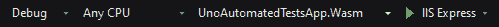
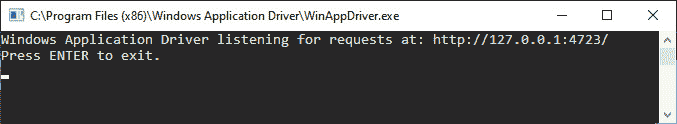

# *第七章*:测试你的应用

在之前的章节中，我们介绍了使用 Uno 平台开发多种不同类型的应用。 然而，Uno 平台不仅允许开发者编写应用; 它也允许自动化 UI 测试编写，将运行在 Android, iOS，和 WebAssembly 使用 Uno。 外的框架。 在本章中，我们将使用 Uno 编写我们的第一个测试。 UITest 并在不同的平台上运行，包括使用模拟器。 在此之后，您还将学习如何使用 WinAppDriver 为 Windows 编写测试。

在本章中，我们将涵盖以下主题:

*   设置**Uno。 应用程序的 UITest**项目
*   **Uno。 UITest**测试你的 Uno 平台应用
*   针对应用程序的 WASM、Android 和 iOS 版本运行测试
*   为你的 Uno 平台应用编写单元测试
*   使用 WinAppDriver 为你的应用程序的 UWP 头创建自动化测试
*   为什么手工测试仍然很重要

在本章结束时，您将学习如何使用**Uno 编写测试。 UITest**和 WinAppDriver，如何在不同平台上运行这些测试，以及为什么手动测试你的应用仍然很重要。

# 技术要求

本章假设您已经设置好了开发环境，包括安装项目模板，如[*第 1 章*](02.html#_idTextAnchor015)，*介绍 Uno 平台*所述。 本章的源代码可以在[https://github.com/PacktPublishing/Creating-Cross-Platform-C-Sharp-Applications-with-Uno-Platform/tree/main/Chapter07](https://github.com/PacktPublishing/Creating-Cross-Platform-C-Sharp-Applications-with-Uno-Platform/tree/main/Chapter07)找到。

本章中的代码使用了来自[https://github.com/PacktPublishing/Creating-Cross-Platform-C-Sharp-Applications-with-Uno-Platform/tree/main/SharedLibrary](https://github.com/PacktPublishing/Creating-Cross-Platform-C-Sharp-Applications-with-Uno-Platform/tree/main/SharedLibrary)的库。

查看下面的视频来查看代码的运行:[https://bit.ly/3iBFZ2e](https://bit.ly/3iBFZ2e)

# Uno 入门 外的

在我们开始Uno 之前。 UITest，让我们覆盖什么 Uno。 UITest 是什么，它的目标是什么。 Uno。 UITest是 Uno 平台团队开发和维护的一个库，允许开发者为他们的 Uno 平台应用编写统一的 UI 测试。 这些 UI 测试允许你模拟用户与你的应用程序交互，并验证你的应用程序的 UI，以确保用户交互正确工作和你的应用程序的行为与设计一致。 Uno。 外的,您可以编写 UI 测试**(有时也称为交互测试),你可以针对**运行 Android**,【显示】iOS,**WASM**你的应用。**

 **引擎盖下，乌诺。 UITest 使用**Xamarin。 UITest**来运行针对 Android 和 iOS 应用程序的测试。 UITest 使用**硒**和**谷歌铬**。 使用这些库，Uno。 UITest 允许你编写模拟用户与应用 UI 交互的测试，包括模拟鼠标输入(如单击)和键盘输入(如输入文本)。

但是什么时候应该使用 UI 测试呢? 在编写复杂的应用程序时，确保对代码的更改不会破坏现有功能通常是很难测试的，特别是有些更改只有在使用应用程序时才会变得明显，而在单独测试组件或类时则不会。 UI 测试非常适合这种场景，因为你可以编写测试来模拟使用应用程序的普通用户，而无需手动执行几十或数百个步骤。 编写 UI 测试的一个常见场景是检查用户是否能够成功地完成应用程序中的某些任务，例如，登录到应用程序或搜索特定的东西。 虽然 UI 测试很适合测试这些类型的场景，但 UI 测试并不是银弹，而且也有其缺点。 因为 UI 测试模拟用户输入，所以它们的运行速度比普通的单元测试慢，后者只测试单个对象或类。 除此之外，由于 UI 测试框架或库需要找到与应用交互的方法，当更新应用的 UI 或更改应用中的文本或名称时，UI 测试有时会中断。

尽管如此，在开发应用时，编写 UI 测试是非常重要的，当你试图确保没有错误潜入应用。这是特别有用的，当编写的应用将运行在各种不同的设备，有不同的屏幕大小，功能， 和操作系统版本，因为这使得在许多不同的配置上测试你的应用程序更容易，因为手动测试是缓慢和容易出错的。

在我们使用 Uno 之前。 UITest，我们首先需要一个可以用来写测试的应用。 为此，让我们从开始，为我们的应用程序创建一个新的解决方案，我们将使用它来编写测试:

1.  使用**Multi-Platform App (Uno Platform)**模板创建一个新项目。
2.  项目命名为**UnoAutomatedTestsApp**。 当然，您可以使用不同的名称; 然而，在本章中，我们将假设项目名为**UnoAutomatedTestsApp**。
3.  在 Android, iOS, UWP 和 WASM 中删除除外的所有平台头项目*。*
4.  现在我们需要添加一个对共享库的引用。 为此，右键单击解决方案文件，选择**Add>Existing Project…**，导航到**UnoBookRail.Common.csproj**文件，然后单击**Open**。
5.  在每个头项目中引用共享库项目。 为此，右键单击头部项目，选择**Add>Reference…>Projects**，选中**UnoBookRail。 常见**，点击**OK**。 因为我们需要在每个头中引用库，所以对每个头重复这个过程，换句话说，Android、iOS、UWP 和 WASM。

现在我们已经创建了项目，让我们添加一些内容到我们的应用程序，我们可以测试:

1.  添加**xmlns:toolkit="using:Uno.UI. " Toolkit”**到**Page**元素，位于**MainPage 的根目录下。 xaml**。
2.  在您的**MainPage 中替换**Grid**控件。

    ```cs
    <StackPanel Spacing="10" Padding="10" 
        toolkit:VisibleBoundsPadding.PaddingMask="All" 
        Background="{ThemeResource 
            ApplicationPageBackgroundThemeBrush}">
        <StackPanel x:Name="SignInForm" Spacing="10">
            <TextBox x:Name="UsernameInput" 
                AutomationProperties.AutomationId=
                    "UsernameInput"
                TextChanged="Username_TextChanged" 
                    Header="Username"/>
            <PasswordBox x:Name="PasswordInput" 
                AutomationProperties.AutomationId=
                    "PasswordInput"
                PasswordChanged="Password_PasswordChanged"
                    Header="Password"/>
            <TextBlock x:Name=
                "SignInErrorMessageTextBlock" 
                    AutomationProperties.AutomationId="
                        SignInErrorMessageTextBlock"
                Foreground="{ThemeResource 
                    SystemErrorTextColor}" 
                        Visibility="Collapsed"/>
            <Button x:Name="SignInButton" 
                AutomationProperties.AutomationId=
                    "SignInButton"
                Click="SignInButton_Click" 
                    Content="Sign in" IsEnabled="False"
                HorizontalAlignment="Center" 
                    BorderThickness="1"/>
        </StackPanel>
        <TextBlock x:Name="SignedInLabel" 
            AutomationProperties.AutomationId=
                "SignedInLabel"
            Text="Successfully signed in!" 
                Visibility="Collapsed"/>
    </StackPanel>
    ```

    xaml**文件
3.  这是一个简单的登录接口，我们将在本章后面编写测试。 它包括登录控件、一个登录按钮和一个将在登录时显示的标签。
4.  Now, add the following two methods to the **MainPage** class:

    ```cs
    using UnoBookRail.Common.Auth;
    ...
    private void Username_TextChanged(object sender, TextChangedEventArgs e)
    {
        SignInButton.IsEnabled = UsernameInput.Text.Length
            > 0 && PasswordInput.Password.Length > 0;
    }
    private void Password_PasswordChanged(object sender, RoutedEventArgs e)
    {
        SignInButton.IsEnabled = UsernameInput.Text.Length
            > 0 && PasswordInput.Password.Length > 0;
    }
    private void SignInButton_Click(object sender, RoutedEventArgs args)
    {
        var signInResult = Authentication.SignIn(
            UsernameInput.Text, PasswordInput.Password);
        if(!signInResult.IsSuccessful && 
            signInResult.Messages.Count > 0)
        {
            SignInErrorMessageTextBlock.Text = 
                signInResult.Messages[0];
            SignInErrorMessageTextBlock.Visibility = 
                Visibility.Visible;
        }
        else
        {
            SignInErrorMessageTextBlock.Visibility = 
                Visibility.Collapsed;
            SignInForm.Visibility = Visibility.Collapsed;
            SignedInLabel.Visibility = Visibility.Visible;
        }
    }
    ```

    这段代码添加了处理程序，允许我们在用户输入用户名和密码后立即启用登录按钮。 否则，登录按钮将被禁用。 除此之外，我们还处理登录按钮单击并相应地更新 UI，包括在登录失败时显示错误消息。

现在，如果你启动你的应用程序的 UWP 头，你会看到类似于*图 7.1*:


图 7.1 -带有签到表单的运行应用程序的屏幕截图

现在我们已经添加了一个简单的测试应用程序，我们可以再次测试它，现在我们可以添加我们的**Uno。 UITest**测试项目:

1.  如果你想为你的应用程序的 WASM 头运行测试，确保你已经安装了谷歌 Chrome。
2.  首先，您需要为 Android、iOS 和 WASM 头更新项目文件。 为此，在这些项目的**.csproj**文件的最后一个关闭项目标签之前添加以下条目:
3.  For the iOS project, add a reference to the **Xamarin.TestCloud.Agent** NuGet package. Since, as of the time of writing, the latest stable version was **0.22.2**, we will use that.

    在你的**App.xaml.cs**文件的**onlaunching**方法中，在方法的开头添加如下内容:

    ```cs
    #if __IOS__ && USE_UITESTS
          // Launches Xamarin Test Cloud Agent
          Xamarin.Calabash.Start();
     #endif
    ```

    Uno 以来。 UITest库使用 Xamarin。 UITest，对于 iOS 应用，我们需要添加前面的代码。 否则 Xamarin 的。 UITest 无法与正在运行的 iOS 应用程序交互，测试将无法工作。

4.  Uno 以来。 UITest 项目类型没有包含在 Uno 平台 Visual Studio 模板扩展中，请确保您已经安装了 Uno 平台**dotnet 新**模板。 你可以在[*第一章*](02.html#_idTextAnchor015)，*介绍 Uno 平台*中找到这方面的说明。
5.  在**UnoAutomatedTestsApp**文件夹中，创建一个名为**UnoAutomatedTestsApp 的文件夹。** 。
6.  Inside the newly created folder, run the following command:

    ```cs
    dotnet new unoapp-uitest
    ```

    这将创建一个新的 Uno。 UITest 项目，并将该项目添加到解决方案文件中。

7.  更新 Android 和 iOS 应用程序包名称。 对于 Android，将 Android 项目的**Properties/AndroidManifest.xml**文件中的**包**项替换为**package="UnoBook "。 UnoAutomatedTestsApp“**。 替换 iOS 包名，请打开“**Info”。 在 iOS 项目中 plist**文件，用**UnoBook 替换**Bundle Identifier**。 UnoAutomatedTestsApp**。
8.  Now we need to update the **Constants.cs** file inside the Uno.UITests app project to point to the correct app. For this, replace lines 13, 14, and 15 with the following:

    ```cs
    public readonly static string iOSAppName = "UnoBook.UnoAutomatedTestsApp";
    public readonly static string AndroidAppName = "UnoBook.UnoAutomatedTestsApp";
    public readonly static string WebAssemblyDefaultUri = "http://localhost:[PORT]/";
    ```

    由于 WASM app 的端口是随机生成的，所以将前面代码中的**[port]**替换为以下信息

    请注意

    我们需要更新自 Uno 以来的**Constants.cs**文件。 在 WASM 的情况下，UITest 需要能够通过应用程序名称或应用程序 URI 找到应用程序。 要找出你的 WASM 头运行在哪个 URI 上，打开**Properties/launchSettings。 json**在 WASM 头部。 在里面，这取决于您是使用**IIS Express**还是**[ProjectName]。 Wasm**目标，要么使用**iisSettings**选项中的**applicationUrl**，要么使用**【项目名称】中的**applicationUrl**。 Wasm**配置文件以确定端口。 本章中，我们将使用**IIS 目标**。 iOS 应用的名称是由**信息中的 Bundle 标识符定义的。 plist**文件位于 iOS 项目中。 Android 应用的名称，参考 Android 项目的**Properties/AndroidManifest.xml**文件中的 package 属性。

在**UnoAutomatedTestsApp。 UITests**项目，您将找到三个文件:

*   **Constants.cs**:这包含了使用应用包名或应用的 URL 来查找正在运行的应用的配置，就像前面解释的那样。
*   Given_MainPage.cs:这是一个示例测试文件，其中包含一个演示如何编写测试的小测试。
*   **TestBase.cs**:该文件包含所有启动和关闭应用程序的引导代码，还暴露了一个**IApp**实例(更多内容在下一节中)。 该文件还导出一个**TakeScreenshot**函数，您可以使用该函数对正在运行的应用程序进行截屏。

现在我们已经介绍了如何设置 Uno。 UITest 项目及其结构，让我们继续编写我们的第一个 Uno。 UITest 和学习如何运行这些测试。

# 编写并运行您的第一个测试

在我们开始编写第一个测试之前，我们将介绍如何使用 Uno。 UITest 与您的应用程序交互。 为此，我们将首先介绍使用 Uno 的寻址元素的基础知识。 UITests 查询特性对象。

## 如何 Uno。 外的工作

因为 UI 测试需要处理应用的 UI 元素，所以每个 UI 测试库都需要有一种方法允许开发者处理这些元素。 **Uno。 UITest**使用**IAppQuery**接口来定义查询，使用**IApp**接口来运行这些查询并注入输入。

**IApp**界面为您提供了与应用程序交互所需的 api，包括单击元素、模拟滚动和注入文本输入。 作为**Uno 创建的一部分。 UITest**项目，**TestBase**类将为您提供一个**IApp**实例。 自【显示】IApp 界面允许您模拟输入到您的应用程序和大多数交互需要特定的交互控制的目标,大多数方法**IApp**界面要求您指定的【病人】AutomationID 属性控制或通过使用**IAppQuery**界面。

在下面的例子中，我们将使用**AutomationID**来单击按钮，如下面的 XAML 所定义:

```cs
<!-- Setting AutomationId to reference button from UI test -->
<Button AutomationProperties.AutomationId="SignInButton Content="Sign in"/>
```

当写一个 Uno。 UITest 测试，然后我们可以使用以下代码按下按钮:

```cs
App.Tap("SignInButton");
```

相比使用**x:名称**/**AutomationID**的控制指定元素,通过使用**IAppQuery**界面,你可以解决控制基于其他属性,例如,他们的类型,或者基于特定的属性被设置在一个控制。 当使用**IAppQuery【显示】,你会注意到**IApp 接口并不期望得到一个元素的**IAppQuery【病人】类型,而是一个元素的**<Func IAppQuery, IAppQuery>**类型。 由于**IApp**接口严重依赖于此，你经常会看到以下**using-alias**语句:******

```cs
using Query=System.Func<Uno.UITest.IAppQuery,Uno.UITest.IAppQuery>;
```

这允许开发人员更容易地编写查询，因为您可以简单地使用**Query**类型别名，而不必每次都编写它。 为了简单起见，在本章中，我们还将使用这个**using**语句和**Query**类型。

如果我们从之前的 XAML 中选取，按下带有**IAppQuery**接口的按钮，可以这样做:

```cs
Query signInButton = q => q.Marked("SignInButton");
App.Tap(signInButton);
```

当我们创造了 Uno。 UITest 项目中，你可能也注意到添加了一个对 NUnit NuGet 包的引用。 默认情况下,Uno。 UITest 使用 NUnit 来处理断言及其测试。 当然，这并不意味着您必须在测试中使用 NUnit。 然而，如果你想使用不同的测试框架，你将需要更新**TestBase.cs**文件，因为它使用 NUnit 属性来连接到测试的设置和删除。

现在我们已经介绍了如何**Uno 的基础知识。 UITest**工作正常，现在我们将继续为我们的登录界面编写测试。

## 编写您的第一个测试

我们将通过为我们在本章开始时添加的登录界面编写第一个测试来开始。 为简单起见，我们将使用**NUnit**since**Uno。 UITest**在创建新的**Uno 时默认使用此选项。 UITest**项目，这意味着我们不必更新**TestBase**类。 我们首先为我们的测试创建一个新文件:

1.  首先，删除现有的**Given_MainPage.cs**文件。
2.  创建一个名为**Tests**的新文件夹。
3.  在**Tests**文件夹中创建一个名为**signnsts .cs**的新类。
4.  Update **SignInTests.cs** with the following code:

    ```cs
    using NUnit.Framework;
    using Query = System.Func<Uno.UITest.IAppQuery, Uno.UITest.IAppQuery>;
    namespace UnoAutomatedTestsApp.UITests.Tests
    {
        public class SignInTests : TestBase
        {
        }
    }
    ```

    我们继承**TestBase**进入**IApp**当前测试运行的实例,能够发送输入到我们的应用程序。除此之外,我们还添加一个使用声明的**NUnit**图书馆,稍后我们将使用它并添加指定使用声明我们部分*如何 Uno 覆盖。 UITest 工作*。

现在，让我们添加第一个测试。 让我们从简单地检查电子邮件和密码输入字段以及登录按钮是否存在开始。 在本节的其余部分中，我们将只在**signnsts .cs**文件中工作，因为我们正在为登录用户界面编写测试:

1.  首先添加一个新的公共函数，这将是我们的测试用例。 我们将这个函数命名为**verifysigninrenders**。
2.  添加**Test**属性。 这让**NUnit**知道该函数是一个测试。
3.  现在，在函数中添加以下代码:

    ```cs
    App.WaitForElement("UsernameInput");
    App.WaitForElement("PasswordInput");
    App.WaitForElement("SignInButton");
    ```

你的**SignInTests**类现在应该看起来像这样:

```cs
public class SignInTests : TestBase
{
    [Test]
    public void VerifySignInRenders()
    {
        App.WaitForElement("UsernameInput", "Username input 
            wasn't found.");
        App.WaitForElement("PasswordInput", "Password input 
            wasn't found.");
        App.WaitForElement("SignInButton", "Sign in button 
            wasn't found.");
    }
}
```

现在我们的测试是试图找到自动化 ID 的元素**UserNameInput**,**PasswordInput**,**SignInButton**,考试不及格,如果找不到任何元素。

现在我们已经编写了第一个测试，让我们来测试一下! 为此，我们将首先介绍如何运行这些测试。

## 在 Android、iOS 和 WASM 上运行测试

运行您的**Uno。 外的对**测试 Android, iOS,和WASM 主管你的应用是相当简单的,虽然过程总是略不同取决于你想开始的平台。

### 正在对 WASM 头部进行测试

让我们以的 WASM 头为例，运行我们的测试:

1.  First, you will need to deploy the WASM head of the app. For this, select the **UnoAutomatedTestsApp.Wasm** start up project and select the **IIS Express** target, as shown in *Figure 7.2*. Then, press *Ctrl + F5*, which will deploy the project.

    

    图 7.2 -选择 IIS Express 的 WASM 项目

2.  更新**Constants.cs**并更改**Constants。 当前平台**到**平台。 浏览器**。 如果您没有更新**常量。 WebAssemblyDefaultUri**属性，按照*使用 Uno 入门的方法执行。 UITest*节。
3.  Open **Test Explorer** by clicking **View** in the menu bar and clicking on **Test Explorer**. Now, expand the tree and right-click the **VerifySignInRenders** test. Click the **Run** option from the popup. Now, the test will run against the app running in Chrome.

    重要提示

    在撰写本文时，由于 Uno 的一个已知 bug。 UITest，运行测试对 WASM 头可能不工作，因为 Chrome 可能无法启动。 不幸的是，目前还没有解决办法。 要了解更多关于这个 bug 的当前状态，请参考以下 GitHub 问题:[https://github.com/unoplatform/Uno.UITest/issues/60](https://github.com/unoplatform/Uno.UITest/issues/60)。

一旦测试启动，Chrome 将以无头模式启动，一旦测试完成，测试将在 Visual Studio 测试资源管理器中被标记为通过。

### 针对应用程序的 Android 版本运行测试

除了在 WASM 头上运行测试外，还可以在模拟器或 Android 设备上运行应用的 Android 版本上运行测试。 要做到这一点，请遵循以下步骤:

1.  确保**Android 模拟器**正在运行，并且应用程序已经部署。 要部署应用的 Android 版本，选择 Android 项目作为启动项目，按*Ctrl + F5*。 如果您想针对 Android 设备上运行的应用程序运行测试，请确保应用程序已部署在设备上，并且您的设备已连接到您的计算机。
2.  更新**Constants.cs**并更改**Constants。 当前平台**到**平台。 Android**。 以防你没有更新**常量。 AndroidAppName**属性，按照*的方法开始使用 Uno。 UITest*节。
3.  与 WASM 一样，现在右键单击**test Explorer**中的测试，然后单击**Run**。 应用程序将在模拟器内或您的 Android 设备上启动，测试将针对运行中的 Android 应用程序运行。

### 针对应用程序的 iOS 版本运行测试

您还可以针对在模拟器上或 iOS 设备上运行的应用程序的 iOS 版本运行 UI 测试。 注意，这需要 macOS。 要在 iOS 头上运行测试，请遵循以下步骤:

1.  确保 iOS 模拟器正在运行，应用程序已经部署。 部署 iOS 版本的应用程序,选择 iOS 项目作为项目启动并运行应用程序。如果你想运行测试对你的 iOS 设备上运行的应用程序,确保设备上的应用程序部署,并连接到你的电脑。
2.  Update **Constants.cs** and change **Constants.CurrentPlatform** to **Platform.iOS**. Set **iOSDeviceNameOrId** to the name of the emulator or tethered device you wish to use.

    如果使用绑定设备，您可能需要在**信息中修改**iOSAppName**和**Bundle Identifier**。 plist**以便与你的开发者证书兼容。

3.  Now, right-click the test project in the **Tests** window and click on **Run Test**. The app will start and the tests will be run.

    额外的信息

    在 mac 上运行 UI 测试需要测试库、工具和操作系统版本的兼容版本。 如果在运行测试时遇到错误，请确保您拥有最新版本的 OS X、Xcode、Visual Studio for Mac 以及您在测试项目中使用的 NuGet 包。 您可能还需要确保正在运行的设备或模拟器是最新的 iOS 版本(包括任何更新)。

    在模拟器上运行 UI 测试可能是资源密集型的。 如果测试不能在模拟器上启动，您可能会发现有必要在连接的设备上运行它们。

    如果在物理设备上进行测试，必须启用 UI 自动化。 在**设置>开发人员>UI 自动化**中启用。

    希望更多的文档将被添加进来，使在 Mac 上的测试和调试测试更容易。 关于这方面的进展，请参见[https://github.com/unoplatform/Uno.UITest/issues/66](https://github.com/unoplatform/Uno.UITest/issues/66)。

现在我们已经讨论了如何在的 Android、iOS 和 WASM 版本上运行您的测试，我们将通过为我们的登录界面编写更多的 UI 测试来更深入地编写测试。

# 编写更复杂的测试

到目前为止，我们只测试了登录界面呈现的非常基本的示例。 然而，我们还想确保我们的登录界面实际工作并允许用户登录。 为此，我们将编写一个新的测试，以确保提供用户名和密码时，登录按钮是可点击的:

1.  在**signnsts .cs**文件中创建一个新函数**VerifyButtonIsEnabledWithUsernameAndPassword**，并添加**Test**属性。
2.  由于我们将更频繁地使用这些查询，所以将下面的**Query**对象添加到**SignInTests**类中:

    ```cs
    Query usernameInput = q => q.Marked("UsernameInput");
    Query passwordInput = q => q.Marked("PasswordInput");
    Query signInButton = q => q.Marked("SignInButton");
    ```

3.  Now, let's simulate entering text in the username and password fields by inserting the following code into the **VerifyButtonIsEnabledWithUsernameAndPassword** test:

    ```cs
    App.ClearText(usernameInput);
    App.EnterText(usernameInput, "test"); App.ClearText(passwordInput);
    App.EnterText(passwordInput, "test");
    ```

    重要提示

    因为 Xamarin 的一个 bug。 UITest 测试库 Uno。 UITest 用于 Android 和 iOS，清除和输入测试并不在每个 Android 设备或模拟器上工作。 你可以在这里找到关于这个 bug 的更多信息:[https://github.com/microsoft/appcenter/issues/1451](https://github.com/microsoft/appcenter/issues/1451)。 作为一种解决方法，你可以使用 API 版本 28 或更低的 Android 模拟器，因为这些 Android 版本不会受到这个 bug 的影响。

    这将模拟一个用户在用户名输入字段中输入文本**test**，并在密码输入字段中输入相同的文本。 注意，在这个测试和接下来的测试中，我们总是预先清除文本，以确保输入了正确的文本。

    请注意

    当作为一个组运行多个测试时，例如，通过在测试资源管理器中选择多个测试或它们的根节点，Uno。 UITest 不会在各个测试之间重置应用程序。 这意味着，如果测试依赖于特定的初始应用程序状态，则需要初始化代码。

4.  Now, let's verify that the sign-in button is enabled by using the following code:

    ```cs
    var signInButtonResult = App.WaitForElement(signInButton);
    Assert.IsTrue(signInButtonResult[0].Enabled, "Sign in button was not enabled."); 
    ```

    为此，我们确保按钮存在，并为该查询获取**IAppResult[]**对象。 然后，我们通过**IAppResult 检查按钮是否启用。 启用**属性。 注意，我们向断言添加了一条消息，当断言失败时，将通过提供第二个参数显示该消息。

现在，如果你在 Android 上运行测试，应用程序将在你的 Android 设备或模拟器上启动。 **Uno。 然后 UITest**将在**用户名**和**密码**输入字段中输入文本，您应该会看到登录按钮变得可以点击。

现在让我们测试无效的登录凭据是否提供了有意义的错误消息。 为此，我们将编写一个新的测试:

1.  在**signists .cs**文件中创建一个新函数**VerifyInvalidCredentialsHaveErrorMessage**，并添加**Test**属性。
2.  现在，向**SignInTests**类添加一个新的查询，我们将使用它来访问错误消息标签:

    ```cs
    Query errorMessageLabel = q => q.Marked("SignInErrorMessageTextBlock");
    ```

3.  现在，让我们输入肯定无效的凭据，并使用以下代码按**Sign in**按钮:

    ```cs
    App.ClearText(usernameInput);
    App.EnterText(usernameInput, "invalid");
    App.ClearText(passwordInput);
    App.EnterText(passwordInput, "invalid");
    App.Tap(signInButton);
    ```

4.  因为我们将使用**Uno。 UITest**扩展方法和**Linq**在我们的测试中，使用语句添加以下**:

    ```cs
    using System.Linq;
    using Uno.UITest.Helpers.Queries;
    ```** 
5.  最后，我们需要使用以下代码验证错误消息。 这样，我们检查错误标签是否显示了适当的错误消息:

    ```cs
    var errorMessage = App.Query(q => errorMessageLabel (q).GetDependencyPropertyValue("Text").Value<string>()).First();
    Assert.AreEqual(errorMessage, "Username or password invalid or user does not exist.", "Error message not correct."); 
    ```

6.  如果您现在运行这个测试，您将看到如何输入用户名**“invalid”**和密码**invalid“**。 然后，测试单击登录按钮，您将看到错误消息**用户名或密码无效或用户不存在。** 。

最后，我们想验证这样一个事实:用户可以使用有效的凭证登录。 为此，我们将使用用户名**演示**和密码**1234**，因为作为演示用户的身份验证代码知道这些:

1.  与前面的测试一样，在**signists .cs**文件中创建名为**VerifySigningInWorks**的新函数，并向其添加**Test**属性。
2.  由于我们将使用**SignedInLabel**来检测我们是否已签到，所以添加以下查询，因为我们稍后将使用它来检测标签是否可见。
3.  添加以下代码以输入演示用户凭据并登录:

    ```cs
    App.ClearText(usernameInput);
    App.EnterText(usernameInput, "demo");
    App.ClearText(passwordInput);
    App.EnterText(passwordInput, "1234");
    App.Tap(signInButton);
    ```

4.  最后，通过验证已签入标签是否可见并使用以下代码显示正确的文本来检查我们是否已签入:

    ```cs
    var signedInMessage = App.Query(q => signedInLabel(q).GetDependencyPropertyValue("Text").Value<string>()).First();
    Assert.AreEqual(signedInMessage, "Successfully signed in!", "Success message not correct."); 
    ```

5.  如果您运行这个测试，您将看到用户名**演示**和密码**1234**是如何输入的。 在测试单击签到按钮后，签到表单将消失，您将看到文本**Successfully signed in**。

当我们讨论使用 Uno 编写测试时。 UITest，当然，我们没有涵盖所有可用的 api。 图 7.3 显示了作为 Uno 的一部分可用的不同 api的列表。 UITest 和如何使用它们:


图 7.3 - Uno 中可用的附加 api 列表 外的

现在我们已经讨论了使用**Uno 编写测试。 UITest**，让我们看看你可以用来为你的应用程序编写自动化测试的工具，包括使用 WinAppDriver 为你的应用程序的 UWP 头编写 UI 测试。

# Uno 旁边的测试工具。 外的

**Uno。 外的**并不是唯一的工具你可以用它来编写自动化测试 Uno 平台应用。在本节中,我们将介绍编写 UI 测试项目的 UWP 头使用 WinAppDriver 和硒和 UWP 编写单元测试的项目。

## 使用 WinAppDriver 测试你的应用程序的 UWP 头

在我写这篇文章的时候，Uno。 外的不支持运行这些测试对 UWP你的应用。然而,您可能还希望对 UWP 运行 UI 测试版本的应用程序。幸运的是,**WinAppDriver**和**Appium**让我们实现这一目标。 WinAppDriver 是微软开发的一个工具，允许开发者模拟 Windows 应用程序的输入，包括 UWP 应用程序。 虽然 WinAppDriver 允许你与 Windows 应用交互，但它是通过本地启动一个 web 服务器来实现的，并且允许通过一个基于 web 的协议与 WinAppDriver 交互。 为了简化开发过程，我们将使用**Appium。 WebDriver**作为我们的库来编写 UI 测试。 我们将从创建测试项目并添加必要的测试开始。 注意，我们将创建一个新项目，因为我们不想要 Appium。 WebDriver 干扰 Uno。 UITest，我们不能在 UWP 项目中使用 Appium 和 WinAppDriver，这意味着我们不能重用我们的 UWP 单元测试项目:

1.  首先，你需要安装 WinAppDriver。 为此，转到 WinAppDriver([https://github.com/Microsoft/WinAppDriver/releases](https://github.com/Microsoft/WinAppDriver/releases))的发布页面，下载最新的 MSI 安装程序。 在撰写本文时，最新的稳定版本是**1.2.1**，我们将在本章中使用这个版本。 下载 MSI 安装程序后，运行它来安装 WinAppDriver。 注意，您稍后将需要启动**WinAppDriver.exe**文件，如果您在不同的文件夹中安装 WinAppDriver，您应该记录下安装文件夹。
2.  打开**UnoAutomatedTestsApp**解决方案并创建一个新的单元测试项目。 为此，右键单击解决方案节点并单击**添加>新项目**。
3.  In the dialog, search for **Unit Test App** and select the option highlighted in *Figure 7.4*:

    

    图 7.4 -新项目对话框中的单元测试项目模板

4.  按**Next**并输入项目名称。 我们将该项目命名为**UnoAutomatedTestsApp。** 。 当然，您可以以不同的方式命名项目; 然而，我们将假设该项目名为**UnoAutomatedTestsApp。 本章中有**。 然后，按**Next**。
5.  现在，选择目标框架; 我们将使用**. net 5.0**。 现在，点击**Create**来创建项目。
6.  项目创建后，在解决方案视图中右键单击项目，然后单击**管理 NuGet 包…**。 现在，安装**Appium。 WebDriver**包通过搜索**Appium。 WebDriver**在**Browse**部分并安装包。

现在我们已经创建了单元测试项目，我们可以使用**Appium 编写第一个 UI 测试。 Webdriver**。 我们将只介绍如何使用 Appium 和 WinAppDriver 编写第一次测试。 你可以在 WinAppDriver 的官方文档中找到更多关于 WinAppDriver 和编写测试的信息:

1.  在编写第一个测试之前，首先将**UnitTest1.cs**文件重命名为**signnsts .cs**。 并将**UnitTest1**类重命名为**SignInTests**。
2.  打开**包。 appxmanifest**文件位于应用程序的 UWP 头部，将**Packaging**下的**包名称**更改为**UnoAutomatedTestsApp**。 现在，通过选择 UWP 头并按*Ctrl + F5*来部署应用程序的 UWP 头。 因为我们已经更改了包名，所以我们希望测试使用更新后的包名来启动应用程序。
3.  将以下使用语句的**添加到**SignInTests**类:

    ```cs
    using OpenQA.Selenium.Appium;
    using OpenQA.Selenium.Appium.Windows;
    ```** 
4.  Now, add the following code to the **SignInTests** class.

    ```cs
    private static WindowsDriver<WindowsElement> session;
    [AssemblyInitialize]
    public static void InitializeTests(TestContext _)
    {
        AppiumOptions appiumOptions = new AppiumOptions();
        appiumOptions.AddAdditionalCapability("app", 
           "UnoAutomatedTestsApp_cdfyh0xbha7kw!App");
        appiumOptions.AddAdditionalCapability(
           "deviceName", "WindowsPC");
        session = new WindowsDriver<WindowsElement>(new 
            Uri("http://127.0.0.1:4723"), appiumOptions);
    }
    ```

    这将使用应用程序的包身份启动应用程序，并连接到正在运行的 WinAppDriver。 因为我们将使用已创建的**WindowsDriver**对象来与应用程序交互，所以我们存储了对它的引用。 请注意，高亮显示的部分将不同于您的应用程序。要获得正确的值，请打开**包。 appxmanifest**文件，打开**Packaging**标签。 然后，用**包族名称**值替换突出显示的部分。

5.  Now, remove the existing **TestMethod1** test and add the following test:

    ```cs
    [TestMethod]
    public void VerifyButtonIsEnabledWithUsernameAndPasswordUWP()
    {
        var usernameInput = 
            session.FindElementByAccessibilityId(
                "usernameInput");
        usernameInput.SendKeys("test");
        var passwordInput = 
            session.FindElementByAccessibilityId(
                "passwordInput");
        passwordInput.SendKeys("test");
        var signInButton = 
            session.FindElementByAccessibilityId(
                "signInButton");
        Assert.IsTrue(signInButton.Enabled, "Sign in 
            button should be enabled.");
    }
    ```

    就像我们在 Uno 中编写的**VerifyButtonIsEnabledWithUsernameAndPassword**测试。 在 UITest 部分中，该测试验证当输入用户名和密码时，是否启用了登录按钮。

现在我们已经编写了第一个测试，让我们运行它! 要做到这一点，你首先需要启动 WinAppDriver。 如果你在默认文件夹中安装了 WinAppDriver，你会在**C:\Program Files (x86)\Windows Application Driver**文件夹中找到**WinAppDriver.exe**文件。 如果您之前选择了不同的安装文件夹，打开该文件夹并启动其中的**WinAppDriver.exe**文件。 开始时，您应该看到如图*图 7.5*所示的内容:



图 7.5 -运行 WinAppDriver 的窗口

现在，您可以通过在测试管理器中右键单击**VerifyButtonIsEnabledWithUsernameAndPasswordUWP**测试来开始测试，并单击**Run**。 测试将启动应用程序，输入文本，然后检查签到按钮是否启用。

### 使用 Axe 进行自动易访问性测试。 窗户

除了编写普通的 UI 测试外，您还可以添加**Axe。 Windows**将自动检查应用的可访问性问题作为 UI 测试策略的一部分。 **斧头。 Windows**是微软开发和维护的一个库，旨在检测应用程序中的可访问性问题。 添加**斧头。 Windows**对你的 UI 测试很简单:

1.  添加对**Axe 的引用。 Windows**包在**UnoAutomatedTestsApp。 UWPUITests**项目。 为此，右键单击项目并点击**管理 NuGet 包…**。 搜索**Axe。 Windows**，安装软件包。
2.  现在，将以下两个使用语句的**添加到**signsts .cs**文件中:**
3.  最后，在**signtests**类中添加以下测试:

    ```cs
    [TestMethod]
    public void VerifySignInInterfaceIsAccessible()
    {
        var processes = Process.GetProcessesByName(
            "UnoAutomatedTestsApp");
        Assert.IsTrue(processes.Length > 0);
        var config = Config.Builder.ForProcessId(
            processes[0].Id).Build();
        var scanner = ScannerFactory.CreateScanner(
            config);
        Assert.IsTrue(scanner.Scan().ErrorCount == 0, 
            "Accessibility issues found.");
    }
    ```

自**斧。 Windows**需要知道进程 ID，我们首先通过**System.Diagnostics.Process**API 获取正在运行的应用程序的进程 ID。 然后我们创建一个新的**Axe。 Windows**配置使用的进程 ID，然后我们用它创建一个新的**Axe。 Windows 扫描仪**。 **斧头。 Windows**扫描仪允许我们扫描我们的应用程序的无障碍问题使用**扫描**功能。 因为**Scan()**返回一个扫描结果对象，告诉我们所有的可访问性问题都已找到，所以我们断言我们没有发现任何可访问性错误。 当为更复杂的应用编写 UI 测试时，你应该更频繁地扫描应用，以确保应用内的每个场景和视图都能被此可访问性扫描覆盖。 例如，每次导航到不同视图时，你都可以扫描应用程序的可访问性问题。 如果您现在运行测试，测试应用程序将启动，几秒钟后，测试将被标记为**通过**，因为我们的登录界面没有**Axe 可以发现的可访问性问题。 Windows**。

在本节中，我们只涉及到用 WinAppDriver 和 Axe 进行测试的表层。 窗户，还有很多东西我们可以覆盖。 如果你想了解更多关于与 WinAppDriver 编写测试,你可以找到更多的信息在他们编写测试脚本文件(https://github.com/microsoft/WinAppDriver/blob/master/Docs/AuthoringTestScripts.md)或看一看他们的示例代码: [https://github.com/microsoft/WinAppDriver/tree/master/Samples/C%23](https://github.com/microsoft/WinAppDriver/tree/master/Samples/C%23)。 如果你想了解更多关于阿克斯的事。 Windows，你可以访问他们的 GitHub 库:[https://github.com/microsoft/axe-windows](https://github.com/microsoft/axe-windows)。

在下一节中，我们将介绍如何为你的 Uno 平台应用编写单元测试，包括不同的方法。

## 为 Uno 平台应用程序编写单元测试

随着应用程序复杂性的增加，确保应用程序的逻辑运行变得越来越困难，如果没有测试，就很难验证。 虽然您可以使用 UI 测试来验证逻辑，但您只能验证作为 UI 的一部分公开的逻辑。 然而，像网络访问或错误处理这样的事情，使用 UI 测试就变得非常难以验证，因为这些事情通常是通过 UI 公开的。 此外，UI 测试速度较慢，因为它们模拟用户交互，并依赖于呈现的 UI 进行更新。

这就是**单元测试**发挥作用的地方。 单元测试是验证代码的单个单元的小型测试。 通常，类或函数被视为独立的单元，测试根据它们所测试的类或函数进行分组; 换句话说，对于您想要测试的每个类，都有一组只针对该类而不针对任何其他类的测试。 随着应用程序复杂性的增加，单元测试允许您验证单个类是否仍按预期工作。

重要提示

单元测试不是灵丹妙药! 虽然单元测试允许您验证单个功能块的行为，但更大和更复杂的应用程序除了单元测试外还需要更多的测试，换句话说，UI 测试以确保应用程序作为一个整体按照预期工作。 仅仅因为单个类可以独立地正确地工作，这并不意味着整个构造可以像预期的那样一起工作并且是没有 bug 的!

由于在撰写本文时，只支持创建针对 UWP 磁头的单元测试，所以我们将重点关注这一点。 现在我们将介绍创建单元测试项目的不同方法。

### 添加单元测试项目的不同方法

由于应用程序的大部分(如果不是全部)逻辑都位于共享项目中，编写单元测试就有点复杂了。 由于共享项目实际上并不产生一个你可以引用的程序集，所以有不同的方法来测试你的应用程序的逻辑，这两种方法都有各自的优点和缺点。

第一个选项是创建一个项目，其中包含要在其上运行测试的平台的单元测试，并在该项目中引用共享项目。 这是开始的最简单的方法，因为您只需要创建一个新项目并引用共享项目。 缺点之一是，由于共享项目不允许将 NuGet 包之类的引用添加到它们中，因此您在共享项目中使用的任何库也需要由您的测试项目引用。 此外，由于共享项目不创建二进制文件，而是编译到引用它的项目中，因此对共享项目所做的更改总是会导致测试项目重新编译。

下一个选项是将代码留在共享项目中，并在单元测试项目中引用平台头项目; 例如，创建一个 UWP 单元测试项目，并在其中引用应用程序的 UWP 头。 这个选项比第一个选项要好，因为您不会遇到需要将库引用添加到测试项目的问题，因为平台头会为我们引用库。 我们将在本章中使用这种方法。

最后一个选项是将共享项目中的代码移动到一个**跨平台库(Uno Platform)**项目中，并在平台头和单元测试项目中引用该库。 这种方法的好处是，您可以自己将库引用添加到库项目，而不必手动将引用添加到单个项目。 缺点之一是，您必须切换到跨平台库项目类型，而不能使用现有的共享项目。 这种方法还有一个缺点，即跨平台库将总是针对所有平台进行编译，因此在只需要特定平台时增加了构建时间。

现在让我们通过使用前面讨论的第二个选项向我们的应用程序添加一个单元测试，也就是向平台头项目添加一个引用。

### 添加您的第一个单元测试项目

因为我们将引用 UWP 平台头，所以我们需要一个 UWP 单元测试应用。为此，我们首先需要添加一个新项目:

1.  右键单击解决方案，然后单击**添加>新项目**。
2.  In the dialog, search for the **Unit Test App (Universal Windows)** text and select the **Unit Test App (Universal Windows)** project type, as shown in *Figure 7.6*:

    

    图 7.6 -单元测试应用程序(通用 Windows)项目类型在一个新项目对话框中

3.  点击**Next**并命名项目**UnoAutomatedTestsApp。** 。 当然，你可以用不同的名字来命名这个项目; 然而，在本节和下面几节中，我们将假设项目的名称与前面提到的一样。
4.  选择最小版本和目标版本。 我们将使用**18362**，因为 UWP 的应用程序负责人也使用这些。 不使用相同的 UWP 头的最小和目标版本可能会导致构建错误，所以您应该始终致力于匹配 UWP 头。
5.  现在，将 UWP 头的引用添加到单元测试应用程序项目中。 为此，右键单击**UnoAutomatedTestsApp。 UWPUnitTests**项目在解决方案视图中，点击**Add>Reference…>Projects**，勾选**UnoAutomatedTestsApp。 UWP**，然后点击**OK**。
6.  自引用 UWP 头也会复制/ Default.rd.xml**属性文件到构建输出文件夹,这将导致一个构建问题有两个**Default.rd.xml**文件,编译器要复制到同一个文件夹中。 因此，将单元测试应用程序的**Default.rd.xml**文件重命名为**TestsDefault.rd.xml**。 然后，也更新**UnoAutomatedTestsApp.UWPUnitTests.csproj**文件以指向该文件。 如果您正在从**Solution**视图中重命名文件，您只需要选择项目并按*Ctrl + S*。**
7.  除此之外，我们还需要重命名单元测试项目的图像资产。 为此，使用**UWPUnitTestApp-**将**Assets**文件夹内的所有映像预先放置。

我们现在能够为 UWP 头部中包含的所有内容编写和运行单元测试，包括共享项目中包含的类。 对于也有平台条件代码的大型应用程序，您将只能引用正在为 UWP 头编译的 UWP 单元测试项目中的类和代码。 现在我们已经创建了项目，让我们编写一个小的单元测试。 相比之下，与 Uno。 UITest 测试项目，单元测试应用程序(通用 Windows)项目类型使用**MSTest**作为测试框架。 当然，您可以更改它，但为了简单起见，我们将继续使用 MSTest。 注意，你不能在 UWP 单元测试中使用 NUnit，因为它不支持 UWP:

1.  由于我们现在没有太多可以测试的类，让我们向共享项目添加一个新类。 为此，创建一个名为**DemoUtils**的新类。
2.  Replace the code of the file with the following:

    ```cs
    namespace UnoAutomatedTestsApp
    {
        public class DemoUtils
        {
            public static bool IsEven(int number)
            {
                return number % 2 == 0; 
            }
        }
    }
    ```

    我们将使用这些代码，以便我们有一些容易编写单元测试的东西。

3.  现在，在**UnoAutomatedTestsApp 中重命名**UnitTest.cs**文件。 UWPUnitTests**project to**DemoUtilsTests.cs**。
4.  Now, replace the content of the **DemoUtilsTests.cs** file with the following:

    ```cs
    using UnoAutomatedTestsApp;
    using Microsoft.VisualStudio.TestTools.UnitTesting;
    namespace UnoAutomatedTests.UWPUnitTests
    {
        [TestClass]
        public class DemoUtilsTests
        {
            [TestMethod]
            public void VerifyEvenNumberIsEven()
            {
                Assert.IsTrue(DemoUtils.IsEven(2), 
                    "Number 2 should be even");
            }
        }
    }
    ```

    这是一个小的单元测试来验证我们的**DemoUtils。 IsEven**函数成功地确定了数字**2**是偶数。

我们现在已经添加了第一个单元测试。 与 UI 测试一样，您可以通过打开测试资源管理器，展开树，右键单击**VerifyEvenNumberIsEven**测试，然后单击**run**来运行测试。 然后，测试将编译、部署单元测试应用程序，并启动它。 您的测试将运行，然后单元测试应用程序将关闭。

在本章的最后一部分，我们将讨论手动测试，为什么它是重要的，以及如何使用**易访问性洞察力**手动地处理测试易访问性。

# 执行手动测试，以及为什么它很重要

虽然自动化测试有助于发现 bug 和问题，但仍有某些无法覆盖的内容需要手工测试。 当开发利用相机、蓝牙或其他设备功能的应用程序时，编写自动化测试是困难的，有时甚至是不可能的。 在这些场景中，手工测试是必要的。 这对于连接功能来说尤其重要，它可以帮助你查看应用如何处理不稳定的连接，以及你的应用是否仍然提供良好的用户体验，尤其是在连接质量不同的情况下。 更重要的是，使用模拟器进行测试很难验证应用在实际设备上的效果，尤其是考虑用户体验时，比如元素的大小是否合适，在屏幕上是否容易点击。

除了测试某些在自动化测试中难以模拟的功能(如 GPS 或漫游数据访问)，手动测试也是确保应用具有良好可用性的关键。 虽然在开发过程中，在模拟器中运行应用程序是没问题的，但随着开发的进展，手动测试变得越来越重要。

除了通过在设备或模拟器上使用应用手动测试应用外，另一个重要方面是手动测试应用的易用性。 在开发应用程序时，确保用户可以访问应用程序是至关重要的，而自动化测试，如**Axe。 Windows**测试，可以帮助发现问题，它们并不完美。 因为各种能力水平的人都可能使用你的应用，所以让你的应用不可访问会让你的应用更难甚至不可能被这些客户使用。 因为每个人都应该能够使用你的应用，而不管他们的能力水平，所以在测试你的应用的易用性时有不同的工具。 然而，在本节中，我们将重点关注使用辅助技术和**Accessibility Insights**扫描工具。

易用性洞察是一个让你能够手动扫描应用的易用性问题的工具，类似于**Axe。 Windows**可以。 事实上，**针对 Windows**的可访问性洞察使用的是**Axe。 引擎盖下的窗户**。 相比之下**斧头。 Windows**，Accessibility Insights 也允许你测试网页应用和 Android 应用的可访问性问题。 在本章中，您将学习如何在 Windows 中使用 Accessibility Insights。 如果你想了解更多关于 Accessibility Insights 的信息，包括使用 Accessibility Insights用于 Web 和使用 Accessibility Insights for Android，你可以访问官方网站:[https://accessibilityinsights.io/](https://accessibilityinsights.io/)。

现在，让我们通过在 UnoAutomatedTestsApp 的 UWP 头部使用可访问性洞察开始使用 Windows:

1.  为此，首先，您需要通过点击**download for Windows**从[https://accessibilityinsights.io/docs/en/windows/overview/](https://accessibilityinsights.io/docs/en/windows/overview/)下载针对 Windows 的 Accessibility Insights。 如果您已经为 Windows 安装了 Accessibility Insights，则可以继续执行*步骤 4*。
2.  下载完成后，运行 MSI 安装程序来安装 Accessibility Insights。
3.  Once the installation process has finished, **Accessibility Insights for Windows** should start and you will see something similar to that shown in *Figure 7.7* after dismissing the telemetry dialog:

    

    图 7.7 -易访问性观察的截图

4.  Once you have closed the popups, start the UWP head of **UnoAutomatedTestsApp**.

    现在，如果您将鼠标悬停在应用程序的上，您将注意到您正在悬停的区域，并且该区域中的控件将被一个深蓝色区域包围。 在 Accessibility Insights 中，您可以看到控件的不同 UI 自动化属性，例如，控件的**控件类型**或者它们是否是键盘焦点。 要扫描控件，您可以从**Live Inspect 树中选择控件**，也可以单击蓝色矩形右上角的扫描按钮，如图*所示:*


图 7.8 -控制上突出显示的扫描图标

虽然 Accessibility Insights 是发现可访问性问题的有效工具，但通过使用辅助技术来测试你的应用是确保你的应用能够被所有级别的用户使用的关键。 为此，我们将使用叙述者手动测试UWP 头部。 然而，类似的测试可以在 Android、iOS 和 macOS 上进行。 学习如何启动辅助技术在不同的平台上,请参考*启动屏幕阅读器在不同的平台上*在[*第五章*](07.html#_idTextAnchor083)、【显示】让你的应用程序准备好现实世界。

现在让我们用叙述者来浏览我们的应用。 为此，通过按*Windows 标志键*，*Ctrl*和*同时输入*并打开**UnoAutomatedTestsApp。 然后叙述者应该宣布**UnoAutomatedTestsApp, Window**。 使用*大写锁定键和【病人】箭头键,你可以浏览应用程序。浏览应用程序,旁白的头将宣布用户名输入,输入的密码,然后登录按钮。 这也允许我们找到潜在的可访问性问题**Axe。 Windows**和 Windows 的可访问性见解没有捕捉到。 为此，通过导航到用户名输入字段输入用户名，输入文本**invalid**，并为密码字段重复这个过程。 在导航到登录按钮并按下空格键时，您将注意到没有收到任何错误消息的通知。 这是一个可访问性问题，因为依赖辅助技术的用户将不会得到错误消息的通知，也不会知道发生了什么。***

 *对于较大的应用程序，在应用程序中导航将更加复杂。 虽然我们的测试应用很小，且所有控件都是可访问的，但对于使用此测试的大型应用，你可以发现关键的可访问性问题，例如，对于辅助技术而言，控件具有无用甚至误导的表示。 在开发过程的早期发现这些问题可以使它们更容易修复，并防止它们损害用户。

在本节中，我们对手工测试进行了简单的介绍，以及为什么需要手工测试。 我们还讨论了如何使用易访问性洞察和辅助技术进行易访问性测试。

# 总结

在本章中，我们学习了如何使用**Uno 为应用程序编写自动化 UI 测试。 UITest**和硒。 我们还学习了如何在不同平台上运行这些测试，包括在模拟器上运行的应用程序上运行它们。 在那之后，我们介绍了如何使用 WinAppDriver 为应用程序的 UWP 头编写 UI 测试，也为 UWP 头编写单元测试。 最后，我们讨论了手动测试以及如何测试可访问性问题。

在下一章中，我们将讨论如何部署应用程序，以及如何使用**Xamarin。 使用 Uno 平台将****s**app 导入 web。 我们还将介绍如何为其他平台构建，以及如何加入 Uno 社区，甚至为 Uno 社区做出贡献。***