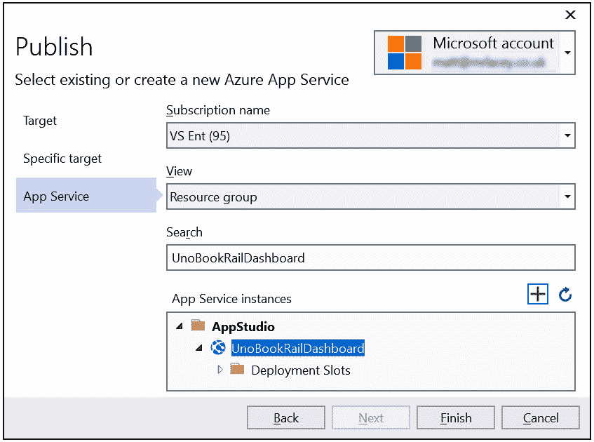
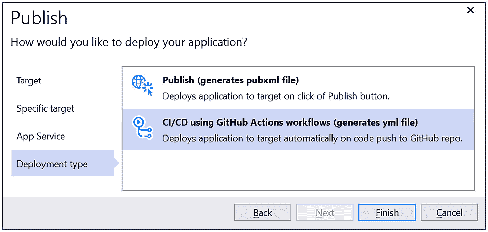

# 八、部署你的应用，并进一步开发

这一章结束了我们对 Uno 平台的介绍，但在我们结束之前还有很多内容需要介绍。 你已经知道 Uno 平台允许创建在多个环境中运行的应用。 这不仅适用于新的应用。 Uno 平台的一大吸引力在于，它可以让开发者在新的环境中运行现有的应用。 因为它是在 UWP 和 WinUI 上构建的，Uno 平台为您提供了一种很好的方式，可以将现有的应用在新的环境中运行。

在本章中，我们将涵盖以下主题:

*   带上**Xamarin。 form**apps to WebAssembly
*   部署 Wasm Uno 平台应用到 web
*   将应用部署到商店
*   参与 Uno 平台社区

在本章结束时，您将知道如何部署您的应用，并且您将对您的 Uno 平台旅程中的后续步骤有信心。

# 技术要求

本章假设您已经设置了开发环境，包括安装项目模板。 这在第 1 章[](02.html# _idTextAnchor015)*、*介绍 Uno 平台*中已经介绍过。*

 *本章还将使用在[*第 6 章*](08.html# _idTextAnchor098)、*中创建的源代码在图表中显示数据并使用自定义 2D 图形*。 您可以在以下网址获取:[https://github.com/PacktPublishing/Creating-Cross-Platform-C-Sharp-Applications-with-Uno-Platform/tree/main/Chapter06](https://github.com/PacktPublishing/Creating-Cross-Platform-C-Sharp-Applications-with-Uno-Platform/tree/main/Chapter06)。

查看下面的视频来查看代码的运行:[https://bit.ly/3xDJDwT](https://bit.ly/3xDJDwT)

# 带 Xamarin。 表单应用到 WebAssembly

如果你在中使用。net，并且之前已经创建了一个移动(iOS 和/或 Android)应用，那么你可能已经使用了**Xamarin。 形式**。 如果你的手机应用使用了**Xamarin。 你现在想在 WebAssembly 上运行的窗体**，你可能会担心重写代码是合理的，但事实并非如此。

**Xamarin。 表单**可以创建 UWP 应用。 Uno 平台允许 UWP 应用在其他平台上运行。 因此，可以使用 Xamarin 的**UWP app。 窗体**，并将其作为输入传递给 Uno 平台，用于创建 Wasm 应用。幸运的是，为了简单起见，所有项目输入和输出的连接都由一个提供的模板负责。

提示

也可以在 Xamarin 应用中使用Uno 平台控件。这样做很简单，有一个指南说明如何做，网址如下:[https://platform.uno/docs/articles/howto-use-uno-in-xamarin-forms.html](https://platform.uno/docs/articles/howto-use-uno-in-xamarin-forms.html)。

展示由**Xamarin 创建的 UWP 应用。 Uno 平台可以使用窗体**来创建 Wasm 应用，让我们创建一个新的**Xamarin。 创建**app，使用 Uno 添加 Wasm 头。 当然，您可以对现有的**Xamarin 进行同样的操作。 form**app，但是*只有当它有一个 UWP 头*。 如果您有**Xamarin。 窗体**应用没有一个 UWP 头，你需要添加一个之前，你可以创建一个 Wasm 头:

1.  在**Visual Studio**中，使用**Mobile App (Xamarin.Forms)**项目模板创建一个新项目。
2.  将项目(和解决方案)命名为**UnoXfDemo**。 当然，您可以使用不同的名称，但是您需要相应地调整所有后续引用。
3.  勾选**将解决方案和项目放在同一个目录**框中。
4.  Select the **Blank** template option and be sure to check the option to say you plan to develop for **Windows (UWP)**.

    为了简单起见，我们将使用空白应用模板。 大多数**Xamarin。 形式**-特定的内容应该很好。 但是，建议您在流程的早期进行测试，以确定自定义 UI 或第三方控件可能遇到的任何问题。

5.  在**Solution Explorer**中的**Solution node**上右键单击，选择**Open in Terminal**。
6.  The **Developer PowerShell** windows will open in the directory of the solution. In it, type the following:

    ```cs
    dotnet new -i Uno.ProjectTemplates.Dotnet::*
    ```

    这将确保您安装了最新版本的模板。

7.  Now type the following:

    ```cs
    dotnet new wasmxfhead
    ```

    这将向解决方案中添加新项目。

8.  在提示时选择**Reload**重新加载解决方案，您将看到**UnoXfDemo。 Wasm**作为新项目内部的解决方案。
9.  降级**Xamarin 的所有引用。 form**为版本**5.0.0.1931**，因为这是 Uno 项目支持的最新版本。
10.  Add a reference to the **Xamarin.Forms** package in the Wasm project, as follows:

    ```cs
    Install-Package Xamarin.Forms -Version 5.0.0.1931
    ```

    请注意**Xamarin 的所有版本。 从解决方案中的项目中引用的表单**应该是相同的，而且它们还必须与**Uno.Xamarin.Forms.Platform**包支持的版本匹配。 如果不这样做，您将得到一个错误，解释引用的不同版本以及如何处理它们。

11.  更新 Wasm 项目使用的**Uno.Xamarin.Forms.Platform**版本到**5.0.0-uno。 1799**。 这是为了确保与**Xamarin 版本**5.0**的兼容性。 形式**，在撰写本文时，在模板的最新版本中被引用。
12.  设置**UnoXfDemo。 Wasm**项目作为启动项目，开始调试。 您将看到类似于图 8.1 的内容:


图 8.1 -默认的(空白)Xamarin。 窗体应用运行通过 WebAssembly

当然，您可以继续开发应用，添加或更改特性或功能，然后将最新版本部署到 WebAssembly，就像解决方案中的任何其他项目一样。

现在，我们已经看到使用 Uno 平台获得**Xamarin 是多么简单。 窗体**应用运行作为一个 Wasm 应用。

重要提示

除了能够服用现有的**Xamarin。 form**app，并让它与 Uno 平台一起工作，也可以采用现有的 UWP 应用，并将其转换为使用 Uno 平台的其他操作系统。 Uno 平台团队已经发布了关于如何做到这一点的官方指南，网址如下:[https://platform.uno/docs/articles/howto-migrate-existing-code.html](https://platform.uno/docs/articles/howto-migrate-existing-code.html)。

在你创建了你的应用的 Wasm版本之后(不管它是否从**Xamarin 开始。 窗体**应用或不)，你会想让它在网上，以便其他人可以使用它。 现在我们来看看 that。

# 部署 Wasm Uno 平台应用到 web

创建一个 Wasm 应用并让它在您的机器上本地运行是一个令人兴奋的步骤，它展示了 Uno 平台的力量和潜力。 然而，在您的机器上本地运行会使其他人很难使用它。 你需要做的是将应用托管到每个人都能访问的地方。

托管基于。net 的 web 应用最流行的选择可能是在 Azure 上。 你可以在任何地方托管你的应用，并且这个过程对于所有的服务都是非常相似的，因为不需要服务器端处理。 假设 Azure 是您可能希望托管应用的地方，现在让我们看看这是如何实现的。 如果你以前从未部署过 web 应用或使用过 Azure，这可能会让你望而生畏，但你会发现这是多么容易，没什么好害怕的。

免费试用 Azure

如果你还没有 Azure 账户，你可以通过访问以下网址[https://azure.microsoft.com/free/](https://azure.microsoft.com/free/)注册免费试用。

,而不是创建一个新的应用完全显示它被部署,让我们用我们创建的应用[*第六章*](08.html# _idTextAnchor098),*显示数据与自定义图表和 2 d 图形*:

1.  打开之前创建的**仪表盘**应用(或从[https://github.com/PacktPublishing/Creating-Cross-Platform-C-Sharp-Applications-with-Uno-Platform/tree/main/Chapter06](https://github.com/PacktPublishing/Creating-Cross-Platform-C-Sharp-Applications-with-Uno-Platform/tree/main/Chapter06)下载版本)。
2.  右键单击**WASM**项目，选择**Publish…**。
3.  你会看到有很多地方你可以发布你的应用，但因为我们想要发布应用到 Azure，选择**Azure**选项，然后点击**Next**。
4.  For the specific target, we'll select the **Azure App Service (Windows)** option, although you could use any of the other options.

    重要提示

    静态 Web 应用是另一种适合托管 Wasm 应用的方式。参见[https://azure.microsoft.com/services/app-service/static/](https://azure.microsoft.com/services/app-service/static/)了解更多细节。

5.  如果你还没有这样做，登录到你的 Azure 链接帐户。
6.  我们将创建一个新的应用服务来托管应用，因此点击**的**加号**来创建一个 Azure 应用服务**。
7.  应用的默认名称将自动分配。 因为这将被用作子域，应用将可用，这必须是唯一的。 默认名称将基于当前日期和时间在项目名称后附加一个数字。 如果您愿意，您可以更改这一点，但是如果您指定的值不是唯一的，您将看到一个警告，说明该名称不可用，您必须选择另一个名称。
8.  如果你有多个订阅链接到你的帐户，选择一个你想使用这个应用。
9.  Select or create new resource groups and hosting plans. For demonstration purposes, you can use a **Free** hosting plan for now. If the needs of your app mean this is insufficient, you can change this in the future.

    重要提示

    当你继续免费试用和在生产中应用,是至关重要的,你完全理解和收费行为选择的选项配置为您的 web 应用,这将避免任何意想不到的指控你的信用卡,或一个关键应用被禁用时失去信用。 您和您的应用的适当设置将取决于您的应用和个人需求的。 账单选项的详细信息可以在以下网址找到:[https://azure.microsoft.com/pricing/details/app-service/windows/](https://azure.microsoft.com/pricing/details/app-service/windows/)。

10.  点击**创建**按钮，服务将为您创建。 这可能需要几秒钟，并且在此过程中屏幕的角落将显示一条消息。
11.  You'll now see something like *Figure 8.2*. This shows I've used the name **UnoBookRailDashboard**, so the app will be available at the following URL: [https://unobookraildashboard.azurewebsites.net/](https://unobookraildashboard.azurewebsites.net/). Now click **Finish**, and the app will be built ready for deployment:

    

    图 8.2 - Azure Publish 对话框准备发布应用

12.  现在你已经设置好了你的 web 应用，你就可以发布应用了。点击窗口右上角的**publish**按钮。

它可能需要一到两分钟，但最终，浏览器会打开一个新标签，你的应用在 Azure 上运行。 这应该看起来类似于图 8.3:


图 8.3 -在 Azure 上运行的仪表盘应用

如果你没有在 Azure 上托管你的应用，你可以通过搜索如何部署一个**Blazor**应用来找到有用的指导，因为过程很可能是类似的。 最终，一个基于 Uno平台的 WebAssembly 应用都是静态文件，可以部署到任何能够承载静态内容的服务器上。

从 Visual Studio 发布很方便。 然而，就创建跟踪的、可重复的过程而言，这是不可取的。 理想情况下，您应该设置一个自动化流程来部署应用。接下来我们将关注的是**持续集成和**(**CI/CD**)流程。

# 自动化构建、测试和分发

理想情况下，您将使用一个自动化的流程来构建、测试和部署您的应用，而不是依赖于手动完成所有这些工作，因为手动流程更容易出错。

这就是 CI/CD 过程至关重要的地方。 由于我们刚刚将 Wasm 应用手动部署到 Azure 上，让我们从自动化这个过程开始。 幸运的是，Visual Studio 工具使它变得简单。

如果您在源代码控制库中执行**Publish**向导，在创建 web 应用之后，您将看到一个额外的步骤(如图*图 8.4*所示)。 这可以用来创建一个带有为你配置的工作流的**YAML**文件:



图 8.4 -通过 publish 向导创建一个 GitHub 动作来发布你的 Wasm 应用

生成的文件只需要进行一次修改，就可以考虑到 Uno Platform 模板使用的解决方案结构。 工作目录需要更改为**Dashboard\Dashboard。 Wasm**。

一旦你完成了的任何更改并将推送到 GitHub，代码将被自动构建和部署。

你可以看到一个 GitHub Actions 工作流文件的例子，它部署了一个基于 Uno 平台的 Wasm 应用，网址如下:[https://github.com/mrlacey/UnoWasmGithubActions/blob/main/.github/workflows/UnoWasmGithubActions.yml](https://github.com/mrlacey/UnoWasmGithubActions/blob/main/.github/workflows/UnoWasmGithubActions.yml)。

GitHub 不是你可以存储代码的唯一地方，GitHub Actions 也不是唯一的 CI/CD 管道选项。 对于使用。net 的开发人员来说，Azure DevOps(以前是 Visual Studio Online)是一个流行的解决方案。

Nick Randolph 为 Uno 平台的应用创建了一个基于 Azure devops 的构建管道的全面指南，网址如下:[https://nicksnettravels.builttoroam.com/uno-complete-pipeline/](https://nicksnettravels.builttoroam.com/uno-complete-pipeline/)。

Lance McCarthy 还创建了一个示例存储库，它展示了多个 Azure DevOps 构建管道与一个托管在 GitHub 上的存储库一起使用。 如果您需要做类似的事情，这可以作为一个有用的参考，可以在以下 URL 找到:[https://github.com/LanceMcCarthy/UnoPlatformDevOps](https://github.com/LanceMcCarthy/UnoPlatformDevOps)。

由于 Uno 平台允许你创建的平台数量，以及你可以构建和部署这些应用的各种方式，提供所有场景的演练是不现实的。 幸运的是，因为 Uno 平台是建立在其他知名技术之上的，这些其他技术的构建过程与你构建基于 Uno 平台的应用的过程是相同的。 例如，因为 Android、iOS 和 macOS 应用是在 Xamarin 之上构建的，构建和部署过程可能与直接使用 Xamarin 构建一样。

本节首先介绍了如何部署使用 Uno 构建的基于 wasm 的应用版本。 这并不是你唯一需要部署应用的地方。应用商店可能是你至少需要部署部分应用的地方，所以我们接下来就来看看它们。

# 将应用部署到应用商店

假设您正在构建一个公共应用。 在这种情况下，您可能需要通过该操作系统的适当应用商店部署它。 应用商店应用于 Uno 平台的规则、策略和限制与应用于其他工具集的规则、策略和限制是一样的。

每个商店的政策可以经常改变(通常，每年至少改变几次)，而且相当长。 因此，我们认为在这里复制它们没有任何价值。 相反，应该查看以下列表中的官方文档:

*   **Windows Store**(用于 UWP):[https://docs.microsoft.com/windows/uwp/publish/](https://docs.microsoft.com/windows/uwp/publish/)
*   **谷歌 Play Store**(针对 Android):[https://support.google.com/googleplay/android-developer# topic=3450769](https://support.google.com/googleplay/android-developer# topic=3450769 )
*   **iOS App Store**:[https://developer.apple.com/ios/submit/](https://developer.apple.com/ios/submit/)
*   **macOS App Store**:[https://developer.apple.com/macos/submit/](https://developer.apple.com/macos/submit/)

发布 unobase 应用的过程和发布其他应用的过程是一样的。你需要为你想要部署的每个商店创建一个开发者账户，然后根据需要将相关文件、软件包和捆绑包上传到商店。

由于 Android、iOS 和 Mac 应用都是基于特定平台的 Xamarin 技术构建的，你可能还会发现它们的发布相关文档很有用:

*   **谷歌 Play Store**:[https://docs.microsoft.com/xamarin/android/deploy-test/publishing/publishing-to-google-play/](https://docs.microsoft.com/xamarin/android/deploy-test/publishing/publishing-to-google-play/)
*   **iOS App Store**:[https://docs.microsoft.com/xamarin/ios/deploy-test/app-distribution/app-store-distribution/publishing-to-the-app-store](https://docs.microsoft.com/xamarin/ios/deploy-test/app-distribution/app-store-distribution/publishing-to-the-app-store)
*   **macOS App Store**:[https://docs.microsoft.com/xamarin/mac/deploy-test/publishing-to-the-app-store/](https://docs.microsoft.com/xamarin/mac/deploy-test/publishing-to-the-app-store/)

前面的链接指向每个商店的一般信息。 如果您遇到任何特定的 uno 相关问题，有一个大型社区准备帮助您。

# 参与 Uno 平台社区

Uno 平台是一个开源项目，这也是它吸引许多人的原因之一。 与许多开源项目一样，核心团队帮助领导贡献者社区。 它是一个广泛的社区，你可以从中获取信息、帮助并成为其中的一员。

## 信息来源

除了这本书(很明显!)之外，获取信息的中心是官网，网址是[https://platform.uno/](https://platform.uno/)。 在这个网站上，你可以找到文档、指南、示例和博客。 订阅博客是跟踪所有未来公告的好方法，通过以下 URL 跟随官方 Twitter 账户:[https://twitter.com/unoplatform](https://twitter.com/unoplatform)。

官方网站还包括超出本书范围的主题信息，如使用 Uno 平台针对 Windows 7 或 Linux(见[https://platform.uno/uno-platform-for-linux/](https://platform.uno/uno-platform-for-linux/))。

它的官方网站充满了信息，但你可能想在你的应用中实现这么多功能和事情，你会到达一个点，你需要回答一些问题。

## 帮助来源

有四个地方你可以去来寻求与 Uno 平台有关的帮助:

*   堆栈溢出
*   不和
*   GitHub
*   专业支持

**Stack Overflow**是互联网上的软件开发相关问答库。 这是你第一次询问如何使用 Uno 平台的问题。 你会发现许多核心团队和定期贡献者在那里回答的问题。 确保您的问题被标记为**uno-platform**，并在以下 URL:[https://stackoverflow.com/questions/tagged/uno-platform](https://stackoverflow.com/questions/tagged/uno-platform)询问。

如何寻求帮助

和大多数事情一样，当你付出更多的努力时，你会得到更多。 这也适用于寻求帮助。 如果你不熟悉它，堆栈溢出有一个指导问问题在以下网址:[https://stackoverflow.com/help/how-to-ask](https://stackoverflow.com/help/how-to-ask)。

寻求帮助的背后有两个基本原则。 首先，记住你是在寻求帮助，而不是让别人帮你做事。 其次，让别人更容易地帮助你，可以增加他们帮助你的可能性。

一个好的求助请求包括所有且仅包括提供答案所需的必要的具体信息。 对问题或代码的模糊描述比提供您所尝试的细节或简单的、最小的重现问题的方法更没有帮助。

如果你的问题与 Uno 平台内部有关，或者你正在使用最新的预览版本，你最好不要在**Discord**上提问。 **UWP 社区**服务器有一个**单一平台**渠道，其中包括大量热情的社区成员和核心团队成员。 您可以访问以下网址:[https://discord.com/invite/eBHZSKG](https://discord.com/invite/eBHZSKG)加入该网站。

使用 Uno 平台，就像使用任何开源项目的一样，需要承担一定程度的责任。 开源软件是一个集体过程，每个人都在努力使每个人都能拥有更好的软件。 这意味着，即使您自己无法修复它，您也会报告一个 bug。 如果你认为你在平台、样本或文档中发现了一个 bug，你应该在 GitHub 上通过以下 URL:[https://github.com/unoplatform/uno/issues/new/choose](https://github.com/unoplatform/uno/issues/new/choose)提交一个问题。 与请求帮助一样，您应该提供尽可能多的适当信息，包括重现问题的最小方式，以便您发现的问题能够更容易地重现和修复。 确保提供所有请求的信息，因为这有助于快速解决问题，而不会浪费精力，也不需要人们询问更多信息。

最后，如果你需要及时解决一个问题，或者你有比Stack Overflow 或 Discord 更深层的支持需求，**Uno 平台背后的公司也可以提供**专业的付费支持。 请访问[https://platform.uno/contact](https://platform.uno/contact)讨论您的需求。

## 贡献

有一个常见的误解，认为对开源项目的贡献意味着添加代码，但与任何软件项目一样，要获得成功和有价值的东西，涉及的事情远不止代码。 当然，如果您想帮助贡献代码，我们将热烈欢迎您。 通过查看标记为**良好第一期**的问题开始，并在以下 URL 查看贡献指南:[https://platform.uno/docs/articles/uno-development/contributing-intro.html](https://platform.uno/docs/articles/uno-development/contributing-intro.html)。 但是记住，你可以做很多其他的事情。

它是 cliché，但无论大小，所有东西都有帮助。 分享你的经历是你能做的最简单但也是最有价值的事情之一。 这可以提供一个正式的操作指南或代码示例。 或者，它可能像回答某人的问题一样简单，他想知道如何做你已经做过的事情。

无论是大的还是小的，我们都期待着你的贡献。

# 总结

在本章中，我们讨论了不同的领域来完善你对 Uno 平台的介绍。 您已经看到了 Uno 平台如何扩展现有的**Xamarin。 form**app，使其可以通过 WebAssembly 运行。 您看到了如何将应用的 Wasm 版本部署到 Azure。 我们研究了持续集成和部署。 你看到了如何进一步学习，我们也看到了如何与 Uno 平台的开发者社区互动。

至此，这本书就到此结束了。 如果你已经完成了每一章，你现在将有知识和信心使用 Uno 平台来构建运行在多个操作系统上的应用。 我们期待看到您的作品。

感谢你的阅读!*