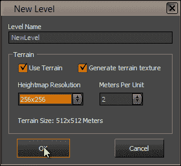
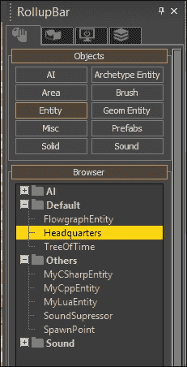
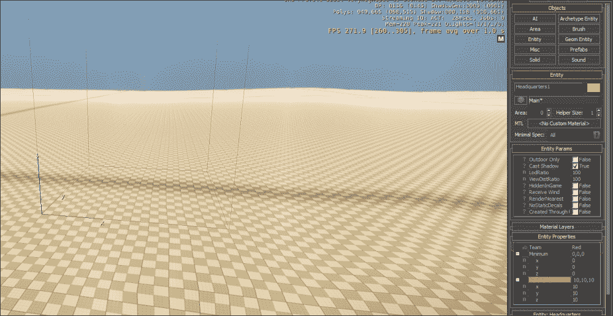
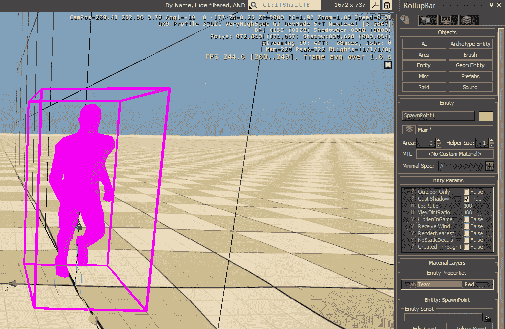

# 第四章。 游戏规则

角色和实体是游戏的组成部分，但游戏规则是将它们联系在一起的。 游戏规则系统管理所有初始玩家事件，如 OnConnect、OnDisconnect 和 OnEnteredGame。

使用游戏规则系统，我们可以创建自定义游戏流来控制并将我们的游戏玩法机制结合在一起。

在本章中，我们将:

*   学习游戏模式的基本概念
*   用 c++创建我们的`IGameRules`实现
*   用 Lua 和 c#编写游戏规则脚本

# 游戏规则介绍

当我们想到一款游戏时，我们通常会将自己的想法引向游戏机制，如死亡处理和游戏结束条件。 根据我们在前几章学到的，由于每个实体和参与者都不影响一个更大的计划，我们无法真正实现这一点。

游戏规则就像其名称所暗示的那样; 控制游戏规则。 规则可以是简单的，比如一个参与者射击另一个参与者时发生的规则，也可以是更复杂的，比如开始和结束回合。

《CryENGINE》的游戏规则执行围绕着两种听起来非常相似但却非常不同的类型:

*   **游戏规则**:这个实现是通过 c++中的`IGameRules`接口完成的，它处理像`OnClientConnect`和`OnClientDisconnect`这样的回调。
*   **游戏模式**:这依赖于游戏规则的实现，但扩展了游戏条件，如演员产卵和杀死条件。 例如，我们可以有两种游戏模式; 单人模式和死亡模式，它们都依赖于`IGameRules`实现提供的默认行为，但每一个都添加了额外的功能，比如支持多玩家。

## IGameRules 界面-游戏规则

在第三章、*创建和使用自定义实体*的末尾，我们学习了游戏对象扩展。 我们将在本章中使用这些知识来实现`IGameRules`，这是一款游戏对象扩展，用于初始化游戏环境并将玩法机制联系在一起。

### 注意事项

始终记住当前激活的游戏模式是一个实体。 请求实体事件有时会滥用这一点。 例如，在 Crytek 游戏《孤岛危机》(Crysis)中，一个常见的破解方法就是在游戏模式中发送子弹或杀死事件。 这基本上“杀死”了游戏规则实体，并导致硬服务器崩溃。

`IGameRules`执行通常负责游戏模式的最基本行为，并将其他所有内容转发给它的 c#或 Lua 脚本。

## 脚本-游戏模式

在注册我们的`IGameRules`实现后，我们需要注册使用它的游戏模式。 这个是通过`IGameRulesSystem::RegisterGameRules`函数完成的(通常在`IGame::Init`内部完成)。

```cs
pGameRulesSystem->RegisterGameRules("MyGameMode", "GameRules");
```

在处理了前面的片段后，游戏规则系统将知道我们的游戏模式。 当控制台变量`sv_gamerules`被更改为`MyGameMode`时，系统将创建一个新的实体，并激活其游戏对象扩展`GameRules`(在前一节中注册)。

### 注意事项

控制台变量`sv_gamerules`在 CryENGINE 启动时设置为`sv_gamerulesdefault`的值，除非运行在专用服务器上。

此时，游戏会自动在`Scripts/GameRules/`中搜索以你的游戏模式命名的 Lua 脚本。 对于前一个代码片段，它将找到并加载`Scripts/GameRules/MyGameMode.lua`。

通过使用脚本，游戏规则实现可以将游戏事件(如新玩家连接)转发到 Lua 或 c#，允许每个游戏模式根据其内部逻辑进行特定行为。

## 加载关卡

当使用地图控制台命令加载一个关卡时，游戏框架将在`Game/Levels`内搜索该关卡。

通过使用`IGameRulesSystem::AddGameRulesLevelLocation`，我们可以在`Game/Levels`中添加子目录，这些子目录将在寻找新的级别时被搜索。 例如:

```cs
gEnv->pGameFramework->GetIGameRulesSystem()->AddGameRulesLevelLocation("MyGameMode", "MGM_Levels");
```

当加载一个将`sv_gamerules`设置为`MyGameMode`的关卡时，游戏框架现在会在`Levels/MGM_Levels/`目录中搜索关卡目录。

这允许特定游戏模式的关卡被移动到`Game/Levels`目录下的子目录中，从而更容易根据游戏模式对关卡进行排序。

# 执行游戏规则界面

现在我们知道了游戏规则系统的基本工作原理，我们可以尝试创建一个自定义`IGameRules`实现。

### 注意事项

在我们开始之前，考虑一下你是否真的需要为你的游戏定制`IGameRules`实现。 与`CGameRules`一同发行的默认 GameDLL 是专门针对**第一人称射击**(**FPS**)的`IGameRules`实现。 如果你的游戏前提类似于 FPS，或者如果你可以重用现有功能，那就比从头编写实现更好。

首先，我们需要创建两个新文件; 完成后，打开`GameRules.cpp`和`GameRules.h`并创建一个新类。 我们将我们的命名为`CGameRules`。

下课后，我们要从`IGameRules`衍生出来。 正如我们之前提到的，游戏规则是作为游戏对象扩展来处理的。 因此，我们必须使用`CGameObjectExtensionHelper`模板类:

```cs
class CGameRules 
  : public CGameObjectExtensionHelper<CGameRules, IGameRules>
  {
  };
```

第三个可选参数`CGameObjectExtensionHelper`定义了这个游戏对象支持多少 RMIs。 我们将在[第八章](08.html "Chapter 8. Multiplayer and Networking")，*多人游戏和网络*中进一步讨论。

有了类，我们可以开始实现`IGameRules`和`IGameObjectExtension`结构中定义的所有纯虚方法。 与实体一样，我们可以实现不返回任何东西、nullptr、zero、false 或空字符串的假人。 需要分别处理的方法如下:

<colgroup><col style="text-align: left"> <col style="text-align: left"></colgroup> 
| 

函数名

 | 

描述

 |
| --- | --- |
| 【t】【t】 | 用于初始化游戏对象扩展。 应该拨打`IGameRulesSystem::SetCurrentGameRules(this)` |
| 【t】【t】 | 当一个新的客户端连接时在服务器上调用，必须使用`IActorSystem::CreateActor`创建一个新的参与者 |
| 【t】【t】 | 当客户端断开连接时在服务器上调用，必须包含对`IActorSystem::RemoveActor`的调用 |
| 【t】【t】 | `Release`函数应该删除扩展实例，并通过其析构函数调用`IGameRulesSystem::SetCurrentGameRules(nullptr)` |

## 注册游戏对象扩展

完成后，使用`REGISTER_FACTORY`宏注册游戏规则实现。

游戏对象扩展必须在游戏初始化过程的早期注册，因此最常在`IGame::Init`函数中完成(通过默认的 GameDLL 中的`GameFactory.cpp`):

```cs
  REGISTER_FACTORY(pFramework, "GameRules", CGameRules, false);
```

## 创建自定义游戏模式

要开始，我们需要注册我们的第一个游戏模式。

### 注意事项

请注意《T0》执行方式与游戏模式本身的区别。 游戏模式依赖于`IGameRules`实现，单独注册。

要注册自定义游戏模式，CryENGINE 暴露了`IGameRulesSystem::RegisterGameRules`功能:

```cs
  gEnv->pGameFramework->GetIGameRulesSystem()->RegisterGameRules("MyGameMode", "GameRules");

```

前面的代码将创建一个名为`MyGameMode`的游戏模式，它依赖于我们之前注册的`GameRules`游戏对象扩展。

当加载一个将`sv_gamerules`设置为`MyGameMode`的地图时，将创建游戏规则实体并分配名称`MyGameMode`。 在产卵之后，我们之前创建的`IGameRules`扩展将被构建。

### 注意事项

如果您只是创建一个现有游戏模式的副本或子类，例如，派生自`SinglePlayer.lua`的默认`DeathMatch.lua`脚本，则需要分别注册`DeathMatch`游戏模式。

# 脚本

游戏模式(T0)是典型的脚本导向，游戏流程(如产卵、杀戮和复活)被委托给 Lua 或 c#等第二语言。

## Lua 脚本

由于 Lua 脚本已经集成到 CryENGINE 中，所以我们不需要做任何额外的加载工作。 要访问脚本表(基于与`Game/Scripts/GameRules`中的游戏模式同名的 Lua 文件):

```cs
  m_script = GetEntity()->GetScriptTable();
```

### 调用方法

要调用脚本表中的方法，请参见`IScriptSystem BeginCall`和`EndCall`函数:

```cs
  IScriptSystem *pScriptSystem = gEnv->pScriptSystem;

  pScriptSystem->BeginCall(m_script, "MyMethod");
  pScriptSystem->EndCall();
```

在执行前面的代码时，我们将能够在游戏模式脚本表中包含的名为`MyMethod`的函数中执行 Lua 代码。 该表格的示例如下:

```cs
  MyGameMode = { }

  function MyGameMode:MyMethod()
  end
```

### 调用带参数的方法

要为 Lua方法提供参数，请在脚本调用的开始和结束之间使用`IScriptSystem::PushFuncParam`:

```cs
  pScriptSystem->BeginCall(m_script, name);
  pScriptSystem->PushFuncParam("myStringParameter");
  pScriptSystem->EndCall();
```

### 注意事项

`IScriptSystem::PushFuncParam`是一个模板函数，它试图用所提供的值创建一个`ScriptAnyValue`对象。 如果默认的`ScriptAnyValue`构造函数不支持您的类型，则会出现编译器错误。

恭喜你，你现在已经调用了一个带有字符串参数的 Lua 函数:

```cs
  function MyGameMode:MyMethod(stringParam)
  end
```

### 获取 Lua 返回的值

您还可以通过向`IScriptSystem::EndCall`传递一个附加参数来从 Lua 函数中获得返回值。

```cs
  int result = 0;
  pScriptSystem->EndCall(&result);
  CryLog("MyMethod returned %i!", result);
```

### 获取表值

有时可能需要直接从 Lua 表中获取值，这可以使用`IScriptTable::GetValue`:

```cs
  bool bValue = false;
  m_script->GetValue("bMyBool", &bValue);
```

前面的代码将在脚本中搜索名为`bMyBool`的变量，如果搜索成功，将其值设置为本机`bValue`变量。

## CryMono 脚本

要在你的`IGameObjectExtension::Init`实现中创建一个 CryMono 脚本的实例，请参见`IMonoScriptSystem::InstantiateScript`:

```cs
  IMonoObjaect *pScript = GetMonoScriptSystem()->InstantiateScript(GetEntity()->GetClass()->GetName(), eScriptFlag_GameRules);
```

这段代码将找到一个带有当前游戏模式名称的 CryMono 类，并返回它的一个新实例。

### 注意事项

没有必要同时使用 Lua 和 CryMono 游戏规则脚本。 决定哪个最适合您的用例。

### 调用方法

现在有了类实例，您可以使用`IMonoObject::CallMethod`助手调用其中一个函数:

```cs
  m_pScript->CallMethod("OnClientConnect", channelId, isReset, playerName)
```

这段代码将搜索带有匹配参数的名为`OnClientConnect`的方法，并调用它:

```cs
  public bool OnClientConnect(int channelId, bool isReset = false, string playerName = "")
  {
  }
```

### 返回值

`IMonoObject::CallMethod`默认返回一个`mono::object`类型，它表示一个框化的管理对象。 为了获得原生值，我们必须将其拆开:

```cs
  mono::object result = m_pScript->CallMethod("OnClientConnect", channelId, isReset, playerName);

  IMonoObject *pResult = *result;
  bool result = pResult->Unbox<bool>();
```

### 属性

要获取管理对象中的属性的值，查看`IMonoObject::GetPropertyValue`:

```cs
  mono::object propertyValue = m_pScript->GetPropertyValue("MyFloatProperty");

  if(propertyValue)
  {
    IMonoObject *pObject = *propertyValue;

    float value = pObject->Unbox<float>();
  }
```

也可以直接设置属性值:

```cs
  float myValue = 5.5f;

  mono::object boxedValue = GetMonoScriptSystem()->GetActiveDomain()->BoxAnyValue(MonoAnyValue(myValue));

  m_pScript->SetPropertyValue("MyFloatProperty", boxedValue);
```

### 字段

也可以用与属性相同的方法获取和设置字段的值，但是要使用`IMonoObject`方法`GetFieldValue`和`SetFieldValue`。

# 用 c#创建一个基本的游戏模式

既然我们已经具备了创建迷你游戏所需的基本知识，为什么不这么做呢? 首先，我们的目标是创建一个非常基本的系统产卵演员和实体。

## 定义我们的意图

首先，让我们明确一下到底想做什么:

1.  引发我们的演员。
2.  把我们的演员分配到两个可能的小组之一。
3.  检查一个角色何时进入对方团队的`Headquarters`实体，并结束它。

## 创造演员

我们需要做的第一件事是衍生我们的 actor，这在我们有一个 actor 之前是不能做的。 要做到这一点，我们需要在`Game/Scripts`目录的某处创建一个`MyActor.cs`文件，然后添加以下代码:

```cs
  public class MyActor : Actor 
  {
  }
```

这个代码片段是参与者注册所需的最低要求。

我们还应该更新我们的 actor 视图，以确保玩家在进入游戏时能够看到一些内容。

```cs
  protected override void UpdateView(ref ViewParams viewParams)
  {
    var fov = MathHelpers.DegreesToRadians(60);

    viewParams.FieldOfView = fov;
    viewParams.Position = Position;
    viewParams.Rotation = Rotation;
  }
```

之前的代码只是将摄像机设置为使用玩家实体的位置和旋转，视场为 60。

### 注意事项

要了解更多关于创建 actor 和视图的信息，请参考[第 5 章](05.html "Chapter 5. Creating Custom Actors")、*创建自定义 actor*。

现在我们有了我们的演员，我们可以继续创建游戏模式:

```cs
  public class ReachTheHeadquarters : CryEngine.GameRules
  {
  }
```

与所有在`Game/Scripts/`目录中找到的 CryMono 类型一样，我们的游戏模式将在 CryENGINE 启动时自动注册，在调用`IGameFramework::Init`后不久。

在开始创建游戏特定逻辑之前，我们必须确保我们的 actor 在 actor 连接时被创建。 为此，我们实现了一个`OnClientConnect`方法:

```cs
  public bool OnClientConnect(int channelId, bool isReset = false,  string playerName = "Dude")
  {
    // Only the server can create actors.
    if (!Game.IsServer)
      return false;

    var actor = Actor.Create<MyActor>(channelId, playerName);
    if (actor == null)
    {
      Debug.LogWarning("Failed to create the player.");
      return false;
    }

    return true;
  }
```

然而，由于脚本函数不是自动执行的，我们需要修改`IGameRules`实现的`OnClientConnect`方法，以确保我们在 c#中接收到这个回调:

```cs
  bool CGameRules::OnClientConnect(int channelId, bool isReset)
  {
  const char *playerName;
  if (gEnv->bServer && gEnv->bMultiplayer)
  {
    if (INetChannel *pNetChannel = gEnv->pGameFramework->GetNetChannel(channelId))
      playerName = pNetChannel->GetNickname();
  }
    else
      playerName = "Dude";

  return m_pScript->CallMethod("OnClientConnect", channelId, isReset, playerName) != 0;
  }
```

现在，当一个新玩家连接到服务器时，我们的`IGameRules`实现将调用`ReachTheHeadquarters.OnClientConnect`，从而创建一个类型为`MyActor`的新参与者。

### 注意事项

请记住，游戏模式的`OnClientConnect`会在很早就被调用，就在新客户机连接到服务器的时候。 如果在`OnClientConnect`退出后没有为指定的`channelId`创建一个 actor，游戏将抛出一个致命错误。

## 产生演员

当客户端连接时，actor 将被创建，但是如何将 actor 重新定位到一个**产卵点**呢? 首先，在`Scripts`目录的某处创建一个新的`SpawnPoint.cs`文件:

```cs
  [Entity(Category = "Others", EditorHelper = "Editor/Objects/spawnpointhelper.cgf")]
  public class SpawnPoint : Entity
  {
    public void Spawn(EntityBase otherEntity)
    {
      otherEntity.Position = this.Position;
      otherEntity.Rotation = this.Rotation;
    }
}
```

重新启动编辑器后，该实体现在应该出现在**RollupBar**中。 我们将调用`spawnPoint.Spawn`函数来衍生我们的 actor。

首先，我们需要打开我们的`ReachTheHeadquarters`类并添加一个新的`OnClientEnteredGame`函数:

```cs
  public void OnClientEnteredGame(int channelId, EntityId playerId, bool reset)
  {
    var player = Actor.Get<MyActor>(channelId);
    if (player == null)
    {
      Debug.LogWarning("Failed to get player");
      return;
    }
    var random = new Random();

 // Get all spawned entities off type SpawnPoint
    var spawnPoints = Entity.GetByClass<SpawnPoint>();

// Get a random spawpoint
    var spawnPoint = spawnPoints.ElementAt(random.Next(spawnPoints.Count()));
    if(spawnPoint != null)
    {
     // Found one! Spawn the player here.
      spawnPoint.Spawn(player);
    }
  }
```

这个函数将在客户端进入游戏时被调用。 在发射模式下这通常发生在当玩家完成加载,而在编辑叫做当玩家切换到**纯游戏模式后***Ctrl*+*G*。

在当前状态下，将首先获得玩家的`MyActor`实例，然后在随机选择的`SpawnPoint`生成。

### 注意事项

不要忘记从`IGameRules`实现中调用脚本的`OnClientEnteredGame`函数!

## 处理断开

我们还必须确保在玩家断开连接时移除 actor:

```cs
  public override void OnClientDisconnect(int channelId)
  {
    Actor.Remove(channelId);
  }
```

不要忘记从您的`IGameRules`实现中调用`OnClientConnect`函数!

### 注意事项

断开连接后无法移除玩家将导致角色继续存在于游戏世界中，并且由于关联的玩家不再与服务器连接，可能会出现更严重的问题。

## 将玩家分配到一个团队中

现在玩家可以连接和刷出，让我们实现一个基本的团队系统来跟踪每个玩家属于哪个团队。

首先，让我们添加一个新的`Teams`属性到我们的游戏模式:

```cs
  public virtual IEnumerable<string> Teams
  {
    get
    {
      return new string[] { "Red", "Blue" };
    }
  }
```

这段代码只是决定我们的游戏模式允许哪些团队，在我们的例子中是`Red`和`Blue`。

现在，让我们再向`MyActor`类中添加一个新属性，以确定 actor 属于哪个团队:

```cs
  public string Team { get; set; }
```

太棒了! 然而，我们还需要将相同的片段添加到`SpawnPoint`实体中，以避免产生同一团队的玩家。

完成此操作后，打开`ReachTheHeadquarters`游戏模式类并导航到我们之前创建的`OnClientEnteredGame`函数。 我们想要做的是扩展`SpawnPoint`选择，只使用属于玩家团队的选择。

看看下面的片段:

```cs
// Get all spawned entities of type SpawnPoint
  var spawnPoints = Entity.GetByClass<SpawnPoint>(); 

```

现在，将这个代码段替换为下面的代码段:

```cs
// Get all spawned entities of type SpawnPoint belonging to the players team
  var spawnPoints = Entity.GetByClass<SpawnPoint>().Where(x => x.Team == player.Team);
```

这将自动删除所有的刷出点，其中`Team`属性不等于玩家的。

但是等等，我们还需要将玩家分配到一个团队中! 为此，在获得刷出点之前添加以下内容:

```cs
  player.Team = Teams.ElementAt(random.Next(Teams.Count()));
```

当玩家进入游戏时，我们将随机选择一个团队分配给他们。 如果你想的话，为什么不扩展一下以确保团队总是平衡的呢? 例如，不要让新玩家加入已经比蓝色多两名玩家的红色队伍。

### 注意事项

在继续之前，请随意使用当前设置。 你应该能够在游戏中产卵!

## 实施总部

最后，让我们继续创造我们的最终游戏条件; 总部。 简单地说，每个团队将有一个`Headquarters`实体，当一名玩家进入对方团队总部时，该玩家所在的团队将赢得游戏。

### 添加游戏结束事件

在创建`Headquarters`实体之前，让我们在`ReachTheHeadquarters`类中添加一个新的`EndGame`函数:

```cs
  public void EndGame(string winningTeam)
  {
    Debug.LogAlways("{0} won the game!", winningTeam);
  }
```

我们将在`Headquarters`实体中调用它，以便通知游戏模式游戏应该结束了。

### 创建总部实体

现在，我们需要创建`Headquarters`实体(参见下面的代码片段)。 实体将通过沙盒被放置在每个关卡中，每个团队一次。 我们将公开三个 Editor 属性; `Team`、`Minimum`、`Maximum`:

*   `Team`:这决定`Headquarters`实例属于哪个团队，在本例中是 Blue 还是 Red
*   `Minimum`:指定触发器区域的最小大小
*   `Maximum`:指定触发器区域的最大大小

```cs
  public class Headquarters : Entity
  {
    public override void OnSpawn()
    {
      TriggerBounds = new BoundingBox(Minimum, Maximum);
    }

    protected override void OnEnterArea(EntityId entityId, int areaId, EntityId areaEntityId)
    {
    }

    [EditorProperty]
    public string Team { get; set; }

    [EditorProperty]
    public Vec3 Minimum { get; set; }

    [EditorProperty]
    public Vec3 Maximum { get; set; }
  }
```

太棒了! 现在我们只需要扩展`OnEnterArea`方法，在游戏结束时通知我们的游戏模式:

```cs
  protected override void OnEnterArea(EntityId entityId, int areaId, EntityId areaEntityId)
  {
    var actor = Actor.Get<MyActor>(entityId);
    if (actor == null)
      return;

    if (actor.Team != Team)
    {
      var gameMode = CryEngine.GameRules.Current;
      var rthGameRules = gameMode as ReachTheHeadquarters;

      if (rthGameRules != null)
        rthGameRules.EndGame(actor.Team);
    }
  }
```

`Headquarters`实体现在会在敌方团队的实体进入时通知游戏模式。

#### 绕行-触发边界和实体区域

实体可以通过注册区域来接收区域回调。 这可以通过将实体链接到形状实体或手动创建触发器代理来实现。 在 c#中，您可以通过设置`EntityBase.TriggerBounds`属性来手动创建代理，就像我们在前面的代码片段中所做的那样。

当一个实体被放置在区域内或靠近区域时，它将开始接收该实体上的事件。 这使得游戏能够创造出能够追踪玩家何时何地进入特定区域的特定实体，从而触发特定的游戏逻辑。

下表列出了可用的区域回调，在 c++中通过实体事件和 c#`Entity`类中的虚拟函数接收:

<colgroup><col style="text-align: left"> <col style="text-align: left"></colgroup> 
| 

回调的名字

 | 

描述

 |
| --- | --- |
| `OnEnterArea` | 当实体进入与此实体链接的区域时调用 |
| `OnLeaveArea` | 当与此实体相连的区域内的实体离开时触发 |
| `OnEnterNearArea` | 当实体移动到与该实体相连的区域附近时触发 |
| `OnMoveNearArea` | 当实体移动到与此实体相连的区域附近时调用 |
| `OnLeaveNearArea` | 当实体离开与此实体相连的区域附近的区域时调用 |
| `OnMoveInsideArea` | 当实体在链接到该实体的区域内被重新定位时触发 |

## 填充关卡

基本的示例现在已经完成，但是需要一些调整才能使它工作! 首先，我们需要为每个团队创建一个新关卡并放置`Headquarters`。

首先，打开沙盒编辑器，通过导航到**文件**|**新**创建一个新关卡:



这会弹出**新关卡**对话框，我们可以在其中设置关卡名称和地形设置。

点击**OK**后，你的关卡将被创建并加载。 一旦完成，是时候开始添加必要的玩法元素到我们的关卡!

首先，打开**RollupBar**，将**总部**实体拖到视口中生成:



一旦生成，我们必须设置在**Headquarters**类中创建的 Editor 属性。

将**Team**to**Red**and**Maximum**to**10,10,10**。 这将告知团队`Headquarters`所属的类别，以及我们将查询的区域的最大大小，以检测是否有其他玩家进入该区域。



完成此操作后，生成另一个**总部**实体(或复制现有实体)，并遵循相同的过程，只是这次将**团队**属性设置为**Blue**。

现在，我们只需要为每个团队刷出一个刷出点实体，我们就可以开始了! 再次打开**RollupBar**，转到**Others**|**spawpoint**:


现在，将实体拖到视口中以生成它，就像生成**总部**一样。 生成后，将**Team**属性设置为**Red**，然后对 Blue Team 重复上述过程:



完成了! 你应该现在可以进入游戏使用*Ctrl*+*G*或**游戏导航**|【显示】切换到游戏。 然而，因为我们没有添加任何类型的玩家移动，玩家将不能导航到敌人的总部结束游戏。

要了解如何处理玩家的输入和移动，请参考下一章[第 5 章](05.html "Chapter 5. Creating Custom Actors")，*创建自定义演员*。

# 总结

在本章中，我们学习了游戏规则系统的基本行为，并创建了我们自己的`IGameRules`实现。

在注册了自己的游戏模式，并用 c#创建了`Headquarters`样本之后，你应该对游戏规则系统有了很好的理解。

我们已经创建了我们的第一个游戏模式，现在可以进入下一个章节了。 记住在未来章节中游戏规则的目的，这样你就可以将所有需要在游戏中创建的游戏机制联系在一起。

对游戏规则还不满意? 为什么不尝试着用你自己选择的脚本语言为你的游戏创造一个基本规则集，或者扩展我们之前创造的样本。 在下一章中，我们将看到如何创建自定义参与者。