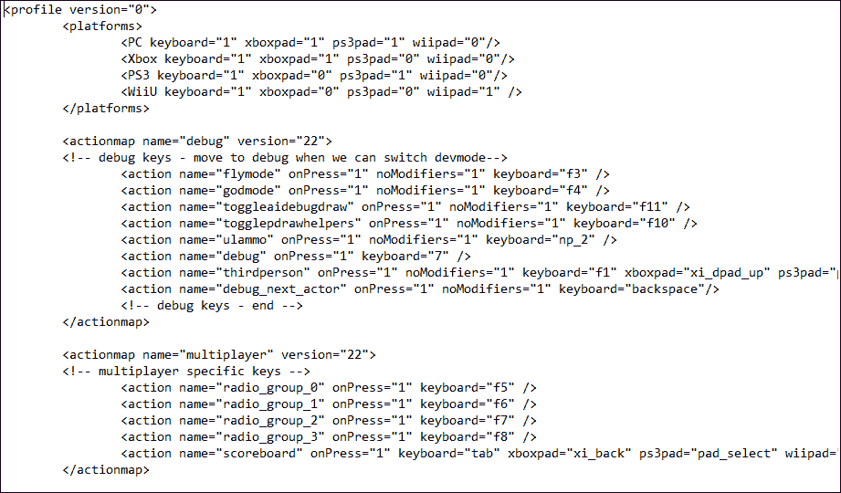
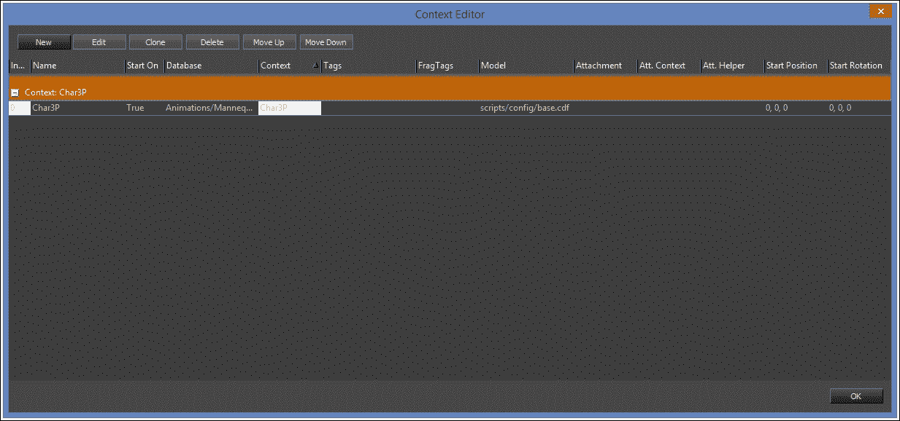
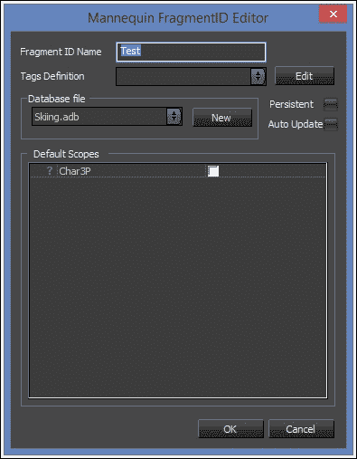
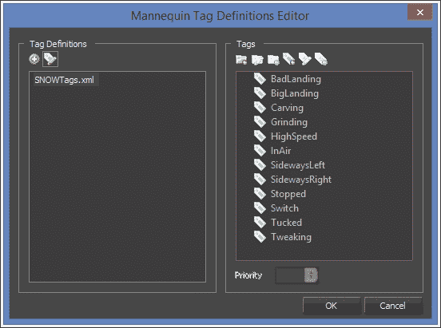
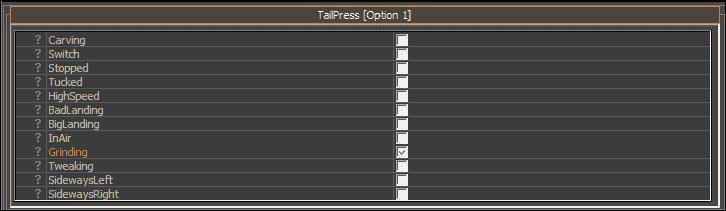
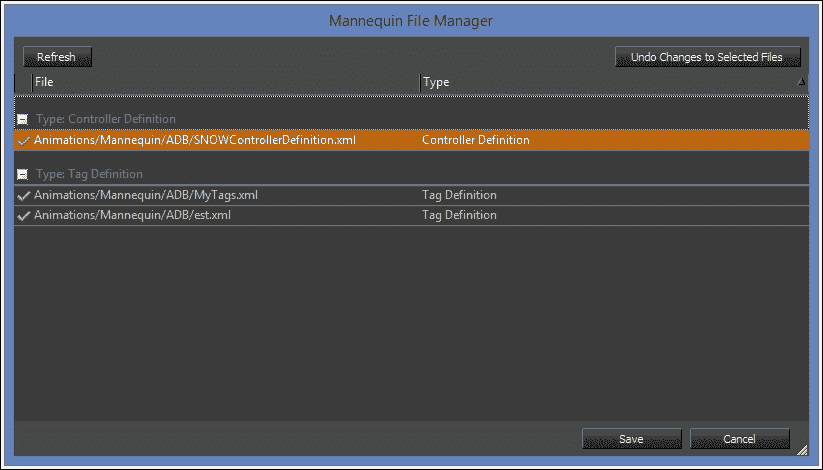

# 五、创建自定义角色

使用 CryENGINE 角色系统，我们可以创建具有自定义行为的玩家或 ai 控制实体来填充我们的游戏世界。

在本章中，我们将涵盖以下主题:

*   学习参与者的目的和执行他们背后的核心思想
*   用 c++和 C# 创建自定义角色
*   创建我们的第一个玩家相机处理程序
*   执行基本的玩家移动

# 演员制度介绍

我们在[第 3 章](03.html "Chapter 3. Creating and Utilizing Custom Entities")、*创建和利用自定义实体*中了解了什么是游戏对象扩展，以及如何使用它们。 我们将以此知识为基础，在 c++和 C# 中创建一个自定义角色。

参与者是由`IActor`结构表示的，他们是核心中的游戏对象扩展。 这意味着每个参与者都有一个支持实体，以及一个处理网络和`IActor`扩展的游戏对象。

参与者由`IActorSystem`接口处理，该接口管理每个参与者的创建、删除和注册。

## 信道标识符

在网络环境中，每个玩家都被分配一个频道 ID 和一个 Net Nub 索引，我们将在[第 8 章](08.html "Chapter 8. Multiplayer and Networking")、*多人游戏和网络*中进一步讨论。

## 演员产卵

当客户端连接到游戏时，玩家角色应该在`IGameRules::OnClientConnect`中生成。 要产生一个演员，使用`IActorSystem::CreateActor`如下所示:

```cs
IActorSystem *pAS = gEnv->pGameFramework->GetIActorSystem();

pAS ->CreateActor(channelId, "MyPlayerName", "MyCppActor", Vec3(0, 0, 0), Quat(IDENTITY), Vec3(1, 1, 1));
```

### 注意事项

注意，前面的代码只适用于玩家控制的角色。 可以在任何时候创建非玩家角色。

### 移除演员

为了确保玩家角色在客户端断开连接时被正确地移除，我们需要通过`IGameRules::OnClientDisconnect`回调手动移除它:

```cs
pActorSystem->RemoveActor(myActorEntityId);
```

忘记在断开连接后删除玩家角色可能会导致崩溃或严重的工件。

## 视图系统

为了方便玩家和其他相机源处理视图的需要，CryENGINE 提供了视图系统，通过`IViewSystem`接口访问。

视图系统的基础是拥有任意数量的视图，由`IView`接口表示，每个视图都具有更新视图摄像机的位置、方向和配置(如视场)的能力。

### 注意事项

请记住，在任何时间点上只能有一个视图是活动的。

可以使用`IViewSystem::CreateView`方法创建新的视图，如下所示:

```cs
IViewSystem *pViewSystem = gEnv->pGame->GetIGameFramework()->GetIViewSystem();

IView *pNewView = pViewSystem->CreateView();
```

然后我们可以使用`IViewSystem::SetActiveView`函数设置活动视图:

```cs
pViewSystem_>SetActiveView(pNewView);
```

一旦激活，视图将为每一帧更新系统摄像头。 要修改视图的参数，可以调用`IView::SetCurrentParams`。 例如，要更改位置，请使用以下代码片段:

```cs
SViewParams viewParams = *GetCurrentParams();
viewParams.position = Vec3(0, 0, 10);
SetCurrentParams(viewParams);
```

视图的当前位置现在将是(0,0,10)。

### 将视图链接到游戏对象

每个视图还可以将自己链接到一个游戏对象，允许其游戏对象扩展订阅`UpdateView`和`PostUpdateView`函数。

这些功能允许每个帧的位置、方向和分配视图的配置很容易更新。 例如，这用于演员，以提供一种可访问的方式，为每个玩家创建自定义摄像机处理。

有关相机处理的更多信息，请参阅本章后面的*相机处理*一节。

# 创建自定义参与者

现在我们知道了角色系统是如何工作的，我们可以继续用 C# 和 c++创建第一个角色。

### 注意事项

默认情况下，不可能纯粹使用 Lua 脚本创建角色。 通常，actor 是用 c++创建的，并处理包含在`Game/Scripts/Entities/Actors`文件夹中的 Lua 脚本的自定义回调。

## 在 C# 中创建 actor

使用 CryMono，我们可以完全在 C# 中创建自定义角色。 为此，我们可以从`Actor`类派生，如下所示:

```cs
public class MyActor : Actor
{
}
```

前面的代码是在 CryMono 中创建 actor 的最小值。 然后，您可以导航到您的游戏规则实现，并在客户机通过`Actor.Create`静态方法连接时生成 actor。

### CryMono 类层次结构

如果你发现自己被各种 CryMono/ C# 类搞糊涂了，看看下面的继承图:


### 注意事项

注意在使用`Entity.Get`(或通过`Actor.Get`查询参与者)查询实体时，您将得到一个类型为`EntityBase`或`ActorBase`的对象。 这是因为本机实体和参与者存在于托管系统之外，并且在查询时返回有限的表示。

### 使用本地和 CryMono 演员一起

如果您更喜欢在 c++中创建您自己的 actor，您仍然可以使用`NativeActor`类在 CryMono 代码中引用它。 要做到这一点，只需在 C# 中使用注册`IActor`实现时使用的名称创建一个新类，并从`NativeActor`派生，如下所示:

#### c++ actor 注册

演员注册是使用注册工厂完成的。 这个过程可以使用`REGISTER_FACTORY`宏实现自动化，如下所示:

```cs
REGISTER_FACTORY(pFramework, "Player", CPlayer, false);
```

#### C# 声明

在 C# 中声明一个 native-base actor 非常简单，只需要从`CryEngine.NativeActor`类派生，如下代码所示:

```cs
public class Player : NativeActor
{
}
```

这允许仍然使用 C# 代码，但将大部分代码保留在 c++`IActor`实现中。

### 注意事项

`CryEngine.NativeActor`直接从`CryEngine.ActorBase`派生，因此不包含常见的`CryEngine.Actor`回调，如 OnEditorReset。 要获得这个额外的功能，您需要在您的`IActor`实现中创建它。

## 在 c++中创建 actor

要在 c++中创建一个 actor，我们依赖于`IActor`接口。 由于 actor 是核心中的游戏对象扩展，我们不能简单地从`IActor`派生，而是必须使用`CGameObjectExtensionHelper`模板，如下代码所示:

```cs
class CMyCppActor
  : public CGameObjectExtensionHelper<CMyCppActor, IActor>
{
};
```

### 注意事项

第三个`CGameObjectExtensionHelper`参数定义了这个游戏对象支持的 RMI(远程机器调用)的最大数量。 我们将在[第八章](08.html "Chapter 8. Multiplayer and Networking")，*多人游戏和网络*中进一步讨论。

现在我们有了这个类，我们需要实现在`IActor`结构中定义的纯虚方法。

### 注意事项

请注意，`IActor`源自`IGameObjectExtension`，这意味着我们还需要实现其纯虚方法。 相关信息请参见[第四章](04.html "Chapter 4. Game Rules")、*游戏规则*中的*实现游戏规则界面*部分。

对于大多数`IActor`方法，我们可以实现不返回任何内容的假值，或者一个假值，如 nullptr、0 或一个空字符串。 例外情况如下表所示:

<colgroup><col style="text-align: left"> <col style="text-align: left"></colgroup> 
| 

函数名

 | 

描述

 |
| --- | --- |
| `IGameObjectExtension::Init` | 用于初始化游戏对象扩展。 应该调用`IGameObjectExtension::SetGameObject`和`IActorSystem::AddActor`。 |
| 类的析构函数 | 应该总是调用`IActorSystem::RemoveActor`。 |
| `IActor::IsPlayer` | 用于确定演员是否由人类演员控制。 我们可以在这里简单地返回`GetChannelId() != 0`，因为只有玩家的通道标识符是非零的。 |
| `IActor::GetActorClassName` | 调用以获取 actor 类的名称，例如，在我们的案例`CMyCppActor`中。 |
| `IActor::GetEntityClassName` | 帮助函数来获取实体类的名称。 我们可以简单地返回`GetEntity()->GetClass()->GetName()`。 |

解决纯虚函数之后，继续下一节以注册 actor。 完成之后，您可以在`IGameRules::OnClientConnect`中创建用于连接玩家的 actor。

### 注册演员

要将 actor 注册到游戏框架中(包含在`CryAction.dll`中)，我们可以使用与在`GameFactory.cpp`中注册 c++游戏规则实现时相同的设置:

```cs
REGISTER_FACTORY(pFramework, "MyCppActor", CMyCppActor, false);
```

在前面的代码执行之后，您将能够通过`IActorSystem::CreateActor`函数生成您的 actor。

# 相机处理

玩家控制的角色通过`IActor::UpdateView(SViewParams &viewParams)`和`IActor::PostUpdateView(SViewParams &viewParams)`功能管理视口摄像机。

结构体用于定义摄像机的属性，如位置、旋转和视场。 通过修改`UpdateView`方法中的`viewParams`引用，我们可以将摄像机移动到游戏所需的位置。

### 注意事项

CryMono actor 以与 c++ actor 相同的方式接收和处理`UpdateView(ref ViewParams viewParams)`和`PostUpdateView(ref ViewParams viewParams)`事件。

## 实现 IGameObjectView

为了获得视图事件，我们需要实现并注册一个游戏对象视图。 为此，从`IGameObjectView`派生开始，并实现它包含的两个纯虚函数:

*   `UpdateView`:这被称为更新视图位置、旋转和视野
*   `PostUpdateView`:在更新视图之后调用

在实现游戏对象视图后，我们需要确保当 actor 扩展被初始化(在 Init 中)时捕获它:

```cs
if(!GetGameObject()->CaptureView(this))
  return false;
```

你的 actor 现在应该接收视图更新回调，它可以用来移动视口摄像机。 别忘了在析构函数中释放视图:

```cs
GetGameObject()->ReleaseView(this);
```

## 制作自顶向下的相机

为了展示如何创建自定义相机，我们将扩展上一章中创建的示例，添加一个自定义自顶向下视图相机。 这个想法很简单，就是从上面看人物，从远处跟着它的动作。

首先，打开您的 C# actor 的`UpdateView`方法，或者在`.cs`源文件中实现它。

### 视图旋转

为了使视图面位于玩家的顶部，我们将使用玩家旋转的第二列以获得向上的方向。

### 注意事项

四元数代表了玩家的旋转方式，允许简单的插值和避免平衡锁。 您可以获得三个列表示每个四元数的方向:0(右)，1(前)和 2(上)。 这是非常有用的，例如，获得一个面向玩家前进方向的矢量。

除非自上一个函数以来对 actor`UpdateView`函数做了任何更改，否则它应该类似以下代码片段:

```cs
protected override void UpdateView(ref ViewParams viewParams)
{
  var fov = MathHelpers.DegreesToRadians(60);

  viewParams.FieldOfView = fov;
  viewParams.Position = Position;
  viewParams.Rotation = Rotation
}
```

这只是将视角摄像机置于与玩家完全相同的位置，具有相同的方向。 我们要做的第一个改变是将摄像机向上移动一点。

为此，我们将简单地将玩家旋转的第二列添加到它的位置上，并将摄像机放置在与玩家相同的 x 和 y 位置，但略高于它:

```cs
var playerRotation = Rotation;

float distanceFromPlayer = 5;
var upDir = playerRotation.Column2;

viewParams.Position = Position + upDir * distanceFromPlayer;
```

你可以自由地进入游戏并进行检查。 当你准备好了，我们还需要改变视图旋转，让它向下看:

```cs
// Face straight down
var angles = new Vec3(MathHelpers.DegreesToRadians(-90), 0, 0);

//Convert to Quaternion
viewParams.Rotation = Quat.CreateRotationXYZ(angles);
```

完成了! 我们的相机现在应该正对着下面。


这大概是你用新相机应该看到的。

注意中缺少一个玩家角色。 这是因为我们还没有将对象加载到玩家实体中。 我们可以通过调用`OnSpawn`函数中的`EntityBase.LoadObject`来快速解决这个问题:

```cs
public override void OnSpawn()
{
  // Load object
  LoadObject("Objects/default/primitive_cube.cgf");

  // Physicalize to weigh 50KG
  var physicalizationParams = new PhysicalizationParams(PhysicalizationType.Rigid);
  physicalizationParams.mass = 50;
  Physicalize(physicalizationParams);
}
```

你现在应该可以在场景中看到一个代表玩家角色的立方体。 请注意，它也是物理化的，允许它推动或被其他物理化对象推动。


现在你应该对玩家视图的功能有了基本的了解。 为了了解更多内容，为什么不尝试着创造自己的相机，也就是 rpg 风格的等距相机?

现在我们可以进入下一个部分:*玩家输入*。

# 玩家输入

当你无法控制演员时，他们往往会很无聊。 为了帮助将事件映射到输入，我们可以使用以下三个系统:

<colgroup><col style="text-align: left"> <col style="text-align: left"></colgroup> 
| 

系统名称

 | 

描述

 |
| --- | --- |
| IHardwareMouse | 当需要直接获取鼠标事件时使用，例如 x/y 屏幕位置和鼠标滚轮的变化。 |
| IActionMapManager | 允许注册链接到键绑定的回调。 这是键盘和鼠标按键输入的首选方法，因为它允许每个玩家通过他们的动作地图配置文件定制他们的首选输入。动作地图通常通过游戏内部界面公开，以便为最终用户简化按键映射。 |
| IInput | 用于侦听原始输入事件，例如，检测何时按下或释放空格键。除了聊天和文本输入等罕见的边缘情况外，不建议使用原始输入，相反，操作映射更可取。 |

## 硬件鼠标

硬件鼠标实现提供`IHardwareMouseEventListener`结构来允许接收鼠标事件回调。 在得到并实现其纯虚拟之后，使用`IHardwareMouse::AddListener`来利用它:

```cs
gEnv->pHardwareMouse->AddListener(this);
```

监听器通常从构造函数或初始化函数中调用。 确保不要注册两次侦听器，并始终在类析构函数中删除它们，以防止悬空指针。

## 动作地图

在前面的表格中简要提到，操作映射允许将键绑定到指定的操作。 用于简单地重新映射来自不同游戏状态的输入。 例如，如果你的游戏中有两种类型的车辆，你可能不希望两种车辆使用相同的钥匙。

动作映射还允许实时更改动作映射到的键。 这允许玩家自定义他们喜欢的输入法。

### 听动作地图事件

默认的动作映射配置文件包含在`Game/Libs/Config/defaultProfile.xml`中。 当游戏发布时，默认配置文件会被复制到用户的个人文件夹(通常是在`My Games/Game_Title`中)，用户可以修改该配置文件来重新映射按键，例如，改变哪个按键触发**屏幕截图**动作。



要侦听动作映射事件，我们首先必须在概要文件 xml 中创建一个新的动作，或者选择一个现有的动作并修改它。 对于本例，我们将使用现有的屏幕截图动作。

#### IActionListener

操作映射系统提供了`IActionListener`结构来支持为需要操作映射事件的类提供回调。

利用听者相对容易:

1.  派生自`IActorListener`结构。
2.  实现`OnAction`事件。
3.  注册你的听众:

    ```cs
    gEnv->pGameFramework->GetIActionMapManager()->AddExtraActionListener(this);
    ```

侦听器应该只注册一次，这就是为什么注册最好发生在构造函数或初始化函数中。

确保在销毁类实例时删除侦听器。

### 启用动作地图部分

动作地图系统允许在相同的配置文件中创建多个动作地图部分，让游戏代码能够实时切换不同的动作地图部分。 这对于具有多个玩家状态的游戏非常有用，如步行和使用车辆。 在这种情况下，车辆和行走动作地图将包含在不同的区域中，然后在退出或进入车辆时启用/禁用这些区域。

```cs
<actionmap name="walk" version="22">
  <action name="walkBack" onPress="1" keyboard="s" />
</actionmap>

<actionmap name="drive" version="22">
  <action name="break" onPress="1" keyboard="s" />
</actionmap>
```

要启用自定义动作映射，请调用`IActionMapManager::EnableActionMap`:

```cs
gEnv->pFramework->GetIActionMapManager()->EnableActionMap("walk", true);
```

这应该在玩家能够接收到这些新行动的准确时刻进行。 在前面的例子中，当玩家离开车辆时，启动“行走”动作。

# 动画人物

`IAnimatedCharacter`是一个游戏对象扩展，它允许对象的移动和物理整合。 通过使用它，角色可以请求物理移动请求，利用动画图形功能等等。

由于扩展是可选的，它可以被任何游戏物体激活，只要获得它的解释在[第 3 章](03.html "Chapter 3. Creating and Utilizing Custom Entities")，*创建和利用自定义实体*

```cs
m_pAnimatedCharacter = static_cast<IAnimatedCharacter*>(GetGameObject()->AcquireExtension("AnimatedCharacter"))
```

一旦获得，动画角色可以立即使用。

### 注意事项

动画角色功能，如移动请求需要 eEPE_OnPostStepImmediate 物理事件，可以通过`IGameObject::EnablePhysicsEvent`启用。

## 移动请求

当一个动画角色被具体化为一个有生命的实体时，它可以要求移动。 这本质上是一个 pe_action_move 物理请求的包装器(更多信息请参见[第 9 章](09.html "Chapter 9. Physics Programming")，*物理编程*)，以便更简单的使用。

在处理玩家移动等高级机制时，角色移动请求非常有用。

### 注意事项

注意要求移动和直接设置玩家位置之间的区别。 通过请求速度改变，我们能够让实体自然地对碰撞做出反应。

## 添加移动请求

要添加移动请求，使用`IAnimatedCharacter::AddMovement`，这需要一个`SCharacterMoveRequest`对象:

```cs
SCharacterMoveRequest request;

request.type = eCMT_Normal;
request.velocity = Vec3(1, 0, 0);
request.rotation = Quat(IDENTITY);

m_pAnimatedCharacter->AddMovement(request);
```

在前面的代码中看到的是一个非常基本的移动请求示例，它将在路线上无限期地向前(世界空间)设置目标(如果连续提交)。

### 注意事项

移动请求必须通过物理循环添加，参见通过`IGameObjectExtension::ProcessEvent`发送的 ENTITY_EVENT_PREPHYSICSUPDATE。

# 人体模型动画系统

在 CryENGINE 3.5 中引入的是高级的人体模型动画系统。 该系统的设计目标是将动画和游戏逻辑解耦，在 CryAnimation 模块和游戏代码之间有效地作为一个额外的层。

### 注意事项

记住，人体模型可以应用于任何实体，而不仅仅是演员。 然而，在默认情况下，Mannequin 被集成到`IAnimatedCharacter`扩展中，使演员更容易使用新的动画系统。

《人体模型》依赖于一组在使用前需要清楚了解的类型:

<colgroup><col style="text-align: left"> <col style="text-align: left"></colgroup> 
| 

的名字

 | 

描述

 |
| --- | --- |
| 片段 | 片段指的是一种状态，例如“着陆”。 每个片段可以指定多个图层上的多个动画，以及效果的选择。这使得同时处理第一人称和第三人称视图时的动画更加流畅。 对于这个问题，每个片段将包含一个全身动画，一个第一人称，然后是额外的声音，粒子和游戏玩法事件。 |
| 碎片 ID | 为了避免直接传递片段，我们可以通过片段 ID 来识别它们。 |
| 范围 | 范围允许解耦字符的部分，以保持处理，例如，上半身和下半身动画分开。在创建一个新的范围时，每个片段将能够添加额外的动画和效果到该范围，以扩展其行为。在《孤岛危机 3》中，第一人称和第三人称模式被声明为独立的范围，以便让相同的片段同时处理两种状态。 |
| 标签 | 标签是一种选择标准，允许根据激活的标签选择子片段。例如，如果我们有两个名为“Idle”的片段，但其中一个被分配到“Injured”标签上，我们就可以根据玩家是否受伤在这两个片段之间进行动态切换。 |
| 选项 | 如果我们最终得到多个共享相同标识符和标记的片段，那么我们就有多个选项。 默认行为是在查询片段时随机选择其中一个选项，有效地在实体动画中创建变化。 |

## 人体模型编辑器

**人体模型编辑器**用于通过沙盒编辑器实时调整角色动画和人体模型配置。

### 预览设置

人体编辑器**使用存储在`Animations/Mannequin/Preview`中的预览文件来加载默认的模型和动画数据库。 当启动**人体编辑器**时，我们需要通过选择**文件**|**加载预览设置**来加载预览设置。**

 **加载完成后，我们会看到预览设置的视觉效果，如下图所示:


我们的预览文件内容如下:

```cs
<MannequinPreview>
  <controllerDef filename="Animations/Mannequin/ADB/SNOWControllerDefinition.xml"/>
  <contexts>
    <contextData name="Char3P" enabled="1" database="Animations/Mannequin/ADB/Skiing.adb" context="Char3P" model="scripts/config/base.cdf"/>
  </contexts>
  <History StartTime="-4.3160208e+008" EndTime="-4.3160208e+008"/>
</MannequinPreview>
```

我们将在本章中进一步讨论等细节，如控制器定义、上下文数据等。

### 创建上下文

正如本章前面提到的，上下文可以根据角色状态应用不同的动画和效果。

我们可以通过**上下文编辑器**来创建和修改上下文，通过在**人体编辑器**中选择**文件**|**上下文编辑器**来访问。



要创建一个新的上下文，只需点击左上角的**新建**，就会打开**新建上下文**对话框，如下图所示:


这允许在创建上下文之前调整上下文，包括选择使用哪个动画数据库和模型。

完成后，只需单击**OK**查看创建的上下文。

### 创建片段

默认情况下，我们可以在**人体编辑器**的左上部分看到片段工具箱。 除了添加或编辑选项外，我们还将使用这个工具来创建和编辑片段。


在之前的截图中看到的片段工具箱与**后空翻**片段打开，暴露了两个选项。

要创建一个新片段，点击**new Id…**按钮，在新打开的消息框中键入想要的名称，然后点击**OK**。

你现在应该看到**人体模型 FragmentID 编辑器**对话框，如下截图所示:



现在我们可以选择这个片段应该运行在哪个范围中。 在本例中，我们只需要检查**Char3P**并单击**OK**。

你现在应该可以在 fragment 工具箱中看到你的 fragment:


#### 添加选项

有两种方法来添加新的选项到您的片段:

*   打开角色编辑器，选择你的动画，然后把它拖到你的人体模型片段上。
*   单击 Fragment 工具箱中的 New 按钮，并手动修改该选项。

### 创建和使用标签

如前所述，human 系统允许创建**Tags**，允许根据标签当前是否活动为每个片段选择特定的选项。

要创建 new 标签，请打开人体模型编辑器，并选择**文件->标签定义编辑器**:



打开后，您将看到**人体标签定义编辑器**。 编辑器提供了两个部分:**标签定义**和**标签**。

我们需要做的第一件事是创建一个**标签定义**。 这是一个跟踪一组标记的文件。 按下**标签定义**部分中的加号(*+*)符号，然后指定定义的名称。


太棒了! 现在您应该在**人体标签定义编辑器**中看到您的标签定义。 要创建一个新标记，选择**MyTags.xml**并单击标记创建图标(在**Tags**部分右起第三个)。

这将显示一个**标签创建**对话框，在这个对话框中，您只需要指定标签的名称。 当你完成后，点击**OK**，你应该立即看到**Tags**部分的标签(如下截图所示):


#### 添加标签到选项

现在你已经创建了你的自定义标签，我们可以在片段编辑器中选择任何片段选项，然后再往下看一点，找到标签工具箱:



当片段选项被选中时，通过简单地选择每个标记旁边的复选框，我们告诉动画系统，当指定的标记被激活时，该选项应该被优先排序。

### 储蓄

拯救**人体模型编辑器发生变化时,只需点击**文件**|**保存更改并验证您的更改在【显示】**人体模型文件管理器对话框出现的(见下面的截图):******

 **

当您准备保存时，只需单击**save**让系统更新文件。

## 开始片段

在 c++中，片段由`IAction`接口表示，如果需要的话，每个游戏都可以自由地实现或扩展接口。

通过调用`IActionController::Queue`函数来对片段进行排队，但在此之前，我们必须获得片段的`FragmentId`。

### 获取片段标识符

为了获得片段标识符，我们必须获得当前的动画上下文，以便获得当前的控制器定义，从中我们可以获得片段 ID:

```cs
SAnimationContext *pAnimContext = GetAnimatedCharacter()->GetAnimationContext();

FragmentID fragmentId = pAnimContext->controllerDef.m_fragmentIDs.Find(name);
CRY_ASSERT(fragmentId != FRAGMENT_ID_INVALID);
```

注意我们如何调用`IAnimatedCharacter::GetAnimationContext`。 正如本章前面提到的，动画角色扩展为我们实现了 Mannequin 功能。

### 排队片段

现在我们有了片段标识符，我们可以简单地创建一个我们选择使用的动作的新实例。 在我们的例子中，我们将使用通过`TAction`模板公开的默认的人体动作:

```cs
int priority = 0;
IActionPtr pAction = new TAction<SAnimationContext>(priority, id);
```

现在我们有了优先级为 0 的动作。 动画系统将比较排队动作的优先级，以确定应该使用哪个。 例如，如果两个操作同时排队，其中一个优先级为 0，另一个优先级为 1，那么第二个优先级为 1 的操作将首先被选中。

现在要将动作排队，只需调用`IActionController::Queue`:

```cs
IActionController *pActionController = GetAnimatedCharacter()->GetActionController();

pActionController->Queue(pAction);
```

## 设置标签

要在运行时启用标签，首先需要获取标签的标识符，如下所示:

```cs
SAnimationContext *pAnimationContext = pActionController->GetContext();

TagID tagId = pAnimationContext->state.GetDef().Find(name);
CRY_ASSERT(tagId != TAG_ID_INVALID);
```

现在我们只需调用`CTagState::Set`:

```cs
SAnimationContext *pAnimContext = pActionController->GetContext();

bool enable = true;
pAnimContext->state.Set(tagId, enable);
```

完成了! 我们的标签现在被激活了，并且将在动画系统中显示为激活。 如果您的操作被设置为动态更新，它将立即选择适当的选项。

### 强制执行请求选项

默认的`IAction`实现不会在更改标记时自动选择相关选项。 要改变这一点，我们需要创建一个新的类来派生它，并使用以下代码覆盖它的`Update`函数:

```cs
IAction::EStatus CUpdatedAction::Update(float timePassedSeconds)
{
  TBase::Update(timePassedSeconds);

  const IScope &rootScope = GetRootScope();
  if(rootScope.IsDifferent(m_fragmentID, m_fragTags))
  {
    SetFragment(m_fragmentID, m_fragTags);
  }

  return m_eStatus;
}
```

前面的代码所做的是检查何时有更好的选项可用，然后选择它。

## 调试模型

要启用人体模型调试，我们需要在动作控制器上添加`AC_DebugDraw`标志:

```cs
pActionController->SetFlag(AC_DebugDraw, g_pGameCVars->pl_debugMannequin != 0);
```

现在，您将看到可视化片段和标记选择调试信息。 这是非常有用的工作时，与假人。

## 设置自定义实体的人体模型

正如本章前面提到的，动画角色游戏对象扩展默认集成了 Mannequin。 在使用角色时，这是非常方便的，但在某些情况下，它可能与使用 Mannequin 为定制实体提供的功能有关。

首先，我们需要在实体扩展中存储指向动作控制器和动画上下文的指针，如下所示:

```cs
IActionController *m_pActionController;
SAnimationContext *m_pAnimationContext;
```

然后我们需要初始化 Mannequin; 这通常在游戏对象扩展的`PostInit`函数中完成。

### 初始化人体模型

要做的第一件事是获得人体模型接口:

```cs
// Mannequin Initialization
IMannequin &mannequinInterface = gEnv->pGame->GetIGameFramework()->GetMannequinInterface();
IAnimationDatabaseManager &animationDBManager = mannequinInterface.GetAnimationDatabaseManager();
```

### 加载控制器定义

接下来，我们有来加载我们为实体创建的控制器定义:

```cs
const SControllerDef *pControllerDef = animationDBManager.LoadControllerDef("Animations/Mannequin/ADB/myControllerDefinition.xml");
```

太棒了! 现在我们已经有了控制器定义，我们可以用以下代码创建动画上下文:

```cs
m_pAnimationContext = new SAnimationContext(*pControllerDef);
```

我们现在可以创建我们的动作控制器:

```cs
m_pActionController = mannequinInterface.CreateActionController(pEntity, *m_pAnimationContext);
```

### 设置活动上下文

现在已经初始化了动作控制器，接下来需要设置默认上下文。

首先，获取上下文标识符:

```cs
const TagID mainContextId = m_pAnimationContext->controllerDef.m_scopeContexts.Find("Char3P");

CRY_ASSERT(mainContextId != TAG_ID_INVALID);
```

然后加载我们将要使用的动画数据库:

```cs
const IAnimationDatabase *pAnimationDatabase = animationDBManager.Load("Animations/Mannequin/ADB/myAnimDB.adb");
```

加载完成后，只需调用`IActionController::SetScopeContext`:

```cs
m_pActionController->SetScopeContext(mainContextId, *pEntity, pCharacterInstance, pAnimationDatabase);
```

设置上下文之后，将初始化 Mannequin 并准备处理实体的排队片段。

记住，您可以在任何时候使用我们前面使用的`IActionController::SetScopeContext`函数更改范围上下文。

# 总结

在本章中，我们学习了角色系统如何在 C# 和 c++中运行并创建自定义角色。 通过查看输入和摄像机系统，我们将能够处理基本的玩家输入和视图设置。

您还应该很好地理解 Mannequin 的用例，以及如何设置定制实体以利用它们。

我们现在拥有游戏所需的所有核心功能:流节点、实体、游戏规则和角色。 在接下来的章节中，我们将建立在现有知识的基础上，并详细讨论如何将这些系统一起使用。

如果您想在继续之前继续处理 actor，请尝试并为新场景定制您自己的 actor; 例如，等距摄像机与基本 RPG 玩家元素相结合。

在下一章中，我们将使用 actor 学到的知识创建**人工智能**(**AI**)。****