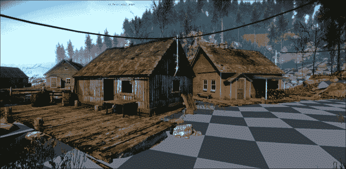

# 第九章。 物理编程

CryENGINE 物理系统是一个可扩展的物理实现，允许创建一个真正动态的世界。 有了相当大的 API，开发人员会发现在实现物理模拟时还有很多回旋余地。

在本章中，我们将:

*   学习物理系统的工作原理
*   了解如何调试物理化的几何图形
*   了解如何射线投射和相交原语发现接触点，地面正常，和更多
*   创建我们自己的实体
*   通过模拟爆炸让东西爆炸

# CryPhysics

物理实体系统面向物理实体的概念，这些概念可以通过`IPhysicalEntity`接口访问。 一个物理实体用一个物理代理来表示几何图形，这个物理代理可以影响或被交叉、碰撞和其他事件所影响。

虽然可以通过`IPhysicalWorld::CreatePhysicalEntity`函数创建没有底层实体(`IEntity`)的物理实体，但最常见的是调用`IEntity::Physicalize`来启用实体当前加载的模型的物理代理。

### 注意事项

物理代理是渲染网格的一个简化模型。 这是用来减少对物理系统的压力。

当调用`IEntity::Physicalize`时，将创建一个新的实体代理，它将通过调用`IPhysicalWorld::CreatePhysicalEntity`来处理其物理化表示。 CryENGINE 允许创建许多物理实体类型，这取决于物理化对象的用途。

## 物理实体类型

以下是 CryENGINE 目前实现的物理化实体的类型:

*   **PE_NONE**:当实体不应该被物理化时使用，或者当我们想要去物理化时传递给`IEntity::Physicalize`。 虽然没有物理化，实体将没有物理代理，因此不能与其他对象进行物理交互。
*   **PE_STATIC**:这告诉物理系统使用实体的物理代理，但不允许它通过物理交互被移动或旋转。
*   **PE_RIGID**:此将刚体类型应用于物体，允许外来物体碰撞并移动目标。
*   **PE_WHEELEDVEHICLE**:这是一种专用用于车辆。
*   **PE_LIVING**:用于生活的演员，用于需要地面对齐和地面接触查询的人类。
*   **PE_PARTICLE**:此物理化基于`SEntityPhysicalizeParams`中通过的粒子，用于避免快速移动的物体(如炮弹)的问题。
*   **pe_ 铰接**:用于由几个刚体通过关节连接而成的铰接结构，用于布娃娃等。
*   **PE_ROPE**:用于创建物理化的 rope对象，可以将两个物理实体绑在一起，或自由悬挂。 它也用于沙箱绳索工具。
*   **PE_SOFT**:这是一个连接顶点的集合，可以与环境交互，例如，布。

## 引入物理实体标识符

所有物理实体被分配唯一标识符，可以通过`IPhysicalWorld::GetPhysicalEntityId`检索，并通过`IPhysicalWorld::GetPhysicalEntityById`获取物理实体。

### 注意事项

将物理实体 ID 序列化为一种将数据与特定物理实体关联的方式，因此在重新加载之间应该保持一致。

### 绘制实体代理

我们可以利用`p_draw_helpers`CVar 中的来获得关卡中各种物理化对象的视觉反馈。

要绘制所有物理化的对象，只需将 CVar 设置为 1。


对于更复杂的用法，使用`p_draw_helpers [Entity_Types]_[Helper_Types]`。

例如，绘制地形代理几何体:

```cs
  p_draw_helpers t_g
```



#### 实体类型

以下是实体类型列表:

*   **t**:显示地形
*   **s**:显示静态实体
*   **r**:睡眠中的刚体
*   **R**:表示活动刚体
*   **l**:这是生物
*   **i**:表示独立实体
*   **g**:显示触发器
*   **a**:显示区域
*   **y**:这是`RayWorldIntersection`射线
*   **e**:这是爆炸遮挡图

#### 助手类型

以下是帮助器类型列表:

*   **g**:显示几何图形
*   **c**:此显示接触点
*   **b**:显示边框
*   **l**:用于易碎物体的四面体晶格
*   **j**:这显示了结构接头(将迫使半透明的主要几何形状)
*   **t(#)**:显示包围体积树到等级#
*   **f(#)**:只显示设置了位标志的几何图形(多个 f 的堆栈)

# 物理实体的动作、参数和状态

`IPhysicalEntity`接口提供了三种改变和获取实体物理状态的方法:

## 参数

物理实体参数决定几何的物理表示应该如何表现在世界上。 参数可通过`IPhysicalEntity::GetParams`功能检索，功能检索，通过`IPhysicalEntity::SetParams`功能设置。

所有参数都作为派生自`pe_params`的结构传递。 例如，要修改实体所受的重力，我们可以使用`pe_simulation_params`:

```cs
  pe_simulation_params simParams;

  simParams.gravity = Vec3(0, 0, -9.81f);
  GetEntity()->GetPhysics()->SetParams(&simParams);
```

这段代码将把应用于实体的引力改为-9.81f。

### 注意事项

大多数物理实体参数 struct 的默认构造函数将某些数据标记为未使用的; 这样我们就不必担心重写我们没有设置的参数。

## 动作

类似于参数的用法，动作允许开发者强制执行某些物理事件，如脉冲或重置实体速度。

所有操作都来自于`pe_action`结构，并且可以通过`IPhysicalEntity::Action`函数应用。

例如，要将一个简单的冲动应用到我们的实体中，并将其发射到空中，使用:

```cs
  pe_action_impulse impulseAction;
  impulseAction.impulse = Vec3(0, 0, 10);

  GetEntity()->GetPhysics()->Action(&impulseAction);
```

## 状态

还可以从实体获得各种状态数据，例如，确定其质心在哪里，或获得其速度。

所有的状态都来自于`pe_status`结构，并且可以通过`IPhysicalEntity::GetStatus`函数进行检索。

例如，要获取一个活生生的实体(如玩家)的速度，可以使用:

```cs
  pe_status_living livStat;
  GetEntity()->GetPhysics()->GetStatus(&livStat);

  Vec3 velocity = livStat.vel;
```

# 物理实体类型细节

默认的物理实体实现有许多参数、操作和状态。 我们列出了它们最常用的类型:

## 常用参数

*   **pe_params_pos**:用于设置物理实体的位置和方向。
*   **pe_params_bbox**:这允许强制实体的边界框为特定值，或者在与`GetParams`一起使用时查询它，以及查询交点。
*   **pe_params_outer_entity**:允许指定一个外部物理实体。 与外部实体的碰撞将被忽略，如果它们发生在它的边界框内。
*   **pe_simulation_params**:为兼容实体设置仿真参数。

## 常见动作

*   **pe_action_impulse**:将一次性冲动应用于实体。 【5】
*   **pe_action_add_constraint**:此用于在两个物理实体之间添加约束。 例如，可以使用忽略约束来让幽灵穿过墙壁。
*   **pe_action_set_velocity**:用强制物理实体的速度。

## 常见状态

*   **pe_status_pos**:请求实体或实体部件的当前转换
*   **pe_status_dynamics**:用于获取实体运动统计信息，如加速度、角加速度和速度

# 静态

用静态类型物理化实体会创建基本物理化实体类型，所有的扩展(如 rigid 或 living)都是从该类型派生的。

静态实体被具体化，但不会移动。 例如，如果一个球被扔向一个静态对象，它将反弹回来而不移动目标对象。

# 刚性

这是指受外力的影响，可以在世界上移动的基本物化实体。

如果我们用同样的例子，向一个刚体扔一个球将导致刚体被推开

# 轮式车辆

这代表一个轮式车辆，简单地说就是，实现是一个刚体，添加了车轮、刹车和 CryENGINE 等车辆功能。

## 唯一参数

*   **pe_params_car**:这是用来获取或设置车辆特定的参数，如 CryENGINE 功率、RPM 和齿轮数
*   **pe_params_wheel**:这是用于获取或设置特定于车辆车轮的参数，如摩擦、表面 ID 和阻尼

## 唯一状态

*   **pe_status_vehicle**:用于获得车辆统计，允许获得速度，当前档位等等
*   **pe_status_wheel**:获得一个特定车轮的状态，例如，接触法线、扭矩和表面 ID
*   **pe_status_vehicle_abilities**:允许检查特定转弯的最大可能速度

## 独特的动作

*   **pe_action_drive**:用于车辆事件，如刹车、踏板和齿轮开关。

# 生活

活实体实现是处理演员及其移动请求的专门设置。

生物有两种状态:在地上和在空中。 当玩家在地面上时，他们会被“粘”在地面上，直到尝试将其分离(通过施加显著的速度离开地面)。

### 注意事项

还记得第 5 章、*创建自定义演员*中的动画人物动作要求吗? 系统在内核中使用活实体`pe_action_move`请求。

## 唯一参数

*   **pe_player_dimensions**:这是用于设置与生物实体的静态属性相关的参数，例如 sizeCollider，以及它应该使用胶囊还是圆柱体作为碰撞几何体
*   **pe_player_dynamics**:用于设置与生物实体相关的动态参数，如惯性、重力、质量等

## 唯一状态

*   **pe_status_living**:获得当前的生物状态，包括时间飞行，速度，和地面正常状态
*   **pe_status_check_stance**:用于检查新维度是否会引起碰撞。 参数与 pe_player_dimensions 中的含义相同

## 独特的动作

*   **pe_action_move**:这是，用于提交实体的移动请求。

# 粒子

也可以使用粒子表示对象。 这种方法通常用于高速移动的物体，比如炮弹。 本质上，这意味着我们实体的物理表示只是一个二维平面。

## 唯一参数

*   **pe_params_particle**:用于设置粒子-的具体参数

# 铰接

铰接结构由几个刚体通过关节连接而成，例如布娃娃。 这种方法允许设置撕裂极限和更多。

## 唯一参数

*   **pe_params_joint**:在设置时创建两个刚体之间的关节，在与`GetParams`一起使用时查询现有关节。
*   **pe_params_articulated_body**:用于设置特定于关节类型的参数。

# 绳子

当您想要创建将多个物理对象绑在一起的绳索时，您应该使用绳索。 该系统允许绳索附着在动态或静态表面上。

## 唯一参数

*   **pe_params_rope**:这个用于改变或获取物理绳索参数

# 柔软

Soft 是一个非刚性连接的顶点系统，它可以与环境交互，例如，布对象。

## 唯一参数

*   **pe_params_softbody**:用于配置物理化的软体

## 独特的动作

*   **pe_action_attach_points**:这用于将软实体的一些顶点附加到另一个物理实体上

# Ray 世界路口

使用`IPhysicalWorld::RayWorldIntersection`函数，我们可以将光线从世界的一点投射到另一点，以检测到特定物体、表面类型、地面法线等。

`RayWorldIntersection`是相当容易使用，我们可以证明它! 首先，请看以下光线投射的例子:

```cs
  ray_hit hit;

  Vec3 origin = pEntity->GetWorldPos();
  Vec3 dir = Vec3(0, 0, -1);

  int numHits = gEnv->pPhysicalWorld->RayWorldIntersection(origin, dir, ent_static | ent_terrain, rwi_stop_at_pierceable | rwi_colltype_any, &hit, 1);
  if(numHits > 0)
  {
    // Hit something!
  }
```

## ray_hit 结构

变量`ray_hit hit`的引用被传递给`RayWorldIntersection`，在这里我们将能够检索关于射线击中的所有信息。

### 常用的成员变量

*   **float dist**:这是从原点(在本例中是实体的位置)到光线击中的地方的距离。
*   **IPhysicalEntity *pCollider**:这是指向光线碰撞的物理实体的指针。
*   **short surface_idx**:这是我们的射线碰撞的材质的表面类型的表面标识符(见`IMaterialManager::GetSurfaceType`获取其`ISurfaceType`指针)。
*   **Vec3 pt**:这是接触点，在世界坐标中。
*   **Vec3 n**:这是接触点的表面法线。
*   **ray_hit *next**:如果射线命中多次，则指向下一个`ray_hit`结构。 更多信息请参见*允许多射线命中*部分。

## 起源与方向

`RayWorldIntersection`函数的第一个和第二个参数定义了光线应该从哪里投射，以及在特定方向上的距离。

在我们的例子中，我们从实体的当前位置射出射线，向下一个单位。

## 对象类型和射线标志

注意在`dir`之后，我们如何将两种类型的标志传递给`RayWorldIntersection`函数。 这些指示了射线应该如何与物体相交，以及忽略哪些碰撞。

### 对象类型

对象类型参数期望基于`entity_query_flags`枚举的标志，用于确定我们希望让光线与哪些类型的对象碰撞。 如果射线与我们没有定义的对象类型发生碰撞，它将简单地忽略它并通过。

*   **ent_static**:表示静态对象
*   **ent_sleeping_rigid**:表示睡眠刚体
*   **ent_rigid**:表示活动刚体
*   **ent_living**:这指的是有生命的对象，例如玩家
*   **ent_independent**:表示独立的对象
*   **ent_terrain**:地形
*   **ent_all**:表示所有类型的对象

### 射线标志

射线标志参数基于`rwi_flags`enum，用于确定强制转换的行为方式。

## 允许多个射线命中

正如前面提到的，也可能允许射线多次击中物体。 为此，我们只需创建一个`ray_hit`数组，并将其连同命中次数一起传递给`RayWorldIntersection`函数:

```cs
  const int maxHits = 10;

  ray_hit rayHits[maxHits];
  int numHits = gEnv->pPhysicalWorld->RayWorldIntersection(origin, direction, ent_all, rwi_stop_at_pierceable, rayHits, maxHits);

  for(int i = 0; i < numHits; i++)
  {
    ray_hit *pRayHit = &rayHits[i];

// Process ray
  }
```

# 创建实体

现在我们知道了物理系统是如何工作的，我们可以创建我们自己的物理实体，它可以与场景中的其他物理几何体碰撞:

### 注意事项

本节假设您已经阅读了[第 3 章](03.html "Chapter 3. Creating and Utilizing Custom Entities")、*创建和使用自定义实体*。

## c++

根据我们之前学到的，我们知道我们可以通过`PE_STATIC`类型将静态实体具体化:

```cs
  SEntityPhysicalizeParams physicalizeParams;
  physicalizeParams.type = PE_STATIC;

  pEntity->Physicalize(physicalizeParams);
```

假设在调用`IEntity::Physicalize`之前已经为实体加载了几何体，其他物理化的对象现在将能够与我们的实体碰撞。

但如果我们想让碰撞移动物体呢? 这就是`PE_RIGID`类型发挥作用的地方:

```cs
  SEntityPhysicalizeParams physicalizeParams;
  physicalizeParams.type = PE_RIGID;
  physicalizeParams.mass = 10;

  pEntity->Physicalize(physicalizeParams);
```

现在，CryENGINE 将知道我们的物体重 10 公斤，当它与另一个实体碰撞时，它将被移动。

## C#

我们也可以在 C# 中通过使用`EntityBase.Physicalize`函数和`PhysicalizationParams`结构来实现这一点。 例如，如果我们想物理化一个静态对象，我们将使用以下代码:

```cs
  var physType = PhysicalizationType.Static;
  var physParams = new PhysicalizationParams(physType);

  Physicalize(physParams);
```

当然，这假设一个对象已经通过`EntityBase.LoadObject`方法加载。

现在，如果我们想做一个刚性实体，我们可以使用:

```cs
  var physType = PhysicalizationType.Rigid;

  var physParams = new PhysicalizationParams(physType);
  physParams.mass = 50;

  Physicalize(physParams);
```

我们的实体现在重 50 公斤，当与其他物理化的物体发生碰撞时可以移动。

# 模拟爆炸

我们知道你在想，“如果我们不能把东西炸飞，那么这些物理知识还有什么用?”我们已经帮你搞定了!

物理世界实现为模拟世界中的爆炸提供了一个简单的功能，具有广泛的参数范围，允许定制爆炸区域。

为了演示，我们将创建一个最大半径为 100 的爆炸:

```cs
  pe_explosion explosion;
  explosion.rmax = 100;

  gEnv->pPhysicalWorld->SimulateExplosion(&explosion);
```

### 注意事项

`SimulateExplosion`函数只会模拟爆炸并产生一种将实体推开的力，它不会产生任何粒子效果。

# 总结

在本章中，我们学习了物理世界实现的基本工作原理，以及如何可视化地调试物理代理。

有了新知识，你应该知道如何使用射线世界的交集来收集关于周围游戏世界的知识。 哦，我们还把东西炸飞了。

如果你觉得还没有准备好继续前进，为什么不创建一个扩展的物理实体或物理修改器，如重力枪或蹦床?

在下一章中，我们将介绍渲染管道，包括如何创建自定义着色器，以及如何在运行时修改材质。