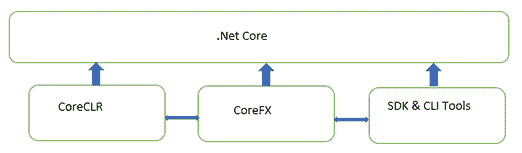
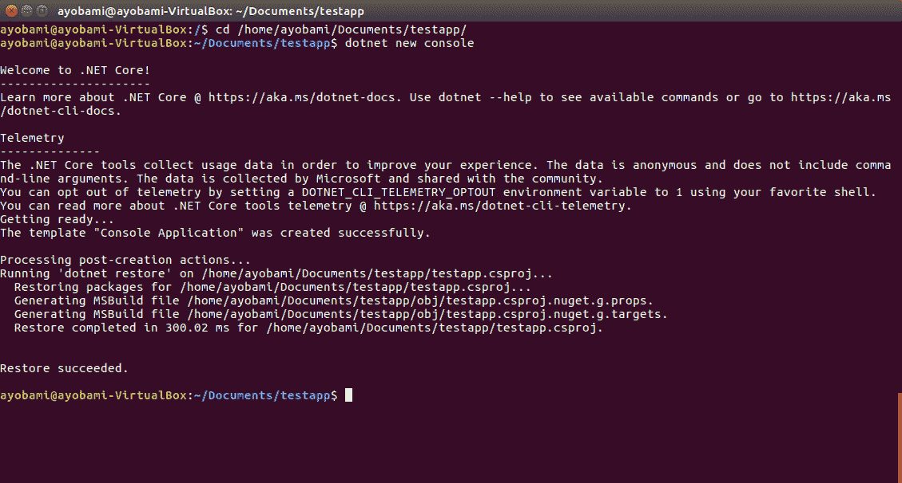
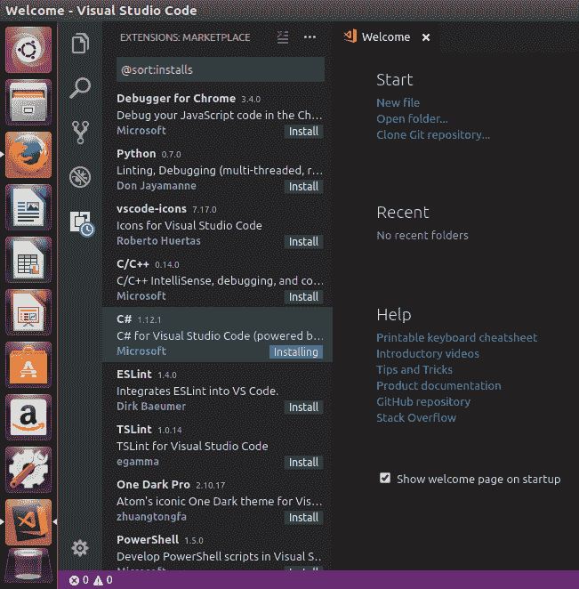
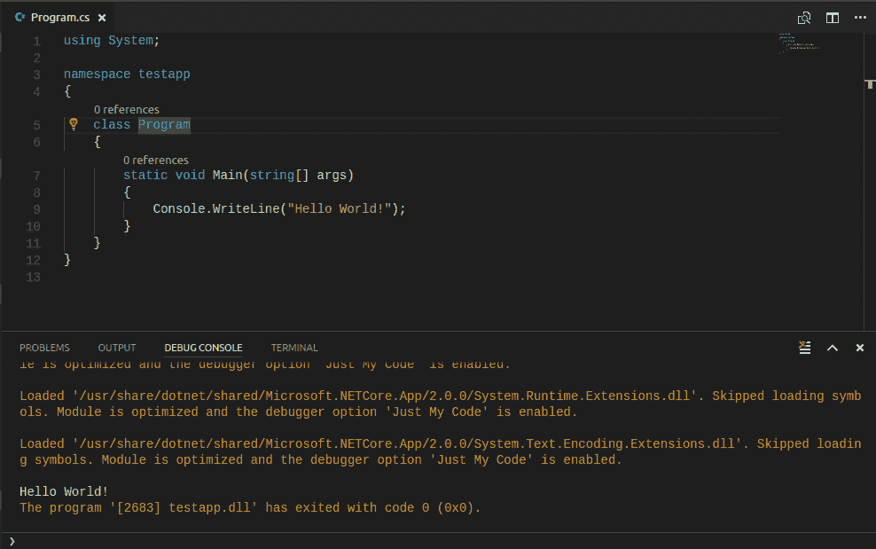
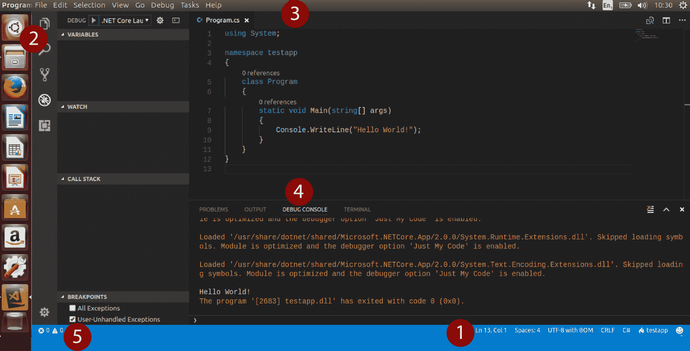
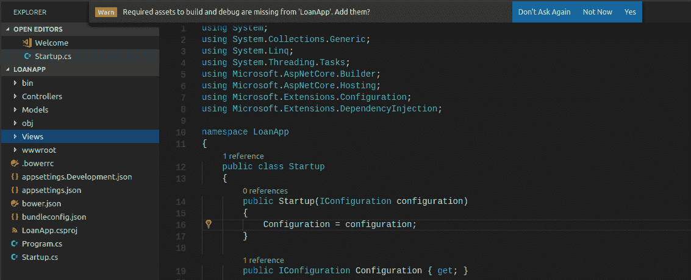
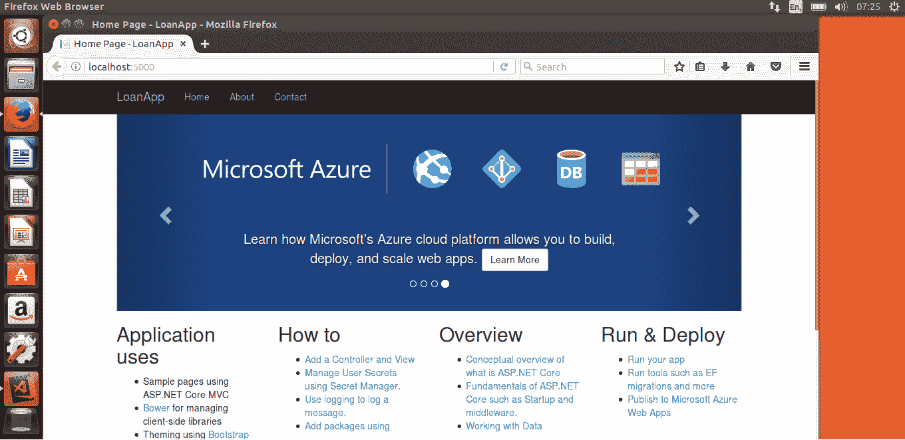

# .NET Core 入门

当微软发布。net Framework 的第一个版本时，它是一个用于创建、运行和部署服务和应用程序的平台，它改变了游戏规则，在微软开发社区中是一场革命。 该框架的初始版本开发了多个前沿应用程序，随后又发布了多个版本。

. net Framework 经过多年的发展和成熟，支持多种编程语言，并包含了一些特性，使平台上的编程变得简单和有价值。 但是，尽管该框架健壮且具有吸引力，但将应用程序的开发和部署限制在仅适用于 microsoft 操作系统的变体上还是存在局限性的。

为了为开发者创造一个云优化的、跨平台的。net Framework 实现，解决。net Framework 的局限性，微软开始使用。net Framework 开发一个。net Core 平台。 随着。net 1.0 版本的引入核心 2016 年,在。net 平台上的应用程序开发中扮演了一个新的维度,随着。net 开发人员现在可以构建应用程序工作在 Windows、Linux, macOS,和云,嵌入式,轻松和物联网设备。net 核心与。net 框架兼容,Xamarin 的, 以及通过。net 标准实现的 Mono。

本章将介绍。net Core 和 c# 7 超酷的跨平台新功能。 我们将在创建 ASP 的过程中学习。 NET MVC 应用程序在 Ubuntu Linux 上与 TDD。 在本章中，我们将涵盖以下主题:

*   net 核心框架
*   .NET Core 应用程序的结构
*   微软的 Visual Studio 代码编辑器之旅
*   看看 c# 7 的新特性
*   创建一个 ASP。 NET MVC 核心应用

# net 核心框架

**。net 核心**是一个跨平台的开源开发框架,它运行在 Windows、Linux 和 macOS 和交叉架构支持 x86, x64 和手臂。net 从。net 框架的核心是分叉的,技术上是后者的一个子集,但流线型的线条, . net Core 是一个开发平台，它为开发和部署应用程序提供了极大的灵活性。 新的平台将您从应用程序部署过程中经常遇到的麻烦中解放出来。 因此，您不必担心在部署服务器上管理应用程序运行时的版本。

目前，在版本 2.0.7 中，. net Core 包含了具有良好性能和许多特性的. net 运行时。 微软声称它是。net 平台最快的版本。 它有更多的 api，也添加了更多的项目模板，比如那些用于开发运行在。net Core 上的 ReactJS 和 AngularJS 应用程序的模板。 此外，Version 2.0.7 提供了一组命令行工具，使您能够轻松地在不同平台上构建和运行命令行应用程序，还简化了 Visual Studio for Macintosh 的打包和支持。 . net Core 的一个大副产品是跨平台模块化 web 框架 ASP。 NET Core，这是一个完全重新设计的 ASP。 NET 和运行在。NET Core 上。

. net 框架是健壮的，包含了几个用于应用程序开发的库。 然而，该框架的一些组件和库可以与 Windows 操作系统耦合。 例如，`System.Drawing`库依赖于 Windows GDI，这就是。net Framework 不能被认为是跨平台的原因，尽管它有不同的实现。

为了使。net Core 真正实现跨平台，对 Windows 操作系统有强烈依赖的组件，如 Windows Forms 和**Windows Presentation Foundation**(**WPF**)已经从平台上移除。 ASP。 NET Web 窗体和**Windows 通信基础**(**WCF**)也已被删除，取而代之的是 ASP。 asp.net 核心 MVC 和 asp.net。 NET Core Web API。 此外，**实体框架**(**EF**)已被精简为跨平台，并被命名为实体框架核心。

此外，由于. net Framework 对 Windows 操作系统的依赖，微软无法打开代码库。 然而，. net Core 是完全开源的，托管在 GitHub 上，拥有一个蓬勃发展的开发者社区，不断开发新功能并扩展平台的范围。

# net 标准

. net Standard**. net Standard**是一套由微软维护的规范和标准，所有。net 平台都必须遵守和实现这些规范和标准。 它正式地指定了。net 平台的所有变体都要实现的 api。 目前。net 平台上有三个开发平台。 NET Core、。NET Framework 和 Xamarin。 . net 平台需要提供一致性和一致性，并使在. net 平台的三种变体上共享代码和重用库更加容易。

. net 平台提供了一组统一的基类库 api 的定义，可以在所有. net 平台上实现，从而允许开发人员轻松地在。net 平台上开发应用程序和可重用库。 目前在 2.0.7 版本中，. net Standard 提供了新的 api，这些 api 在。net Core 的 1.0 版本中没有实现，但在 2.0 版本中实现了。 已经向运行时组件中添加了 20,000 多个 api。

此外，. net 标准是一个目标框架，这意味着你可以开发你的应用程序以。net 标准的特定版本为目标，允许应用程序在任何实现标准的。net 平台上运行，你可以轻松地在不同的。net 平台之间共享代码、库和二进制文件。 当你以。net 标准为目标构建应用程序时，你应该知道。net 标准的更高版本有更多可用的 api，但很多平台都没有实现这些 api。 我们总是建议你选择一个较低版本的标准，这将保证它被许多平台实现:


# net 核心组件

net 核心,作为一个通用的应用程序开发平台,由**CoreCLR**,**CoreFX**,**SDK 和 CLI 工具**、**应用程序宿主**,和【显示】dotnet 应用程序启动器:



CoreCLR，也被称为。net Core Runtime，是。net Core 的核心，是 CLR 的一个跨平台实现; 最初的。net Framework CLR 被重构为 CoreCLR。 CoreCLR 是公共语言运行库，它管理对象的使用和引用，以及用支持的不同编程语言编写的对象的通信和交互，并通过从内存中释放不再使用的对象来执行垃圾收集。 CoreCLR 包括以下内容:

*   垃圾收集器
*   **Just in Time**(**JIT**)编译器
*   本地互操作
*   基地。net 类型

CoreFX 是。net Core 的一组框架或基础库，它提供了基本数据类型、文件系统、应用程序组合类型、控制台和基本实用程序。 CoreFX 包含一个精简的类库。

. net Core SDK 包含一组工具，包括**命令行界面**(**CLI**)工具和编译器，用于构建运行在。net Core 上的应用程序和库。 SDK 工具和语言编译器提供了一些功能，让开发人员可以轻松访问 CoreFX 库支持的语言组件，从而使编码变得更容易、更快。

为了启动一个。net Core 应用程序，dotnet 应用程序主机是负责选择和托管应用程序所需运行时的组件。net Core 有一个控制台应用程序作为主要应用程序模型和其他应用程序模型，如 ASP。 NET Core, Windows 10 通用 Windows 平台和 Xamarin 窗体。

# 支持的语言

. net Core 1.0 只支持**c#**和**f#**，但随着。net Core 2.0 的发布，**VB。 NET**现在被该平台支持。 所支持语言的编译器运行在。net Core 上，并提供对平台底层特性的访问。 这是可能的，因为。net Core 实现了。net Standard 规范，并公开了。net Framework 中可用的 api。 支持的语言和. net SDK 工具可以集成到不同的编辑器和 ide 中，为开发应用程序提供不同的编辑器选项。

# 什么时候选择。net Core 而不是。net Framework

.NET Core 和.NET Framework 都非常适合用于*开发健壮且可扩展的企业应用*; 这是因为这两个平台都是建立在坚实的代码基础上的，并提供了丰富的库和例程集，可以简化大多数开发任务。 这两个平台共享许多相似的组件，因此代码可以在两个开发平台之间共享。 然而，这两个平台是不同的，. net Core 的选择有首选的开发平台，应该受到开发方法和部署需求的影响。

# 跨平台的要求

显然,当您正在开发的应用程序是运行在多个平台上,应该使用. net 核心。net 核心是跨平台的使它适合开发服务和 web 应用程序,可以运行在 Windows**,**Linux**,**macOS【5】。 同时,通过引入**【T7 Visual Studio 代码】通过微软成为一个编辑器完全支持。net 核心提供智能感知和调试功能,以及其他 IDE 特性,通常只能在 Visual Studio IDE【显示】**。****

# 易于部署

有了。net Core，你可以同时安装不同的版本，而使用。net Framework 则没有这个功能。 通过并排安装。net Core，多个应用程序可以安装在单个服务器上，使每个应用程序都能在自己的。net Core 版本上运行。 最近，人们对容器和应用程序容器化进行了大量的关注。 容器用于创建独立的软件应用程序包，包括使应用程序与共享操作系统上的其他应用程序隔离运行所需的运行时。 当使用。net Core 作为开发平台时，容器化。net 应用程序要好得多。 这是因为它支持跨平台，因此允许将应用程序部署到不同操作系统的容器中。 此外，用。net Core 创建的容器映像更小、更轻量级。

# 可伸缩性和性能

使用。net Core，开发使用微服务体系结构的应用程序相对容易一些。 通过微服务体系结构，您可以开发混合使用不同技术的应用程序，例如使用 PHP、Java 或 Rails 开发的服务。 您可以使用. net Core 开发部署在云平台或容器上的微服务。 使用。net Core，您可以开发可伸缩的应用程序，可以在高性能计算机或高端服务器上运行，允许您的应用程序轻松地服务于数十万用户。

# .NET Core 的局限性

虽然. net Core 是健壮的，易于使用，并且在应用程序开发中使用时提供了一些好处，但它目前并不适用于所有的开发问题和场景。 微软从。net Core 中放弃了一些。net Framework 中可用的技术，以使。net Framework 更加精简和跨平台。 正因为如此，这些技术无法在。net Core 中使用。

当应用程序将使用一个技术不可用。net 核心,例如使用 WPF 或 Windows 窗体的表示层,WCF 服务器实现,甚至第三方库,目前没有。net 核心版本,建议你最好使用。net 框架开发应用程序。

# .NET 核心应用程序的结构

随着。net Core 2.0 的发布，添加了新的模板，为可以在平台上运行的不同应用程序类型提供了更多的选项。 在现有项目模板的基础上，增加了以下**单页应用**(**SPA**)模板:

*   角
*   ReactJS
*   ReactJS 和回来的

. net Core 中的控制台应用程序与。net Framework 中的控制台应用程序具有类似的结构。 NET Core 有几个新的组件，包括以前 ASP.NET 版本中没有的文件夹和文件。

# ASP。 NET 核心 MVC 项目结构

ASP。 NET web 框架多年来已经完全成熟，从 web 表单过渡到 MVC 和 web API。 ASP。 NET core 是一个新的 web 框架，用于开发可以在。NET core 上运行的 web 应用程序和 web api。 它是一个更精简的 ASP 版本。 NET 很容易通过内置依赖注入进行部署。 ASP。 NET Core 可以与 AngularJS、Bootstrap 和 ReactJS 等框架集成。

ASP。 NET 核心 MVC，类似于 asp.net。 NET MVC，是用于构建 web 应用程序和 api 的框架，使用*模型视图控制器模式*。 像 ASP。 NET MVC，它支持模型绑定和验证，标签助手，并为 Razor 页面和 MVC 视图使用*Razor 语法*。

ASP 的结构。 asp.net 核心 MVC 应用程序不同于 asp.net 核心 MVC 应用程序。 NET MVC，添加了新的文件夹和文件。 当你创建一个新的 ASP。 从 Visual Studio 2017, Visual Studio for Mac，或通过解决方案资源管理器的 CLI 工具，您可以看到添加到项目结构的新组件。

# wwwroot 文件夹

在 ASP。 NET Core，新添加的`wwwroot`文件夹用于存放库和静态内容，如图像、JavaScript 文件和库，以及 CSS 和 HTML，以方便访问和直接服务于 web 客户端。 `wwwroot`文件夹包含`.css`、图像、`.js`和`.lib`文件夹，用于组织站点的静态内容。

# 模型、视图和控制器文件夹

类似于 ASP。 asp.net MVC 项目。 净 MVC 核心应用程序的根文件夹还包含**模型**、**,和**控制器,MVC 模式的会议后,适当分离的 web 应用程序文件、代码和表示逻辑。****

 **# JSON 文件- bower。 json, appsettings。 json, bundleconfig.json

其他`appsettings.json`介绍文件,其中包含所有应用程序设置,`bower.json`,其中包含的条目管理客户端包包括 CSS 和 JavaScript 框架中使用的项目,和`bundleconfig.json`,其中包含的条目配置项目捆绑和缩小。

# Program.cs

像 c#控制台应用程序一样，ASP。 NET Core 有`Program`类，它是一个重要的类，包含应用程序的入口点。 该文件具有用于运行应用程序的`Main()`方法，它用于创建用于为应用程序创建主机的`WebHostBuilder`实例。 应用程序要使用的`Startup`类在`Main`方法中指定:

```cs
 public class Program
 {
        public static void Main(string[] args)
        {
            BuildWebHost(args).Run();
        }

        public static IWebHost BuildWebHost(string[] args) =>
            WebHost.CreateDefaultBuilder(args)
                .UseStartup<Startup>()
                .Build();
    }
```

# Startup.cs

ASP 需要`Startup`类。 NET 核心应用程序来管理应用程序的请求管道、配置服务和依赖注入。

可以为不同的环境创建不同的`Startup`类; 例如，您可以在应用程序中创建两个`Startup`类，一个用于开发环境，另一个用于生产环境。 您还可以指定一个`Startup`类用于所有环境。

`Startup`类有两个方法:`Configure()`，它是强制性的，用于确定应用程序应该如何响应 HTTP 请求;`ConfigureServices()`，它是可选的，用于在`Configure`方法被调用之前配置服务。 这两个方法在应用程序启动时都被调用:

```cs
 public class Startup
    {
        public Startup(IConfiguration configuration)
        {
            Configuration = configuration;
        }

        public IConfiguration Configuration { get; }

        // This method gets called by the runtime. Use this method to add services to the container.
        public void ConfigureServices(IServiceCollection services)
        {
            services.AddMvc();
        }

        // This method gets called by the runtime. Use this method to configure the HTTP request pipeline.
        public void Configure(IApplicationBuilder app, IHostingEnvironment env)
        {
            if (env.IsDevelopment())
            {
                app.UseDeveloperExceptionPage();
            }
            else
            {
                app.UseExceptionHandler("/Home/Error");
            }

            app.UseStaticFiles();

            app.UseMvc(routes =>
            {
                routes.MapRoute(
                    name: "default",
                    template: "{controller=Home}/{action=Index}/{id?}");
            });
        }
    }

```

# 微软的 Visual Studio 代码编辑器之旅

开发。net 核心应用程序变得更加容易，这不仅是因为平台的流畅性和健壮性，还因为引入了**Visual Studio Code**，这是一个可以在 Windows、Linux 和 macOS 上运行的跨平台编辑器。 在。net Core 上创建应用程序之前，你不需要在你的系统上安装 Visual Studio IDE。

尽管 Visual Studio Code 没有 Visual Studio IDE 那样强大和功能丰富，但它确实拥有内置的生产力工具和特性，可以无缝地创建。net Core 应用程序。 您还可以从 Visual Studio Marketplace 安装多种编程语言的扩展到 Visual Studio Code，从而使您能够灵活地编辑用其他编程语言编写的代码。

# 在 Linux 上安装。net Core

为了展示。net Core 的跨平台特性，让我们在 Ubuntu 17.04 桌面版上设置一个。net Core 开发环境。 在安装 Visual Studio Code 之前，让我们先在**Ubuntu 操作系统**上安装。net Core。 首先，您需要对**Microsoft Product**提要进行一次性注册，在将 Microsoft Product 提要添加到系统之前先注册 Microsoft 签名密钥:

1.  启动系统终端，执行如下命令注册 Microsoft 签名密钥:

```cs
curl https://packages.microsoft.com/keys/microsoft.asc | gpg --dearmor > microsoft.gpg
sudo mv microsoft.gpg /etc/apt/trusted.gpg.d/microsoft.gpg
```

2.  用以下命令注册 Microsoft Product 提要:

```cs
sudo sh -c 'echo "deb [arch=amd64] https://packages.microsoft.com/repos/microsoft-ubuntu-zesty-prod zesty main" > /etc/apt/sources.list.d/dotnetdev.list
```

3.  在 Linux 操作系统上安装。net Core SDK 和开发。net Core 应用程序所需的其他组件时，需要执行如下命令:

```cs
sudo apt-get update
sudo apt-get install dotnet-sdk-2.0.0
```

4.  这些命令将更新系统，你应该会看到微软早先的存储库添加到 Ubuntu 将尝试从其中获取更新的存储库列表中。 更新后，. net Core 工具将被下载并安装到系统中。 在你的终端屏幕上显示的信息应该类似于下面的截图:


5.  安装完成后，在`Documents`文件夹中创建一个新文件夹，并将其命名为`testapp`。 将目录更改为新创建的文件夹，并创建一个新的控制台应用程序来测试安装。 请参见下面的命令，以及命令结果的屏幕截图:

```cs
cd /home/user/Documents/testapp
dotnet new console
```

这将得到以下输出:



6.  你会在终端上看到。net Core 正在创建项目和所需的文件。 项目创建成功后，`Restore succeeded`将显示在终端上。 在`testapp`文件夹中，框架将添加一个`obj`文件夹、`Program.cs`和`testapp.csproj`文件。
7.  您可以使用`dotnet run`命令继续运行控制台应用程序。 此命令将编译并运行工程，然后在终端上显示`Hello World!`。

# 在 Linux 上安装和设置 Visual Studio Code

Visual Studio Code 是一个跨平台的编辑器，可以安装在许多不同版本的 Linux 操作系统上，用于其他 Linux 发行版的软件包也在逐渐增加。 要在**Ubuntu**上安装 Visual Studio Code，请执行以下步骤:

1.  从[https://code.visualstudio.com/download](https://code.visualstudio.com/)下载 Ubuntu 和 Debian Linux 变种的`.deb`包。
2.  从终端安装下载的文件，该文件将安装编辑器、`apt`存储库和签名密钥，以确保在运行系统更新命令时可以自动更新编辑器:

```cs
sudo dpkg -i <package_name>.deb
sudo apt-get install -f
```

3.  成功安装后，您应该能够启动新安装的 Visual Studio Code 编辑器。 该编辑器的外观和感觉与 Visual Studio IDE 略有相似。

# 探索 Visual Studio 代码

在你的 Ubuntu 实例上成功安装 Visual Studio Code 之后，你需要执行初始环境设置，然后才能开始使用编辑器编写代码:

1.  从“开始”菜单启动 Visual Studio Code，并从 Visual Studio 市场安装 c#扩展到编辑器。 您可以通过按*Ctrl*+*Shift*+*X*启动扩展，通过 View 菜单点击扩展，直接点击扩展选项卡; 这将加载一个可用扩展列表，因此单击并安装 c#扩展。

2.  当扩展安装完成后，点击 Reload 按钮在编辑器中激活 c#扩展:



3.  打开先前创建的控制台应用程序的文件夹; ,点击文件菜单,选择打开文件夹或按*Ctrl*+*K*,*Ctrl + o*这将打开文件管理器; 浏览到文件夹的路径并单击打开。 这将在 Visual Studio Code 中加载项目的内容。 在后台，Visual Studio Code 将尝试下载所需的依赖 Linux 平台，Omnisharp 为 Linux 和。net 核心调试器:**

 **

4.  要创建新项目，您可以使用编辑器的集成终端，而不必通过系统终端。 单击“视图”菜单并选择“集成终端”。 这将在编辑器中打开 Terminal 选项卡，在那里你可以输入命令来创建一个新项目:


5.  在打开的项目中，您将看到一个通知，该通知要求资产构建和调试丢失的应用程序。 如果您单击 Yes，在资源管理器选项卡中，您可以看到添加了`launch.json`和`tasks.json`文件的`.vscode`树。 点击`Program.cs`文件将文件加载到编辑器中。 在“调试”菜单中选择“开始调试”或按*F5*运行应用程序; 你应该看到`Hello World!`显示在编辑器的调试控制台上:



当您启动 Visual Studio Code 时，它会以关闭时的状态加载，并打开您最后访问的文件和文件夹。 编辑器的布局很容易导航和工作，并带有如下区域:

*   状态栏显示您当前打开的文件的信息。
*   活动栏提供了访问资源管理器视图以查看项目文件夹和文件，以及访问源代码控制视图以管理项目的源代码版本。 用于监视变量、断点和调试相关活动的调试视图，搜索视图允许您搜索文件夹和文件。 扩展视图允许您查看可安装到编辑器中的可用扩展。
*   编辑器区域用于编辑项目文件，允许您同时打开三个文件进行编辑。
*   面板区域显示输出、调试控制台、终端和问题的不同面板:



# 看看 c# 7 的新特性

多年来，c#编程语言已经成熟了; 每个版本的发布都添加了更多的语言特性和结构。 一种最初只由微软自己开发、只在 Windows 操作系统上运行的语言，现在是开源和跨平台的。 这是通过. net Core 和该语言的 Version 7(7.0 和 7.1)实现的，它增加了风格并改进了该语言的可用特性。 该语言的路线图，特别是版本 7.2 和 8.0，承诺为该语言添加更多特性。

# 元组增强

元组**在版本 4 中引入 c#语言，并以简化的形式用于提供具有两个或更多数据元素的结构，允许您创建可以返回两个或更多数据元素的方法。 在 c# 7 之前，引用元组的元素是通过使用*Item1, Item2，… ItemN*，其中*N*是元组结构中的元素个数。 从 c# 7 开始，通过引入更干净、更有效的创建和使用元组的方法，元组现在支持对包含的字段进行语义命名。**

现在可以通过直接给每个成员赋值来创建元组。 这个任务创建了一个包含元素*Item1*，*Item2*的元组:

```cs
var names = ("John", "Doe");
```

你也可以为元组中包含的元素创建具有语义名称的元组:

```cs
(string firstName, string lastName) names = ("John", "Doe");
```

名称元组的字段不是*Item1*，*Item2*，而是可以在编译时引用的字段为`firstName`和`lastName`。

当使用 POCO 可能会过度使用时，你可以创建一个包含两个或更多数据元素的元组:

```cs
private (string, string) GetNames()
{
    (string firstName, string lastName) names = ("John", "Doe");
    return names;
}
```

# 从关键字

在 c#中，实参或形参可以通过引用或值传递。 当您通过引用将参数传递给方法、属性或构造函数时，参数的值将被更改，而当方法或构造函数超出范围时所做的更改将被保留。 通过使用`out`关键字，可以在 c#中将方法的参数作为引用传递。 在 c# 7 之前，要使用`out`关键字，你必须在将其作为`out`参数传递给方法之前声明一个变量:

```cs
class Program
{
    static void Main(string[] args)
    {
        string firstName, lastName;
        GetNames(out firstName, out lastName);
    }
    private static void GetNames(out string firstName, out string lastName)
    {
        firstName="John";
        lastName="Doe";
    }
}
```

在 c# 7 中，你现在可以将变量传递给一个方法，而不需要首先声明变量，前面的代码片段现在看起来如下所示，这可以防止你错误地在变量被赋值或初始化之前使用它们，并使代码清晰:

```cs
class Program
{
    static void Main(string[] args)
    {
        GetNames(out string firstName, out string lastName);
    }
    private static void GetNames(out string firstName, out string lastName)
    {
        firstName="John";
        lastName="Doe";
    }
}
```

语言中增加了对隐式类型 out 变量的支持，允许编译器推断变量的类型:

```cs
class Program
{
    static void Main(string[] args)
    {
        GetNames(out var firstName, out var lastName);
    }
    private static void GetNames(out string firstName, out string lastName)
    {
        firstName="John";
        lastName="Doe";
    }
}
```

# 参考局部值和返回值

c#语言一直有`ref`关键字，它允许您使用并返回对其他地方定义的变量的引用。 c# 7 增加了另一个特性，`ref`局部变量和`returns`，这提高了性能，并允许您声明在该语言的早期版本中不可能实现的 helper 方法。 `ref`locals 和`returns`关键字有一些限制—不能与`async`方法一起使用它们，并且不能返回具有相同执行范围的变量的引用。

# Ref 当地人

通过使用`ref`关键字声明局部变量，并在方法调用或赋值之前添加`ref`关键字，`ref`local 关键字允许在局部变量中存储引用。 例如，在下面的代码中，`day`字符串变量引用`dayOfWeek`; 改变`day`的值也会改变`dayOfWeek`的值，反之亦然:

```cs
string dayOfWeek = "Sunday";
ref string day = ref dayOfWeek;
Console.WriteLine($"day-{day}, dayOfWeek-{dayOfWeek}");
day = "Monday";
Console.WriteLine($"day-{day}, dayOfWeek-{dayOfWeek}");
dayOfWeek = "Tuesday";
Console.WriteLine($"day-{day}, dayOfWeek-{dayOfWeek}");

-----------------
Output:

day: Sunday
dayOfWeek:  Sunday

day: Monday
dayOfWeek:  Monday

day: Tuesday
dayOfWeek:  Tuesday
```

# Ref 的回报

您还可以使用`ref`关键字作为方法的返回类型。 为此，将`ref`关键字添加到方法签名中，并在方法主体内部，在`return`关键字之后添加`ref`。 在下面的代码片段中，声明并初始化了一个字符串数组。 然后，该方法将字符串数组的第五个元素作为引用返回:

```cs
public ref string GetFifthDayOfWeek()
{
    string [] daysOfWeek= new string [7] {"Monday", "Tuesday", "Wednesday", "Thursday", "Friday", "Saturday", "Sunday"};
    return ref daysOfWeek[4];
}
```

# 本地函数

本地或**嵌套函数**，允许在另一个函数中定义一个函数。 这个特性在一些编程语言中已经存在很多年了，但是只是在 c# 7 中引入的。 当你需要一个很小且不能在`container`方法上下文之外重用的函数时，最好使用它:

```cs
class Program
{
    static void Main(string[] args)
    {
        GetNames(out var firstName, out var lastName); 

        void GetNames(out string firstName, out string lastName)
        {
            firstName="John";
            lastName="Doe";
        }
    }
}
```

# 模式匹配

c# 7 包含模式，这是一种语言元素特性，允许您在对象类型之外的属性上执行方法分派。 它扩展了已经在覆盖和虚拟方法中实现的语言构造，用于实现类型和数据元素的分派。 该语言的 Version 7.0 中已经更新了`is`和`switch`表达式，以支持**模式匹配**，因此现在可以使用这些表达式来确定感兴趣的对象是否具有特定的模式。

使用`is`模式表达式，您现在可以编写包含例程的代码，这些例程的算法操作具有不相关类型的元素。 除了能够测试类型之外，`is`表达式现在还可以用于模式。

引入的模式匹配可以采用三种形式:

*   **类型模式**:这需要在将对象的值提取到表达式中定义的新变量之前检查对象是否为类型:

```cs
public void ProcessLoan(Loan loan)
{
    if(loan is CarLoan carLoan)
    {
        // do something
    }
}
```

*   **Var 模式**:创建一个与对象类型相同的新变量，并赋值:

```cs
public void ProcessLoan(Loan loan)
{
    if(loan is var carLoan)
    {
        // do something
    }
}
```

*   **常量模式**:检查提供的对象是否等效于常量表达式:

```cs
public void ProcessLoan(Loan loan)
{
    if(loan is null)
    {
        // do something
    }
}
```

有了更新的 switch 表达式，你现在可以在 case cause 中使用模式和条件，并在允许你使用 when 关键字为模式额外指定规则的同时，打开基础类型或基本类型之外的任何类型:

```cs
public void ProcessLoan(Loan loan)
{
    switch(loan)
    {
        case CarLoan carLoan:
            // do something
            break;
        case HouseLoan houseLoan when (houseLoan.IsElligible==true):
            //do something
            break;
        case null:
            //throw some custom exception
            break;
        default:
            // do something       
    }
}
```

# 数字分隔符和二进制文字

c# 7 中添加了一个新的句法糖，即**数字分隔符**。 这种结构极大地提高了代码的可读性，尤其是在处理 c#中支持的大量不同的数字类型时。 在 c# 7 之前，使用分隔符来处理大的数值有点混乱和不可读。 随着数字分隔符的引入，您现在可以使用下划线(`_`)作为数字分隔符:

```cs
var longDigit = 2_300_400_500_78;
```

这个版本中还新引入了**二进制字面值**。 您现在可以通过简单地将`0b`作为二进制值的前缀来创建二进制字面量:

```cs
var binaryValue = 0b11101011;
```

# 创建一个 ASP。 NET MVC 核心应用

ASP。 NET Core 提供了一种优雅的方式来构建运行在 Windows、Linux 和 macOS 上的 web 应用程序和 api，这是由于。NET Core 平台的工具和 SDK 简化了尖端应用程序的开发，并支持与应用程序版本并行。 ASP。 NET Core，你的应用程序有一个更小的表面积，这提高了性能，因为你只需要包含运行你的应用程序所需的 NuGet 包。 ASP。 NET Core 还可以与客户端库和框架集成，允许你使用你已经熟悉的 CSS 和 JS 库来开发 web 应用。

ASP。 NET Core 使用 Kestrel 运行，Kestrel 是 asp.net 中包含的一个 web 服务器。 NET 核心项目模板。 Kestrel 是一个基于**libuv**的进程内跨平台 HTTP 服务器实现，libuv 是一个跨平台异步 I/O 库。 NET Core 应用程序更简单。 它侦听 HTTP 请求，然后将请求细节和特性打包到一个`HttpContext`对象中。 Kestrel 可以作为一个独立的 web 服务器使用，也可以与 IIS 或 Apache web 服务器一起使用，在这些服务器上，其他 web 服务器接收到的请求会被转发到 Kestrel，这是一个被称为反向代理的概念。

**NET MVC Core**为使用*模型视图控制器*模式的现代 web 应用程序开发提供了一个可测试的框架，它允许您充分实践测试驱动的开发。 新添加到 ASP。 NET 2.0 是对 Razor 页面的支持，它现在是开发 ASP 用户界面的推荐方法。 NET 核心 web 应用程序。

创建一个新的 ASP。 NET MVC 核心项目:

1.  打开 Visual Studio Code 并通过从“视图”菜单中选择“集成终端”来访问集成终端面板。 在终端中执行如下命令:

```cs
cd /home/<user>/Documents/
mkdir LoanApp
cd LoanApp
dotnet new mvc
```

2.  创建应用程序之后，使用 Visual Studio Code 打开项目的文件夹并选择`Startup.cs`文件。 你应该注意到屏幕顶部栏的一个通知，“LoanApp”缺少构建和调试所需的资产。 添加他们吗?; 选择 Yes:



3.  按*F5*构建并运行 MVC 应用程序。 这告诉 Kestrel web 服务器运行应用程序，并在计算机上使用`http://localhost:5000`地址启动默认浏览器:



# 总结

. net Core 平台虽然很新，但正在迅速成熟，版本 2.0.7 引入了许多特性和增强，简化了构建不同类型的跨平台应用程序。 在本章中，我们参观了这个平台，介绍了 c# 7 的新特性，并在 Ubuntu Linux 上建立了一个开发环境，同时创建了我们的第一个 ASP。 NET MVC 核心应用程序。

在下一章中，我们将解释为了避免编写不可测试的代码需要注意什么，然后我们将带你通过 SOLID 原则来帮助你编写可测试的和高质量的代码。****